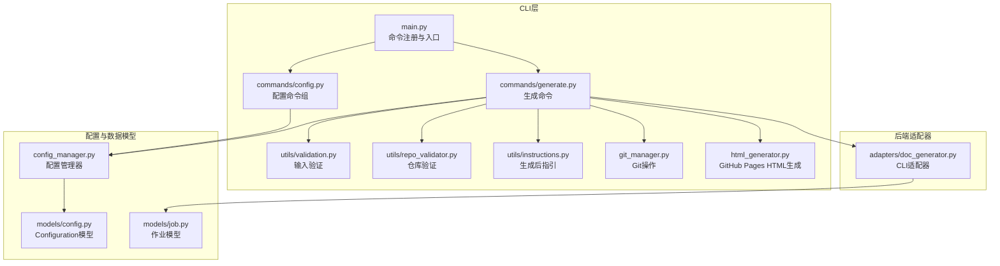
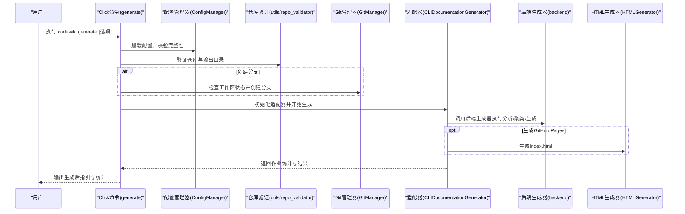
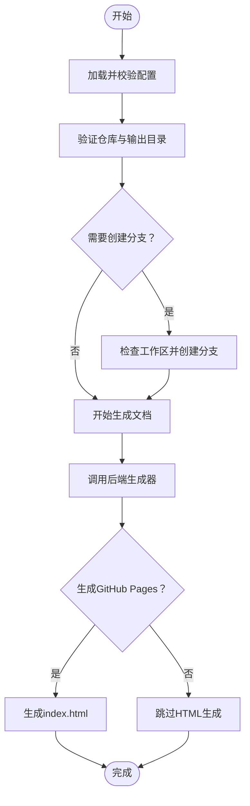
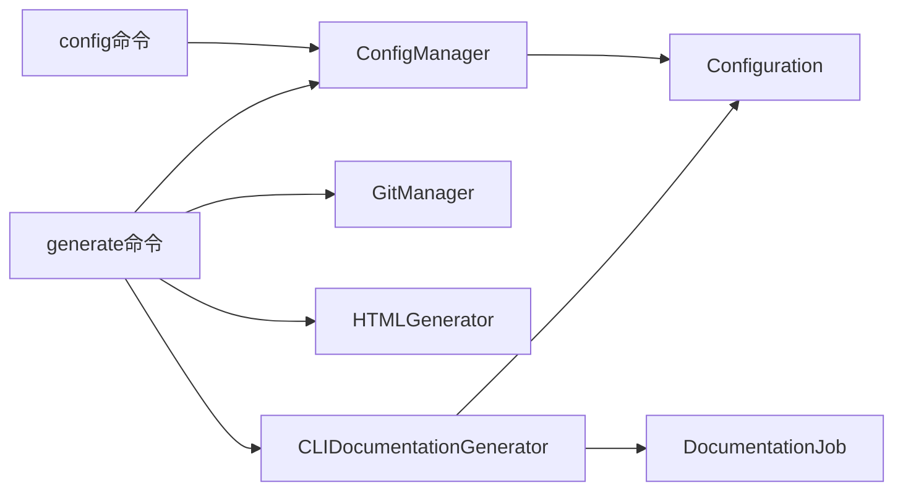

# CLI工具使用

<cite>
**本文档引用的文件**
- [main.py](file://codewiki/cli/main.py)
- [config.py](file://codewiki/cli/commands/config.py)
- [generate.py](file://codewiki/cli/commands/generate.py)
- [config_manager.py](file://codewiki/cli/config_manager.py)
- [config.py](file://codewiki/cli/models/config.py)
- [job.py](file://codewiki/cli/models/job.py)
- [doc_generator.py](file://codewiki/cli/adapters/doc_generator.py)
- [validation.py](file://codewiki/cli/utils/validation.py)
- [repo_validator.py](file://codewiki/cli/utils/repo_validator.py)
- [instructions.py](file://codewiki/cli/utils/instructions.py)
- [git_manager.py](file://codewiki/cli/git_manager.py)
- [html_generator.py](file://codewiki/cli/html_generator.py)
</cite>

## 目录
1. [简介](#简介)
2. [项目结构](#项目结构)
3. [核心组件](#核心组件)
4. [架构总览](#架构总览)
5. [详细组件分析](#详细组件分析)
6. [依赖关系分析](#依赖关系分析)
7. [性能考虑](#性能考虑)
8. [故障排除指南](#故障排除指南)
9. [结论](#结论)

## 简介
本文件面向使用者与开发者，系统性阐述 CodeWiki CLI 的命令体系与实现机制。重点覆盖：
- 配置命令组（config）：set、show、validate 子命令及参数详解
- 文档生成命令（generate）：输出目录、分支创建、GitHub Pages、缓存策略与详细模式等选项
- 安全配置存储：系统凭据管理器（Keychain/Credential Manager/Secret Service）的集成与降级策略
- CLI 与后端交互：通过适配器桥接前端命令与后端生成器，实现进度跟踪与统计收集

## 项目结构
CLI 采用 Click 框架组织命令，按功能模块划分：
- 命令入口与注册：main.py
- 命令实现：commands/config.py、commands/generate.py
- 配置管理：config_manager.py、models/config.py
- 工具与验证：utils/validation.py、utils/repo_validator.py、utils/instructions.py
- Git 集成：git_manager.py
- HTML 生成：html_generator.py
- 后端适配器：adapters/doc_generator.py
- 作业模型：models/job.py

图表来源
- [main.py](file://codewiki/cli/main.py#L34-L39)
- [config.py](file://codewiki/cli/commands/config.py#L26-L29)
- [generate.py](file://codewiki/cli/commands/generate.py#L34-L68)
- [config_manager.py](file://codewiki/cli/config_manager.py#L26-L41)
- [doc_generator.py](file://codewiki/cli/adapters/doc_generator.py#L26-L72)

章节来源
- [main.py](file://codewiki/cli/main.py#L12-L39)

## 核心组件
- Click 命令注册：在主入口定义 group 与 version，并导入子命令模块进行注册
- 配置管理器：负责配置文件读写与系统密钥环（keyring）的 API 密钥存储
- 生成适配器：封装后端生成器，提供进度跟踪、日志控制与 HTML 生成
- 作业模型：记录生成过程的状态、统计信息与结果

章节来源
- [main.py](file://codewiki/cli/main.py#L34-L39)
- [config_manager.py](file://codewiki/cli/config_manager.py#L26-L41)
- [doc_generator.py](file://codewiki/cli/adapters/doc_generator.py#L26-L72)
- [job.py](file://codewiki/cli/models/job.py#L48-L84)

## 架构总览
CLI 通过 Click 将用户输入解析为具体命令，随后调用对应的处理函数。生成流程的关键路径如下：

图表来源
- [generate.py](file://codewiki/cli/commands/generate.py#L69-L275)
- [config_manager.py](file://codewiki/cli/config_manager.py#L51-L83)
- [git_manager.py](file://codewiki/cli/git_manager.py#L73-L122)
- [doc_generator.py](file://codewiki/cli/adapters/doc_generator.py#L114-L165)
- [html_generator.py](file://codewiki/cli/html_generator.py#L83-L172)

## 详细组件分析

### 配置命令组（config）
- 组名：config
- 子命令：
  - set：设置配置项（API 密钥、基础 URL、主模型、聚类模型、回退模型、语言）
  - show：显示当前配置（支持 JSON 输出）
  - validate：验证配置并可选测试 API 连通性

#### config set 子命令
- 参数与用途
  - --api-key：LLM API 密钥，安全存储于系统凭据管理器（macOS Keychain、Windows Credential Manager、Linux Secret Service）
  - --base-url：LLM API 基础地址（例如 https://api.anthropic.com）
  - --main-model：文档生成主模型名称
  - --cluster-model：模块聚类使用的模型（建议顶级模型以获得更佳质量）
  - --fallback-model：文档生成回退模型名称
  - --language：生成文档的语言（english/chinese），默认 english
- 行为要点
  - 至少需要提供一个参数；否则提示帮助信息
  - 对输入进行格式与有效性校验（URL、API 密钥长度、模型名称）
  - 使用 ConfigManager 保存配置；API 密钥优先存入 keyring，若不可用则加密文件存储
  - 若聚类模型非顶级模型，会给出质量警告与推荐模型列表
- 示例
  - 设置全部配置：codewiki config set --api-key <密钥> --base-url <URL> --main-model <模型> --cluster-model <模型> --fallback-model <模型>
  - 仅更新 API 密钥：codewiki config set --api-key <新密钥>

章节来源
- [config.py](file://codewiki/cli/commands/config.py#L32-L174)
- [validation.py](file://codewiki/cli/utils/validation.py#L13-L53)
- [validation.py](file://codewiki/cli/utils/validation.py#L55-L79)
- [validation.py](file://codewiki/cli/utils/validation.py#L82-L98)
- [config_manager.py](file://codewiki/cli/config_manager.py#L84-L165)

#### config show 子命令
- 参数
  - --json：以 JSON 格式输出配置详情
- 输出内容
  - API 密钥（已掩码显示，仅保留首尾若干字符）
  - API 密钥存储位置（系统 keychain 或加密文件）
  - 基础 URL、主模型、聚类模型、回退模型、语言
  - 默认输出目录与配置文件路径
- 行为要点
  - 若未找到配置文件，提示运行 config set 完成初始化
  - 支持人类可读与 JSON 两种输出格式

章节来源
- [config.py](file://codewiki/cli/commands/config.py#L176-L262)

#### config validate 子命令
- 参数
  - --quick：跳过 API 连通性测试，仅验证配置文件与字段格式
  - --verbose：显示详细验证步骤
- 验证流程
  1) 检查配置文件存在与 JSON 格式有效
  2) 检查 API 密钥是否存在（从 keyring 获取）
  3) 校验 base_url 格式
  4) 校验主/聚类/回退模型是否配置完整
  5) 可选：发起 API 列表模型请求以测试连通性
- 行为要点
  - 非顶级聚类模型会给出质量警告
  - 失败时返回相应错误码并退出

章节来源
- [config.py](file://codewiki/cli/commands/config.py#L265-L412)

#### 配置安全存储机制
- API 密钥存储位置
  - 优先：系统凭据管理器（keyring）
  - 降级：本地加密文件（当 keyring 不可用时）
- 存储标识
  - 服务名：codewiki
  - 账户名：api_key
- 配置文件
  - 位置：~/.codewiki/config.json
  - 版本：1.0
  - 内容：除 API 密钥外的其余配置项

章节来源
- [config_manager.py](file://codewiki/cli/config_manager.py#L16-L23)
- [config_manager.py](file://codewiki/cli/config_manager.py#L42-L49)
- [config_manager.py](file://codewiki/cli/config_manager.py#L74-L78)
- [config_manager.py](file://codewiki/cli/config_manager.py#L144-L153)

### 文档生成命令（generate）
- 命令名：generate
- 主要选项
  - --output/-o：生成文档的输出目录，默认 docs
  - --create-branch：在 Git 仓库中创建新的文档分支
  - --github-pages：生成 GitHub Pages 兼容的 index.html
  - --no-cache：强制全量重新生成，忽略缓存
  - --verbose/-v：显示详细进度与调试信息
  - --language：覆盖配置中的语言设置
- 处理流程
  1) 配置加载与校验：确保配置文件存在且完整
  2) 仓库验证：检测支持的语言与文件数量，确认输出目录可写
  3) Git 分支创建（可选）：检查工作区状态并创建带时间戳的分支
  4) 生成文档：构建适配器并调用后端生成器，支持进度跟踪与统计
  5) HTML 生成（可选）：生成 index.html 用于 GitHub Pages
  6) 生成后指引：输出下一步操作建议与统计信息

章节来源
- [generate.py](file://codewiki/cli/commands/generate.py#L34-L97)
- [generate.py](file://codewiki/cli/commands/generate.py#L104-L275)

#### 生成流程图

图表来源
- [generate.py](file://codewiki/cli/commands/generate.py#L104-L224)
- [doc_generator.py](file://codewiki/cli/adapters/doc_generator.py#L114-L165)
- [html_generator.py](file://codewiki/cli/html_generator.py#L83-L172)

#### 高级使用示例
- 基础生成：codewiki generate
- 创建分支并生成 GitHub Pages：codewiki generate --create-branch --github-pages
- 强制全量生成（忽略缓存）：codewiki generate --no-cache
- 指定输出目录并启用详细模式：codewiki generate --output docs/my-project --verbose
- 覆盖语言设置：codewiki generate --language chinese

章节来源
- [generate.py](file://codewiki/cli/commands/generate.py#L84-L97)

### CLI 与后端交互（适配器）
- 适配器职责
  - 接收 CLI 传入的配置与选项
  - 控制后端生成器的执行阶段（依赖分析、模块聚类、文档生成）
  - 记录作业统计与状态
  - 可选生成 HTML 静态页面
- 关键交互点
  - 从 CLI 读取 LLM 配置（主模型、聚类模型、基础 URL、API 密钥）
  - 将生成的统计信息写入作业对象
  - 在生成 HTML 时自动加载 module_tree.json 与 metadata.json

章节来源
- [doc_generator.py](file://codewiki/cli/adapters/doc_generator.py#L26-L72)
- [doc_generator.py](file://codewiki/cli/adapters/doc_generator.py#L114-L165)
- [doc_generator.py](file://codewiki/cli/adapters/doc_generator.py#L258-L287)
- [job.py](file://codewiki/cli/models/job.py#L48-L84)

## 依赖关系分析
- 命令到配置：generate 与 config 命令均依赖 ConfigManager 进行配置读取与校验
- 生成流程：generate 命令依赖 GitManager（可选）、HTMLGenerator（可选）、CLIDocumentationGenerator（必需）
- 数据模型：Configuration 与 DocumentationJob 提供跨层的数据契约
- 工具函数：validation 与 repo_validator 提供输入与仓库层面的保障

图表来源
- [generate.py](file://codewiki/cli/commands/generate.py#L109-L220)
- [config.py](file://codewiki/cli/commands/config.py#L118-L128)
- [config_manager.py](file://codewiki/cli/config_manager.py#L84-L165)
- [doc_generator.py](file://codewiki/cli/adapters/doc_generator.py#L132-L141)
- [job.py](file://codewiki/cli/models/job.py#L48-L84)

章节来源
- [generate.py](file://codewiki/cli/commands/generate.py#L109-L220)
- [config.py](file://codewiki/cli/commands/config.py#L118-L128)
- [config_manager.py](file://codewiki/cli/config_manager.py#L84-L165)

## 性能考虑
- 缓存策略：--no-cache 可强制全量生成，避免缓存影响；正常情况下后端会利用中间产物提升效率
- 日志级别：在非详细模式下抑制后端日志噪声，减少 I/O 开销
- 令牌统计：适配器汇总后端与聚类阶段的令牌用量，便于成本控制与优化
- 并发与异步：后端生成器使用异步接口，适配器内部串行阶段化推进，避免阻塞

[本节为通用指导，不直接分析特定文件]

## 故障排除指南
- 配置缺失或不完整
  - 现象：提示配置不存在或不完整
  - 处理：运行 codewiki config set 完成初始化，并使用 codewiki config validate 进行验证
- API 密钥问题
  - 现象：keyring 不可用或密钥未设置
  - 处理：确保系统凭据管理器可用；若不可用，CLI 会提示加密文件存储方案
- 仓库无效
  - 现象：未检测到受支持的代码文件
  - 处理：切换到包含支持语言代码的目录，或确认扩展名匹配
- 输出目录不可写
  - 现象：无法创建或写入输出目录
  - 处理：赋予父目录写权限或选择其他可写路径
- Git 分支创建失败
  - 现象：工作区存在未提交更改
  - 处理：先提交或暂存更改，再重试

章节来源
- [generate.py](file://codewiki/cli/commands/generate.py#L110-L122)
- [generate.py](file://codewiki/cli/commands/generate.py#L143-L151)
- [generate.py](file://codewiki/cli/commands/generate.py#L177-L188)
- [repo_validator.py](file://codewiki/cli/utils/repo_validator.py#L60-L67)
- [repo_validator.py](file://codewiki/cli/utils/repo_validator.py#L94-L112)
- [config_manager.py](file://codewiki/cli/config_manager.py#L146-L153)

## 结论
CodeWiki CLI 通过清晰的命令分层与健壮的配置管理，实现了从本地仓库到文档生成的完整链路。其特性包括：
- 安全的凭据存储与降级策略
- 丰富的生成选项与可选的 GitHub Pages 集成
- 严谨的输入与仓库验证
- 透明的统计与生成后指引

建议在生产环境中：
- 使用 config validate --quick 进行快速自检
- 在 Git 仓库中启用 --create-branch 以隔离文档变更
- 通过 --github-pages 一键生成静态页面
- 使用 --verbose 调试复杂问题