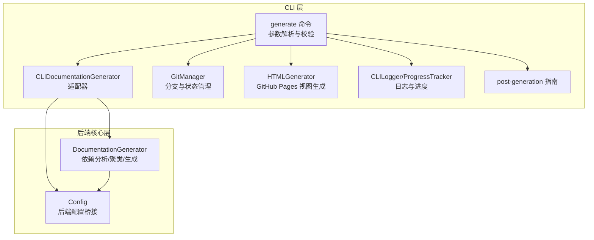
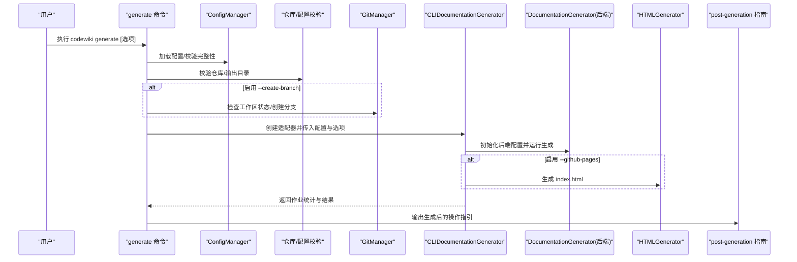
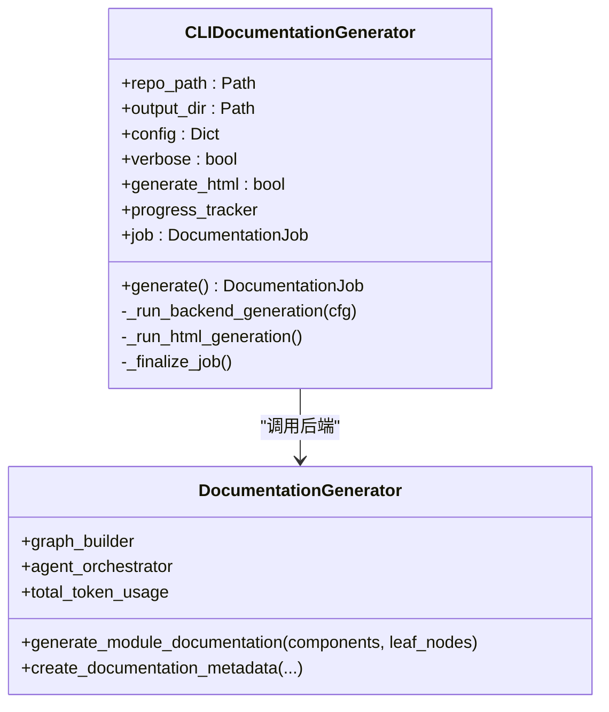
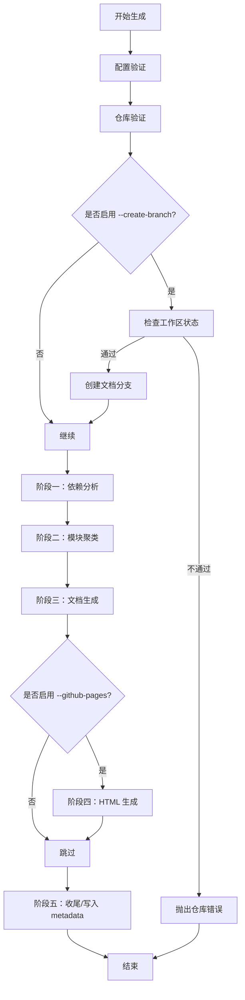
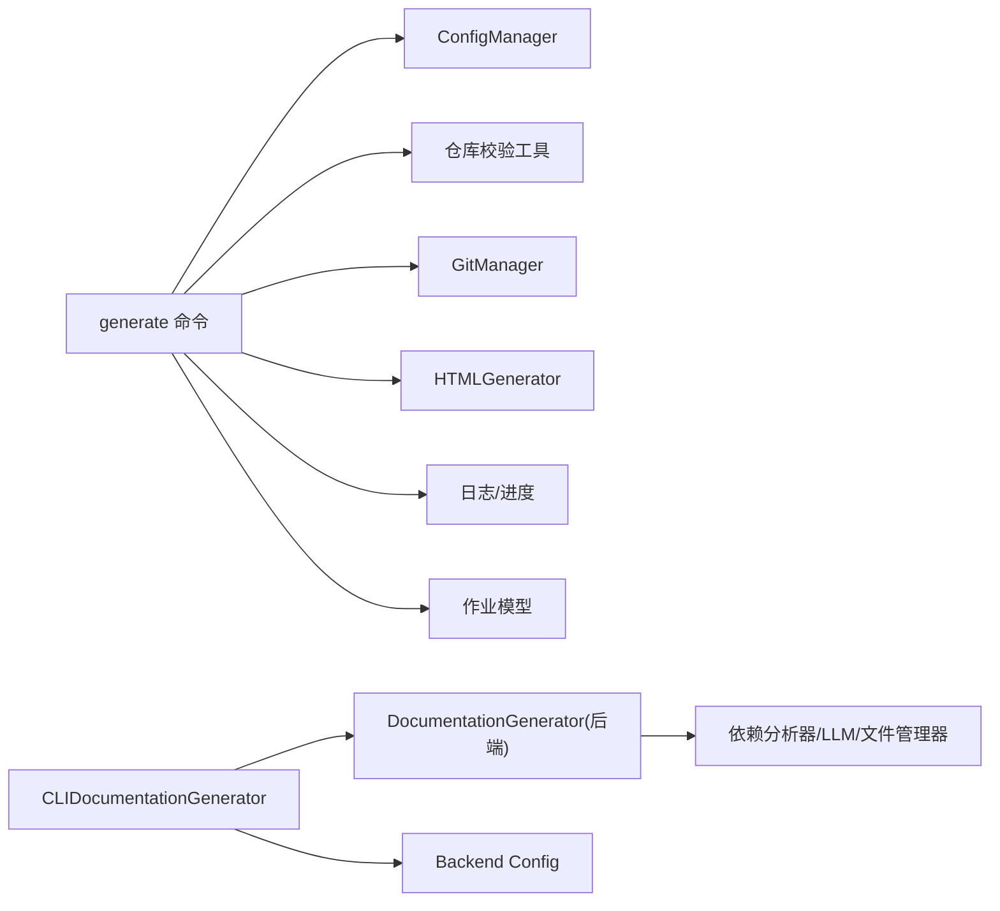

# 文档生成

<cite>
**本文引用的文件**
- [generate.py](file://codewiki/cli/commands/generate.py)
- [doc_generator.py](file://codewiki/cli/adapters/doc_generator.py)
- [job.py](file://codewiki/cli/models/job.py)
- [validation.py](file://codewiki/cli/utils/validation.py)
- [repo_validator.py](file://codewiki/cli/utils/repo_validator.py)
- [logging.py](file://codewiki/cli/utils/logging.py)
- [progress.py](file://codewiki/cli/utils/progress.py)
- [instructions.py](file://codewiki/cli/utils/instructions.py)
- [git_manager.py](file://codewiki/cli/git_manager.py)
- [html_generator.py](file://codewiki/cli/html_generator.py)
- [documentation_generator.py](file://codewiki/src/be/documentation_generator.py)
- [config_manager.py](file://codewiki/cli/config_manager.py)
- [config.py](file://codewiki/cli/models/config.py)
</cite>

## 目录
1. [简介](#简介)
2. [项目结构](#项目结构)
3. [核心组件](#核心组件)
4. [架构总览](#架构总览)
5. [详细组件分析](#详细组件分析)
6. [依赖关系分析](#依赖关系分析)
7. [性能考量](#性能考量)
8. [故障排查指南](#故障排查指南)
9. [结论](#结论)
10. [附录](#附录)

## 简介
本文件面向开发者与高级用户，系统性阐述 CodeWiki CLI 的文档生成功能。重点包括：
- generate 命令及其全部选项：--output、--create-branch、--github-pages、--no-cache、--verbose、--language
- 四个阶段的生成流程：配置验证、仓库验证、Git 分支创建（可选）、文档生成
- CLIDocumentationGenerator 适配器如何与后端核心功能交互
- 使用 generate.py 中的进度日志、错误处理与用户确认机制
- 高级用法示例与生成后的操作指引

## 项目结构
该功能由 CLI 层与后端核心层协作完成：
- CLI 层负责命令解析、参数校验、进度日志、错误处理、Git 分支管理、HTML 生成与用户指引
- 后端核心层负责依赖分析、模块聚类、文档生成与元数据写入

图表来源
- [generate.py](file://codewiki/cli/commands/generate.py#L34-L276)
- [doc_generator.py](file://codewiki/cli/adapters/doc_generator.py#L26-L298)
- [git_manager.py](file://codewiki/cli/git_manager.py#L14-L228)
- [html_generator.py](file://codewiki/cli/html_generator.py#L13-L285)
- [documentation_generator.py](file://codewiki/src/be/documentation_generator.py#L29-L200)

章节来源
- [generate.py](file://codewiki/cli/commands/generate.py#L34-L276)
- [doc_generator.py](file://codewiki/cli/adapters/doc_generator.py#L26-L298)

## 核心组件
- generate 命令：解析参数、执行四阶段流程、调用适配器与工具模块、输出操作指引
- CLIDocumentationGenerator：封装后端 DocumentationGenerator，提供进度跟踪、日志控制与 HTML 生成
- GitManager：在启用 --create-branch 时进行工作区状态检查与分支创建
- HTMLGenerator：基于模板生成 GitHub Pages 可视化页面
- 日志与进度：CLILogger 与 ProgressTracker 提供步骤化与阶段化反馈
- 作业模型：DocumentationJob/GenerationOptions/LLMConfig/JobStatistics 记录生成过程与统计

章节来源
- [generate.py](file://codewiki/cli/commands/generate.py#L34-L276)
- [doc_generator.py](file://codewiki/cli/adapters/doc_generator.py#L26-L298)
- [job.py](file://codewiki/cli/models/job.py#L21-L157)
- [git_manager.py](file://codewiki/cli/git_manager.py#L14-L228)
- [html_generator.py](file://codewiki/cli/html_generator.py#L13-L285)
- [logging.py](file://codewiki/cli/utils/logging.py#L11-L86)
- [progress.py](file://codewiki/cli/utils/progress.py#L11-L223)

## 架构总览
下图展示了 generate 命令从参数解析到最终输出的端到端流程，以及与后端核心的交互路径。

图表来源
- [generate.py](file://codewiki/cli/commands/generate.py#L98-L256)
- [doc_generator.py](file://codewiki/cli/adapters/doc_generator.py#L114-L165)
- [git_manager.py](file://codewiki/cli/git_manager.py#L73-L122)
- [html_generator.py](file://codewiki/cli/html_generator.py#L83-L172)

## 详细组件分析

### generate 命令与选项
- --output/-o：指定输出目录，默认 docs；会进行可写性检查
- --create-branch：创建带时间戳的文档分支，要求工作区干净
- --github-pages：生成 index.html 用于 GitHub Pages 查看
- --no-cache：忽略缓存，强制全量重生成
- --verbose/-v：显示详细日志与后端调试信息
- --language：覆盖配置中的语言设置，支持 english/chinese

生成流程四阶段：
1) 配置验证：加载并校验配置，必要时提示初始化
2) 仓库验证：检测仓库路径、语言类型、输出目录可写性
3) Git 分支创建（可选）：检查工作区状态，创建分支
4) 文档生成：构建适配器，运行后端生成，可选生成 HTML，输出指引

章节来源
- [generate.py](file://codewiki/cli/commands/generate.py#L34-L97)
- [generate.py](file://codewiki/cli/commands/generate.py#L104-L256)

### CLIDocumentationGenerator 适配器
- 职责：桥接 CLI 与后端核心，提供进度跟踪、日志控制、HTML 生成与作业记录
- 关键行为：
  - 初始化后端配置（主模型、聚类模型、基础 URL、API Key、语言）
  - 运行后端三阶段生成：依赖分析、模块聚类、文档生成
  - 可选第四阶段：生成 HTML 视图
  - 最终阶段：写入或补全 metadata.json，完成作业记录

图表来源
- [doc_generator.py](file://codewiki/cli/adapters/doc_generator.py#L26-L298)
- [documentation_generator.py](file://codewiki/src/be/documentation_generator.py#L29-L200)

章节来源
- [doc_generator.py](file://codewiki/cli/adapters/doc_generator.py#L26-L298)
- [documentation_generator.py](file://codewiki/src/be/documentation_generator.py#L29-L200)

### 生成流程与阶段划分
- 阶段一：依赖分析（约 40% 时间权重）
- 阶段二：模块聚类（约 20% 时间权重）
- 阶段三：文档生成（约 30% 时间权重）
- 阶段四：HTML 生成（可选，约 5% 时间权重）
- 阶段五：收尾（约 5% 时间权重）

图表来源
- [generate.py](file://codewiki/cli/commands/generate.py#L104-L256)
- [progress.py](file://codewiki/cli/utils/progress.py#L11-L223)

章节来源
- [generate.py](file://codewiki/cli/commands/generate.py#L104-L256)
- [progress.py](file://codewiki/cli/utils/progress.py#L11-L223)

### 进度日志、错误处理与用户确认
- 进度日志：CLILogger 提供 step/success/warning/error/debug 等彩色输出；ProgressTracker 提供阶段化进度与 ETA
- 错误处理：统一捕获 ConfigurationError/RepositoryError/APIError/KeyboardInterrupt 并优雅退出
- 用户确认：当输出目录已存在文档时，弹出覆盖确认对话框

章节来源
- [logging.py](file://codewiki/cli/utils/logging.py#L11-L86)
- [progress.py](file://codewiki/cli/utils/progress.py#L11-L223)
- [generate.py](file://codewiki/cli/commands/generate.py#L160-L167)
- [generate.py](file://codewiki/cli/commands/generate.py#L258-L275)

### Git 分支创建（--create-branch）
- 工作区状态检查：不允许未提交更改
- 分支命名：docs/codewiki-YYYYMMDD-HHMMSS，冲突时追加 -N
- 与 PR/远程 URL：生成 PR 创建链接与 GitHub Pages URL（若可探测）

章节来源
- [generate.py](file://codewiki/cli/commands/generate.py#L168-L193)
- [git_manager.py](file://codewiki/cli/git_manager.py#L45-L122)
- [instructions.py](file://codewiki/cli/utils/instructions.py#L33-L46)

### GitHub Pages HTML 生成（--github-pages）
- 自动加载 docs_dir 下的 module_tree.json 与 metadata.json
- 基于模板 viewer_template.html 生成 index.html
- 支持嵌入仓库链接与 GitHub Pages 预期访问地址

章节来源
- [generate.py](file://codewiki/cli/commands/generate.py#L194-L224)
- [doc_generator.py](file://codewiki/cli/adapters/doc_generator.py#L258-L287)
- [html_generator.py](file://codewiki/cli/html_generator.py#L35-L172)

### 配置与语言覆盖
- 配置来源：~/.codewiki/config.json + 系统密钥环存储的 API Key
- 语言优先级：命令行 --language > 配置 language
- 后端桥接：CLI Configuration 转换为 Backend Config

章节来源
- [generate.py](file://codewiki/cli/commands/generate.py#L127-L128)
- [config_manager.py](file://codewiki/cli/config_manager.py#L51-L83)
- [config.py](file://codewiki/cli/models/config.py#L85-L111)

## 依赖关系分析
- CLI 命令依赖：ConfigManager、仓库校验工具、GitManager、HTMLGenerator、日志与进度、作业模型
- 适配器依赖：后端 DocumentationGenerator、后端 Config、进度与日志工具
- 后端依赖：依赖分析器、LLM 服务、提示词模板、文件管理器、AgentOrchestrator

图表来源
- [generate.py](file://codewiki/cli/commands/generate.py#L13-L31)
- [doc_generator.py](file://codewiki/cli/adapters/doc_generator.py#L21-L24)

章节来源
- [generate.py](file://codewiki/cli/commands/generate.py#L13-L31)
- [doc_generator.py](file://codewiki/cli/adapters/doc_generator.py#L21-L24)

## 性能考量
- 阶段权重分配：依赖分析占 40%，聚类 20%，生成 30%，HTML 5%，收尾 5%
- 令牌统计：后端聚合各模块的 prompt/completion/total tokens，适配器汇总后写入 metadata
- 缓存策略：--no-cache 强制全量生成；否则复用中间产物（如 first_module_tree.json）
- 大型仓库建议：开启 --verbose 以监控阶段耗时，合理选择模型与语言以平衡质量与成本

章节来源
- [progress.py](file://codewiki/cli/utils/progress.py#L23-L30)
- [doc_generator.py](file://codewiki/cli/adapters/doc_generator.py#L212-L219)
- [documentation_generator.py](file://codewiki/src/be/documentation_generator.py#L39-L43)

## 故障排查指南
常见问题与处理：
- 配置缺失/不完整：运行配置命令初始化 API Key 与模型设置
- 非 Git 仓库且启用 --create-branch：先初始化 git 或禁用该选项
- 工作区有未提交更改：提交或暂存后再试
- 输出目录不可写：修正权限或更换目录
- LLM API 调用失败：检查网络、URL 与 API Key，必要时降低模型复杂度

章节来源
- [generate.py](file://codewiki/cli/commands/generate.py#L118-L122)
- [generate.py](file://codewiki/cli/commands/generate.py#L143-L151)
- [generate.py](file://codewiki/cli/commands/generate.py#L177-L188)
- [generate.py](file://codewiki/cli/commands/generate.py#L258-L275)

## 结论
generate 命令通过清晰的四阶段流程与完善的错误处理，为用户提供从配置到产出的完整体验。CLI 适配器将后端强大的依赖分析与模块聚类能力与前端可视化、Git 工作流无缝衔接，既保证了生成质量，也提升了可运维性与可扩展性。

## 附录

### 高级使用示例
- 结合 --create-branch 与 --github-pages 的完整命令
  - 示例：codewiki generate --create-branch --github-pages
  - 行为：创建干净工作区的文档分支，生成 index.html，完成后输出 PR 创建链接与 GitHub Pages 启用指引
- 强制全量生成
  - 示例：codewiki generate --no-cache
  - 行为：忽略缓存，重新执行依赖分析、聚类与生成

章节来源
- [generate.py](file://codewiki/cli/commands/generate.py#L84-L97)
- [generate.py](file://codewiki/cli/commands/generate.py#L168-L193)
- [generate.py](file://codewiki/cli/commands/generate.py#L194-L224)

### 生成后操作指引
- 查看文档：cat docs/overview.md；若生成了 index.html，可用浏览器打开
- 推送分支并创建 PR（若启用 --create-branch）
- 在仓库设置中启用 GitHub Pages，源选择分支 main，文件夹选择 /docs
- 生成完成后可查看统计信息：模块数、分析文件数、生成耗时、总令牌用量

章节来源
- [instructions.py](file://codewiki/cli/utils/instructions.py#L48-L151)