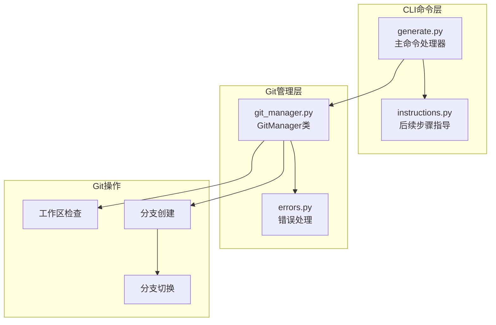
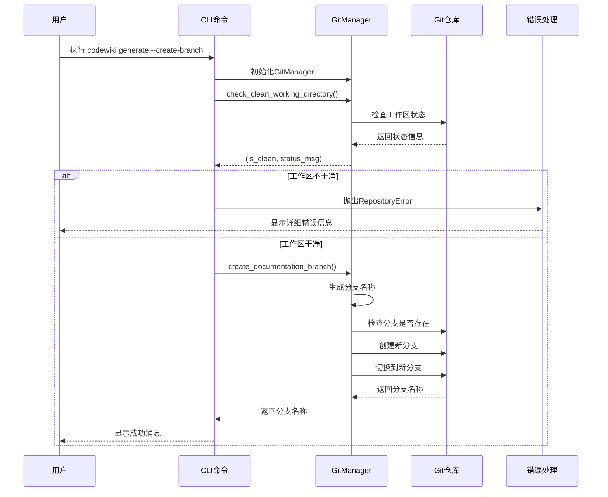
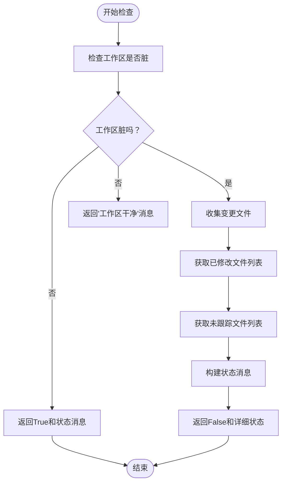
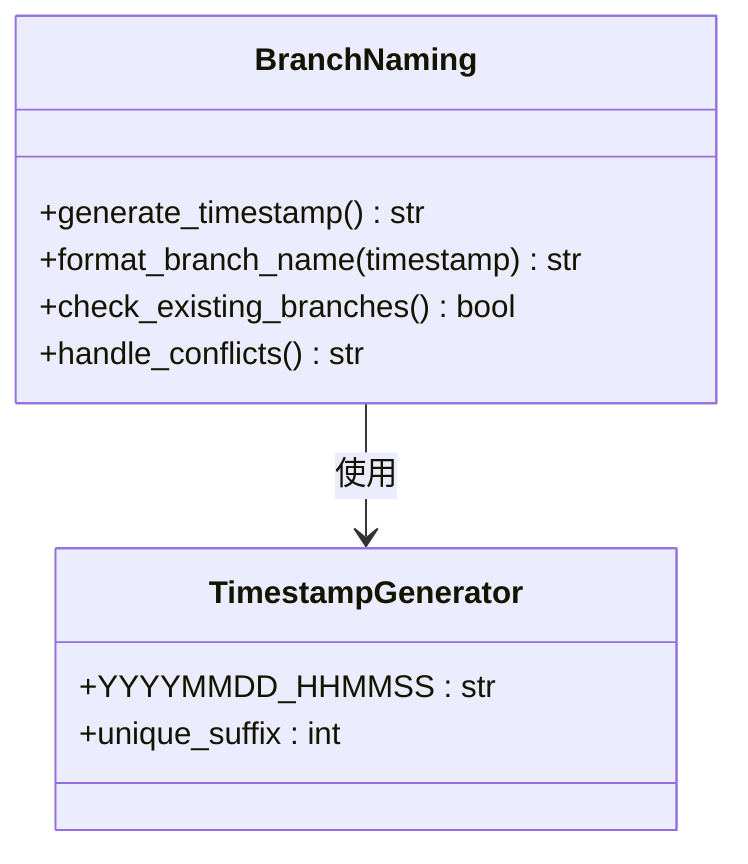
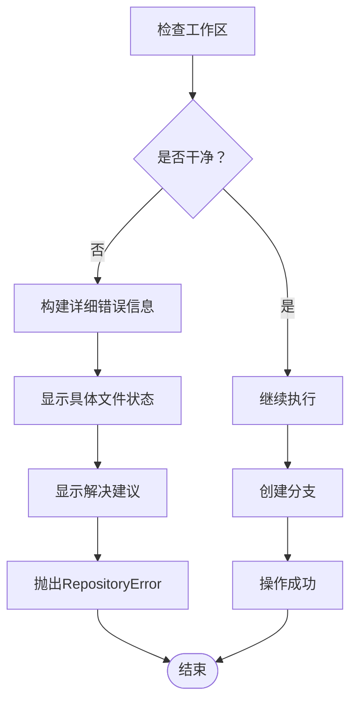
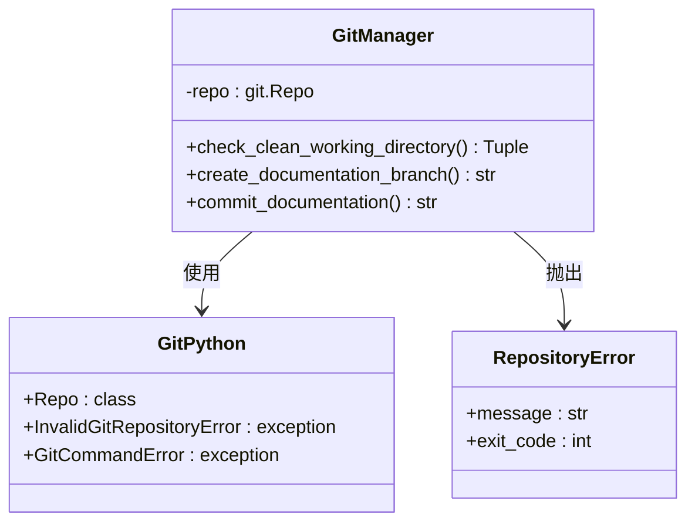
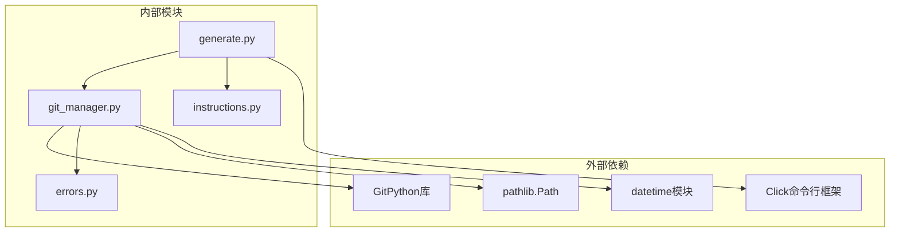

# Git分支创建阶段

<cite>
**本文档引用的文件**
- [git_manager.py](file://codewiki/cli/git_manager.py)
- [generate.py](file://codewiki/cli/commands/generate.py)
- [errors.py](file://codewiki/cli/utils/errors.py)
</cite>

## 目录
1. [简介](#简介)
2. [项目结构](#项目结构)
3. [核心组件](#核心组件)
4. [架构概览](#架构概览)
5. [详细组件分析](#详细组件分析)
6. [依赖关系分析](#依赖关系分析)
7. [性能考虑](#性能考虑)
8. [故障排除指南](#故障排除指南)
9. [结论](#结论)

## 简介

Git分支创建是CodeWiki文档生成流程的第三阶段，当用户启用`--create-branch`标志时触发。该阶段的核心目标是在Git仓库中创建一个专门用于文档生成的分支，确保文档变更与主代码分离，便于审查和合并。

本阶段涉及两个主要组件：
- **GitManager类**：负责所有Git操作，包括工作区状态检查和分支创建
- **CLI命令处理器**：协调整个分支创建流程并处理用户交互

## 项目结构

Git分支创建功能在CodeWiki CLI中的组织结构如下：

**图表来源**
- [generate.py](file://codewiki/cli/commands/generate.py#L34-L233)
- [git_manager.py](file://codewiki/cli/git_manager.py#L14-L228)
- [errors.py](file://codewiki/cli/utils/errors.py#L43-L48)

**章节来源**
- [generate.py](file://codewiki/cli/commands/generate.py#L34-L233)
- [git_manager.py](file://codewiki/cli/git_manager.py#L14-L228)

## 核心组件

### GitManager类

GitManager是Git分支创建功能的核心类，提供了以下关键功能：

#### 主要职责
- **工作区状态检查**：验证当前工作目录是否干净
- **分支创建**：创建新的文档分支并自动切换到该分支
- **异常处理**：统一处理Git操作中的各种错误情况

#### 关键方法
- `check_clean_working_directory()`：检查工作区清洁状态
- `create_documentation_branch(force: bool)`：创建文档分支

**章节来源**
- [git_manager.py](file://codewiki/cli/git_manager.py#L14-L228)

## 架构概览

Git分支创建流程采用分层架构设计，确保职责分离和错误处理的完整性：

**图表来源**
- [generate.py](file://codewiki/cli/commands/generate.py#L168-L192)
- [git_manager.py](file://codewiki/cli/git_manager.py#L45-L121)

## 详细组件分析

### 工作区清洁状态检查

#### 实现逻辑

`check_clean_working_directory`方法负责检查Git工作区的清洁状态，这是分支创建前的关键安全检查。

**图表来源**
- [git_manager.py](file://codewiki/cli/git_manager.py#L45-L71)

#### 状态检测机制

系统会同时检查两类文件变更：
1. **已修改文件**：通过`self.repo.index.diff(None)`获取
2. **未跟踪文件**：通过`self.repo.untracked_files`获取

状态消息最多显示3个文件名，超过3个时显示"以及更多"的统计信息。

**章节来源**
- [git_manager.py](file://codewiki/cli/git_manager.py#L45-L71)

### 分支创建实现

#### 分支命名规则

分支名称采用统一的命名约定：`docs/codewiki-<timestamp>`，其中时间戳格式为`YYYYMMDD-HHMMSS`。

**图表来源**
- [git_manager.py](file://codewiki/cli/git_manager.py#L102-L114)

#### 创建流程

分支创建过程包含以下步骤：

1. **强制模式检查**：如果启用了force参数，则跳过工作区检查
2. **分支名称生成**：使用当前时间戳生成唯一分支名
3. **冲突检测**：检查生成的分支名是否已存在
4. **分支创建**：使用GitPython创建新分支
5. **自动切换**：创建后立即切换到新分支

**章节来源**
- [git_manager.py](file://codewiki/cli/git_manager.py#L73-L121)

### 异常处理机制

#### RepositoryError异常

当工作区不干净时，系统会抛出RepositoryError异常，包含详细的错误信息和用户指导：

**图表来源**
- [git_manager.py](file://codewiki/cli/git_manager.py#L87-L100)

#### 错误信息结构

错误信息包含四个部分：
1. **问题描述**：明确指出工作区有未提交更改
2. **状态详情**：显示具体的变更文件列表
3. **解决方案**：提供commit或stash两种选择
4. **后续步骤**：指导用户重新运行命令

**章节来源**
- [git_manager.py](file://codewiki/cli/git_manager.py#L87-L100)
- [errors.py](file://codewiki/cli/utils/errors.py#L43-L48)

### GitPython集成细节

#### 库交互方式

系统使用GitPython库进行底层Git操作：

**图表来源**
- [git_manager.py](file://codewiki/cli/git_manager.py#L8-L11)
- [git_manager.py](file://codewiki/cli/git_manager.py#L37-L43)

#### 关键Git操作

- **仓库初始化**：`git.Repo(repo_path, search_parent_directories=True)`
- **状态检查**：`self.repo.is_dirty(untracked_files=True)`
- **分支创建**：`self.repo.create_head(branch_name)`
- **分支切换**：`new_branch.checkout()`

**章节来源**
- [git_manager.py](file://codewiki/cli/git_manager.py#L37-L43)
- [git_manager.py](file://codewiki/cli/git_manager.py#L115-L119)

## 依赖关系分析

Git分支创建功能的依赖关系图：

**图表来源**
- [generate.py](file://codewiki/cli/commands/generate.py#L34-L77)
- [git_manager.py](file://codewiki/cli/git_manager.py#L5-L11)

**章节来源**
- [generate.py](file://codewiki/cli/commands/generate.py#L34-L77)
- [git_manager.py](file://codewiki/cli/git_manager.py#L5-L11)

## 性能考虑

### 时间复杂度分析

- **工作区检查**：O(n)，其中n是工作区中的文件数量
- **分支创建**：O(1)，Git操作的时间复杂度为常数级
- **分支冲突检测**：O(m)，其中m是现有分支的数量

### 内存使用

- 工作区检查会加载文件列表到内存
- 分支名称生成仅使用少量字符串操作
- 整体内存使用量与仓库规模成线性关系

### 优化建议

1. **批量操作**：GitPython会自动优化频繁的Git操作
2. **缓存策略**：可以考虑缓存工作区状态以避免重复检查
3. **并发处理**：对于大型仓库，可以考虑异步处理分支创建

## 故障排除指南

### 常见问题及解决方案

#### 问题1：工作区不干净错误

**症状**：执行`codewiki generate --create-branch`时报错，提示工作区有未提交更改

**解决方案**：
1. 查看具体变更文件：`git status`
2. 提交更改：`git add -A && git commit -m "Your message"`
3. 或者暂存更改：`git stash`
4. 重新运行命令

**章节来源**
- [git_manager.py](file://codewiki/cli/git_manager.py#L87-L100)

#### 问题2：分支创建失败

**症状**：分支创建过程中抛出异常

**可能原因**：
1. Git权限不足
2. 网络连接问题（远程仓库）
3. 分支名冲突

**解决方案**：
1. 检查Git配置：`git config --global user.name`
2. 验证网络连接
3. 手动删除冲突分支后重试

#### 问题3：权限错误

**症状**：无法访问Git仓库或创建分支

**解决方案**：
1. 检查文件权限：`ls -la`
2. 验证Git配置：`git config --list`
3. 确认SSH密钥配置（如果是私有仓库）

**章节来源**
- [errors.py](file://codewiki/cli/utils/errors.py#L43-L48)

## 结论

Git分支创建阶段是CodeWiki文档生成流程的重要组成部分，它通过严格的检查机制和优雅的错误处理确保文档生成的安全性和可靠性。该阶段的主要优势包括：

1. **安全性**：强制要求工作区清洁，防止意外覆盖未提交的代码
2. **自动化**：提供统一的分支命名和创建流程
3. **用户友好**：详细的错误信息和解决建议
4. **健壮性**：完善的异常处理和错误恢复机制

通过合理的架构设计和实现细节，Git分支创建功能为用户提供了可靠的文档生成体验，同时保持了与Git生态系统的一致性和兼容性。