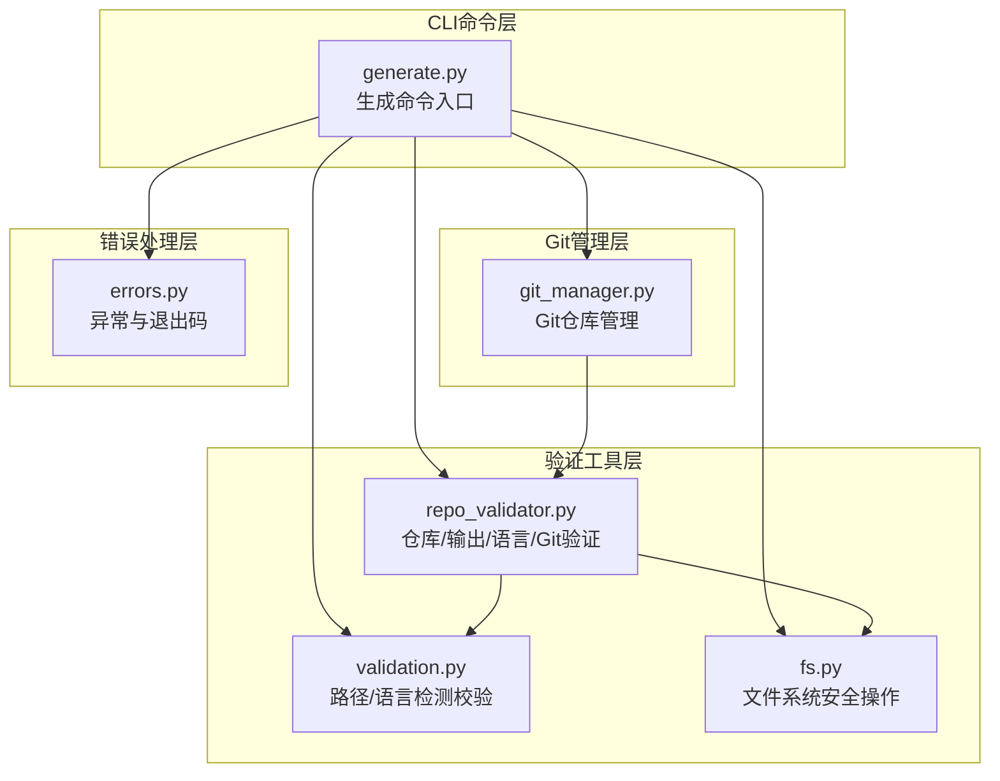
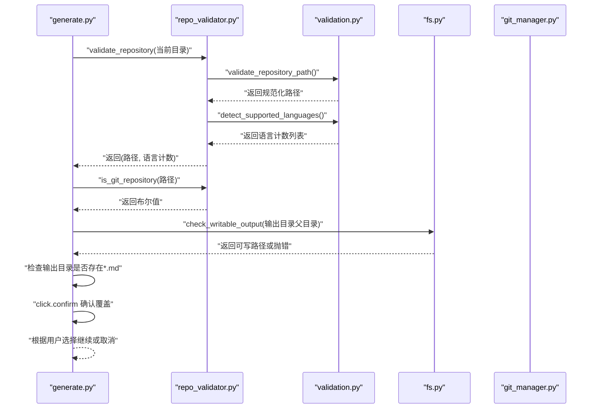
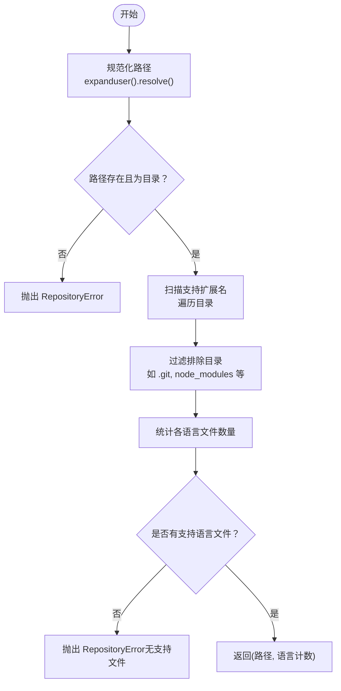
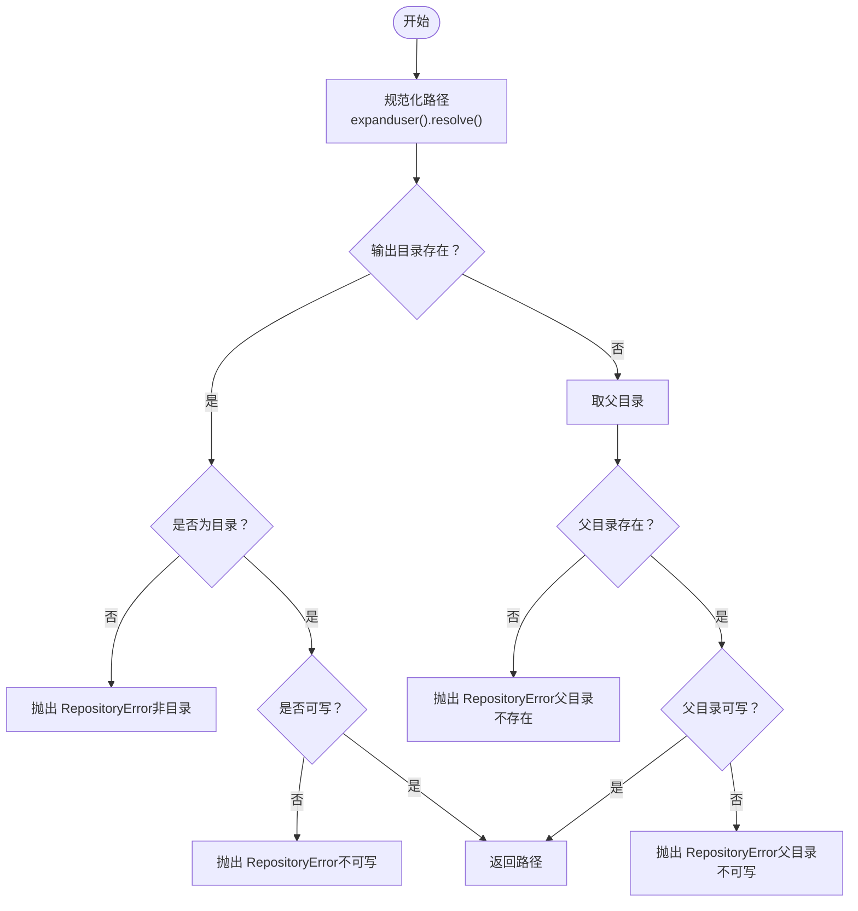
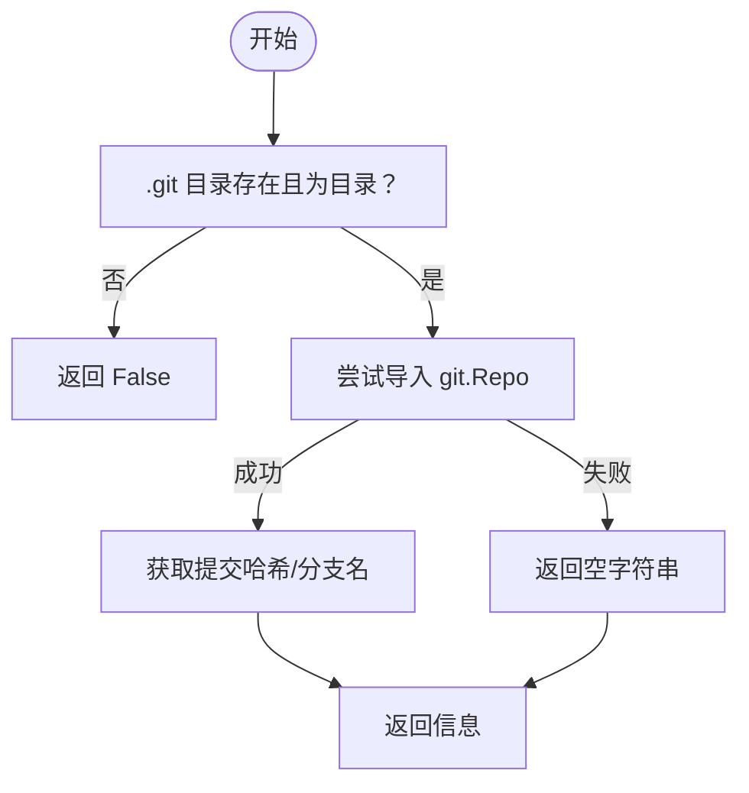
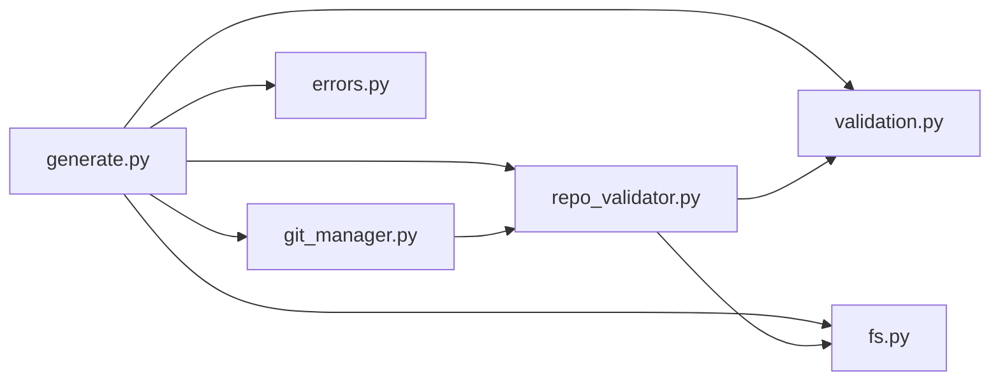

# 仓库验证阶段

<cite>
**本文引用的文件**
- [codewiki/cli/utils/repo_validator.py](file://codewiki/cli/utils/repo_validator.py)
- [codewiki/cli/utils/validation.py](file://codewiki/cli/utils/validation.py)
- [codewiki/cli/utils/fs.py](file://codewiki/cli/utils/fs.py)
- [codewiki/cli/commands/generate.py](file://codewiki/cli/commands/generate.py)
- [codewiki/cli/utils/errors.py](file://codewiki/cli/utils/errors.py)
- [codewiki/cli/git_manager.py](file://codewiki/cli/git_manager.py)
</cite>

## 目录
1. [简介](#简介)
2. [项目结构](#项目结构)
3. [核心组件](#核心组件)
4. [架构总览](#架构总览)
5. [详细组件分析](#详细组件分析)
6. [依赖关系分析](#依赖关系分析)
7. [性能考量](#性能考量)
8. [故障排查指南](#故障排查指南)
9. [结论](#结论)

## 简介
本节聚焦文档生成流程的第二阶段“仓库验证”。该阶段负责：
- 检测当前工作目录是否为有效的代码仓库
- 扫描并统计支持的语言文件
- 验证输出目录的可写性（含父目录检查）
- 当目标输出目录已存在Markdown文件时，通过交互式确认决定是否覆盖
- 结合Git状态检查，区分Git项目与非Git项目的差异行为

本节将从实现细节、数据流、错误处理与最佳实践等维度进行深入剖析，并提供可视化图示帮助理解。

## 项目结构
围绕仓库验证的相关模块分布如下：
- 命令入口：generate.py 负责调用验证流程并组织后续步骤
- 验证工具：repo_validator.py 提供仓库与输出目录验证、Git信息辅助
- 通用校验：validation.py 提供路径、语言检测等基础校验
- 文件系统：fs.py 提供安全读写、目录创建、可写性检查等底层能力
- 错误处理：errors.py 定义统一的异常类型与退出码
- Git管理：git_manager.py 提供Git仓库操作封装

图表来源
- [codewiki/cli/commands/generate.py](file://codewiki/cli/commands/generate.py#L1-L276)
- [codewiki/cli/utils/repo_validator.py](file://codewiki/cli/utils/repo_validator.py#L1-L188)
- [codewiki/cli/utils/validation.py](file://codewiki/cli/utils/validation.py#L1-L251)
- [codewiki/cli/utils/fs.py](file://codewiki/cli/utils/fs.py#L1-L191)
- [codewiki/cli/git_manager.py](file://codewiki/cli/git_manager.py#L1-L228)
- [codewiki/cli/utils/errors.py](file://codewiki/cli/utils/errors.py#L1-L114)

章节来源
- [codewiki/cli/commands/generate.py](file://codewiki/cli/commands/generate.py#L1-L276)
- [codewiki/cli/utils/repo_validator.py](file://codewiki/cli/utils/repo_validator.py#L1-L188)
- [codewiki/cli/utils/validation.py](file://codewiki/cli/utils/validation.py#L1-L251)
- [codewiki/cli/utils/fs.py](file://codewiki/cli/utils/fs.py#L1-L191)
- [codewiki/cli/git_manager.py](file://codewiki/cli/git_manager.py#L1-L228)
- [codewiki/cli/utils/errors.py](file://codewiki/cli/utils/errors.py#L1-L114)

## 核心组件
- 仓库有效性验证：validate_repository
- 输出目录可写性检查：check_writable_output
- 语言检测与统计：detect_supported_languages
- Git仓库判断与信息提取：is_git_repository、get_git_commit_hash、get_git_branch
- 交互式覆盖确认：click.confirm
- 统一错误处理：RepositoryError、FileSystemError、ConfigurationError

章节来源
- [codewiki/cli/utils/repo_validator.py](file://codewiki/cli/utils/repo_validator.py#L36-L187)
- [codewiki/cli/utils/validation.py](file://codewiki/cli/utils/validation.py#L132-L207)
- [codewiki/cli/commands/generate.py](file://codewiki/cli/commands/generate.py#L159-L167)
- [codewiki/cli/utils/errors.py](file://codewiki/cli/utils/errors.py#L27-L62)

## 架构总览
仓库验证阶段的控制流如下：
- 命令入口加载配置后，定位当前工作目录作为仓库根
- 调用 validate_repository 进行路径与语言检测
- 判断是否为Git仓库，若需要分支功能则要求Git仓库
- 校验输出目录父目录可写
- 若输出目录已存在Markdown文件，弹出确认对话框决定是否继续
- 根据结果进入后续生成或取消流程

图表来源
- [codewiki/cli/commands/generate.py](file://codewiki/cli/commands/generate.py#L132-L167)
- [codewiki/cli/utils/repo_validator.py](file://codewiki/cli/utils/repo_validator.py#L36-L114)
- [codewiki/cli/utils/validation.py](file://codewiki/cli/utils/validation.py#L156-L207)
- [codewiki/cli/utils/fs.py](file://codewiki/cli/utils/fs.py#L72-L114)
- [codewiki/cli/git_manager.py](file://codewiki/cli/git_manager.py#L14-L44)

## 详细组件分析

### 仓库有效性验证：validate_repository
职责与流程：
- 规范化并校验仓库路径（存在且为目录）
- 扫描支持的语言文件并统计数量，按数量降序排列
- 若未检测到任何支持语言文件，则抛出 RepositoryError 并给出指引

关键点：
- 支持语言扩展名集合定义在 repo_validator.py 中
- 语言检测排除常见构建/缓存/版本控制目录，避免误判
- 返回值包含路径与语言计数，供上层日志与决策使用

图表来源
- [codewiki/cli/utils/repo_validator.py](file://codewiki/cli/utils/repo_validator.py#L36-L69)
- [codewiki/cli/utils/validation.py](file://codewiki/cli/utils/validation.py#L156-L207)

章节来源
- [codewiki/cli/utils/repo_validator.py](file://codewiki/cli/utils/repo_validator.py#L36-L69)
- [codewiki/cli/utils/validation.py](file://codewiki/cli/utils/validation.py#L156-L207)

### 输出目录可写性检查：check_writable_output
职责与流程：
- 规范化输出目录路径
- 若目录已存在：检查是否为目录且具备写权限
- 若目录不存在：检查其父目录是否存在且具备写权限
- 不满足条件时抛出 RepositoryError 并给出修复建议

注意：
- 该函数检查的是“输出目录父目录”的可写性，而非输出目录本身
- 与命令入口中对输出目录的进一步处理相配合

图表来源
- [codewiki/cli/utils/repo_validator.py](file://codewiki/cli/utils/repo_validator.py#L72-L114)
- [codewiki/cli/utils/fs.py](file://codewiki/cli/utils/fs.py#L40-L58)

章节来源
- [codewiki/cli/utils/repo_validator.py](file://codewiki/cli/utils/repo_validator.py#L72-L114)
- [codewiki/cli/utils/fs.py](file://codewiki/cli/utils/fs.py#L40-L58)

### 语言检测与统计：detect_supported_languages
- 语言映射：每种语言对应一组扩展名
- 排除规则：内置大量常见排除目录，避免误计入构建产物、缓存、IDE配置等
- 计数策略：递归扫描匹配扩展名，过滤排除目录后统计数量
- 返回格式：按数量降序排列的 (语言, 数量) 元组列表

复杂度分析：
- 时间复杂度近似 O(N)，N 为匹配扩展名的文件总数（受排除目录限制）
- 空间复杂度 O(L)，L 为支持语言种类数

章节来源
- [codewiki/cli/utils/validation.py](file://codewiki/cli/utils/validation.py#L156-L207)

### Git仓库状态与信息：is_git_repository、get_git_commit_hash、get_git_branch
- is_git_repository：通过检查 .git 目录是否存在判断
- get_git_commit_hash/get_git_branch：仅在 Git 仓库环境下可用，失败时返回空字符串
- 在命令入口中，若请求分支功能但非Git仓库，将直接报错；否则仅发出警告并跳过Git特性

图表来源
- [codewiki/cli/utils/repo_validator.py](file://codewiki/cli/utils/repo_validator.py#L117-L171)
- [codewiki/cli/commands/generate.py](file://codewiki/cli/commands/generate.py#L142-L152)

章节来源
- [codewiki/cli/utils/repo_validator.py](file://codewiki/cli/utils/repo_validator.py#L117-L171)
- [codewiki/cli/commands/generate.py](file://codewiki/cli/commands/generate.py#L142-L152)

### 交互式覆盖确认：click.confirm
- 当输出目录已存在 Markdown 文件时，命令入口会弹出确认提示
- 默认选择为“覆盖”，用户可选择取消以终止生成
- 取消后直接退出，不执行后续生成步骤

章节来源
- [codewiki/cli/commands/generate.py](file://codewiki/cli/commands/generate.py#L159-L167)

### 路径解析与输出路径处理
- 仓库路径解析：使用 Path.expanduser().resolve() 规范化当前工作目录
- 输出目录解析：同样规范化，随后调用 check_writable_output 对父目录进行可写性检查
- 语言检测与Git信息用于后续生成阶段的元数据与分支策略

章节来源
- [codewiki/cli/commands/generate.py](file://codewiki/cli/commands/generate.py#L135-L157)
- [codewiki/cli/utils/validation.py](file://codewiki/cli/utils/validation.py#L132-L154)

## 依赖关系分析
- generate.py 依赖 repo_validator.py 的仓库与Git验证能力，依赖 validation.py 的路径与语言检测，依赖 fs.py 的可写性检查，依赖 git_manager.py 的Git仓库管理
- repo_validator.py 依赖 validation.py 的路径与语言检测，依赖 fs.py 的可写性检查
- errors.py 为所有模块提供统一的异常类型与退出码

图表来源
- [codewiki/cli/commands/generate.py](file://codewiki/cli/commands/generate.py#L1-L276)
- [codewiki/cli/utils/repo_validator.py](file://codewiki/cli/utils/repo_validator.py#L1-L188)
- [codewiki/cli/utils/validation.py](file://codewiki/cli/utils/validation.py#L1-L251)
- [codewiki/cli/utils/fs.py](file://codewiki/cli/utils/fs.py#L1-L191)
- [codewiki/cli/git_manager.py](file://codewiki/cli/git_manager.py#L1-L228)
- [codewiki/cli/utils/errors.py](file://codewiki/cli/utils/errors.py#L1-L114)

章节来源
- [codewiki/cli/commands/generate.py](file://codewiki/cli/commands/generate.py#L1-L276)
- [codewiki/cli/utils/repo_validator.py](file://codewiki/cli/utils/repo_validator.py#L1-L188)
- [codewiki/cli/utils/validation.py](file://codewiki/cli/utils/validation.py#L1-L251)
- [codewiki/cli/utils/fs.py](file://codewiki/cli/utils/fs.py#L1-L191)
- [codewiki/cli/git_manager.py](file://codewiki/cli/git_manager.py#L1-L228)
- [codewiki/cli/utils/errors.py](file://codewiki/cli/utils/errors.py#L1-L114)

## 性能考量
- 语言检测采用递归扫描与过滤，排除目录列表较大，实际扫描范围受排除规则约束，通常不会对大型仓库造成显著负担
- 可写性检查为系统调用级别，开销极小
- 建议在大型仓库中保持默认排除目录设置不变，以避免不必要的IO与计算

## 故障排查指南
常见验证错误与解决方案：
- 仓库路径不存在或不是目录
  - 现象：抛出 RepositoryError，提示路径无效
  - 解决：确认当前工作目录正确，或使用 --output 指定有效目录
  - 参考路径：[validate_repository_path](file://codewiki/cli/utils/validation.py#L132-L154)
- 未检测到支持的语言文件
  - 现象：抛出 RepositoryError，提示无支持文件并给出支持语言列表
  - 解决：确保仓库包含支持的语言文件，或切换到正确的子目录
  - 参考路径：[validate_repository](file://codewiki/cli/utils/repo_validator.py#L60-L69)
- 输出目录不可写（或父目录不可写）
  - 现象：抛出 RepositoryError，提示不可写并给出chmod建议
  - 解决：提升目录权限或在可写的父目录下创建输出目录
  - 参考路径：[check_writable_output](file://codewiki/cli/utils/repo_validator.py#L85-L114)
- 非Git项目却启用分支功能
  - 现象：抛出 RepositoryError，提示需要Git仓库
  - 解决：初始化Git仓库后再运行生成命令
  - 参考路径：[generate_command](file://codewiki/cli/commands/generate.py#L144-L149)
- 用户取消覆盖现有Markdown文件
  - 现象：命令取消，不生成新文档
  - 解决：确认覆盖或更换输出目录
  - 参考路径：[click.confirm](file://codewiki/cli/commands/generate.py#L160-L167)

章节来源
- [codewiki/cli/utils/validation.py](file://codewiki/cli/utils/validation.py#L132-L154)
- [codewiki/cli/utils/repo_validator.py](file://codewiki/cli/utils/repo_validator.py#L60-L69)
- [codewiki/cli/utils/repo_validator.py](file://codewiki/cli/utils/repo_validator.py#L85-L114)
- [codewiki/cli/commands/generate.py](file://codewiki/cli/commands/generate.py#L144-L149)
- [codewiki/cli/commands/generate.py](file://codewiki/cli/commands/generate.py#L160-L167)

## 结论
仓库验证阶段通过“路径规范化 + 语言检测 + Git状态判断 + 输出目录可写性检查 + 交互式覆盖确认”五步流程，确保文档生成在安全、可控的环境中进行。该设计兼顾了易用性与健壮性：对非Git项目提供降级提示，对权限问题提供明确的修复建议，对已有文档提供显式的覆盖确认，从而降低误操作风险并提升用户体验。