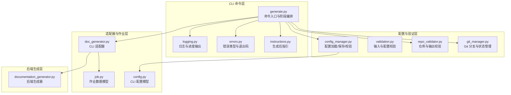
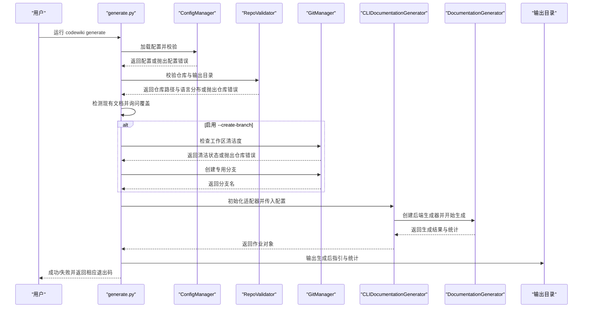
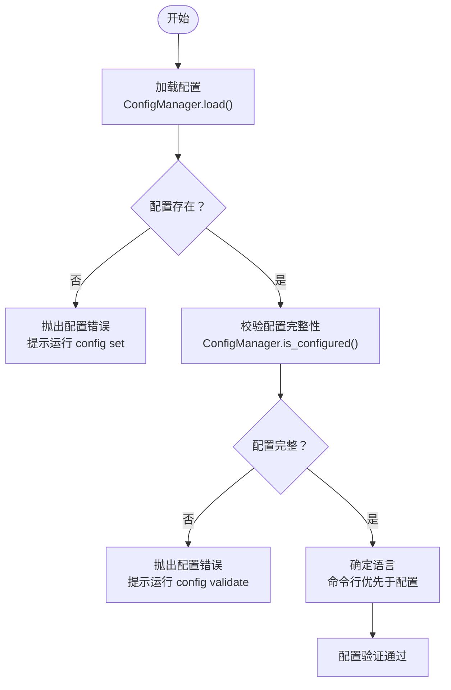
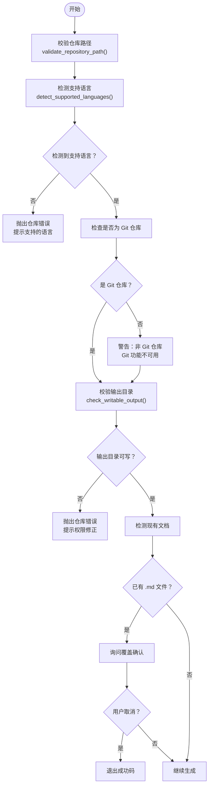
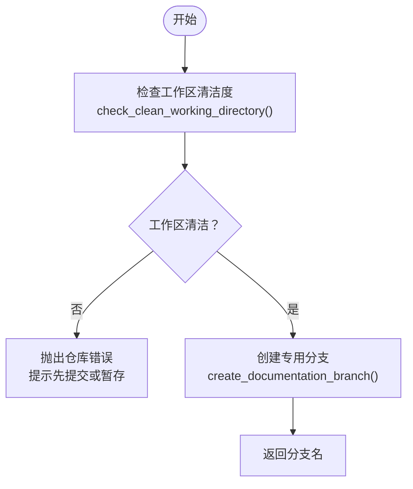
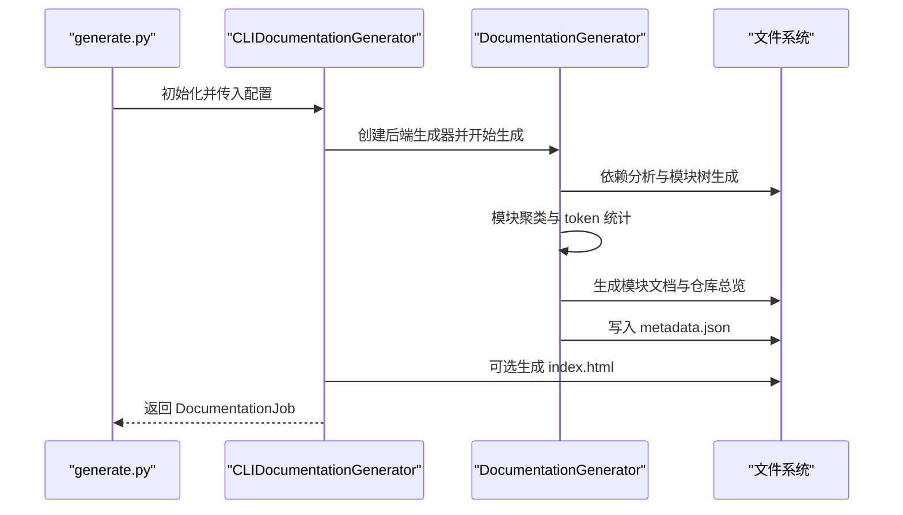
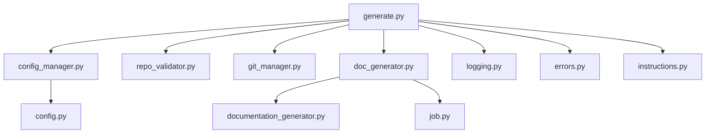

# 文档生成流程

<cite>
**本文引用的文件列表**
- [generate.py](file://codewiki/cli/commands/generate.py)
- [config_manager.py](file://codewiki/cli/config_manager.py)
- [repo_validator.py](file://codewiki/cli/utils/repo_validator.py)
- [git_manager.py](file://codewiki/cli/git_manager.py)
- [doc_generator.py](file://codewiki/cli/adapters/doc_generator.py)
- [job.py](file://codewiki/cli/models/job.py)
- [errors.py](file://codewiki/cli/utils/errors.py)
- [logging.py](file://codewiki/cli/utils/logging.py)
- [validation.py](file://codewiki/cli/utils/validation.py)
- [instructions.py](file://codewiki/cli/utils/instructions.py)
- [config.py](file://codewiki/cli/models/config.py)
- [documentation_generator.py](file://codewiki/src/be/documentation_generator.py)
</cite>

## 目录
1. [引言](#引言)
2. [项目结构概览](#项目结构概览)
3. [核心组件](#核心组件)
4. [架构总览](#架构总览)
5. [详细组件分析](#详细组件分析)
6. [依赖关系分析](#依赖关系分析)
7. [性能考虑](#性能考虑)
8. [故障排除指南](#故障排除指南)
9. [结论](#结论)

## 引言
本文档详细阐述 CodeWiki CLI 在执行文档生成时的四个阶段处理流程，包括：
- 配置验证：通过 ConfigManager 加载并验证 LLM API 密钥与模型配置，若未配置则提示用户运行 `codewiki config set`
- 仓库验证：使用 RepoValidator 检查当前目录是否为有效代码库，并验证输出目录可写性，同时检测现有文档以提示覆盖确认
- Git 分支创建（如启用）：通过 GitManager 检查工作区清洁状态并创建专用分支
- 核心文档生成：通过 CLIDocumentationGenerator 适配器调用后端 DocumentationGenerator 执行分析

结合 generate.py 中的 step 日志与错误处理机制，说明各阶段的进度反馈与异常处理策略。

## 项目结构概览
该模块位于 CLI 层，负责命令行入口、参数解析、阶段化校验与错误处理，并通过适配器调用后端生成器完成实际文档生成任务。

图表来源
- [generate.py](file://codewiki/cli/commands/generate.py#L1-L276)
- [config_manager.py](file://codewiki/cli/config_manager.py#L1-L237)
- [repo_validator.py](file://codewiki/cli/utils/repo_validator.py#L1-L188)
- [git_manager.py](file://codewiki/cli/git_manager.py#L1-L228)
- [doc_generator.py](file://codewiki/cli/adapters/doc_generator.py#L1-L298)
- [job.py](file://codewiki/cli/models/job.py#L1-L157)
- [errors.py](file://codewiki/cli/utils/errors.py#L1-L114)
- [logging.py](file://codewiki/cli/utils/logging.py#L1-L86)
- [validation.py](file://codewiki/cli/utils/validation.py#L1-L251)
- [instructions.py](file://codewiki/cli/utils/instructions.py#L1-L180)
- [config.py](file://codewiki/cli/models/config.py#L1-L113)
- [documentation_generator.py](file://codewiki/src/be/documentation_generator.py#L1-L382)

章节来源
- [generate.py](file://codewiki/cli/commands/generate.py#L1-L276)
- [logging.py](file://codewiki/cli/utils/logging.py#L1-L86)

## 核心组件
- 命令入口与阶段编排：在 generate.py 中定义 Click 命令，按顺序执行四阶段校验与生成，并统一处理异常与退出码
- 配置管理：ConfigManager 负责从系统密钥环读取 API Key，从 JSON 文件读取配置，提供完整性校验与保存能力
- 仓库与输出校验：RepoValidator 提供仓库路径有效性、语言检测、输出目录可写性与 Git 状态判断
- Git 管理：GitManager 提供工作区清洁度检查、专用分支创建、提交与远程信息查询
- 适配器与作业：CLIDocumentationGenerator 将 CLI 上下文传递给后端生成器，记录作业统计与进度；DocumentationJob 记录作业元数据与统计
- 错误体系：统一的错误类型与退出码，便于用户理解问题并采取修复措施
- 日志与指引：CLILogger 提供带步骤号的日志输出；instructions.py 输出生成后的操作指引

章节来源
- [generate.py](file://codewiki/cli/commands/generate.py#L34-L276)
- [config_manager.py](file://codewiki/cli/config_manager.py#L26-L237)
- [repo_validator.py](file://codewiki/cli/utils/repo_validator.py#L36-L188)
- [git_manager.py](file://codewiki/cli/git_manager.py#L14-L228)
- [doc_generator.py](file://codewiki/cli/adapters/doc_generator.py#L26-L298)
- [job.py](file://codewiki/cli/models/job.py#L48-L157)
- [errors.py](file://codewiki/cli/utils/errors.py#L27-L114)
- [logging.py](file://codewiki/cli/utils/logging.py#L11-L86)
- [instructions.py](file://codewiki/cli/utils/instructions.py#L48-L180)

## 架构总览
下图展示四阶段处理流程与组件交互：

图表来源
- [generate.py](file://codewiki/cli/commands/generate.py#L104-L276)
- [config_manager.py](file://codewiki/cli/config_manager.py#L51-L206)
- [repo_validator.py](file://codewiki/cli/utils/repo_validator.py#L36-L114)
- [git_manager.py](file://codewiki/cli/git_manager.py#L45-L122)
- [doc_generator.py](file://codewiki/cli/adapters/doc_generator.py#L114-L298)
- [documentation_generator.py](file://codewiki/src/be/documentation_generator.py#L137-L382)

## 详细组件分析

### 第一阶段：配置验证
- 目标：确保 LLM API 密钥与模型配置可用且完整
- 关键流程：
  - 加载配置：ConfigManager.load() 从 JSON 文件读取配置，从系统密钥环读取 API Key
  - 完整性校验：ConfigManager.is_configured() 检查 API Key 与关键模型字段是否设置
  - 语言优先级：命令行 --language 参数优先于配置文件中的 language 字段
- 错误处理：
  - 若配置不存在或无效，抛出 ConfigurationError 并提示运行 `codewiki config set`
  - 若配置不完整，提示运行 `codewiki config validate`
- 进度反馈：
  - generate.py 使用 logger.step() 输出“Validating configuration...”与成功提示

图表来源
- [generate.py](file://codewiki/cli/commands/generate.py#L104-L130)
- [config_manager.py](file://codewiki/cli/config_manager.py#L51-L206)

章节来源
- [generate.py](file://codewiki/cli/commands/generate.py#L104-L130)
- [config_manager.py](file://codewiki/cli/config_manager.py#L51-L206)

### 第二阶段：仓库验证与输出检查
- 目标：确认当前目录为有效代码库，输出目录可写，并处理现有文档覆盖
- 关键流程：
  - 仓库路径校验：validate_repository_path() 确保路径存在且为目录
  - 语言检测：detect_supported_languages() 统计支持语言的文件数量
  - Git 状态：is_git_repository() 判断是否为 Git 仓库
  - 输出目录校验：check_writable_output() 检查目录存在性、可写性与父目录权限
  - 覆盖确认：若输出目录已包含 .md 文件，弹出确认对话框
- 错误处理：
  - 非 Git 仓库但启用 --create-branch：抛出 RepositoryError 并提示初始化 Git
  - 输出目录不可写：抛出 RepositoryError 并给出权限修正建议
  - 无支持语言文件：抛出 RepositoryError 并列出支持的语言
- 进度反馈：
  - generate.py 使用 logger.step() 输出“Validating repository...”，并在成功时显示检测到的语言分布

图表来源
- [generate.py](file://codewiki/cli/commands/generate.py#L132-L167)
- [repo_validator.py](file://codewiki/cli/utils/repo_validator.py#L36-L114)

章节来源
- [generate.py](file://codewiki/cli/commands/generate.py#L132-L167)
- [repo_validator.py](file://codewiki/cli/utils/repo_validator.py#L36-L114)

### 第三阶段：Git 分支创建（如启用）
- 目标：在启用 --create-branch 时，确保工作区清洁并创建专用分支
- 关键流程：
  - 工作区清洁度检查：GitManager.check_clean_working_directory() 汇总变更与未跟踪文件
  - 分支创建：GitManager.create_documentation_branch() 生成带时间戳的分支名，避免冲突
- 错误处理：
  - 工作区不清洁：抛出 RepositoryError 并提示先提交或暂存
  - 分支创建失败：抛出 RepositoryError 并附带具体错误信息
- 进度反馈：
  - generate.py 使用 logger.step() 输出“Creating git branch...”，成功后打印分支名

图表来源
- [generate.py](file://codewiki/cli/commands/generate.py#L168-L193)
- [git_manager.py](file://codewiki/cli/git_manager.py#L45-L122)

章节来源
- [generate.py](file://codewiki/cli/commands/generate.py#L168-L193)
- [git_manager.py](file://codewiki/cli/git_manager.py#L45-L122)

### 第四阶段：核心文档生成
- 目标：通过 CLIDocumentationGenerator 适配器调用后端 DocumentationGenerator 执行分析与生成
- 关键流程：
  - 适配器初始化：CLIDocumentationGenerator 接收仓库路径、输出目录、LLM 配置与 verbose 标志
  - 后端配置桥接：将 CLI 配置转换为后端 Config 对象
  - 生成阶段：
    - 依赖分析：构建依赖图，统计分析文件数与叶节点数
    - 模块聚类：使用 LLM 对叶节点进行聚类，生成模块树并统计 token 使用
    - 文档生成：按拓扑序（叶模块 → 父模块 → 仓库总览）生成文档，聚合 token 使用
    - HTML 生成（可选）：生成 GitHub Pages 兼容的 index.html
  - 作业记录：DocumentationJob 记录作业元数据、统计信息与生成文件清单
- 错误处理：
  - LLM API 错误：捕获 APIError 并标记作业失败
  - 其他异常：统一转为作业失败并抛出
- 进度反馈：
  - generate.py 使用 logger.step() 输出“Generating documentation...”
  - CLIDocumentationGenerator 内部使用 ProgressTracker 与后端日志输出阶段性进展

图表来源
- [generate.py](file://codewiki/cli/commands/generate.py#L194-L256)
- [doc_generator.py](file://codewiki/cli/adapters/doc_generator.py#L114-L298)
- [documentation_generator.py](file://codewiki/src/be/documentation_generator.py#L137-L382)

章节来源
- [generate.py](file://codewiki/cli/commands/generate.py#L194-L256)
- [doc_generator.py](file://codewiki/cli/adapters/doc_generator.py#L114-L298)
- [documentation_generator.py](file://codewiki/src/be/documentation_generator.py#L137-L382)

## 依赖关系分析
- 命令层依赖配置层、验证层与 Git 管理层，用于前置校验
- 适配器层依赖后端生成器，负责进度追踪与作业统计
- 错误体系贯穿全链路，保证一致的用户体验与可诊断性
- 日志与指引模块提供良好的用户反馈与后续操作指导

图表来源
- [generate.py](file://codewiki/cli/commands/generate.py#L13-L31)
- [doc_generator.py](file://codewiki/cli/adapters/doc_generator.py#L22-L24)
- [job.py](file://codewiki/cli/models/job.py#L48-L83)

章节来源
- [generate.py](file://codewiki/cli/commands/generate.py#L13-L31)
- [doc_generator.py](file://codewiki/cli/adapters/doc_generator.py#L22-L24)

## 性能考虑
- 依赖分析与模块聚类阶段可能消耗较多 token，建议使用高阶模型以提升质量与效率
- 大型仓库可利用缓存与增量生成策略（如 no-cache 标志控制强制全量生成）
- HTML 生成阶段仅在启用 --github-pages 时执行，避免不必要的开销
- 后端生成器内部对模块处理采用拓扑序，减少重复计算与上下文溢出风险

## 故障排除指南
- 配置错误（API Key 缺失或不完整）
  - 症状：启动即报配置错误并提示运行 `codewiki config set`
  - 处理：根据提示设置 API Key 与模型配置
- 仓库错误（非 Git 仓库或无支持语言文件）
  - 症状：提示初始化 Git 或检查代码文件
  - 处理：在仓库根目录执行 `git init`，或确保包含支持的语言文件
- 输出目录不可写
  - 症状：提示父目录不可写或当前目录不可写
  - 处理：调整权限或选择其他目录
- 工作区不清洁
  - 症状：提示有未提交变更或未跟踪文件
  - 处理：先提交或暂存，再重试
- LLM API 错误
  - 症状：生成过程中出现 API 错误
  - 处理：检查网络、API Key 与模型配置，必要时降低并发或重试

章节来源
- [errors.py](file://codewiki/cli/utils/errors.py#L27-L114)
- [generate.py](file://codewiki/cli/commands/generate.py#L258-L275)

## 结论
CodeWiki 的文档生成流程通过四阶段严格校验与清晰的错误处理，确保在不同环境下都能稳定产出高质量文档。CLI 层负责用户交互与阶段编排，配置与验证层保障输入质量，Git 管理层提供版本控制支持，适配器与后端生成器协同完成复杂分析与生成任务。整体设计兼顾易用性与可维护性，适合在多种开发场景中部署与使用。