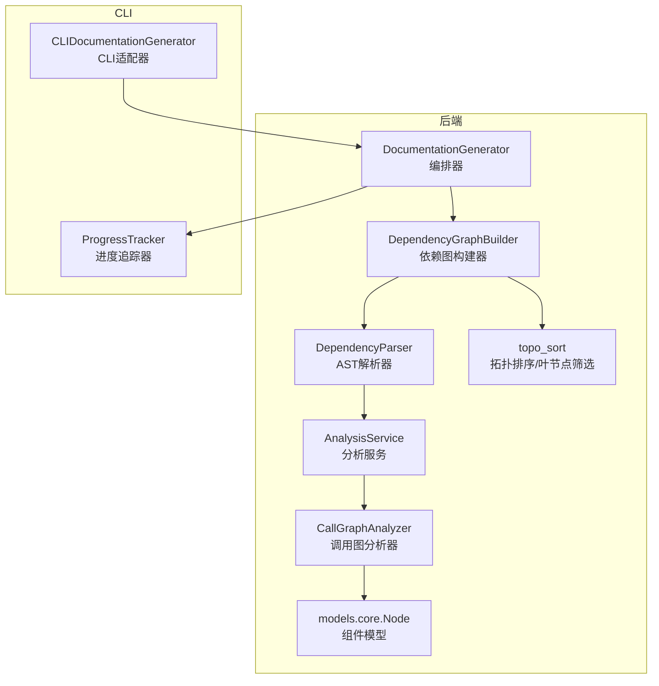
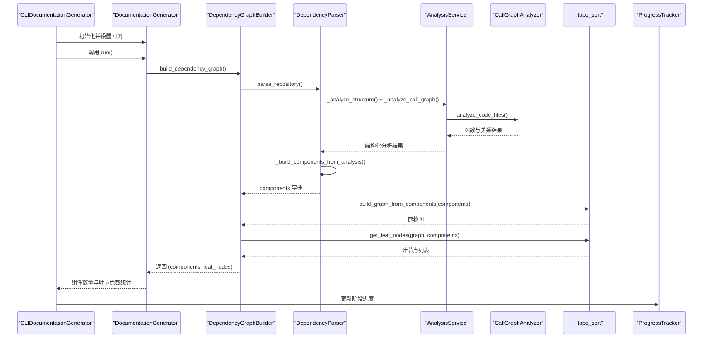
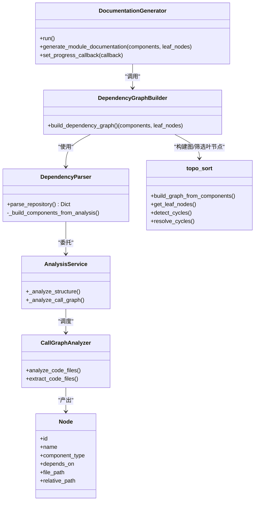

# 依赖分析阶段

<cite>
**本文引用的文件列表**
- [documentation_generator.py](file://codewiki/src/be/documentation_generator.py)
- [dependency_graphs_builder.py](file://codewiki/src/be/dependency_analyzer/dependency_graphs_builder.py)
- [ast_parser.py](file://codewiki/src/be/dependency_analyzer/ast_parser.py)
- [topo_sort.py](file://codewiki/src/be/dependency_analyzer/topo_sort.py)
- [core.py](file://codewiki/src/be/dependency_analyzer/models/core.py)
- [analysis_service.py](file://codewiki/src/be/dependency_analyzer/analysis/analysis_service.py)
- [call_graph_analyzer.py](file://codewiki/src/be/dependency_analyzer/analysis/call_graph_analyzer.py)
- [python.py](file://codewiki/src/be/dependency_analyzer/analyzers/python.py)
- [doc_generator.py](file://codewiki/cli/adapters/doc_generator.py)
- [progress.py](file://codewiki/cli/utils/progress.py)
- [cluster_modules.py](file://codewiki/src/be/cluster_modules.py)
</cite>

## 目录
1. [引言](#引言)
2. [项目结构](#项目结构)
3. [核心组件](#核心组件)
4. [架构总览](#架构总览)
5. [详细组件分析](#详细组件分析)
6. [依赖关系分析](#依赖关系分析)
7. [性能考量](#性能考量)
8. [故障排查指南](#故障排查指南)
9. [结论](#结论)

## 引言
本节聚焦于文档生成流程中的“依赖分析阶段”。该阶段由 DocumentationGenerator 调用 DependencyGraphBuilder 的 build_dependency_graph() 方法启动，其目标是：
- 解析源码仓库，抽取函数、类、模块等代码组件；
- 基于调用关系与继承/依赖信息构建组件间的依赖图；
- 输出两个关键数据结构：components（组件字典）与 leaf_nodes（叶节点列表）；
- 为后续模块聚类与动态规划式文档生成提供基础。

同时，本节还将解释 AST 解析器如何从多语言源文件中提取组件与关系；components 与 leaf_nodes 的语义与用途；以及进度跟踪与异常处理机制，包括 CLI 层面的用户可见进度反馈。

## 项目结构
依赖分析阶段涉及后端与 CLI 两层协作：
- 后端：DocumentationGenerator 负责编排；DependencyGraphBuilder 负责构建依赖图；AnalysisService/CallGraphAnalyzer 等负责多语言 AST 解析与调用图生成；topo_sort 提供拓扑排序与叶节点筛选；models.core 定义 Node 数据模型。
- CLI：CLIDocumentationGenerator 将后端流程包装为命令行任务，并通过 ProgressTracker 提供用户可见的进度反馈。

图表来源
- [documentation_generator.py](file://codewiki/src/be/documentation_generator.py#L320-L382)
- [dependency_graphs_builder.py](file://codewiki/src/be/dependency_analyzer/dependency_graphs_builder.py#L18-L94)
- [ast_parser.py](file://codewiki/src/be/dependency_analyzer/ast_parser.py#L27-L44)
- [analysis_service.py](file://codewiki/src/be/dependency_analyzer/analysis/analysis_service.py#L24-L95)
- [call_graph_analyzer.py](file://codewiki/src/be/dependency_analyzer/analysis/call_graph_analyzer.py#L27-L67)
- [topo_sort.py](file://codewiki/src/be/dependency_analyzer/topo_sort.py#L239-L350)
- [core.py](file://codewiki/src/be/dependency_analyzer/models/core.py#L7-L44)
- [doc_generator.py](file://codewiki/cli/adapters/doc_generator.py#L166-L191)
- [progress.py](file://codewiki/cli/utils/progress.py#L11-L174)

章节来源
- [documentation_generator.py](file://codewiki/src/be/documentation_generator.py#L320-L382)
- [doc_generator.py](file://codewiki/cli/adapters/doc_generator.py#L166-L191)

## 核心组件
- DocumentationGenerator：主流程编排者，负责调用依赖图构建器、模块聚类、文档生成与元数据创建。
- DependencyGraphBuilder：封装依赖图构建逻辑，返回 components 与 leaf_nodes。
- DependencyParser：基于 AnalysisService/CallGraphAnalyzer 从源文件中提取组件与关系，构建 Node 集合。
- AnalysisService/CallGraphAnalyzer：协调多语言 AST 分析，生成函数与调用关系。
- topo_sort：将组件集合转换为依赖图，检测/解决环，输出叶节点列表。
- models.core.Node：统一的代码组件数据模型，包含依赖集合 depends_on。
- CLIDocumentationGenerator/ProgressTracker：CLI 层进度上报与用户反馈。

章节来源
- [documentation_generator.py](file://codewiki/src/be/documentation_generator.py#L29-L48)
- [dependency_graphs_builder.py](file://codewiki/src/be/dependency_analyzer/dependency_graphs_builder.py#L12-L94)
- [ast_parser.py](file://codewiki/src/be/dependency_analyzer/ast_parser.py#L17-L44)
- [topo_sort.py](file://codewiki/src/be/dependency_analyzer/topo_sort.py#L239-L350)
- [core.py](file://codewiki/src/be/dependency_analyzer/models/core.py#L7-L44)
- [doc_generator.py](file://codewiki/cli/adapters/doc_generator.py#L26-L72)
- [progress.py](file://codewiki/cli/utils/progress.py#L11-L174)

## 架构总览
依赖分析阶段的控制流如下：

图表来源
- [doc_generator.py](file://codewiki/cli/adapters/doc_generator.py#L166-L191)
- [documentation_generator.py](file://codewiki/src/be/documentation_generator.py#L320-L334)
- [dependency_graphs_builder.py](file://codewiki/src/be/dependency_analyzer/dependency_graphs_builder.py#L18-L62)
- [ast_parser.py](file://codewiki/src/be/dependency_analyzer/ast_parser.py#L27-L44)
- [analysis_service.py](file://codewiki/src/be/dependency_analyzer/analysis/analysis_service.py#L24-L95)
- [call_graph_analyzer.py](file://codewiki/src/be/dependency_analyzer/analysis/call_graph_analyzer.py#L27-L67)
- [topo_sort.py](file://codewiki/src/be/dependency_analyzer/topo_sort.py#L239-L350)

## 详细组件分析

### 1) DocumentationGenerator 如何通过 build_dependency_graph() 构建依赖图
- 入口：DocumentationGenerator.run() 在第 329 行调用 graph_builder.build_dependency_graph()。
- 返回值：build_dependency_graph() 返回 (components, leaf_nodes)，其中：
  - components：以组件 ID 为键的字典，值为 Node 对象，包含组件类型、文件路径、依赖集合等。
  - leaf_nodes：满足类型与去噪规则的叶节点 ID 列表。
- 关键步骤：
  - 创建 DependencyParser 并调用 parse_repository() 获取 components。
  - 保存依赖图 JSON 文件以便调试与复用。
  - 使用 topo_sort.build_graph_from_components() 构建邻接表形式的依赖图。
  - 使用 topo_sort.get_leaf_nodes() 过滤出叶节点，并进行类型与标识符有效性校验。

章节来源
- [documentation_generator.py](file://codewiki/src/be/documentation_generator.py#L320-L334)
- [dependency_graphs_builder.py](file://codewiki/src/be/dependency_analyzer/dependency_graphs_builder.py#L18-L94)

### 2) AST 解析器如何分析源文件并提取组件与依赖关系
- DependencyParser.parse_repository()：
  - 调用 AnalysisService._analyze_structure() 获取文件树。
  - 调用 AnalysisService._analyze_call_graph() 生成函数与关系。
  - 调用 _build_components_from_analysis() 将结果映射到 Node 对象，并填充每个组件的 depends_on 集合。
- AnalysisService/CallGraphAnalyzer：
  - CallGraphAnalyzer.analyze_code_files() 遍历代码文件，按语言分派到具体分析器（如 PythonASTAnalyzer）。
  - 从 AST 中抽取函数/类定义、参数、文档字符串、调用关系等。
  - 生成 functions 与 relationships 列表，供上层使用。
- PythonASTAnalyzer（示例）：
  - 访问类定义、函数定义，构造 Node。
  - 访问调用节点，记录 CallRelationship。
  - 生成组件 ID（模块路径.名称），用于跨文件关系解析。

章节来源
- [ast_parser.py](file://codewiki/src/be/dependency_analyzer/ast_parser.py#L27-L44)
- [ast_parser.py](file://codewiki/src/be/dependency_analyzer/ast_parser.py#L46-L108)
- [analysis_service.py](file://codewiki/src/be/dependency_analyzer/analysis/analysis_service.py#L24-L95)
- [call_graph_analyzer.py](file://codewiki/src/be/dependency_analyzer/analysis/call_graph_analyzer.py#L27-L67)
- [python.py](file://codewiki/src/be/dependency_analyzer/analyzers/python.py#L15-L200)

### 3) components 与 leaf_nodes 的含义及后续流程中的作用
- components：
  - 语义：所有被识别的代码组件（函数、类等）的完整集合，键为组件 ID，值为 Node。
  - 作用：作为后续模块聚类与文档生成的基础输入；动态规划式文档生成时，按叶节点优先顺序处理。
- leaf_nodes：
  - 语义：不被其他组件依赖的“叶节点”组件 ID 列表，通常代表可独立文档化的最小单元。
  - 类型过滤：若仓库中存在 class/interface/struct 等类型，则仅保留这些类型的叶节点；否则允许 function 类型。
  - 去噪：跳过无效或错误关键字的标识符，确保后续流程稳定性。
- 后续流程：
  - DocumentationGenerator.generate_module_documentation() 使用 leaf_nodes 与 components，按拓扑序（叶节点先）生成文档。
  - cluster_modules() 使用 leaf_nodes 与 components 进行模块聚类，形成模块树。

章节来源
- [dependency_graphs_builder.py](file://codewiki/src/be/dependency_analyzer/dependency_graphs_builder.py#L64-L94)
- [topo_sort.py](file://codewiki/src/be/dependency_analyzer/topo_sort.py#L271-L350)
- [documentation_generator.py](file://codewiki/src/be/documentation_generator.py#L137-L251)
- [cluster_modules.py](file://codewiki/src/be/cluster_modules.py#L44-L125)

### 4) 进度跟踪机制与用户可见反馈
- CLI 层（CLIDocumentationGenerator）：
  - 在依赖分析阶段开始前调用 progress_tracker.start_stage(1, "Dependency Analysis")。
  - 在成功获取 components 与 leaf_nodes 后更新进度（例如显示叶节点数量）。
  - 捕获异常并转换为 APIError，保证 CLI 层面的错误反馈一致。
- 后端层（DocumentationGenerator）：
  - 在 run() 中打印日志（INFO/WARNING/ERROR），便于 CLI 层配置日志级别。
  - 通过 set_progress_callback() 将内部进度回调传递给子组件（如 AgentOrchestrator）。
- 用户可见反馈：
  - CLI 使用 ProgressTracker 显示阶段名称、当前进度百分比、剩余时间估算等。
  - 在非 verbose 模式下，使用 click 进度条；在 verbose 模式下输出详细日志。

章节来源
- [doc_generator.py](file://codewiki/cli/adapters/doc_generator.py#L166-L191)
- [doc_generator.py](file://codewiki/cli/adapters/doc_generator.py#L114-L165)
- [progress.py](file://codewiki/cli/utils/progress.py#L11-L174)
- [documentation_generator.py](file://codewiki/src/be/documentation_generator.py#L45-L48)

### 5) 异常处理与容错策略
- 多处 try/except 保护：
  - CLI 层捕获依赖分析失败、模块聚类失败、文档生成失败等，统一抛出 APIError。
  - CallGraphAnalyzer._analyze_code_file() 对单文件分析异常进行记录与跳过，避免中断整体流程。
  - DependencyParser._build_components_from_analysis() 对缺失的被调方 ID 进行回退查找，提升关系解析鲁棒性。
- 日志与追踪：
  - 使用 logger.error + traceback 打印堆栈，便于定位问题。
  - CLI 层根据 verbose 设置调整日志级别，减少噪音或增强可观测性。

章节来源
- [doc_generator.py](file://codewiki/cli/adapters/doc_generator.py#L181-L190)
- [doc_generator.py](file://codewiki/cli/adapters/doc_generator.py#L213-L227)
- [doc_generator.py](file://codewiki/cli/adapters/doc_generator.py#L235-L254)
- [call_graph_analyzer.py](file://codewiki/src/be/dependency_analyzer/analysis/call_graph_analyzer.py#L142-L145)
- [ast_parser.py](file://codewiki/src/be/dependency_analyzer/ast_parser.py#L98-L107)

## 依赖关系分析
- 组件耦合与内聚：
  - DocumentationGenerator 与 DependencyGraphBuilder 松耦合，前者只关心返回的 (components, leaf_nodes)。
  - DependencyGraphBuilder 内部组合 DependencyParser 与 topo_sort，职责清晰。
  - AST 解析链路 AnalysisService -> CallGraphAnalyzer -> 语言特定分析器，遵循单一职责。
- 外部依赖与集成点：
  - 支持多语言 AST（Python、JavaScript/TypeScript、Java、C#/C/C++、PHP 等），通过 CallGraphAnalyzer 的分派机制扩展。
  - Node 模型统一了不同语言的组件表示，便于后续拓扑与聚类。
- 循环依赖处理：
  - topo_sort.detect_cycles()/resolve_cycles() 采用 Tarjan 算法识别强连通分量并断边解环，保证拓扑排序可用。

图表来源
- [documentation_generator.py](file://codewiki/src/be/documentation_generator.py#L29-L48)
- [dependency_graphs_builder.py](file://codewiki/src/be/dependency_analyzer/dependency_graphs_builder.py#L12-L94)
- [ast_parser.py](file://codewiki/src/be/dependency_analyzer/ast_parser.py#L17-L44)
- [analysis_service.py](file://codewiki/src/be/dependency_analyzer/analysis/analysis_service.py#L24-L95)
- [call_graph_analyzer.py](file://codewiki/src/be/dependency_analyzer/analysis/call_graph_analyzer.py#L27-L67)
- [topo_sort.py](file://codewiki/src/be/dependency_analyzer/topo_sort.py#L239-L350)
- [core.py](file://codewiki/src/be/dependency_analyzer/models/core.py#L7-L44)

## 性能考量
- 文件与语言过滤：
  - AnalysisService._filter_supported_languages() 仅分析受支持的语言文件，减少不必要的解析开销。
- 令牌限制与模块聚类：
  - cluster_modules() 在组件内容超过阈值时才进行聚类，避免小模块的无谓 LLM 调用。
- 拓扑排序优化：
  - topo_sort.resolve_cycles() 通过断边解环，确保 DAG 可拓扑排序；当叶节点过多时进一步剔除中间依赖，降低后续处理复杂度。
- I/O 与缓存：
  - 依赖图 JSON 文件持久化，便于重复运行时直接加载，减少重复分析成本。

章节来源
- [analysis_service.py](file://codewiki/src/be/dependency_analyzer/analysis/analysis_service.py#L296-L324)
- [cluster_modules.py](file://codewiki/src/be/cluster_modules.py#L58-L60)
- [dependency_graphs_builder.py](file://codewiki/src/be/dependency_analyzer/dependency_graphs_builder.py#L35-L50)
- [topo_sort.py](file://codewiki/src/be/dependency_analyzer/topo_sort.py#L337-L345)

## 故障排查指南
- 依赖分析失败（CLI 报错）：
  - 检查 CLI 层是否捕获 APIError 并输出错误信息。
  - 查看后端日志（INFO/WARNING/ERROR）以定位具体阶段与异常原因。
- 单文件解析异常：
  - CallGraphAnalyzer._analyze_code_file() 对单文件异常进行记录并跳过，不影响整体流程。
- 叶节点为空或过少：
  - 检查仓库语言支持与过滤规则；确认 components 是否正确生成。
- 进度无反馈或卡住：
  - 确认 CLI 的 ProgressTracker 已正确初始化与更新。
  - 在 verbose 模式下查看详细日志，确认后端回调是否被设置。

章节来源
- [doc_generator.py](file://codewiki/cli/adapters/doc_generator.py#L181-L190)
- [doc_generator.py](file://codewiki/cli/adapters/doc_generator.py#L213-L227)
- [doc_generator.py](file://codewiki/cli/adapters/doc_generator.py#L235-L254)
- [call_graph_analyzer.py](file://codewiki/src/be/dependency_analyzer/analysis/call_graph_analyzer.py#L142-L145)
- [documentation_generator.py](file://codewiki/src/be/documentation_generator.py#L45-L48)

## 结论
依赖分析阶段通过“解析源码 → 生成组件与关系 → 构建依赖图 → 筛选叶节点”的流水线，为后续模块聚类与文档生成提供了稳定的数据基础。components 与 leaf_nodes 是贯穿全链路的关键数据结构：前者承载完整的组件视图，后者决定文档生成的拓扑顺序。CLI 层通过 ProgressTracker 提供用户可见的进度反馈，后端层通过日志与异常捕获保障可观测性与健壮性。整体设计在多语言支持、循环依赖处理与性能优化方面具备良好平衡。