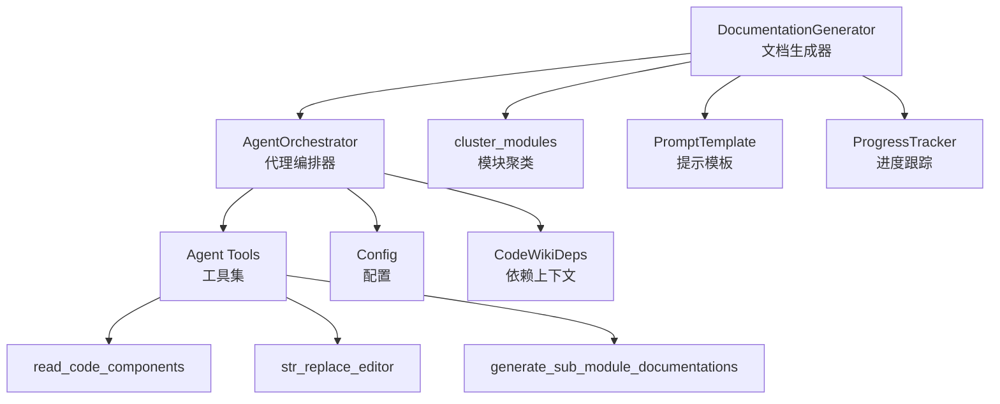
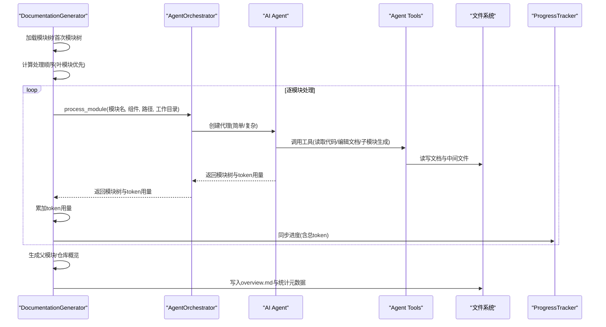
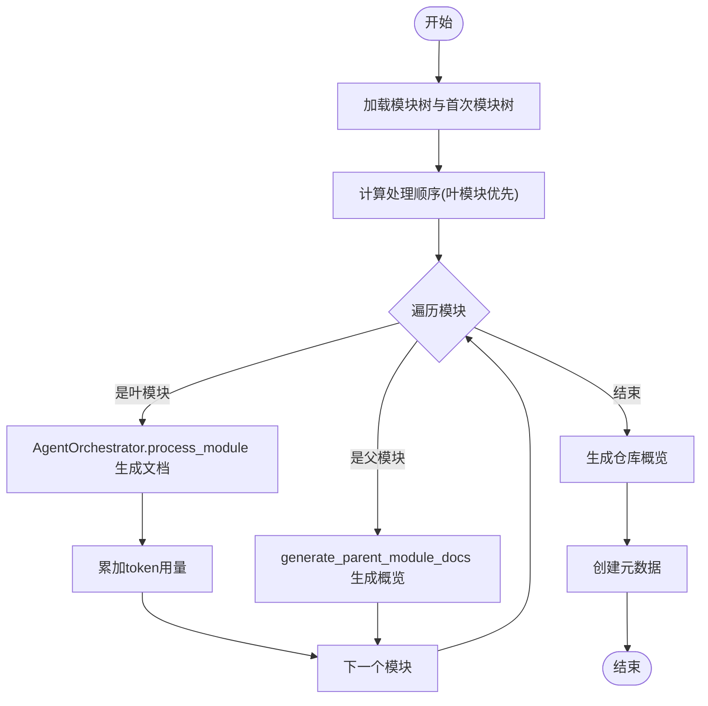
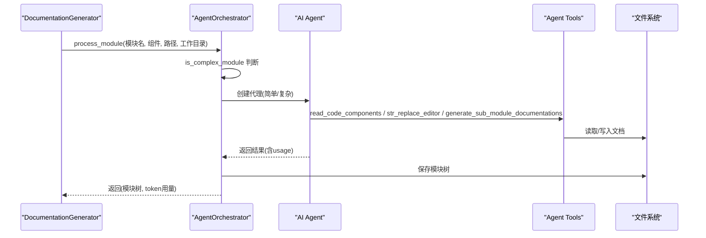
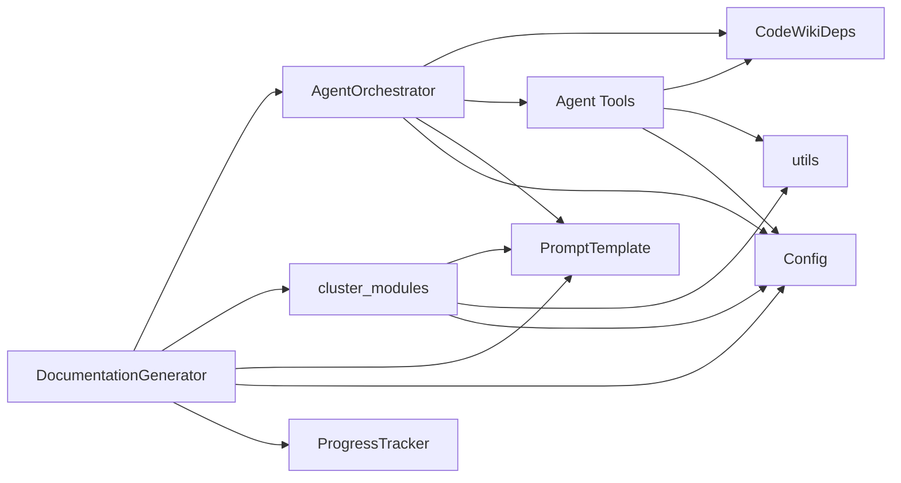

# 文档生成阶段

<cite>
**本文引用的文件列表**
- [documentation_generator.py](file://codewiki/src/be/documentation_generator.py)
- [agent_orchestrator.py](file://codewiki/src/be/agent_orchestrator.py)
- [cluster_modules.py](file://codewiki/src/be/cluster_modules.py)
- [prompt_template.py](file://codewiki/src/be/prompt_template.py)
- [utils.py](file://codewiki/src/be/utils.py)
- [deps.py](file://codewiki/src/be/agent_tools/deps.py)
- [read_code_components.py](file://codewiki/src/be/agent_tools/read_code_components.py)
- [str_replace_editor.py](file://codewiki/src/be/agent_tools/str_replace_editor.py)
- [generate_sub_module_documentations.py](file://codewiki/src/be/agent_tools/generate_sub_module_documentations.py)
- [config.py](file://codewiki/src/config.py)
- [progress.py](file://codewiki/cli/utils/progress.py)
</cite>

## 目录
1. [引言](#引言)
2. [项目结构](#项目结构)
3. [核心组件](#核心组件)
4. [架构总览](#架构总览)
5. [详细组件分析](#详细组件分析)
6. [依赖关系分析](#依赖关系分析)
7. [性能考量](#性能考量)
8. [故障排查指南](#故障排查指南)
9. [结论](#结论)

## 引言
本章节聚焦于“文档生成阶段”的核心流程，系统性阐述以下关键点：
- 如何通过模块树递归地为各模块生成Markdown文档；
- 叶模块优先的处理顺序与动态规划思想的应用；
- AgentOrchestrator如何协调AI代理为每个模块生成文档并追踪token使用；
- generate_parent_module_docs如何合成父模块与仓库概览文档，以及build_overview_structure与提示模板的使用；
- ProgressTracker如何同步进度更新与累计总token用量。

## 项目结构
围绕文档生成阶段的关键文件组织如下：
- 文档生成器：负责构建模块树、确定处理顺序、驱动生成流程、汇总统计与元数据输出。
- 代理编排器：根据模块复杂度创建不同能力的AI代理，执行具体生成任务并返回token用量。
- 模块聚类：将候选核心组件按上下文窗口限制进行分组，形成模块树。
- 提示模板：定义系统提示、用户提示、仓库/模块概览提示及聚类提示格式。
- 工具与依赖：提供读取代码、编辑文档、子模块递归生成等工具；维护模块树与token用量。
- 配置与进度：统一配置参数、语言设置、阈值控制；CLI进度跟踪器用于可视化与ETA估算。

图表来源
- [documentation_generator.py](file://codewiki/src/be/documentation_generator.py#L29-L382)
- [agent_orchestrator.py](file://codewiki/src/be/agent_orchestrator.py#L59-L198)
- [cluster_modules.py](file://codewiki/src/be/cluster_modules.py#L44-L125)
- [prompt_template.py](file://codewiki/src/be/prompt_template.py#L1-L368)
- [deps.py](file://codewiki/src/be/agent_tools/deps.py#L5-L28)
- [read_code_components.py](file://codewiki/src/be/agent_tools/read_code_components.py#L1-L22)
- [str_replace_editor.py](file://codewiki/src/be/agent_tools/str_replace_editor.py#L709-L791)
- [generate_sub_module_documentations.py](file://codewiki/src/be/agent_tools/generate_sub_module_documentations.py#L18-L113)
- [config.py](file://codewiki/src/config.py#L44-L123)
- [progress.py](file://codewiki/cli/utils/progress.py#L11-L223)

章节来源
- [documentation_generator.py](file://codewiki/src/be/documentation_generator.py#L29-L382)
- [agent_orchestrator.py](file://codewiki/src/be/agent_orchestrator.py#L59-L198)
- [cluster_modules.py](file://codewiki/src/be/cluster_modules.py#L44-L125)
- [prompt_template.py](file://codewiki/src/be/prompt_template.py#L1-L368)
- [config.py](file://codewiki/src/config.py#L44-L123)
- [progress.py](file://codewiki/cli/utils/progress.py#L11-L223)

## 核心组件
- DocumentationGenerator：主控流程，负责模块树加载、处理顺序计算、叶模块优先生成、父模块与仓库概览生成、token用量聚合与元数据输出。
- AgentOrchestrator：根据模块复杂度选择简单或复杂代理，调用工具链生成文档，返回模块树与token用量。
- cluster_modules：在聚类模型与阈值约束下，将候选组件分组为模块树，支持递归细分。
- PromptTemplate：提供系统提示、用户提示、仓库/模块概览提示与聚类提示，统一语言与结构要求。
- CodeWikiDeps：代理运行时上下文，承载模块树、当前路径、组件集合、token用量等状态。
- Agent Tools：读取代码、编辑文档、子模块递归生成等工具，支撑代理完成生成任务。
- Config：集中管理LLM模型、语言、目录、阈值等配置。
- ProgressTracker：CLI进度跟踪，提供阶段权重、ETA估算与模块级进度条。

章节来源
- [documentation_generator.py](file://codewiki/src/be/documentation_generator.py#L29-L382)
- [agent_orchestrator.py](file://codewiki/src/be/agent_orchestrator.py#L59-L198)
- [cluster_modules.py](file://codewiki/src/be/cluster_modules.py#L44-L125)
- [prompt_template.py](file://codewiki/src/be/prompt_template.py#L1-L368)
- [deps.py](file://codewiki/src/be/agent_tools/deps.py#L5-L28)
- [config.py](file://codewiki/src/config.py#L44-L123)
- [progress.py](file://codewiki/cli/utils/progress.py#L11-L223)

## 架构总览
文档生成阶段采用“自底向上”的动态规划策略：
- 先聚类形成模块树（可选），再按拓扑序（叶模块优先）逐个生成；
- 叶模块直接由代理生成文档；
- 父模块与仓库概览由上层代理基于子模块文档与模块树结构生成；
- 进程中持续记录并累计token用量，最终输出元数据。

图表来源
- [documentation_generator.py](file://codewiki/src/be/documentation_generator.py#L137-L251)
- [agent_orchestrator.py](file://codewiki/src/be/agent_orchestrator.py#L95-L193)
- [generate_sub_module_documentations.py](file://codewiki/src/be/agent_tools/generate_sub_module_documentations.py#L18-L113)
- [str_replace_editor.py](file://codewiki/src/be/agent_tools/str_replace_editor.py#L709-L791)
- [progress.py](file://codewiki/cli/utils/progress.py#L11-L223)

## 详细组件分析

### DocumentationGenerator：模块文档生成主控
- 处理顺序与动态规划
  - 使用拓扑排序得到“叶模块优先”的处理序列，确保先生成子模块再生成父模块。
  - 对于无子模块的叶模块，直接调用代理生成文档；对于父模块，延迟到后续统一生成概览。
- 叶模块优先生成
  - 通过 is_leaf_module 判断是否为叶模块；
  - 调用 AgentOrchestrator 的 process_module 生成模块文档，并合并返回的token用量。
- 父模块与仓库概览生成
  - generate_parent_module_docs 基于 build_overview_structure 构造“一层子模块文档”与目标标识，拼装提示模板后调用LLM生成概览；
  - 支持跳过已存在的概览/模块文档，避免重复生成。
- 进度与token统计
  - set_progress_callback 将回调传递给 AgentOrchestrator 与内部进度；
  - 在每一步处理后累加 prompt_tokens/completion_tokens/total_tokens；
  - 最终 create_documentation_metadata 输出包含时间戳、模型、统计信息与生成文件清单。
- 全局运行流程
  - run 中依次执行：构建依赖图、聚类模块、生成文档、创建元数据。

章节来源
- [documentation_generator.py](file://codewiki/src/be/documentation_generator.py#L87-L105)
- [documentation_generator.py](file://codewiki/src/be/documentation_generator.py#L107-L110)
- [documentation_generator.py](file://codewiki/src/be/documentation_generator.py#L137-L251)
- [documentation_generator.py](file://codewiki/src/be/documentation_generator.py#L253-L319)
- [documentation_generator.py](file://codewiki/src/be/documentation_generator.py#L320-L382)

#### generate_module_documentation 流程图

图表来源
- [documentation_generator.py](file://codewiki/src/be/documentation_generator.py#L137-L251)
- [documentation_generator.py](file://codewiki/src/be/documentation_generator.py#L253-L319)

### AgentOrchestrator：AI代理编排
- 代理创建策略
  - is_complex_module 根据涉及文件数量判断是否复杂模块；
  - 复杂模块使用 SYSTEM_PROMPT（含子模块递归能力），简单模块使用 LEAF_SYSTEM_PROMPT。
- 运行流程
  - 若仓库概览或模块文档已存在则跳过；
  - 创建 CodeWikiDeps 上下文（包含模块树、路径、组件、token用量等）；
  - 调用 agent.run 执行生成，从结果中提取usage并写入 deps.token_usage；
  - 保存更新后的模块树，返回模块树与token用量。
- 进度同步
  - set_progress_callback 将外部回调传递至内部流程，便于CLI显示实时进度与token用量。

章节来源
- [agent_orchestrator.py](file://codewiki/src/be/agent_orchestrator.py#L67-L70)
- [agent_orchestrator.py](file://codewiki/src/be/agent_orchestrator.py#L71-L94)
- [agent_orchestrator.py](file://codewiki/src/be/agent_orchestrator.py#L95-L193)

#### 代理调用序列图

图表来源
- [agent_orchestrator.py](file://codewiki/src/be/agent_orchestrator.py#L95-L193)
- [read_code_components.py](file://codewiki/src/be/agent_tools/read_code_components.py#L1-L22)
- [str_replace_editor.py](file://codewiki/src/be/agent_tools/str_replace_editor.py#L709-L791)
- [generate_sub_module_documentations.py](file://codewiki/src/be/agent_tools/generate_sub_module_documentations.py#L18-L113)

### 模块聚类：cluster_modules
- 输入输出
  - 输入：候选核心组件列表与组件字典；
  - 输出：模块树（键为模块名，值含 path 与 components，children为空，后续递归填充）。
- 关键逻辑
  - format_potential_core_components 将组件按文件分组并格式化为提示内容；
  - 当组件文本token数超过阈值时，调用 LLM 生成模块分组；
  - 解析响应并校验格式，过滤无效组件ID；
  - 递归为每个模块生成子模块树，直至满足停止条件。
- token用量
  - 聚类过程调用 call_llm 并将usage累加到传入的 token_usage_tracker。

章节来源
- [cluster_modules.py](file://codewiki/src/be/cluster_modules.py#L14-L42)
- [cluster_modules.py](file://codewiki/src/be/cluster_modules.py#L44-L125)

### 提示模板与结构化输出
- 系统提示与用户提示
  - SYSTEM_PROMPT/LEAF_SYSTEM_PROMPT 定义代理角色、目标、工作流与可用工具；
  - USER_PROMPT 组织模块树与核心组件代码，作为用户输入。
- 概览提示
  - REPO_OVERVIEW_PROMPT/MODULE_OVERVIEW_PROMPT 接收模块树结构与子模块文档，要求以 <OVERVIEW> 包裹的Markdown输出。
- 聚类提示
  - CLUSTER_REPO_PROMPT/CLUSTER_MODULE_PROMPT 用于将组件分组为模块。
- 语言与格式
  - format_user_prompt/format_cluster_prompt 负责将数据结构格式化为提示文本，保证一致性。

章节来源
- [prompt_template.py](file://codewiki/src/be/prompt_template.py#L1-L368)

### 代理工具链
- read_code_components：按组件ID读取源码片段。
- str_replace_editor：在docs/repo目录下查看/创建/替换/插入/撤销编辑文档，支持Mermaid验证。
- generate_sub_module_documentations：为子模块创建子代理，递归生成子模块文档，聚合子模块token用量。

章节来源
- [read_code_components.py](file://codewiki/src/be/agent_tools/read_code_components.py#L1-L22)
- [str_replace_editor.py](file://codewiki/src/be/agent_tools/str_replace_editor.py#L709-L791)
- [generate_sub_module_documentations.py](file://codewiki/src/be/agent_tools/generate_sub_module_documentations.py#L18-L113)

### 依赖上下文与token用量
- CodeWikiDeps
  - 维护绝对路径、模块树、当前模块名与路径、组件集合、最大深度、当前深度、配置；
  - token_usage 字段用于累积代理调用产生的prompt_tokens/completion_tokens/total_tokens。
- token计数
  - utils.count_tokens 使用tiktoken编码器统计文本token数，用于阈值判断与聚类。

章节来源
- [deps.py](file://codewiki/src/be/agent_tools/deps.py#L5-L28)
- [utils.py](file://codewiki/src/be/utils.py#L30-L38)

### 进度跟踪与总token用量
- ProgressTracker
  - 提供阶段权重与ETA估算，支持verbose输出；
  - 通过回调向外部传递总体进度百分比与阶段信息。
- 同步机制
  - DocumentationGenerator.set_progress_callback 将回调同时注入 AgentOrchestrator；
  - 在每步处理后累加 total_token_usage，回调中包含当前总token用量，便于CLI展示。
- 模块级进度
  - CLI侧可结合 ModuleProgressBar 实现模块粒度的进度条与缓存状态提示。

章节来源
- [progress.py](file://codewiki/cli/utils/progress.py#L11-L223)
- [documentation_generator.py](file://codewiki/src/be/documentation_generator.py#L45-L48)
- [agent_orchestrator.py](file://codewiki/src/be/agent_orchestrator.py#L67-L69)

## 依赖关系分析
- DocumentationGenerator 依赖：
  - AgentOrchestrator（编排代理）、cluster_modules（聚类）、PromptTemplate（提示模板）、Config（配置）、ProgressTracker（进度）。
- AgentOrchestrator 依赖：
  - CodeWikiDeps（上下文）、Agent Tools（工具）、PromptTemplate（提示）、Config（模型与语言）、utils（复杂度判断）。
- Agent Tools 依赖：
  - CodeWikiDeps（上下文）、utils（Mermaid验证）、Config（语言）。
- cluster_modules 依赖：
  - PromptTemplate（聚类提示）、utils（token计数）、Config（阈值与模型）。

图表来源
- [documentation_generator.py](file://codewiki/src/be/documentation_generator.py#L29-L382)
- [agent_orchestrator.py](file://codewiki/src/be/agent_orchestrator.py#L59-L198)
- [cluster_modules.py](file://codewiki/src/be/cluster_modules.py#L44-L125)
- [prompt_template.py](file://codewiki/src/be/prompt_template.py#L1-L368)
- [deps.py](file://codewiki/src/be/agent_tools/deps.py#L5-L28)
- [utils.py](file://codewiki/src/be/utils.py#L1-L207)
- [config.py](file://codewiki/src/config.py#L44-L123)
- [progress.py](file://codewiki/cli/utils/progress.py#L11-L223)

## 性能考量
- 动态规划与叶模块优先
  - 通过拓扑排序确保子模块先生成，减少重复计算与依赖缺失风险。
- token阈值控制
  - MAX_TOKEN_PER_MODULE 与 MAX_TOKEN_PER_LEAF_MODULE 控制单次生成规模，避免超出上下文窗口；
  - cluster_modules 在阈值内跳过聚类，减少不必要的LLM调用。
- 代理复杂度适配
  - is_complex_module 根据文件数量选择简单/复杂代理，平衡生成质量与成本。
- 文件I/O与缓存
  - 存在概览/模块文档时跳过生成，降低重复开销；
  - 保存模块树与元数据，便于后续增量处理。

## 故障排查指南
- 代理调用失败
  - 检查 agent.run 返回的usage是否存在，若不存在需确认模型返回格式；
  - 查看日志中的Traceback定位具体异常位置。
- 模板解析错误
  - generate_parent_module_docs 期望LLM输出被 <OVERVIEW> 包裹，若缺失或格式不正确会报错；
  - 确认 PromptTemplate 的 REPO_OVERVIEW_PROMPT/MODULE_OVERVIEW_PROMPT 使用正确。
- 聚类响应异常
  - cluster_modules 严格校验 GROUPED_COMPONENTS 标签与返回类型，解析失败会回退为空树；
  - 检查 LLM 输出是否符合预期格式，必要时调整提示词或阈值。
- Mermaid校验失败
  - str_replace_editor 在编辑.md文件后自动触发Mermaid验证，失败时会输出具体错误行号；
  - 根据错误提示修正语法后再提交。

章节来源
- [documentation_generator.py](file://codewiki/src/be/documentation_generator.py#L290-L318)
- [cluster_modules.py](file://codewiki/src/be/cluster_modules.py#L72-L87)
- [str_replace_editor.py](file://codewiki/src/be/agent_tools/str_replace_editor.py#L769-L771)

## 结论
文档生成阶段通过“叶模块优先”的动态规划策略，结合AI代理工具链与结构化提示模板，实现了从组件到模块再到仓库概览的分层生成。AgentOrchestrator在复杂度与上下文窗口之间做权衡，确保生成质量与成本可控；DocumentationGenerator负责整体调度、进度同步与token用量累计；cluster_modules在必要时进行模块聚类，提升生成效率。该设计既保证了可扩展性，也为后续的可视化与发布提供了良好的基础。