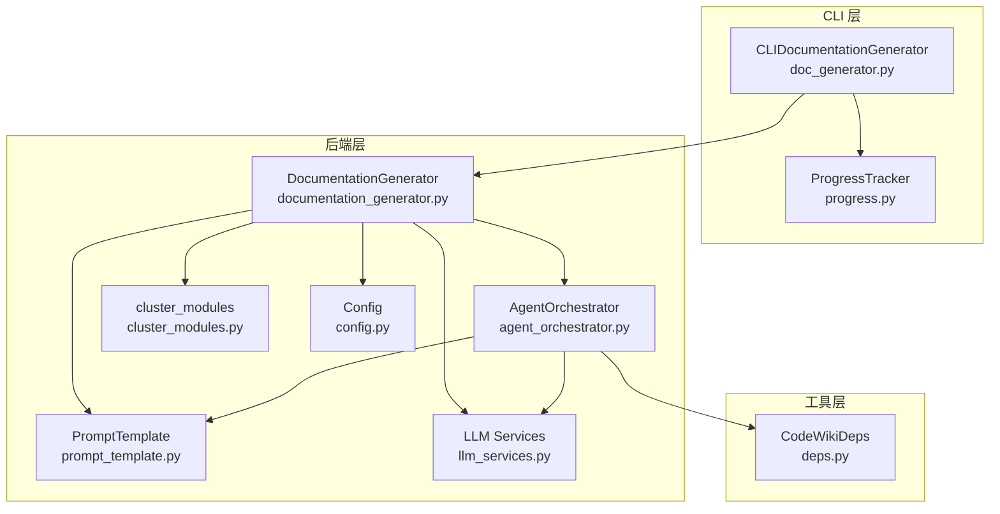
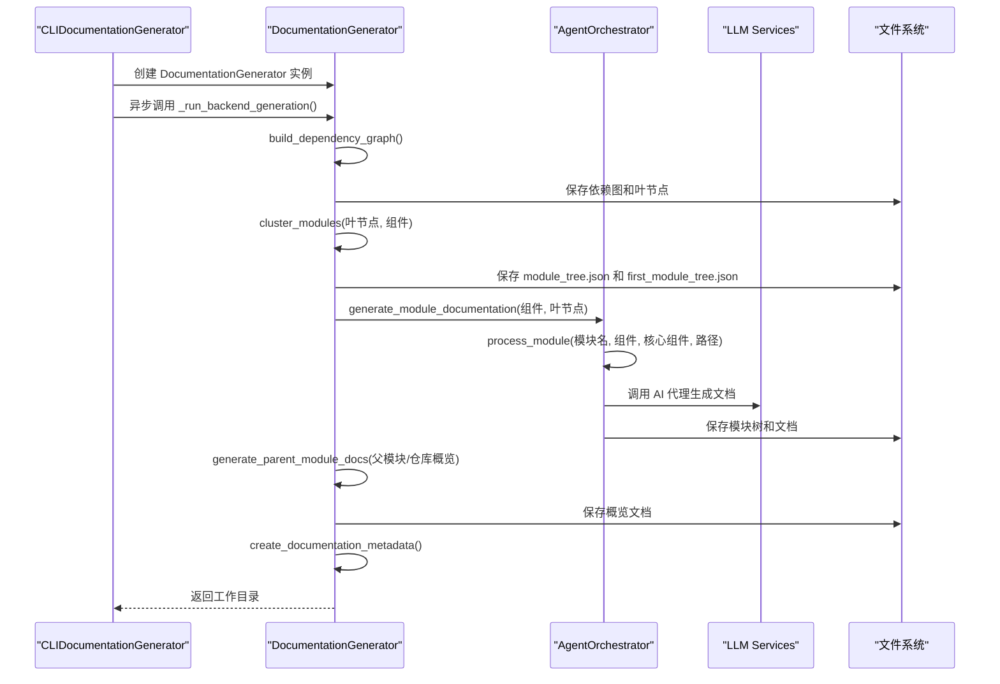
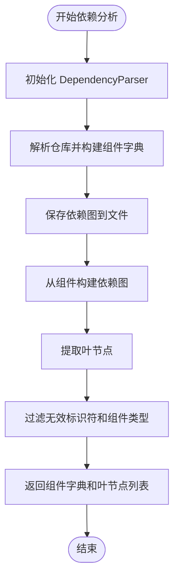
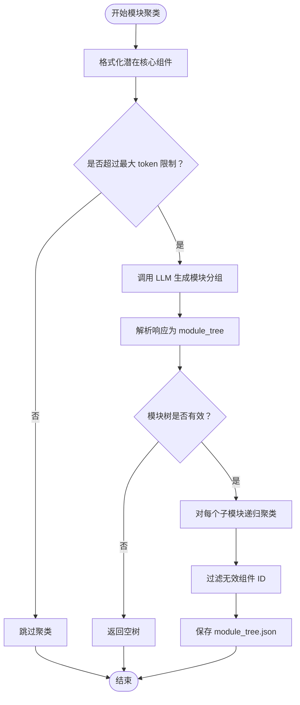
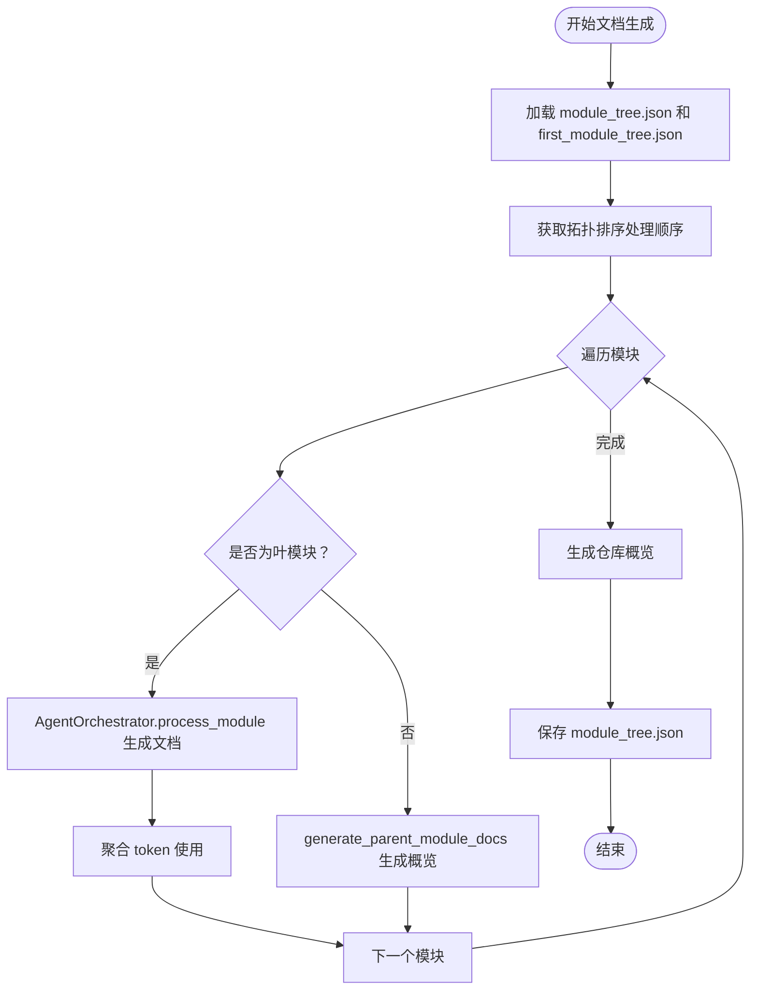
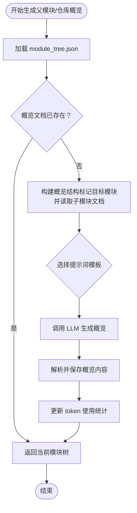
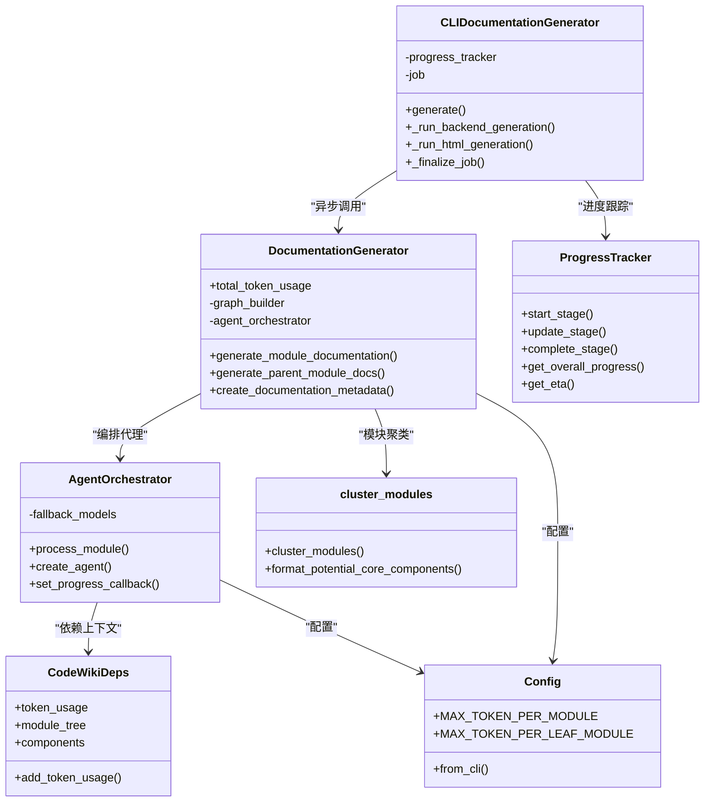

# 核心文档生成阶段

<cite>
**本文档引用的文件**
- [doc_generator.py](file://codewiki/cli/adapters/doc_generator.py)
- [documentation_generator.py](file://codewiki/src/be/documentation_generator.py)
- [cluster_modules.py](file://codewiki/src/be/cluster_modules.py)
- [progress.py](file://codewiki/cli/utils/progress.py)
- [agent_orchestrator.py](file://codewiki/src/be/agent_orchestrator.py)
- [prompt_template.py](file://codewiki/src/be/prompt_template.py)
- [config.py](file://codewiki/src/config.py)
- [deps.py](file://codewiki/src/be/agent_tools/deps.py)
- [llm_services.py](file://codewiki/src/be/llm_services.py)
</cite>

## 目录
1. [引言](#引言)
2. [项目结构](#项目结构)
3. [核心组件](#核心组件)
4. [架构总览](#架构总览)
5. [详细组件分析](#详细组件分析)
6. [依赖关系分析](#依赖关系分析)
7. [性能考虑](#性能考虑)
8. [故障排除指南](#故障排除指南)
9. [结论](#结论)

## 引言
本节聚焦于文档生成流程的第四阶段：核心文档生成。该阶段由 CLI 适配器触发，通过异步调用后端 DocumentationGenerator 完成。核心流程包含三个子阶段：
1) 依赖分析：使用 AST 解析构建代码组件依赖图；
2) 模块聚类：利用 LLM 对叶节点进行层次化聚类并生成 module_tree.json；
3) 文档生成：递归调用 AI 代理生成各模块文档，并通过 create_documentation_metadata 生成元数据。

同时，本节阐述 ProgressTracker 如何同步进度，以及 total_token_usage 的统计机制，并结合 generate_parent_module_docs 方法说明概览文档的合成逻辑。

## 项目结构
与核心文档生成相关的文件组织如下：
- CLI 层：CLIDocumentationGenerator 负责进度跟踪、配置传递和阶段编排
- 后端层：DocumentationGenerator 执行实际的依赖分析、聚类、文档生成和元数据创建
- 工具层：ProgressTracker 提供进度跟踪，AgentOrchestrator 协调 AI 代理，PromptTemplate 提供提示词模板，Config 提供配置常量，LLM Services 提供模型调用能力

图表来源
- [doc_generator.py](file://codewiki/cli/adapters/doc_generator.py#L166-L257)
- [documentation_generator.py](file://codewiki/src/be/documentation_generator.py#L137-L251)
- [cluster_modules.py](file://codewiki/src/be/cluster_modules.py#L44-L125)
- [progress.py](file://codewiki/cli/utils/progress.py#L11-L174)
- [agent_orchestrator.py](file://codewiki/src/be/agent_orchestrator.py#L59-L198)
- [prompt_template.py](file://codewiki/src/be/prompt_template.py#L1-L368)
- [config.py](file://codewiki/src/config.py#L1-L123)
- [deps.py](file://codewiki/src/be/agent_tools/deps.py#L1-L28)
- [llm_services.py](file://codewiki/src/be/llm_services.py#L1-L100)

章节来源
- [doc_generator.py](file://codewiki/cli/adapters/doc_generator.py#L1-L298)
- [documentation_generator.py](file://codewiki/src/be/documentation_generator.py#L1-L382)
- [progress.py](file://codewiki/cli/utils/progress.py#L1-L223)

## 核心组件
- CLIDocumentationGenerator：负责 CLI 上下文配置、异步执行后端生成、进度跟踪、HTML 生成（可选）和作业收尾
- DocumentationGenerator：后端主控制器，协调依赖分析、模块聚类、文档生成和元数据创建
- AgentOrchestrator：AI 代理编排器，根据模块复杂度创建不同类型的代理并处理单个模块
- ProgressTracker：进度跟踪器，提供阶段进度、总体进度和 ETA 估算
- cluster_modules：基于 LLM 的模块聚类函数，输出 module_tree.json
- PromptTemplate：提供系统提示词和用户提示词模板
- Config：全局配置常量和 CLI 配置构造
- CodeWikiDeps：代理依赖上下文，包含组件信息、模块树、路径等，并统计 token 使用

章节来源
- [doc_generator.py](file://codewiki/cli/adapters/doc_generator.py#L26-L298)
- [documentation_generator.py](file://codewiki/src/be/documentation_generator.py#L29-L382)
- [agent_orchestrator.py](file://codewiki/src/be/agent_orchestrator.py#L59-L198)
- [progress.py](file://codewiki/cli/utils/progress.py#L11-L223)
- [cluster_modules.py](file://codewiki/src/be/cluster_modules.py#L44-L125)
- [prompt_template.py](file://codewiki/src/be/prompt_template.py#L1-L368)
- [config.py](file://codewiki/src/config.py#L1-L123)
- [deps.py](file://codewiki/src/be/agent_tools/deps.py#L1-L28)

## 架构总览
核心文档生成阶段的异步调用流程如下：

图表来源
- [doc_generator.py](file://codewiki/cli/adapters/doc_generator.py#L166-L257)
- [documentation_generator.py](file://codewiki/src/be/documentation_generator.py#L137-L251)
- [agent_orchestrator.py](file://codewiki/src/be/agent_orchestrator.py#L95-L198)
- [llm_services.py](file://codewiki/src/be/llm_services.py#L58-L100)

## 详细组件分析

### 1) 依赖分析：build_dependency_graph
- 触发位置：DocumentationGenerator 在 run() 中直接调用 DependencyGraphBuilder.build_dependency_graph()
- 处理流程：
  - 初始化 DependencyParser 并解析仓库，得到组件字典
  - 保存依赖图到指定目录
  - 基于组件构建图并提取叶节点
  - 过滤无效标识符和不合适的组件类型（如仅当无类/接口/结构体时才包含函数）
- 输出：返回组件字典和有效叶节点列表，供后续聚类和文档生成使用

图表来源
- [documentation_generator.py](file://codewiki/src/be/documentation_generator.py#L327-L333)
- [dependency_graphs_builder.py](file://codewiki/src/be/dependency_analyzer/dependency_graphs_builder.py#L18-L94)

章节来源
- [documentation_generator.py](file://codewiki/src/be/documentation_generator.py#L327-L333)
- [dependency_graphs_builder.py](file://codewiki/src/be/dependency_analyzer/dependency_graphs_builder.py#L18-L94)

### 2) 模块聚类：cluster_modules
- 触发位置：DocumentationGenerator 在 run() 中调用 cluster_modules 或在 CLI 适配器中调用
- 处理流程：
  - 将叶节点按文件分组，格式化为提示词
  - 若总 token 数不超过阈值，则跳过聚类
  - 使用 LLM 生成模块分组，解析响应为 module_tree
  - 递归对每个子模块再次调用聚类，直到达到深度限制或无需进一步拆分
  - 过滤无效组件 ID，确保最终模块树中的组件存在于组件字典中
- 输出：完整的 module_tree.json，保存在 docs 目录

图表来源
- [cluster_modules.py](file://codewiki/src/be/cluster_modules.py#L44-L125)
- [prompt_template.py](file://codewiki/src/be/prompt_template.py#L159-L226)

章节来源
- [cluster_modules.py](file://codewiki/src/be/cluster_modules.py#L44-L125)
- [prompt_template.py](file://codewiki/src/be/prompt_template.py#L159-L226)

### 3) 文档生成：generate_module_documentation
- 触发位置：DocumentationGenerator.generate_module_documentation
- 处理流程：
  - 加载 module_tree.json 和 first_module_tree.json
  - 使用拓扑排序确定处理顺序（叶模块优先）
  - 对每个模块：
    - 叶模块：通过 AgentOrchestrator.process_module 调用 AI 代理生成文档，并聚合 token 使用
    - 父模块：调用 generate_parent_module_docs 生成概览文档
  - 最终生成仓库级概览文档
- 输出：各模块文档（.md 文件）和更新后的 module_tree.json

图表来源
- [documentation_generator.py](file://codewiki/src/be/documentation_generator.py#L137-L251)
- [agent_orchestrator.py](file://codewiki/src/be/agent_orchestrator.py#L95-L198)

章节来源
- [documentation_generator.py](file://codewiki/src/be/documentation_generator.py#L137-L251)
- [agent_orchestrator.py](file://codewiki/src/be/agent_orchestrator.py#L95-L198)

### 4) 概览文档合成：generate_parent_module_docs
- 触发位置：DocumentationGenerator.generate_parent_module_docs
- 处理流程：
  - 构建概览结构：在 module_tree 中标记目标模块，读取子模块文档内容
  - 根据是否有模块路径选择仓库概览或模块概览提示词
  - 调用 LLM 生成概览内容，解析并保存到 .md 文件
  - 更新 token 使用统计并通过进度回调通知
- 输出：概览文档（overview.md 或模块名.md）

图表来源
- [documentation_generator.py](file://codewiki/src/be/documentation_generator.py#L253-L318)
- [prompt_template.py](file://codewiki/src/be/prompt_template.py#L113-L157)

章节来源
- [documentation_generator.py](file://codewiki/src/be/documentation_generator.py#L253-L318)
- [prompt_template.py](file://codewiki/src/be/prompt_template.py#L113-L157)

### 5) 元数据创建：create_documentation_metadata
- 触发位置：DocumentationGenerator.create_documentation_metadata
- 处理流程：
  - 收集生成信息（时间戳、模型、版本、仓库路径、提交 ID）
  - 统计信息（组件数量、叶节点数、最大深度、token 使用）
  - 列举生成的文件（overview.md、module_tree.json、first_module_tree.json 及其他 .md）
  - 写入 metadata.json
- 输出：metadata.json

章节来源
- [documentation_generator.py](file://codewiki/src/be/documentation_generator.py#L50-L84)

### 6) 进度跟踪：ProgressTracker
- 角色：在 CLI 适配器中同步阶段进度，计算总体进度和 ETA
- 阶段权重：依赖分析 40%、模块聚类 20%、文档生成 30%、HTML 生成 5%（可选）、最终化 5%
- 功能：
  - start_stage：启动新阶段并记录开始时间
  - update_stage：更新阶段内进度和可选消息
  - complete_stage：完成阶段并输出耗时
  - get_overall_progress：计算总体进度百分比
  - get_eta：估算剩余时间

章节来源
- [progress.py](file://codewiki/cli/utils/progress.py#L11-L174)
- [doc_generator.py](file://codewiki/cli/adapters/doc_generator.py#L166-L257)

### 7) token 使用统计机制
- DocumentationGenerator.total_token_usage：累计整个文档生成过程的 prompt_tokens、completion_tokens、total_tokens
- AgentOrchestrator.process_module：从 pydantic-ai 结果中提取 usage 并累加到 CodeWikiDeps.token_usage，再汇总到 DocumentationGenerator
- cluster_modules：在聚类过程中调用 LLM 时，将 usage 累加到 token_usage_tracker（通常指向 DocumentationGenerator.total_token_usage）
- LLM Services.call_llm：支持返回 usage 字典，包含 prompt_tokens、completion_tokens、total_tokens

章节来源
- [documentation_generator.py](file://codewiki/src/be/documentation_generator.py#L38-L43)
- [agent_orchestrator.py](file://codewiki/src/be/agent_orchestrator.py#L171-L178)
- [cluster_modules.py](file://codewiki/src/be/cluster_modules.py#L63-L69)
- [llm_services.py](file://codewiki/src/be/llm_services.py#L58-L100)

## 依赖关系分析

图表来源
- [doc_generator.py](file://codewiki/cli/adapters/doc_generator.py#L26-L298)
- [documentation_generator.py](file://codewiki/src/be/documentation_generator.py#L29-L382)
- [agent_orchestrator.py](file://codewiki/src/be/agent_orchestrator.py#L59-L198)
- [progress.py](file://codewiki/cli/utils/progress.py#L11-L223)
- [cluster_modules.py](file://codewiki/src/be/cluster_modules.py#L44-L125)
- [deps.py](file://codewiki/src/be/agent_tools/deps.py#L1-L28)
- [config.py](file://codewiki/src/config.py#L44-L123)

章节来源
- [doc_generator.py](file://codewiki/cli/adapters/doc_generator.py#L26-L298)
- [documentation_generator.py](file://codewiki/src/be/documentation_generator.py#L29-L382)
- [agent_orchestrator.py](file://codewiki/src/be/agent_orchestrator.py#L59-L198)
- [progress.py](file://codewiki/cli/utils/progress.py#L11-L223)
- [cluster_modules.py](file://codewiki/src/be/cluster_modules.py#L44-L125)
- [deps.py](file://codewiki/src/be/agent_tools/deps.py#L1-L28)
- [config.py](file://codewiki/src/config.py#L44-L123)

## 性能考虑
- 依赖分析阶段：AST 解析和图构建的复杂度与组件数量和依赖关系密度相关，建议在大型仓库中启用过滤规则以减少无效组件
- 模块聚类阶段：LLM 调用次数与模块层级深度成正比，合理设置 MAX_TOKEN_PER_MODULE 阈值可避免不必要的递归
- 文档生成阶段：AgentOrchestrator 会根据模块复杂度动态选择简单代理或复杂代理，复杂代理具备子模块递归能力，需注意 token 使用上限
- token 统计：通过 total_token_usage 和 CodeWikiDeps.token_usage 双重统计，便于成本控制和优化

## 故障排除指南
- LLM API 错误：检查 LLM_BASE_URL、LLM_API_KEY、MAIN_MODEL、CLUSTER_MODEL 等配置项
- 聚类失败：确认 LLM 响应格式包含 <GROUPED_COMPONENTS> 标签，且解析结果为字典类型
- 文档生成中断：查看 AgentOrchestrator 的异常日志，关注模块是否存在重复处理或缓存冲突
- 进度卡顿：确认 ProgressTracker 的阶段权重与实际任务分配一致，必要时调整 verbose 输出定位问题

章节来源
- [llm_services.py](file://codewiki/src/be/llm_services.py#L58-L100)
- [cluster_modules.py](file://codewiki/src/be/cluster_modules.py#L72-L87)
- [agent_orchestrator.py](file://codewiki/src/be/agent_orchestrator.py#L195-L198)

## 结论
核心文档生成阶段通过 CLIDocumentationGenerator 的异步调度，将后端 DocumentationGenerator 的三大子阶段（依赖分析、模块聚类、文档生成）有机串联。ProgressTracker 提供了可靠的进度反馈，total_token_usage 机制确保了成本可控。generate_parent_module_docs 的引入使得概览文档能够基于子模块文档自动生成，形成从细节到整体的完整文档体系。