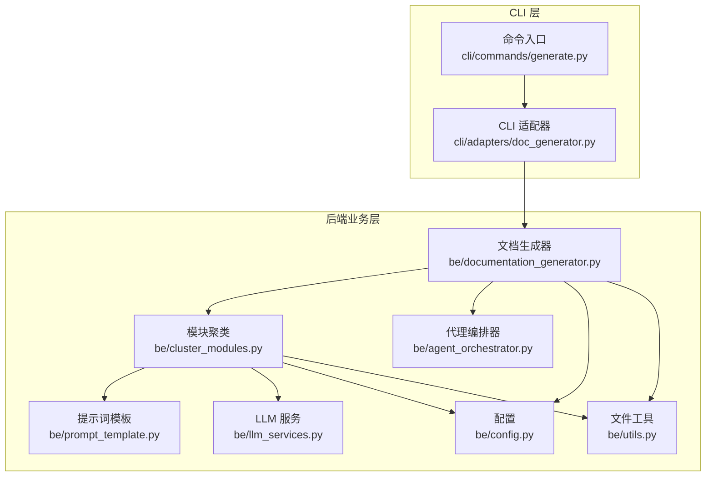
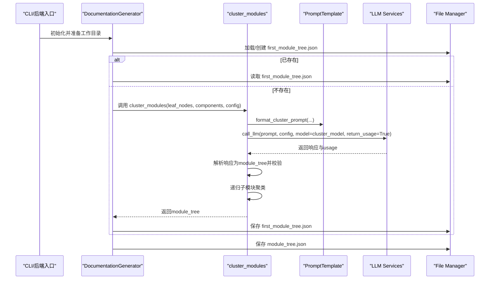
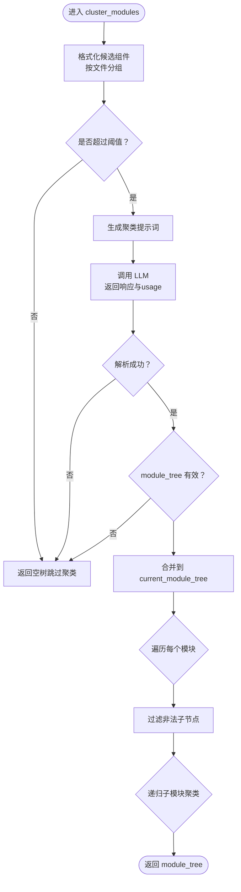
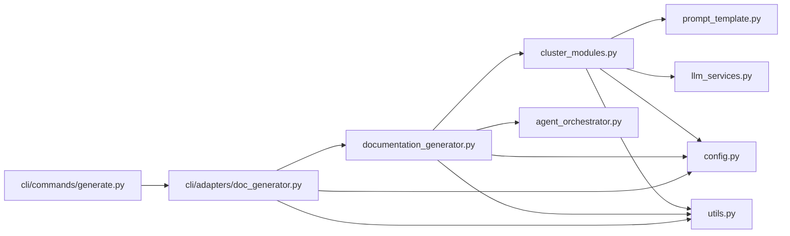

# 模块聚类阶段

<cite>
**本文引用的文件列表**
- [cluster_modules.py](file://codewiki/src/be/cluster_modules.py)
- [documentation_generator.py](file://codewiki/src/be/documentation_generator.py)
- [agent_orchestrator.py](file://codewiki/src/be/agent_orchestrator.py)
- [doc_generator.py](file://codewiki/cli/adapters/doc_generator.py)
- [prompt_template.py](file://codewiki/src/be/prompt_template.py)
- [llm_services.py](file://codewiki/src/be/llm_services.py)
- [config.py](file://codewiki/src/config.py)
- [utils.py](file://codewiki/src/utils.py)
- [generate.py](file://codewiki/cli/commands/generate.py)
</cite>

## 目录
1. [引言](#引言)
2. [项目结构](#项目结构)
3. [核心组件](#核心组件)
4. [架构总览](#架构总览)
5. [详细组件分析](#详细组件分析)
6. [依赖关系分析](#依赖关系分析)
7. [性能考量](#性能考量)
8. [故障排查指南](#故障排查指南)
9. [结论](#结论)

## 引言
本节聚焦“模块聚类阶段”，系统性阐述如何基于依赖分析得到的叶节点集合，利用大语言模型（LLM）对潜在核心组件进行层次化聚类，最终形成 module_tree.json 的过程。我们将明确 cluster_modules 函数的输入、输出、处理逻辑、LLM 在其中的角色、token 使用追踪机制，以及文件缓存策略如何避免重复 LLM 调用。同时，结合 CLIDocumentationGenerator 的实现，说明聚类结果如何被保存与验证，并解释 first_module_tree.json 与 module_tree.json 的区别与联系。

## 项目结构
模块聚类阶段位于后端业务层（be），涉及以下关键文件：
- 聚类主流程：cluster_modules.py
- 文档生成编排：documentation_generator.py
- CLI 适配器：cli/adapters/doc_generator.py
- 提示词模板：prompt_template.py
- LLM 服务封装：llm_services.py
- 配置常量与上下文：config.py
- 文件工具：utils.py
- CLI 命令入口：cli/commands/generate.py

图表来源
- [generate.py](file://codewiki/cli/commands/generate.py#L194-L228)
- [doc_generator.py](file://codewiki/cli/adapters/doc_generator.py#L166-L228)
- [documentation_generator.py](file://codewiki/src/be/documentation_generator.py#L320-L358)
- [cluster_modules.py](file://codewiki/src/be/cluster_modules.py#L44-L125)
- [prompt_template.py](file://codewiki/src/be/prompt_template.py#L339-L368)
- [llm_services.py](file://codewiki/src/be/llm_services.py#L58-L100)
- [config.py](file://codewiki/src/config.py#L12-L16)
- [utils.py](file://codewiki/src/utils.py#L10-L46)

章节来源
- [generate.py](file://codewiki/cli/commands/generate.py#L194-L228)
- [doc_generator.py](file://codewiki/cli/adapters/doc_generator.py#L166-L228)
- [documentation_generator.py](file://codewiki/src/be/documentation_generator.py#L320-L358)

## 核心组件
- cluster_modules：递归层次化聚类，将叶节点按模块划分并构建 module_tree
- prompt_template.format_cluster_prompt：根据当前模块树与候选组件生成聚类提示词
- llm_services.call_llm：统一的 LLM 调用接口，支持返回 token 使用统计
- config：提供 MAX_TOKEN_PER_MODULE 等阈值与文件名常量
- utils.file_manager：JSON/文本读写，用于持久化 first_module_tree.json 与 module_tree.json
- CLIDocumentationGenerator：在 CLI 场景下驱动聚类与后续流程，并汇总 token 统计

章节来源
- [cluster_modules.py](file://codewiki/src/be/cluster_modules.py#L44-L125)
- [prompt_template.py](file://codewiki/src/be/prompt_template.py#L339-L368)
- [llm_services.py](file://codewiki/src/be/llm_services.py#L58-L100)
- [config.py](file://codewiki/src/config.py#L12-L16)
- [utils.py](file://codewiki/src/utils.py#L10-L46)
- [doc_generator.py](file://codewiki/cli/adapters/doc_generator.py#L166-L228)

## 架构总览
模块聚类阶段的控制流如下：
- CLI 或后端入口加载或创建 module_tree.json
- 若不存在 first_module_tree.json，则调用 cluster_modules 对叶节点进行聚类
- 将聚类结果先写入 first_module_tree.json，再写入 module_tree.json
- 后续文档生成阶段以 module_tree.json 为依据，自底向上生成各模块文档与概览

图表来源
- [documentation_generator.py](file://codewiki/src/be/documentation_generator.py#L335-L358)
- [cluster_modules.py](file://codewiki/src/be/cluster_modules.py#L44-L125)
- [prompt_template.py](file://codewiki/src/be/prompt_template.py#L339-L368)
- [llm_services.py](file://codewiki/src/be/llm_services.py#L58-L100)
- [utils.py](file://codewiki/src/utils.py#L10-L46)

## 详细组件分析

### cluster_modules 函数
cluster_modules 是模块聚类阶段的核心，其职责包括：
- 输入
  - leaf_nodes：依赖分析得到的叶节点 ID 列表
  - components：组件字典，键为组件 ID，值为 Node 对象（包含相对路径、源码等）
  - config：运行时配置（含 cluster_model、MAX_TOKEN_PER_MODULE 等）
  - 可选参数：current_module_tree、current_module_name、current_module_path、token_usage_tracker
- 输出
  - module_tree：当前层级的模块树字典，包含每个模块的 path 与 components，并递归 children 子树
- 处理流程
  - 将叶节点按文件分组，格式化为提示词输入
  - 若候选组件总 token 数不超过阈值，直接跳过聚类
  - 生成聚类提示词并调用 LLM，解析响应为 module_tree
  - 校验 module_tree 结构有效性（非空且为 dict）
  - 将 module_tree 合并到 current_module_tree 中（若为空则初始化）
  - 对每个模块的 components 进行合法性过滤（仅保留存在于 components 的节点）
  - 递归调用自身处理子模块，并更新 current_module_path
- LLM 角色
  - 依据提示词将“潜在核心组件”分组为“更小的模块”，并返回模块树结构
  - 返回的 usage 用于累计 token 使用量
- 错误处理
  - 缺失标签、解析失败、类型不匹配、非法子节点等均会记录错误并返回空树
- token 使用追踪
  - 若传入 token_usage_tracker，将 prompt_tokens、completion_tokens、total_tokens 累加

图表来源
- [cluster_modules.py](file://codewiki/src/be/cluster_modules.py#L44-L125)

章节来源
- [cluster_modules.py](file://codewiki/src/be/cluster_modules.py#L44-L125)

### 提示词模板与 LLM 调用
- format_cluster_prompt
  - 当前模块树为空时，使用仓库级聚类提示词；否则使用模块级聚类提示词
  - 将当前模块树格式化为层级结构，便于 LLM 理解上下文
- llm_services.call_llm
  - 统一的 LLM 调用封装，支持返回 usage（prompt_tokens、completion_tokens、total_tokens）

章节来源
- [prompt_template.py](file://codewiki/src/be/prompt_template.py#L339-L368)
- [llm_services.py](file://codewiki/src/be/llm_services.py#L58-L100)

### first_module_tree.json 与 module_tree.json 的区别与联系
- first_module_tree.json
  - 由 cluster_modules 生成并保存，作为首次聚类结果的快照
  - 通常在 CLI 或后端首次运行时生成，便于后续复用
- module_tree.json
  - 在聚类完成后，将 first_module_tree.json 内容复制到 module_tree.json
  - 后续文档生成阶段以 module_tree.json 为权威数据源
- 关系
  - first_module_tree.json 是中间产物；module_tree.json 是最终稳定版本
  - 两者结构一致，均表示模块树，差异仅在于命名与保存时机

章节来源
- [documentation_generator.py](file://codewiki/src/be/documentation_generator.py#L339-L358)
- [doc_generator.py](file://codewiki/cli/adapters/doc_generator.py#L205-L221)
- [config.py](file://codewiki/src/config.py#L12-L13)

### token 使用量跟踪机制
- cluster_modules
  - 接收 token_usage_tracker 参数，将每次 LLM 调用的 usage 累加
- DocumentationGenerator
  - 在 run 中维护 total_token_usage，用于记录整个生成流程的 token 使用
- AgentOrchestrator
  - 在处理模块时从代理结果中提取 usage 并累加到 deps.token_usage
- CLI 适配器
  - 在聚类阶段单独统计 clustering_token_usage，并在完成后汇总到 job.statistics.total_tokens_used

章节来源
- [cluster_modules.py](file://codewiki/src/be/cluster_modules.py#L65-L69)
- [documentation_generator.py](file://codewiki/src/be/documentation_generator.py#L38-L43)
- [agent_orchestrator.py](file://codewiki/src/be/agent_orchestrator.py#L171-L178)
- [doc_generator.py](file://codewiki/cli/adapters/doc_generator.py#L212-L218)

### 文件缓存与避免重复 LLM 调用
- first_module_tree.json 缓存
  - 若存在 first_module_tree.json，则直接加载，跳过 LLM 聚类步骤
  - CLI 与后端均遵循此策略，避免重复调用 LLM
- module_tree.json 作为最终落盘
  - first_module_tree.json 生成后，立即保存为 module_tree.json，确保后续流程可直接读取
- 注意
  - 代码未实现基于 prompt 内容的 LLM 响应缓存（如哈希键值对缓存）
  - 如需进一步减少 LLM 调用，可在 cluster_modules 外层增加基于 prompt 内容的缓存层

章节来源
- [documentation_generator.py](file://codewiki/src/be/documentation_generator.py#L342-L358)
- [doc_generator.py](file://codewiki/cli/adapters/doc_generator.py#L208-L221)

### 与 CLIDocumentationGenerator 的集成与验证
- CLIDocumentationGenerator
  - 在“模块聚类”阶段，若 first_module_tree.json 不存在则调用 cluster_modules，并将聚类 token 使用量写入 job.statistics
  - 聚类完成后，将 module_tree.json 保存到输出目录
- 验证
  - CLI 命令 generate 支持 --no-cache，强制忽略缓存重新生成
  - 生成完成后，CLI 会列出生成的文件（含 module_tree.json、overview.md 等），便于人工核验

章节来源
- [doc_generator.py](file://codewiki/cli/adapters/doc_generator.py#L166-L228)
- [generate.py](file://codewiki/cli/commands/generate.py#L52-L56)

## 依赖关系分析
- cluster_modules 依赖
  - prompt_template.format_cluster_prompt：构造聚类提示词
  - llm_services.call_llm：执行 LLM 调用并返回 usage
  - config.MAX_TOKEN_PER_MODULE：聚类阈值
  - utils.file_manager：读写 JSON 文件
- DocumentationGenerator 依赖
  - cluster_modules：聚类主流程
  - agent_orchestrator：模块文档生成与概览生成
  - config：文件名常量与阈值
  - utils.file_manager：读写 JSON/文本
- CLIDocumentationGenerator 依赖
  - DocumentationGenerator：实际生成流程
  - config：CLI 上下文配置
  - utils.file_manager：读写 JSON/文本

图表来源
- [cluster_modules.py](file://codewiki/src/be/cluster_modules.py#L7-L11)
- [documentation_generator.py](file://codewiki/src/be/documentation_generator.py#L12-L26)
- [doc_generator.py](file://codewiki/cli/adapters/doc_generator.py#L166-L175)
- [generate.py](file://codewiki/cli/commands/generate.py#L206-L220)

章节来源
- [cluster_modules.py](file://codewiki/src/be/cluster_modules.py#L7-L11)
- [documentation_generator.py](file://codewiki/src/be/documentation_generator.py#L12-L26)
- [doc_generator.py](file://codewiki/cli/adapters/doc_generator.py#L166-L175)
- [generate.py](file://codewiki/cli/commands/generate.py#L206-L220)

## 性能考量
- 聚类阈值
  - MAX_TOKEN_PER_MODULE 控制是否触发 LLM 聚类，避免对小规模组件进行昂贵的 LLM 调用
- 递归深度与子模块数量
  - 子模块数量越多，LLM 调用次数越多，token 使用量随之增长
- 提示词长度优化
  - 通过按文件分组与精简提示词，有助于降低 token 使用
- 缓存策略
  - first_module_tree.json 缓存可显著减少重复 LLM 调用
  - 可考虑引入基于 prompt 内容的响应缓存以进一步降本增效

## 故障排查指南
- LLM 响应格式异常
  - 现象：缺少 <GROUPED_COMPONENTS> 标签或解析失败
  - 处理：检查提示词模板与 LLM 输出稳定性；必要时调整 cluster_model 或提示词
- 模块树结构无效
  - 现象：返回非 dict 类型或模块数小于等于 1
  - 处理：确认 components 与 leaf_nodes 的一致性；检查过滤逻辑
- 非法子节点
  - 现象：日志提示过滤掉部分子节点
  - 处理：检查 components 字典完整性；确保所有组件 ID 均存在
- token 使用统计不准确
  - 现象：total_tokens 不包含某些阶段的使用量
  - 处理：确认各阶段均调用 return_usage 并正确累加

章节来源
- [cluster_modules.py](file://codewiki/src/be/cluster_modules.py#L72-L87)
- [cluster_modules.py](file://codewiki/src/be/cluster_modules.py#L90-L92)
- [cluster_modules.py](file://codewiki/src/be/cluster_modules.py#L110-L118)

## 结论
模块聚类阶段通过 cluster_modules 将依赖分析得到的叶节点进行层次化聚类，借助 LLM 将“潜在核心组件”组织为模块树，并以 first_module_tree.json 与 module_tree.json 两种形式持久化。该阶段的关键在于：
- 明确的输入输出结构与递归处理逻辑
- LLM 在聚类中的核心作用与严格的响应解析与校验
- 通过 first_module_tree.json 实现的文件缓存，避免重复 LLM 调用
- 完整的 token 使用追踪与 CLI/后端双通道验证

未来可进一步引入基于提示词内容的 LLM 响应缓存，以更彻底地降低 LLM 成本并提升稳定性。