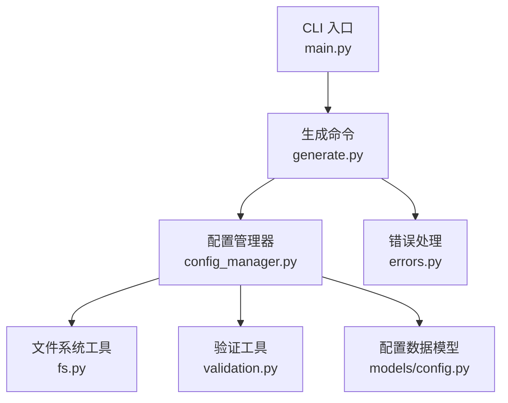
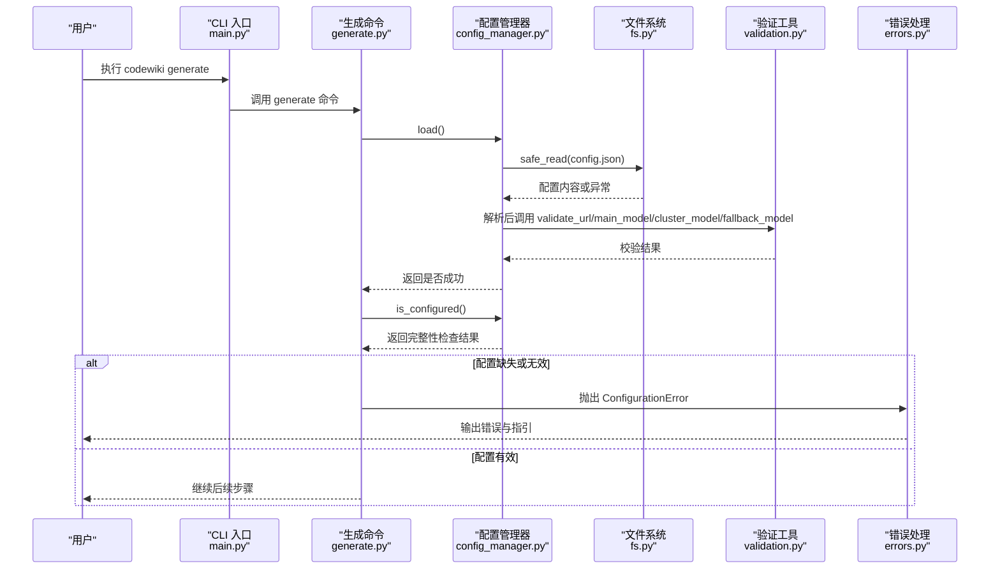
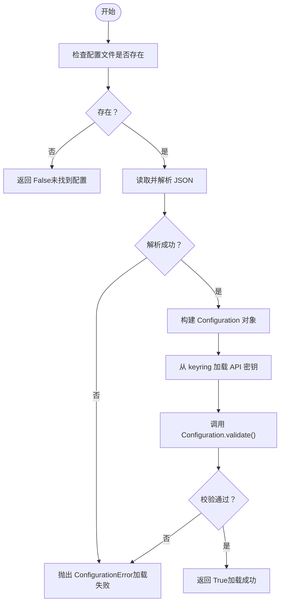
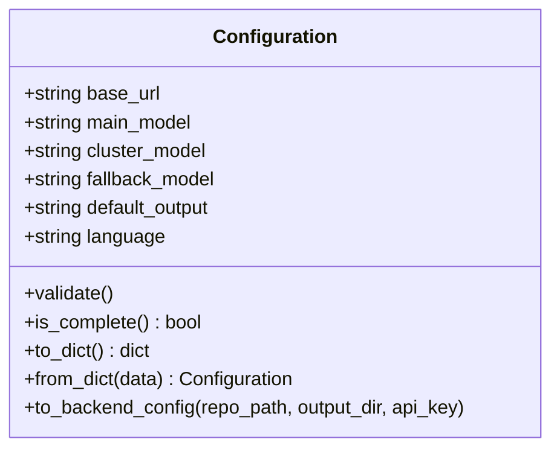
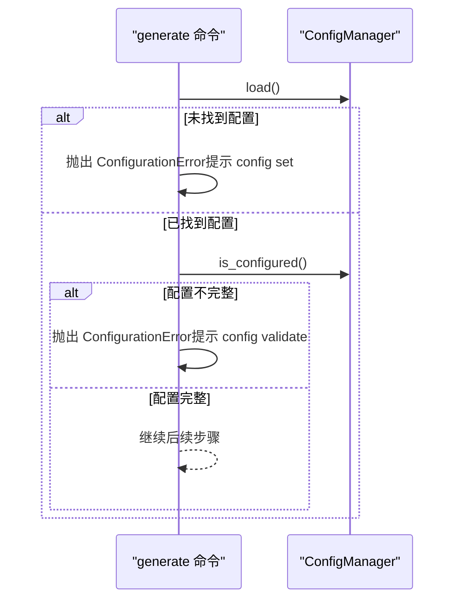
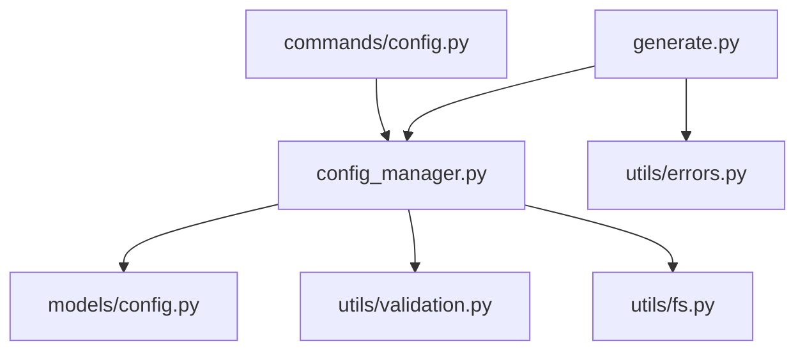

# 配置验证阶段

<cite>
**本文引用的文件列表**
- [config_manager.py](file://codewiki/cli/config_manager.py)
- [generate.py](file://codewiki/cli/commands/generate.py)
- [config.py](file://codewiki/cli/models/config.py)
- [errors.py](file://codewiki/cli/utils/errors.py)
- [validation.py](file://codewiki/cli/utils/validation.py)
- [fs.py](file://codewiki/cli/utils/fs.py)
- [config.py](file://codewiki/cli/commands/config.py)
- [config.py](file://codewiki/src/config.py)
- [main.py](file://codewiki/cli/main.py)
</cite>

## 目录
1. [简介](#简介)
2. [项目结构与入口](#项目结构与入口)
3. [核心组件](#核心组件)
4. [架构总览](#架构总览)
5. [详细组件分析](#详细组件分析)
6. [依赖关系分析](#依赖关系分析)
7. [性能与安全考量](#性能与安全考量)
8. [故障排查指南](#故障排查指南)
9. [结论](#结论)

## 简介
本节聚焦于文档生成流程的第一阶段“配置验证”。目标是说明 ConfigManager 如何加载并验证 LLM API 密钥、基础 URL 和模型配置（main_model、cluster_model），并在配置缺失或无效时抛出 ConfigurationError 并提示用户运行 codewiki config set 进行配置。同时结合 generate.py 中的 load() 与 is_configured() 调用，阐述配置文件的查找路径、格式验证机制以及敏感信息的安全处理策略；并给出典型错误示例及通过环境变量或命令行参数覆盖配置的方法。

## 项目结构与入口
- CLI 主程序在 main.py 中注册命令组与子命令，其中 generate 命令负责文档生成流程。
- generate 命令在执行前会调用 ConfigManager 完成配置加载与完整性校验。
- 配置文件位于用户主目录下的 ~/.codewiki/config.json，API 密钥通过系统 keyring 安全存储。

图表来源
- [main.py](file://codewiki/cli/main.py#L34-L39)
- [generate.py](file://codewiki/cli/commands/generate.py#L104-L130)
- [config_manager.py](file://codewiki/cli/config_manager.py#L51-L83)
- [fs.py](file://codewiki/cli/utils/fs.py#L60-L114)
- [validation.py](file://codewiki/cli/utils/validation.py#L13-L53)
- [config.py](file://codewiki/cli/models/config.py#L40-L51)

章节来源
- [main.py](file://codewiki/cli/main.py#L34-L39)
- [generate.py](file://codewiki/cli/commands/generate.py#L104-L130)

## 核心组件
- ConfigManager：负责配置文件的读取、保存、版本兼容、API 密钥从系统 keyring 加载、配置完整性检查等。
- Configuration 数据模型：定义 base_url、main_model、cluster_model、fallback_model、default_output、language 等字段，并提供 validate() 与 is_complete()。
- 验证工具：validate_url、validate_api_key、validate_model_name 等，统一抛出 ConfigurationError。
- 文件系统工具：safe_read/safe_write、ensure_directory 等，封装异常为 FileSystemError。
- 错误处理：统一的 CodeWikiError 及其子类，包含 ConfigurationError 的退出码。
- 生成命令：在执行前调用 ConfigManager.load() 与 is_configured()，并在失败时输出明确指引。

章节来源
- [config_manager.py](file://codewiki/cli/config_manager.py#L26-L237)
- [config.py](file://codewiki/cli/models/config.py#L20-L113)
- [validation.py](file://codewiki/cli/utils/validation.py#L13-L98)
- [fs.py](file://codewiki/cli/utils/fs.py#L13-L114)
- [errors.py](file://codewiki/cli/utils/errors.py#L27-L62)
- [generate.py](file://codewiki/cli/commands/generate.py#L104-L130)

## 架构总览
下图展示了配置验证阶段的关键交互：generate 命令触发 ConfigManager.load() 读取配置文件并进行格式与内容校验；随后通过 is_configured() 检查完整性；若失败则抛出 ConfigurationError 并提示用户使用 codewiki config set 设置配置。

图表来源
- [generate.py](file://codewiki/cli/commands/generate.py#L104-L130)
- [config_manager.py](file://codewiki/cli/config_manager.py#L51-L83)
- [fs.py](file://codewiki/cli/utils/fs.py#L89-L114)
- [validation.py](file://codewiki/cli/utils/validation.py#L13-L98)
- [errors.py](file://codewiki/cli/utils/errors.py#L36-L41)

## 详细组件分析

### ConfigManager：配置加载与验证
- 配置文件位置与版本：
  - 配置文件默认位于用户主目录下的 ~/.codewiki/config.json。
  - 支持版本字段，当前版本号为固定常量，用于未来迁移预留。
- 加载流程：
  - 若配置文件不存在，load() 返回 False。
  - 读取 JSON 内容后解析为 Configuration 对象，并尝试从系统 keyring 获取 API 密钥。
  - 任何 JSON 解析或文件系统错误均包装为 ConfigurationError。
- 保存流程：
  - 保存前先确保配置目录存在，创建失败即抛出 ConfigurationError。
  - 更新字段后调用 Configuration.validate() 进行格式校验。
  - API 密钥通过 keyring 存储；若 keyring 不可用，则抛出 ConfigurationError 提示正确配置系统密钥环。
  - 非敏感配置写入 config.json，采用原子写入（临时文件+重命名）以保证一致性。
- 完整性检查：
  - is_configured() 要求已设置 API 密钥且 Configuration.is_complete() 为真（base_url、main_model、cluster_model、fallback_model 均非空）。

图表来源
- [config_manager.py](file://codewiki/cli/config_manager.py#L51-L83)
- [config.py](file://codewiki/cli/models/config.py#L40-L51)
- [fs.py](file://codewiki/cli/utils/fs.py#L89-L114)

章节来源
- [config_manager.py](file://codewiki/cli/config_manager.py#L26-L237)
- [config.py](file://codewiki/cli/models/config.py#L20-L113)
- [fs.py](file://codewiki/cli/utils/fs.py#L13-L114)

### Configuration 数据模型与验证规则
- 字段定义：
  - base_url：LLM API 基础 URL。
  - main_model：主模型名称。
  - cluster_model：聚类模型名称。
  - fallback_model：回退模型名称，默认值存在。
  - default_output：默认输出目录。
  - language：文档语言。
- 校验逻辑：
  - validate() 调用 validate_url(base_url) 与 validate_model_name(...) 三遍（主模型、聚类模型、回退模型）。
  - is_complete() 要求上述四项非空才视为完整。
- 转换到后端配置：
  - to_backend_config() 将 CLI 配置转换为后端 Config，供生成流程使用。

图表来源
- [config.py](file://codewiki/cli/models/config.py#L20-L113)

章节来源
- [config.py](file://codewiki/cli/models/config.py#L20-L113)

### 验证工具与错误类型
- URL 校验：
  - 必须包含协议与主机名；可选要求 HTTPS（本地回环允许 HTTP）。
- API 密钥校验：
  - 非空且长度不小于阈值（默认较大长度）。
- 模型名称校验：
  - 非空且去除首尾空白。
- 错误类型：
  - 所有校验失败均抛出 ConfigurationError，统一由 CLI 错误处理模块接管并输出人类可读提示。

章节来源
- [validation.py](file://codewiki/cli/utils/validation.py#L13-L98)
- [errors.py](file://codewiki/cli/utils/errors.py#L27-L62)

### 生成命令中的配置验证调用
- load()：
  - 若返回 False，直接抛出 ConfigurationError，提示用户运行 codewiki config set 并附带示例命令。
- is_configured()：
  - 若返回 False，抛出 ConfigurationError，提示用户运行 codewiki config validate。
- 语言覆盖：
  - 命令行 --language 参数优先于配置文件中的 language。

图表来源
- [generate.py](file://codewiki/cli/commands/generate.py#L104-L130)

章节来源
- [generate.py](file://codewiki/cli/commands/generate.py#L104-L130)

### 配置文件查找路径与格式验证
- 查找路径：
  - 默认位于 ~/.codewiki/config.json。
- 格式验证：
  - JSON 解析失败或文件系统异常均包装为 ConfigurationError。
  - 版本字段存在但不匹配时保留迁移扩展点（当前不做迁移）。
- 敏感信息处理：
  - API 密钥通过系统 keyring 存储；若不可用则抛出错误提示正确配置系统密钥环。
  - 配置文件仅保存非敏感项（base_url、main_model、cluster_model、fallback_model、default_output、language 等）。

章节来源
- [config_manager.py](file://codewiki/cli/config_manager.py#L20-L23)
- [config_manager.py](file://codewiki/cli/config_manager.py#L51-L83)
- [config_manager.py](file://codewiki/cli/config_manager.py#L143-L153)
- [fs.py](file://codewiki/cli/utils/fs.py#L60-L114)

### 环境变量与命令行参数覆盖
- 环境变量（Web 应用模式）：
  - 在 src/config.py 中，LLM 相关变量默认从环境变量读取，如 MAIN_MODEL、CLUSTER_MODEL、LLM_BASE_URL、LLM_API_KEY、LANGUAGE。
- CLI 模式：
  - generate 命令支持 --language 覆盖配置文件的语言设置。
  - 其他配置项需通过 codewiki config set 设置，不支持直接命令行覆盖。

章节来源
- [config.py](file://codewiki/src/config.py#L34-L42)
- [config.py](file://codewiki/src/config.py#L82-L123)
- [generate.py](file://codewiki/cli/commands/generate.py#L64-L67)

## 依赖关系分析
- generate 命令依赖 ConfigManager 完成配置加载与校验。
- ConfigManager 依赖：
  - Configuration 数据模型进行字段校验与序列化。
  - 验证工具进行 URL、API 密钥、模型名称的格式校验。
  - 文件系统工具进行安全读写与目录创建。
  - 错误处理模块统一抛出 ConfigurationError。
- config 命令提供配置设置、显示与验证功能，与 ConfigManager 协同完成配置生命周期管理。

图表来源
- [generate.py](file://codewiki/cli/commands/generate.py#L104-L130)
- [config_manager.py](file://codewiki/cli/config_manager.py#L51-L83)
- [config.py](file://codewiki/cli/models/config.py#L40-L51)
- [validation.py](file://codewiki/cli/utils/validation.py#L13-L98)
- [fs.py](file://codewiki/cli/utils/fs.py#L60-L114)
- [config.py](file://codewiki/cli/commands/config.py#L32-L174)

章节来源
- [generate.py](file://codewiki/cli/commands/generate.py#L104-L130)
- [config_manager.py](file://codewiki/cli/config_manager.py#L51-L83)
- [config.py](file://codewiki/cli/models/config.py#L40-L51)
- [validation.py](file://codewiki/cli/utils/validation.py#L13-L98)
- [fs.py](file://codewiki/cli/utils/fs.py#L60-L114)
- [config.py](file://codewiki/cli/commands/config.py#L32-L174)

## 性能与安全考量
- 性能：
  - 配置文件读取与 JSON 解析为轻量操作，开销极低。
  - keyring 访问可能受平台差异影响，但 ConfigManager 已做降级处理（不可用时仍可工作）。
- 安全：
  - API 密钥不落盘明文，优先存入系统 keyring；若不可用则抛错提示正确配置系统密钥环。
  - 配置文件采用原子写入，避免部分写入导致损坏。
  - 命令行显示 API 密钥时进行掩码处理，仅展示前后若干字符。

章节来源
- [config_manager.py](file://codewiki/cli/config_manager.py#L143-L153)
- [fs.py](file://codewiki/cli/utils/fs.py#L60-L87)
- [validation.py](file://codewiki/cli/utils/validation.py#L231-L250)

## 故障排查指南
- 常见错误与提示
  - “配置未找到或无效”：通常表示 ~/.codewiki/config.json 不存在或格式错误。请运行 codewiki config set 完成配置。
  - “配置不完整”：表示缺少 API 密钥或某些模型配置为空。请运行 codewiki config validate 检查并修复。
  - “系统密钥环不可用”：提示系统 keychain 未正确配置。请按平台要求启用并配置相应服务。
  - “URL 格式无效/缺少协议/缺少主机名”：请检查 base_url 是否包含协议与主机名，必要时使用 HTTPS。
  - “API 密钥为空或过短”：请提供有效且长度足够的 API 密钥。
  - “模型名称为空”：请为 main_model、cluster_model、fallback_model 提供有效名称。
- 处理建议
  - 使用 codewiki config set 设置或更新配置。
  - 使用 codewiki config validate 进行快速或完整验证（可加 --quick 或 --verbose）。
  - 通过 codewiki config show 查看当前配置（API 密钥会掩码显示）。

章节来源
- [generate.py](file://codewiki/cli/commands/generate.py#L111-L122)
- [config.py](file://codewiki/cli/commands/config.py#L313-L318)
- [config.py](file://codewiki/cli/commands/config.py#L332-L338)
- [validation.py](file://codewiki/cli/utils/validation.py#L13-L53)
- [validation.py](file://codewiki/cli/utils/validation.py#L55-L98)

## 结论
配置验证阶段通过 ConfigManager 实现了对 LLM API 密钥、基础 URL 与模型配置的严格校验，并在失败时提供明确的错误信息与修复指引。generate 命令在启动前调用 load() 与 is_configured()，确保后续流程的稳定性与安全性。对于敏感信息，系统优先采用系统 keyring 存储；配置文件仅保存非敏感项并通过原子写入保障一致性。通过 codewiki config set/validate/show，用户可以便捷地完成配置设置、验证与查看。