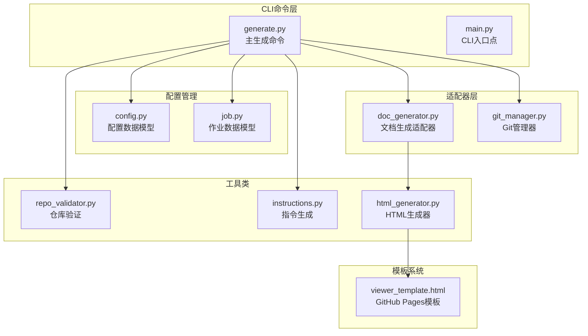
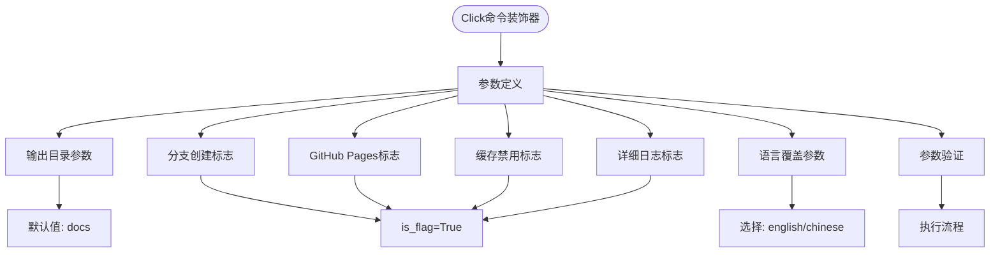
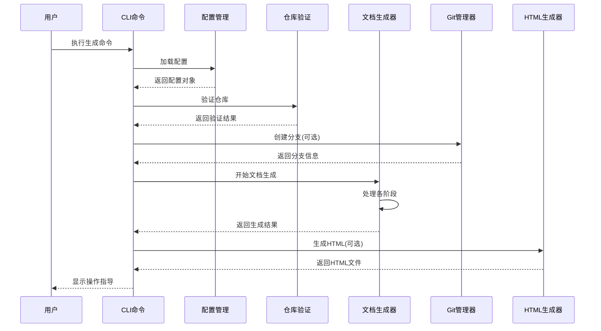
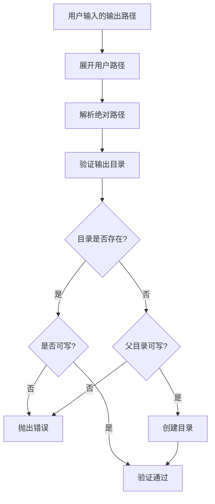
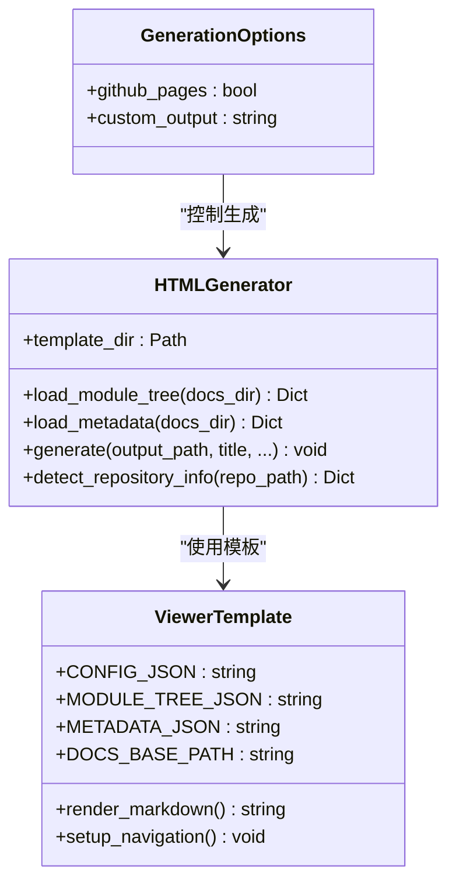
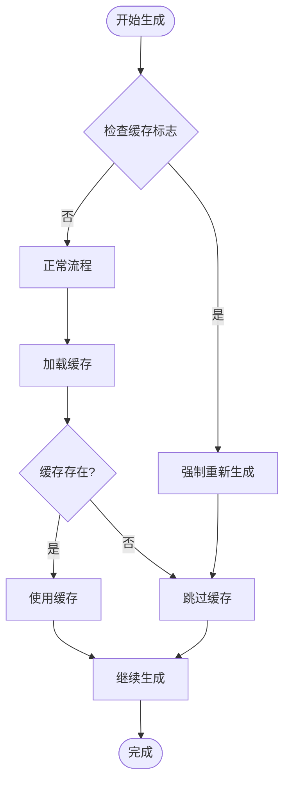
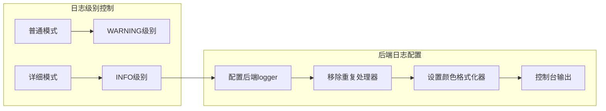
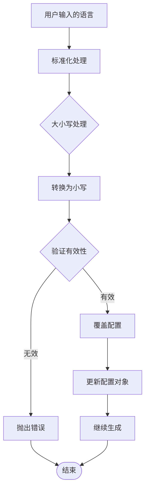
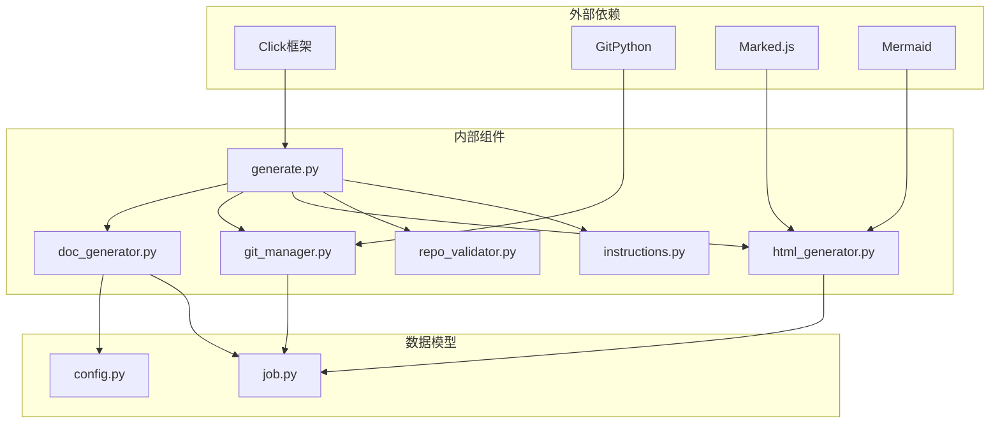

# 生成命令选项

<cite>
**本文档引用的文件**
- [generate.py](file://codewiki/cli/commands/generate.py)
- [main.py](file://codewiki/cli/main.py)
- [config.py](file://codewiki/cli/models/config.py)
- [job.py](file://codewiki/cli/models/job.py)
- [doc_generator.py](file://codewiki/cli/adapters/doc_generator.py)
- [git_manager.py](file://codewiki/cli/git_manager.py)
- [repo_validator.py](file://codewiki/cli/utils/repo_validator.py)
- [instructions.py](file://codewiki/cli/utils/instructions.py)
- [html_generator.py](file://codewiki/cli/html_generator.py)
- [viewer_template.html](file://codewiki/templates/github_pages/viewer_template.html)
- [README.md](file://README.md)
</cite>

## 目录
1. [简介](#简介)
2. [项目结构](#项目结构)
3. [核心组件](#核心组件)
4. [架构概览](#架构概览)
5. [详细组件分析](#详细组件分析)
6. [依赖关系分析](#依赖关系分析)
7. [性能考虑](#性能考虑)
8. [故障排除指南](#故障排除指南)
9. [结论](#结论)

## 简介

本文档深入分析CodeWiki CLI中`generate`命令的所有CLI选项。该命令通过Click框架实现，提供了丰富的参数配置选项，支持从基础文档生成到完整的GitHub Pages部署工作流。本文将详细解释每个选项的用途、行为机制以及它们如何协同工作来实现高效的代码库文档生成。

## 项目结构

CodeWiki CLI采用模块化设计，主要组件分布如下：



**图表来源**
- [generate.py](file://codewiki/cli/commands/generate.py#L1-L276)
- [main.py](file://codewiki/cli/main.py#L1-L57)
- [config.py](file://codewiki/cli/models/config.py#L1-L113)

**章节来源**
- [generate.py](file://codewiki/cli/commands/generate.py#L1-L276)
- [main.py](file://codewiki/cli/main.py#L1-L57)

## 核心组件

### CLI命令装饰器与参数定义

生成命令通过Click框架实现，包含以下关键参数：



**图表来源**
- [generate.py](file://codewiki/cli/commands/generate.py#L34-L67)

### 参数解析与传递机制

每个CLI选项都经过严格的解析和验证过程：

1. **参数类型检查**: 使用Click的类型系统确保参数格式正确
2. **默认值处理**: 未提供的参数使用预设默认值
3. **环境变量支持**: 支持通过环境变量覆盖配置
4. **参数组合验证**: 检查相互依赖关系和约束条件

**章节来源**
- [generate.py](file://codewiki/cli/commands/generate.py#L34-L67)

## 架构概览

生成命令的整体架构采用分层设计，确保各组件职责清晰且松耦合：



**图表来源**
- [generate.py](file://codewiki/cli/commands/generate.py#L98-L275)
- [doc_generator.py](file://codewiki/cli/adapters/doc_generator.py#L114-L165)

## 详细组件分析

### 输出目录选项 (--output/-o)

#### 功能描述
`--output`参数用于指定生成文档的输出目录，默认值为`./docs`。

#### 实现机制


**图表来源**
- [generate.py](file://codewiki/cli/commands/generate.py#L154-L156)
- [repo_validator.py](file://codewiki/cli/utils/repo_validator.py#L72-L114)

#### 关键特性
- **路径解析**: 自动处理`~`用户目录和相对路径
- **权限检查**: 确保输出目录具有写入权限
- **自动创建**: 如需可在运行时创建缺失的目录结构

**章节来源**
- [generate.py](file://codewiki/cli/commands/generate.py#L35-L41)
- [repo_validator.py](file://codewiki/cli/utils/repo_validator.py#L72-L114)

### Git分支创建选项 (--create-branch)

#### 功能描述
`--create-branch`标志用于在Git仓库中创建专用的文档分支，便于版本控制和审查流程。

#### 实现机制
```mermaid
stateDiagram-v2
[*] --> 检查仓库状态
检查仓库状态 --> 工作区检查
工作区检查 --> 清洁状态{工作区是否干净?}
清洁状态 --> |否| 错误处理
清洁状态 --> |是| 生成分支名
生成分支名 --> 创建分支
创建分支 --> 切换分支
切换分支 --> 完成
错误处理 --> [*]
完成 --> [*]
```

**图表来源**
- [generate.py](file://codewiki/cli/commands/generate.py#L168-L193)
- [git_manager.py](file://codewiki/cli/git_manager.py#L73-L122)

#### 分支命名策略
- **时间戳**: 基于当前时间生成唯一标识
- **冲突解决**: 自动处理重复分支名
- **格式规范**: `docs/codewiki-YYYYMMDD-HHMMSS`

#### 工作区要求
- **无未提交更改**: 确保分支创建前的工作区清洁
- **无未跟踪文件**: 避免意外包含临时文件
- **权限验证**: 确保有权限创建和切换分支

**章节来源**
- [generate.py](file://codewiki/cli/commands/generate.py#L42-L46)
- [git_manager.py](file://codewiki/cli/git_manager.py#L73-L122)

### GitHub Pages选项 (--github-pages)

#### 功能描述
`--github-pages`选项启用HTML查看器生成，支持GitHub Pages部署，创建交互式文档浏览体验。

#### 实现机制


**图表来源**
- [html_generator.py](file://codewiki/cli/html_generator.py#L13-L33)
- [generate.py](file://codewiki/cli/commands/generate.py#L199-L220)

#### HTML生成流程
1. **模板加载**: 从包模板目录加载HTML模板
2. **内容嵌入**: 将模块树和元数据嵌入到模板中
3. **静态生成**: 生成独立的HTML文件，无需服务器端渲染
4. **资源优化**: 内联CSS和JavaScript，减少HTTP请求

#### GitHub Pages集成
- **URL检测**: 自动检测GitHub仓库URL并计算Pages地址
- **相对路径**: 正确处理相对路径以适应Pages部署
- **SEO优化**: 包含适当的元数据和链接结构

**章节来源**
- [generate.py](file://codewiki/cli/commands/generate.py#L47-L51)
- [html_generator.py](file://codewiki/cli/html_generator.py#L83-L172)

### 缓存禁用选项 (--no-cache)

#### 功能描述
`--no-cache`标志强制忽略缓存并重新执行完整分析流程，确保每次生成都是最新的结果。

#### 实现机制


**图表来源**
- [generate.py](file://codewiki/cli/commands/generate.py#L52-L56)
- [doc_generator.py](file://codewiki/cli/adapters/doc_generator.py#L166-L257)

#### 缓存策略
- **模块树缓存**: 保存聚类结果以避免重复计算
- **LLM调用缓存**: 存储API响应以减少费用
- **文件变更检测**: 自动检测源文件变化并失效相关缓存

#### 性能影响
- **首次运行**: 强制模式会增加处理时间
- **增量更新**: 正常模式下可显著提升后续生成速度
- **成本控制**: 缓存机制有助于控制LLM API费用

**章节来源**
- [generate.py](file://codewiki/cli/commands/generate.py#L52-L56)

### 详细日志选项 (--verbose/-v)

#### 功能描述
`--verbose`选项开启详细日志输出，便于调试和监控生成过程的各个阶段。

#### 实现机制


**图表来源**
- [generate.py](file://codewiki/cli/commands/generate.py#L57-L62)
- [doc_generator.py](file://codewiki/cli/adapters/doc_generator.py#L73-L113)

#### 日志输出层次
- **CLI层**: 用户友好的进度指示和状态信息
- **后端层**: 技术细节的调试信息和错误追踪
- **统一格式**: 使用颜色编码区分不同严重级别的消息

#### 调试价值
- **性能分析**: 监控各阶段耗时和资源使用
- **错误定位**: 提供详细的堆栈跟踪和上下文信息
- **配置验证**: 显示实际使用的配置参数和环境变量

**章节来源**
- [generate.py](file://codewiki/cli/commands/generate.py#L57-L62)

### 语言覆盖选项 (--language)

#### 功能描述
`--language`参数允许覆盖配置文件中的语言设置，支持`english`和`chinese`两种选择。

#### 实现机制


**图表来源**
- [generate.py](file://codewiki/cli/commands/generate.py#L63-L67)
- [config.py](file://codewiki/cli/models/config.py#L38-L38)

#### 优先级规则
1. **命令行参数**: 具有最高优先级
2. **配置文件**: 次之
3. **默认值**: 最低优先级（english）

#### 支持的语言
- **english**: 英语输出，适合国际团队和开源项目
- **chinese**: 中文输出，适合中文用户和技术文档

**章节来源**
- [generate.py](file://codewiki/cli/commands/generate.py#L63-L67)
- [config.py](file://codewiki/cli/models/config.py#L38-L38)

## 依赖关系分析

### 组件间依赖关系



**图表来源**
- [generate.py](file://codewiki/cli/commands/generate.py#L1-L31)
- [doc_generator.py](file://codewiki/cli/adapters/doc_generator.py#L21-L24)

### 数据流分析

生成命令的数据流遵循以下模式：

1. **输入阶段**: 解析CLI参数和配置文件
2. **验证阶段**: 检查仓库状态和输出目录权限
3. **准备阶段**: 初始化Git管理和HTML生成器
4. **执行阶段**: 运行文档生成的各个阶段
5. **收尾阶段**: 生成HTML文件和显示操作指导

**章节来源**
- [generate.py](file://codewiki/cli/commands/generate.py#L104-L275)

## 性能考虑

### 缓存优化策略

- **智能缓存失效**: 基于文件修改时间和依赖关系判断缓存有效性
- **增量处理**: 只重新处理发生变化的模块和文件
- **内存管理**: 合理控制同时处理的模块数量，避免内存溢出

### 并行处理能力

- **多线程支持**: 在I/O密集型任务中利用并发提高效率
- **异步处理**: 对LLM API调用使用异步模式减少等待时间
- **资源限制**: 通过配置参数控制并发度，平衡性能和稳定性

### 资源使用监控

- **内存使用**: 监控生成过程中的内存占用，及时释放不需要的对象
- **网络带宽**: 优化API调用频率，避免过度请求
- **磁盘空间**: 预先检查可用空间，避免生成过程中因磁盘不足失败

## 故障排除指南

### 常见问题及解决方案

#### Git相关问题
- **工作区不干净**: 使用`git status`检查未提交更改，先提交或暂存再重试
- **权限不足**: 确保对仓库有写入权限，必要时使用`chmod`调整权限
- **分支冲突**: 删除冲突的分支后重新生成

#### 配置相关问题
- **API密钥无效**: 重新配置API密钥，确保格式正确
- **模型不可用**: 检查模型名称拼写，确认API提供商支持该模型
- **网络连接**: 验证网络连接，检查防火墙设置

#### 性能相关问题
- **生成缓慢**: 使用`--no-cache`强制重新生成，或检查系统资源使用情况
- **内存不足**: 减少并发度或增加系统内存
- **磁盘空间不足**: 清理不必要的文件，释放磁盘空间

**章节来源**
- [generate.py](file://codewiki/cli/commands/generate.py#L144-L188)
- [instructions.py](file://codewiki/cli/utils/instructions.py#L104-L151)

## 结论

CodeWiki的生成命令通过精心设计的CLI选项提供了强大的文档生成功能。每个选项都有明确的用途和实现机制，能够满足从简单文档生成到复杂GitHub Pages部署的各种需求。

关键优势包括：
- **灵活的配置选项**: 支持多种参数组合以适应不同的使用场景
- **完善的错误处理**: 提供详细的错误信息和解决方案指导
- **高效的性能表现**: 通过缓存和并行处理优化生成速度
- **良好的用户体验**: 清晰的进度指示和操作指导

建议的最佳实践：
- 在生产环境中使用`--create-branch`和`--github-pages`组合
- 对大型项目使用`--no-cache`确保结果准确性
- 在开发环境中使用`--verbose`进行调试和监控
- 根据目标受众选择合适的语言设置

通过合理使用这些选项，用户可以高效地生成高质量的代码库文档，并轻松部署到GitHub Pages等平台。