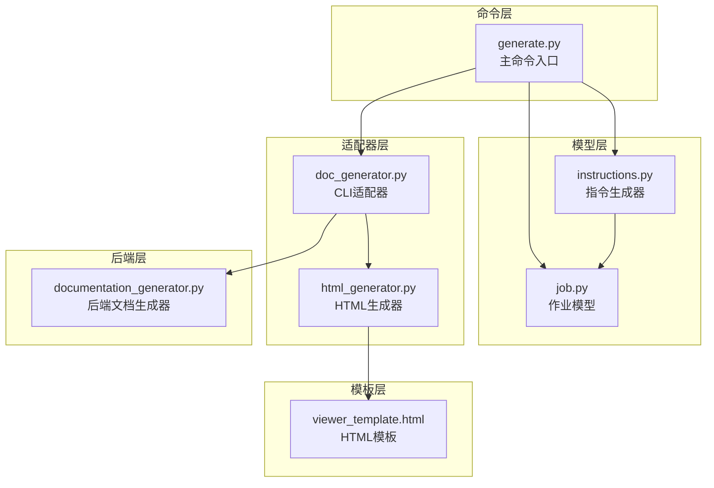
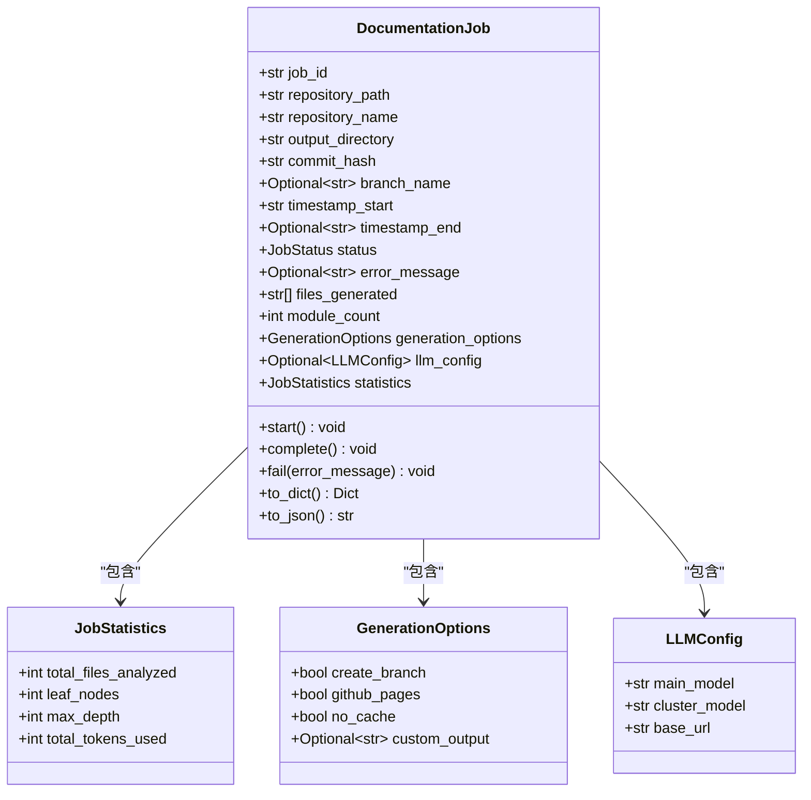
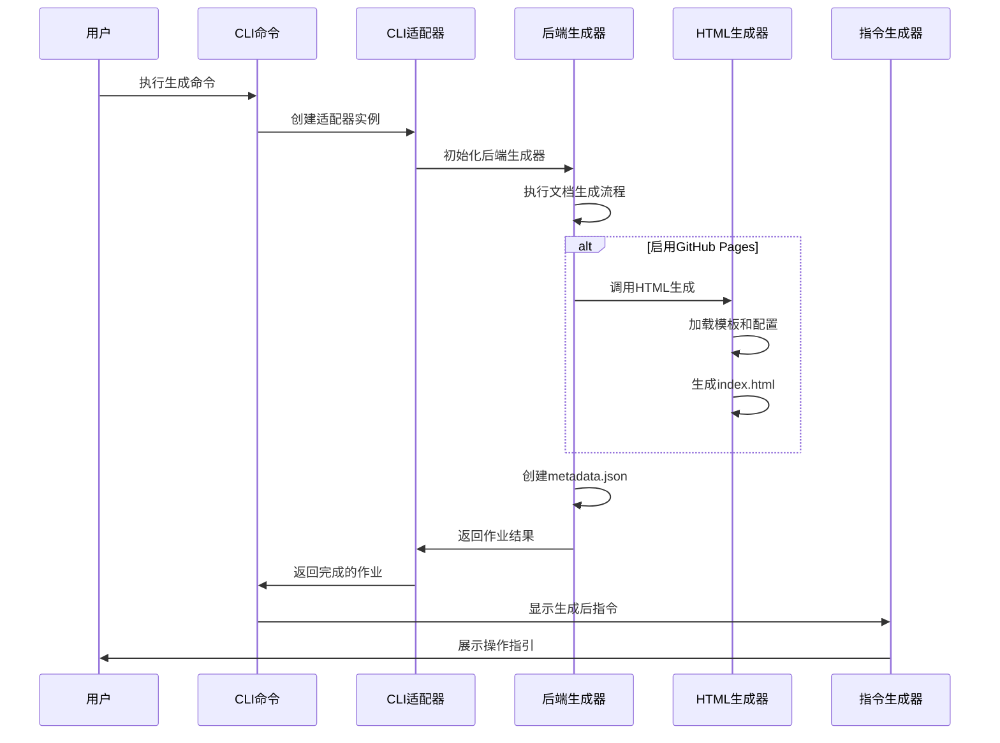
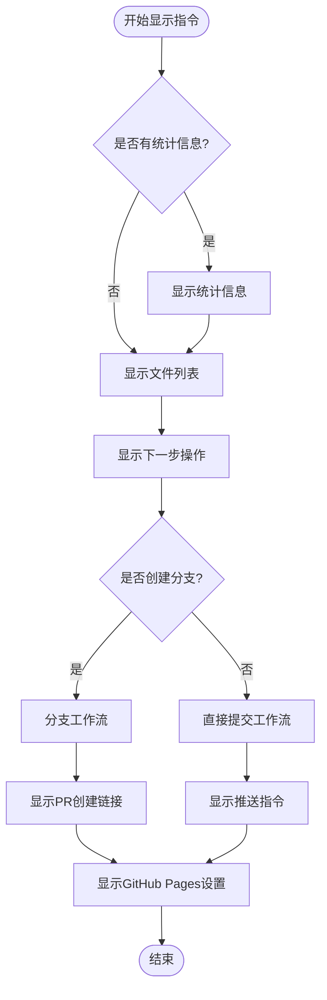
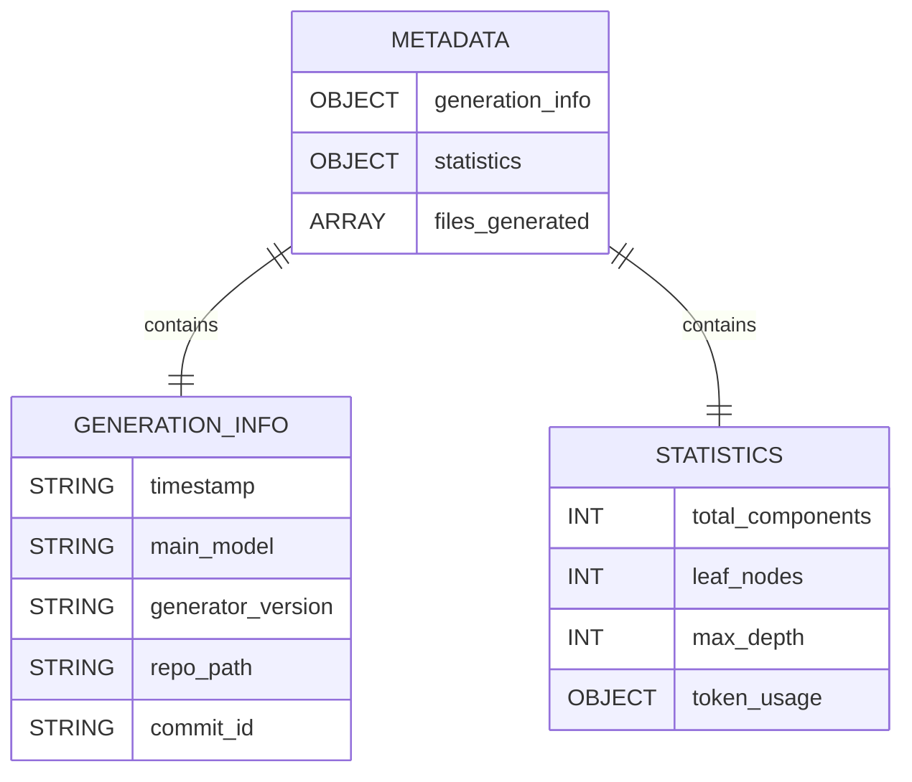
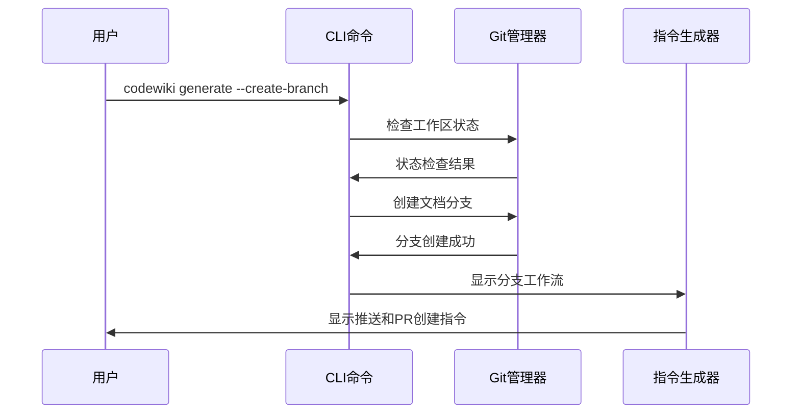
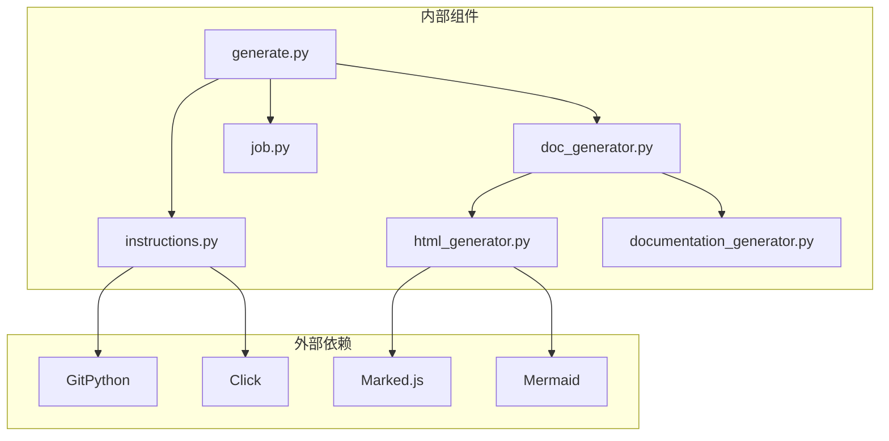

# 输出管理与结果展示

<cite>
**本文档引用的文件**
- [instructions.py](file://codewiki/cli/utils/instructions.py)
- [job.py](file://codewiki/cli/models/job.py)
- [generate.py](file://codewiki/cli/commands/generate.py)
- [doc_generator.py](file://codewiki/cli/adapters/doc_generator.py)
- [html_generator.py](file://codewiki/cli/html_generator.py)
- [viewer_template.html](file://codewiki/templates/github_pages/viewer_template.html)
- [documentation_generator.py](file://codewiki/src/be/documentation_generator.py)
</cite>

## 目录
1. [简介](#简介)
2. [项目结构](#项目结构)
3. [核心组件](#核心组件)
4. [架构概览](#架构概览)
5. [详细组件分析](#详细组件分析)
6. [依赖关系分析](#依赖关系分析)
7. [性能考虑](#性能考虑)
8. [故障排除指南](#故障排除指南)
9. [结论](#结论)

## 简介

本文档详细介绍了CodeWiki项目中生成后输出管理和用户指引系统。该系统负责在文档生成完成后收集统计信息、生成用户友好的操作指引，并展示生成的输出内容。系统支持多种输出格式，包括Markdown文档、metadata.json元数据文件，以及可选的GitHub Pages HTML查看器。

## 项目结构

CodeWiki项目的输出管理与结果展示功能分布在多个层次中：

**图表来源**
- [generate.py](file://codewiki/cli/commands/generate.py#L1-L276)
- [doc_generator.py](file://codewiki/cli/adapters/doc_generator.py#L1-L298)
- [instructions.py](file://codewiki/cli/utils/instructions.py#L1-L180)

**章节来源**
- [generate.py](file://codewiki/cli/commands/generate.py#L1-L276)
- [doc_generator.py](file://codewiki/cli/adapters/doc_generator.py#L1-L298)
- [instructions.py](file://codewiki/cli/utils/instructions.py#L1-L180)

## 核心组件

### 作业管理系统

作业系统是整个输出管理的核心，负责跟踪生成过程中的各种状态和统计数据：

**图表来源**
- [job.py](file://codewiki/cli/models/job.py#L47-L156)

### 统计信息收集机制

系统通过多个层面收集统计信息：

1. **文件分析统计**：记录分析的文件数量
2. **模块统计**：记录生成的模块数量
3. **Token使用统计**：记录LLM调用的Token消耗
4. **时间统计**：记录生成总耗时

**章节来源**
- [job.py](file://codewiki/cli/models/job.py#L30-L83)
- [doc_generator.py](file://codewiki/cli/adapters/doc_generator.py#L166-L256)

## 架构概览

输出管理系统的整体架构如下：

**图表来源**
- [generate.py](file://codewiki/cli/commands/generate.py#L194-L256)
- [doc_generator.py](file://codewiki/cli/adapters/doc_generator.py#L114-L157)

## 详细组件分析

### 生成后指令显示系统

指令显示系统是用户交互的核心组件，负责将统计信息和操作指引以友好的方式呈现给用户：

**图表来源**
- [instructions.py](file://codewiki/cli/utils/instructions.py#L48-L151)

#### 统计信息格式化

系统支持多种统计信息的格式化显示：

| 统计类型 | 字段名 | 格式化方式 | 示例输出 |
|---------|--------|-----------|----------|
| 模块数量 | module_count | 直接显示 | "Total modules: 42" |
| 分析文件数 | total_files_analyzed | 直接显示 | "Files analyzed: 156" |
| 生成时间 | generation_time | 分钟:秒格式 | "Generation time: 3 minutes 45 seconds" |
| Token消耗 | total_tokens_used | 千位分隔符 | "Tokens used: ~1,234,567" |

**章节来源**
- [instructions.py](file://codewiki/cli/utils/instructions.py#L87-L101)

### 输出内容管理

系统生成的输出内容包括三个主要部分：

#### 1. Markdown文档列表

生成的Markdown文档自动收集到作业对象中：

**图表来源**
- [doc_generator.py](file://codewiki/cli/adapters/doc_generator.py#L248-L251)

#### 2. metadata.json元数据文件

元数据文件包含详细的生成信息和统计信息：

**图表来源**
- [documentation_generator.py](file://codewiki/src/be/documentation_generator.py#L50-L84)

#### 3. 可选的index.html查看器

当启用`--github-pages`选项时，系统会生成HTML查看器：

**章节来源**
- [html_generator.py](file://codewiki/cli/html_generator.py#L83-L171)

### Git分支管理

系统提供两种Git工作流程：

#### 分支创建工作流

当使用`--create-branch`选项时的工作流程：

**图表来源**
- [generate.py](file://codewiki/cli/commands/generate.py#L168-L193)

#### 直接提交工作流

没有创建分支时的标准工作流程：

**章节来源**
- [instructions.py](file://codewiki/cli/utils/instructions.py#L128-L143)

### GitHub Pages部署

系统提供完整的GitHub Pages部署指导：

#### 部署路径配置

| 配置项 | 默认值 | 说明 |
|-------|--------|------|
| 分支 | main | GitHub Pages源分支 |
| 文件夹 | /docs | 文档存储目录 |
| 域名 | YOUR_USERNAME.github.io | 用户名占位符 |

#### 自动URL计算

系统能够自动计算GitHub Pages的访问URL：

**章节来源**
- [instructions.py](file://codewiki/cli/utils/instructions.py#L10-L30)

## 依赖关系分析

输出管理系统各组件之间的依赖关系如下：

**图表来源**
- [generate.py](file://codewiki/cli/commands/generate.py#L1-L31)
- [doc_generator.py](file://codewiki/cli/adapters/doc_generator.py#L1-L24)
- [html_generator.py](file://codewiki/cli/html_generator.py#L1-L11)

**章节来源**
- [generate.py](file://codewiki/cli/commands/generate.py#L1-L31)
- [doc_generator.py](file://codewiki/cli/adapters/doc_generator.py#L1-L24)

## 性能考虑

### 统计信息收集优化

系统采用增量更新的方式收集统计信息：

1. **Token使用统计**：在每个模块处理完成后立即更新
2. **文件收集**：在文档生成完成后一次性扫描目录
3. **时间统计**：使用高精度时间戳记录开始和结束时间

### 内存使用优化

- 使用生成器模式处理大型文件
- 分阶段清理临时文件
- 避免重复加载相同的数据

## 故障排除指南

### 常见问题及解决方案

#### 1. 无法生成HTML查看器

**症状**：启用`--github-pages`但未生成index.html

**可能原因**：
- 模板文件缺失
- 权限不足
- 依赖包未安装

**解决方法**：
- 检查模板文件是否存在
- 确认输出目录权限
- 安装必要的前端依赖

#### 2. 统计信息不准确

**症状**：显示的统计信息与预期不符

**可能原因**：
- Token使用统计被重置
- 文件分析过程中断
- 作业状态异常

**解决方法**：
- 检查作业对象的状态
- 验证统计字段的更新逻辑
- 查看后端日志

#### 3. Git分支创建失败

**症状**：使用`--create-branch`选项时报错

**可能原因**：
- 工作区有未提交的更改
- 不是Git仓库
- 权限不足

**解决方法**：
- 提交或暂存所有更改
- 初始化Git仓库
- 检查Git权限

**章节来源**
- [generate.py](file://codewiki/cli/commands/generate.py#L143-L193)
- [html_generator.py](file://codewiki/cli/html_generator.py#L120-L171)

## 结论

CodeWiki项目的输出管理与结果展示系统设计精良，具有以下特点：

1. **完整性**：支持多种输出格式和统计信息收集
2. **用户友好**：提供清晰的操作指引和格式化显示
3. **灵活性**：支持不同的Git工作流程和部署选项
4. **可靠性**：完善的错误处理和故障排除机制

该系统为用户提供了从文档生成到部署的完整体验，既满足了技术需求，又保证了良好的用户体验。通过模块化的架构设计，系统易于维护和扩展，为未来的功能增强奠定了坚实的基础。