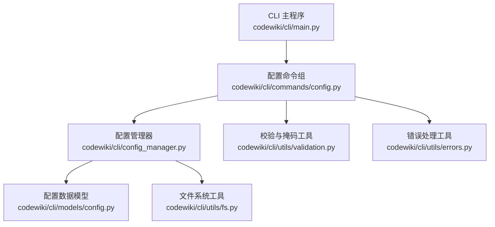
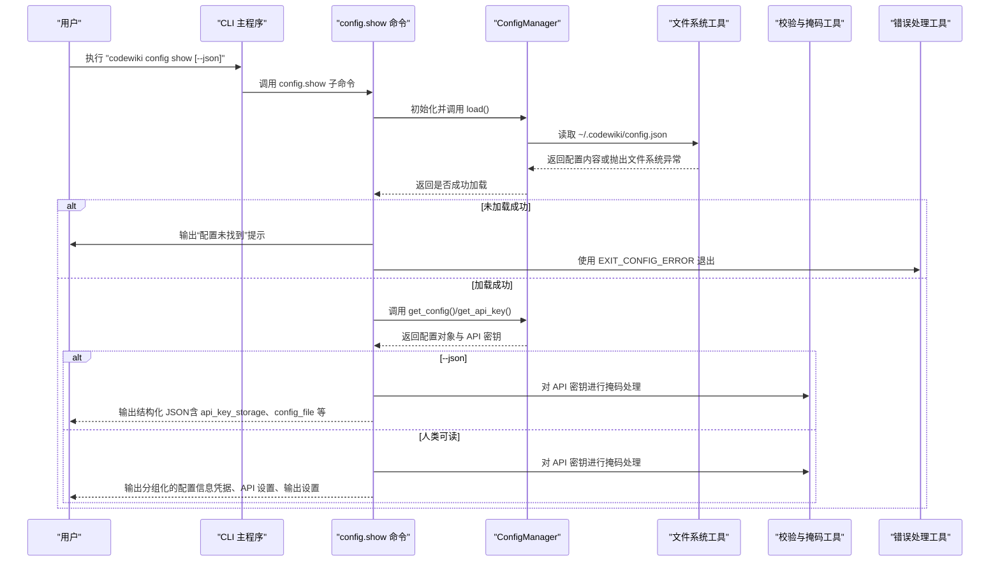
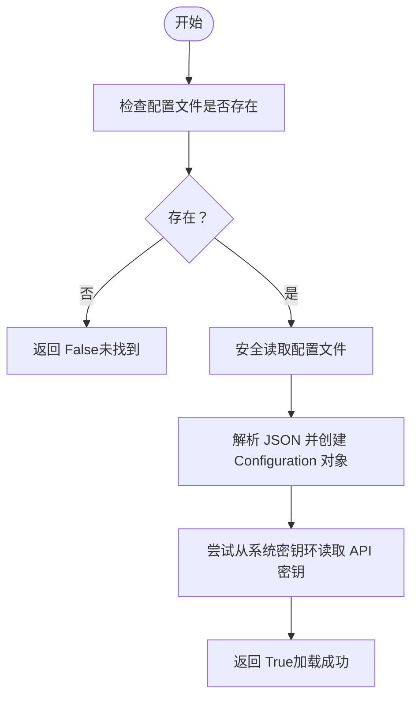
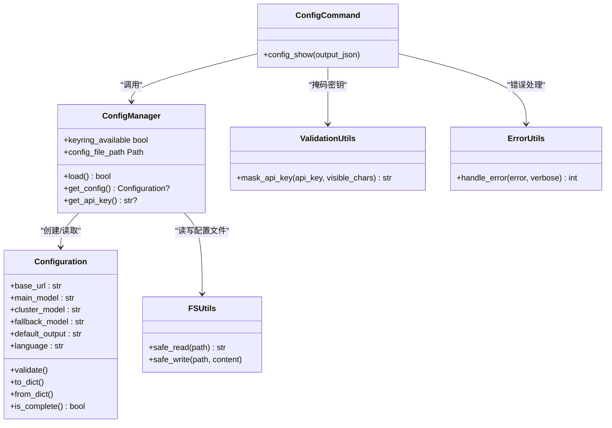

# 配置查看

<cite>
**本文引用的文件**
- [codewiki/cli/commands/config.py](file://codewiki/cli/commands/config.py)
- [codewiki/cli/config_manager.py](file://codewiki/cli/config_manager.py)
- [codewiki/cli/models/config.py](file://codewiki/cli/models/config.py)
- [codewiki/cli/utils/validation.py](file://codewiki/cli/utils/validation.py)
- [codewiki/cli/utils/errors.py](file://codewiki/cli/utils/errors.py)
- [codewiki/cli/utils/fs.py](file://codewiki/cli/utils/fs.py)
- [codewiki/cli/main.py](file://codewiki/cli/main.py)
</cite>

## 目录
1. [简介](#简介)
2. [项目结构](#项目结构)
3. [核心组件](#核心组件)
4. [架构总览](#架构总览)
5. [详细组件分析](#详细组件分析)
6. [依赖关系分析](#依赖关系分析)
7. [性能与安全考量](#性能与安全考量)
8. [故障排查指南](#故障排查指南)
9. [结论](#结论)
10. [附录：使用示例](#附录使用示例)

## 简介
本节面向“config show”命令的实现机制，系统性说明如何以人类可读格式展示配置信息，包括凭证、API 设置与输出配置；解释 API 密钥在输出中被掩码保护的实现方式（仅显示首尾若干字符）；说明“--json”选项如何输出结构化 JSON 数据，包含“api_key_storage”、“config_file”路径等元信息；结合“config_manager.py”中的“get_api_key()”和“get_config()”方法，解释配置加载流程；并提供配置未找到时的错误处理建议与实际使用示例，帮助用户快速验证当前环境配置状态。

## 项目结构
围绕“config show”的实现，涉及以下关键模块：
- 命令入口与子命令注册：在主 CLI 中注册 config 子命令组，并在其中定义 show 命令。
- 配置管理器：负责从文件与系统密钥环加载/保存配置，提供 API 密钥与配置对象访问接口。
- 配置数据模型：定义持久化配置的数据结构及校验逻辑。
- 工具模块：提供输入校验、错误处理、文件系统操作与 API 密钥掩码等能力。

图表来源
- [codewiki/cli/main.py](file://codewiki/cli/main.py#L33-L39)
- [codewiki/cli/commands/config.py](file://codewiki/cli/commands/config.py#L176-L262)
- [codewiki/cli/config_manager.py](file://codewiki/cli/config_manager.py#L26-L236)
- [codewiki/cli/models/config.py](file://codewiki/cli/models/config.py#L20-L113)
- [codewiki/cli/utils/validation.py](file://codewiki/cli/utils/validation.py#L13-L251)
- [codewiki/cli/utils/fs.py](file://codewiki/cli/utils/fs.py#L13-L114)
- [codewiki/cli/utils/errors.py](file://codewiki/cli/utils/errors.py#L18-L114)

章节来源
- [codewiki/cli/main.py](file://codewiki/cli/main.py#L33-L39)
- [codewiki/cli/commands/config.py](file://codewiki/cli/commands/config.py#L176-L262)

## 核心组件
- config.show 子命令：负责读取配置并以人类可读或 JSON 格式输出；当配置不存在时提示用户先执行“config set”进行初始化。
- ConfigManager：封装配置加载与保存逻辑，支持从系统密钥环读取 API 密钥、从 JSON 文件读取非敏感配置，并提供“get_api_key()”和“get_config()”访问接口。
- Configuration 数据模型：定义 base_url、main_model、cluster_model、fallback_model、default_output、language 等字段及其校验与转换方法。
- 掩码工具：对 API 密钥进行掩码处理，仅显示前若干字符与后若干字符，中间用省略号替代。
- 错误处理：统一的错误类型与退出码，便于在命令失败时向用户反馈并返回合适的退出码。

章节来源
- [codewiki/cli/commands/config.py](file://codewiki/cli/commands/config.py#L176-L262)
- [codewiki/cli/config_manager.py](file://codewiki/cli/config_manager.py#L51-L83)
- [codewiki/cli/models/config.py](file://codewiki/cli/models/config.py#L20-L84)
- [codewiki/cli/utils/validation.py](file://codewiki/cli/utils/validation.py#L231-L251)
- [codewiki/cli/utils/errors.py](file://codewiki/cli/utils/errors.py#L18-L84)

## 架构总览
下图展示了“config show”命令从 CLI 到配置管理器再到数据模型与工具模块的调用链路，以及关键的错误处理与输出分支。

图表来源
- [codewiki/cli/commands/config.py](file://codewiki/cli/commands/config.py#L176-L262)
- [codewiki/cli/config_manager.py](file://codewiki/cli/config_manager.py#L51-L83)
- [codewiki/cli/utils/fs.py](file://codewiki/cli/utils/fs.py#L89-L114)
- [codewiki/cli/utils/validation.py](file://codewiki/cli/utils/validation.py#L231-L251)
- [codewiki/cli/utils/errors.py](file://codewiki/cli/utils/errors.py#L64-L84)

## 详细组件分析

### config.show 命令实现
- 命令定义与参数
  - 子命令名称为“show”，支持“--json”标志，用于切换输出格式。
  - 命令帮助信息明确指出 API 密钥在输出中会被掩码保护（仅显示首尾若干字符）。
- 配置加载与存在性检查
  - 初始化 ConfigManager 并调用 load()；若返回 False，表示配置文件不存在或不可读，输出“配置未找到”提示，并引导用户先执行“config set”完成初始化。
  - 若加载成功，则分别通过 get_config() 获取 Configuration 对象，通过 get_api_key() 获取 API 密钥。
- 人类可读输出
  - 将配置分为“凭据”“API 设置”“输出设置”三部分，分别展示 API Key（已掩码）、Base URL、主模型、聚类模型、回退模型、语言、默认输出目录等。
  - 显示配置文件路径与密钥存储位置（系统密钥环或加密文件）。
- JSON 输出
  - 当启用“--json”时，输出结构化 JSON，包含：
    - api_key：对原始密钥进行掩码处理后的字符串，若未设置则为“Not set”。
    - api_key_storage：根据系统密钥环可用性输出“keychain”或“encrypted_file”。
    - base_url、main_model、cluster_model、fallback_model、language、default_output：来自 Configuration 对象。
    - config_file：配置文件的绝对路径字符串。
  - JSON 输出采用缩进格式，便于阅读与解析。

章节来源
- [codewiki/cli/commands/config.py](file://codewiki/cli/commands/config.py#L176-L262)

### ConfigManager 配置加载流程
- 配置文件位置
  - 默认位于用户主目录下的“.codewiki/config.json”，版本常量用于兼容性判断。
- 加载步骤
  - 检查配置文件是否存在；不存在则直接返回 False。
  - 安全读取文件内容，解析为字典并转换为 Configuration 对象。
  - 尝试从系统密钥环读取 API 密钥；若密钥环不可用则忽略，但不影响非敏感配置的加载。
  - 返回 True 表示加载成功。
- 访问接口
  - get_api_key()：优先从内存缓存读取，若为空则尝试从密钥环读取。
  - get_config()：返回 Configuration 对象或 None。
- 错误处理
  - 解析 JSON 或读取文件失败时抛出 ConfigurationError，由上层命令捕获并输出友好提示。

图表来源
- [codewiki/cli/config_manager.py](file://codewiki/cli/config_manager.py#L51-L83)
- [codewiki/cli/utils/fs.py](file://codewiki/cli/utils/fs.py#L89-L114)

章节来源
- [codewiki/cli/config_manager.py](file://codewiki/cli/config_manager.py#L51-L83)
- [codewiki/cli/utils/fs.py](file://codewiki/cli/utils/fs.py#L89-L114)

### API 密钥掩码保护机制
- 掩码策略
  - 保留 API 密钥的前若干字符与后若干字符，中间以省略号替代。
  - 若密钥长度小于等于两倍可见字符数，则仅显示前后少量字符并用省略号连接。
  - 未设置密钥时返回“Not set”占位符。
- 实现位置
  - 在 config.show 命令中，对从 ConfigManager 获取的 API 密钥调用掩码函数，确保在人类可读与 JSON 输出中均不暴露完整密钥。
- 安全性考虑
  - 即使在 JSON 输出中也仅显示掩码后的密钥，避免泄露完整凭据。
  - 同时通过“api_key_storage”字段告知密钥存储位置（系统密钥环或加密文件），提升透明度。

章节来源
- [codewiki/cli/utils/validation.py](file://codewiki/cli/utils/validation.py#L231-L251)
- [codewiki/cli/commands/config.py](file://codewiki/cli/commands/config.py#L213-L226)

### 配置数据模型与默认值
- 字段定义
  - base_url、main_model、cluster_model、fallback_model、default_output、language。
- 默认值
  - fallback_model 默认为“glm-4p5”，default_output 默认为“docs”，language 默认为“english”。
- 校验与转换
  - 提供 to_dict/from_dict 方法用于序列化与反序列化。
  - is_complete() 用于判断必要字段是否齐全。
  - to_backend_config() 将 CLI 配置转换为后端运行所需的配置对象。

章节来源
- [codewiki/cli/models/config.py](file://codewiki/cli/models/config.py#L20-L84)

### 错误处理与退出码
- 统一错误类型
  - ConfigurationError：配置相关错误（如配置文件缺失、格式错误、密钥环不可用等）。
  - 其他通用错误通过 handle_error() 进行分类与输出，并返回相应退出码。
- 退出码约定
  - 0：成功；2：配置错误（如配置未找到）；1：一般错误；3：仓库错误；4：API 错误；5：文件系统错误。
- 在 config.show 中的应用
  - 配置未找到时输出提示并以 EXIT_CONFIG_ERROR 退出，便于脚本化场景识别。

章节来源
- [codewiki/cli/utils/errors.py](file://codewiki/cli/utils/errors.py#L18-L84)
- [codewiki/cli/commands/config.py](file://codewiki/cli/commands/config.py#L202-L208)

## 依赖关系分析
- 命令到管理器
  - config.show 依赖 ConfigManager 的 load()/get_config()/get_api_key() 接口。
- 管理器到模型与工具
  - ConfigManager 依赖 Configuration 数据模型进行配置对象的创建与校验；依赖 fs 工具进行安全读写；依赖 keyring 库进行密钥环访问。
- 工具到命令
  - 掩码工具被 config.show 用于安全输出；错误处理工具被各命令捕获并统一处理。

图表来源
- [codewiki/cli/commands/config.py](file://codewiki/cli/commands/config.py#L176-L262)
- [codewiki/cli/config_manager.py](file://codewiki/cli/config_manager.py#L51-L83)
- [codewiki/cli/models/config.py](file://codewiki/cli/models/config.py#L20-L84)
- [codewiki/cli/utils/validation.py](file://codewiki/cli/utils/validation.py#L231-L251)
- [codewiki/cli/utils/fs.py](file://codewiki/cli/utils/fs.py#L60-L114)
- [codewiki/cli/utils/errors.py](file://codewiki/cli/utils/errors.py#L64-L84)

## 性能与安全考量
- 性能
  - 配置读取为轻量级 JSON 解析与一次密钥环查询，开销极低。
  - 掩码处理为字符串截取与拼接，复杂度 O(n)，n 为密钥长度，通常可忽略。
- 安全
  - API 密钥始终通过系统密钥环存储，config.show 输出前进行掩码处理，避免在终端或日志中泄露完整密钥。
  - JSON 输出包含“api_key_storage”与“config_file”等元信息，帮助用户了解密钥存放位置与配置文件路径，便于审计与排障。

[本节为通用指导，无需列出具体文件来源]

## 故障排查指南
- 配置未找到
  - 现象：命令输出“配置未找到”，并提示先执行“config set”。
  - 处理：运行“codewiki config set”完成初始化，或检查用户主目录下的“.codewiki/config.json”是否存在且可读。
- 密钥环不可用
  - 现象：系统密钥环不可用时，API 密钥将以“encrypted_file”形式存储并在输出中标注。
  - 处理：确保系统密钥环服务正常运行；若无法使用密钥环，注意仅在受信任环境中使用加密文件存储。
- 配置文件损坏或格式错误
  - 现象：加载配置时抛出配置错误。
  - 处理：检查“.codewiki/config.json”格式是否为合法 JSON；必要时删除后重新执行“config set”。

章节来源
- [codewiki/cli/commands/config.py](file://codewiki/cli/commands/config.py#L202-L208)
- [codewiki/cli/config_manager.py](file://codewiki/cli/config_manager.py#L74-L82)
- [codewiki/cli/utils/errors.py](file://codewiki/cli/utils/errors.py#L64-L84)

## 结论
“config show”命令通过 ConfigManager 安全地加载配置与密钥，结合掩码工具与统一错误处理，实现了既安全又易用的配置查看体验。人类可读输出清晰展示凭据、API 设置与输出配置，而“--json”模式则提供结构化数据，便于自动化集成。配合完善的错误处理与提示，用户可以快速定位配置问题并完成修复。

[本节为总结性内容，无需列出具体文件来源]

## 附录：使用示例
- 查看当前配置（人类可读）
  - 示例命令：codewiki config show
  - 输出要点：凭据区显示掩码后的 API Key 及其存储位置；API 设置区显示 Base URL、主/聚类/回退模型、语言；输出设置区显示默认输出目录；最后显示配置文件路径。
- 以 JSON 格式导出配置
  - 示例命令：codewiki config show --json
  - 输出要点：包含 api_key（掩码）、api_key_storage、base_url、main_model、cluster_model、fallback_model、language、default_output、config_file 等键值。
- 配置未找到时的提示
  - 示例命令：codewiki config show
  - 输出要点：提示“配置未找到”，并引导执行“codewiki config set”完成初始化。

章节来源
- [codewiki/cli/commands/config.py](file://codewiki/cli/commands/config.py#L184-L198)
- [codewiki/cli/commands/config.py](file://codewiki/cli/commands/config.py#L202-L208)
- [codewiki/cli/commands/config.py](file://codewiki/cli/commands/config.py#L213-L226)