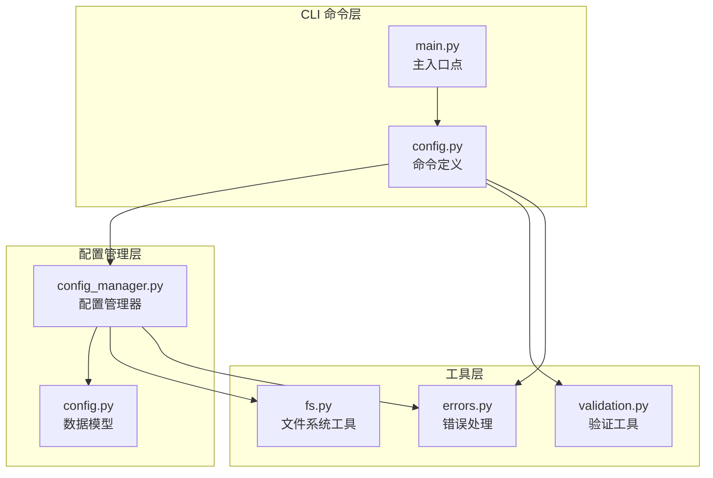
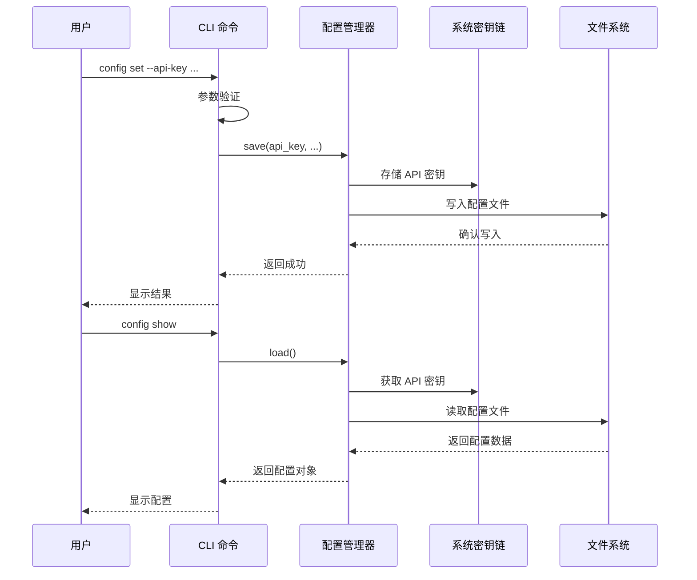
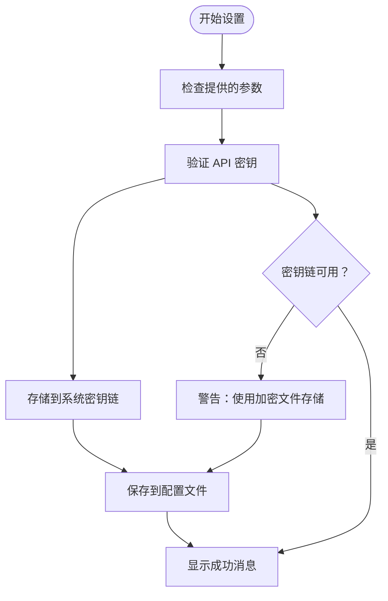
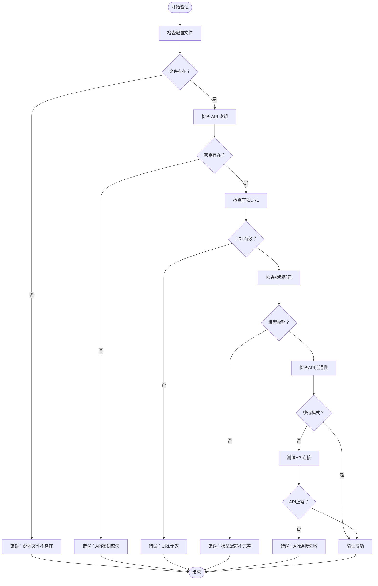
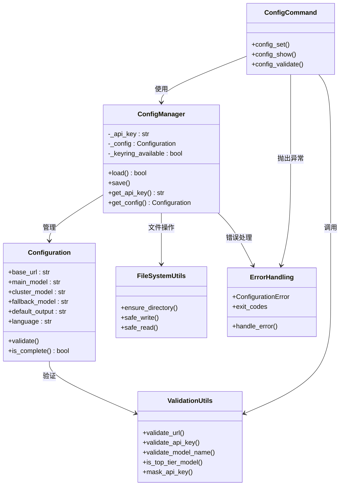

# 配置管理

<cite>
**本文档引用的文件**
- [config.py](file://codewiki/cli/commands/config.py)
- [config_manager.py](file://codewiki/cli/config_manager.py)
- [config.py](file://codewiki/cli/models/config.py)
- [validation.py](file://codewiki/cli/utils/validation.py)
- [fs.py](file://codewiki/cli/utils/fs.py)
- [errors.py](file://codewiki/cli/utils/errors.py)
- [main.py](file://codewiki/cli/main.py)
- [README.md](file://README.md)
</cite>

## 目录
1. [简介](#简介)
2. [项目结构](#项目结构)
3. [核心组件](#核心组件)
4. [架构概览](#架构概览)
5. [详细组件分析](#详细组件分析)
6. [依赖关系分析](#依赖关系分析)
7. [性能考虑](#性能考虑)
8. [故障排除指南](#故障排除指南)
9. [结论](#结论)

## 简介

CodeWiki 的配置管理系统提供了完整的命令行界面，用于管理 LLM API 凭据和设置。该系统包含三个主要子命令：`config set`（设置配置）、`config show`（显示配置）和 `config validate`（验证配置）。系统采用安全的凭据存储机制，支持 macOS Keychain、Windows Credential Manager 和 Linux Secret Service。

## 项目结构

配置管理功能分布在以下关键文件中：

**图表来源**
- [config.py](file://codewiki/cli/commands/config.py#L1-L414)
- [config_manager.py](file://codewiki/cli/config_manager.py#L1-L237)
- [config.py](file://codewiki/cli/models/config.py#L1-L113)

**章节来源**
- [config.py](file://codewiki/cli/commands/config.py#L1-L414)
- [config_manager.py](file://codewiki/cli/config_manager.py#L1-L237)
- [main.py](file://codewiki/cli/main.py#L1-L57)

## 核心组件

### 配置命令组

配置命令组是所有配置相关操作的入口点，基于 Click 框架构建，提供统一的命令结构和错误处理机制。

### 配置管理器

ConfigManager 类负责实际的配置存储和检索逻辑，实现了安全的凭据存储和配置文件管理。

### 数据模型

Configuration 数据类定义了配置的结构和验证规则，确保配置的一致性和完整性。

**章节来源**
- [config.py](file://codewiki/cli/commands/config.py#L26-L29)
- [config_manager.py](file://codewiki/cli/config_manager.py#L26-L34)
- [config.py](file://codewiki/cli/models/config.py#L20-L39)

## 架构概览

**图表来源**
- [config.py](file://codewiki/cli/commands/config.py#L63-L174)
- [config_manager.py](file://codewiki/cli/config_manager.py#L51-L83)

## 详细组件分析

### config set 命令详解

config set 命令提供了灵活的配置设置功能，支持多个参数的组合使用。

#### 参数说明

| 参数 | 类型 | 描述 | 默认值 | 验证规则 |
|------|------|------|--------|----------|
| `--api-key` | 字符串 | LLM API 密钥 | 无 | 最少10字符，非空 |
| `--base-url` | 字符串 | LLM API 基础URL | 无 | 有效URL格式，HTTPS要求 |
| `--main-model` | 字符串 | 主要文档生成模型 | 无 | 非空字符串 |
| `--cluster-model` | 字符串 | 模块聚类模型 | 无 | 非空字符串，推荐顶级模型 |
| `--fallback-model` | 字符串 | 回退模型 | `glm-4p5` | 非空字符串 |
| `--language` | 选择值 | 文档语言 | `english` | `english` 或 `chinese` |

#### 安全存储机制

API 密钥通过系统密钥链安全存储：

**图表来源**
- [config.py](file://codewiki/cli/commands/config.py#L96-L128)
- [config_manager.py](file://codewiki/cli/config_manager.py#L143-L154)

#### 验证规则

每个参数都有严格的验证规则：

- **API 密钥验证**：长度至少10个字符，不能为空
- **URL 验证**：必须包含协议和主机名，HTTPS为默认要求
- **模型名称验证**：非空字符串，支持顶级模型检测
- **语言验证**：仅允许 `english` 或 `chinese`

**章节来源**
- [config.py](file://codewiki/cli/commands/config.py#L32-L89)
- [validation.py](file://codewiki/cli/utils/validation.py#L55-L79)
- [validation.py](file://codewiki/cli/utils/validation.py#L13-L52)

### config show 命令详解

config show 命令提供两种输出格式：人类可读格式和 JSON 格式。

#### 输出格式对比

| 格式 | 特点 | 使用场景 |
|------|------|----------|
| 人类可读格式 | 结构化显示，包含标题和分组 | 日常查看和调试 |
| JSON 格式 | 机器可读，适合自动化脚本 | CI/CD集成和程序处理 |

#### 配置文件位置

配置文件存储在用户主目录下的 `.codewiki/config.json` 文件中，具有以下特点：
- 路径：`~/.codewiki/config.json`
- 权限：0o700（仅用户可读写）
- 版本控制：支持版本迁移
- 加密存储：敏感信息（API密钥）存储在系统密钥链中

**章节来源**
- [config.py](file://codewiki/cli/commands/config.py#L176-L262)
- [config_manager.py](file://codewiki/cli/config_manager.py#L20-L23)

### config validate 命令详解

config validate 命令执行五步验证流程，确保配置的完整性和可用性。

#### 验证流程

**图表来源**
- [config.py](file://codewiki/cli/commands/config.py#L265-L412)

#### 验证步骤详解

1. **配置文件检查**：确认配置文件存在且格式正确
2. **API密钥检查**：验证密钥存在且可从系统密钥链检索
3. **基础URL验证**：检查URL格式和HTTPS要求
4. **模型配置检查**：确保所有必需的模型都已配置
5. **API连通性测试**：可选的API连接测试（默认启用）

**章节来源**
- [config.py](file://codewiki/cli/commands/config.py#L308-L406)
- [validation.py](file://codewiki/cli/utils/validation.py#L209-L229)

## 依赖关系分析

**图表来源**
- [config.py](file://codewiki/cli/commands/config.py#L26-L414)
- [config_manager.py](file://codewiki/cli/config_manager.py#L26-L237)
- [config.py](file://codewiki/cli/models/config.py#L20-L113)

**章节来源**
- [config.py](file://codewiki/cli/commands/config.py#L10-L23)
- [config_manager.py](file://codewiki/cli/config_manager.py#L11-L13)

## 性能考虑

### 存储性能优化

1. **原子写入**：使用临时文件 + 重命名的方式确保配置文件的原子性更新
2. **缓存机制**：ConfigManager 缓存已加载的配置和API密钥，避免重复读取
3. **异步密钥链访问**：系统密钥链访问可能较慢，通过缓存减少访问频率

### 验证性能

1. **延迟验证**：仅在需要时进行API连通性测试
2. **快速失败**：早期发现配置问题，避免不必要的后续操作
3. **最小化网络请求**：API连通性测试只进行必要的模型列表查询

## 故障排除指南

### 常见问题及解决方案

#### 密钥存储失败

**问题**：系统密钥链不可用或存储失败

**原因分析**：
- 系统密钥链服务未启动
- 权限不足
- 密钥链配置错误

**解决方案**：
1. 检查系统密钥链服务状态
2. 确认用户权限
3. 查看详细的错误信息
4. 系统会自动降级到加密文件存储

#### API 连接错误

**问题**：config validate 报告API连接失败

**排查步骤**：
1. 验证基础URL格式和可达性
2. 检查网络连接
3. 确认API密钥有效性
4. 测试直接的API调用

#### 配置文件损坏

**问题**：配置文件格式错误或损坏

**解决方法**：
1. 备份当前配置文件
2. 删除损坏的配置文件
3. 重新运行 `config set` 重新配置
4. 使用 `config show --json` 验证JSON格式

#### 权限问题

**问题**：无法读取或写入配置文件

**解决方案**：
1. 检查 `~/.codewiki` 目录权限
2. 确保用户对配置文件有读写权限
3. 检查磁盘空间是否充足

**章节来源**
- [errors.py](file://codewiki/cli/utils/errors.py#L64-L84)
- [config_manager.py](file://codewiki/cli/config_manager.py#L148-L153)
- [fs.py](file://codewiki/cli/utils/fs.py#L13-L37)

## 结论

CodeWiki 的配置管理系统提供了完整、安全且用户友好的配置管理解决方案。通过 Click 框架的命令结构、系统密钥链的安全存储机制以及严格的验证规则，确保了配置的可靠性、安全性和易用性。

主要优势包括：
- **安全性**：API密钥通过系统密钥链安全存储
- **灵活性**：支持多种输出格式和验证级别
- **可靠性**：完整的错误处理和故障恢复机制
- **可维护性**：清晰的代码结构和详细的文档

该系统为 CodeWiki 的用户提供了一个强大而可靠的配置管理工具，支持从简单的单次配置到复杂的多模型部署场景。