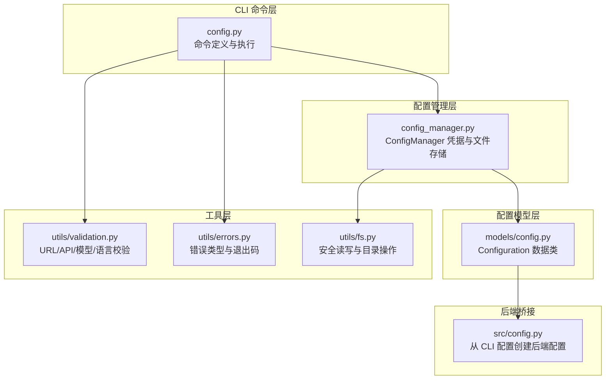
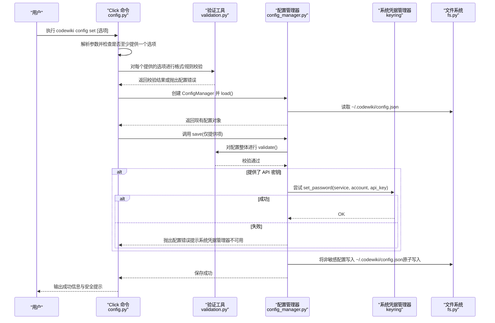
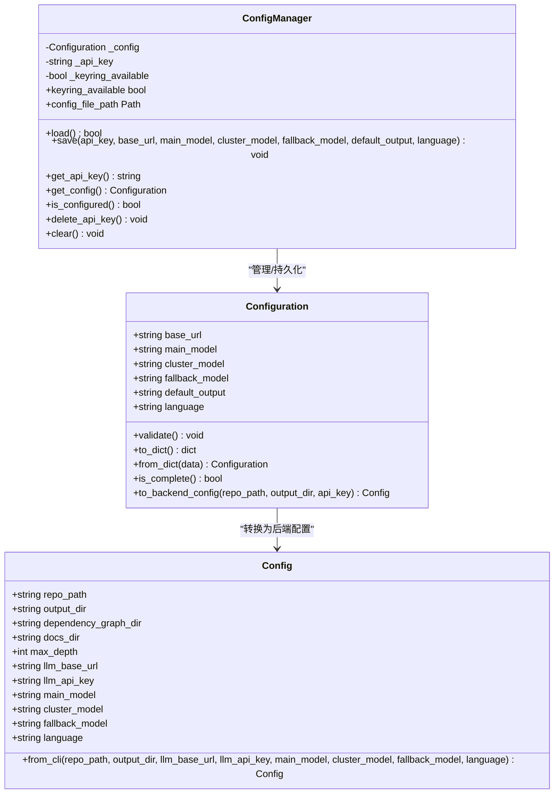

# 配置设置

<cite>
**本文引用的文件**
- [codewiki/cli/commands/config.py](file://codewiki/cli/commands/config.py)
- [codewiki/cli/models/config.py](file://codewiki/cli/models/config.py)
- [codewiki/cli/config_manager.py](file://codewiki/cli/config_manager.py)
- [codewiki/cli/utils/validation.py](file://codewiki/cli/utils/validation.py)
- [codewiki/cli/utils/errors.py](file://codewiki/cli/utils/errors.py)
- [codewiki/cli/utils/fs.py](file://codewiki/cli/utils/fs.py)
- [codewiki/src/config.py](file://codewiki/src/config.py)
- [requirements.txt](file://requirements.txt)
</cite>

## 目录
1. [简介](#简介)
2. [项目结构](#项目结构)
3. [核心组件](#核心组件)
4. [架构总览](#架构总览)
5. [详细组件分析](#详细组件分析)
6. [依赖分析](#依赖分析)
7. [性能考虑](#性能考虑)
8. [故障排除指南](#故障排除指南)
9. [结论](#结论)

## 简介
本章节面向“配置设置”命令，系统性阐述 `config set` 的功能与实现细节，重点覆盖以下方面：
- 参数用途与验证规则：`--api-key`、`--base-url`、`--main-model`、`--cluster-model`、`--fallback-model`、`--language`
- 安全存储机制：系统凭据管理器（macOS Keychain、Windows Credential Manager、Linux Secret Service）优先存储，不可用时回退到加密文件存储
- Click 命令实现：参数定义、输入校验流程、安全提示与错误处理
- 常见问题排查：密钥存储失败、模型名称格式错误、基础 URL 无效等

## 项目结构
围绕配置设置命令的相关文件组织如下：
- 命令入口与实现：`codewiki/cli/commands/config.py`
- 配置数据模型：`codewiki/cli/models/config.py`
- 配置管理器与凭据存储：`codewiki/cli/config_manager.py`
- 输入验证与安全工具：`codewiki/cli/utils/validation.py`、`codewiki/cli/utils/errors.py`、`codewiki/cli/utils/fs.py`
- 后端配置桥接：`codewiki/src/config.py`
- 依赖声明：`requirements.txt`

图表来源
- [codewiki/cli/commands/config.py](file://codewiki/cli/commands/config.py#L32-L174)
- [codewiki/cli/models/config.py](file://codewiki/cli/models/config.py#L20-L113)
- [codewiki/cli/config_manager.py](file://codewiki/cli/config_manager.py#L26-L237)
- [codewiki/cli/utils/validation.py](file://codewiki/cli/utils/validation.py#L13-L251)
- [codewiki/cli/utils/errors.py](file://codewiki/cli/utils/errors.py#L18-L114)
- [codewiki/cli/utils/fs.py](file://codewiki/cli/utils/fs.py#L13-L191)
- [codewiki/src/config.py](file://codewiki/src/config.py#L44-L123)

章节来源
- [codewiki/cli/commands/config.py](file://codewiki/cli/commands/config.py#L1-L414)
- [codewiki/cli/models/config.py](file://codewiki/cli/models/config.py#L1-L113)
- [codewiki/cli/config_manager.py](file://codewiki/cli/config_manager.py#L1-L237)
- [codewiki/cli/utils/validation.py](file://codewiki/cli/utils/validation.py#L1-L251)
- [codewiki/cli/utils/errors.py](file://codewiki/cli/utils/errors.py#L1-L114)
- [codewiki/cli/utils/fs.py](file://codewiki/cli/utils/fs.py#L1-L191)
- [codewiki/src/config.py](file://codewiki/src/config.py#L1-L123)

## 核心组件
- Click 命令组与子命令：`config_group`、`config set`、`config show`、`config validate`
- 配置数据模型：`Configuration`（包含基础 URL、主模型、聚类模型、回退模型、默认输出目录、语言）
- 配置管理器：`ConfigManager`（负责加载/保存配置、API 密钥安全存储、键链可用性检测）
- 输入验证工具：URL 格式、API 密钥长度、模型名称、顶级模型判断、API 密钥掩码显示
- 错误处理：统一的错误类型与退出码，便于用户定位问题
- 文件系统工具：安全写入、原子替换、目录权限控制

章节来源
- [codewiki/cli/commands/config.py](file://codewiki/cli/commands/config.py#L26-L174)
- [codewiki/cli/models/config.py](file://codewiki/cli/models/config.py#L20-L113)
- [codewiki/cli/config_manager.py](file://codewiki/cli/config_manager.py#L26-L237)
- [codewiki/cli/utils/validation.py](file://codewiki/cli/utils/validation.py#L13-L251)
- [codewiki/cli/utils/errors.py](file://codewiki/cli/utils/errors.py#L18-L114)
- [codewiki/cli/utils/fs.py](file://codewiki/cli/utils/fs.py#L13-L191)

## 架构总览
下图展示了 `config set` 命令从参数解析到安全存储的关键流程，以及与系统凭据管理器和文件系统的交互。

图表来源
- [codewiki/cli/commands/config.py](file://codewiki/cli/commands/config.py#L90-L174)
- [codewiki/cli/utils/validation.py](file://codewiki/cli/utils/validation.py#L13-L98)
- [codewiki/cli/config_manager.py](file://codewiki/cli/config_manager.py#L51-L165)
- [codewiki/cli/utils/fs.py](file://codewiki/cli/utils/fs.py#L60-L87)

## 详细组件分析

### Click 命令：config set
- 参数定义与帮助信息
  - `--api-key`：LLM API 密钥，存储于系统凭据管理器
  - `--base-url`：LLM API 基础 URL（例如 https://api.anthropic.com）
  - `--main-model`：文档生成主模型
  - `--cluster-model`：模块聚类模型（建议使用顶级模型）
  - `--fallback-model`：文档生成回退模型
  - `--language`：生成文档的语言（支持值：english、chinese）
- 输入验证流程
  - 至少提供一个选项；否则提示帮助并退出
  - 分别对 API 密钥、基础 URL、模型名称进行格式与长度校验
  - 模型名称为空或过短将触发配置错误
  - 基础 URL 缺失或格式不合法将触发配置错误
  - 语言参数限定为预设集合
- 安全提示与回退策略
  - 若系统凭据管理器可用，API 密钥存入系统钥匙串
  - 若不可用，提示“系统钥匙串不可用”，API 密钥将以加密文件形式存储
- 成功输出
  - 逐项打印“已更新”的确认信息
  - 对聚类模型给出非顶级模型的警告与推荐

章节来源
- [codewiki/cli/commands/config.py](file://codewiki/cli/commands/config.py#L32-L174)
- [codewiki/cli/utils/validation.py](file://codewiki/cli/utils/validation.py#L13-L98)
- [codewiki/cli/utils/errors.py](file://codewiki/cli/utils/errors.py#L18-L62)

### 配置数据模型：Configuration
- 字段
  - `base_url`、`main_model`、`cluster_model`、`fallback_model`（默认值）、`default_output`（默认值）、`language`（默认值）
- 校验
  - 整体校验：URL、主模型、聚类模型、回退模型均需通过验证
- 转换
  - 提供从 CLI 配置到后端配置的转换方法，用于文档生成阶段

章节来源
- [codewiki/cli/models/config.py](file://codewiki/cli/models/config.py#L20-L113)
- [codewiki/src/config.py](file://codewiki/src/config.py#L44-L123)

### 配置管理器：ConfigManager
- 存储位置
  - API 密钥：系统凭据管理器（macOS Keychain、Windows Credential Manager、Linux Secret Service）
  - 其他配置：`~/.codewiki/config.json`
- 关键能力
  - 加载：读取 JSON 配置并尝试从系统钥匙串获取 API 密钥
  - 保存：更新字段、整体校验、写入 JSON（原子写入），API 密钥写入系统钥匙串
  - 可用性检测：通过一次读写测试判断系统钥匙串是否可用
  - 清理：删除钥匙串中的 API 密钥并移除配置文件
- 错误处理
  - 键盘链错误时抛出配置错误并提示系统钥匙串配置问题
  - 文件系统错误时抛出配置错误并提示权限或磁盘空间问题

章节来源
- [codewiki/cli/config_manager.py](file://codewiki/cli/config_manager.py#L26-L237)
- [codewiki/cli/utils/fs.py](file://codewiki/cli/utils/fs.py#L13-L87)

### 输入验证与安全工具
- URL 校验
  - 必须包含协议与主机名
  - 默认要求 HTTPS，允许本地回环地址（localhost、127.0.0.1、[::1]）
- API 密钥校验
  - 不可为空或空白
  - 最小长度限制（默认阈值）
- 模型名称校验
  - 不可为空或空白
- 顶级模型判断
  - 判断是否包含顶级模型关键词（如 claude-opus、claude-sonnet、gpt-4、gpt-5、gemini-2.5）
- API 密钥掩码
  - 显示时仅保留前后若干字符，避免泄露

章节来源
- [codewiki/cli/utils/validation.py](file://codewiki/cli/utils/validation.py#L13-L251)

### 错误处理与退出码
- 统一错误基类与派生错误类型
- 退出码约定：成功、通用错误、配置错误、仓库错误、API 错误、文件系统错误
- 通用错误处理器：根据错误类型输出相应提示并返回对应退出码

章节来源
- [codewiki/cli/utils/errors.py](file://codewiki/cli/utils/errors.py#L18-L114)

### 文件系统工具
- 目录确保：创建用户目录并设置权限
- 安全写入：临时文件 + 原子重命名，避免部分写入
- 安全读取：统一异常包装，便于上层捕获

章节来源
- [codewiki/cli/utils/fs.py](file://codewiki/cli/utils/fs.py#L13-L191)

### 类关系图（代码级）

图表来源
- [codewiki/cli/models/config.py](file://codewiki/cli/models/config.py#L20-L113)
- [codewiki/cli/config_manager.py](file://codewiki/cli/config_manager.py#L26-L237)
- [codewiki/src/config.py](file://codewiki/src/config.py#L44-L123)

## 依赖分析
- 系统凭据管理器依赖
  - 使用 `keyring` 库进行跨平台钥匙串访问
  - 版本要求：`keyring>=24.0.0`
- Click 命令框架
  - 使用 `click` 进行命令定义与参数解析
- OpenAI 客户端（仅在验证阶段）
  - 在 `config validate` 中用于连通性测试

章节来源
- [requirements.txt](file://requirements.txt#L49-L20)
- [codewiki/cli/commands/config.py](file://codewiki/cli/commands/config.py#L395-L398)

## 性能考虑
- 验证开销
  - URL、模型名称与配置整体校验均为常数时间复杂度，对用户输入响应迅速
- 文件 I/O
  - 配置文件采用原子写入，避免部分写入导致的数据损坏风险
- 键盘链访问
  - 仅在保存或读取 API 密钥时进行，通常为一次性操作，对整体性能影响较小

## 故障排除指南
- 密钥存储失败
  - 现象：保存配置时报错，提示系统钥匙串不可用
  - 排查步骤：
    - 确认系统钥匙串服务正常运行（macOS Keychain、Windows Credential Manager、Linux Secret Service）
    - 检查 `keyring` 是否正确安装且版本满足要求
    - 尝试手动设置一个测试条目，验证凭据管理器可用性
  - 影响：API 密钥将回退到加密文件存储，仍可正常使用，但安全性略降
- 模型名称格式错误
  - 现象：报错提示模型名称为空或不符合规范
  - 排查步骤：
    - 确保模型名称非空且符合预期格式（如 claude-sonnet-4、gpt-4 等）
    - 如使用聚类模型，建议选择顶级模型以获得更佳质量
- 基础 URL 无效
  - 现象：报错提示基础 URL 缺失或格式不合法
  - 排查步骤：
    - 确保提供完整协议（HTTPS 为默认要求，本地回环允许 HTTP）
    - 检查主机名与路径是否正确
- 配置完整性不足
  - 现象：显示配置不完整或缺少必要字段
  - 排查步骤：
    - 确保设置了 `base_url`、`main_model`、`cluster_model`、`fallback_model`
    - 使用 `config validate` 进行快速验证
- 权限或文件系统错误
  - 现象：无法创建目录或写入配置文件
  - 排查步骤：
    - 检查用户主目录权限
    - 确保磁盘空间充足
    - 使用 `safe_write` 的错误信息定位具体文件路径

章节来源
- [codewiki/cli/utils/errors.py](file://codewiki/cli/utils/errors.py#L18-L114)
- [codewiki/cli/utils/validation.py](file://codewiki/cli/utils/validation.py#L13-L98)
- [codewiki/cli/utils/fs.py](file://codewiki/cli/utils/fs.py#L13-L87)
- [codewiki/cli/commands/config.py](file://codewiki/cli/commands/config.py#L301-L412)

## 结论
`config set` 命令通过严格的参数校验与安全存储策略，为用户提供可靠的配置体验。系统优先使用平台原生钥匙串进行 API 密钥存储，不可用时自动回退到加密文件存储，兼顾安全性与可用性。配合统一的错误处理与验证工具，用户可以快速定位并解决配置过程中的常见问题。