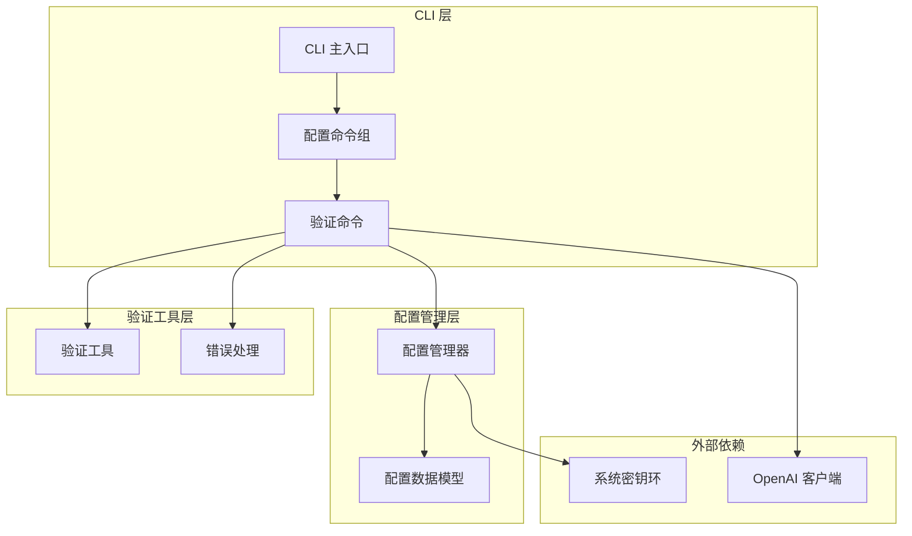
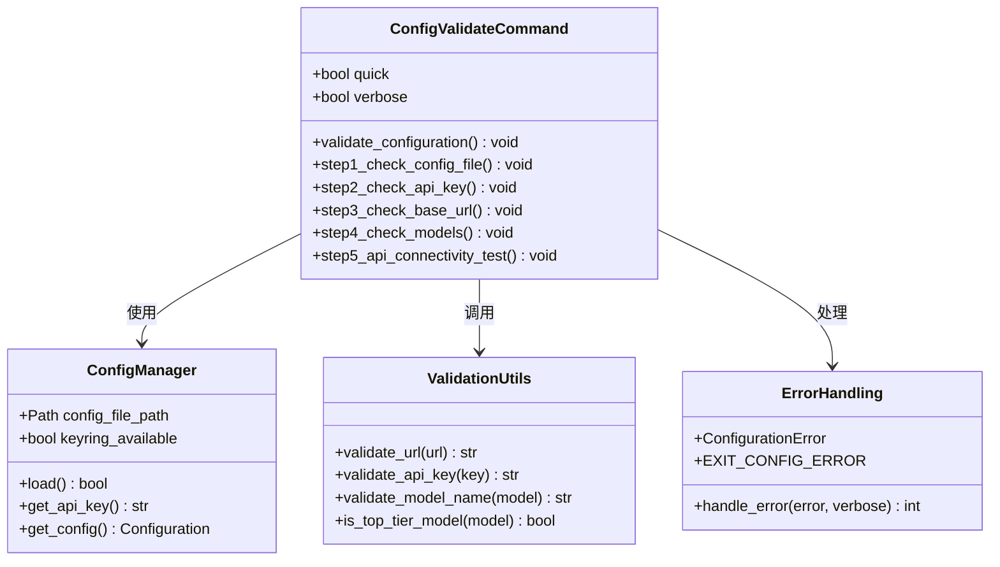
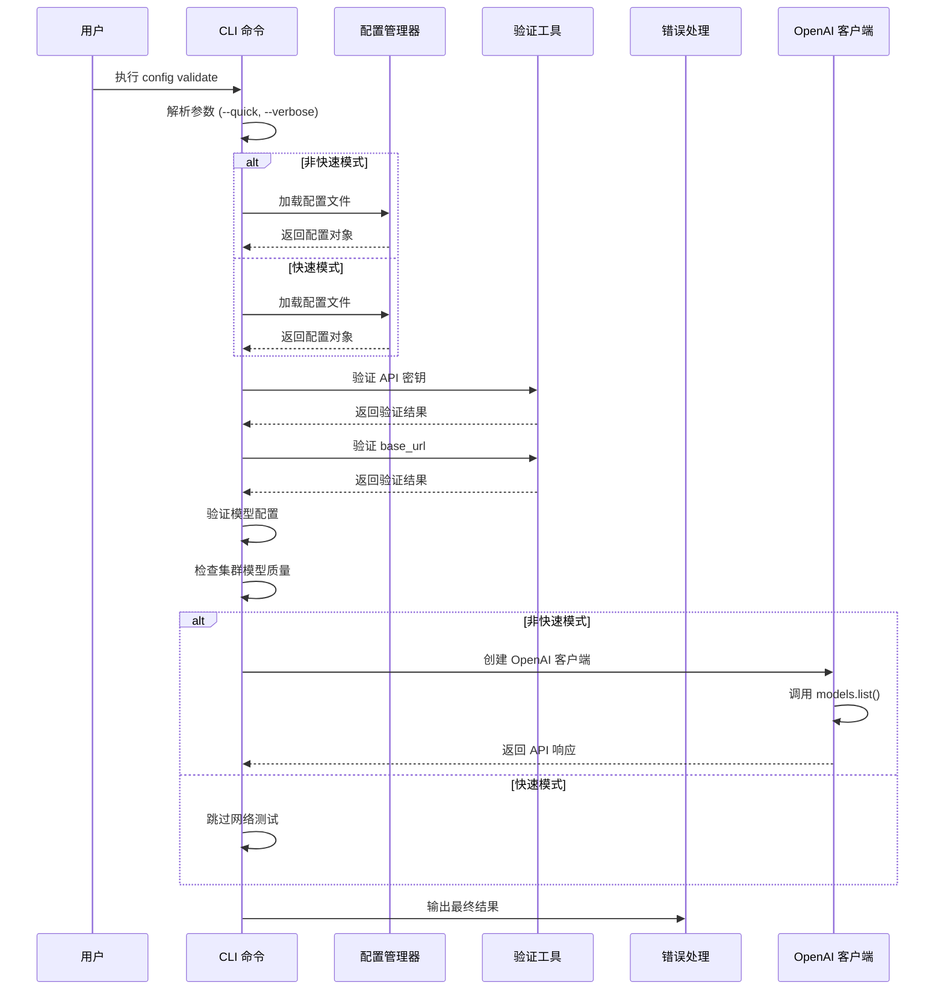
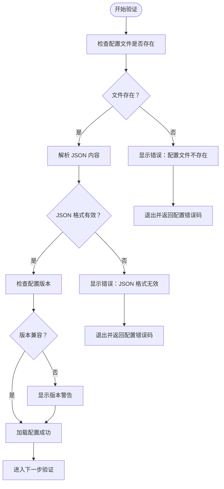
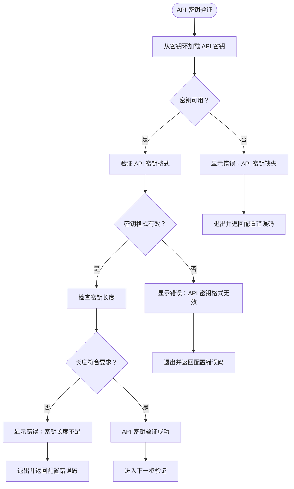
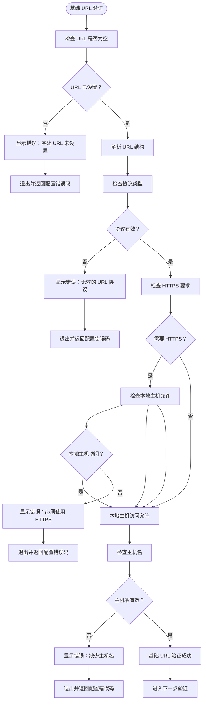
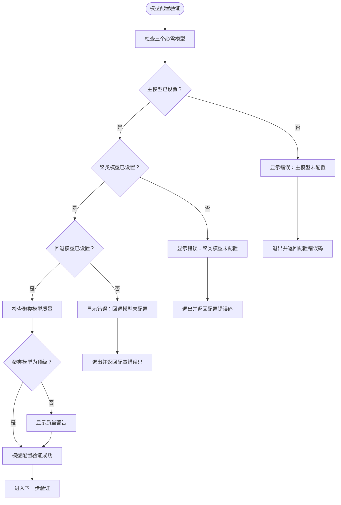
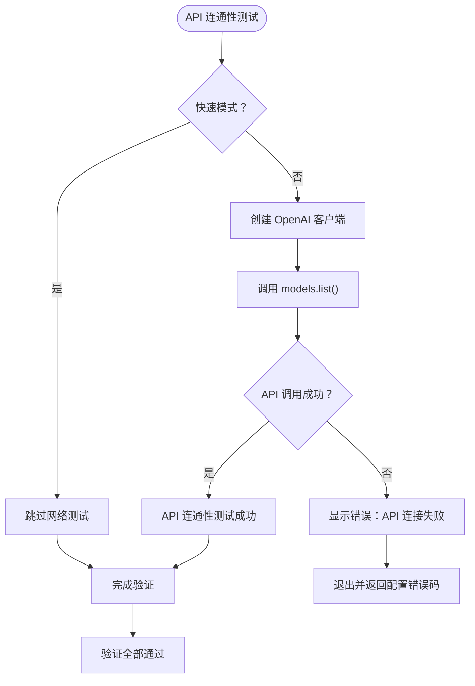
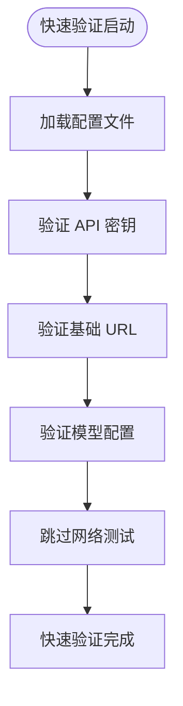
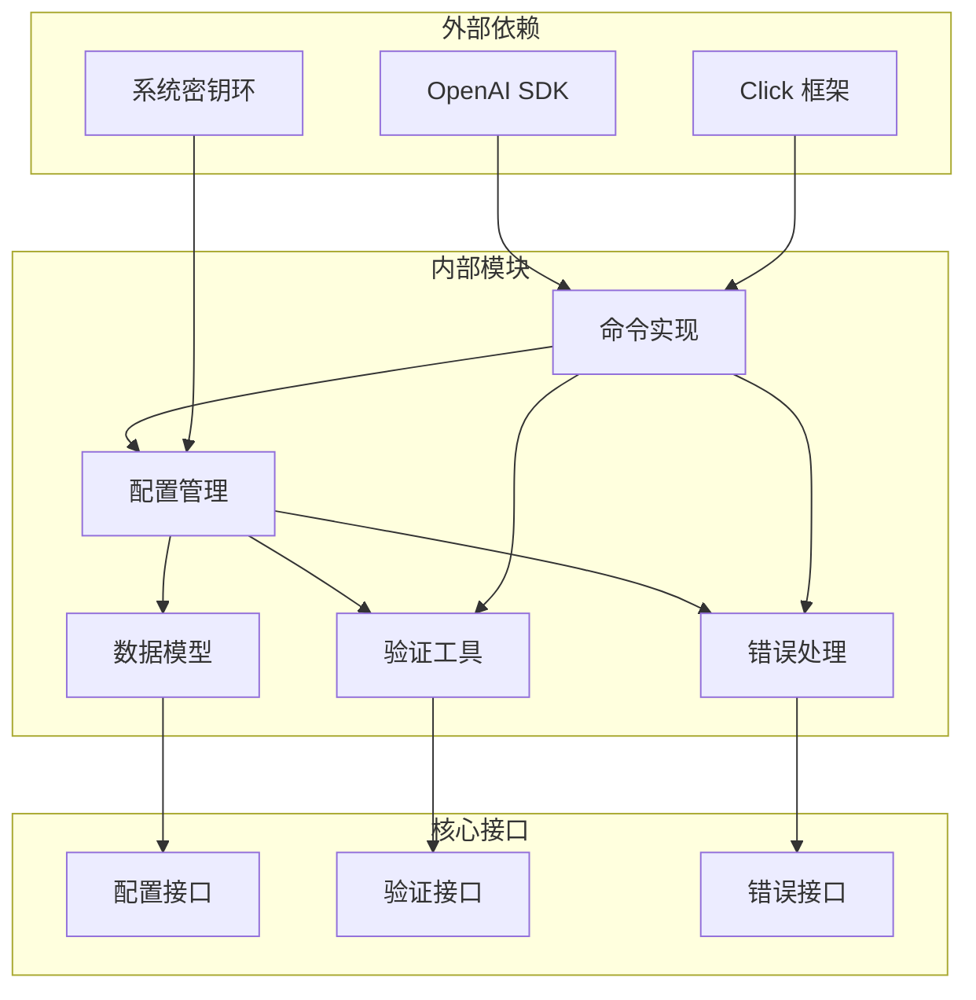

# 配置验证

<cite>
**本文档引用的文件**
- [config.py](file://codewiki/cli/commands/config.py)
- [config_manager.py](file://codewiki/cli/config_manager.py)
- [validation.py](file://codewiki/cli/utils/validation.py)
- [errors.py](file://codewiki/cli/utils/errors.py)
- [config.py](file://codewiki/cli/models/config.py)
- [api_errors.py](file://codewiki/cli/utils/api_errors.py)
- [main.py](file://codewiki/cli/main.py)
</cite>

## 目录
1. [简介](#简介)
2. [项目结构](#项目结构)
3. [核心组件](#核心组件)
4. [架构概览](#架构概览)
5. [详细组件分析](#详细组件分析)
6. [依赖关系分析](#依赖关系分析)
7. [性能考虑](#性能考虑)
8. [故障排除指南](#故障排除指南)
9. [结论](#结论)

## 简介

`config validate` 命令是 CodeWiki CLI 的核心配置验证工具，负责确保用户配置的完整性和有效性。该命令实现了严格的五步验证流程，涵盖配置文件完整性、API 密钥安全性、基础 URL 合规性、模型配置完整性和网络连通性测试等关键方面。

该命令特别设计了灵活的验证策略，支持快速验证模式（跳过网络测试）和详细验证模式（提供详细的步骤日志），为不同使用场景提供了最佳的用户体验。

## 项目结构

CodeWiki CLI 的配置验证功能分布在多个模块中，形成了清晰的分层架构：



**图表来源**
- [main.py](file://codewiki/cli/main.py#L34-L39)
- [config.py](file://codewiki/cli/commands/config.py#L265-L412)
- [config_manager.py](file://codewiki/cli/config_manager.py#L26-L237)

**章节来源**
- [main.py](file://codewiki/cli/main.py#L34-L39)
- [config.py](file://codewiki/cli/commands/config.py#L265-L412)

## 核心组件

### 验证命令实现

`config validate` 命令通过 Click 框架实现，提供了丰富的命令行选项和详细的错误处理机制：



**图表来源**
- [config.py](file://codewiki/cli/commands/config.py#L265-L412)
- [config_manager.py](file://codewiki/cli/config_manager.py#L26-L237)
- [validation.py](file://codewiki/cli/utils/validation.py#L13-L251)
- [errors.py](file://codewiki/cli/utils/errors.py#L27-L114)

### 配置数据模型

配置验证依赖于强类型的配置数据模型，确保所有配置项的一致性和完整性：

| 配置项 | 类型 | 必需 | 默认值 | 描述 |
|--------|------|------|--------|------|
| base_url | str | 是 | 空字符串 | LLM API 基础 URL |
| main_model | str | 是 | 空字符串 | 主要文档生成模型 |
| cluster_model | str | 是 | 空字符串 | 模块聚类模型 |
| fallback_model | str | 是 | "glm-4p5" | 回退模型 |
| default_output | str | 否 | "docs" | 默认输出目录 |
| language | str | 否 | "english" | 文档语言 |

**章节来源**
- [config.py](file://codewiki/cli/models/config.py#L20-L113)

## 架构概览

`config validate` 命令的验证流程遵循严格的五步验证架构：



**图表来源**
- [config.py](file://codewiki/cli/commands/config.py#L277-L412)
- [config_manager.py](file://codewiki/cli/config_manager.py#L51-L83)

## 详细组件分析

### 步骤一：配置文件存在性与格式验证

配置文件验证是整个验证流程的第一道关卡，确保配置文件的存在性和 JSON 格式的正确性：



**图表来源**
- [config.py](file://codewiki/cli/commands/config.py#L308-L324)
- [config_manager.py](file://codewiki/cli/config_manager.py#L51-L83)

验证过程包含以下关键检查：
- 文件存在性检查：确认 `~/.codewiki/config.json` 文件是否存在
- JSON 格式验证：解析并验证 JSON 结构的正确性
- 版本兼容性检查：确保配置版本与当前版本兼容
- 配置完整性验证：加载 Configuration 对象进行后续验证

**章节来源**
- [config.py](file://codewiki/cli/commands/config.py#L308-L324)
- [config_manager.py](file://codewiki/cli/config_manager.py#L51-L83)

### 步骤二：API 密钥验证与密钥环集成

API 密钥验证确保用户设置了有效的 API 凭据，并通过系统密钥环提供安全存储：



**图表来源**
- [config.py](file://codewiki/cli/commands/config.py#L325-L344)
- [config_manager.py](file://codewiki/cli/config_manager.py#L166-L179)
- [validation.py](file://codewiki/cli/utils/validation.py#L55-L79)

API 密钥验证包括：
- 密钥环集成：自动检测并使用系统密钥环存储 API 密钥
- 格式验证：检查 API 密钥不为空且去除首尾空白字符
- 长度检查：确保 API 密钥至少达到最小长度要求（默认 10 字符）
- 存储状态：区分密钥环存储和加密文件存储两种模式

**章节来源**
- [config.py](file://codewiki/cli/commands/config.py#L325-L344)
- [config_manager.py](file://codewiki/cli/config_manager.py#L166-L179)
- [validation.py](file://codewiki/cli/utils/validation.py#L55-L79)

### 步骤三：基础 URL 合规性验证

基础 URL 验证确保 API 基础地址的格式正确性和安全性：



**图表来源**
- [config.py](file://codewiki/cli/commands/config.py#L345-L365)
- [validation.py](file://codewiki/cli/utils/validation.py#L13-L52)

URL 验证规则：
- 协议检查：确保 URL 包含有效的协议（如 https:// 或 http://）
- HTTPS 要求：默认要求 HTTPS 协议，但允许本地主机使用 HTTP
- 主机名验证：确保 URL 包含有效的主机名部分
- 格式解析：使用标准 URL 解析器验证整体格式

**章节来源**
- [config.py](file://codewiki/cli/commands/config.py#L345-L365)
- [validation.py](file://codewiki/cli/utils/validation.py#L13-L52)

### 步骤四：模型配置完整性验证

模型配置验证确保主模型、聚类模型和回退模型都已正确配置：



**图表来源**
- [config.py](file://codewiki/cli/commands/config.py#L366-L391)
- [validation.py](file://codewiki/cli/utils/validation.py#L209-L229)

模型验证要点：
- 完整性检查：确保主模型、聚类模型和回退模型都已设置
- 质量评估：对聚类模型进行顶级质量评估
- 推荐提示：对非顶级聚类模型提供改进建议

**章节来源**
- [config.py](file://codewiki/cli/commands/config.py#L366-L391)
- [validation.py](file://codewiki/cli/utils/validation.py#L209-L229)

### 步骤五：API 连通性测试

API 连通性测试通过实际的 API 调用来验证配置的有效性：



**图表来源**
- [config.py](file://codewiki/cli/commands/config.py#L392-L402)

网络测试特性：
- 可选执行：通过 `--quick` 参数跳过网络测试
- 实际调用：使用 OpenAI 客户端执行真实的 API 调用
- 错误处理：捕获并报告所有网络和认证相关错误

**章节来源**
- [config.py](file://codewiki/cli/commands/config.py#L392-L402)

### 详细日志输出机制

`--verbose` 标志提供了详细的五步验证过程跟踪：

| 步骤编号 | 详细输出内容 | 作用 |
|----------|-------------|------|
| 1/5 | 显示配置文件路径和加载状态 | 确认配置文件存在性 |
| 2/5 | 显示密钥环存储状态和密钥长度 | 验证 API 密钥完整性 |
| 3/5 | 显示基础 URL 和验证结果 | 确保 URL 格式正确 |
| 4/5 | 显示三个模型配置详情 | 验证模型配置完整性 |
| 5/5 | 显示 API 连通性测试结果 | 验证网络连接 |

**章节来源**
- [config.py](file://codewiki/cli/commands/config.py#L309-L401)

### 快速验证模式

`--quick` 选项通过跳过网络测试来提高验证速度：



**图表来源**
- [config.py](file://codewiki/cli/commands/config.py#L393-L393)

快速模式优势：
- 性能优化：避免网络延迟和 API 调用开销
- 适用场景：配置文件修改后的快速检查
- 功能限制：仅验证本地配置，不验证网络连通性

**章节来源**
- [config.py](file://codewiki/cli/commands/config.py#L393-L393)

## 依赖关系分析

配置验证命令的依赖关系展现了清晰的分层架构：



**图表来源**
- [config.py](file://codewiki/cli/commands/config.py#L10-L23)
- [config_manager.py](file://codewiki/cli/config_manager.py#L8-L13)

**章节来源**
- [config.py](file://codewiki/cli/commands/config.py#L10-L23)
- [config_manager.py](file://codewiki/cli/config_manager.py#L8-L13)

## 性能考虑

配置验证命令在设计时充分考虑了性能优化：

### 时间复杂度分析

| 验证步骤 | 时间复杂度 | 说明 |
|----------|------------|------|
| 配置文件加载 | O(n) | n 为配置文件大小 |
| API 密钥验证 | O(1) | 基本常数时间操作 |
| URL 格式验证 | O(1) | 标准字符串解析 |
| 模型配置检查 | O(1) | 简单字段检查 |
| 网络测试 | O(1) | 单次 API 调用 |

### 内存使用优化

- **延迟加载**：配置文件仅在需要时加载
- **资源管理**：及时释放网络连接和文件句柄
- **缓存策略**：API 密钥在内存中缓存，避免重复查询

### 性能优化建议

1. **合理使用快速模式**：在频繁验证场景下使用 `--quick` 选项
2. **批量配置更新**：使用 `config set` 命令一次性更新多个配置项
3. **配置复用**：在团队环境中共享有效的配置文件

## 故障排除指南

### 常见错误类型及解决方案

#### 配置文件相关错误

| 错误类型 | 错误代码 | 触发条件 | 解决方案 |
|----------|----------|----------|----------|
| 配置文件缺失 | 2 | `~/.codewiki/config.json` 不存在 | 运行 `codewiki config set` 初始化配置 |
| JSON 格式错误 | 2 | 配置文件包含语法错误 | 检查 JSON 格式并修复语法问题 |
| 版本不兼容 | 2 | 配置版本过旧 | 运行 `codewiki config validate` 自动迁移 |

#### API 密钥相关错误

| 错误类型 | 错误代码 | 触发条件 | 解决方案 |
|----------|----------|----------|----------|
| 密钥缺失 | 2 | 未设置 API 密钥 | 运行 `codewiki config set --api-key <key>` |
| 密钥格式无效 | 2 | 密钥为空或格式错误 | 检查密钥格式并重新设置 |
| 密钥长度不足 | 2 | 密钥少于 10 字符 | 使用有效的 API 密钥 |

#### URL 相关错误

| 错误类型 | 错误代码 | 触发条件 | 解决方案 |
|----------|----------|----------|----------|
| URL 缺失 | 2 | 未设置基础 URL | 运行 `codewiki config set --base-url <url>` |
| 协议无效 | 2 | URL 缺少协议 | 添加 `https://` 或 `http://` 前缀 |
| HTTPS 要求 | 2 | 非本地主机使用 HTTP | 更改为 HTTPS 地址或使用本地主机 |

#### 模型配置错误

| 错误类型 | 错误代码 | 触发条件 | 解决方案 |
|----------|----------|----------|----------|
| 模型缺失 | 2 | 任一模型未设置 | 使用 `config set` 设置所有必需模型 |
| 模型名称无效 | 2 | 模型名称为空 | 提供有效的模型名称 |

#### 网络连接错误

| 错误类型 | 错误代码 | 触发条件 | 解决方案 |
|----------|----------|----------|----------|
| 连接超时 | 2 | 网络连接失败 | 检查网络连接和防火墙设置 |
| 认证失败 | 2 | API 密钥无效 | 验证 API 密钥并在提供商处检查状态 |
| 速率限制 | 2 | 请求过于频繁 | 等待后重试或升级 API 计划 |

### 诊断工具和技巧

#### 详细日志诊断

使用 `--verbose` 选项获取详细的验证过程信息：
```bash
codewiki config validate --verbose
```

#### 配置状态检查

查看当前配置状态：
```bash
codewiki config show
```

#### 系统环境检查

验证系统密钥环可用性：
```bash
codewiki config validate --quick
```

**章节来源**
- [errors.py](file://codewiki/cli/utils/errors.py#L18-L25)
- [api_errors.py](file://codewiki/cli/utils/api_errors.py#L14-L87)

## 结论

`config validate` 命令通过其严谨的五步验证流程和灵活的配置选项，为 CodeWiki CLI 提供了强大的配置管理能力。该命令不仅确保了配置的完整性和正确性，还通过详细的日志输出和错误处理机制，为用户提供了优秀的故障排除体验。

### 主要优势

1. **全面性**：覆盖配置文件、API 密钥、URL、模型配置和网络连通性五个关键方面
2. **灵活性**：支持快速验证和详细验证两种模式，适应不同使用场景
3. **安全性**：通过系统密钥环安全存储敏感信息
4. **易用性**：提供清晰的错误信息和故障排除指导
5. **性能**：优化的验证流程和可选的快速模式

### 最佳实践建议

1. **定期验证**：在重要配置更改后运行验证命令
2. **使用快速模式**：在日常开发中使用 `--quick` 选项提高效率
3. **详细日志**：遇到问题时使用 `--verbose` 获取更多信息
4. **配置备份**：定期备份有效的配置文件
5. **团队协作**：在团队环境中标准化配置模板

通过遵循这些实践，用户可以充分利用 `config validate` 命令的功能，确保 CodeWiki CLI 的稳定运行和高效使用。