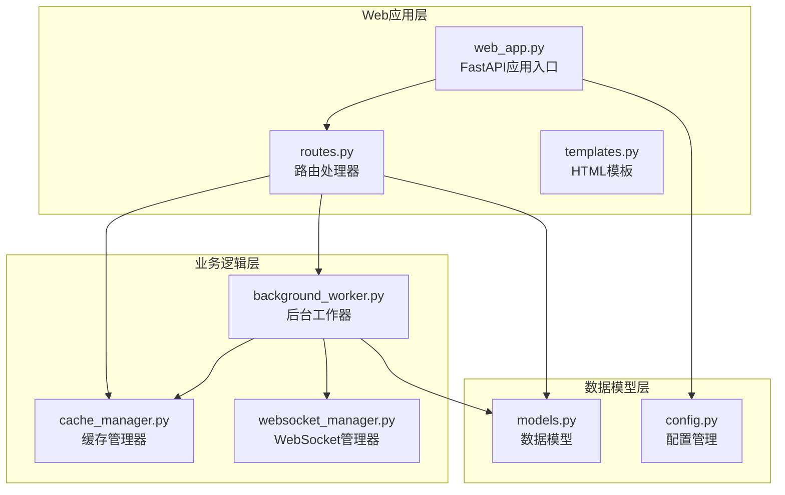
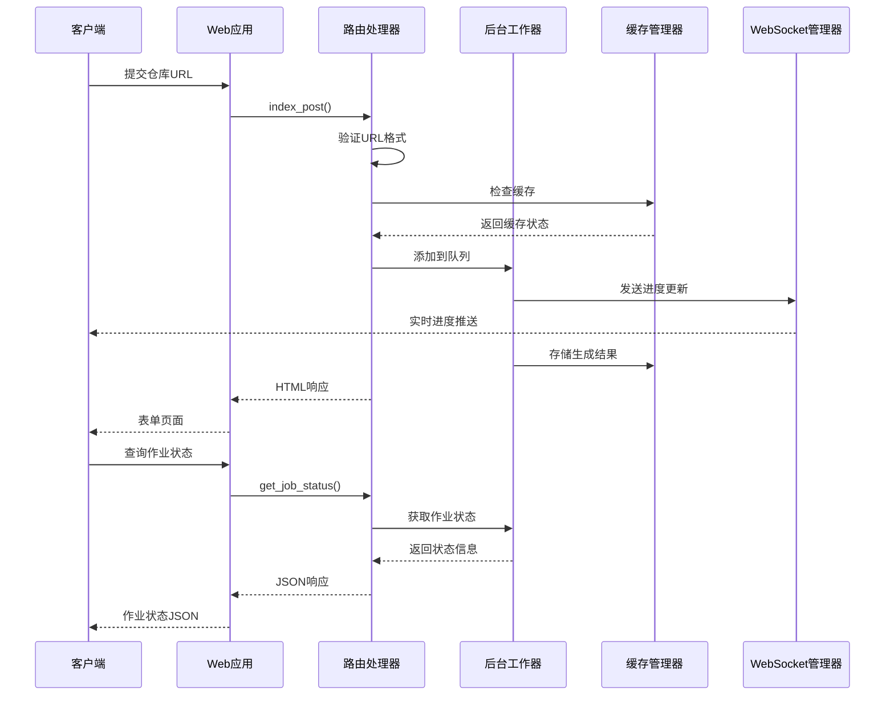
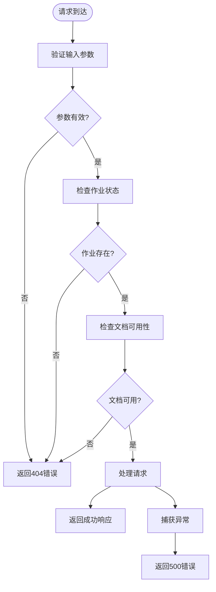

# API接口文档

<cite>
**本文档引用的文件**
- [web_app.py](file://codewiki/src/fe/web_app.py)
- [routes.py](file://codewiki/src/fe/routes.py)
- [models.py](file://codewiki/src/fe/models.py)
- [config.py](file://codewiki/src/fe/config.py)
- [background_worker.py](file://codewiki/src/fe/background_worker.py)
- [cache_manager.py](file://codewiki/src/fe/cache_manager.py)
- [websocket_manager.py](file://codewiki/src/fe/websocket_manager.py)
- [templates.py](file://codewiki/src/fe/templates.py)
</cite>

## 目录
1. [简介](#简介)
2. [项目结构](#项目结构)
3. [核心组件](#核心组件)
4. [架构概览](#架构概览)
5. [详细端点规范](#详细端点规范)
6. [数据模型](#数据模型)
7. [错误处理策略](#错误处理策略)
8. [性能与限制](#性能与限制)
9. [故障排除指南](#故障排除指南)
10. [结论](#结论)

## 简介

CodeWiki 是一个基于 FastAPI 的 Web 应用程序，用于为任意 Git 仓库生成综合性的技术文档。该应用程序提供了完整的 RESTful API 接口，支持用户通过 Web 表单提交 GitHub 仓库，后台异步处理文档生成，并提供实时进度跟踪和文档查看功能。

## 项目结构

应用程序采用模块化设计，主要包含以下核心组件：



**图表来源**
- [web_app.py](file://codewiki/src/fe/web_app.py#L24-L41)
- [routes.py](file://codewiki/src/fe/routes.py#L25-L31)
- [background_worker.py](file://codewiki/src/fe/background_worker.py#L26-L37)

**章节来源**
- [web_app.py](file://codewiki/src/fe/web_app.py#L1-L165)
- [routes.py](file://codewiki/src/fe/routes.py#L1-L299)

## 核心组件

### Web应用入口
- **文件**: `codewiki/src/fe/web_app.py`
- **功能**: 初始化 FastAPI 应用，注册所有路由端点
- **特性**: 支持命令行参数配置，包含调试模式和自动重载功能

### 路由处理器
- **文件**: `codewiki/src/fe/routes.py`
- **类**: `WebRoutes`
- **功能**: 处理所有 Web 请求，包括表单处理、文档生成状态查询、文档查看等

### 后台工作器
- **文件**: `codewiki/src/fe/background_worker.py`
- **类**: `BackgroundWorker`
- **功能**: 异步处理文档生成任务，管理作业队列，发送实时进度更新

### 缓存管理器
- **文件**: `codewiki/src/fe/cache_manager.py`
- **类**: `CacheManager`
- **功能**: 管理生成的文档缓存，支持缓存过期检查和清理

**章节来源**
- [web_app.py](file://codewiki/src/fe/web_app.py#L24-L92)
- [routes.py](file://codewiki/src/fe/routes.py#L25-L31)
- [background_worker.py](file://codewiki/src/fe/background_worker.py#L26-L42)

## 架构概览

应用程序采用分层架构设计，实现了清晰的关注点分离：



**图表来源**
- [web_app.py](file://codewiki/src/fe/web_app.py#L45-L75)
- [routes.py](file://codewiki/src/fe/routes.py#L55-L153)
- [background_worker.py](file://codewiki/src/fe/background_worker.py#L154-L287)

## 详细端点规范

### 根路径 GET (/)

**方法**: GET  
**描述**: 返回主页面 HTML 表单，允许用户输入 Git 仓库 URL  
**认证**: 无需认证  
**响应类型**: text/html  

**请求参数**:
- 无

**响应码**:
- 200: 成功返回表单页面
- 500: 服务器内部错误

**响应示例**:
```html
<!DOCTYPE html>
<html>
<head>
    <title>CodeWiki - Git Repository Documentation Generator</title>
</head>
<body>
    <!-- HTML表单内容 -->
    <form method="POST" action="/">
        <div class="form-group">
            <label for="repo_url">Git Repository URL:</label>
            <input type="url" id="repo_url" name="repo_url" required>
        </div>
        <div class="form-group">
            <label for="commit_id">Commit ID (optional):</label>
            <input type="text" id="commit_id" name="commit_id">
        </div>
        <button type="submit">Generate Documentation</button>
    </form>
</body>
</html>
```

**章节来源**
- [web_app.py](file://codewiki/src/fe/web_app.py#L45-L48)
- [routes.py](file://codewiki/src/fe/routes.py#L32-L53)

### 根路径 POST (/)

**方法**: POST  
**描述**: 处理用户提交的 Git 仓库 URL，验证格式并添加到处理队列  
**认证**: 无需认证  
**响应类型**: text/html  

**请求参数**:
- `repo_url`: Git 仓库 URL (必需)
- `commit_id`: Git 提交 ID (可选)

**响应码**:
- 200: 成功处理并返回更新后的页面
- 400: 无效的仓库 URL
- 500: 服务器内部错误

**响应示例**:
```html
<!-- 包含成功消息或错误提示的完整页面 -->
<div class="alert alert-success">
    仓库已添加到处理队列！作业ID: abc-def-ghi
</div>
```

**错误处理**:
- 空 URL: 返回错误消息 "请输入Git仓库URL"
- 无效URL格式: 返回错误消息 "请输入有效的Git仓库URL"
- 队列满: 抛出异常并返回错误消息

**章节来源**
- [web_app.py](file://codewiki/src/fe/web_app.py#L51-L54)
- [routes.py](file://codewiki/src/fe/routes.py#L55-L153)

### 作业状态查询 GET (/api/job/{job_id})

**方法**: GET  
**描述**: 获取指定作业的当前状态信息  
**认证**: 无需认证  
**响应类型**: application/json  

**路径参数**:
- `job_id`: 作业ID (字符串)

**响应码**:
- 200: 成功返回作业状态
- 404: 作业不存在
- 500: 服务器内部错误

**响应示例**:
```json
{
    "job_id": "owner--repo",
    "repo_url": "https://github.com/owner/repo",
    "status": "completed",
    "created_at": "2024-01-15T10:30:00Z",
    "started_at": "2024-01-15T10:31:00Z",
    "completed_at": "2024-01-15T11:15:00Z",
    "error_message": null,
    "progress": "文档生成完成",
    "docs_path": "/path/to/docs",
    "main_model": "gpt-4-turbo",
    "commit_id": "abc123def456"
}
```

**数据模型**: JobStatusResponse

**章节来源**
- [web_app.py](file://codewiki/src/fe/web_app.py#L57-L60)
- [routes.py](file://codewiki/src/fe/routes.py#L155-L161)
- [models.py](file://codewiki/src/fe/models.py#L17-L30)

### 文档查看 GET (/docs/{job_id})

**方法**: GET  
**描述**: 重定向到文档查看页面  
**认证**: 无需认证  
**响应类型**: application/json  

**路径参数**:
- `job_id`: 作业ID (字符串)

**响应码**:
- 302: 成功重定向到文档页面
- 404: 作业不存在或文档不可用
- 500: 服务器内部错误

**响应示例**:
```json
{
    "location": "/static-docs/{job_id}/"
}
```

**重定向逻辑**:
- 检查作业状态是否为 completed
- 验证文档文件是否存在
- 成功时重定向到 `/static-docs/{job_id}/`

**章节来源**
- [web_app.py](file://codewiki/src/fe/web_app.py#L63-L66)
- [routes.py](file://codewiki/src/fe/routes.py#L163-L177)

### 静态文档服务 GET (/static-docs/{job_id}/{filename:path})

**方法**: GET  
**描述**: 提供生成的文档文件服务  
**认证**: 无需认证  
**响应类型**: text/html  

**路径参数**:
- `job_id`: 作业ID (字符串)
- `filename`: 文件名 (可选，默认为 overview.md)

**查询参数**:
- `filename`: 要请求的文档文件名

**响应码**:
- 200: 成功返回文档内容
- 404: 作业不存在、文档不可用或文件不存在
- 500: 服务器内部错误

**响应示例**:
```html
<!DOCTYPE html>
<html>
<head>
    <title>文档标题</title>
</head>
<body>
    <!-- Markdown转换后的HTML内容 -->
    <div class="markdown-content">
        <h1>文档标题</h1>
        <p>文档内容...</p>
    </div>
</body>
</html>
```

**文件服务逻辑**:
- 支持 overview.md 作为默认文件
- 自动将 Markdown 文件转换为 HTML
- 提供导航树和元数据信息
- 支持模块树结构导航

**章节来源**
- [web_app.py](file://codewiki/src/fe/web_app.py#L69-L75)
- [routes.py](file://codewiki/src/fe/routes.py#L179-L268)

## 数据模型

### JobStatusResponse (作业状态响应)

| 字段名 | 类型 | 必需 | 描述 |
|--------|------|------|------|
| job_id | string | 是 | 作业唯一标识符 |
| repo_url | string | 是 | Git仓库URL |
| status | string | 是 | 作业状态 (queued, processing, completed, failed) |
| created_at | datetime | 是 | 作业创建时间 |
| started_at | datetime | 否 | 作业开始时间 |
| completed_at | datetime | 否 | 作业完成时间 |
| error_message | string | 否 | 错误信息 |
| progress | string | 否 | 进度描述 |
| docs_path | string | 否 | 文档存储路径 |
| main_model | string | 否 | 使用的AI模型 |
| commit_id | string | 否 | Git提交ID |

### ProgressMessage (进度消息)

| 字段名 | 类型 | 必需 | 描述 |
|--------|------|------|------|
| job_id | string | 是 | 作业ID |
| status | string | 是 | 作业状态 |
| progress | string | 是 | 进度描述 |
| current_module | string | 否 | 当前处理模块 |
| current_component | string | 否 | 当前处理组件 |
| module_index | integer | 否 | 当前模块索引 |
| total_modules | integer | 否 | 总模块数 |
| component_index | integer | 否 | 当前组件索引 |
| total_components | integer | 否 | 总组件数 |
| total_tokens | integer | 否 | 总令牌数 |
| timestamp | datetime | 否 | 时间戳 |
| error_message | string | 否 | 错误信息 |

**章节来源**
- [models.py](file://codewiki/src/fe/models.py#L17-L71)

## 错误处理策略

### HTTP状态码映射

| 错误类型 | HTTP状态码 | 触发条件 | 响应内容 |
|----------|------------|----------|----------|
| 作业不存在 | 404 | get_job_status()找不到作业 | "Job not found" |
| 文档不可用 | 404 | view_docs()文档未完成或不存在 | "Documentation not available" |
| 文件不存在 | 404 | serve_generated_docs()文件缺失 | "File {filename} not found" |
| 缓存未找到 | 404 | 缓存中无文档 | "Documentation not found" |
| 服务器错误 | 500 | 处理异常 | "Error reading {filename}: {error}" |

### 错误恢复机制



**图表来源**
- [routes.py](file://codewiki/src/fe/routes.py#L155-L177)
- [routes.py](file://codewiki/src/fe/routes.py#L179-L268)

**章节来源**
- [routes.py](file://codewiki/src/fe/routes.py#L155-L177)
- [routes.py](file://codewiki/src/fe/routes.py#L179-L268)

## 性能与限制

### 配置参数

| 参数名称 | 默认值 | 描述 |
|----------|--------|--------|
| CACHE_DIR | ./output/cache | 缓存目录 |
| TEMP_DIR | ./output/temp | 临时文件目录 |
| CACHE_EXPIRY_DAYS | 365 | 缓存过期天数 |
| QUEUE_SIZE | 100 | 队列大小限制 |
| JOB_CLEANUP_HOURS | 24000 | 作业清理间隔 |
| RETRY_COOLDOWN_MINUTES | 3 | 重试冷却时间 |

### 速率限制考虑

1. **队列限制**: 最大支持100个并发作业
2. **重试保护**: 3分钟内避免重复提交相同作业
3. **缓存优化**: 利用缓存减少重复处理
4. **连接池**: WebSocket连接按作业ID分组管理

### 性能优化建议

1. **缓存策略**: 合理设置缓存过期时间
2. **并发控制**: 监控队列长度，避免过载
3. **资源清理**: 定期清理临时文件和过期缓存
4. **监控指标**: 记录作业处理时间和成功率

**章节来源**
- [config.py](file://codewiki/src/fe/config.py#L10-L51)
- [background_worker.py](file://codewiki/src/fe/background_worker.py#L29-L42)

## 故障排除指南

### 常见问题诊断

**问题1: 作业状态查询返回404**
- 检查作业ID是否正确
- 确认作业是否在系统中存在
- 验证作业是否已完成或失败

**问题2: 文档查看返回404**
- 确认作业状态为completed
- 检查文档目录是否存在
- 验证overview.md文件是否生成

**问题3: WebSocket连接失败**
- 检查网络连接
- 确认WebSocket端点可达
- 验证浏览器支持WebSocket

**问题4: 缓存失效**
- 检查缓存目录权限
- 验证缓存过期设置
- 确认磁盘空间充足

### 日志记录

应用程序使用结构化日志记录：
- 作业状态变更
- 错误异常信息
- 性能指标统计
- 缓存操作记录

**章节来源**
- [websocket_manager.py](file://codewiki/src/fe/websocket_manager.py#L18-L42)
- [background_worker.py](file://codewiki/src/fe/background_worker.py#L154-L287)

## 结论

CodeWiki 提供了一个完整、可靠的文档生成服务 API。其设计特点包括：

1. **RESTful接口**: 清晰的HTTP方法和URL结构
2. **实时反馈**: 通过WebSocket提供进度更新
3. **智能缓存**: 减少重复处理，提高响应速度
4. **健壮错误处理**: 完善的错误码和恢复机制
5. **可扩展架构**: 模块化设计便于维护和扩展

该API适合集成到各种开发工具和CI/CD流程中，为开发者提供自动化的技术文档生成功能。