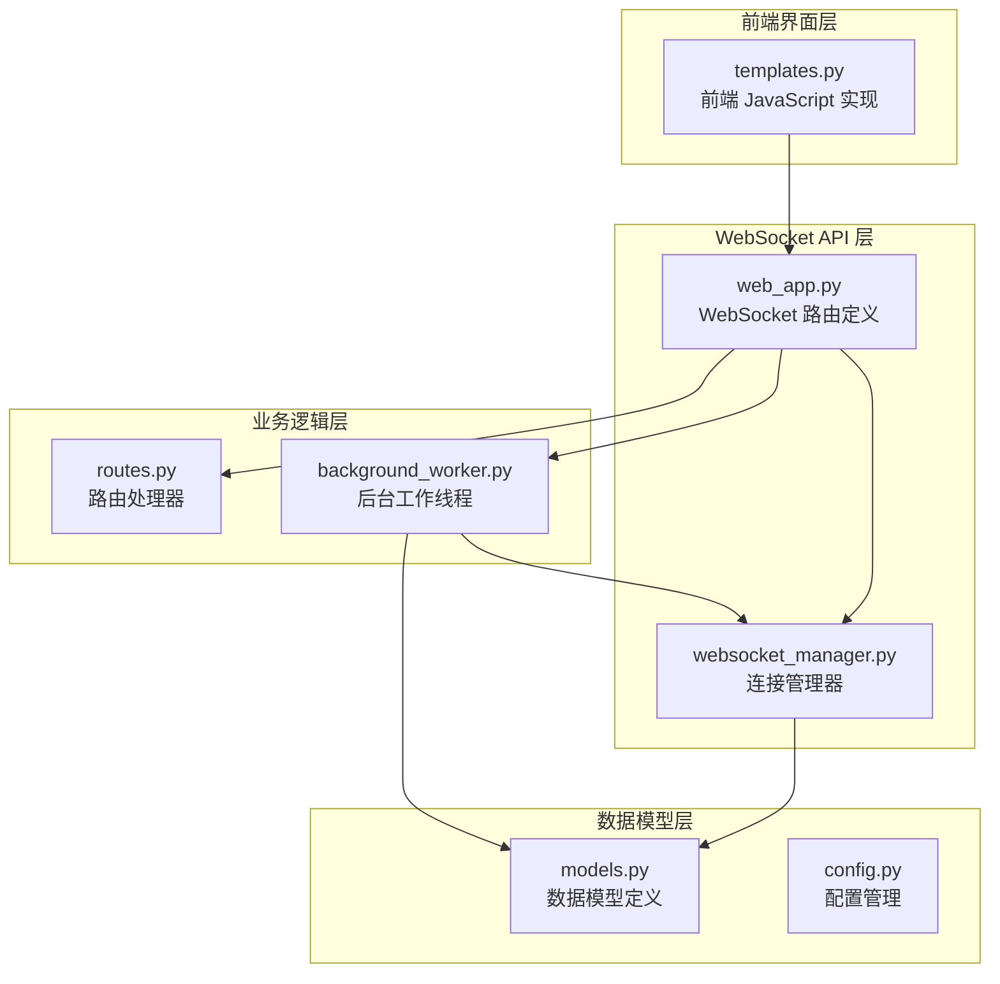
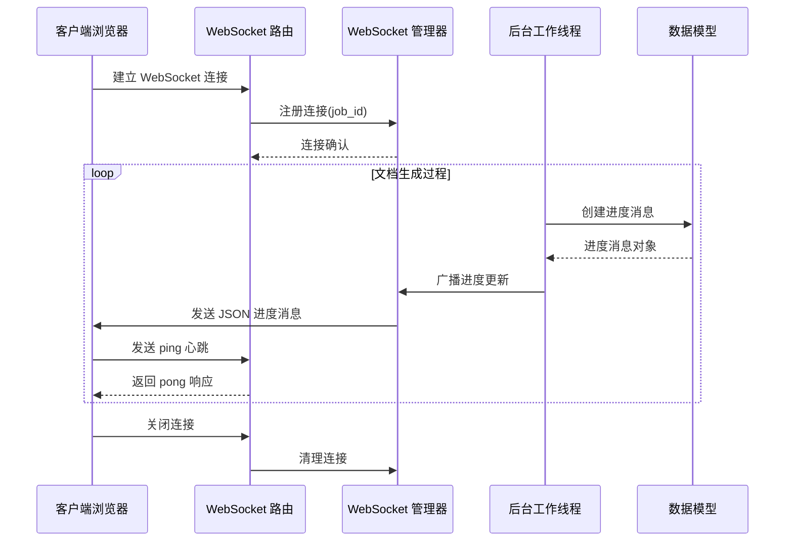
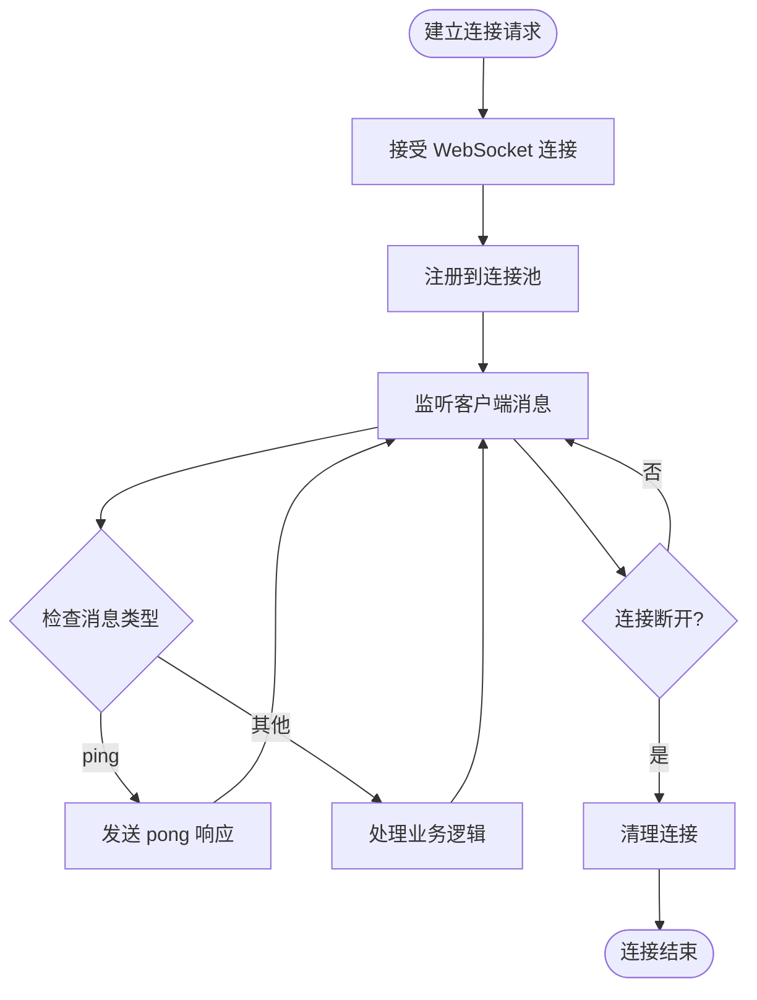
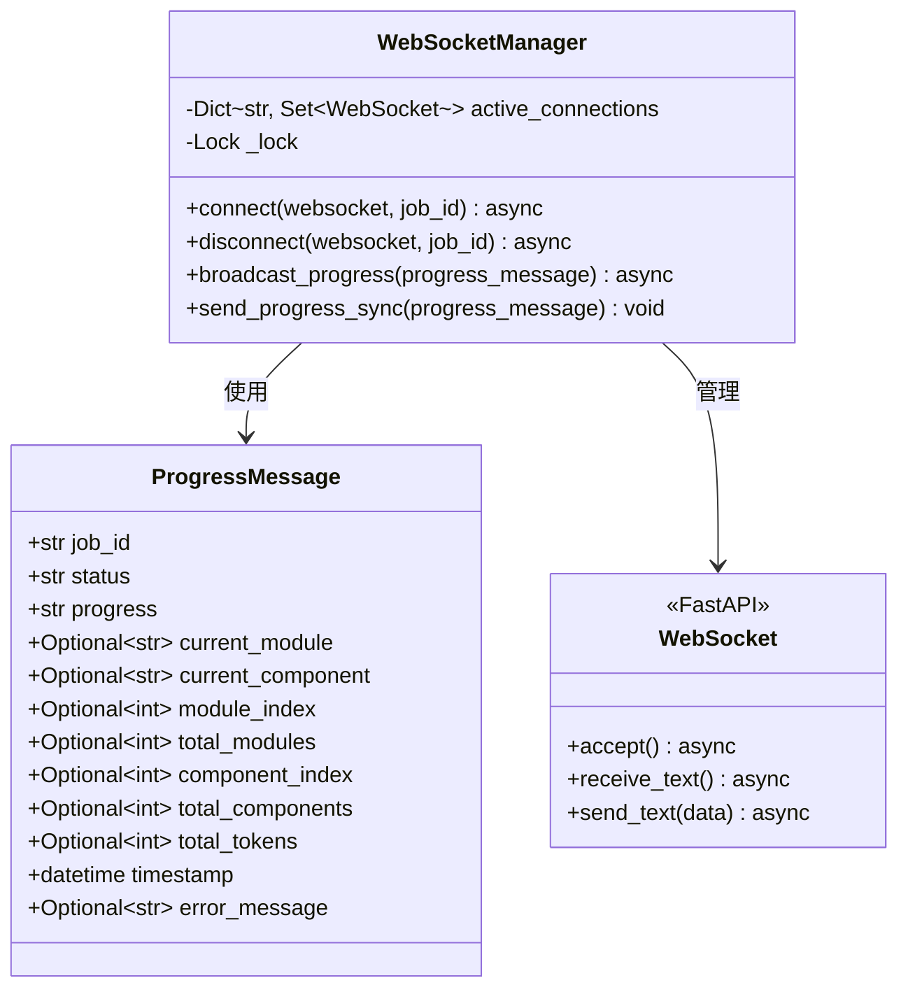
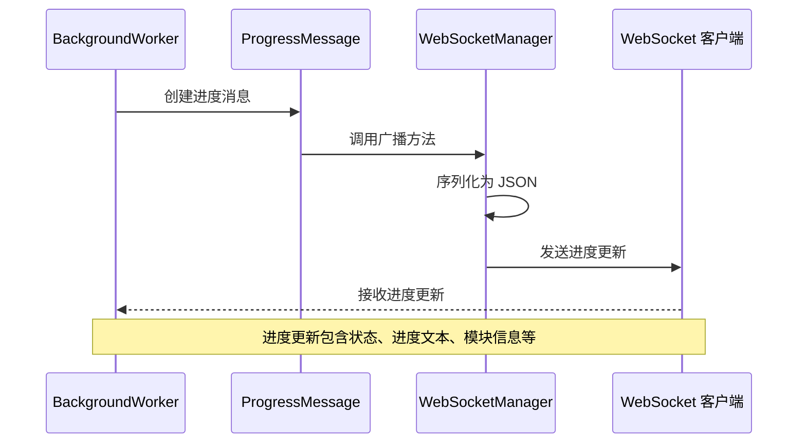
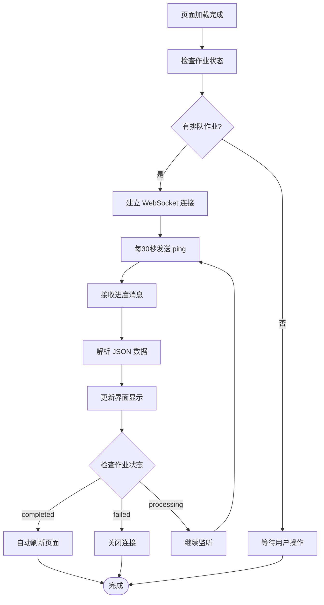
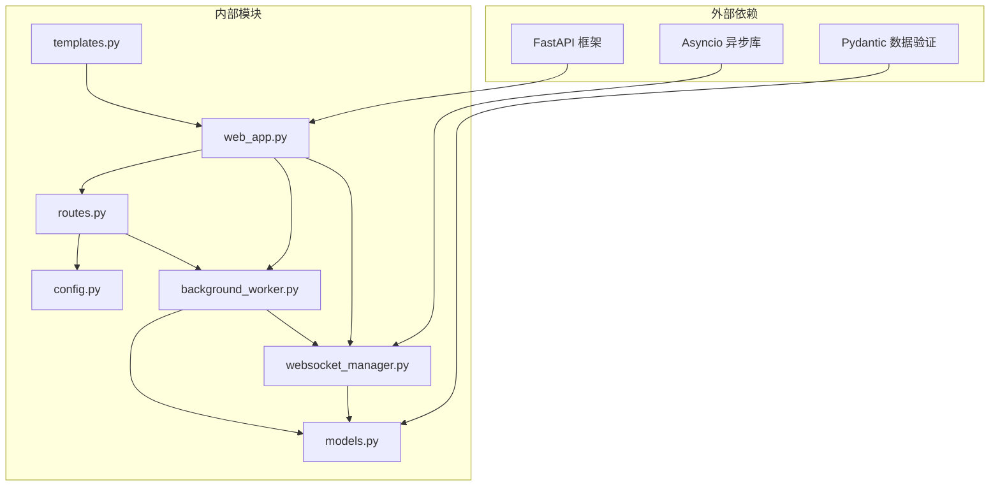

# WebSocket进度接口

<cite>
**本文档引用的文件**
- [websocket_manager.py](file://codewiki/src/fe/websocket_manager.py)
- [web_app.py](file://codewiki/src/fe/web_app.py)
- [background_worker.py](file://codewiki/src/fe/background_worker.py)
- [models.py](file://codewiki/src/fe/models.py)
- [templates.py](file://codewiki/src/fe/templates.py)
- [config.py](file://codewiki/src/fe/config.py)
- [routes.py](file://codewiki/src/fe/routes.py)
</cite>

## 目录
1. [简介](#简介)
2. [项目结构](#项目结构)
3. [核心组件](#核心组件)
4. [架构概览](#架构概览)
5. [详细组件分析](#详细组件分析)
6. [依赖关系分析](#依赖关系分析)
7. [性能考虑](#性能考虑)
8. [故障排除指南](#故障排除指南)
9. [结论](#结论)

## 简介

本文档详细说明了 `/ws/progress/{job_id}` WebSocket API 的实现和使用方法。该接口是一个实时进度推送服务，用于向客户端推送文档生成作业的实时进度更新。系统采用 WebSocket 长连接技术，结合心跳机制确保连接稳定性，并通过连接池管理器实现多客户端并发连接支持。

该 WebSocket 接口是 CodeWiki 文档生成系统的重要组成部分，为用户提供实时的作业状态反馈，包括处理进度、当前模块信息、错误状态等详细信息。

## 项目结构

WebSocket 进度接口涉及以下关键文件和模块：

**图表来源**
- [web_app.py](file://codewiki/src/fe/web_app.py#L78-L91)
- [websocket_manager.py](file://codewiki/src/fe/websocket_manager.py#L18-L99)
- [background_worker.py](file://codewiki/src/fe/background_worker.py#L26-L42)

**章节来源**
- [web_app.py](file://codewiki/src/fe/web_app.py#L1-L165)
- [websocket_manager.py](file://codewiki/src/fe/websocket_manager.py#L1-L100)
- [background_worker.py](file://codewiki/src/fe/background_worker.py#L1-L294)

## 核心组件

### WebSocket 路由定义

在 `web_app.py` 中定义了 `/ws/progress/{job_id}` WebSocket 路由，负责处理客户端连接请求和消息交互。

### WebSocket 管理器

`WebSocketManager` 类是连接池的核心管理组件，负责：
- 维护按作业 ID 分组的连接集合
- 处理新连接注册和断开连接清理
- 广播进度更新到所有相关客户端
- 提供同步和异步两种广播方式

### 后台工作线程

`BackgroundWorker` 类负责实际的文档生成任务，并通过 WebSocket 管理器向客户端推送进度更新。

### 数据模型

`ProgressMessage` 模型定义了 WebSocket 消息的数据结构，包含作业状态、进度信息、时间戳等字段。

**章节来源**
- [web_app.py](file://codewiki/src/fe/web_app.py#L78-L91)
- [websocket_manager.py](file://codewiki/src/fe/websocket_manager.py#L18-L99)
- [background_worker.py](file://codewiki/src/fe/background_worker.py#L26-L42)
- [models.py](file://codewiki/src/fe/models.py#L58-L71)

## 架构概览

WebSocket 进度接口采用分层架构设计，实现了清晰的关注点分离：

**图表来源**
- [web_app.py](file://codewiki/src/fe/web_app.py#L78-L91)
- [websocket_manager.py](file://codewiki/src/fe/websocket_manager.py#L26-L42)
- [background_worker.py](file://codewiki/src/fe/background_worker.py#L167-L181)

## 详细组件分析

### WebSocket 路由实现

WebSocket 路由在 `web_app.py` 中定义，提供了完整的连接生命周期管理：

**图表来源**
- [web_app.py](file://codewiki/src/fe/web_app.py#L78-L91)

### WebSocket 管理器类结构

**图表来源**
- [websocket_manager.py](file://codewiki/src/fe/websocket_manager.py#L18-L99)
- [models.py](file://codewiki/src/fe/models.py#L58-L71)

### 后台工作线程集成

后台工作线程通过以下流程与 WebSocket 管理器集成：

**图表来源**
- [background_worker.py](file://codewiki/src/fe/background_worker.py#L167-L181)
- [websocket_manager.py](file://codewiki/src/fe/websocket_manager.py#L44-L78)

**章节来源**
- [web_app.py](file://codewiki/src/fe/web_app.py#L78-L91)
- [websocket_manager.py](file://codewiki/src/fe/websocket_manager.py#L18-L99)
- [background_worker.py](file://codewiki/src/fe/background_worker.py#L167-L181)

### 前端 JavaScript 实现

前端通过模板中的 JavaScript 代码实现 WebSocket 连接管理和进度更新显示：

**图表来源**
- [templates.py](file://codewiki/src/fe/templates.py#L309-L366)
- [templates.py](file://codewiki/src/fe/templates.py#L368-L438)

**章节来源**
- [templates.py](file://codewiki/src/fe/templates.py#L302-L500)

## 依赖关系分析

WebSocket 进度接口的依赖关系如下：

**图表来源**
- [web_app.py](file://codewiki/src/fe/web_app.py#L13-L21)
- [websocket_manager.py](file://codewiki/src/fe/websocket_manager.py#L6-L13)
- [background_worker.py](file://codewiki/src/fe/background_worker.py#L18-L24)

**章节来源**
- [web_app.py](file://codewiki/src/fe/web_app.py#L13-L21)
- [websocket_manager.py](file://codewiki/src/fe/websocket_manager.py#L6-L13)
- [background_worker.py](file://codewiki/src/fe/background_worker.py#L18-L24)

## 性能考虑

### 连接池优化

WebSocket 管理器使用字典存储按作业 ID 分组的连接集合，提供 O(1) 的连接查找效率。通过异步锁确保多线程环境下的连接管理安全性。

### 内存管理

系统采用连接池模式，避免频繁创建和销毁连接的开销。当客户端断开连接时，管理器会自动清理断开的连接，防止内存泄漏。

### 消息序列化

进度消息使用 Pydantic 模型进行序列化，确保数据结构的一致性和完整性。时间戳转换为 ISO 格式字符串，保证跨语言兼容性。

### 心跳机制

客户端每 30 秒发送一次 ping 消息，服务器立即响应 pong，用于检测连接状态和维持长连接活跃。

## 故障排除指南

### 常见问题及解决方案

1. **连接无法建立**
   - 检查 WebSocket 路由是否正确配置
   - 确认服务器端口和主机设置
   - 验证防火墙和网络连接

2. **进度消息不显示**
   - 检查后台工作线程是否正常运行
   - 确认 WebSocket 管理器的广播功能
   - 验证前端 JavaScript 的消息处理逻辑

3. **连接频繁断开**
   - 检查客户端的心跳发送频率
   - 验证服务器端的连接超时设置
   - 确认网络环境的稳定性

4. **内存泄漏问题**
   - 确保客户端断开连接时正确关闭
   - 检查服务器端的连接清理逻辑
   - 监控连接池的大小变化

**章节来源**
- [websocket_manager.py](file://codewiki/src/fe/websocket_manager.py#L62-L78)
- [templates.py](file://codewiki/src/fe/templates.py#L350-L362)

## 结论

`/ws/progress/{job_id}` WebSocket API 提供了一个高效、可靠的实时进度推送解决方案。通过精心设计的连接池管理、心跳机制和错误处理，系统能够稳定地支持多个客户端同时监控文档生成作业的状态。

该接口的主要优势包括：
- 实时性：进度更新几乎无延迟
- 可靠性：内置心跳机制和自动重连
- 扩展性：支持多客户端并发连接
- 易用性：简洁的 API 设计和完善的错误处理

对于生产环境部署，建议关注连接池大小限制、内存使用监控和网络带宽规划，以确保系统的长期稳定运行。