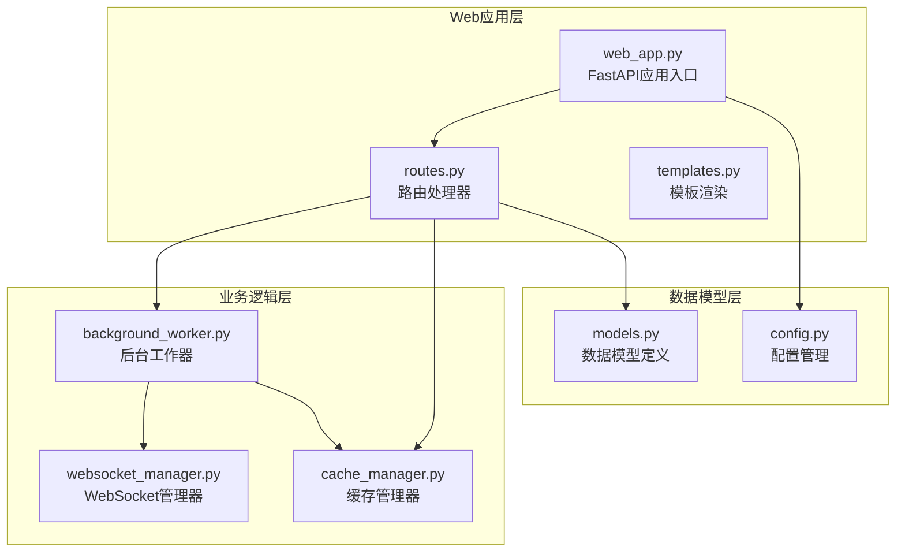
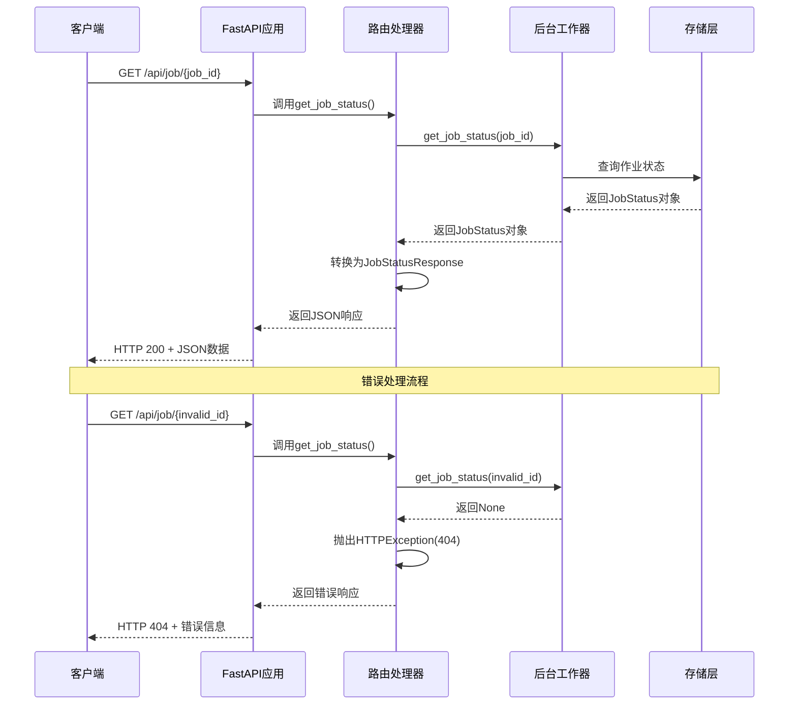
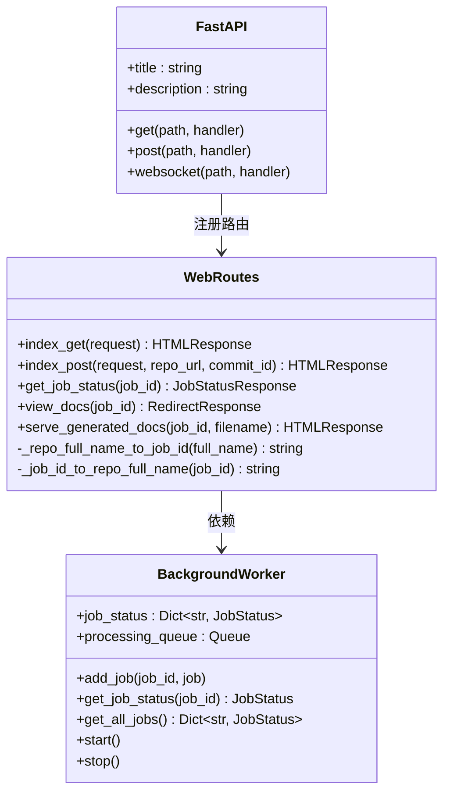
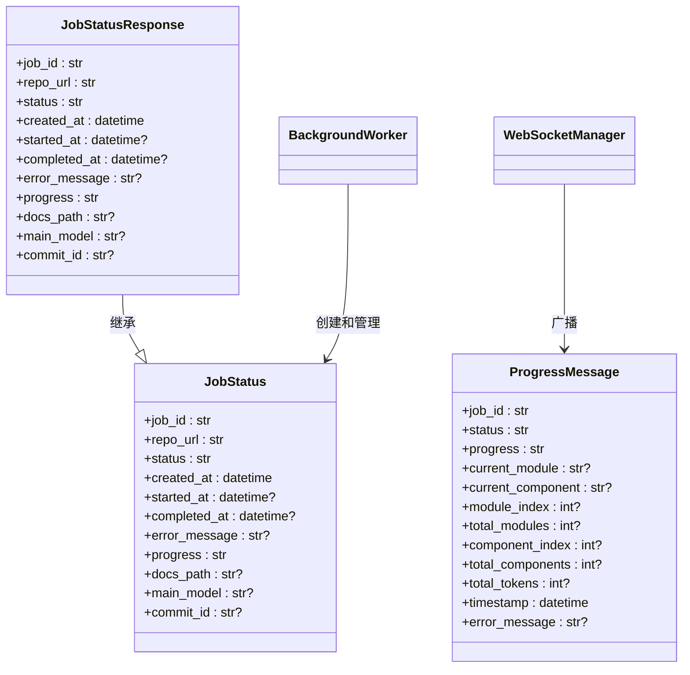
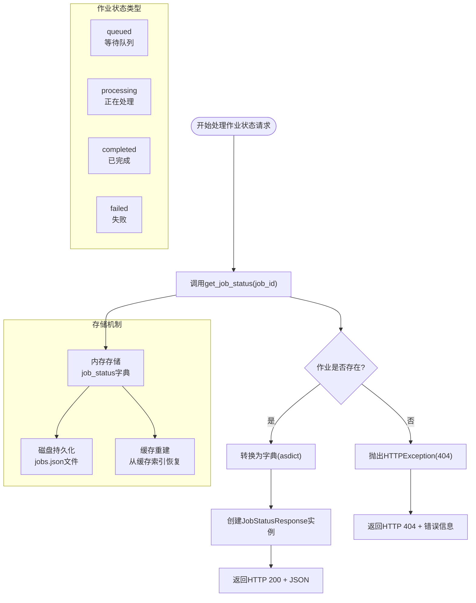
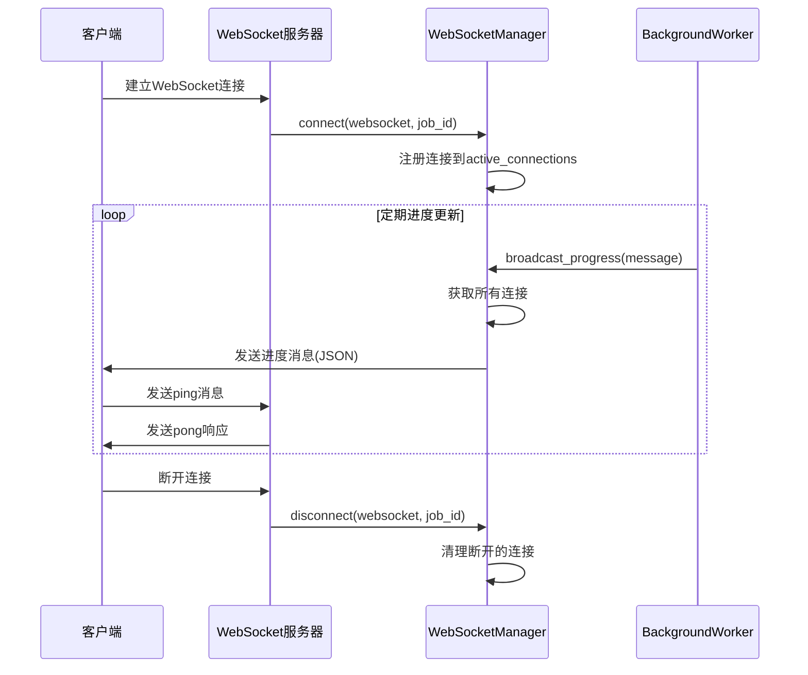
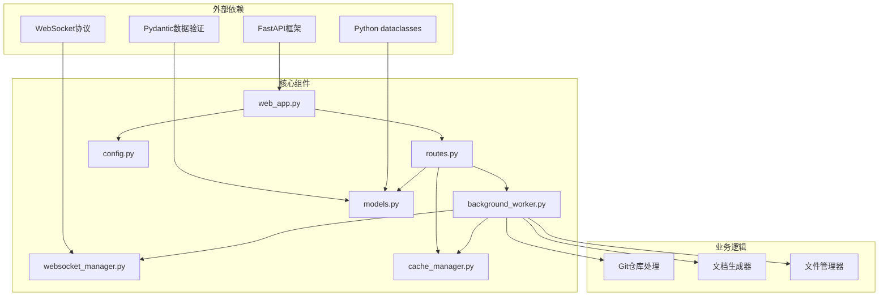

# 作业状态API

<cite>
**本文档引用的文件**
- [web_app.py](file://codewiki/src/fe/web_app.py)
- [routes.py](file://codewiki/src/fe/routes.py)
- [models.py](file://codewiki/src/fe/models.py)
- [background_worker.py](file://codewiki/src/fe/background_worker.py)
- [websocket_manager.py](file://codewiki/src/fe/websocket_manager.py)
- [config.py](file://codewiki/src/fe/config.py)
- [cache_manager.py](file://codewiki/src/fe/cache_manager.py)
</cite>

## 目录
1. [简介](#简介)
2. [项目结构](#项目结构)
3. [核心组件](#核心组件)
4. [架构概览](#架构概览)
5. [详细组件分析](#详细组件分析)
6. [依赖关系分析](#依赖关系分析)
7. [性能考虑](#性能考虑)
8. [故障排除指南](#故障排除指南)
9. [结论](#结论)

## 简介

本文档详细描述了 `/api/job/{job_id}` RESTful API 端点，该端点用于查询指定作业的实时状态。这是一个 GET 请求端点，返回 JSON 格式的作业状态信息，支持轮询机制以监控长时间运行的文档生成任务。

## 项目结构

CodeWiki 是一个基于 FastAPI 的 Web 应用程序，专门用于从 Git 仓库生成文档。项目采用模块化设计，主要包含以下关键组件：

**图表来源**
- [web_app.py](file://codewiki/src/fe/web_app.py#L24-L42)
- [routes.py](file://codewiki/src/fe/routes.py#L25-L31)
- [background_worker.py](file://codewiki/src/fe/background_worker.py#L26-L37)

**章节来源**
- [web_app.py](file://codewiki/src/fe/web_app.py#L1-L165)
- [routes.py](file://codewiki/src/fe/routes.py#L1-L299)

## 核心组件

### API端点定义

`/api/job/{job_id}` 端点是整个系统的核心接口，负责提供作业状态查询功能：

- **HTTP方法**: GET
- **路径参数**: `job_id` (必需)
- **响应类型**: JSON
- **认证**: 无需认证
- **CORS**: 支持跨域请求

### 路径参数格式规范

作业ID (`job_id`) 采用特殊格式，由仓库全名转换而来：

- **原始格式**: `owner/repo-name`
- **转换规则**: 使用 `--` 替换 `/` 字符
- **示例**: `github.com/user/repo` → `user--repo`
- **URL安全**: 仅包含字母数字字符和连字符，适合URL传输

### 响应数据结构

API返回的 JSON 结构基于 `JobStatusResponse` 模型，包含以下字段：

| 字段名 | 类型 | 必需 | 描述 |
|--------|------|------|------|
| job_id | string | 是 | 作业唯一标识符 |
| repo_url | string | 是 | 仓库URL地址 |
| status | string | 是 | 作业状态：queued, processing, completed, failed |
| created_at | datetime | 是 | 作业创建时间 |
| started_at | datetime | 否 | 作业开始时间 |
| completed_at | datetime | 否 | 作业完成时间 |
| error_message | string | 否 | 错误信息（失败时） |
| progress | string | 否 | 进度描述信息 |
| docs_path | string | 否 | 文档生成路径 |
| main_model | string | 否 | 主要使用的AI模型 |
| commit_id | string | 否 | 提交版本号 |

**章节来源**
- [web_app.py](file://codewiki/src/fe/web_app.py#L57-L61)
- [routes.py](file://codewiki/src/fe/routes.py#L155-L161)
- [models.py](file://codewiki/src/fe/models.py#L17-L30)

## 架构概览

整个作业状态查询系统采用分层架构设计，确保高可用性和可扩展性：

**图表来源**
- [web_app.py](file://codewiki/src/fe/web_app.py#L57-L61)
- [routes.py](file://codewiki/src/fe/routes.py#L155-L161)
- [background_worker.py](file://codewiki/src/fe/background_worker.py#L60-L62)

## 详细组件分析

### Web应用入口

Web 应用通过 FastAPI 框架提供 RESTful API 服务：

**图表来源**
- [web_app.py](file://codewiki/src/fe/web_app.py#L24-L42)
- [routes.py](file://codewiki/src/fe/routes.py#L25-L31)
- [background_worker.py](file://codewiki/src/fe/background_worker.py#L26-L37)

### 数据模型设计

系统使用 Pydantic 和 dataclass 实现强类型的数据模型：

**图表来源**
- [models.py](file://codewiki/src/fe/models.py#L32-L46)
- [models.py](file://codewiki/src/fe/models.py#L17-L30)
- [models.py](file://codewiki/src/fe/models.py#L58-L71)

**章节来源**
- [models.py](file://codewiki/src/fe/models.py#L1-L71)

### 后台工作器实现

后台工作器负责处理文档生成任务的状态跟踪：

**图表来源**
- [routes.py](file://codewiki/src/fe/routes.py#L155-L161)
- [background_worker.py](file://codewiki/src/fe/background_worker.py#L60-L62)

**章节来源**
- [background_worker.py](file://codewiki/src/fe/background_worker.py#L60-L62)
- [routes.py](file://codewiki/src/fe/routes.py#L155-L161)

### WebSocket实时进度更新

系统提供 WebSocket 接口实现实时进度更新：

**图表来源**
- [websocket_manager.py](file://codewiki/src/fe/websocket_manager.py#L26-L42)
- [web_app.py](file://codewiki/src/fe/web_app.py#L78-L91)

**章节来源**
- [websocket_manager.py](file://codewiki/src/fe/websocket_manager.py#L1-L100)
- [web_app.py](file://codewiki/src/fe/web_app.py#L78-L91)

## 依赖关系分析

系统各组件之间的依赖关系如下：

**图表来源**
- [web_app.py](file://codewiki/src/fe/web_app.py#L13-L22)
- [background_worker.py](file://codewiki/src/fe/background_worker.py#L18-L25)

**章节来源**
- [web_app.py](file://codewiki/src/fe/web_app.py#L1-L165)
- [background_worker.py](file://codewiki/src/fe/background_worker.py#L1-L294)

## 性能考虑

### 缓存策略

系统实现了多层次的缓存机制以优化性能：

1. **内存缓存**: 作业状态存储在内存字典中，提供快速访问
2. **磁盘持久化**: 作业状态定期保存到 JSON 文件，支持重启后恢复
3. **文档缓存**: 生成的文档结果缓存到磁盘，避免重复计算
4. **缓存索引**: 维护缓存索引文件，支持快速查找和过期清理

### 队列管理

- **队列大小**: 最大支持 100 个并发作业
- **超时设置**: 300 秒克隆超时，1 深度克隆
- **重试冷却**: 失败作业 3 分钟内不接受重复提交

### 内存管理

- **作业清理**: 24000 小时后自动清理已完成和失败的作业
- **临时文件**: 作业完成后自动清理临时目录
- **连接池**: WebSocket 连接按作业ID分组管理

## 故障排除指南

### 常见问题及解决方案

| 问题类型 | HTTP状态码 | 可能原因 | 解决方案 |
|----------|------------|----------|----------|
| 作业不存在 | 404 | job_id 格式错误或已过期 | 检查job_id格式，确认使用 `--` 替换 `/` |
| 服务器错误 | 500 | 后台处理异常 | 查看服务器日志，检查依赖服务状态 |
| 网络超时 | 504 | 作业处理时间过长 | 增加超时设置，检查网络连接 |
| 认证失败 | 401 | 需要认证的端点 | 本端点无需认证，检查URL是否正确 |

### 调试建议

1. **检查作业ID格式**: 确保使用正确的 `owner--repo` 格式
2. **验证仓库URL**: 确认仓库URL有效且可访问
3. **监控后台进程**: 检查后台工作器是否正常运行
4. **查看日志文件**: 分析服务器日志定位问题根因

**章节来源**
- [routes.py](file://codewiki/src/fe/routes.py#L158-L159)
- [background_worker.py](file://codewiki/src/fe/background_worker.py#L286-L287)

## 结论

`/api/job/{job_id}` 端点为 CodeWiki 系统提供了完整、可靠的作业状态查询能力。通过合理的架构设计和多种优化策略，该端点能够高效地支持大规模的文档生成任务监控。

### 主要优势

1. **简洁的API设计**: 直观的 RESTful 接口，易于集成
2. **实时状态监控**: 支持轮询和WebSocket两种监控方式
3. **强类型数据**: 使用 Pydantic 模型确保数据完整性
4. **高可用性**: 多层缓存和自动清理机制
5. **可扩展性**: 模块化设计支持功能扩展

### 使用建议

- 对于实时监控场景，推荐使用 WebSocket 方式
- 对于批量查询，使用轮询方式更简单直接
- 合理设置轮询间隔，避免过度请求
- 在生产环境中启用适当的超时和重试机制