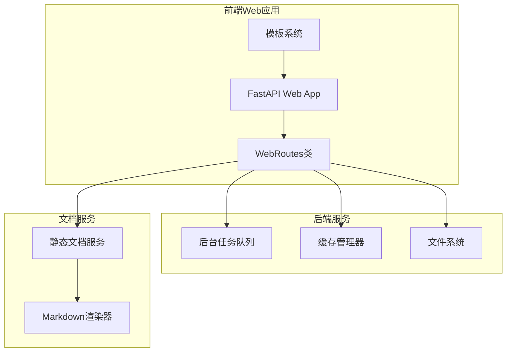
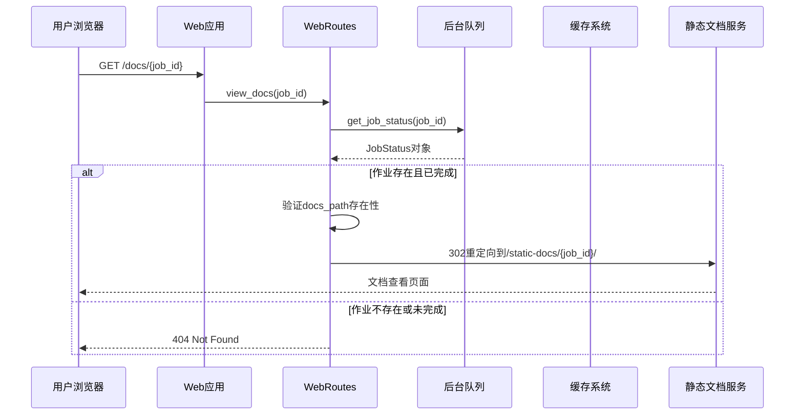
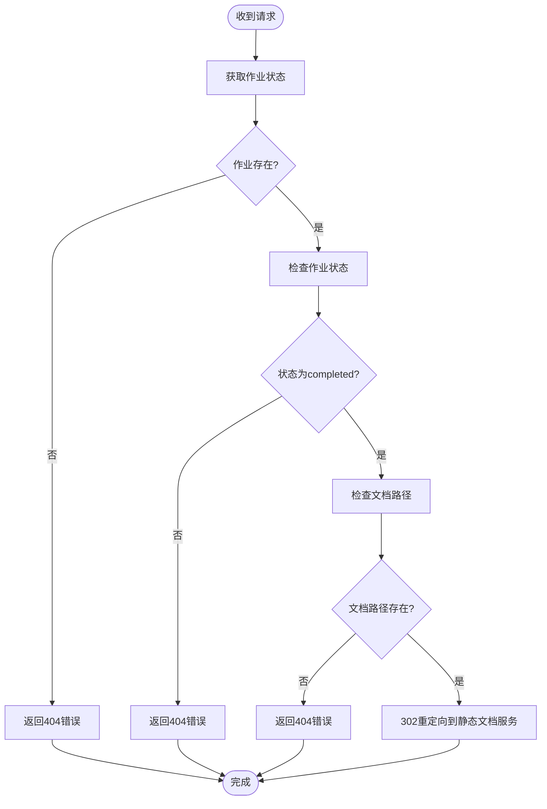
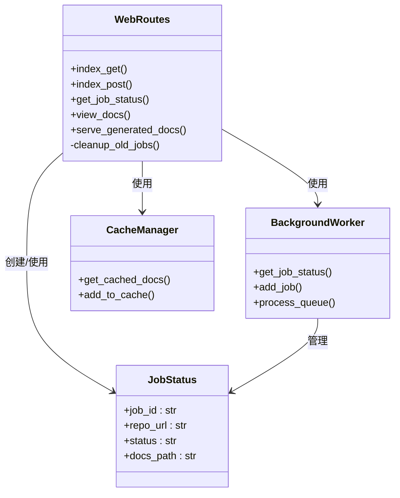

# 文档查看接口

<cite>
**本文档引用的文件**
- [web_app.py](file://codewiki/src/fe/web_app.py)
- [routes.py](file://codewiki/src/fe/routes.py)
- [models.py](file://codewiki/src/fe/models.py)
- [template_utils.py](file://codewiki/src/fe/template_utils.py)
- [visualise_docs.py](file://codewiki/src/fe/visualise_docs.py)
- [config.py](file://codewiki/src/fe/config.py)
</cite>

## 目录
1. [简介](#简介)
2. [项目结构](#项目结构)
3. [核心组件](#核心组件)
4. [架构概览](#架构概览)
5. [详细组件分析](#详细组件分析)
6. [依赖关系分析](#依赖关系分析)
7. [性能考虑](#性能考虑)
8. [故障排除指南](#故障排除指南)
9. [结论](#结论)

## 简介

本文档详细说明了 `/docs/{job_id}` 端点的API规范。该端点是一个重定向服务，用于将用户从作业状态页面引导到已生成文档的查看页面。该端点的核心职责是验证作业ID的有效性、检查文档生成状态，并在满足条件时返回302重定向到 `/static-docs/{job_id}/` 端点。

## 项目结构

CodeWiki项目采用前后端分离的架构设计，主要包含以下关键组件：



**图表来源**
- [web_app.py](file://codewiki/src/fe/web_app.py#L24-L42)
- [routes.py](file://codewiki/src/fe/routes.py#L24-L29)

**章节来源**
- [web_app.py](file://codewiki/src/fe/web_app.py#L1-L165)
- [routes.py](file://codewiki/src/fe/routes.py#L1-L299)

## 核心组件

### WebRoutes类

WebRoutes类是整个Web应用的核心控制器，负责处理所有HTTP请求并协调各个组件之间的交互。该类包含以下关键方法：

- `index_get()`: 处理主页面请求
- `index_post()`: 处理仓库提交表单
- `get_job_status()`: 提供作业状态API
- `view_docs()`: 处理文档查看请求（本API）
- `serve_generated_docs()`: 提供文档内容服务

### 作业状态管理

作业状态通过JobStatus数据类进行管理，包含以下关键字段：
- `job_id`: 作业唯一标识符
- `repo_url`: 仓库URL
- `status`: 作业状态（queued, processing, completed, failed）
- `docs_path`: 文档生成路径
- `created_at`: 创建时间
- `completed_at`: 完成时间

**章节来源**
- [routes.py](file://codewiki/src/fe/routes.py#L24-L299)
- [models.py](file://codewiki/src/fe/models.py#L31-L44)

## 架构概览

文档查看接口在整个系统中的位置如下：



**图表来源**
- [web_app.py](file://codewiki/src/fe/web_app.py#L63-L66)
- [routes.py](file://codewiki/src/fe/routes.py#L163-L177)

## 详细组件分析

### /docs/{job_id} 端点实现

#### 功能概述

`/docs/{job_id}` 端点是一个专门的重定向服务，其主要功能包括：

1. **作业ID验证**: 检查指定的作业ID是否存在
2. **状态检查**: 确认作业状态为"completed"
3. **文档路径验证**: 确保文档文件夹存在
4. **重定向服务**: 将用户重定向到文档查看页面

#### 请求处理流程



**图表来源**
- [routes.py](file://codewiki/src/fe/routes.py#L163-L177)

#### 错误处理机制

该端点实现了严格的错误处理策略：

| 错误场景 | HTTP状态码 | 错误详情 | 触发条件 |
|---------|-----------|---------|---------|
| 作业不存在 | 404 | "Job not found" | `background_worker.get_job_status(job_id)` 返回None |
| 文档不可用 | 404 | "Documentation not available" | 作业状态不是"completed"或没有docs_path |
| 文件不存在 | 404 | "Documentation files not found" | docs_path目录不存在或无法访问 |

#### 与静态文档服务的协作

该端点本身不提供文档内容，而是作为中介服务引导用户到静态文档服务：

```mermaid
graph LR
ViewDocs[/docs/{job_id}] --> Redirect[302重定向]
Redirect --> StaticDocs[/static-docs/{job_id}/]
StaticDocs --> ServeDocs[serve_generated_docs]
ServeDocs --> ViewPage[文档查看页面]
```

**图表来源**
- [routes.py](file://codewiki/src/fe/routes.py#L163-L177)
- [routes.py](file://codewiki/src/fe/routes.py#L179-L268)

**章节来源**
- [routes.py](file://codewiki/src/fe/routes.py#L163-L177)

### 典型工作流程示例

#### 从作业状态页跳转到文档查看页

1. **用户在作业列表中点击"View Documentation"按钮**
   - 模板中生成的链接格式：`/docs/{job_id}`
   - 参考：[template_utils.py](file://codewiki/src/fe/template_utils.py#L105-L108)

2. **Web应用接收请求并验证作业状态**
   - 调用 `WebRoutes.view_docs()` 方法
   - 验证作业ID、状态和文档路径

3. **成功时的重定向过程**
   - 返回302状态码
   - Location头设置为 `/static-docs/{job_id}/`
   - 用户被自动重定向到文档查看页面

4. **文档查看页面的加载**
   - 静态文档服务处理 `/static-docs/{job_id}/overview.md` 请求
   - 加载并渲染文档内容
   - 显示导航菜单和文档内容

**章节来源**
- [template_utils.py](file://codewiki/src/fe/template_utils.py#L82-L114)
- [web_app.py](file://codewiki/src/fe/web_app.py#L63-L75)

## 依赖关系分析

### 组件耦合度



**图表来源**
- [routes.py](file://codewiki/src/fe/routes.py#L24-L299)
- [background_worker.py](file://codewiki/src/fe/background_worker.py#L28-L36)

### 外部依赖

该端点依赖于以下外部组件：

- **FastAPI框架**: 提供Web应用基础架构
- **Jinja2模板引擎**: 渲染HTML页面
- **Pathlib模块**: 处理文件系统路径
- **HTTPException**: 处理HTTP错误响应

**章节来源**
- [web_app.py](file://codewiki/src/fe/web_app.py#L13-L22)
- [routes.py](file://codewiki/src/fe/routes.py#L1-L23)

## 性能考虑

### 缓存策略

- **作业状态缓存**: 通过 `BackgroundWorker.job_status` 字典缓存最近的作业状态
- **文档缓存**: 通过 `CacheManager` 管理生成的文档缓存
- **文件系统访问**: 最小化文件系统I/O操作，仅在必要时检查路径存在性

### 并发处理

- **异步处理**: 所有Web端点都使用async/await模式
- **队列管理**: 后台任务队列支持并发处理多个文档生成任务
- **资源限制**: 通过 `WebAppConfig.QUEUE_SIZE` 控制最大并发数

## 故障排除指南

### 常见问题及解决方案

#### 问题1: 访问 `/docs/{job_id}` 返回404

**可能原因**:
1. 作业ID不存在
2. 作业仍在处理中
3. 文档生成失败
4. 文档文件夹不存在

**解决步骤**:
1. 验证作业ID是否正确
2. 检查作业状态: `GET /api/job/{job_id}`
3. 确认文档生成已完成
4. 验证 `docs_path` 是否存在

#### 问题2: 重定向循环

**可能原因**:
- 静态文档服务配置错误
- 浏览器缓存问题

**解决步骤**:
1. 检查 `/static-docs/{job_id}/` 路由配置
2. 清除浏览器缓存
3. 重新生成文档

#### 问题3: 权限错误

**可能原因**:
- 文档文件夹权限不足
- 路径解析错误

**解决步骤**:
1. 检查文档文件夹权限
2. 验证路径解析逻辑
3. 确认文件系统访问权限

**章节来源**
- [routes.py](file://codewiki/src/fe/routes.py#L163-L177)
- [config.py](file://codewiki/src/fe/config.py#L10-L51)

## 结论

`/docs/{job_id}` 端点作为CodeWiki系统中的重要中介服务，通过严格的验证机制确保用户只能访问已完成的文档。该端点的设计体现了以下特点：

1. **安全性**: 通过多层验证防止未授权访问
2. **可靠性**: 明确的错误处理和重定向机制
3. **可维护性**: 清晰的职责分离和模块化设计
4. **用户体验**: 无缝的从作业状态到文档查看的导航体验

该端点的成功实现为整个CodeWiki系统的文档展示功能奠定了坚实的基础，为用户提供了直观、可靠的文档浏览体验。