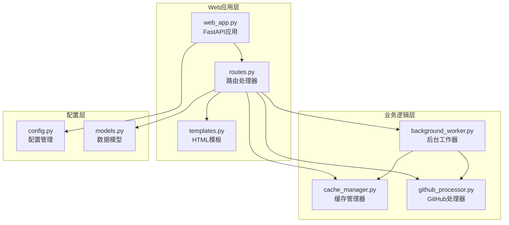
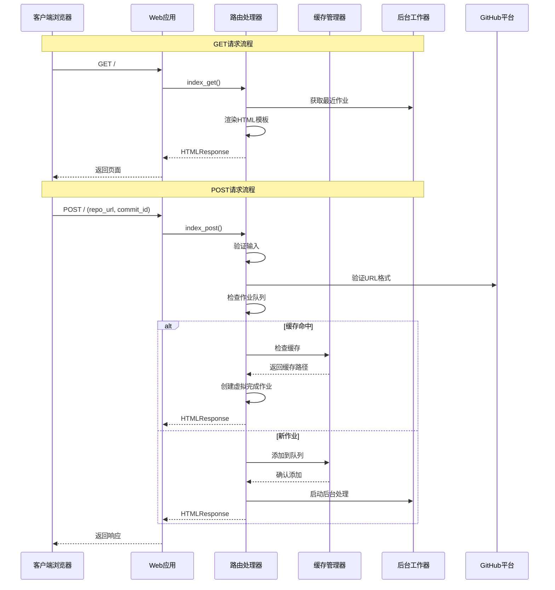
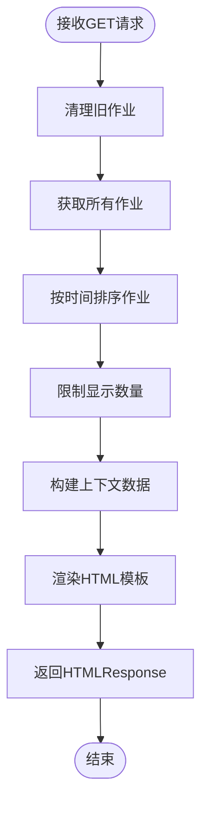
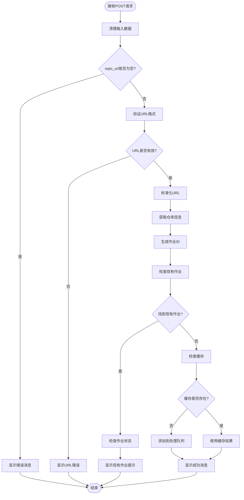
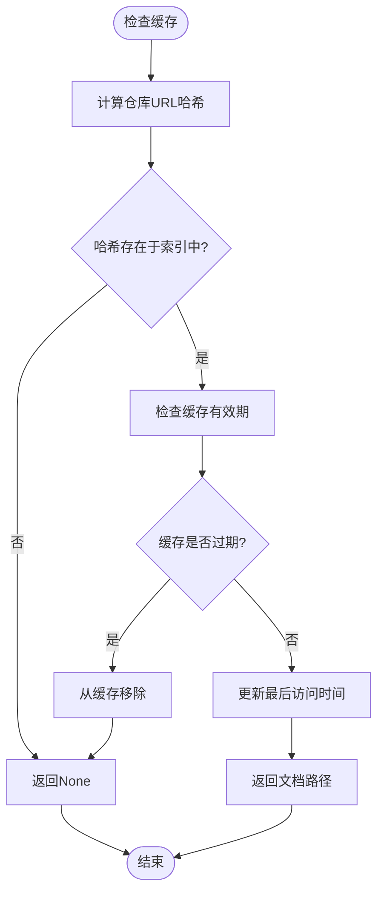
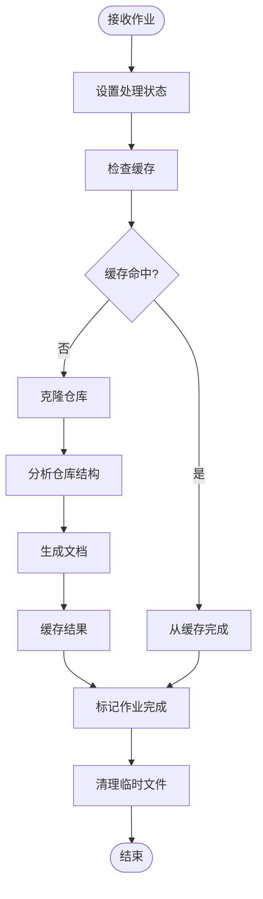
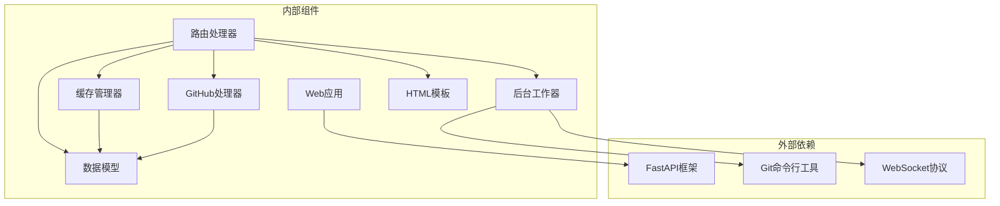

# 根路径接口

<cite>
**本文档引用的文件**
- [web_app.py](file://codewiki/src/fe/web_app.py)
- [routes.py](file://codewiki/src/fe/routes.py)
- [cache_manager.py](file://codewiki/src/fe/cache_manager.py)
- [background_worker.py](file://codewiki/src/fe/background_worker.py)
- [github_processor.py](file://codewiki/src/fe/github_processor.py)
- [models.py](file://codewiki/src/fe/models.py)
- [config.py](file://codewiki/src/fe/config.py)
- [templates.py](file://codewiki/src/fe/templates.py)
</cite>

## 目录
1. [简介](#简介)
2. [项目结构](#项目结构)
3. [核心组件](#核心组件)
4. [架构概览](#架构概览)
5. [详细组件分析](#详细组件分析)
6. [依赖关系分析](#依赖关系分析)
7. [性能考虑](#性能考虑)
8. [故障排除指南](#故障排除指南)
9. [结论](#结论)

## 简介

根路径接口是CodeWiki Web应用程序的核心入口点，提供了一个简洁的Web界面用于提交GitHub仓库进行文档生成。该接口支持两种HTTP方法：GET用于显示包含表单的HTML页面，POST用于处理用户提交的仓库URL和可选的commit ID。

## 项目结构

CodeWiki采用模块化架构设计，根路径接口位于前端服务层中，主要包含以下关键组件：

**图表来源**
- [web_app.py](file://codewiki/src/fe/web_app.py#L24-L55)
- [routes.py](file://codewiki/src/fe/routes.py#L25-L31)

**章节来源**
- [web_app.py](file://codewiki/src/fe/web_app.py#L1-L165)
- [routes.py](file://codewiki/src/fe/routes.py#L1-L299)

## 核心组件

### Web应用入口

Web应用通过FastAPI框架构建，根路径接口定义在web_app.py文件中：

- **应用初始化**：创建FastAPI实例，配置标题和描述
- **组件初始化**：初始化缓存管理器、后台工作器和路由处理器
- **路由注册**：注册根路径的GET和POST方法

### 路由处理器

WebRoutes类负责处理所有Web相关的路由请求：

- **index_get方法**：返回包含GitHub仓库URL输入表单的HTML页面
- **index_post方法**：处理用户提交的仓库URL和commit ID
- **作业状态管理**：管理文档生成作业的状态跟踪

**章节来源**
- [web_app.py](file://codewiki/src/fe/web_app.py#L44-L55)
- [routes.py](file://codewiki/src/fe/routes.py#L32-L153)

## 架构概览

根路径接口的完整处理流程如下：

**图表来源**
- [web_app.py](file://codewiki/src/fe/web_app.py#L44-L55)
- [routes.py](file://codewiki/src/fe/routes.py#L55-L153)
- [cache_manager.py](file://codewiki/src/fe/cache_manager.py#L65-L82)
- [background_worker.py](file://codewiki/src/fe/background_worker.py#L55-L58)

## 详细组件分析

### GET方法实现

GET方法用于显示主页面，包含以下功能：

#### 页面渲染流程

**图表来源**
- [routes.py](file://codewiki/src/fe/routes.py#L32-L53)

#### 表单字段说明

页面包含以下表单元素：
- **repo_url**：必填字段，用于输入Git仓库URL
- **commit_id**：可选字段，用于指定特定的commit哈希值
- **提交按钮**：触发POST请求

#### 最近作业展示

页面会显示最近处理的作业列表，每个作业项包含：
- 仓库URL
- 当前状态（queued/processing/completed/failed）
- 进度信息
- 操作按钮（查看文档）

**章节来源**
- [routes.py](file://codewiki/src/fe/routes.py#L32-L53)
- [templates.py](file://codewiki/src/fe/templates.py#L244-L271)

### POST方法实现

POST方法处理用户提交的仓库URL，包含完整的验证和处理流程：

#### 输入验证流程

**图表来源**
- [routes.py](file://codewiki/src/fe/routes.py#L55-L153)
- [github_processor.py](file://codewiki/src/fe/github_processor.py#L29-L54)

#### 请求参数规范

| 参数名 | 类型 | 必需 | 描述 | 示例 |
|--------|------|------|------|------|
| repo_url | string | 是 | Git仓库URL | `https://github.com/user/repo` |
| commit_id | string | 否 | 特定commit哈希值 | `a1b2c3d4e5f6...` |

#### 响应类型

- **响应类型**：HTMLResponse
- **内容**：重新渲染的HTML页面，包含操作结果消息
- **状态码**：200 OK

#### 错误处理机制

系统实现了多层次的错误处理：

1. **输入验证错误**：
   - 空URL：显示"请输入Git仓库URL"消息
   - 无效URL：显示"请输入有效的Git仓库URL"消息

2. **作业状态冲突**：
   - 正在处理的作业：显示"仓库正在被处理"消息
   - 最近失败的作业：显示"仓库最近处理失败，请稍后再试"消息

3. **系统错误**：
   - 队列添加失败：显示详细的错误信息和堆栈跟踪

**章节来源**
- [routes.py](file://codewiki/src/fe/routes.py#L66-L136)

### 缓存管理系统

缓存系统为已生成的文档提供快速访问：

#### 缓存查找流程

**图表来源**
- [cache_manager.py](file://codewiki/src/fe/cache_manager.py#L65-L82)

#### 缓存配置

- **缓存目录**：`./output/cache`
- **缓存有效期**：365天
- **缓存索引**：`cache_index.json`

**章节来源**
- [cache_manager.py](file://codewiki/src/fe/cache_manager.py#L16-L119)
- [config.py](file://codewiki/src/fe/config.py#L14-L22)

### 后台工作器

后台工作器负责实际的文档生成任务：

#### 工作流程

**图表来源**
- [background_worker.py](file://codewiki/src/fe/background_worker.py#L182-L287)

#### 作业状态管理

作业状态包括：
- **queued**：等待处理
- **processing**：正在处理
- **completed**：处理完成
- **failed**：处理失败

**章节来源**
- [background_worker.py](file://codewiki/src/fe/background_worker.py#L26-L294)

## 依赖关系分析

根路径接口涉及多个组件之间的复杂交互：

**图表来源**
- [web_app.py](file://codewiki/src/fe/web_app.py#L13-L21)
- [routes.py](file://codewiki/src/fe/routes.py#L12-L22)

### 组件耦合度

- **低耦合设计**：各组件职责明确，通过清晰的接口交互
- **依赖注入**：通过构造函数传递依赖，便于测试和维护
- **异步处理**：使用异步模式处理后台任务，避免阻塞主线程

**章节来源**
- [web_app.py](file://codewiki/src/fe/web_app.py#L30-L41)
- [routes.py](file://codewiki/src/fe/routes.py#L28-L31)

## 性能考虑

### 缓存策略

- **哈希索引**：使用SHA256哈希快速定位缓存条目
- **定期清理**：自动清理过期缓存，控制存储空间
- **并发安全**：缓存索引文件采用原子写入，确保数据一致性

### 队列管理

- **队列大小**：最大100个并发作业
- **超时控制**：Git克隆操作设置超时时间
- **资源清理**：自动清理临时文件和目录

### 前端优化

- **WebSocket连接**：实时进度更新，提升用户体验
- **客户端缓存**：浏览器缓存静态资源
- **渐进式加载**：分步加载文档内容

## 故障排除指南

### 常见问题及解决方案

#### URL验证失败

**症状**：提交无效的仓库URL时显示错误消息

**原因分析**：
- URL格式不正确
- 不支持的Git托管平台
- 网络连接问题

**解决步骤**：
1. 确认URL以`https://`或SSH格式开头
2. 验证仓库存在且可公开访问
3. 检查网络连接和防火墙设置

#### 作业处理失败

**症状**：作业状态变为failed

**排查步骤**：
1. 查看作业错误消息
2. 检查Git仓库访问权限
3. 验证仓库大小和复杂度
4. 检查系统资源使用情况

#### 缓存问题

**症状**：缓存未生效或显示过期内容

**解决方法**：
1. 清理缓存目录
2. 检查缓存索引文件完整性
3. 验证缓存有效期设置

**章节来源**
- [routes.py](file://codewiki/src/fe/routes.py#L133-L136)
- [cache_manager.py](file://codewiki/src/fe/cache_manager.py#L106-L119)

## 结论

根路径接口作为CodeWiki Web应用的核心入口，提供了完整的仓库文档生成功能。通过精心设计的架构和完善的错误处理机制，该接口能够稳定地处理各种用户请求，并提供良好的用户体验。

主要特点包括：
- **简洁的用户界面**：直观的表单设计和实时进度反馈
- **强大的后台处理**：异步作业管理和缓存优化
- **健壮的错误处理**：多层次的验证和异常处理机制
- **可扩展的架构**：模块化设计便于功能扩展和维护

该接口为开发者提供了一个可靠的工具，能够快速生成高质量的代码库文档，显著提升代码理解和协作效率。