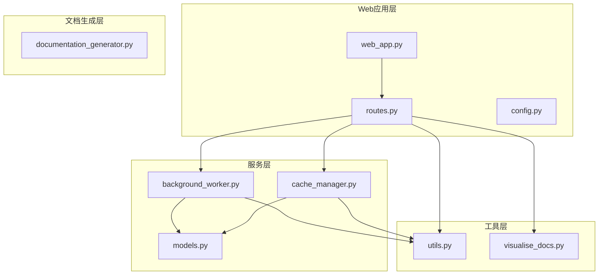
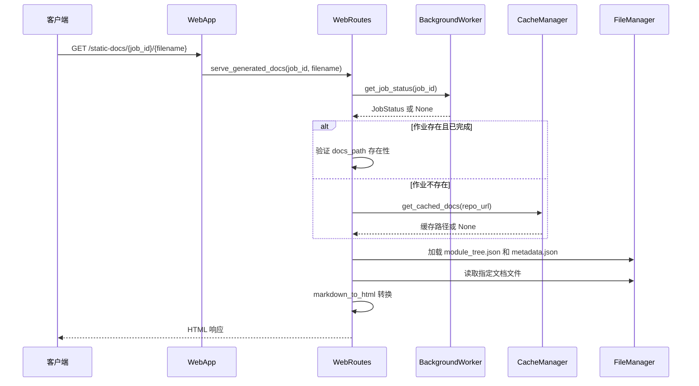
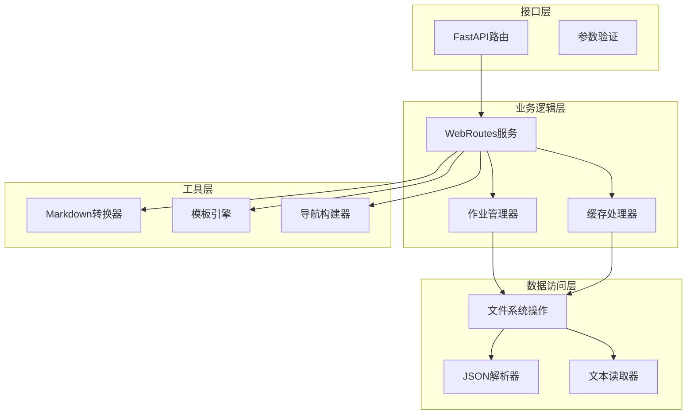
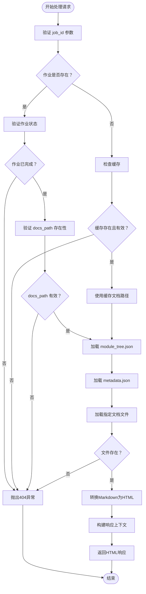
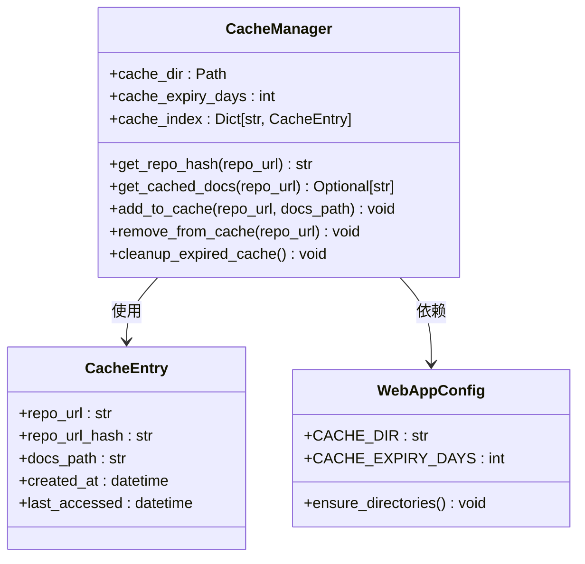
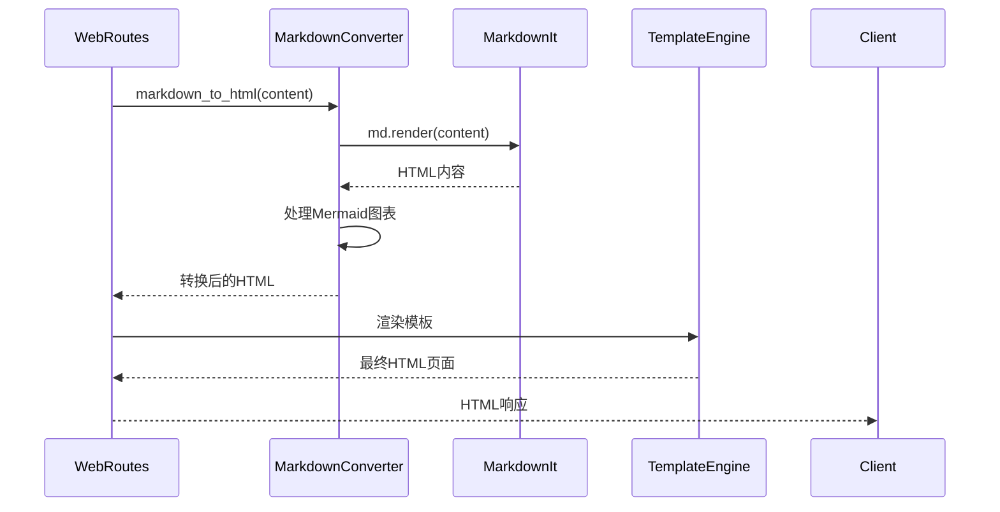
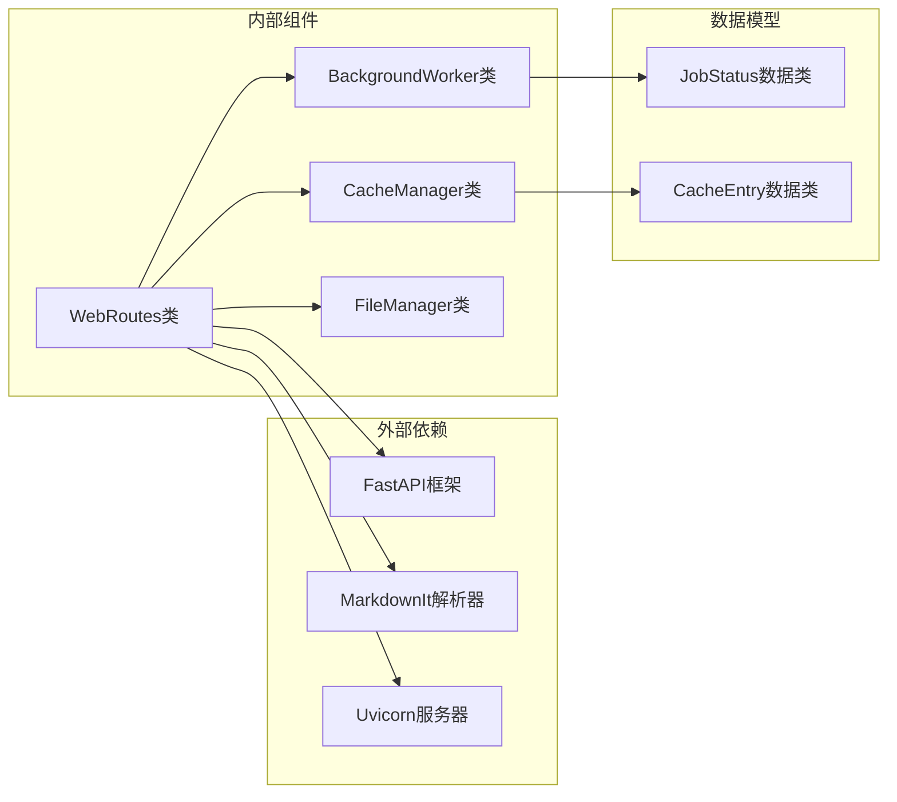

# 静态文档服务接口

<cite>
**本文档引用的文件**
- [web_app.py](file://codewiki/src/fe/web_app.py)
- [routes.py](file://codewiki/src/fe/routes.py)
- [background_worker.py](file://codewiki/src/fe/background_worker.py)
- [cache_manager.py](file://codewiki/src/fe/cache_manager.py)
- [visualise_docs.py](file://codewiki/src/fe/visualise_docs.py)
- [models.py](file://codewiki/src/fe/models.py)
- [config.py](file://codewiki/src/fe/config.py)
- [utils.py](file://codewiki/src/utils.py)
</cite>

## 目录
1. [简介](#简介)
2. [项目结构](#项目结构)
3. [核心组件](#核心组件)
4. [架构概览](#架构概览)
5. [详细组件分析](#详细组件分析)
6. [依赖关系分析](#依赖关系分析)
7. [性能考虑](#性能考虑)
8. [故障排除指南](#故障排除指南)
9. [结论](#结论)

## 简介

`/static-docs/{job_id}/{filename:path}` 是 CodeWiki 项目中的一个关键内容服务端点，专门用于提供生成的文档文件。该端点支持多种文档格式（如 Markdown、HTML、JSON 等），通过智能的作业状态管理和缓存机制，为用户提供高效的文档浏览体验。

该接口的核心功能包括：
- 从后台工作器或缓存管理器检索作业信息
- 验证文档文件的存在性
- 将 Markdown 内容转换为 HTML 响应
- 加载 `module_tree.json` 和 `metadata.json` 构建导航和上下文
- 提供灵活的路径参数配置

## 项目结构

CodeWiki 采用模块化的架构设计，静态文档服务位于前端服务层，与后端文档生成逻辑分离：

**图表来源**
- [web_app.py](file://codewiki/src/fe/web_app.py#L24-L42)
- [routes.py](file://codewiki/src/fe/routes.py#L179-L269)
- [background_worker.py](file://codewiki/src/fe/background_worker.py#L26-L37)
- [cache_manager.py](file://codewiki/src/fe/cache_manager.py#L16-L25)

**章节来源**
- [web_app.py](file://codewiki/src/fe/web_app.py#L24-L42)
- [config.py](file://codewiki/src/fe/config.py#L10-L51)

## 核心组件

### 路由定义与端点注册

Web 应用在启动时注册了静态文档服务端点：

**图表来源**
- [web_app.py](file://codewiki/src/fe/web_app.py#L69-L75)
- [routes.py](file://codewiki/src/fe/routes.py#L179-L269)

### 作业状态管理

作业状态通过 `JobStatus` 数据类进行管理，包含完整的生命周期信息：

| 字段名 | 类型 | 描述 | 默认值 |
|--------|------|------|--------|
| job_id | str | 作业唯一标识符 | 必填 |
| repo_url | str | 仓库URL | 必填 |
| status | str | 作业状态：queued/processing/completed/failed | 必填 |
| created_at | datetime | 创建时间 | 必填 |
| started_at | Optional[datetime] | 开始时间 | None |
| completed_at | Optional[datetime] | 完成时间 | None |
| error_message | Optional[str] | 错误信息 | None |
| progress | str | 进度描述 | "" |
| docs_path | Optional[str] | 文档输出路径 | None |
| main_model | Optional[str] | 主要模型 | None |
| commit_id | Optional[str] | 提交ID | None |

**章节来源**
- [models.py](file://codewiki/src/fe/models.py#L32-L46)

## 架构概览

静态文档服务采用分层架构设计，确保了良好的可维护性和扩展性：

**图表来源**
- [routes.py](file://codewiki/src/fe/routes.py#L179-L269)
- [background_worker.py](file://codewiki/src/fe/background_worker.py#L60-L66)
- [cache_manager.py](file://codewiki/src/fe/cache_manager.py#L65-L82)

## 详细组件分析

### WebRoutes.serve_generated_docs 方法

这是静态文档服务的核心实现，负责处理所有文档请求：

#### 参数处理流程

**图表来源**
- [routes.py](file://codewiki/src/fe/routes.py#L179-L269)

#### 错误处理策略

| 错误类型 | HTTP状态码 | 触发条件 | 处理方式 |
|----------|------------|----------|----------|
| 作业不存在 | 404 | `background_worker.get_job_status(job_id)` 返回 None | 抛出 HTTPException |
| 作业未完成 | 404 | 作业状态不是 'completed' | 抛出 HTTPException |
| 文档路径无效 | 404 | `docs_path` 不存在或为空 | 抛出 HTTPException |
| 文件不存在 | 404 | 指定文件在文档目录中不存在 | 抛出 HTTPException |
| 服务器内部错误 | 500 | 文件读取或转换过程中的异常 | 抛出 HTTPException |

**章节来源**
- [routes.py](file://codewiki/src/fe/routes.py#L179-L269)

### 缓存管理机制

缓存系统提供了高效的文档存储和检索能力：

**图表来源**
- [cache_manager.py](file://codewiki/src/fe/cache_manager.py#L16-L119)
- [models.py](file://codewiki/src/fe/models.py#L48-L56)
- [config.py](file://codewiki/src/fe/config.py#L10-L51)

#### 缓存策略

缓存系统采用基于哈希的索引机制，支持自动过期清理：

1. **哈希生成**：使用 SHA-256 对仓库URL生成16位十六进制哈希
2. **过期检查**：默认缓存有效期为365天
3. **自动清理**：定期清理过期缓存条目
4. **最后访问更新**：每次访问都会更新最后访问时间

**章节来源**
- [cache_manager.py](file://codewiki/src/fe/cache_manager.py#L61-L82)

### Markdown到HTML转换

文档服务复用了 `visualise_docs.py` 中的转换工具：

#### 转换流程

**图表来源**
- [routes.py](file://codewiki/src/fe/routes.py#L248-L253)
- [visualise_docs.py](file://codewiki/src/fe/visualise_docs.py#L68-L90)

#### 支持的特性

| 特性 | 描述 | 实现方式 |
|------|------|----------|
| 标准Markdown | 支持标题、列表、链接等 | 使用 MarkdownIt 解析器 |
| Mermaid图表 | 支持流程图、序列图等 | 自动检测和转换代码块 |
| 代码高亮 | 支持语法高亮 | MarkdownIt 内置支持 |
| 导航生成 | 基于 module_tree.json | 动态构建导航菜单 |

**章节来源**
- [visualise_docs.py](file://codewiki/src/fe/visualise_docs.py#L68-L104)

## 依赖关系分析

静态文档服务的依赖关系相对简洁，主要依赖于以下核心组件：

**图表来源**
- [web_app.py](file://codewiki/src/fe/web_app.py#L13-L22)
- [routes.py](file://codewiki/src/fe/routes.py#L179-L269)

### 关键依赖说明

1. **FastAPI 框架**：提供异步路由处理和HTTP响应管理
2. **MarkdownIt 解析器**：负责Markdown到HTML的转换
3. **文件管理系统**：封装所有文件I/O操作
4. **数据模型**：定义作业状态和缓存条目的结构

**章节来源**
- [web_app.py](file://codewiki/src/fe/web_app.py#L13-L22)
- [utils.py](file://codewiki/src/utils.py#L10-L46)

## 性能考虑

### 缓存优化

- **内存缓存**：作业状态和缓存条目在内存中维护，减少磁盘I/O
- **哈希索引**：使用哈希快速定位缓存条目
- **自动过期**：防止缓存无限增长

### 文件操作优化

- **延迟加载**：仅在需要时才加载 module_tree.json 和 metadata.json
- **异常容错**：即使某些文件缺失，系统仍能正常工作
- **安全检查**：防止目录遍历攻击

### 并发处理

- **异步处理**：使用FastAPI的异步特性提高并发性能
- **线程安全**：后台工作器使用线程安全的数据结构

## 故障排除指南

### 常见问题及解决方案

#### 1. 404 错误排查

**可能原因**：
- 作业ID不存在或已过期
- 文档生成尚未完成
- 指定的文件名不存在

**解决步骤**：
1. 验证作业ID是否正确
2. 检查作业状态是否为 'completed'
3. 确认文件路径是否正确
4. 查看后台日志了解具体错误

#### 2. 500 错误排查

**可能原因**：
- 文件读取权限问题
- Markdown转换异常
- 模板渲染失败

**解决步骤**：
1. 检查文件权限设置
2. 验证文件编码格式
3. 查看详细的错误堆栈信息
4. 确认依赖包版本兼容性

#### 3. 缓存相关问题

**症状**：文档显示过期或不完整

**解决方案**：
1. 清理过期缓存：调用 `cleanup_expired_cache()`
2. 手动移除特定缓存：使用 `remove_from_cache()`
3. 调整缓存过期时间：修改 `CACHE_EXPIRY_DAYS`

**章节来源**
- [routes.py](file://codewiki/src/fe/routes.py#L179-L269)
- [cache_manager.py](file://codewiki/src/fe/cache_manager.py#L106-L119)

### 调试技巧

1. **启用调试模式**：启动时添加 `--debug` 参数
2. **查看日志**：检查后台工作器的日志输出
3. **验证文件结构**：确认文档目录包含必需的JSON文件
4. **测试连接**：使用简单的HTTP客户端测试端点

## 结论

`/static-docs/{job_id}/{filename:path}` 端点是 CodeWiki 项目中一个设计精良的内容服务接口。它通过以下关键特性实现了高效、可靠的文档服务：

### 核心优势

1. **智能作业管理**：结合后台工作器和缓存系统，提供灵活的文档检索机制
2. **强大的转换能力**：复用成熟的 Markdown 到 HTML 转换工具，支持丰富的文档格式
3. **健壮的错误处理**：完善的异常处理策略，确保服务稳定性
4. **优秀的性能表现**：缓存机制和异步处理提升整体响应速度

### 技术亮点

- **模块化设计**：清晰的分层架构便于维护和扩展
- **安全性考虑**：防止目录遍历攻击和恶意文件访问
- **容错机制**：即使部分文件缺失也能正常工作
- **监控友好**：完整的日志记录和状态跟踪

该接口为用户提供了流畅的文档浏览体验，同时为开发者提供了清晰的扩展接口，是 CodeWiki 项目的重要组成部分。