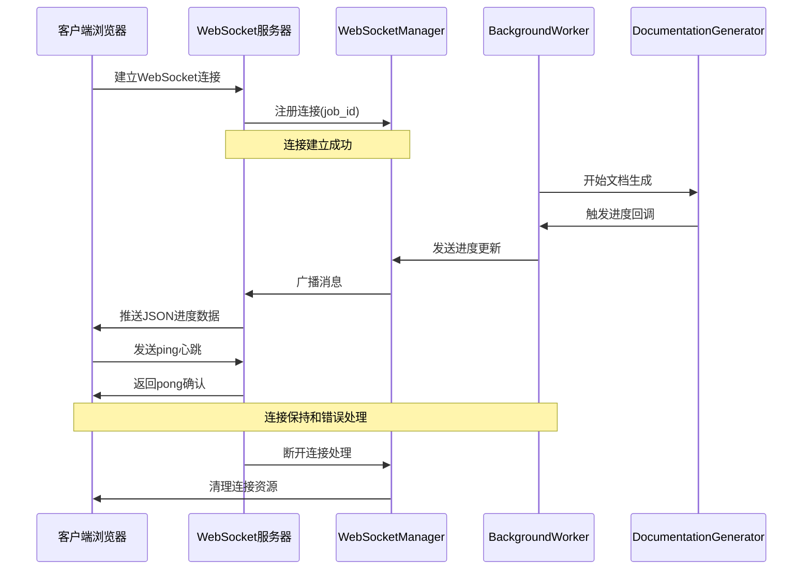
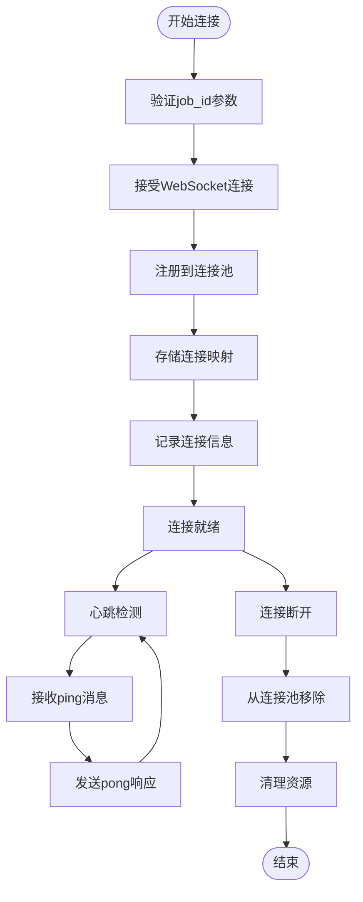
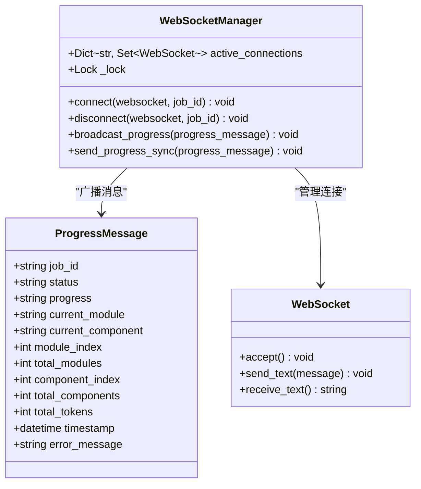
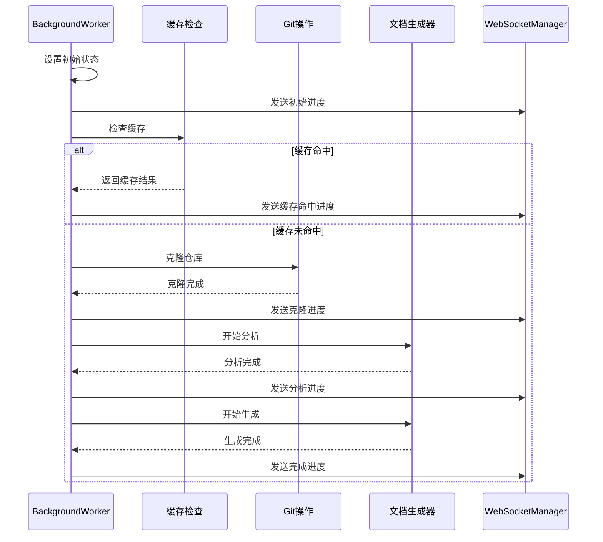
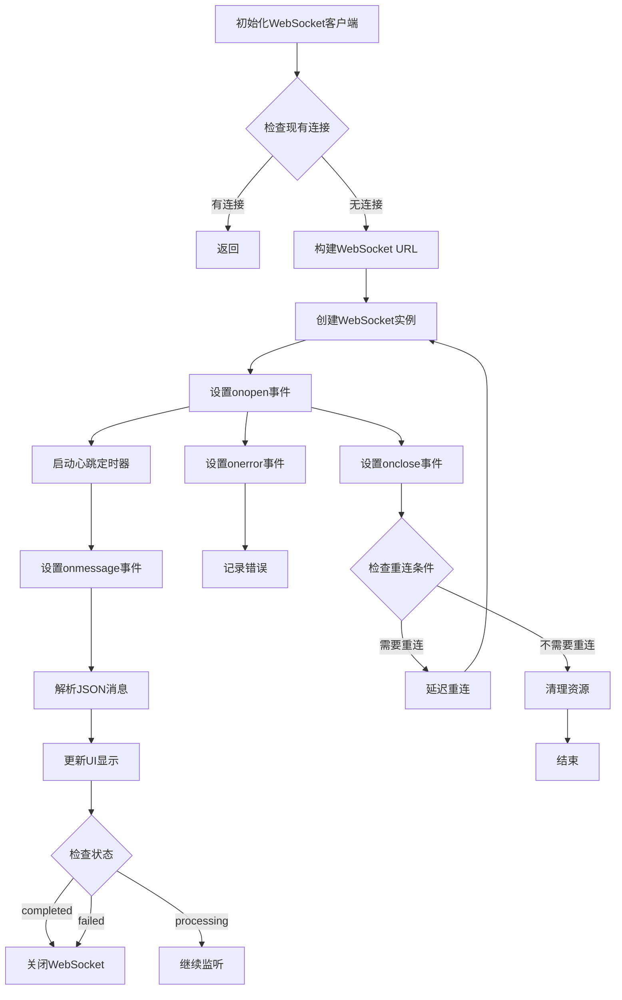
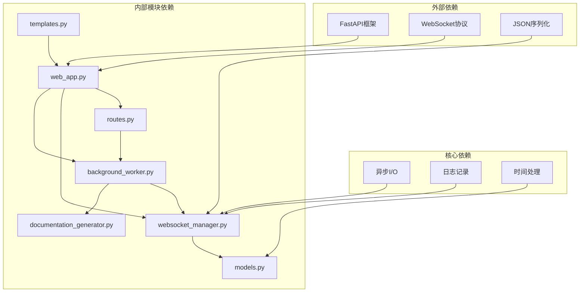

# WebSocket实时进度

<cite>
**本文档引用的文件**
- [websocket_manager.py](file://codewiki/src/fe/websocket_manager.py)
- [background_worker.py](file://codewiki/src/fe/background_worker.py)
- [models.py](file://codewiki/src/fe/models.py)
- [web_app.py](file://codewiki/src/fe/web_app.py)
- [routes.py](file://codewiki/src/fe/routes.py)
- [documentation_generator.py](file://codewiki/src/be/documentation_generator.py)
- [templates.py](file://codewiki/src/fe/templates.py)
</cite>

## 目录
1. [简介](#简介)
2. [项目结构](#项目结构)
3. [核心组件](#核心组件)
4. [架构概览](#架构概览)
5. [详细组件分析](#详细组件分析)
6. [依赖关系分析](#依赖关系分析)
7. [性能考虑](#性能考虑)
8. [故障排除指南](#故障排除指南)
9. [结论](#结论)

## 简介

WebSocket实时进度功能是CodeWiki项目中一个关键的用户体验特性，它允许用户实时跟踪文档生成任务的进度。该功能通过WebSocket连接提供双向通信，使后端能够向客户端推送实时状态更新，包括任务状态、进度百分比、当前处理模块等详细信息。

该系统的核心价值在于：
- 提供实时的用户体验反馈
- 支持长时间运行的任务监控
- 实现优雅的连接管理和错误恢复
- 展示详细的处理过程和统计信息

## 项目结构

WebSocket实时进度功能涉及以下关键文件和模块：

```mermaid
graph TB
subgraph "WebSocket层"
WSManager[WebSocketManager<br/>连接管理]
WSRoute[WebSocket路由<br/>/ws/progress/{job_id}]
end
subgraph "业务逻辑层"
BGWorker[BackgroundWorker<br/>后台工作器]
DocGen[DocumentationGenerator<br/>文档生成器]
end
subgraph "数据模型层"
PM[ProgressMessage<br/>进度消息模型]
JS[JobStatus<br/>作业状态模型]
end
subgraph "前端界面层"
Templates[前端模板<br/>JavaScript WebSocket客户端]
Routes[WebRoutes<br/>HTTP路由]
end
WSRoute --> WSManager
BGWorker --> WSManager
DocGen --> BGWorker
WSManager --> PM
Routes --> BGWorker
Templates --> WSRoute
```

**图表来源**
- [websocket_manager.py](file://codewiki/src/fe/websocket_manager.py#L18-L99)
- [web_app.py](file://codewiki/src/fe/web_app.py#L78-L92)
- [background_worker.py](file://codewiki/src/fe/background_worker.py#L26-L294)
- [models.py](file://codewiki/src/fe/models.py#L58-L71)

**章节来源**
- [websocket_manager.py](file://codewiki/src/fe/websocket_manager.py#L1-L100)
- [web_app.py](file://codewiki/src/fe/web_app.py#L1-L165)

## 核心组件

### WebSocketManager类

WebSocketManager是整个实时进度系统的核心组件，负责管理WebSocket连接池和广播消息。

**主要职责：**
- 维护按job_id分组的活动连接集合
- 处理新连接的建立和断开
- 广播进度更新到所有相关客户端
- 实现线程安全的连接管理

**关键特性：**
- 基于job_id的连接分组管理
- 异步锁保护的并发访问
- 自动清理断开的连接
- 同步和异步两种广播模式

**章节来源**
- [websocket_manager.py](file://codewiki/src/fe/websocket_manager.py#L18-L99)

### ProgressMessage数据模型

ProgressMessage是WebSocket传输的数据结构，定义了进度更新的标准格式。

**字段定义：**
- `job_id`: 作业标识符
- `status`: 当前状态（queued、processing、completed、failed）
- `progress`: 进度描述文本
- `current_module`: 当前处理的模块名称
- `current_component`: 当前处理的组件名称
- `module_index`: 当前模块索引
- `total_modules`: 总模块数
- `component_index`: 当前组件索引
- `total_components`: 总组件数
- `total_tokens`: 总令牌使用量
- `timestamp`: 时间戳
- `error_message`: 错误信息（可选）

**章节来源**
- [models.py](file://codewiki/src/fe/models.py#L58-L71)

### BackgroundWorker进度发送机制

BackgroundWorker实现了进度更新的触发逻辑，确保在关键处理阶段及时通知客户端。

**触发时机：**
- 作业开始处理时
- 缓存命中时
- 克隆仓库时
- 分析阶段时
- 文档生成时
- 作业完成或失败时

**章节来源**
- [background_worker.py](file://codewiki/src/fe/background_worker.py#L167-L181)

## 架构概览

WebSocket实时进度系统的整体架构采用分层设计，确保了清晰的关注点分离和良好的可维护性。



**图表来源**
- [web_app.py](file://codewiki/src/fe/web_app.py#L78-L92)
- [websocket_manager.py](file://codewiki/src/fe/websocket_manager.py#L26-L42)
- [background_worker.py](file://codewiki/src/fe/background_worker.py#L167-L181)

## 详细组件分析

### WebSocket连接建立流程

WebSocket连接的建立是一个精心设计的双向通信过程，确保了可靠的状态同步。



**图表来源**
- [web_app.py](file://codewiki/src/fe/web_app.py#L78-L92)
- [websocket_manager.py](file://codewiki/src/fe/websocket_manager.py#L26-L42)

**章节来源**
- [web_app.py](file://codewiki/src/fe/web_app.py#L78-L92)

### 进度消息广播机制

WebSocketManager实现了高效的进度消息广播机制，支持多客户端同时接收。



**图表来源**
- [websocket_manager.py](file://codewiki/src/fe/websocket_manager.py#L18-L99)
- [models.py](file://codewiki/src/fe/models.py#L58-L71)

**章节来源**
- [websocket_manager.py](file://codewiki/src/fe/websocket_manager.py#L44-L78)

### 文档生成进度触发点

BackgroundWorker在文档生成的关键阶段触发进度更新，确保用户获得完整的过程反馈。



**图表来源**
- [background_worker.py](file://codewiki/src/fe/background_worker.py#L182-L287)
- [documentation_generator.py](file://codewiki/src/be/documentation_generator.py#L320-L382)

**章节来源**
- [background_worker.py](file://codewiki/src/fe/background_worker.py#L167-L181)

### 前端WebSocket客户端实现

前端JavaScript实现了完整的WebSocket客户端，包括连接管理、心跳检测和自动重连。



**图表来源**
- [templates.py](file://codewiki/src/fe/templates.py#L309-L366)

**章节来源**
- [templates.py](file://codewiki/src/fe/templates.py#L309-L438)

## 依赖关系分析

WebSocket实时进度功能的依赖关系体现了清晰的分层架构设计。



**图表来源**
- [web_app.py](file://codewiki/src/fe/web_app.py#L1-L165)
- [websocket_manager.py](file://codewiki/src/fe/websocket_manager.py#L1-L100)
- [background_worker.py](file://codewiki/src/fe/background_worker.py#L1-L294)

**章节来源**
- [web_app.py](file://codewiki/src/fe/web_app.py#L1-L165)
- [routes.py](file://codewiki/src/fe/routes.py#L1-L299)

## 性能考虑

WebSocket实时进度功能在设计时充分考虑了性能优化和资源管理。

### 连接池管理
- 使用字典存储按job_id分组的连接集合
- 异步锁确保并发访问的安全性
- 自动清理断开的连接，防止内存泄漏

### 消息广播优化
- 预序列化JSON消息，减少重复转换开销
- 连接副本用于迭代，避免修改期间的集合变更
- 异常处理中批量清理断开的连接

### 心跳机制
- 30秒间隔的心跳检测，平衡保活和网络开销
- 条件心跳：仅在连接打开时发送ping
- 自动重连机制，提高系统可靠性

### 内存管理
- 及时清理已完成作业的连接
- 页面卸载时主动关闭所有WebSocket连接
- 避免重复连接的连接池检查

## 故障排除指南

### 常见问题及解决方案

**连接无法建立**
- 检查WebSocket端点是否正确配置
- 验证job_id参数的有效性
- 确认服务器防火墙允许WebSocket连接

**进度消息不显示**
- 检查浏览器控制台是否有JavaScript错误
- 验证JSON消息格式是否正确
- 确认前端模板中的WebSocket URL构建

**连接频繁断开**
- 检查网络稳定性
- 验证心跳机制是否正常工作
- 查看服务器日志中的连接断开原因

**性能问题**
- 监控连接池大小和内存使用
- 检查消息广播的频率和负载
- 优化前端UI更新的性能

**章节来源**
- [templates.py](file://codewiki/src/fe/templates.py#L346-L365)
- [websocket_manager.py](file://codewiki/src/fe/websocket_manager.py#L62-L77)

### 调试技巧

1. **服务器端调试**
   - 启用详细的日志记录
   - 监控连接池状态变化
   - 检查异常处理路径

2. **客户端调试**
   - 使用浏览器开发者工具监控WebSocket通信
   - 检查心跳包的发送和接收
   - 验证UI更新逻辑的正确性

3. **网络层面调试**
   - 使用网络抓包工具分析WebSocket帧
   - 检查代理服务器对WebSocket的支持
   - 验证SSL/TLS证书的正确性

## 结论

WebSocket实时进度功能为CodeWiki项目提供了优秀的用户体验，通过精心设计的架构和实现，成功实现了以下目标：

**技术成就：**
- 实现了可靠的双向通信机制
- 提供了丰富的进度信息展示
- 建立了完善的连接管理和错误处理
- 支持大规模并发连接

**用户体验提升：**
- 实时反馈文档生成过程
- 详细的进度统计和可视化
- 优雅的连接断开和重连处理
- 轻松的用户交互体验

**架构优势：**
- 清晰的分层设计和职责分离
- 良好的扩展性和维护性
- 完善的错误处理和恢复机制
- 高效的性能优化策略

该系统不仅满足了当前的功能需求，还为未来的功能扩展奠定了坚实的基础。通过持续的优化和改进，WebSocket实时进度功能将继续为用户提供卓越的服务体验。