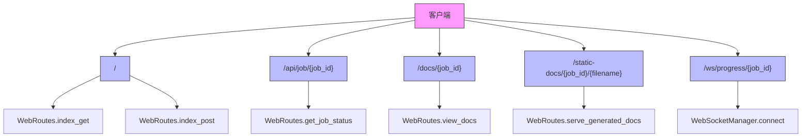
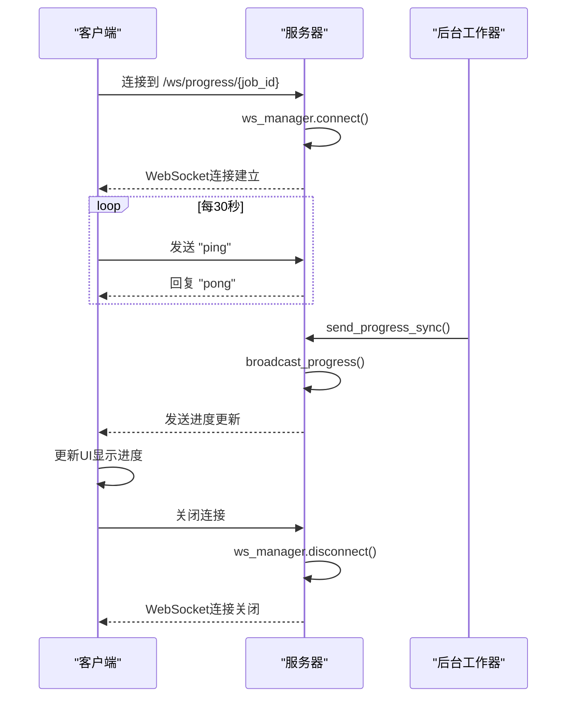
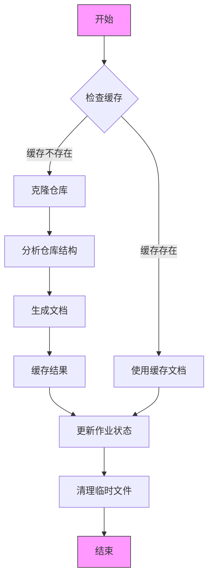
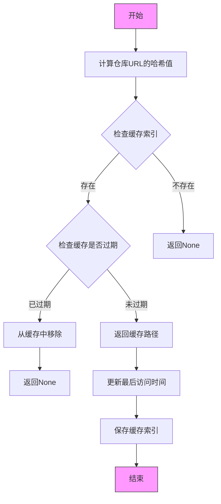

# Web服务使用

<cite>
**本文档中引用的文件**   
- [run_web_app.py](file://codewiki/run_web_app.py)
- [web_app.py](file://codewiki/src/fe/web_app.py)
- [routes.py](file://codewiki/src/fe/routes.py)
- [websocket_manager.py](file://codewiki/src/fe/websocket_manager.py)
- [background_worker.py](file://codewiki/src/fe/background_worker.py)
- [cache_manager.py](file://codewiki/src/fe/cache_manager.py)
- [models.py](file://codewiki/src/fe/models.py)
- [config.py](file://codewiki/src/fe/config.py)
- [github_processor.py](file://codewiki/src/fe/github_processor.py)
- [templates.py](file://codewiki/src/fe/templates.py)
- [Dockerfile](file://docker/Dockerfile)
- [docker-compose.yml](file://docker/docker-compose.yml)
</cite>

## 目录
1. [简介](#简介)
2. [启动Web应用](#启动web应用)
3. [Web界面功能](#web界面功能)
4. [FastAPI路由详解](#fastapi路由详解)
5. [WebSocket实时进度更新](#websocket实时进度更新)
6. [后台工作流程](#后台工作流程)
7. [缓存机制](#缓存机制)
8. [环境变量配置](#环境变量配置)
9. [完整工作流示例](#完整工作流示例)
10. [Docker部署](#docker部署)

## 简介
CodeWiki是一个开源框架，用于为GitHub仓库生成全面的文档。本Web服务提供了一个用户友好的界面，允许用户提交GitHub仓库URL，查看作业状态，并访问生成的文档。系统使用FastAPI构建Web服务，通过WebSocket提供实时进度更新，并使用后台工作队列处理文档生成任务。

**Section sources**
- [web_app.py](file://codewiki/src/fe/web_app.py#L1-L165)
- [README.md](file://README.md#L1-L289)

## 启动Web应用
可以通过两种方式启动CodeWiki Web应用：使用Python脚本或Docker容器。

### 使用Python脚本启动
通过`run_web_app.py`脚本可以直接启动Web应用：

```bash
python codewiki/run_web_app.py --host 127.0.0.1 --port 8000 --debug
```

该脚本会：
1. 将`src`目录添加到Python路径
2. 导入并执行`fe.web_app`模块的`main`函数
3. 启动FastAPI应用

`web_app.py`中的`main`函数支持以下命令行参数：
- `--host`: 服务器绑定的主机地址（默认：127.0.0.1）
- `--port`: 服务器运行的端口（默认：8000）
- `--debug`: 以调试模式运行服务器
- `--reload`: 启用自动重载（用于开发）

### 使用Docker启动
通过Docker可以更方便地部署和运行Web应用。

**使用Docker命令：**
```bash
# 构建镜像
docker build -t codewiki -f docker/Dockerfile .

# 运行容器
docker run -p 8000:8000 -v ./output:/app/output codewiki
```

**使用Docker Compose：**
```bash
docker-compose up --build
```

Docker部署会：
- 使用Python 3.12 slim基础镜像
- 安装必要的系统依赖（git, curl, nodejs, npm）
- 安装Python依赖
- 创建输出目录（cache, temp, docs）
- 暴露8000端口
- 设置健康检查
- 默认命令启动Web应用

**Section sources**
- [run_web_app.py](file://codewiki/run_web_app.py#L1-L16)
- [web_app.py](file://codewiki/src/fe/web_app.py#L94-L165)
- [Dockerfile](file://docker/Dockerfile#L1-L47)
- [docker-compose.yml](file://docker/docker-compose.yml#L1-L37)

## Web界面功能
Web界面提供了三个主要功能：提交GitHub仓库URL、查看作业状态和访问生成的文档。

### 提交GitHub仓库URL
用户可以在主页面的表单中输入GitHub仓库URL和可选的提交ID：

```html
<form method="POST" action="/">
    <div class="form-group">
        <label for="repo_url">Git Repository URL:</label>
        <input 
            type="url" 
            id="repo_url" 
            name="repo_url" 
            placeholder="https://github.com/owner/repo or https://gitlab.com/owner/repo"
            required
        >
    </div>
    
    <div class="form-group">
        <label for="commit_id">Commit ID (optional):</label>
        <input 
            type="text" 
            id="commit_id" 
            name="commit_id" 
            placeholder="Enter specific commit hash (defaults to latest)"
        >
    </div>
    
    <button type="submit" class="btn">Generate Documentation</button>
</form>
```

系统支持多种Git托管平台，包括：
- GitHub (github.com)
- GitLab (gitlab.com)
- Gitee (gitee.com)
- Bitbucket (bitbucket.org)
- Coding (coding.net)

### 查看作业状态
提交仓库后，用户可以在"Recent Jobs"部分查看最近的作业状态。每个作业显示以下信息：
- 仓库URL
- 作业状态（queued, processing, completed, failed）
- 当前进度描述
- 生成模型
- "View Documentation"按钮（作业完成后可用）

### 访问生成的文档
当文档生成完成后，用户可以点击"View Documentation"按钮访问生成的文档。文档查看器提供：
- 左侧导航栏，显示模块树结构
- 右侧内容区域，显示Markdown转换后的HTML
- 支持Mermaid图表渲染
- 响应式设计，适配移动设备

**Section sources**
- [templates.py](file://codewiki/src/fe/templates.py#L7-L862)
- [routes.py](file://codewiki/src/fe/routes.py#L32-L154)
- [web_app.py](file://codewiki/src/fe/web_app.py#L45-L54)

## FastAPI路由详解
Web应用使用FastAPI定义了多个路由来处理不同的请求。

### 主页面路由
```python
@app.get("/", response_class=HTMLResponse)
async def index_get(request: Request):
    """Main page with form for submitting GitHub repositories."""
    return await web_routes.index_get(request)

@app.post("/", response_class=HTMLResponse)
async def index_post(request: Request, repo_url: str = Form(...), commit_id: str = Form("")):
    """Handle repository submission."""
    return await web_routes.index_post(request, repo_url, commit_id)
```

`index_get`路由显示主页面，包含提交表单和最近作业列表。`index_post`路由处理表单提交，验证仓库URL，并将作业添加到处理队列。

### API路由
```python
@app.get("/api/job/{job_id}")
async def get_job_status(job_id: str):
    """API endpoint to get job status."""
    return await web_routes.get_job_status(job_id)
```

`get_job_status`路由提供了一个API端点，用于获取特定作业的状态。它返回一个`JobStatusResponse`对象，包含作业的详细信息。

### 文档查看路由
```python
@app.get("/docs/{job_id}")
async def view_docs(job_id: str):
    """View generated documentation."""
    return await web_routes.view_docs(job_id)

@app.get("/static-docs/{job_id}/")
@app.get("/static-docs/{job_id}/{filename:path}")
async def serve_generated_docs(job_id: str, filename: str = "overview.md"):
    """Serve generated documentation files."""
    return await web_routes.serve_generated_docs(job_id, filename)
```

`view_docs`路由将用户重定向到生成的文档。`serve_generated_docs`路由提供生成的文档文件，支持路径参数来访问不同文件。



**Diagram sources **
- [web_app.py](file://codewiki/src/fe/web_app.py#L45-L75)
- [routes.py](file://codewiki/src/fe/routes.py#L25-L299)

**Section sources**
- [web_app.py](file://codewiki/src/fe/web_app.py#L45-L75)
- [routes.py](file://codewiki/src/fe/routes.py#L25-L299)

## WebSocket实时进度更新
系统使用WebSocket提供实时进度更新，让用户能够看到文档生成的实时状态。

### WebSocket端点
```python
@app.websocket("/ws/progress/{job_id}")
async def websocket_progress(websocket: WebSocket, job_id: str):
    """WebSocket endpoint for real-time progress updates."""
    await ws_manager.connect(websocket, job_id)
    try:
        while True:
            data = await websocket.receive_text()
            if data == "ping":
                await websocket.send_text("pong")
    except WebSocketDisconnect:
        await ws_manager.disconnect(websocket, job_id)
```

### WebSocket管理器
`WebSocketManager`类负责管理WebSocket连接和广播进度更新：

```python
class WebSocketManager:
    """Manages WebSocket connections and broadcasts progress updates."""
    
    def __init__(self):
        self.active_connections: Dict[str, Set[WebSocket]] = {}
        self._lock = asyncio.Lock()
    
    async def connect(self, websocket: WebSocket, job_id: str):
        """Register a new WebSocket connection for a specific job."""
        await websocket.accept()
        async with self._lock:
            if job_id not in self.active_connections:
                self.active_connections[job_id] = set()
            self.active_connections[job_id].add(websocket)
    
    async def disconnect(self, websocket: WebSocket, job_id: str):
        """Remove a WebSocket connection."""
        async with self._lock:
            if job_id in self.active_connections:
                self.active_connections[job_id].discard(websocket)
                if not self.active_connections[job_id]:
                    del self.active_connections[job_id]
    
    async def broadcast_progress(self, progress_message: ProgressMessage):
        """Broadcast progress update to all connected clients for a job."""
        job_id = progress_message.job_id
        
        if job_id not in self.active_connections:
            return
            
        message_dict = progress_message.model_dump()
        message_dict['timestamp'] = message_dict['timestamp'].isoformat()
        message_json = json.dumps(message_dict)
        
        connections = list(self.active_connections.get(job_id, []))
        disconnected = []
        for connection in connections:
            try:
                await connection.send_text(message_json)
            except Exception as e:
                disconnected.append(connection)
        
        if disconnected:
            async with self._lock:
                if job_id in self.active_connections:
                    for conn in disconnected:
                        self.active_connections[job_id].discard(conn)
                    if not self.active_connections[job_id]:
                        del self.active_connections[job_id]
```

### 前端WebSocket处理
前端JavaScript代码连接到WebSocket并更新UI：

```javascript
function connectWebSocket(jobId) {
    const protocol = window.location.protocol === 'https:' ? 'wss:' : 'ws:';
    const wsUrl = `${protocol}//${window.location.host}/ws/progress/${jobId}`;
    
    const ws = new WebSocket(wsUrl);
    
    ws.onopen = function() {
        wsConnections.set(jobId, ws);
        const pingInterval = setInterval(() => {
            if (ws.readyState === WebSocket.OPEN) {
                ws.send('ping');
            } else {
                clearInterval(pingInterval);
            }
        }, 30000);
    };
    
    ws.onmessage = function(event) {
        if (event.data === 'pong') return;
        
        try {
            const progress = JSON.parse(event.data);
            updateJobProgress(jobId, progress);
        } catch (e) {
            console.error('Error parsing progress message:', e);
        }
    };
    
    ws.onclose = function() {
        wsConnections.delete(jobId);
        setTimeout(() => connectWebSocket(jobId), 5000);
    };
}
```



**Diagram sources **
- [websocket_manager.py](file://codewiki/src/fe/websocket_manager.py#L1-L100)
- [web_app.py](file://codewiki/src/fe/web_app.py#L78-L92)
- [templates.py](file://codewiki/src/fe/templates.py#L302-L499)

**Section sources**
- [websocket_manager.py](file://codewiki/src/fe/websocket_manager.py#L1-L100)
- [web_app.py](file://codewiki/src/fe/web_app.py#L78-L92)
- [templates.py](file://codewiki/src/fe/templates.py#L302-L499)

## 后台工作流程
后台工作流程负责处理文档生成任务，包括克隆仓库、生成文档和清理临时文件。

### 工作流程概述


### BackgroundWorker类
`BackgroundWorker`类管理文档生成作业的队列和状态：

```python
class BackgroundWorker:
    """Background worker for processing documentation generation jobs."""
    
    def __init__(self, cache_manager: CacheManager, temp_dir: str = None):
        self.cache_manager = cache_manager
        self.temp_dir = temp_dir or WebAppConfig.TEMP_DIR
        self.running = False
        self.processing_queue = Queue(maxsize=WebAppConfig.QUEUE_SIZE)
        self.job_status: Dict[str, JobStatus] = {}
        self.jobs_file = Path(WebAppConfig.CACHE_DIR) / "jobs.json"
        self.ws_manager = None
        self.load_job_statuses()
    
    def start(self):
        """Start the background worker thread."""
        if not self.running:
            self.running = True
            thread = threading.Thread(target=self._worker_loop, daemon=True)
            thread.start()
    
    def _worker_loop(self):
        """Main worker loop."""
        while self.running:
            try:
                if not self.processing_queue.empty():
                    job_id = self.processing_queue.get(timeout=1)
                    self._process_job(job_id)
                else:
                    time.sleep(1)
            except Exception as e:
                print(f"Worker error: {e}")
                time.sleep(1)
    
    def _process_job(self, job_id: str):
        """Process a single documentation generation job."""
        if job_id not in self.job_status:
            return
            
        job = self.job_status[job_id]
        
        try:
            # 更新作业状态
            job.status = 'processing'
            job.started_at = datetime.now()
            job.progress = "Starting repository clone..."
            
            # 发送初始进度
            self._send_progress(job_id, 'processing', job.progress)
            
            # 检查缓存
            cached_docs = self.cache_manager.get_cached_docs(job.repo_url)
            if cached_docs and Path(cached_docs).exists():
                job.status = 'completed'
                job.completed_at = datetime.now()
                job.docs_path = cached_docs
                job.progress = "Documentation retrieved from cache"
                self._send_progress(job_id, 'completed', job.progress)
                self.save_job_statuses()
                return
            
            # 克隆仓库
            repo_info = GitRepoProcessor.get_repo_info(job.repo_url)
            temp_repo_dir = os.path.join(self.temp_dir, job_id)
            job.progress = f"Cloning repository {repo_info['full_name']}..."
            self._send_progress(job_id, 'processing', job.progress)
            
            if not GitRepoProcessor.clone_repository(repo_info['clone_url'], temp_repo_dir, job.commit_id):
                raise Exception("Failed to clone repository")
            
            # 生成文档
            job.progress = "Analyzing repository structure..."
            self._send_progress(job_id, 'processing', job.progress)
            
            # 创建配置
            args = argparse.Namespace(repo_path=temp_repo_dir)
            config = Config.from_args(args)
            config.docs_dir = os.path.join("output", "docs", f"{job_id}-docs")
            
            job.progress = "Generating documentation..."
            self._send_progress(job_id, 'processing', job.progress)
            
            # 生成文档
            doc_generator = DocumentationGenerator(config, job.commit_id)
            doc_generator.set_progress_callback(lambda **kwargs: self._send_progress(job_id, 'processing', kwargs.get('progress', ''), **kwargs))
            
            loop = asyncio.new_event_loop()
            asyncio.set_event_loop(loop)
            try:
                loop.run_until_complete(doc_generator.run())
            finally:
                loop.close()
            
            # 缓存结果
            docs_path = os.path.abspath(config.docs_dir)
            self.cache_manager.add_to_cache(job.repo_url, docs_path)
            
            # 更新作业状态
            job.status = 'completed'
            job.completed_at = datetime.now()
            job.docs_path = docs_path
            job.progress = "Documentation generation completed"
            self._send_progress(job_id, 'completed', job.progress)
            self.save_job_statuses()
            
        except Exception as e:
            # 更新作业状态为失败
            job.status = 'failed'
            job.completed_at = datetime.now()
            job.error_message = str(e)
            job.progress = f"Failed: {str(e)}"
            self._send_progress(job_id, 'failed', job.progress, error_message=str(e))
            self.save_job_statuses()
        
        finally:
            # 清理临时仓库
            if 'temp_repo_dir' in locals() and os.path.exists(temp_repo_dir):
                try:
                    subprocess.run(['rm', '-rf', temp_repo_dir], check=True)
                except Exception as e:
                    print(f"Failed to cleanup temp directory: {e}")
```

**Section sources**
- [background_worker.py](file://codewiki/src/fe/background_worker.py#L1-L294)
- [web_app.py](file://codewiki/src/fe/web_app.py#L31-L41)

## 缓存机制
系统实现了缓存机制来提高性能，避免重复生成相同的文档。

### CacheManager类
```python
class CacheManager:
    """Manages documentation cache."""
    
    def __init__(self, cache_dir: str = None, cache_expiry_days: int = None):
        self.cache_dir = Path(cache_dir or WebAppConfig.CACHE_DIR)
        self.cache_expiry_days = cache_expiry_days or WebAppConfig.CACHE_EXPIRY_DAYS
        self.cache_dir.mkdir(parents=True, exist_ok=True)
        self.cache_index: Dict[str, CacheEntry] = {}
        self.load_cache_index()
    
    def get_repo_hash(self, repo_url: str) -> str:
        """Generate hash for repository URL."""
        return hashlib.sha256(repo_url.encode()).hexdigest()[:16]
    
    def get_cached_docs(self, repo_url: str) -> Optional[str]:
        """Get cached documentation path if available."""
        repo_hash = self.get_repo_hash(repo_url)
        
        if repo_hash in self.cache_index:
            entry = self.cache_index[repo_hash]
            
            # Check if cache is still valid
            if datetime.now() - entry.created_at < timedelta(days=self.cache_expiry_days):
                # Update last accessed
                entry.last_accessed = datetime.now()
                self.save_cache_index()
                return entry.docs_path
            else:
                # Cache expired, remove it
                self.remove_from_cache(repo_url)
        
        return None
    
    def add_to_cache(self, repo_url: str, docs_path: str):
        """Add documentation to cache."""
        repo_hash = self.get_repo_hash(repo_url)
        now = datetime.now()
        
        self.cache_index[repo_hash] = CacheEntry(
            repo_url=repo_url,
            repo_url_hash=repo_hash,
            docs_path=docs_path,
            created_at=now,
            last_accessed=now
        )
        
        self.save_cache_index()
    
    def remove_from_cache(self, repo_url: str):
        """Remove documentation from cache."""
        repo_hash = self.get_repo_hash(repo_url)
        if repo_hash in self.cache_index:
            del self.cache_index[repo_hash]
            self.save_cache_index()
    
    def cleanup_expired_cache(self):
        """Remove expired cache entries."""
        expired_entries = []
        cutoff = datetime.now() - timedelta(days=self.cache_expiry_days)
        
        for repo_hash, entry in self.cache_index.items():
            if entry.created_at < cutoff:
                expired_entries.append(repo_hash)
        
        for repo_hash in expired_entries:
            del self.cache_index[repo_hash]
        
        if expired_entries:
            self.save_cache_index()
```

### 缓存工作流程


缓存机制的关键特性：
- 使用SHA-256哈希值作为缓存键
- 缓存有效期默认为365天（可通过`CACHE_EXPIRY_DAYS`配置）
- 自动更新最后访问时间
- 定期清理过期缓存
- 缓存索引持久化到磁盘

**Section sources**
- [cache_manager.py](file://codewiki/src/fe/cache_manager.py#L1-L119)
- [models.py](file://codewiki/src/fe/models.py#L48-L55)

## 环境变量配置
Web服务器可以通过环境变量进行配置，提供灵活的部署选项。

### 配置选项
通过`WebAppConfig`类定义了以下配置选项：

```python
class WebAppConfig:
    """Configuration class for web application settings."""
    
    # 目录
    CACHE_DIR = "./output/cache"
    TEMP_DIR = "./output/temp"
    OUTPUT_DIR = "./output"
    
    # 队列设置
    QUEUE_SIZE = 100
    
    # 缓存设置
    CACHE_EXPIRY_DAYS = 365
    
    # 作业清理设置
    JOB_CLEANUP_HOURS = 24000
    RETRY_COOLDOWN_MINUTES = 3
    
    # 服务器设置
    DEFAULT_HOST = "127.0.0.1"
    DEFAULT_PORT = 8000
    
    # Git设置
    CLONE_TIMEOUT = 300
    CLONE_DEPTH = 1
```

### 环境变量支持
系统支持以下环境变量：
- `LOG_LEVEL`: 日志级别（DEBUG, INFO, WARNING, ERROR, CRITICAL）
- `PYTHONPATH`: Python路径
- `PYTHONUNBUFFERED`: 是否禁用Python输出缓冲
- `LANGUAGE`: 语言设置（如chinese）

在Docker部署中，可以通过`.env`文件或环境变量设置这些值：

```yaml
environment:
  - PYTHONPATH=/app
  - PYTHONUNBUFFERED=1
  - LANGUAGE=chinese
env_file:
  - ../.env
```

### 配置优先级
配置的优先级顺序为：
1. 命令行参数（最高优先级）
2. 环境变量
3. 默认配置值（最低优先级）

例如，日志级别首先检查`--debug`命令行参数，然后检查`LOG_LEVEL`环境变量，最后使用默认值。

**Section sources**
- [config.py](file://codewiki/src/fe/config.py#L1-L51)
- [web_app.py](file://codewiki/src/fe/web_app.py#L128-L137)
- [docker-compose.yml](file://docker/docker-compose.yml#L1-L37)

## 完整工作流示例
以下是用户从提交仓库到查看文档的完整工作流示例。

### 步骤1：启动Web服务器
```bash
python codewiki/run_web_app.py --host 0.0.0.0 --port 8000 --debug
```

服务器启动后，将在控制台输出以下信息：
```
🚀 CodeWiki Web Application starting...
🌐 Server running at: http://127.0.0.1:8000
📊 Log level: DEBUG
📁 Cache directory: /path/to/project/output/cache
🗂️  Temp directory: /path/to/project/output/temp
Press Ctrl+C to stop the server
```

### 步骤2：访问Web界面
在浏览器中访问`http://127.0.0.1:8000`，将看到主页面。

### 步骤3：提交仓库URL
在表单中输入GitHub仓库URL，例如：
```
https://github.com/FSoft-AI4Code/CodeWiki
```

点击"Generate Documentation"按钮提交。

### 步骤4：查看作业状态
提交后，页面会显示成功消息和作业ID。在"Recent Jobs"部分，可以看到作业状态从"queued"变为"processing"，并显示实时进度。

### 步骤5：实时进度更新
前端通过WebSocket接收实时进度更新，显示在作业项中：
- 状态：processing
- 进度：Cloning repository FSoft-AI4Code/CodeWiki...
- 详细进度：Module: src/be/dependency_analyzer (1/10) | Component: analysis_service.py (3/5)

### 步骤6：访问生成的文档
当作业状态变为"completed"后，点击"View Documentation"按钮，将重定向到生成的文档页面。

### 步骤7：查看文档内容
文档查看器显示生成的文档，包括：
- 左侧导航栏显示模块树
- 右侧内容区域显示文档内容
- 支持Mermaid图表渲染
- 响应式设计

### 错误处理
如果提交无效的仓库URL，系统会显示错误消息：
```
Please enter a valid Git repository URL (GitHub, GitLab, Gitee, etc.)
```

如果仓库克隆失败，作业状态将变为"failed"，并显示错误详情。

**Section sources**
- [web_app.py](file://codewiki/src/fe/web_app.py#L45-L54)
- [routes.py](file://codewiki/src/fe/routes.py#L55-L154)
- [background_worker.py](file://codewiki/src/fe/background_worker.py#L182-L287)
- [websocket_manager.py](file://codewiki/src/fe/websocket_manager.py#L44-L57)

## Docker部署
Docker部署提供了更便捷的安装和运行方式。

### Dockerfile分析
```dockerfile
# 使用Python 3.12 slim镜像作为基础
FROM python:3.12-slim

# 设置工作目录
WORKDIR /app

# 安装系统依赖
RUN apt-get update && apt-get install -y \
    git \
    curl \
    nodejs \
    npm \
    && rm -rf /var/lib/apt/lists/*

# 复制依赖文件
COPY requirements.txt .
# 安装Python依赖
RUN pip install --no-cache-dir -r requirements.txt

# 预下载tiktoken缓存文件
RUN python -c "import tiktoken; tiktoken.encoding_for_model('gpt-4'); tiktoken.encoding_for_model('gpt-3.5-turbo'); print('Tiktoken cache downloaded successfully')"

# 复制应用代码
COPY codewiki ./codewiki
COPY img ./img
COPY pyproject.toml .
COPY README.md .

# 创建输出目录
RUN mkdir -p output/cache output/temp output/docs output/dependency_graphs

# 设置环境变量
ENV PYTHONPATH=/app
ENV PYTHONUNBUFFERED=1

# 暴露端口
EXPOSE 8000

# 健康检查
HEALTHCHECK --interval=30s --timeout=10s --start-period=5s --retries=3 \
    CMD curl -f http://localhost:8000/ || exit 1

# 默认命令
CMD ["python", "codewiki/run_web_app.py", "--host", "0.0.0.0", "--port", "8000"]
```

### docker-compose.yml分析
```yaml
services:
  codewiki:
    image: codewiki:0.0.9
    build:
      context: ..
      dockerfile: docker/Dockerfile
    container_name: codewiki
    platform: linux/amd64
    ports:
      - "${APP_PORT:-8000}:8000"
    environment:
      - PYTHONPATH=/app
      - PYTHONUNBUFFERED=1
      - LANGUAGE=chinese
    env_file:
      - ../.env
    networks:
      - net
    volumes:
      # 持久化存储缓存和输出
      - ../output:/app/output
      # Git凭证（如果需要私有仓库）
      - ~/.ssh:/root/.ssh:ro
    restart: unless-stopped
    healthcheck:
      test: ["CMD", "curl", "-f", "http://localhost:8000/"]
      interval: 30s
      timeout: 10s
      retries: 3
      start_period: 20s

networks:
  net:
    driver: bridge
    name: codewiki-network
```

### Docker部署优势
1. **环境一致性**：确保在不同环境中行为一致
2. **依赖隔离**：避免与系统其他组件的依赖冲突
3. **易于部署**：一键部署，无需手动安装依赖
4. **持久化存储**：通过卷挂载实现缓存和输出的持久化
5. **健康检查**：内置健康检查确保服务可用性

**Section sources**
- [Dockerfile](file://docker/Dockerfile#L1-L47)
- [docker-compose.yml](file://docker/docker-compose.yml#L1-L37)
- [web_app.py](file://codewiki/src/fe/web_app.py#L152-L158)