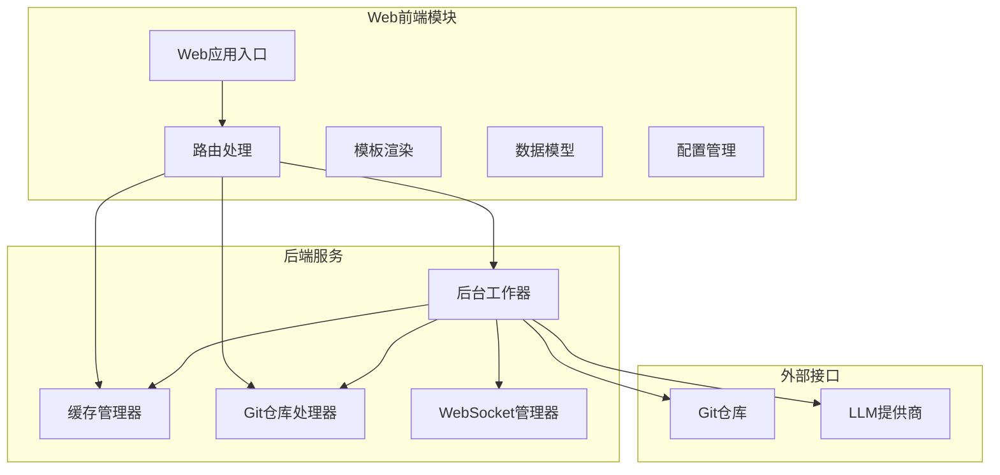
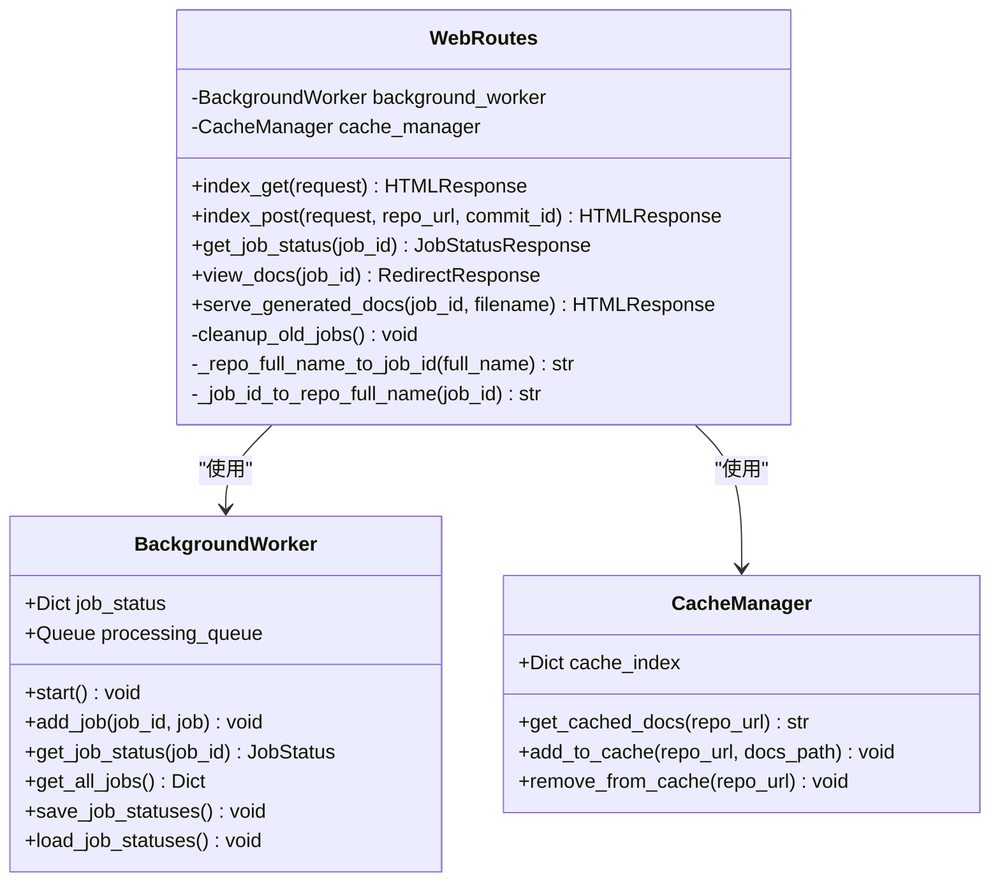
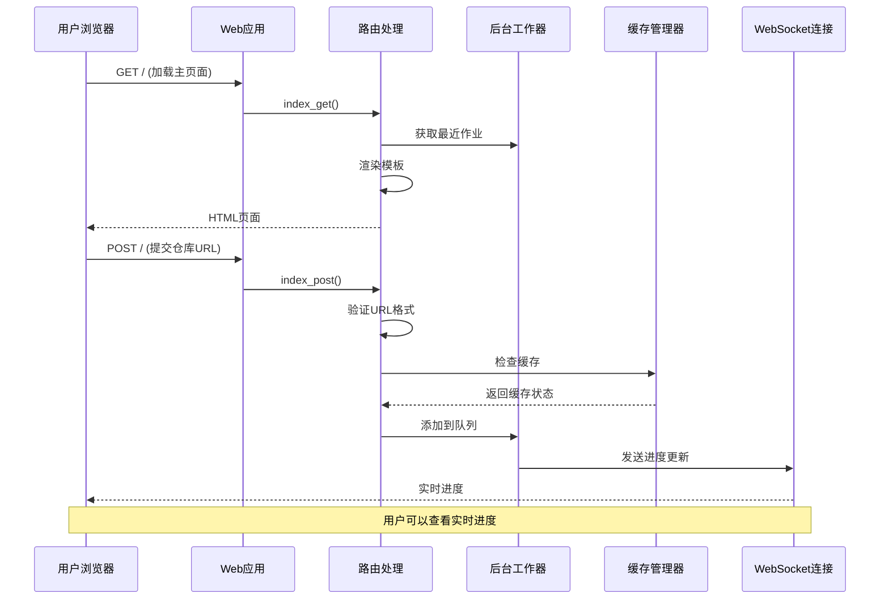
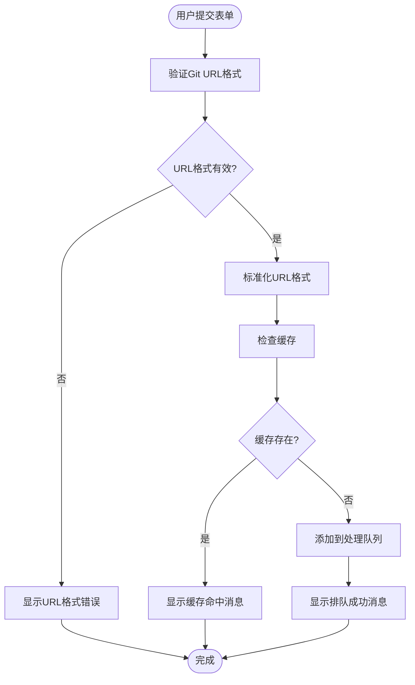
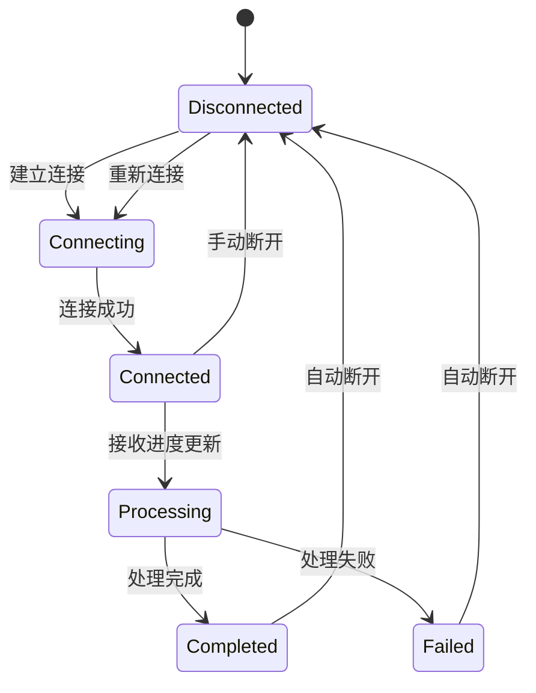
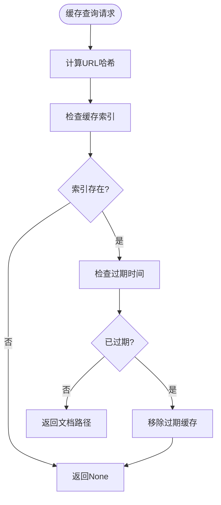
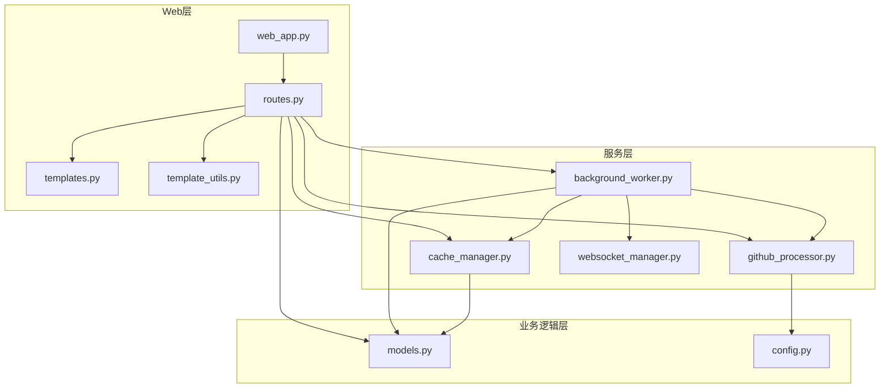

# Web界面操作指南

<cite>
**本文档引用的文件**
- [routes.py](file://codewiki/src/fe/routes.py)
- [templates.py](file://codewiki/src/fe/templates.py)
- [web_app.py](file://codewiki/src/fe/web_app.py)
- [template_utils.py](file://codewiki/src/fe/template_utils.py)
- [models.py](file://codewiki/src/fe/models.py)
- [config.py](file://codewiki/src/fe/config.py)
- [background_worker.py](file://codewiki/src/fe/background_worker.py)
- [cache_manager.py](file://codewiki/src/fe/cache_manager.py)
- [github_processor.py](file://codewiki/src/fe/github_processor.py)
- [websocket_manager.py](file://codewiki/src/fe/websocket_manager.py)
- [overview.md](file://output/docs/FSoft-AI4Code--CodeWiki-docs/overview.md)
- [README.md](file://README.md)
</cite>

## 目录
1. [简介](#简介)
2. [项目结构](#项目结构)
3. [核心组件](#核心组件)
4. [架构概览](#架构概览)
5. [详细组件分析](#详细组件分析)
6. [依赖关系分析](#依赖关系分析)
7. [性能考虑](#性能考虑)
8. [故障排除指南](#故障排除指南)
9. [结论](#结论)
10. [附录](#附录)

## 简介

CodeWiki是一个基于AI的代码库文档自动生成系统，提供了直观的Web界面供用户提交Git仓库URL以生成技术文档。本指南详细说明了Web界面的用户操作流程，包括表单提交功能、实时进度跟踪、缓存机制以及最佳实践建议。

## 项目结构

CodeWiki的Web前端采用模块化设计，主要包含以下核心组件：

**图表来源**
- [web_app.py](file://codewiki/src/fe/web_app.py#L24-L92)
- [routes.py](file://codewiki/src/fe/routes.py#L25-L31)

**章节来源**
- [web_app.py](file://codewiki/src/fe/web_app.py#L1-L165)
- [routes.py](file://codewiki/src/fe/routes.py#L1-L299)

## 核心组件

### WebRoutes类 - 主要业务逻辑

WebRoutes类是Web应用的核心控制器，负责处理所有Web请求和业务逻辑：

**图表来源**
- [routes.py](file://codewiki/src/fe/routes.py#L25-L31)
- [background_worker.py](file://codewiki/src/fe/background_worker.py#L26-L37)
- [cache_manager.py](file://codewiki/src/fe/cache_manager.py#L16-L24)

### 数据模型

系统使用强类型的数据模型确保数据一致性：

| 模型名称 | 字段 | 类型 | 描述 |
|---------|------|------|------|
| JobStatus | job_id, repo_url, status | str, str, str | 文档生成作业状态 |
| JobStatusResponse | job_id, repo_url, status, created_at | str, str, str, datetime | API响应模型 |
| ProgressMessage | job_id, status, progress, current_module | str, str, str, Optional[str] | 实时进度消息 |

**章节来源**
- [models.py](file://codewiki/src/fe/models.py#L17-L71)

## 架构概览

Web应用采用异步架构设计，支持实时进度更新和高并发处理：

**图表来源**
- [web_app.py](file://codewiki/src/fe/web_app.py#L44-L54)
- [routes.py](file://codewiki/src/fe/routes.py#L55-L153)
- [websocket_manager.py](file://codewiki/src/fe/websocket_manager.py#L44-L78)

## 详细组件分析

### 主页面表单功能

主页面提供了简洁直观的表单界面：

#### 表单字段说明

| 字段名称 | 类型 | 必填 | 描述 | 验证规则 |
|---------|------|------|------|----------|
| Git Repository URL | URL | 是 | Git仓库的完整URL | 支持GitHub, GitLab, Gitee等 |
| Commit ID | 文本 | 否 | 特定提交的哈希值 | 4-40字符十六进制数 |

#### URL格式要求

系统支持多种Git URL格式：
- HTTPS格式：`https://github.com/owner/repo`
- SSH格式：`git@github.com:owner/repo.git`
- SSH URL格式：`ssh://git@github.com/owner/repo.git`

**章节来源**
- [routes.py](file://codewiki/src/fe/routes.py#L66-L71)
- [github_processor.py](file://codewiki/src/fe/github_processor.py#L29-L54)

### 提交处理流程

用户提交表单后的完整处理流程：

**图表来源**
- [routes.py](file://codewiki/src/fe/routes.py#L55-L153)
- [github_processor.py](file://codewiki/src/fe/github_processor.py#L57-L82)

### 实时进度跟踪

系统通过WebSocket实现实时进度更新：

#### 进度状态转换

| 状态 | 颜色 | 描述 | 触发条件 |
|------|------|------|----------|
| queued | 橙色 | 排队等待处理 | 新增作业到队列 |
| processing | 蓝色 | 正在处理中 | 开始克隆仓库 |
| completed | 绿色 | 处理完成 | 文档生成成功 |
| failed | 红色 | 处理失败 | 发生异常错误 |

#### WebSocket连接管理

**图表来源**
- [websocket_manager.py](file://codewiki/src/fe/websocket_manager.py#L18-L78)
- [routes.py](file://codewiki/src/fe/routes.py#L309-L366)

**章节来源**
- [routes.py](file://codewiki/src/fe/routes.py#L302-L499)
- [websocket_manager.py](file://codewiki/src/fe/websocket_manager.py#L1-L100)

### 缓存机制

系统实现了智能缓存策略以提升性能：

#### 缓存策略

| 组件 | 功能 | 生命周期 | 存储位置 |
|------|------|----------|----------|
| 缓存索引 | 管理缓存条目 | 可配置天数 | JSON文件 |
| 文档内容 | 生成的文档 | 与索引相同 | 文件系统 |
| 作业状态 | 处理历史记录 | 24000小时 | JSON文件 |

#### 缓存查找流程

**图表来源**
- [cache_manager.py](file://codewiki/src/fe/cache_manager.py#L65-L82)

**章节来源**
- [cache_manager.py](file://codewiki/src/fe/cache_manager.py#L1-L119)

### 最近任务列表展示

最近任务列表提供了完整的作业历史信息：

#### 列表字段

| 字段 | 显示内容 | 更新时机 |
|------|----------|----------|
| 仓库URL | Git仓库地址 | 作业创建时 |
| 状态标签 | 当前处理状态 | 实时更新 |
| 进度文本 | 当前处理步骤 | 实时更新 |
| 进度详情 | 模块/组件进度 | 实时更新 |
| 进度条 | 完成百分比 | 实时更新 |
| 操作按钮 | 查看文档链接 | 仅完成时显示 |

**章节来源**
- [templates.py](file://codewiki/src/fe/templates.py#L273-L298)

## 依赖关系分析

### 组件间依赖关系

**图表来源**
- [web_app.py](file://codewiki/src/fe/web_app.py#L17-L41)
- [routes.py](file://codewiki/src/fe/routes.py#L15-L22)

### 外部依赖

系统依赖以下外部组件：

| 依赖项 | 版本要求 | 用途 |
|--------|----------|------|
| FastAPI | 最新版本 | Web框架 |
| Jinja2 | 最新版本 | 模板渲染 |
| Git | 2.0+ | 仓库克隆 |
| Python | 3.12+ | 运行环境 |
| LLM API | 可用 | 文档生成 |

**章节来源**
- [web_app.py](file://codewiki/src/fe/web_app.py#L1-L165)
- [requirements.txt](file://requirements.txt)

## 性能考虑

### 并发处理

系统采用多线程架构处理多个并发请求：

- **队列大小**：最多100个并发作业
- **超时设置**：Git克隆超时300秒
- **浅克隆**：默认深度为1以减少带宽使用

### 缓存优化

- **缓存过期**：默认365天
- **自动清理**：定期清理过期缓存条目
- **内存管理**：只在内存中维护活跃作业状态

### 网络优化

- **WebSocket复用**：单个连接支持多个作业进度
- **心跳机制**：每30秒发送ping包保持连接
- **自动重连**：连接断开后5秒自动重连

## 故障排除指南

### 常见问题及解决方案

#### URL格式错误

**症状**：提交表单后显示"请输入有效的Git仓库URL"错误

**可能原因**：
- URL格式不正确
- 不支持的Git平台
- 网络连接问题

**解决方法**：
1. 确认URL以`https://`开头
2. 检查Git平台是否被支持
3. 验证网络连接正常

#### 作业排队超时

**症状**：作业长时间处于排队状态

**可能原因**：
- 队列已满（100个作业）
- 系统负载过高
- 缓存未正确清理

**解决方法**：
1. 等待现有作业完成
2. 检查系统资源使用情况
3. 清理过期缓存

#### 文档生成失败

**症状**：作业状态变为failed

**可能原因**：
- Git仓库访问权限不足
- 仓库为空或无代码
- LLM API调用失败

**解决方法**：
1. 检查仓库访问权限
2. 验证仓库包含有效代码
3. 检查API密钥配置

**章节来源**
- [routes.py](file://codewiki/src/fe/routes.py#L66-L135)
- [background_worker.py](file://codewiki/src/fe/background_worker.py#L273-L286)

### 调试技巧

1. **启用调试模式**：启动时添加`--debug`参数
2. **查看日志输出**：关注控制台中的错误信息
3. **检查缓存状态**：验证缓存目录是否存在
4. **监控WebSocket连接**：确认连接状态正常

## 结论

CodeWiki的Web界面提供了用户友好的文档生成体验，具有以下优势：

- **直观的表单设计**：简洁明了的输入界面
- **实时进度反馈**：通过WebSocket提供即时状态更新
- **智能缓存机制**：显著提升重复请求的响应速度
- **强大的错误处理**：完善的错误提示和恢复机制

该系统适合需要自动化生成技术文档的开发团队和个人开发者使用。

## 附录

### 用户界面最佳实践

#### URL输入规范
- 优先使用HTTPS格式的仓库URL
- 确保仓库公开可访问
- 避免包含多余的查询参数

#### 重试策略
- 失败作业会在3分钟内避免重复提交
- 系统会自动清理超过24000小时的历史作业
- 缓存过期后会自动重新生成文档

#### 缓存提示
- 已生成的文档会被缓存365天
- 缓存命中时会直接跳转到文档页面
- 可以通过清除缓存强制重新生成

### 截图说明

由于本系统为纯文本界面，主要界面元素包括：

1. **表单区域**：包含仓库URL输入框和可选的commit ID字段
2. **提交按钮**：样式为蓝色，点击后禁用10秒防止重复提交
3. **消息区域**：显示成功或错误提示信息
4. **最近作业列表**：展示100个最近的作业状态
5. **进度指示器**：实时显示作业处理进度

### 预期行为描述

- **成功提交**：显示"仓库已添加到处理队列"消息
- **缓存命中**：显示"在缓存中找到文档"消息并自动跳转
- **处理中**：WebSocket连接建立，实时显示进度更新
- **完成后**：自动刷新页面，显示文档查看链接