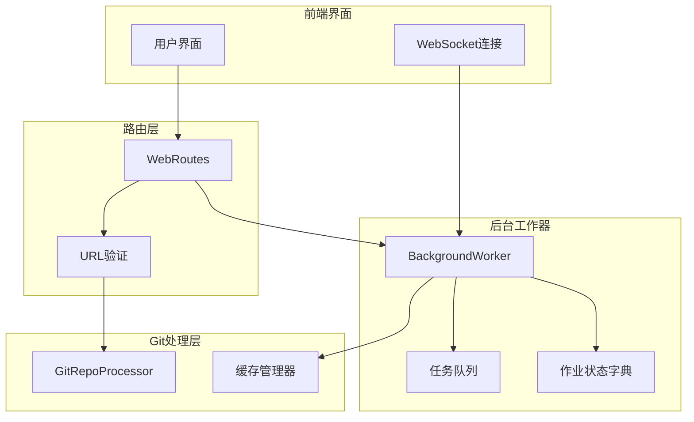
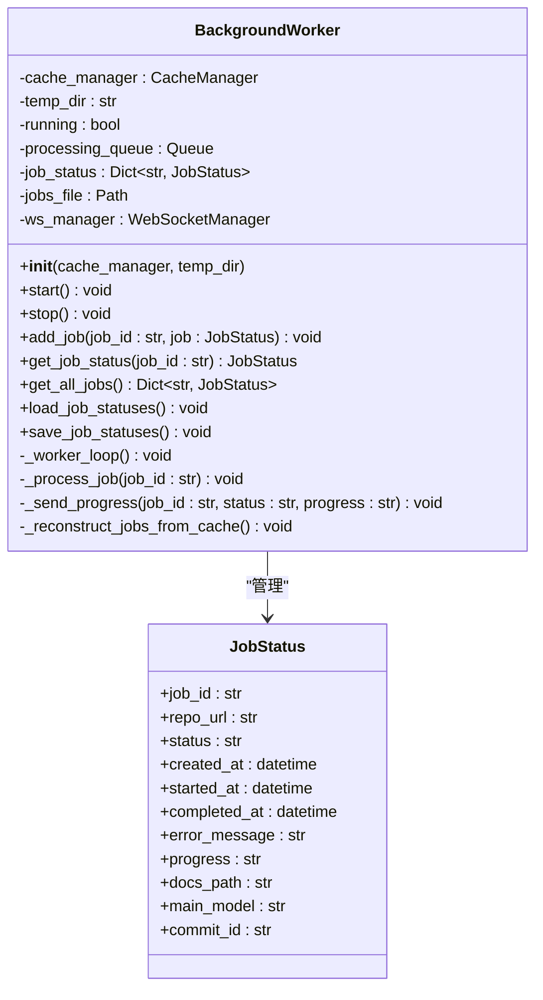
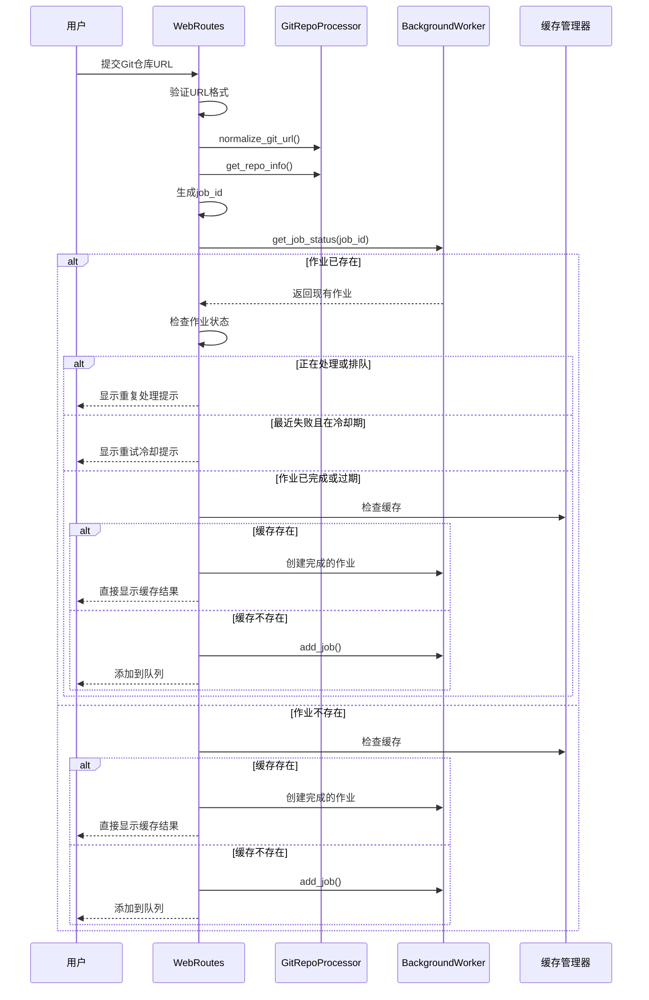
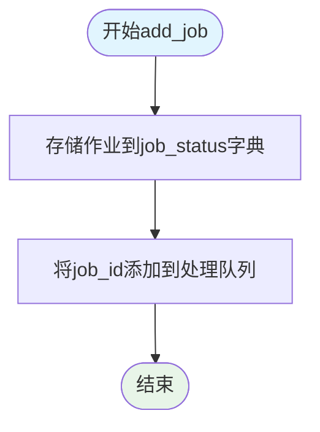
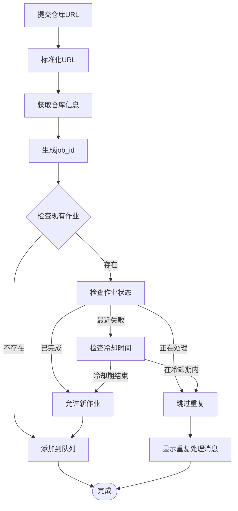
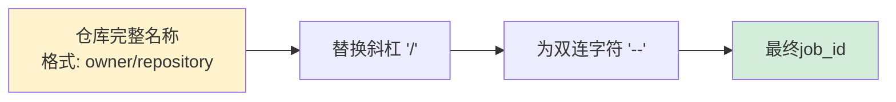
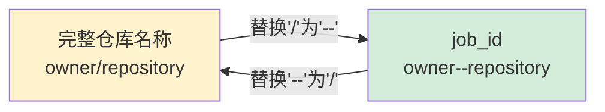
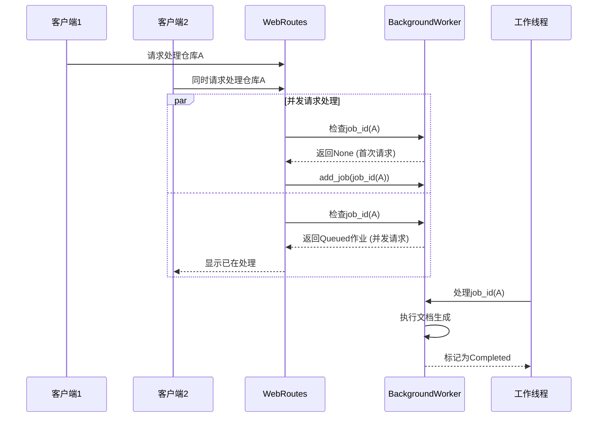

# 作业去重机制

<cite>
**本文档引用的文件**
- [background_worker.py](file://codewiki/src/fe/background_worker.py)
- [routes.py](file://codewiki/src/fe/routes.py)
- [models.py](file://codewiki/src/fe/models.py)
- [github_processor.py](file://codewiki/src/fe/github_processor.py)
- [config.py](file://codewiki/src/fe/config.py)
</cite>

## 目录
1. [简介](#简介)
2. [系统架构概览](#系统架构概览)
3. [核心组件分析](#核心组件分析)
4. [作业去重实现原理](#作业去重实现原理)
5. [job_id生成机制](#jobid生成机制)
6. [并发处理与资源优化](#并发处理与资源优化)
7. [局限性分析](#局限性分析)
8. [性能考虑](#性能考虑)
9. [故障排除指南](#故障排除指南)
10. [结论](#结论)

## 简介

CodeWiki项目中的作业去重机制是一个关键的资源管理功能，旨在防止对同一Git仓库的重复处理，从而避免不必要的计算资源浪费。该机制通过在`add_job`方法中检查`job_id`是否已存在于`job_status`字典来实现，确保每个仓库在同一时间只被处理一次。

## 系统架构概览



**图表来源**
- [routes.py](file://codewiki/src/fe/routes.py#L55-L135)
- [background_worker.py](file://codewiki/src/fe/background_worker.py#L26-L58)
- [github_processor.py](file://codewiki/src/fe/github_processor.py#L84-L123)

## 核心组件分析

### BackgroundWorker类

BackgroundWorker是作业去重机制的核心组件，负责管理所有文档生成作业的状态和生命周期。



**图表来源**
- [background_worker.py](file://codewiki/src/fe/background_worker.py#L26-L58)
- [models.py](file://codewiki/src/fe/models.py#L32-L46)

**章节来源**
- [background_worker.py](file://codewiki/src/fe/background_worker.py#L26-L58)
- [models.py](file://codewiki/src/fe/models.py#L32-L46)

### WebRoutes类

WebRoutes处理用户请求并实现作业去重逻辑的核心业务流程。



**图表来源**
- [routes.py](file://codewiki/src/fe/routes.py#L55-L135)
- [github_processor.py](file://codewiki/src/fe/github_processor.py#L56-L82)

**章节来源**
- [routes.py](file://codewiki/src/fe/routes.py#L55-L135)

## 作业去重实现原理

### 基本原理

作业去重机制的核心在于使用`job_id`作为唯一标识符来跟踪每个Git仓库的处理状态。当用户提交一个新的仓库URL时，系统会：

1. **标准化URL**：使用GitRepoProcessor.normalize_git_url()确保相同的仓库URL在不同格式下也能被识别为同一个
2. **提取仓库信息**：通过GitRepoProcessor.get_repo_info()获取仓库的完整名称
3. **生成job_id**：将仓库完整名称中的斜杠替换为双连字符，形成URL安全的作业ID
4. **检查重复**：在BackgroundWorker.job_status字典中查找是否存在相同的job_id

### 关键实现细节

#### add_job方法



**图表来源**
- [background_worker.py](file://codewiki/src/fe/background_worker.py#L55-L58)

#### 重复检查逻辑



**图表来源**
- [routes.py](file://codewiki/src/fe/routes.py#L80-L98)

**章节来源**
- [background_worker.py](file://codewiki/src/fe/background_worker.py#L55-L58)
- [routes.py](file://codewiki/src/fe/routes.py#L80-L98)

## job_id生成机制

### 生成算法

job_id的生成采用简单而有效的策略：将Git仓库的完整名称（格式为"owner/repository"）中的斜杠字符替换为双连字符"-"。



**图表来源**
- [routes.py](file://codewiki/src/fe/routes.py#L280-L282)

### 唯一性保证

这种生成方式确保了以下唯一性特征：

1. **平台独立性**：无论仓库托管在GitHub、GitLab还是其他平台，只要owner和repository名称相同，生成的job_id就相同
2. **URL安全性**：双连字符在URL中是安全的，不会引起解析问题
3. **人类可读性**：虽然经过转换，但通过反向转换函数仍可恢复原始仓库名称

### 反向转换

系统提供了完整的双向转换支持：



**图表来源**
- [routes.py](file://codewiki/src/fe/routes.py#L280-L286)

**章节来源**
- [routes.py](file://codewiki/src/fe/routes.py#L280-L286)

## 并发处理与资源优化

### 并发控制机制

作业去重机制有效防止了对同一仓库的并发请求导致的重复处理：



**图表来源**
- [routes.py](file://codewiki/src/fe/routes.py#L92-L98)
- [background_worker.py](file://codewiki/src/fe/background_worker.py#L182-L287)

### 资源节省效果

这种去重机制带来了显著的资源节省：

1. **计算资源**：避免重复克隆和分析同一仓库
2. **网络带宽**：减少重复的Git仓库克隆操作
3. **存储空间**：避免重复生成和存储文档内容
4. **内存使用**：防止多个相同作业的内存占用

### 冷却时间机制

系统实现了3分钟的冷却时间机制，防止对最近失败的作业进行频繁重试：

- **冷却期间**：拒绝新的处理请求
- **冷却期后**：允许重新提交处理
- **状态区分**：仅对失败且在冷却期内的作业应用此规则

**章节来源**
- [routes.py](file://codewiki/src/fe/routes.py#L87-L90)
- [config.py](file://codewiki/src/fe/config.py#L26)

## 局限性分析

### 当前限制

尽管作业去重机制有效，但仍存在一些局限性：

#### 1. 分支和提交级别的去重不足

**问题描述**：当前机制仅基于仓库级别进行去重，不同分支或提交的请求被视为同一作业。

**影响范围**：
- 同一仓库的不同分支会被视为相同作业
- 不同提交的变更不会触发新的处理
- 可能错过重要的代码更新

#### 2. URL格式差异处理

**问题描述**：虽然有URL标准化功能，但仍可能存在某些边缘情况。

**潜在问题**：
- SSH和HTTPS格式的转换可能不完全覆盖
- 私有仓库的访问权限处理
- 自定义域名的Git服务器支持

#### 3. 缓存一致性

**问题描述**：缓存和作业状态之间的一致性维护。

**风险点**：
- 缓存过期但作业状态未更新
- 作业状态文件损坏后的恢复机制

### 改进建议

#### 1. 增强的job_id生成

建议扩展job_id生成算法，包含分支和提交信息：

```python
# 建议的改进方案
def enhanced_job_id(repo_info, branch=None, commit=None):
    base_id = repo_info['full_name'].replace('/', '--')
    if branch and commit:
        return f"{base_id}--{branch}--{commit[:7]}"
    elif branch:
        return f"{base_id}--{branch}"
    elif commit:
        return f"{base_id}--{commit[:7]}"
    return base_id
```

#### 2. 更精细的状态管理

实现更细粒度的作业状态跟踪，支持：

- 分支级别的作业队列
- 提交级别的版本控制
- 作业优先级管理

**章节来源**
- [routes.py](file://codewiki/src/fe/routes.py#L74-L78)
- [github_processor.py](file://codewiki/src/fe/github_processor.py#L84-L123)

## 性能考虑

### 时间复杂度分析

作业去重机制的时间复杂度为O(1)，因为：

- 字典查找：O(1)平均时间复杂度
- URL标准化：O(n)线性时间，n为URL长度
- job_id生成：O(m)线性时间，m为仓库名称长度

### 空间复杂度分析

- `job_status`字典：O(k)空间，k为当前活跃作业数量
- 作业队列：O(q)空间，q为队列大小
- 缓存管理：取决于缓存策略和内容大小

### 优化建议

1. **定期清理**：实现作业状态的定期清理机制
2. **内存管理**：对长时间未活动的作业进行内存回收
3. **并发优化**：使用更高效的并发数据结构
4. **持久化优化**：优化作业状态文件的读写性能

## 故障排除指南

### 常见问题及解决方案

#### 1. 重复作业处理

**症状**：用户报告仓库已被处理但进度停滞

**诊断步骤**：
1. 检查`job_status`字典中是否存在对应job_id
2. 验证作业状态是否为'processing'或'queued'
3. 查看后台工作器的日志输出

**解决方法**：
- 强制重启后台工作器
- 清理作业状态文件
- 检查队列是否阻塞

#### 2. job_id生成冲突

**症状**：两个不同的仓库产生相同的job_id

**原因分析**：
- 仓库名称中包含特殊字符
- URL标准化过程中的异常

**解决方法**：
- 实施更复杂的job_id生成算法
- 添加冲突检测和自动重命名机制

#### 3. 冷却时间误判

**症状**：作业在应该可以重试时被阻止

**诊断**：
- 检查`RETRY_COOLDOWN_MINUTES`配置值
- 验证作业创建时间戳
- 确认作业状态历史记录

**解决**：
- 调整冷却时间配置
- 实现手动重置功能
- 添加管理员干预接口

**章节来源**
- [background_worker.py](file://codewiki/src/fe/background_worker.py#L182-L287)
- [routes.py](file://codewiki/src/fe/routes.py#L87-L90)

## 结论

CodeWiki项目的作业去重机制是一个设计精良的资源管理解决方案，通过简单的job_id生成和字典查找实现了高效的重复检测。该机制成功地：

1. **有效防止重复处理**：通过job_status字典确保同一仓库不会被重复处理
2. **节省计算资源**：避免不必要的Git克隆、分析和文档生成
3. **提供良好的用户体验**：通过清晰的状态反馈和错误处理
4. **保持系统稳定性**：通过冷却时间和状态管理机制

### 主要优势

- **实现简单**：基于Python内置数据结构，易于理解和维护
- **性能优异**：O(1)时间复杂度的查找操作
- **扩展性强**：模块化设计便于功能扩展
- **容错性好**：完善的错误处理和恢复机制

### 发展方向

尽管当前机制已经相当完善，但仍有一些改进空间：

1. **增强版本控制**：支持分支和提交级别的去重
2. **智能调度**：实现更智能的作业优先级和调度
3. **监控增强**：添加更详细的性能监控和告警机制
4. **配置灵活化**：提供更多可配置的参数和策略

通过持续的优化和改进，作业去重机制将继续为CodeWiki项目提供可靠的资源管理和用户体验保障。