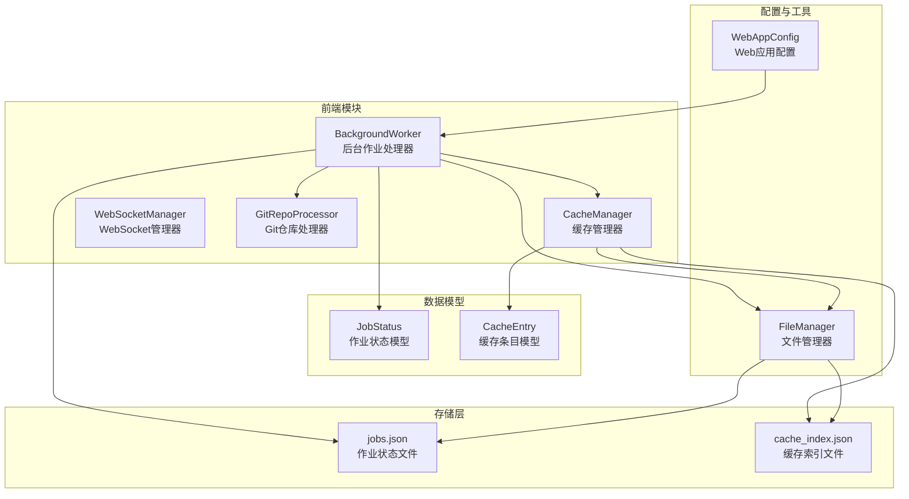
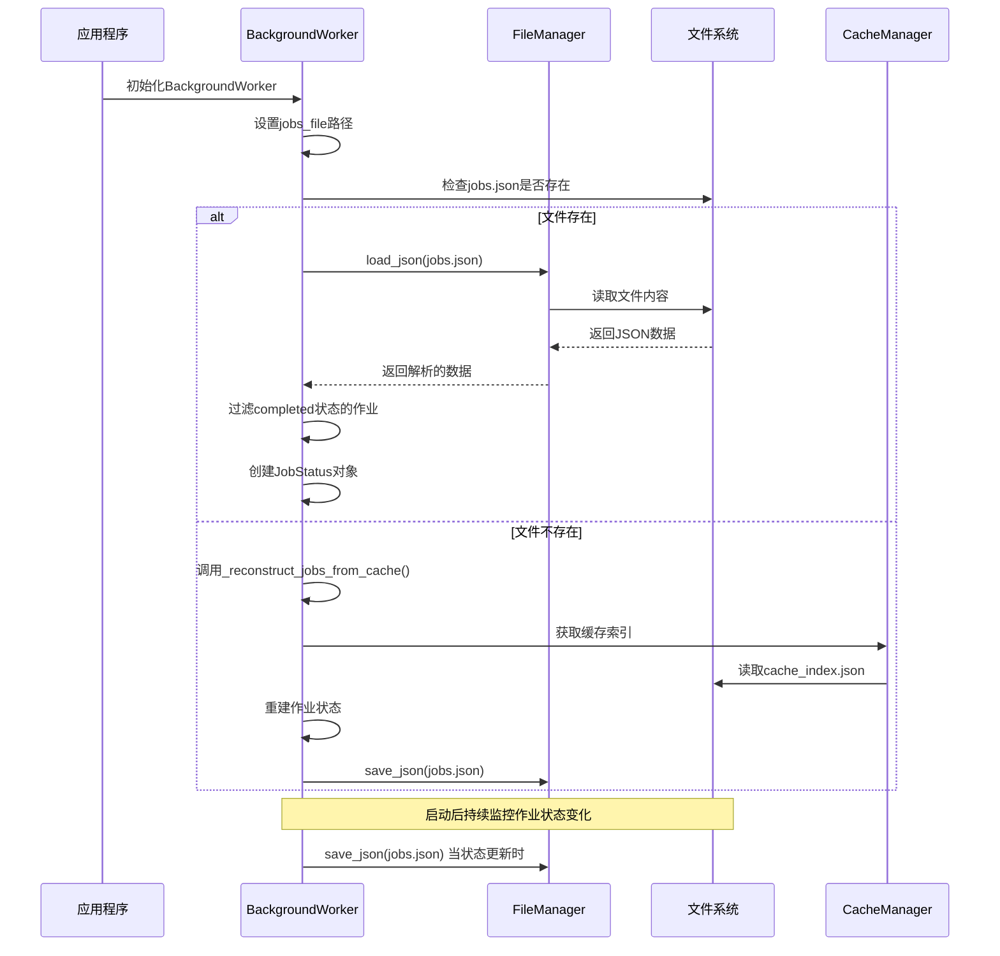
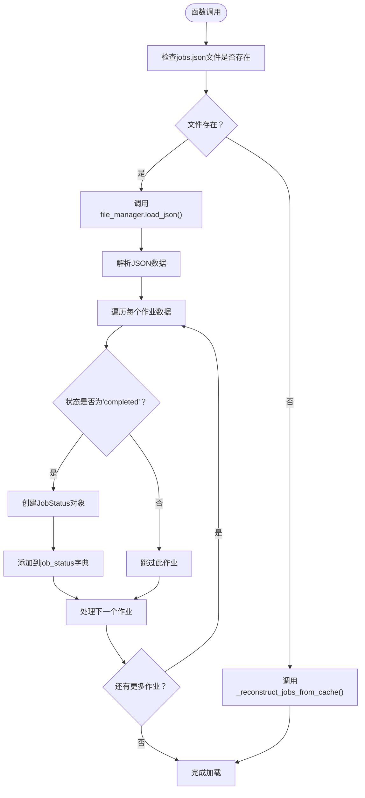
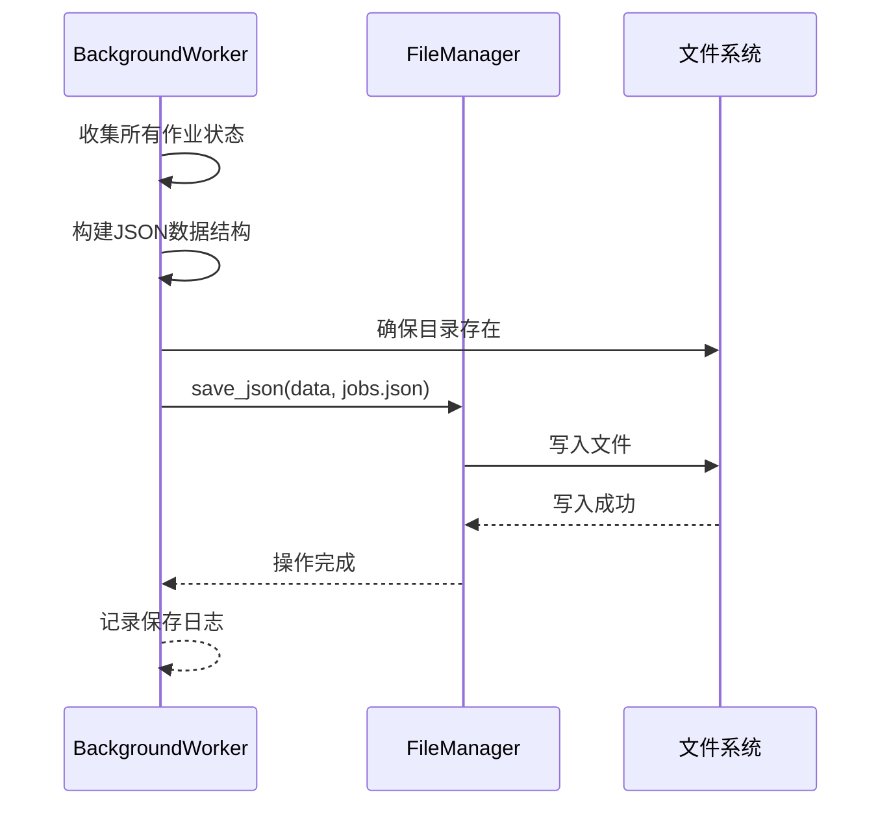
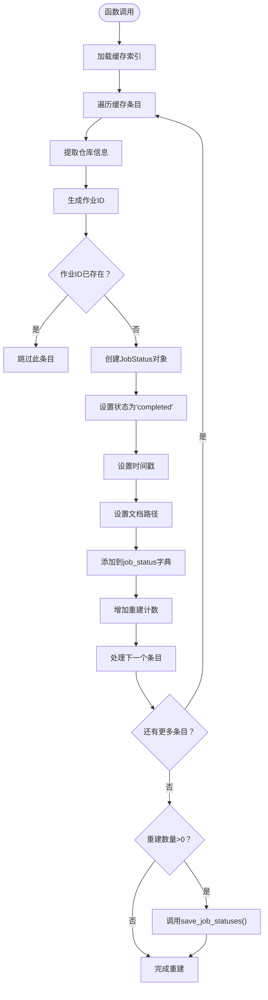
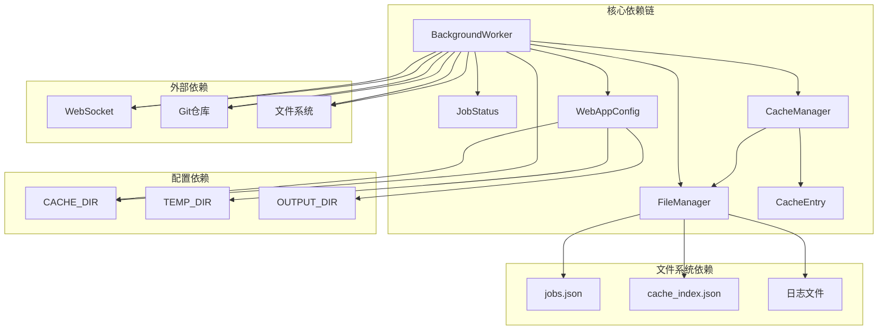

# 作业持久化

<cite>
**本文档引用的文件**
- [background_worker.py](file://codewiki/src/fe/background_worker.py)
- [models.py](file://codewiki/src/fe/models.py)
- [utils.py](file://codewiki/src/utils.py)
- [config.py](file://codewiki/src/fe/config.py)
- [cache_manager.py](file://codewiki/src/fe/cache_manager.py)
- [routes.py](file://codewiki/src/fe/routes.py)
- [github_processor.py](file://codewiki/src/fe/github_processor.py)
</cite>

## 目录
1. [简介](#简介)
2. [项目结构](#项目结构)
3. [核心组件](#核心组件)
4. [架构概览](#架构概览)
5. [详细组件分析](#详细组件分析)
6. [依赖关系分析](#依赖关系分析)
7. [性能考虑](#性能考虑)
8. [故障排除指南](#故障排除指南)
9. [结论](#结论)

## 简介

本文件详细阐述了CodeWiki项目中作业状态的持久化机制，重点关注`jobs.json`文件的读写流程。该机制确保系统在服务重启后能够正确恢复已完成的作业状态，避免状态不一致问题。文档涵盖了以下关键方面：

- `load_job_statuses`函数在启动时从磁盘加载已完成作业的工作流程
- 为什么只恢复'completed'状态的作业以避免状态不一致
- `save_job_statuses`函数如何将作业数据序列化为JSON并保存到`jobs_file`
- `_reconstruct_jobs_from_cache`在无作业文件时从缓存重建历史作业的兼容性策略
- 持久化对服务重启后状态恢复的重要意义

## 项目结构

CodeWiki的作业持久化功能主要分布在前端模块中，涉及多个关键文件：

**图表来源**
- [background_worker.py](file://codewiki/src/fe/background_worker.py#L1-L200)
- [cache_manager.py](file://codewiki/src/fe/cache_manager.py#L1-L120)
- [models.py](file://codewiki/src/fe/models.py#L1-L71)
- [utils.py](file://codewiki/src/utils.py#L1-L46)

**章节来源**
- [background_worker.py](file://codewiki/src/fe/background_worker.py#L1-L200)
- [cache_manager.py](file://codewiki/src/fe/cache_manager.py#L1-L120)
- [models.py](file://codewiki/src/fe/models.py#L1-L71)
- [utils.py](file://codewiki/src/utils.py#L1-L46)

## 核心组件

### BackgroundWorker类

BackgroundWorker是作业持久化的核心组件，负责：
- 初始化作业状态存储位置（`jobs.json`文件）
- 在启动时加载已存在的作业状态
- 实时保存作业状态变更
- 提供作业状态查询接口

### JobStatus数据模型

JobStatus类定义了作业状态的完整结构，包括：
- 基本标识信息：job_id、repo_url
- 时间戳：created_at、started_at、completed_at
- 状态信息：status、progress、error_message
- 文档路径：docs_path
- 其他元数据：main_model、commit_id

### FileManager工具类

FileManager提供了统一的文件操作接口：
- JSON文件的读写操作
- 目录创建和验证
- 错误处理和异常管理

**章节来源**
- [background_worker.py](file://codewiki/src/fe/background_worker.py#L30-L175)
- [models.py](file://codewiki/src/fe/models.py#L32-L46)
- [utils.py](file://codewiki/src/utils.py#L10-L46)

## 架构概览

作业持久化系统的整体架构如下：

**图表来源**
- [background_worker.py](file://codewiki/src/fe/background_worker.py#L68-L153)
- [utils.py](file://codewiki/src/utils.py#L19-L31)
- [cache_manager.py](file://codewiki/src/fe/cache_manager.py#L26-L59)

## 详细组件分析

### load_job_statuses函数分析

load_job_statuses函数负责在系统启动时从磁盘加载作业状态：

**图表来源**
- [background_worker.py](file://codewiki/src/fe/background_worker.py#L68-L83)

#### 关键设计决策

1. **状态过滤策略**：只加载'completed'状态的作业，这是为了避免状态不一致问题
2. **错误处理**：使用try-catch块捕获文件读取和解析异常
3. **向后兼容**：当文件不存在时，自动尝试从缓存重建作业状态

**章节来源**
- [background_worker.py](file://codewiki/src/fe/background_worker.py#L68-L83)

### save_job_statuses函数分析

save_job_statuses函数负责将当前内存中的作业状态持久化到磁盘：

**图表来源**
- [background_worker.py](file://codewiki/src/fe/background_worker.py#L129-L153)
- [utils.py](file://codewiki/src/utils.py#L19-L22)

#### 数据序列化过程

save_job_statuses函数将JobStatus对象转换为JSON格式，包含以下字段：
- job_id：作业唯一标识符
- repo_url：仓库URL
- status：当前状态
- created_at/started_at/completed_at：时间戳（ISO格式）
- error_message：错误信息
- progress：进度描述
- docs_path：文档路径

**章节来源**
- [background_worker.py](file://codewiki/src/fe/background_worker.py#L129-L153)

### _reconstruct_jobs_from_cache函数分析

当`jobs.json`文件不存在时，系统会调用`_reconstruct_jobs_from_cache`函数从缓存重建历史作业状态：

**图表来源**
- [background_worker.py](file://codewiki/src/fe/background_worker.py#L95-L128)

#### 兼容性策略

1. **向后兼容**：通过从缓存重建历史作业，确保新版本系统能够识别旧版本产生的缓存数据
2. **数据完整性**：利用缓存索引中的信息重建完整的作业状态
3. **自动迁移**：重建完成后自动保存到新的`jobs.json`文件中

**章节来源**
- [background_worker.py](file://codewiki/src/fe/background_worker.py#L95-L128)

### 作业状态一致性保证

系统通过以下机制确保作业状态的一致性：

1. **启动时的状态过滤**：只加载已完成的作业，避免加载进行中的作业导致状态不一致
2. **原子性操作**：文件写入采用原子性操作，确保数据完整性
3. **错误恢复**：遇到异常时提供降级策略和错误报告

**章节来源**
- [background_worker.py](file://codewiki/src/fe/background_worker.py#L78-L83)

## 依赖关系分析

作业持久化机制涉及多个组件之间的复杂依赖关系：

**图表来源**
- [background_worker.py](file://codewiki/src/fe/background_worker.py#L1-L200)
- [cache_manager.py](file://codewiki/src/fe/cache_manager.py#L1-L120)
- [config.py](file://codewiki/src/fe/config.py#L10-L51)
- [utils.py](file://codewiki/src/utils.py#L1-L46)

### 组件耦合度分析

- **低耦合设计**：BackgroundWorker通过FileManager抽象访问文件系统，降低了文件系统操作的耦合度
- **清晰的职责分离**：不同组件专注于特定功能，如CacheManager专门处理缓存，FileManager专门处理文件操作
- **可测试性**：通过接口抽象，便于单元测试和模拟

**章节来源**
- [background_worker.py](file://codewiki/src/fe/background_worker.py#L1-L200)
- [utils.py](file://codewiki/src/utils.py#L1-L46)

## 性能考虑

### 文件I/O优化

1. **批量操作**：在状态更新时进行批量保存，减少频繁的文件写入操作
2. **异步处理**：后台线程处理文件写入，避免阻塞主线程
3. **增量更新**：只在状态发生显著变化时触发保存操作

### 内存管理

1. **状态过滤**：启动时只加载已完成的作业，减少内存占用
2. **缓存清理**：定期清理过期的作业状态，释放内存空间
3. **对象复用**：重用JobStatus对象，避免频繁的对象创建

### 并发安全

1. **线程安全**：使用适当的同步机制确保多线程环境下的数据一致性
2. **文件锁定**：在文件写入时使用适当的锁定机制防止并发冲突

## 故障排除指南

### 常见问题及解决方案

#### 1. jobs.json文件损坏

**症状**：系统启动时报JSON解析错误

**解决方案**：
- 删除损坏的`jobs.json`文件
- 系统会自动从缓存重建作业状态
- 检查缓存目录的完整性

#### 2. 权限问题

**症状**：无法读取或写入`jobs.json`文件

**解决方案**：
- 检查缓存目录的读写权限
- 确保应用程序有足够权限访问文件系统
- 使用管理员权限运行应用程序

#### 3. 磁盘空间不足

**症状**：文件保存失败或部分数据丢失

**解决方案**：
- 清理磁盘空间
- 调整缓存大小配置
- 定期清理过期的作业状态

#### 4. 数据不一致

**症状**：作业状态显示异常或不准确

**解决方案**：
- 手动删除`jobs.json`文件重新生成
- 检查系统时间设置
- 验证文件系统的时间戳准确性

**章节来源**
- [background_worker.py](file://codewiki/src/fe/background_worker.py#L75-L83)
- [background_worker.py](file://codewiki/src/fe/background_worker.py#L151-L153)

## 结论

CodeWiki项目的作业持久化机制通过精心设计的架构实现了可靠的状态管理：

### 主要优势

1. **状态一致性**：通过只加载已完成作业确保启动时的状态一致性
2. **向后兼容**：自动从缓存重建历史作业，支持版本升级
3. **错误恢复**：完善的错误处理和降级策略
4. **性能优化**：批量操作和异步处理提升系统性能

### 设计亮点

- **模块化设计**：清晰的职责分离和接口抽象
- **配置驱动**：灵活的配置选项适应不同部署环境
- **监控友好**：详细的日志记录便于问题诊断
- **扩展性强**：易于添加新的作业状态类型和持久化策略

### 未来改进方向

1. **事务性操作**：实现更严格的事务性文件操作
2. **压缩存储**：对大型作业状态进行压缩存储
3. **分布式支持**：支持多节点环境下的状态同步
4. **监控集成**：集成更完善的监控和告警机制

该持久化机制为CodeWiki提供了稳定可靠的作业状态管理基础，确保用户在各种情况下都能获得一致的服务体验。