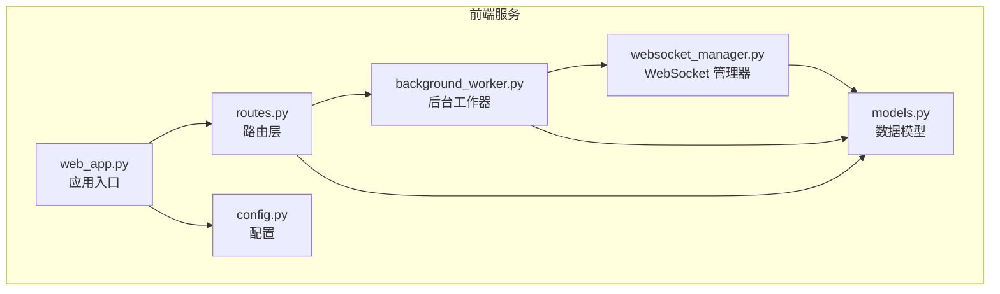
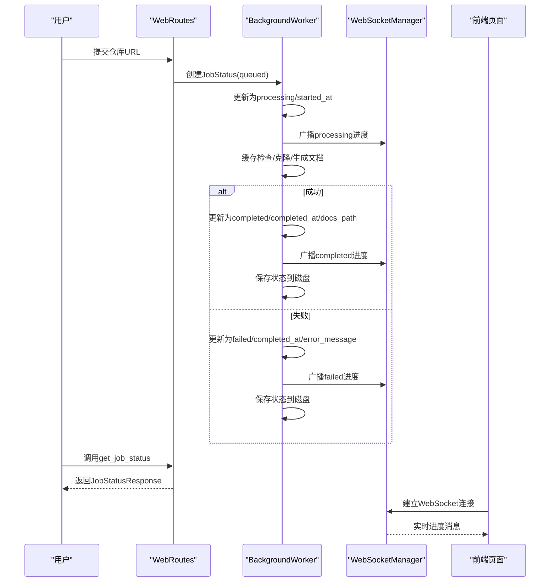
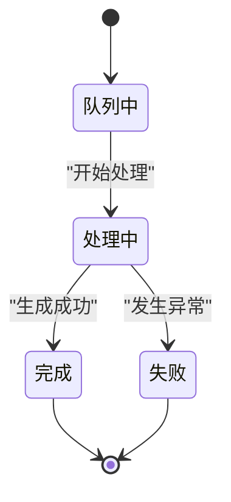
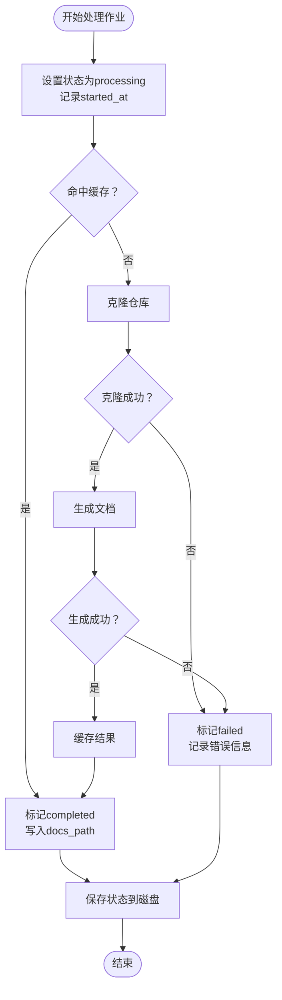
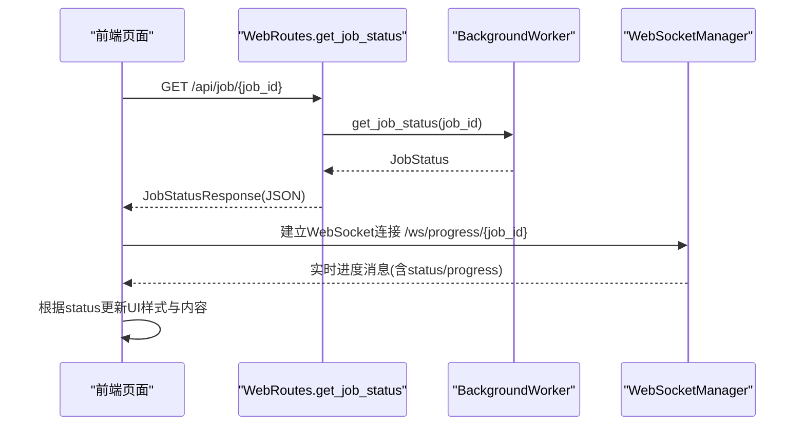
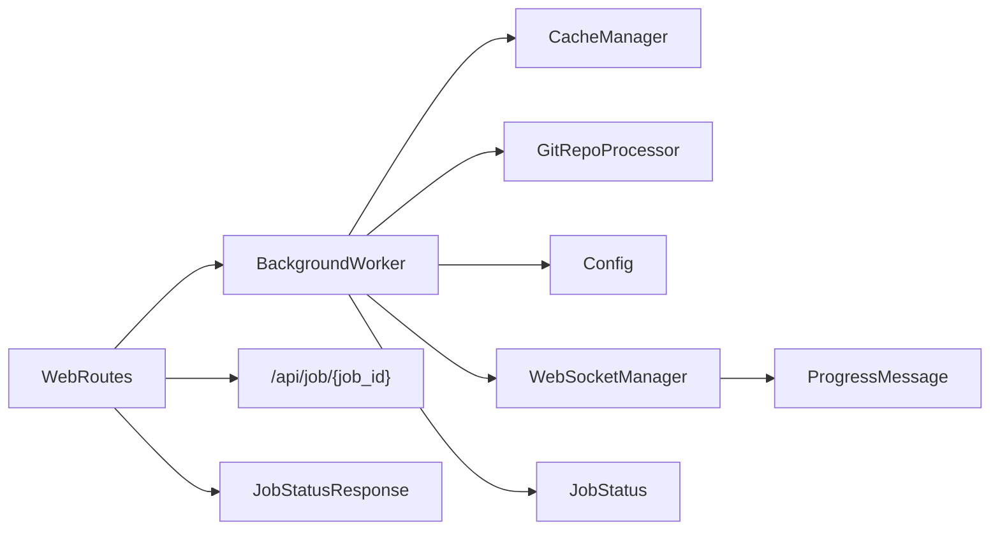

# 作业状态机

<cite>
**本文档引用的文件**
- [models.py](file://codewiki/src/fe/models.py)
- [background_worker.py](file://codewiki/src/fe/background_worker.py)
- [routes.py](file://codewiki/src/fe/routes.py)
- [websocket_manager.py](file://codewiki/src/fe/websocket_manager.py)
- [web_app.py](file://codewiki/src/fe/web_app.py)
- [config.py](file://codewiki/src/fe/config.py)
</cite>

## 目录
1. [简介](#简介)
2. [项目结构](#项目结构)
3. [核心组件](#核心组件)
4. [架构总览](#架构总览)
5. [详细组件分析](#详细组件分析)
6. [依赖关系分析](#依赖关系分析)
7. [性能考量](#性能考量)
8. [故障排除指南](#故障排除指南)
9. [结论](#结论)

## 简介
本文件深入解析作业状态机的设计与实现，围绕 JobStatus 模型定义的四种状态（queued、processing、completed、failed）及其转换规则展开。结合后台工作器中的 _process_job 方法，系统性说明从“排队”到“处理”，再到“完成”或“失败”的完整生命周期；解释 status 字段在不同阶段的更新时机与条件，例如克隆失败会触发 failed 状态；并阐述 get_job_status API 如何将当前状态暴露给前端，以及 WebSocket 实时进度广播机制如何协同工作。

## 项目结构
该功能主要分布在前端服务模块中，涉及数据模型、后台工作器、路由层、WebSocket 管理器以及应用入口配置：
- 数据模型：定义 JobStatus、JobStatusResponse、ProgressMessage 等
- 后台工作器：负责作业入队、状态推进、异常处理与持久化
- 路由层：提供 Web 页面与 API 接口，包括 get_job_status
- WebSocket 管理器：负责实时进度广播
- 应用入口：注册路由与 WebSocket 端点
- 配置：队列大小、缓存与清理策略等

图表来源
- [models.py](file://codewiki/src/fe/models.py#L32-L71)
- [background_worker.py](file://codewiki/src/fe/background_worker.py#L26-L294)
- [routes.py](file://codewiki/src/fe/routes.py#L25-L299)
- [websocket_manager.py](file://codewiki/src/fe/websocket_manager.py#L18-L100)
- [web_app.py](file://codewiki/src/fe/web_app.py#L24-L92)
- [config.py](file://codewiki/src/fe/config.py#L10-L51)

章节来源
- [models.py](file://codewiki/src/fe/models.py#L1-L71)
- [background_worker.py](file://codewiki/src/fe/background_worker.py#L1-L294)
- [routes.py](file://codewiki/src/fe/routes.py#L1-L299)
- [websocket_manager.py](file://codewiki/src/fe/websocket_manager.py#L1-L100)
- [web_app.py](file://codewiki/src/fe/web_app.py#L1-L165)
- [config.py](file://codewiki/src/fe/config.py#L1-L51)

## 核心组件
- JobStatus：作业状态跟踪的核心数据结构，包含 job_id、repo_url、status、时间戳、错误信息、进度、文档路径等字段
- JobStatusResponse：API 响应模型，用于对外暴露作业状态
- ProgressMessage：WebSocket 进度消息模型，携带实时状态与进度详情
- BackgroundWorker：后台工作器，负责作业入队、状态推进、异常处理、持久化与进度广播
- WebRoutes：路由层，提供 Web 页面与 API 接口，包括 get_job_status
- WebSocketManager：WebSocket 管理器，负责连接管理与进度广播
- WebAppConfig：应用配置，包含队列大小、缓存与清理策略等

章节来源
- [models.py](file://codewiki/src/fe/models.py#L32-L71)
- [background_worker.py](file://codewiki/src/fe/background_worker.py#L26-L294)
- [routes.py](file://codewiki/src/fe/routes.py#L25-L299)
- [websocket_manager.py](file://codewiki/src/fe/websocket_manager.py#L18-L100)
- [web_app.py](file://codewiki/src/fe/web_app.py#L24-L92)
- [config.py](file://codewiki/src/fe/config.py#L10-L51)

## 架构总览
下图展示从用户提交仓库地址到状态更新与前端展示的整体流程，重点体现状态机在后台工作器中的推进过程，以及 WebSocket 的实时反馈。

图表来源
- [routes.py](file://codewiki/src/fe/routes.py#L55-L136)
- [background_worker.py](file://codewiki/src/fe/background_worker.py#L182-L287)
- [websocket_manager.py](file://codewiki/src/fe/websocket_manager.py#L44-L78)
- [web_app.py](file://codewiki/src/fe/web_app.py#L78-L92)

## 详细组件分析

### JobStatus 模型与状态机
- 字段定义：job_id、repo_url、status（'queued'、'processing'、'completed'、'failed'）、时间戳、错误信息、进度、文档路径、主模型、提交号等
- 状态含义：
  - queued：已入队等待处理
  - processing：正在处理中
  - completed：处理成功，可查看文档
  - failed：处理失败，包含错误信息
- 状态转换规则：
  - queued → processing：开始处理时更新状态与启动时间
  - processing → completed：文档生成成功后更新完成时间与文档路径
  - processing → failed：发生异常时更新完成时间与错误信息
  - completed：最终态，不再变化
  - failed：最终态，不再变化

图表来源
- [models.py](file://codewiki/src/fe/models.py#L32-L46)
- [background_worker.py](file://codewiki/src/fe/background_worker.py#L182-L287)

章节来源
- [models.py](file://codewiki/src/fe/models.py#L32-L46)

### _process_job 方法的状态变更逻辑
- 初始化与入队：作业入队后，后台工作器在处理前将状态设为 processing，记录 started_at，并发送初始进度
- 缓存优先：若命中缓存，直接标记 completed，写入 docs_path，发送完成进度并保存
- 克隆与分析：更新进度为“克隆仓库”，执行克隆；若克隆失败，抛出异常进入失败分支
- 文档生成：创建配置、运行生成器并设置进度回调；生成完成后缓存结果，标记 completed，发送完成进度并保存
- 异常处理：捕获异常，将状态设为 failed，记录错误信息与完成时间，发送失败进度并保存
- 清理：无论成功或失败，均清理临时目录

图表来源
- [background_worker.py](file://codewiki/src/fe/background_worker.py#L182-L287)

章节来源
- [background_worker.py](file://codewiki/src/fe/background_worker.py#L182-L287)

### get_job_status API 与前端集成
- API 端点：GET /api/job/{job_id}
- 行为：根据 job_id 获取作业状态，不存在则返回 404；存在则封装为 JobStatusResponse 返回
- 前端使用：
  - Web 页面通过 WebSocket 订阅 /ws/progress/{job_id} 实时接收进度
  - 当状态变为 completed 或 failed 时，前端自动关闭连接并刷新页面以展示最终结果
  - 可通过 /api/job/{job_id} 获取静态状态快照（用于非实时场景）

图表来源
- [routes.py](file://codewiki/src/fe/routes.py#L155-L161)
- [web_app.py](file://codewiki/src/fe/web_app.py#L78-L92)
- [websocket_manager.py](file://codewiki/src/fe/websocket_manager.py#L44-L78)

章节来源
- [routes.py](file://codewiki/src/fe/routes.py#L155-L161)
- [web_app.py](file://codewiki/src/fe/web_app.py#L78-L92)
- [websocket_manager.py](file://codewiki/src/fe/websocket_manager.py#L44-L78)

### 状态更新时机与条件
- queued → processing：后台工作器从队列取出作业后立即更新
- processing → completed：文档生成成功且缓存写入完成
- processing → failed：克隆失败、生成异常或任何未捕获错误
- completed/failed：最终态，不再改变；系统会清理临时目录并持久化状态

章节来源
- [background_worker.py](file://codewiki/src/fe/background_worker.py#L189-L287)

### 进度广播与前端渲染
- 进度模型：ProgressMessage 包含 job_id、status、progress、模块/组件索引、令牌数、时间戳等
- 广播机制：后台工作器通过 WebSocketManager 将进度消息广播给所有订阅该 job_id 的客户端
- 前端交互：页面建立 WebSocket 连接后，根据收到的进度消息动态更新状态标签、进度文本与进度条；当状态为 completed 或 failed 时，隐藏进度细节并关闭连接

章节来源
- [models.py](file://codewiki/src/fe/models.py#L58-L71)
- [background_worker.py](file://codewiki/src/fe/background_worker.py#L167-L181)
- [websocket_manager.py](file://codewiki/src/fe/websocket_manager.py#L44-L78)
- [web_app.py](file://codewiki/src/fe/web_app.py#L78-L92)

## 依赖关系分析
- WebRoutes 依赖 BackgroundWorker 获取作业状态并提供 API
- BackgroundWorker 依赖 CacheManager、GitRepoProcessor、Config 等进行缓存、克隆与配置
- WebSocketManager 独立于业务逻辑，仅负责连接管理与消息广播
- WebAppConfig 提供全局配置，影响队列大小、缓存与清理策略

图表来源
- [routes.py](file://codewiki/src/fe/routes.py#L25-L299)
- [background_worker.py](file://codewiki/src/fe/background_worker.py#L18-L25)
- [websocket_manager.py](file://codewiki/src/fe/websocket_manager.py#L13-L13)
- [models.py](file://codewiki/src/fe/models.py#L17-L71)

章节来源
- [routes.py](file://codewiki/src/fe/routes.py#L25-L299)
- [background_worker.py](file://codewiki/src/fe/background_worker.py#L18-L25)
- [websocket_manager.py](file://codewiki/src/fe/websocket_manager.py#L13-L13)
- [models.py](file://codewiki/src/fe/models.py#L17-L71)

## 性能考量
- 队列容量：QUEUE_SIZE 控制并发作业数量，避免资源过载
- 缓存优先：命中缓存可跳过克隆与生成，显著提升响应速度
- 异步广播：WebSocket 使用异步事件循环，减少阻塞
- 临时目录清理：无论成功与否都会清理，避免磁盘占用
- 日志与错误处理：统一捕获异常并记录，便于问题定位与恢复

章节来源
- [config.py](file://codewiki/src/fe/config.py#L18-L26)
- [background_worker.py](file://codewiki/src/fe/background_worker.py#L288-L294)
- [websocket_manager.py](file://codewiki/src/fe/websocket_manager.py#L80-L95)

## 故障排除指南
- 克隆失败触发 failed：检查网络、仓库权限与 URL 正确性；查看 error_message 获取具体原因
- 状态卡在 queued：确认队列未满（QUEUE_SIZE），并检查后台工作器是否正常运行
- 状态卡在 processing：监控日志，排查生成过程中的异常；检查磁盘空间与临时目录权限
- WebSocket 不更新：确认前端已建立 /ws/progress/{job_id} 连接；检查浏览器控制台与服务器日志
- API 返回 404：确认 job_id 是否正确，或作业是否已被清理

章节来源
- [background_worker.py](file://codewiki/src/fe/background_worker.py#L273-L287)
- [routes.py](file://codewiki/src/fe/routes.py#L155-L161)
- [websocket_manager.py](file://codewiki/src/fe/websocket_manager.py#L44-L78)
- [web_app.py](file://codewiki/src/fe/web_app.py#L78-L92)

## 结论
该作业状态机以 JobStatus 为核心，通过后台工作器在 _process_job 中严格遵循“排队—处理—完成/失败”的转换规则，结合 WebSocket 实时进度与 API 静态查询，实现了完整的作业生命周期管理。状态更新时机明确、异常处理完备、前端交互友好，具备良好的可维护性与扩展性。