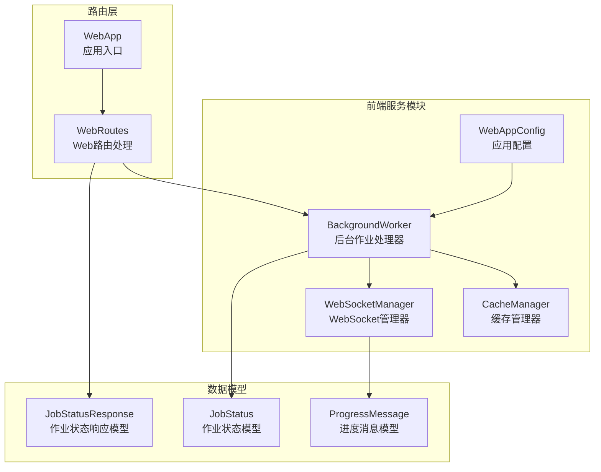
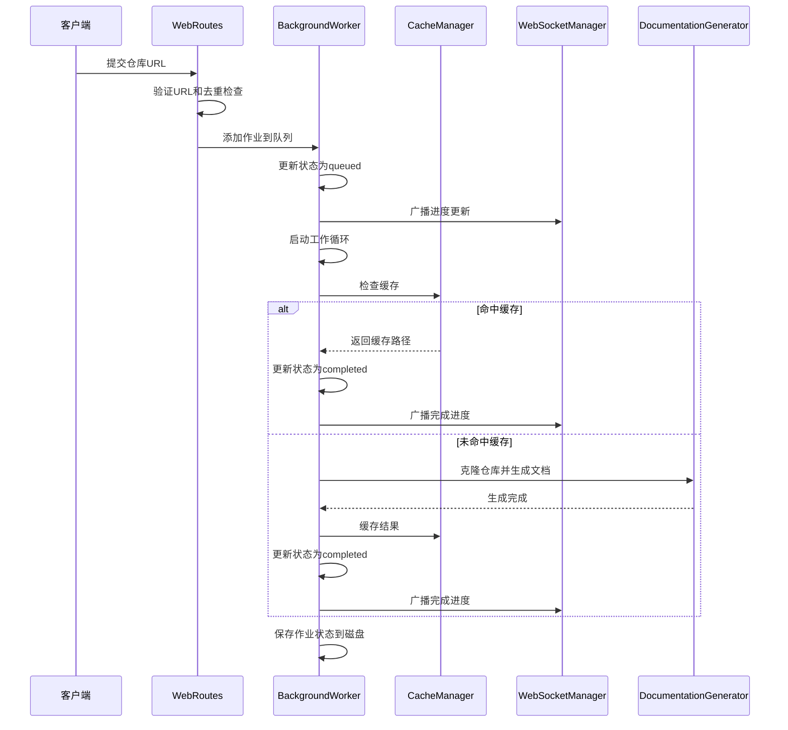
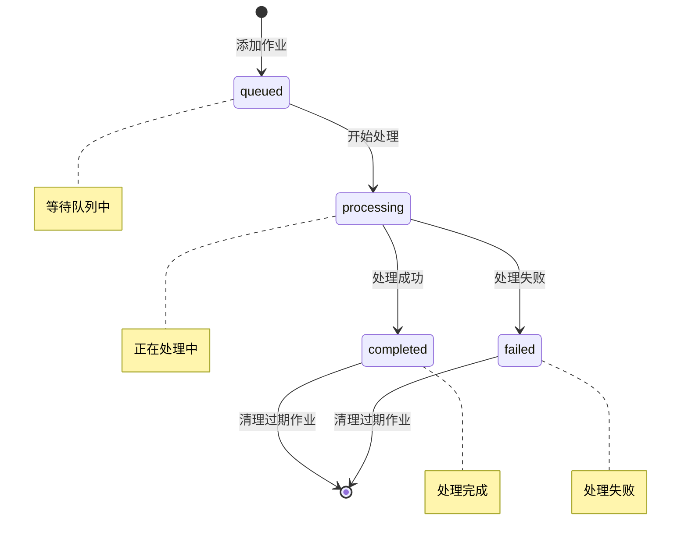
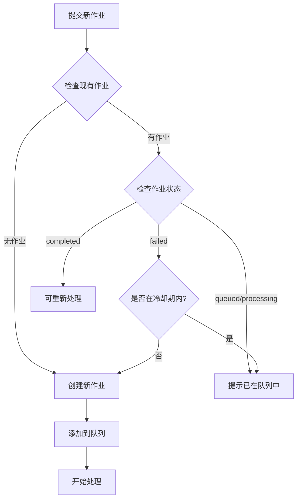
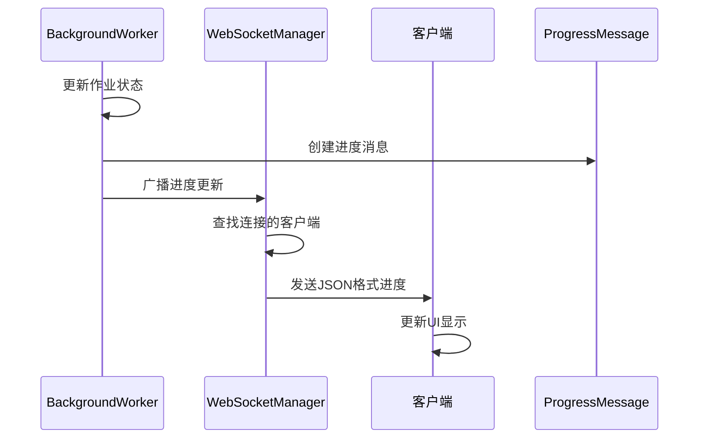
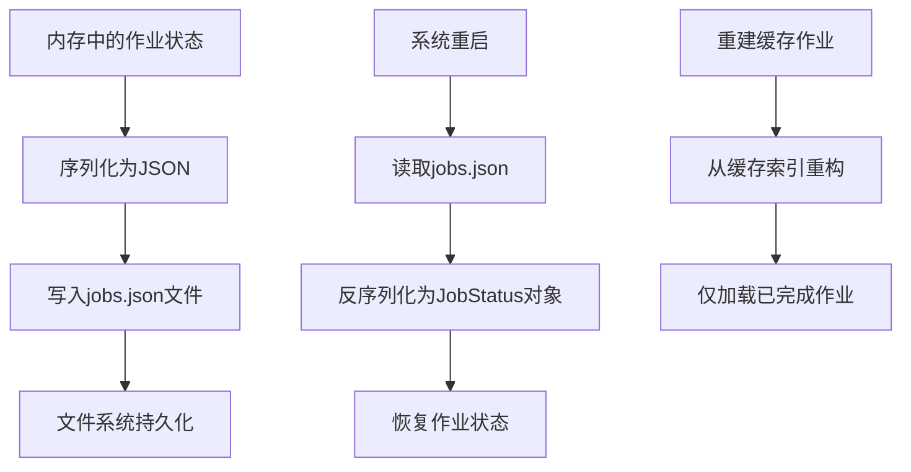
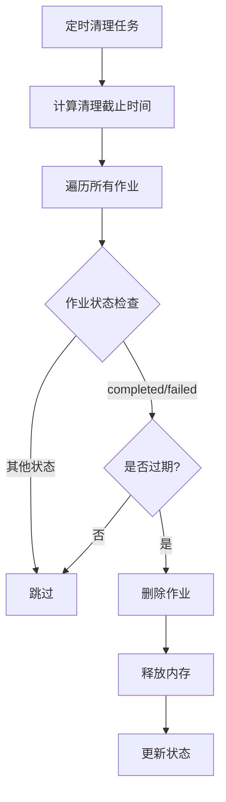
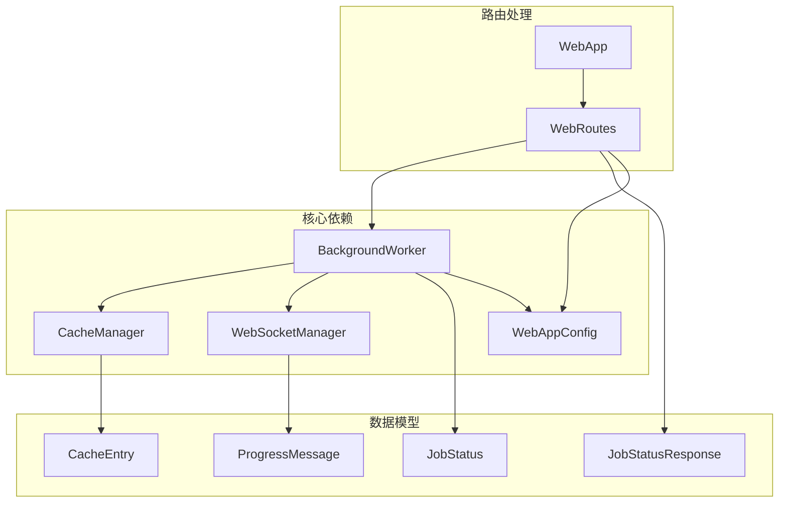

# 作业状态管理

<cite>
**本文档引用的文件**
- [background_worker.py](file://codewiki/src/fe/background_worker.py)
- [models.py](file://codewiki/src/fe/models.py)
- [routes.py](file://codewiki/src/fe/routes.py)
- [config.py](file://codewiki/src/fe/config.py)
- [cache_manager.py](file://codewiki/src/fe/cache_manager.py)
- [websocket_manager.py](file://codewiki/src/fe/websocket_manager.py)
- [web_app.py](file://codewiki/src/fe/web_app.py)
</cite>

## 目录
1. [简介](#简介)
2. [项目结构](#项目结构)
3. [核心组件](#核心组件)
4. [架构概览](#架构概览)
5. [详细组件分析](#详细组件分析)
6. [依赖关系分析](#依赖关系分析)
7. [性能考虑](#性能考虑)
8. [故障排除指南](#故障排除指南)
9. [结论](#结论)

## 简介

本文档详细说明了CodeWiki项目中的作业状态管理系统，重点分析了`background_worker.py`中`BackgroundWorker`类如何管理作业队列、状态存储和生命周期。系统实现了完整的文档生成作业处理流程，包括作业去重机制、冷却策略、实时进度广播和持久化存储。

## 项目结构

作业状态管理系统位于前端服务目录中，采用模块化设计：



**图表来源**
- [background_worker.py](file://codewiki/src/fe/background_worker.py#L26-L50)
- [models.py](file://codewiki/src/fe/models.py#L32-L46)
- [routes.py](file://codewiki/src/fe/routes.py#L25-L31)

**章节来源**
- [background_worker.py](file://codewiki/src/fe/background_worker.py#L1-L50)
- [models.py](file://codewiki/src/fe/models.py#L1-L50)
- [routes.py](file://codewiki/src/fe/routes.py#L1-L30)

## 核心组件

### BackgroundWorker 类

`BackgroundWorker`是作业状态管理系统的核心组件，负责：

- **作业队列管理**：使用线程安全的队列存储待处理作业
- **状态跟踪**：维护内存中的作业状态字典
- **持久化存储**：将作业状态保存到JSON文件
- **生命周期管理**：处理作业从创建到完成的完整生命周期

### JobStatus 模型

`JobStatus`数据类定义了作业状态的完整结构：

| 字段名 | 类型 | 描述 | 默认值 |
|--------|------|------|--------|
| job_id | str | 作业唯一标识符 | 必填 |
| repo_url | str | 仓库URL | 必填 |
| status | str | 作业状态 | 必填 |
| created_at | datetime | 创建时间 | 必填 |
| started_at | datetime | 开始时间 | None |
| completed_at | datetime | 完成时间 | None |
| error_message | str | 错误信息 | None |
| progress | str | 进度描述 | "" |
| docs_path | str | 文档路径 | None |
| main_model | str | 主要模型名称 | None |
| commit_id | str | 提交ID | None |

**章节来源**
- [models.py](file://codewiki/src/fe/models.py#L32-L46)

## 架构概览

系统采用分层架构设计，实现了作业处理的完整生命周期：



**图表来源**
- [routes.py](file://codewiki/src/fe/routes.py#L55-L136)
- [background_worker.py](file://codewiki/src/fe/background_worker.py#L182-L287)
- [websocket_manager.py](file://codewiki/src/fe/websocket_manager.py#L44-L78)

## 详细组件分析

### 作业状态管理

作业系统支持四种核心状态：



**图表来源**
- [models.py](file://codewiki/src/fe/models.py#L37-L37)
- [background_worker.py](file://codewiki/src/fe/background_worker.py#L191-L275)

#### 状态转换条件

1. **queued → processing**：工作线程从队列取出作业开始处理
2. **processing → completed**：文档生成成功完成
3. **processing → failed**：文档生成过程中发生异常
4. **completed/failed → [*]**：超过清理时间阈值后自动清理

### 作业去重机制

系统实现了智能的作业去重策略：



**图表来源**
- [routes.py](file://codewiki/src/fe/routes.py#L80-L98)

冷却策略配置：
- **冷却时间**：3分钟（RETRY_COOLDOWN_MINUTES）
- **适用场景**：最近失败的作业需要等待冷却期才能重新尝试

**章节来源**
- [routes.py](file://codewiki/src/fe/routes.py#L80-L98)
- [config.py](file://codewiki/src/fe/config.py#L26-L26)

### 最近失败作业的冷却策略

冷却机制确保系统不会对失败的作业进行频繁重试：

```mermaid
flowchart LR
A[作业失败] --> B[记录失败时间]
B --> C[等待冷却期(3分钟)]
C --> D{冷却期结束?}
D --> |否| E[阻止重新尝试]
D --> |是| F[允许重新尝试]
E --> G[用户需等待]
F --> H[重新排队处理]
```

**图表来源**
- [routes.py](file://codewiki/src/fe/routes.py#L87-L88)

### 实时进度广播

系统通过WebSocket实现实时进度更新：



**图表来源**
- [background_worker.py](file://codewiki/src/fe/background_worker.py#L167-L181)
- [websocket_manager.py](file://codewiki/src/fe/websocket_manager.py#L44-L78)

**章节来源**
- [websocket_manager.py](file://codewiki/src/fe/websocket_manager.py#L18-L100)

### 持久化机制

作业状态持久化通过jobs.json文件实现：



**图表来源**
- [background_worker.py](file://codewiki/src/fe/background_worker.py#L130-L153)
- [background_worker.py](file://codewiki/src/fe/background_worker.py#L68-L95)

**章节来源**
- [background_worker.py](file://codewiki/src/fe/background_worker.py#L68-L95)
- [background_worker.py](file://codewiki/src/fe/background_worker.py#L130-L153)

### 作业清理策略

系统实现了基于时间的自动清理机制：



**图表来源**
- [routes.py](file://codewiki/src/fe/routes.py#L288-L299)

清理策略配置：
- **清理间隔**：24000小时（约1000天）
- **清理条件**：作业状态为completed或failed且超过清理时间

**章节来源**
- [routes.py](file://codewiki/src/fe/routes.py#L288-L299)
- [config.py](file://codewiki/src/fe/config.py#L25-L25)

## 依赖关系分析

系统各组件之间的依赖关系如下：



**图表来源**
- [background_worker.py](file://codewiki/src/fe/background_worker.py#L18-L25)
- [routes.py](file://codewiki/src/fe/routes.py#L15-L22)

**章节来源**
- [background_worker.py](file://codewiki/src/fe/background_worker.py#L18-L25)
- [routes.py](file://codewiki/src/fe/routes.py#L15-L22)

## 性能考虑

### 队列管理
- **队列大小限制**：最大100个作业
- **线程安全**：使用Python内置Queue确保并发安全
- **阻塞操作**：队列满时会阻塞，避免内存溢出

### 内存优化
- **按需加载**：只加载已完成的作业到内存
- **自动清理**：定期清理过期作业释放内存
- **缓存优先**：优先使用缓存避免重复处理

### I/O优化
- **批量持久化**：批量保存作业状态到磁盘
- **异步WebSocket**：非阻塞的进度广播
- **文件系统缓存**：减少重复的文件操作

## 故障排除指南

### 常见问题及解决方案

1. **作业状态不更新**
   - 检查WebSocket连接状态
   - 验证后台工作进程是否运行
   - 确认进度回调函数正常工作

2. **作业长时间卡在queued状态**
   - 检查队列是否已满
   - 验证后台工作进程是否在运行
   - 查看系统资源使用情况

3. **作业状态丢失**
   - 检查jobs.json文件权限
   - 验证磁盘空间充足
   - 确认文件系统完整性

4. **缓存失效问题**
   - 检查缓存目录权限
   - 验证缓存过期时间设置
   - 确认缓存索引文件完整性

**章节来源**
- [background_worker.py](file://codewiki/src/fe/background_worker.py#L167-L181)
- [routes.py](file://codewiki/src/fe/routes.py#L288-L299)

## 结论

CodeWiki的作业状态管理系统实现了完整的文档生成作业生命周期管理。通过合理的状态设计、智能的去重机制、实时的进度广播和可靠的持久化存储，系统能够高效地处理大量文档生成请求。

关键特性包括：
- **完整的状态管理**：支持四种核心状态的完整转换
- **智能去重**：防止重复处理相同作业
- **冷却策略**：避免对失败作业的频繁重试
- **实时反馈**：通过WebSocket提供实时进度更新
- **持久化存储**：确保作业状态的可靠保存
- **自动清理**：定期清理过期作业释放资源

该系统为文档生成服务提供了稳定、高效的作业管理基础，能够满足生产环境的高可用性要求。