# 作业队列管理

<cite>
**本文档引用的文件**
- [background_worker.py](file://codewiki/src/fe/background_worker.py)
- [config.py](file://codewiki/src/fe/config.py)
- [models.py](file://codewiki/src/fe/models.py)
- [routes.py](file://codewiki/src/fe/routes.py)
- [web_app.py](file://codewiki/src/fe/web_app.py)
</cite>

## 目录
1. [简介](#简介)
2. [项目结构概览](#项目结构概览)
3. [核心组件分析](#核心组件分析)
4. [架构概览](#架构概览)
5. [详细组件分析](#详细组件分析)
6. [依赖关系分析](#依赖关系分析)
7. [性能考虑](#性能考虑)
8. [故障排除指南](#故障排除指南)
9. [结论](#结论)

## 简介

本文档深入分析了CodeWiki项目中`BackgroundWorker`类的作业队列管理系统，重点阐述了基于Python标准库`queue.Queue`实现的线程安全队列机制。该系统通过`WebAppConfig.QUEUE_SIZE`配置参数控制队列的最大容量，实现了高效的后台文档生成作业处理流程。

## 项目结构概览

CodeWiki采用分层架构设计，其中作业队列管理位于前端服务层的核心位置：

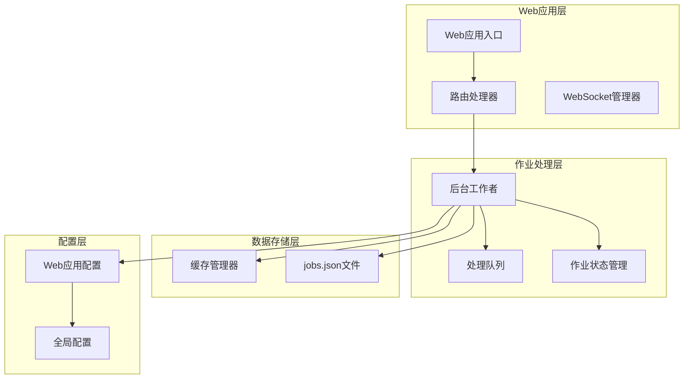

**图表来源**
- [web_app.py](file://codewiki/src/fe/web_app.py#L30-L42)
- [background_worker.py](file://codewiki/src/fe/background_worker.py#L26-L37)
- [config.py](file://codewiki/src/fe/config.py#L10-L35)

**章节来源**
- [web_app.py](file://codewiki/src/fe/web_app.py#L1-L165)
- [background_worker.py](file://codewiki/src/fe/background_worker.py#L1-L294)
- [config.py](file://codewiki/src/fe/config.py#L1-L51)

## 核心组件分析

### BackgroundWorker类概述

`BackgroundWorker`类是整个作业队列系统的核心组件，负责协调文档生成作业的生命周期管理。该类继承了以下关键职责：

- **队列管理**：维护线程安全的作业处理队列
- **状态跟踪**：管理所有作业的实时状态信息
- **并发处理**：通过独立线程实现异步作业处理
- **持久化存储**：将作业状态保存到磁盘文件

### 队列初始化与配置

队列的初始化过程体现了配置驱动的设计理念：

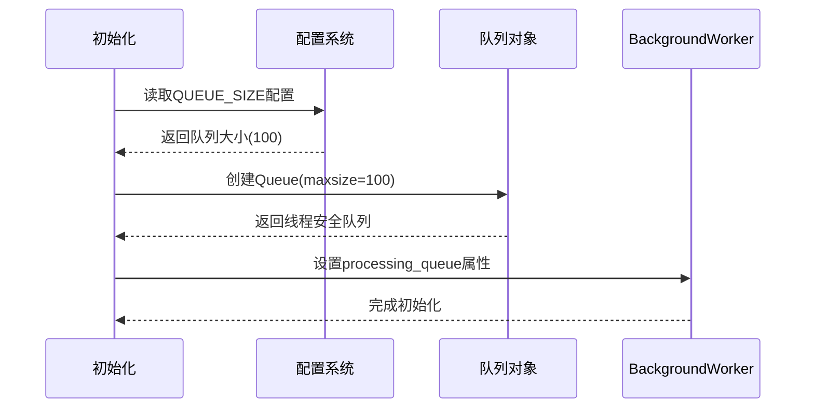

**图表来源**
- [background_worker.py](file://codewiki/src/fe/background_worker.py#L29-L37)
- [config.py](file://codewiki/src/fe/config.py#L18-L20)

**章节来源**
- [background_worker.py](file://codewiki/src/fe/background_worker.py#L26-L37)
- [config.py](file://codewiki/src/fe/config.py#L10-L35)

## 架构概览

### 整体系统架构

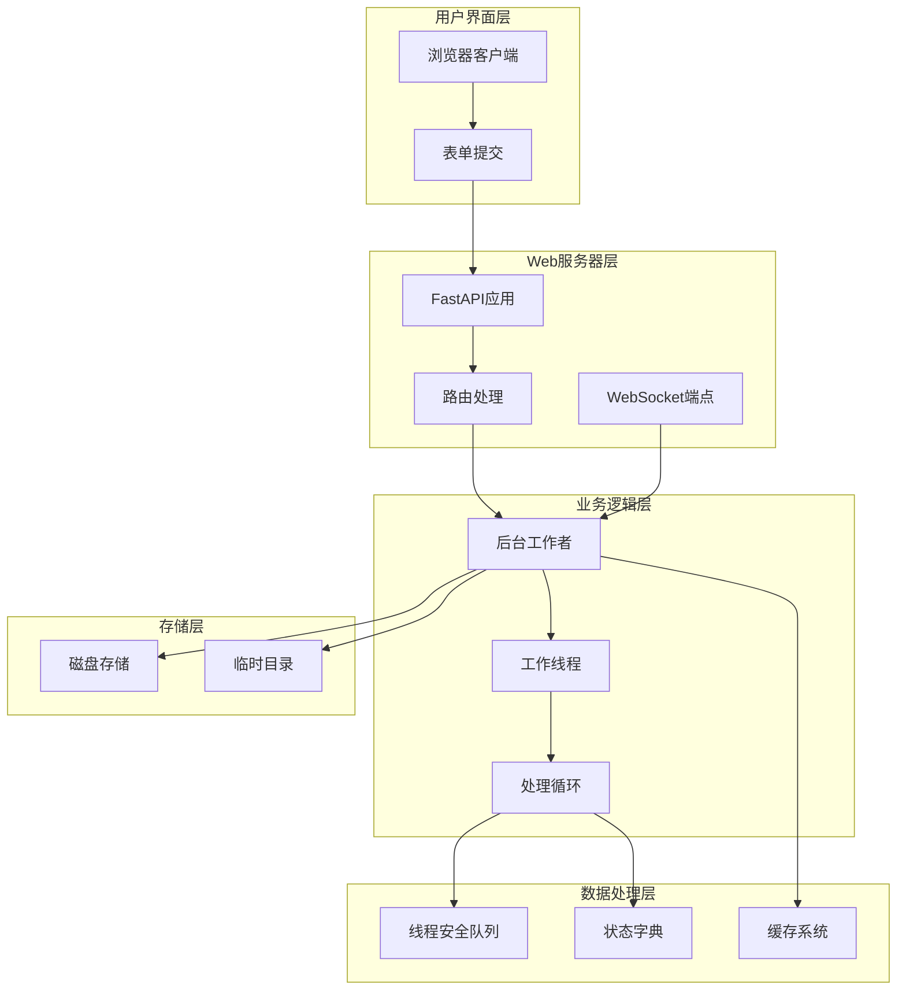

**图表来源**
- [web_app.py](file://codewiki/src/fe/web_app.py#L24-L42)
- [background_worker.py](file://codewiki/src/fe/background_worker.py#L43-L58)

## 详细组件分析

### processing_queue队列管理机制

#### 线程安全队列实现

`processing_queue`基于Python标准库的`queue.Queue`实现，具有以下特性：

- **FIFO顺序**：先进先出的数据结构保证作业处理的公平性
- **线程安全**：内部实现自动处理并发访问，无需额外锁机制
- **阻塞操作**：支持超时机制，避免无限等待
- **容量限制**：通过`maxsize`参数限制队列大小

#### 队列容量配置

队列的最大容量由`WebAppConfig.QUEUE_SIZE`统一管理，默认值为100个作业：

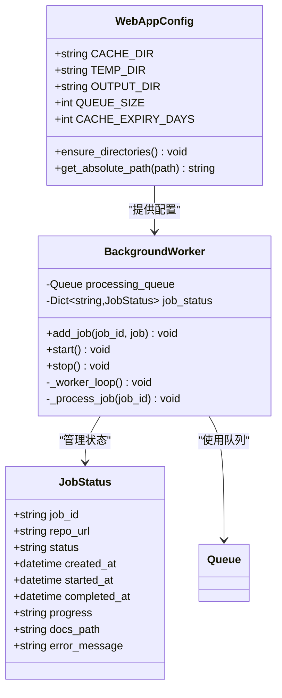

**图表来源**
- [config.py](file://codewiki/src/fe/config.py#L10-L35)
- [background_worker.py](file://codewiki/src/fe/background_worker.py#L26-L45)
- [models.py](file://codewiki/src/fe/models.py#L32-L46)

#### add_job方法实现

`add_job`方法实现了作业入队的核心逻辑：

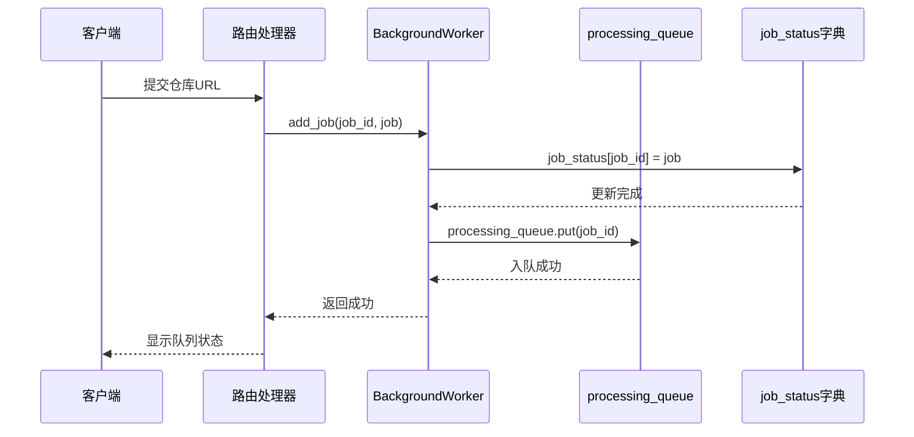

**图表来源**
- [routes.py](file://codewiki/src/fe/routes.py#L117-L131)
- [background_worker.py](file://codewiki/src/fe/background_worker.py#L55-L58)

**章节来源**
- [background_worker.py](file://codewiki/src/fe/background_worker.py#L55-L58)
- [routes.py](file://codewiki/src/fe/routes.py#L117-L131)

#### _worker_loop方法的工作机制

工作循环实现了持续监听队列并处理作业的主逻辑：

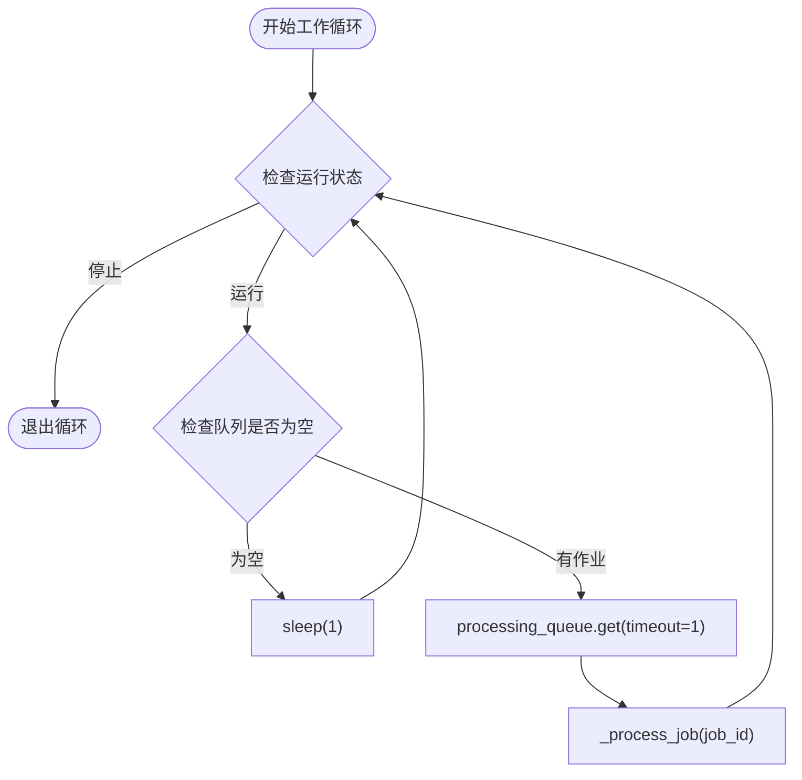

**图表来源**
- [background_worker.py](file://codewiki/src/fe/background_worker.py#L154-L165)

**章节来源**
- [background_worker.py](file://codewiki/src/fe/background_worker.py#L154-L165)

### 作业处理流程

#### _process_job方法的完整处理链路

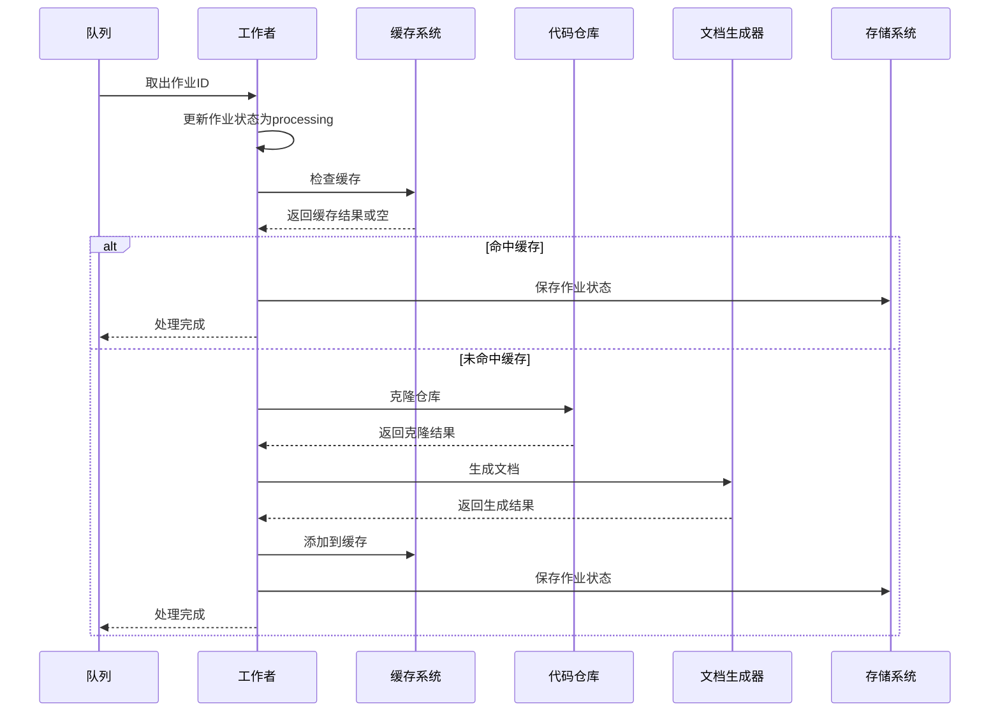

**图表来源**
- [background_worker.py](file://codewiki/src/fe/background_worker.py#L182-L287)

**章节来源**
- [background_worker.py](file://codewiki/src/fe/background_worker.py#L182-L287)

### 队列满时的行为分析

当队列达到最大容量（100）时，新的作业添加操作会触发阻塞行为：

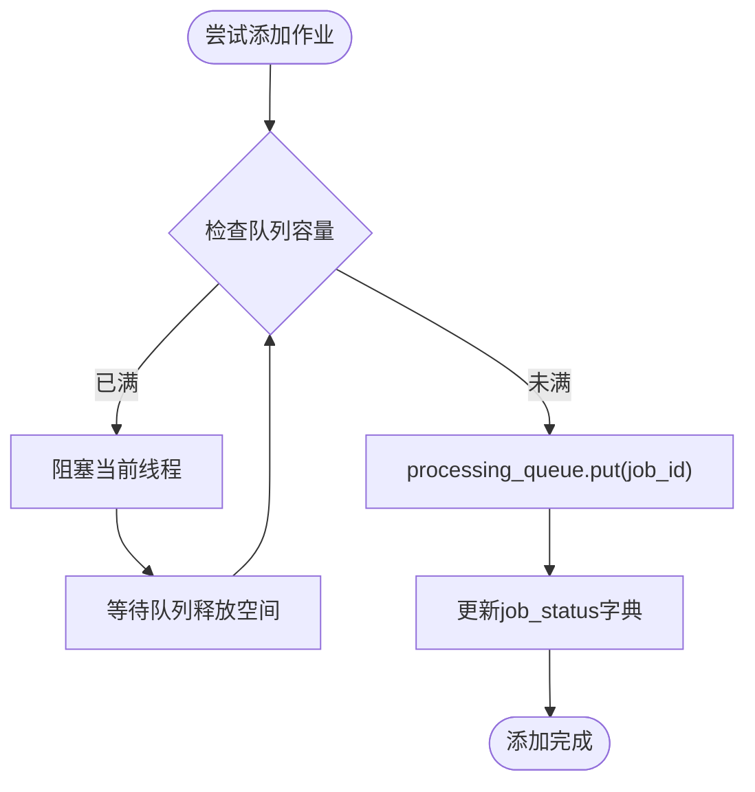

**图表来源**
- [background_worker.py](file://codewiki/src/fe/background_worker.py#L55-L58)

**章节来源**
- [background_worker.py](file://codewiki/src/fe/background_worker.py#L55-L58)

## 依赖关系分析

### 组件间依赖关系

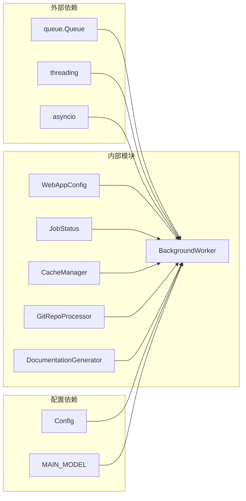

**图表来源**
- [background_worker.py](file://codewiki/src/fe/background_worker.py#L14-L24)
- [config.py](file://codewiki/src/fe/config.py#L10-L35)

**章节来源**
- [background_worker.py](file://codewiki/src/fe/background_worker.py#L1-L294)
- [config.py](file://codewiki/src/fe/config.py#L1-L51)

### 错误处理与异常管理

系统实现了多层次的错误处理机制：

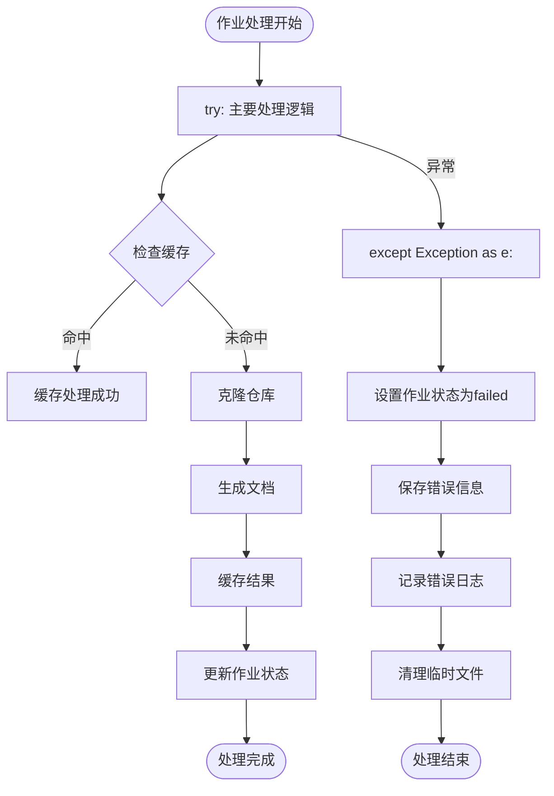

**图表来源**
- [background_worker.py](file://codewiki/src/fe/background_worker.py#L273-L287)

**章节来源**
- [background_worker.py](file://codewiki/src/fe/background_worker.py#L273-L287)

## 性能考虑

### 队列容量对系统性能的影响

1. **内存使用优化**
   - 队列大小限制为100，有效控制内存占用
   - 每个作业约占用1KB内存，总内存占用约100KB
   - 结合作业状态字典，内存使用量可控

2. **并发处理能力**
   - 单线程处理模式避免了复杂的并发同步问题
   - 通过异步事件循环处理文档生成任务
   - WebSocket广播采用异步方式，不影响队列处理

3. **阻塞行为的性能影响**
   - 队列满时的阻塞是预期行为，防止系统过载
   - 客户端在阻塞期间会收到队列排队状态
   - 合理的队列容量平衡了系统吞吐量和响应时间

### 优化建议

1. **动态队列调整**
   - 根据系统负载动态调整`QUEUE_SIZE`参数
   - 实现队列监控和告警机制

2. **多线程处理**
   - 考虑引入多个工作线程提高并发处理能力
   - 实现作业优先级队列

3. **内存管理优化**
   - 实现作业状态的定期清理机制
   - 优化大型作业的内存使用

## 故障排除指南

### 常见问题诊断

1. **队列满导致的阻塞**
   - 症状：新作业无法立即入队
   - 解决方案：检查系统处理速度，适当调整队列大小

2. **作业状态不一致**
   - 症状：作业状态显示异常
   - 解决方案：检查`jobs.json`文件完整性，重新加载作业状态

3. **缓存失效**
   - 症状：缓存文档无法正常显示
   - 解决方案：验证缓存路径有效性，重新生成缓存

### 调试工具和方法

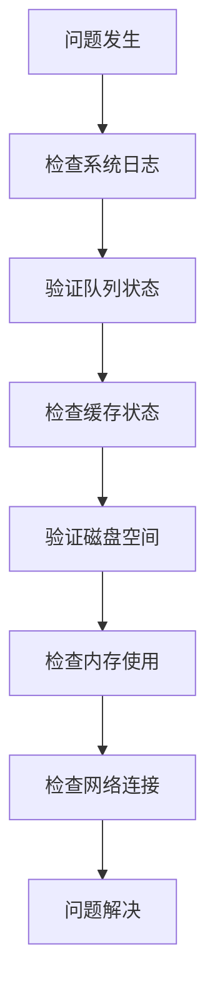

**章节来源**
- [background_worker.py](file://codewiki/src/fe/background_worker.py#L93-L94)
- [background_worker.py](file://codewiki/src/fe/background_worker.py#L163-L165)

## 结论

CodeWiki项目的`BackgroundWorker`类通过精心设计的作业队列管理系统，实现了高效、可靠的文档生成服务。该系统的关键优势包括：

1. **线程安全的队列实现**：基于Python标准库的`queue.Queue`确保了并发环境下的数据一致性
2. **配置驱动的设计**：通过`WebAppConfig.QUEUE_SIZE`统一管理队列容量，便于系统调优
3. **完整的生命周期管理**：从作业入队到完成处理的全流程状态跟踪
4. **健壮的错误处理**：多层次的异常捕获和恢复机制

该队列管理系统为CodeWiki提供了稳定的服务基础，能够有效处理大量并发的文档生成请求，同时保持系统的可维护性和可扩展性。