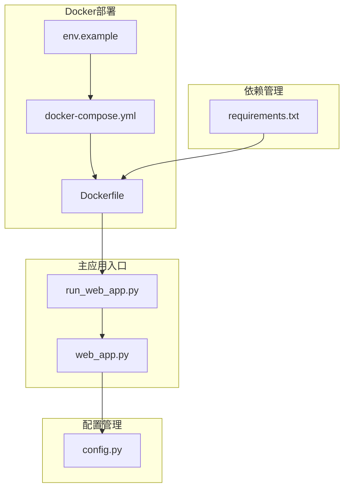
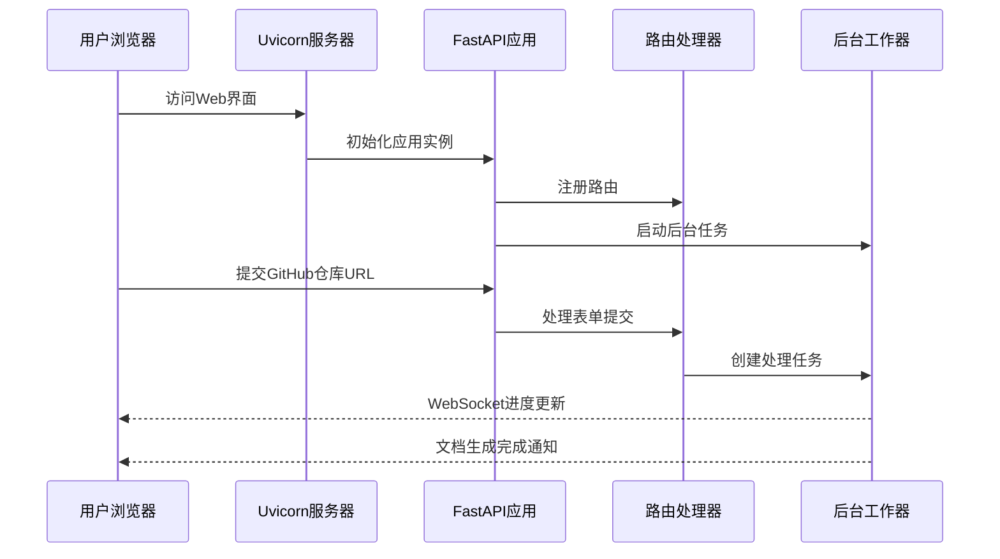
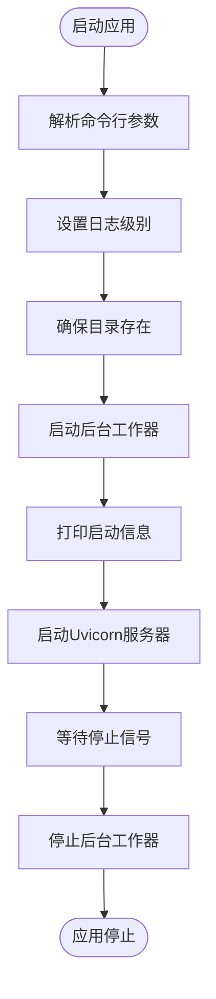
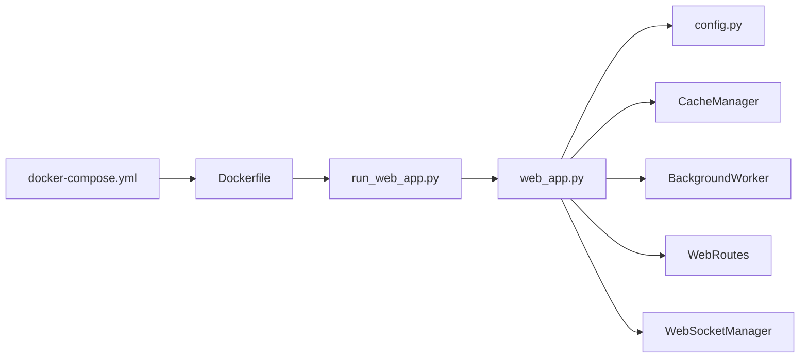

# 启动Web服务

<cite>
**本文档引用的文件**
- [run_web_app.py](file://codewiki/run_web_app.py)
- [web_app.py](file://codewiki/src/fe/web_app.py)
- [config.py](file://codewiki/src/fe/config.py)
- [Dockerfile](file://docker/Dockerfile)
- [docker-compose.yml](file://docker/docker-compose.yml)
- [env.example](file://docker/env.example)
- [requirements.txt](file://requirements.txt)
- [README.md](file://README.md)
- [DEVELOPMENT.md](file://DEVELOPMENT.md)
</cite>

## 目录
1. [简介](#简介)
2. [项目结构](#项目结构)
3. [核心组件](#核心组件)
4. [架构概览](#架构概览)
5. [详细组件分析](#详细组件分析)
6. [依赖关系分析](#依赖关系分析)
7. [性能考虑](#性能考虑)
8. [故障排除指南](#故障排除指南)
9. [结论](#结论)

## 简介

CodeWiki是一个基于AI的代码仓库文档生成框架，提供了Web界面用于提交GitHub仓库进行文档生成。本文档详细说明了如何启动CodeWiki Web服务，包括直接运行和Docker容器化部署两种方式，并解释了所有支持的命令行参数和配置选项。

## 项目结构

CodeWiki采用模块化架构，主要包含以下关键组件：



**图表来源**
- [run_web_app.py](file://codewiki/run_web_app.py#L1-L16)
- [web_app.py](file://codewiki/src/fe/web_app.py#L1-L165)
- [config.py](file://codewiki/src/fe/config.py#L1-L51)

**章节来源**
- [run_web_app.py](file://codewiki/run_web_app.py#L1-L16)
- [web_app.py](file://codewiki/src/fe/web_app.py#L1-L165)
- [config.py](file://codewiki/src/fe/config.py#L1-L51)

## 核心组件

### Web应用入口点

CodeWiki提供了两种启动Web服务的方式：

1. **直接运行方式**：通过`python run_web_app.py`命令启动
2. **Docker容器化方式**：通过Docker镜像部署

### 命令行参数支持

Web应用通过`web_app.py`中的`main()`函数支持以下命令行参数：

- `--host`：指定服务器绑定的主机地址，默认值来自配置类
- `--port`：指定服务器运行的端口号，默认值来自配置类  
- `--debug`：启用调试模式
- `--reload`：启用开发时自动重载功能

**章节来源**
- [web_app.py](file://codewiki/src/fe/web_app.py#L94-L165)

## 架构概览

CodeWiki Web服务采用FastAPI框架构建，具有以下核心架构特点：



**图表来源**
- [web_app.py](file://codewiki/src/fe/web_app.py#L24-L92)

## 详细组件分析

### 配置系统

Web应用的配置系统位于`config.py`文件中，定义了以下关键配置项：

#### 目录配置
- `CACHE_DIR`：缓存目录，默认为`"./output/cache"`
- `TEMP_DIR`：临时目录，默认为`"./output/temp"`
- `OUTPUT_DIR`：输出目录，默认为`"./output"`

#### 队列和缓存设置
- `QUEUE_SIZE`：队列大小，默认为100
- `CACHE_EXPIRY_DAYS`：缓存过期天数，默认为365天

#### 作业管理设置
- `JOB_CLEANUP_HOURS`：作业清理小时数，默认为24000
- `RETRY_COOLDOWN_MINUTES`：重试冷却时间，默认为3分钟

#### 服务器设置
- `DEFAULT_HOST`：默认主机地址，默认为`"127.0.0.1"`
- `DEFAULT_PORT`：默认端口号，默认为8000

#### Git设置
- `CLONE_TIMEOUT`：克隆超时时间，默认为300秒
- `CLONE_DEPTH`：克隆深度，默认为1

**章节来源**
- [config.py](file://codewiki/src/fe/config.py#L10-L51)

### Web应用初始化流程

Web应用的启动流程包括以下关键步骤：



**图表来源**
- [web_app.py](file://codewiki/src/fe/web_app.py#L94-L165)

**章节来源**
- [web_app.py](file://codewiki/src/fe/web_app.py#L94-L165)

### Docker部署配置

Docker配置提供了完整的容器化部署方案：

#### Dockerfile配置要点
- 基础镜像：Python 3.12 slim
- 系统依赖：git、curl、nodejs、npm
- 端口暴露：8000
- 默认命令：启动Web应用

#### docker-compose配置
- 端口映射：`${APP_PORT:-8000}:8000`
- 持久化存储：挂载output目录
- 环境变量：PYTHONPATH、PYTHONUNBUFFERED、LANGUAGE

**章节来源**
- [Dockerfile](file://docker/Dockerfile#L1-L47)
- [docker-compose.yml](file://docker/docker-compose.yml#L1-L37)

## 依赖关系分析

### Python依赖管理

项目使用requirements.txt管理Python依赖，核心依赖包括：

- **FastAPI**：Web框架，版本0.116.1
- **Uvicorn**：ASGI服务器，版本0.35.0
- **LLM集成**：支持多种大语言模型提供商
- **Git集成**：GitPython 3.1.40
- **前端工具**：Node.js生态系统

### 启动流程依赖关系



**图表来源**
- [run_web_app.py](file://codewiki/run_web_app.py#L13)
- [web_app.py](file://codewiki/src/fe/web_app.py#L17-L21)

**章节来源**
- [requirements.txt](file://requirements.txt#L1-L165)
- [run_web_app.py](file://codewiki/run_web_app.py#L1-L16)

## 性能考虑

### 缓存策略
- 默认缓存过期时间为365天
- 支持目录自动创建和管理
- 输出目录结构优化

### 并发处理
- 队列大小默认100
- 后台工作器异步处理文档生成
- WebSocket实时进度更新

### 内存管理
- 临时文件自动清理
- 进程间通信优化
- 资源池管理

## 故障排除指南

### 端口占用问题

**问题症状**：启动时出现端口被占用错误

**解决方案**：
1. 检查端口占用情况
   ```bash
   lsof -i :8000
   ```
2. 更改端口号
   ```bash
   python run_web_app.py --port 8080
   ```
3. 使用Docker时修改端口映射
   ```bash
   export APP_PORT=8080
   docker-compose up
   ```

### 权限问题

**问题症状**：无法创建目录或写入文件

**解决方案**：
1. 检查目录权限
   ```bash
   ls -la output/
   ```
2. 修改目录权限
   ```bash
   chmod 755 output/
   ```
3. 使用Docker持久化存储
   ```bash
   docker-compose up -d
   ```

### 依赖缺失问题

**问题症状**：启动时报错缺少依赖

**解决方案**：
1. 安装完整依赖
   ```bash
   pip install -r requirements.txt
   ```
2. 检查Python版本
   ```bash
   python --version
   ```
3. 验证Node.js安装（用于Mermaid验证）
   ```bash
   node --version
   ```

### 环境变量配置

支持的环境变量配置：

| 环境变量 | 默认值 | 描述 |
|---------|--------|------|
| LOG_LEVEL | INFO | 日志级别（DEBUG/INFO/WARNING/ERROR/CRITICAL） |
| PYTHONPATH | /app | Python路径 |
| PYTHONUNBUFFERED | 1 | 禁用Python缓冲 |
| LANGUAGE | chinese | 文档语言 |

**章节来源**
- [web_app.py](file://codewiki/src/fe/web_app.py#L128-L136)
- [env.example](file://docker/env.example#L31-L36)

### 常见启动问题

#### 启动失败排查步骤
1. **检查Python环境**
   ```bash
   python --version
   python -c "import fastapi"
   ```

2. **验证依赖完整性**
   ```bash
   pip list | grep -E "(fastapi|uvicorn|git)"
   ```

3. **检查网络连接**
   ```bash
   curl -I https://api.github.com
   ```

4. **查看详细错误信息**
   ```bash
   python run_web_app.py --debug
   ```

#### Docker部署问题
1. **镜像构建失败**
   ```bash
   docker build -t codewiki:latest .
   ```

2. **容器启动失败**
   ```bash
   docker logs codewiki
   ```

3. **端口映射问题**
   ```bash
   docker port codewiki
   ```

**章节来源**
- [DEVELOPMENT.md](file://DEVELOPMENT.md#L218-L232)

## 结论

CodeWiki Web服务提供了灵活的启动方式和完善的配置管理。通过理解命令行参数、配置选项和Docker部署配置，用户可以轻松地在不同环境中启动和运行CodeWiki服务。建议在生产环境中使用Docker部署，在开发环境中使用直接运行方式。

关键要点：
- 支持多种启动方式：直接运行和Docker容器化
- 完善的配置管理系统
- 详细的错误处理和故障排除指南
- 可扩展的架构设计