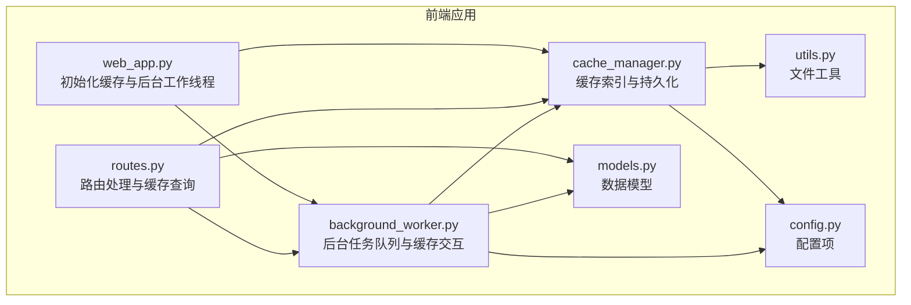
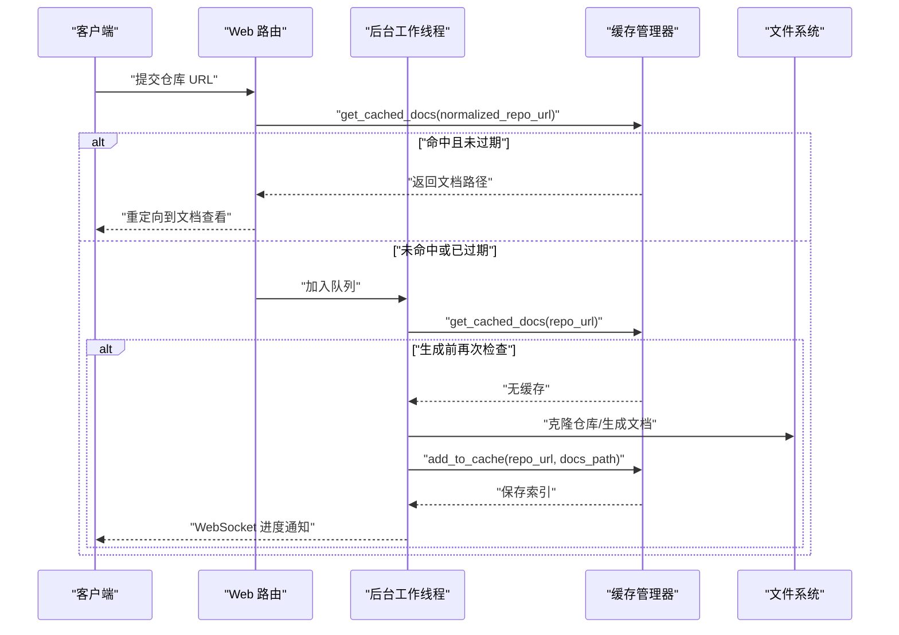
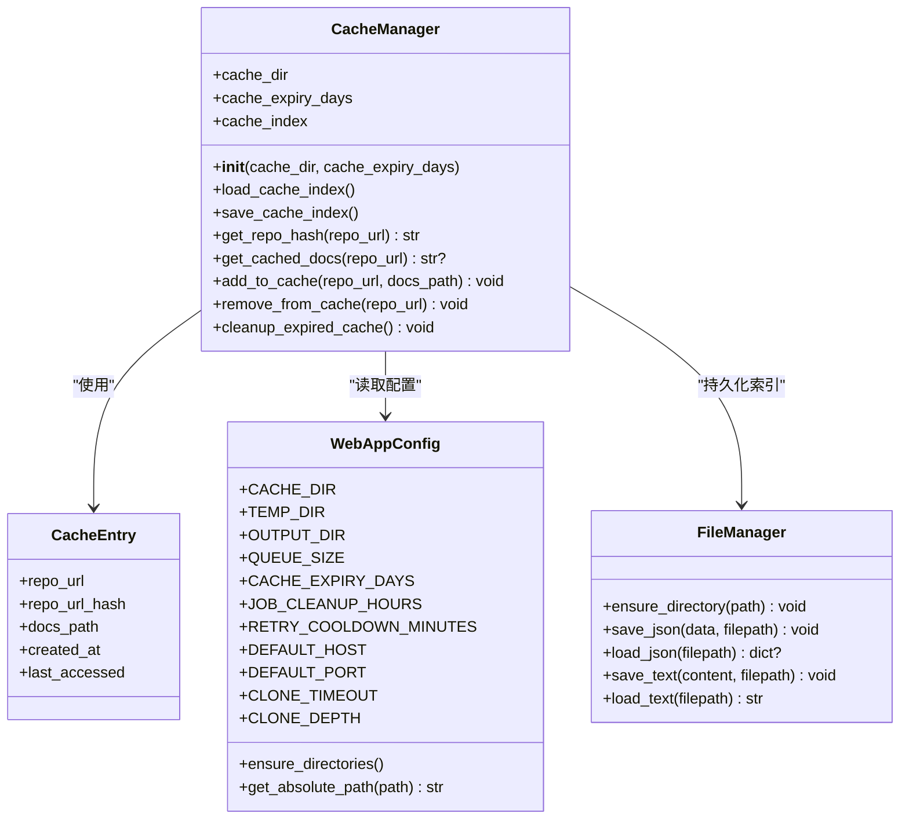
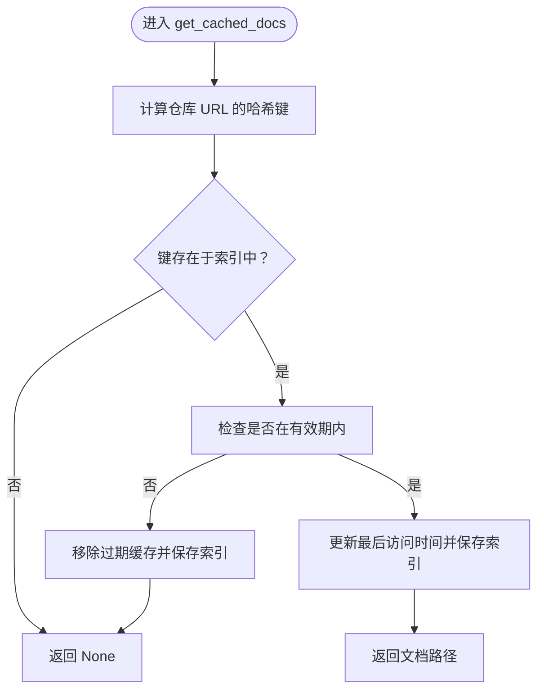
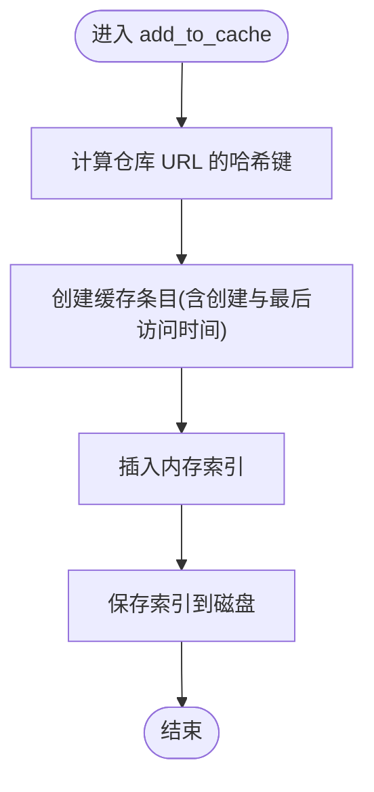
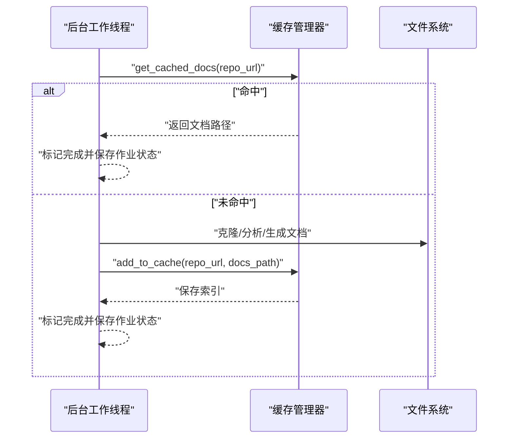
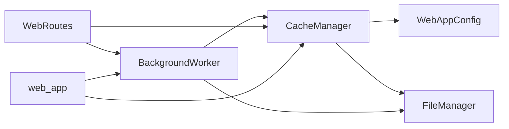

# 缓存系统

<cite>
**本文引用的文件**
- [cache_manager.py](file://codewiki/src/fe/cache_manager.py)
- [background_worker.py](file://codewiki/src/fe/background_worker.py)
- [models.py](file://codewiki/src/fe/models.py)
- [config.py](file://codewiki/src/fe/config.py)
- [utils.py](file://codewiki/src/utils.py)
- [web_app.py](file://codewiki/src/fe/web_app.py)
- [routes.py](file://codewiki/src/fe/routes.py)
</cite>

## 目录
1. [简介](#简介)
2. [项目结构](#项目结构)
3. [核心组件](#核心组件)
4. [架构总览](#架构总览)
5. [详细组件分析](#详细组件分析)
6. [依赖关系分析](#依赖关系分析)
7. [性能考量](#性能考量)
8. [故障排查指南](#故障排查指南)
9. [结论](#结论)
10. [附录](#附录)

## 简介
本文件围绕前端缓存系统进行深入解析，重点基于 `cache_manager.py` 中的 `CacheManager` 类，阐述其如何通过 SHA-256 哈希对仓库 URL 进行索引，并将生成的文档结果持久化到文件系统；同时详细说明 `get_cached_docs` 和 `add_to_cache` 的实现逻辑、缓存有效期与访问时间更新机制、缓存索引文件 `cache_index.json` 的结构与持久化过程，以及 `background_worker.py` 在文档生成前后如何查询与更新缓存。最后给出缓存命中率优化建议与手动清理缓存的方法。

## 项目结构
缓存系统主要由以下模块组成：
- 缓存管理器：负责缓存索引加载/保存、哈希计算、缓存查询与写入、过期清理等
- 后台工作线程：负责排队处理文档生成任务，在生成前查询缓存、生成后写入缓存
- 数据模型：定义缓存条目与作业状态的数据结构
- 配置：提供缓存目录、临时目录、缓存有效期等配置项
- 文件工具：封装 JSON 读写与文本读写
- Web 应用与路由：初始化缓存管理器与后台工作线程，并在用户提交请求时检查缓存

图表来源
- [web_app.py](file://codewiki/src/fe/web_app.py#L30-L41)
- [routes.py](file://codewiki/src/fe/routes.py#L25-L31)
- [background_worker.py](file://codewiki/src/fe/background_worker.py#L26-L38)
- [cache_manager.py](file://codewiki/src/fe/cache_manager.py#L16-L24)
- [models.py](file://codewiki/src/fe/models.py#L32-L56)
- [config.py](file://codewiki/src/fe/config.py#L10-L27)
- [utils.py](file://codewiki/src/utils.py#L10-L45)

章节来源
- [web_app.py](file://codewiki/src/fe/web_app.py#L30-L41)
- [routes.py](file://codewiki/src/fe/routes.py#L25-L31)
- [background_worker.py](file://codewiki/src/fe/background_worker.py#L26-L38)
- [cache_manager.py](file://codewiki/src/fe/cache_manager.py#L16-L24)
- [models.py](file://codewiki/src/fe/models.py#L32-L56)
- [config.py](file://codewiki/src/fe/config.py#L10-L27)
- [utils.py](file://codewiki/src/utils.py#L10-L45)

## 核心组件
- CacheManager：负责缓存索引的内存结构、磁盘持久化、哈希索引、缓存查询与写入、过期清理
- BackgroundWorker：负责后台任务队列、进度广播、生成前查询缓存、生成后写入缓存
- CacheEntry：缓存条目的数据结构，包含仓库 URL、哈希、文档路径、创建时间与最后访问时间
- WebAppConfig：提供缓存目录、临时目录、缓存有效期等配置
- FileManager：封装 JSON 读写与文本读写

章节来源
- [cache_manager.py](file://codewiki/src/fe/cache_manager.py#L16-L119)
- [models.py](file://codewiki/src/fe/models.py#L48-L56)
- [config.py](file://codewiki/src/fe/config.py#L10-L27)
- [utils.py](file://codewiki/src/utils.py#L10-L45)
- [background_worker.py](file://codewiki/src/fe/background_worker.py#L26-L38)

## 架构总览
缓存系统采用“内存索引 + 磁盘持久化”的设计：
- 内存中维护一个字典作为缓存索引，键为仓库 URL 的短 SHA-256 哈希，值为缓存条目
- 每次启动或访问缓存时从磁盘加载 `cache_index.json` 到内存
- 查询缓存时根据仓库 URL 计算哈希，判断是否命中且未过期；若命中则更新最后访问时间并返回文档路径
- 写入缓存时创建新的缓存条目并保存到磁盘
- 提供过期清理方法，定期移除已过期的缓存条目

图表来源
- [routes.py](file://codewiki/src/fe/routes.py#L99-L136)
- [background_worker.py](file://codewiki/src/fe/background_worker.py#L199-L216)
- [cache_manager.py](file://codewiki/src/fe/cache_manager.py#L65-L82)
- [cache_manager.py](file://codewiki/src/fe/cache_manager.py#L84-L97)

## 详细组件分析

### CacheManager 类
- 初始化与索引加载
  - 使用配置中的缓存目录与有效期参数初始化
  - 创建缓存目录并加载 `cache_index.json` 到内存字典
- 哈希索引
  - 使用 SHA-256 对仓库 URL 进行哈希，取前 16 位作为索引键，避免冲突并控制键长度
- 查询缓存 get_cached_docs
  - 计算仓库 URL 的哈希键
  - 若存在该键，检查创建时间与当前时间差是否小于有效期
  - 若未过期，更新最后访问时间并保存索引，返回文档路径
  - 若已过期，调用移除方法清理该缓存条目
- 写入缓存 add_to_cache
  - 计算哈希键，创建新的缓存条目（包含仓库 URL、哈希、文档路径、创建时间与最后访问时间）
  - 将新条目写入内存索引并保存到磁盘
- 移除缓存 remove_from_cache
  - 根据哈希键删除对应条目并保存索引
- 过期清理 cleanup_expired_cache
  - 遍历内存索引，筛选创建时间早于有效期阈值的条目，批量删除并保存索引

图表来源
- [cache_manager.py](file://codewiki/src/fe/cache_manager.py#L16-L119)
- [models.py](file://codewiki/src/fe/models.py#L48-L56)
- [config.py](file://codewiki/src/fe/config.py#L10-L27)
- [utils.py](file://codewiki/src/utils.py#L10-L45)

章节来源
- [cache_manager.py](file://codewiki/src/fe/cache_manager.py#L16-L119)
- [models.py](file://codewiki/src/fe/models.py#L48-L56)
- [config.py](file://codewiki/src/fe/config.py#L10-L27)
- [utils.py](file://codewiki/src/utils.py#L10-L45)

### get_cached_docs 方法实现逻辑
- 输入：仓库 URL
- 步骤：
  1) 计算仓库 URL 的短哈希键
  2) 若键存在于内存索引中：
     - 计算当前时间与创建时间的时间差
     - 若小于有效期，则更新最后访问时间为当前时间并保存索引，返回文档路径
     - 否则调用移除方法清理该缓存条目
  3) 若键不存在或已过期，返回空值

图表来源
- [cache_manager.py](file://codewiki/src/fe/cache_manager.py#L65-L82)

章节来源
- [cache_manager.py](file://codewiki/src/fe/cache_manager.py#L65-L82)

### add_to_cache 方法实现逻辑
- 输入：仓库 URL、文档路径
- 步骤：
  1) 计算仓库 URL 的短哈希键
  2) 创建新的缓存条目，设置仓库 URL、哈希、文档路径、创建时间与最后访问时间为当前时间
  3) 将新条目写入内存索引
  4) 保存索引到磁盘

图表来源
- [cache_manager.py](file://codewiki/src/fe/cache_manager.py#L84-L97)

章节来源
- [cache_manager.py](file://codewiki/src/fe/cache_manager.py#L84-L97)

### 缓存有效期与访问时间更新机制
- 有效期：来源于配置项 `WebAppConfig.CACHE_EXPIRY_DAYS`，默认一年
- 更新策略：
  - 查询命中时自动更新最后访问时间，确保活跃缓存不会被清理
  - 写入缓存时创建时间与最后访问时间均设为当前时间
  - 过期清理时仅移除创建时间早于有效期阈值的条目

章节来源
- [config.py](file://codewiki/src/fe/config.py#L21-L22)
- [cache_manager.py](file://codewiki/src/fe/cache_manager.py#L73-L76)
- [cache_manager.py](file://codewiki/src/fe/cache_manager.py#L89-L95)
- [cache_manager.py](file://codewiki/src/fe/cache_manager.py#L106-L119)

### 缓存索引文件 cache_index.json 结构与持久化
- 文件位置：缓存目录下的 `cache_index.json`
- 结构要点：
  - 键：仓库 URL 的短哈希字符串
  - 值：包含仓库 URL、哈希、文档路径、创建时间、最后访问时间的对象
  - 时间字段以 ISO 格式字符串存储，便于跨进程与跨重启恢复
- 加载与保存：
  - 加载：启动时从磁盘读取 JSON 并转换为内存字典
  - 保存：每次新增、更新、删除缓存条目后同步写回磁盘

章节来源
- [cache_manager.py](file://codewiki/src/fe/cache_manager.py#L26-L59)
- [utils.py](file://codewiki/src/utils.py#L19-L31)

### background_worker.py 的缓存查询与更新流程
- 文档生成前查询缓存：
  - 在处理单个作业时，先调用 `cache_manager.get_cached_docs(repo_url)`
  - 若返回有效路径且文档目录存在，则直接标记作业完成并发送进度
- 文档生成后更新缓存：
  - 文档生成完成后，调用 `cache_manager.add_to_cache(repo_url, docs_path)` 将结果写入缓存
- 作业状态与进度：
  - 通过 WebSocket 广播进度消息，支持实时反馈
  - 作业状态包含排队、处理中、完成、失败等阶段

图表来源
- [background_worker.py](file://codewiki/src/fe/background_worker.py#L199-L216)
- [background_worker.py](file://codewiki/src/fe/background_worker.py#L255-L269)
- [cache_manager.py](file://codewiki/src/fe/cache_manager.py#L65-L82)
- [cache_manager.py](file://codewiki/src/fe/cache_manager.py#L84-L97)

章节来源
- [background_worker.py](file://codewiki/src/fe/background_worker.py#L182-L287)
- [cache_manager.py](file://codewiki/src/fe/cache_manager.py#L65-L97)

### 路由层的缓存使用
- 用户提交仓库 URL 后，路由层会：
  - 规范化仓库 URL
  - 调用 `cache_manager.get_cached_docs(normalized_repo_url)`
  - 若命中且文档存在，构造一个已完成的作业状态用于展示，并重定向到文档查看
  - 否则将作业加入后台队列等待处理

章节来源
- [routes.py](file://codewiki/src/fe/routes.py#L99-L136)

## 依赖关系分析
- 组件耦合
  - CacheManager 依赖 WebAppConfig 获取缓存目录与有效期，依赖 FileManager 进行 JSON 持久化
  - BackgroundWorker 依赖 CacheManager 进行缓存查询与写入，依赖 FileManager 保存作业状态
  - Web 应用与路由层依赖 CacheManager 与 BackgroundWorker 完成业务闭环
- 外部依赖
  - 文件系统：用于缓存目录、文档目录与索引文件的读写
  - WebSocket：用于进度广播
- 循环依赖
  - 未发现循环依赖，模块职责清晰

图表来源
- [cache_manager.py](file://codewiki/src/fe/cache_manager.py#L11-L13)
- [background_worker.py](file://codewiki/src/fe/background_worker.py#L18-L24)
- [routes.py](file://codewiki/src/fe/routes.py#L15-L22)
- [web_app.py](file://codewiki/src/fe/web_app.py#L31-L41)

章节来源
- [cache_manager.py](file://codewiki/src/fe/cache_manager.py#L11-L13)
- [background_worker.py](file://codewiki/src/fe/background_worker.py#L18-L24)
- [routes.py](file://codewiki/src/fe/routes.py#L15-L22)
- [web_app.py](file://codewiki/src/fe/web_app.py#L31-L41)

## 性能考量
- 哈希索引复杂度
  - 字典查找平均 O(1)，哈希计算 O(n)（n 为 URL 长度），整体查询高效
- 索引大小与内存占用
  - 短哈希键长度固定，索引大小取决于缓存条目数量；可通过定期清理过期条目控制内存
- 磁盘 I/O
  - 每次新增/更新/删除都会触发一次磁盘写入；建议在批量操作后统一保存（当前实现已在每次变更后保存）
- 有效期与命中率
  - 较长的有效期可提升命中率，但会增加磁盘占用；较短的有效期可节省空间但可能降低命中率
- 并发与一致性
  - 当前实现未显式加锁，若多线程并发修改同一索引需考虑竞态；可在关键路径上引入锁或使用原子写入策略

[本节为通用性能讨论，不直接分析具体文件]

## 故障排查指南
- 缓存索引加载失败
  - 现象：启动时报错或索引为空
  - 排查：检查缓存目录权限、JSON 文件格式是否正确
  - 参考：索引加载与保存的异常捕获逻辑
- 缓存命中但文档缺失
  - 现象：返回文档路径但文件不存在
  - 排查：确认文档生成路径是否正确、生成流程是否成功
  - 参考：后台工作线程在生成后写入缓存的逻辑
- 过期缓存未清理
  - 现象：缓存目录持续增长
  - 排查：调用清理方法或定期执行清理脚本
  - 参考：过期清理方法与配置项

章节来源
- [cache_manager.py](file://codewiki/src/fe/cache_manager.py#L26-L41)
- [cache_manager.py](file://codewiki/src/fe/cache_manager.py#L43-L59)
- [background_worker.py](file://codewiki/src/fe/background_worker.py#L255-L269)
- [config.py](file://codewiki/src/fe/config.py#L21-L22)

## 结论
缓存系统通过短哈希键索引仓库 URL，结合磁盘持久化的索引文件，实现了高效的文档生成结果缓存。查询命中时自动更新访问时间，保证活跃缓存的可用性；写入缓存时同步保存索引，确保重启后可恢复。后台工作线程在生成前查询缓存、生成后写入缓存，形成完整的缓存闭环。通过合理设置有效期与定期清理，可在命中率与存储占用之间取得平衡。

[本节为总结性内容，不直接分析具体文件]

## 附录

### 缓存命中率优化建议
- 合理设置有效期：根据业务场景调整 `CACHE_EXPIRY_DAYS`，兼顾命中率与存储成本
- 预热热门仓库：对高频访问的仓库提前生成并写入缓存
- 清理策略：定期调用过期清理方法，或在生成新缓存时批量清理
- 命中统计：在索引中增加命中次数字段，辅助分析与优化

章节来源
- [config.py](file://codewiki/src/fe/config.py#L21-L22)
- [cache_manager.py](file://codewiki/src/fe/cache_manager.py#L106-L119)

### 手动清理缓存的方法
- 删除缓存目录：直接删除缓存目录及其下所有文件，重启应用后会重新生成索引
- 清理过期条目：调用 `cleanup_expired_cache()` 方法，移除已过期的缓存条目并保存索引
- 单条目删除：调用 `remove_from_cache(repo_url)`，按仓库 URL 删除对应的缓存条目

章节来源
- [cache_manager.py](file://codewiki/src/fe/cache_manager.py#L99-L104)
- [cache_manager.py](file://codewiki/src/fe/cache_manager.py#L106-L119)