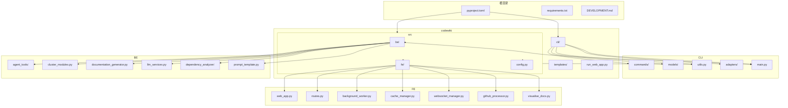
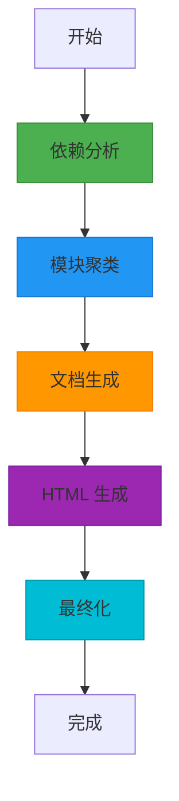
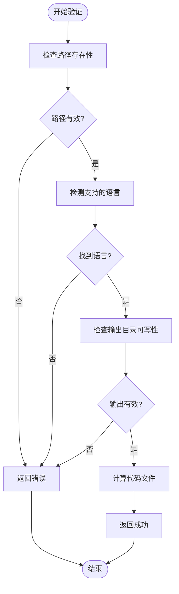
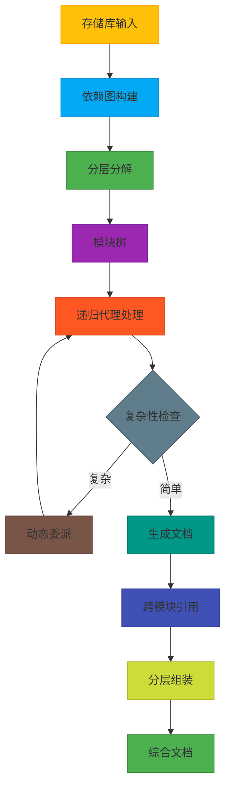

# 开发者指南

<cite>
**本文档中引用的文件**   
- [DEVELOPMENT.md](file://DEVELOPMENT.md)
- [pyproject.toml](file://pyproject.toml)
- [README.md](file://README.md)
- [codewiki/cli/main.py](file://codewiki/cli/main.py)
- [codewiki/src/be/main.py](file://codewiki/src/be/main.py)
- [codewiki/cli/utils/progress.py](file://codewiki/cli/utils/progress.py)
- [codewiki/cli/utils/repo_validator.py](file://codewiki/cli/utils/repo_validator.py)
- [codewiki/src/be/dependency_analyzer/ast_parser.py](file://codewiki/src/be/dependency_analyzer/ast_parser.py)
- [codewiki/src/be/documentation_generator.py](file://codewiki/src/be/documentation_generator.py)
- [codewiki/src/config.py](file://codewiki/src/config.py)
- [codewiki/src/be/agent_orchestrator.py](file://codewiki/src/be/agent_orchestrator.py)
- [codewiki/src/fe/web_app.py](file://codewiki/src/fe/web_app.py)
- [codewiki/cli/commands/generate.py](file://codewiki/cli/commands/generate.py)
- [codewiki/cli/commands/config.py](file://codewiki/cli/commands/config.py)
- [codewiki/src/be/cluster_modules.py](file://codewiki/src/be/cluster_modules.py)
</cite>

## 目录
1. [项目结构](#项目结构)
2. [开发环境设置](#开发环境设置)
3. [贡献流程](#贡献流程)
4. [调试技巧](#调试技巧)
5. [核心工具](#核心工具)
6. [文档生成工作流](#文档生成工作流)

## 项目结构

CodeWiki 项目的结构清晰地分为三个主要部分：CLI（命令行界面）、BE（后端）和 FE（前端）。这种分层架构使得系统既模块化又易于维护。



**图源**
- [DEVELOPMENT.md](file://DEVELOPMENT.md#L5-L40)

### CLI 目录职责

`codewiki/cli/` 目录包含命令行界面的实现，负责处理用户输入、验证配置和启动文档生成过程。

- **commands/**: 包含 CLI 命令的实现，如 `config` 和 `generate`。
- **models/**: 定义数据模型，用于在 CLI 组件之间传递数据。
- **utils/**: 提供实用工具，包括文件系统操作、输入验证、进度跟踪和日志记录。
- **adapters/**: 包含外部集成的适配器，如文档生成器适配器。
- **main.py**: CLI 的主入口点，使用 Click 框架定义命令行接口。

**节源**
- [DEVELOPMENT.md](file://DEVELOPMENT.md#L10-L14)
- [codewiki/cli/main.py](file://codewiki/cli/main.py#L1-L57)

### BE 目录职责

`codewiki/src/be/` 目录包含后端逻辑，负责代码分析、模块聚类和文档生成。

- **agent_orchestrator.py**: 协调 AI 代理进行文档生成，实现递归代理处理和动态任务委派。
- **cluster_modules.py**: 实现分层分解算法，将存储库结构分解为特征导向的模块分区。
- **documentation_generator.py**: 文档生成的主要协调器，管理整个生成过程。
- **llm_services.py**: 处理与大型语言模型 (LLM) 的交互，包括 API 调用和重试逻辑。
- **dependency_analyzer/**: 使用 Tree-sitter 解析器进行依赖分析，构建调用图和依赖关系。
- **prompt_template.py**: 定义用于 LLM 交互的系统提示和用户提示模板。

**节源**
- [DEVELOPMENT.md](file://DEVELOPMENT.md#L16-L22)
- [codewiki/src/be/main.py](file://codewiki/src/be/main.py#L1-L69)

### FE 目录职责

`codewiki/src/fe/` 目录包含 Web 界面的实现，提供一个用户友好的前端来提交 GitHub 存储库进行文档生成。

- **web_app.py**: FastAPI 应用的主入口点，定义路由和初始化组件。
- **routes.py**: 处理 HTTP 请求的路由逻辑。
- **background_worker.py**: 在后台处理文档生成任务的工作者。
- **cache_manager.py**: 管理生成文档的缓存系统。
- **websocket_manager.py**: 处理 WebSocket 连接，用于实时进度更新。
- **github_processor.py**: 处理 GitHub 存储库的克隆和处理。
- **visualise_docs.py**: 提供文档可视化功能。

**节源**
- [DEVELOPMENT.md](file://DEVELOPMENT.md#L23-L27)
- [codewiki/src/fe/web_app.py](file://codewiki/src/fe/web_app.py#L1-L165)

## 开发环境设置

### 先决条件

在开始开发之前，请确保您的系统满足以下先决条件：

- **Python 3.12+**: 项目需要 Python 3.12 或更高版本。
- **Node.js**: 用于 Mermaid 图表验证。
- **Git**: 用于版本控制和分支创建功能。
- **Tree-sitter 语言解析器**: 用于多语言代码分析。

### 安装

按照以下步骤设置开发环境：

```bash
# 克隆仓库
git clone https://github.com/FSoft-AI4Code/CodeWiki.git
cd CodeWiki

# 创建虚拟环境
python3.12 -m venv .venv
source .venv/bin/activate  # 在 Windows 上: .venv\Scripts\activate

# 以开发模式安装
pip install -e .

# 安装开发依赖
pip install -r requirements.txt
```

开发依赖在 `pyproject.toml` 文件中定义，包括测试、格式化和类型检查工具：

```toml
[project.optional-dependencies]
dev = [
    "pytest>=7.4.0",
    "pytest-cov>=4.1.0",
    "pytest-asyncio>=0.21.0",
    "black>=23.0.0",
    "mypy>=1.5.0",
    "ruff>=0.1.0",
]
```

**节源**
- [DEVELOPMENT.md](file://DEVELOPMENT.md#L43-L68)
- [pyproject.toml](file://pyproject.toml#L62-L70)

## 贡献流程

### 代码风格

为了保持代码库的一致性和可读性，请遵循以下代码风格指南：

- **Black**: 用于代码格式化。配置在 `pyproject.toml` 中指定：
  ```toml
  [tool.black]
  line-length = 100
  target-version = ['py312']
  ```
- **Ruff**: 用于代码 linting。配置在 `pyproject.toml` 中指定：
  ```toml
  [tool.ruff]
  line-length = 100
  target-version = "py312"
  ```
- **PEP 8**: 遵循 PEP 8 指南进行 Python 代码编写。
- **类型提示**: 在适用的地方使用类型提示。
- **文档字符串**: 为公共函数和类编写文档字符串。
- **函数模块化**: 保持函数专注且模块化。

### 类型检查

使用 MyPy 进行静态类型检查，以捕获潜在的类型错误。配置在 `pyproject.toml` 中指定：

```toml
[tool.mypy]
python_version = "3.12"
warn_return_any = true
warn_unused_configs = true
disallow_untyped_defs = false
disallow_incomplete_defs = false
```

### 测试

使用 PyTest 运行测试套件。配置在 `pyproject.toml` 中指定：

```toml
[tool.pytest.ini_options]
testpaths = ["tests"]
python_files = ["test_*.py"]
python_classes = ["Test*"]
python_functions = ["test_*"]
addopts = "-v --cov=codewiki --cov-report=term-missing"
```

运行测试的命令：

```bash
# 运行所有测试
pytest

# 运行特定测试文件
pytest tests/test_dependency_analyzer.py

# 运行带有覆盖率的测试
pytest --cov=codewiki tests/
```

### 贡献步骤

1. **Fork 仓库**
2. **创建功能分支**: `git checkout -b feature/your-feature`
3. **进行更改**
4. **编写/更新测试**
5. **确保测试通过**: `pytest`
6. **提交更改**: `git commit -am 'Add new feature'`
7. **推送到分支**: `git push origin feature/your-feature`
8. **提交拉取请求**

**节源**
- [DEVELOPMENT.md](file://DEVELOPMENT.md#L171-L187)
- [pyproject.toml](file://pyproject.toml#L107-L124)

## 调试技巧

### 启用详细日志

通过 `--verbose` 标志或环境变量启用详细日志记录：

```bash
# CLI
codewiki generate --verbose

# 环境变量
export CODEWIKI_LOG_LEVEL=DEBUG
```

### 常见问题

**Tree-sitter 解析器错误**:
- 确保语言解析器已正确安装
- 检查文件编码（期望为 UTF-8）

**LLM API 错误**:
- 验证 API 密钥和端点
- 检查速率限制
- 启用重试逻辑

**大型存储库的内存问题**:
- 调整模块分解阈值
- 增加委派深度限制

**节源**
- [DEVELOPMENT.md](file://DEVELOPMENT.md#L206-L232)

## 核心工具

### ProgressTracker

`ProgressTracker` 类提供了一个带有阶段和 ETA 估计的进度跟踪器。它将文档生成过程分为五个阶段，每个阶段都有不同的权重：

- **第1阶段：依赖分析** (40% 时间)
- **第2阶段：模块聚类** (20% 时间)
- **第3阶段：文档生成** (30% 时间)
- **第4阶段：HTML 生成** (5% 时间，可选)
- **第5阶段：最终化** (5% 时间)



**图源**
- [codewiki/cli/utils/progress.py](file://codewiki/cli/utils/progress.py#L16-L21)

### RepoValidator

`RepoValidator` 工具用于验证存储库以进行文档生成。它检查以下内容：

- 路径是否存在且为目录
- 包含受支持的代码文件
- 有足够的文件用于有意义的文档

它还提供检查可写输出目录、检测 Git 存储库和计算代码文件数量的功能。



**图源**
- [codewiki/cli/utils/repo_validator.py](file://codewiki/cli/utils/repo_validator.py#L36-L188)

## 文档生成工作流

文档生成工作流是一个复杂的多阶段过程，涉及依赖分析、模块聚类和递归代理处理。



**图源**
- [DEVELOPMENT.md](file://DEVELOPMENT.md#L191-L203)

该工作流从存储库输入开始，首先构建依赖图，然后进行分层分解以创建模块树。接着，递归代理处理模块，根据复杂性进行动态委派。最后，生成的文档通过跨模块引用和分层组装，形成综合文档。

**节源**
- [DEVELOPMENT.md](file://DEVELOPMENT.md#L189-L203)
- [codewiki/src/be/documentation_generator.py](file://codewiki/src/be/documentation_generator.py#L320-L382)