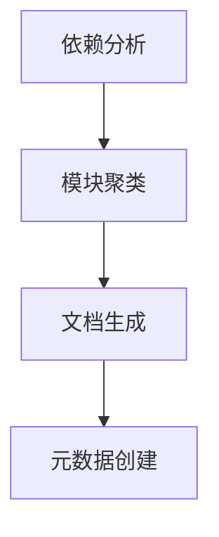
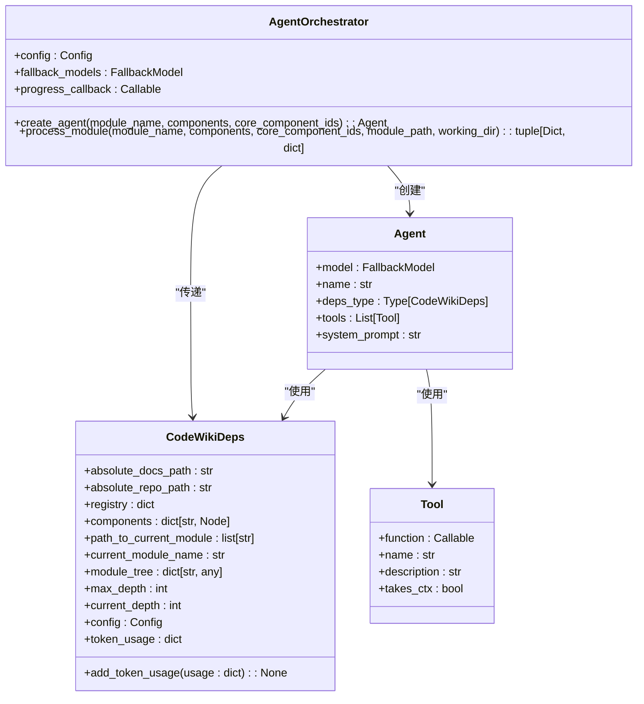
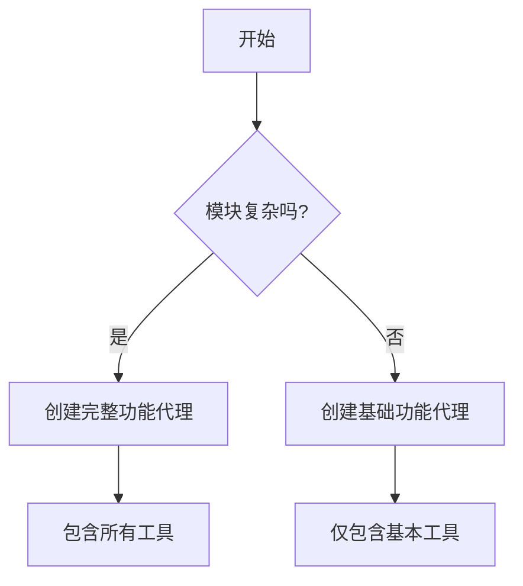
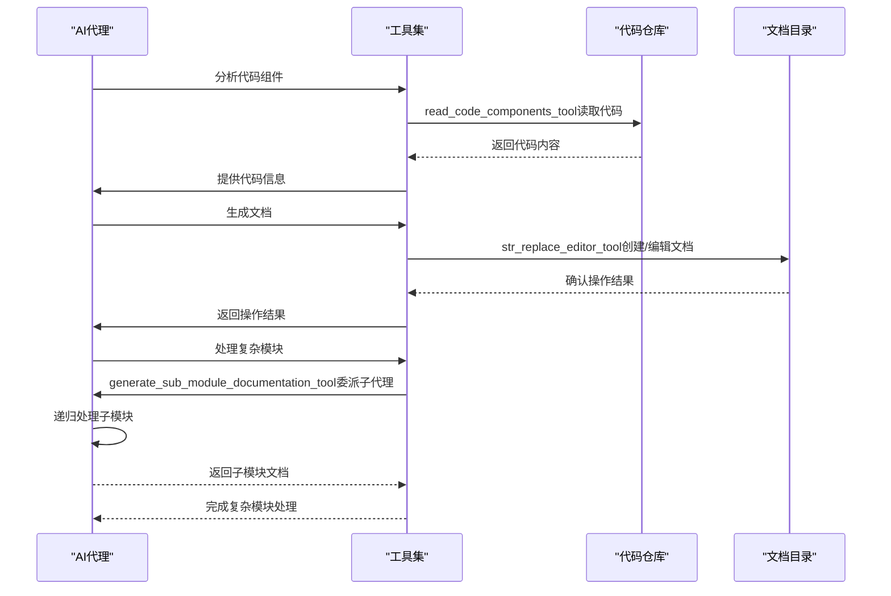
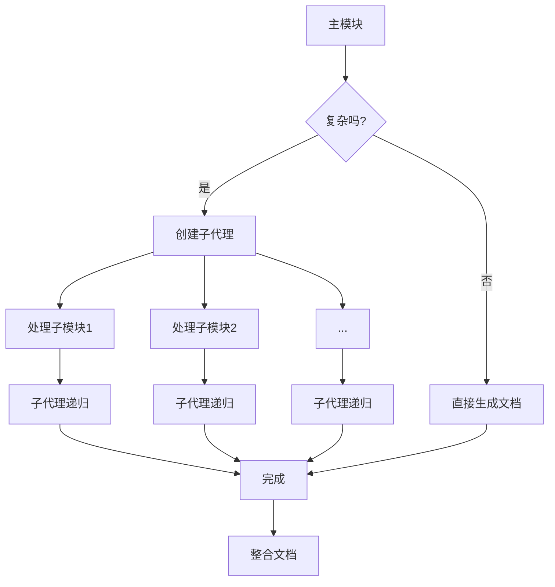
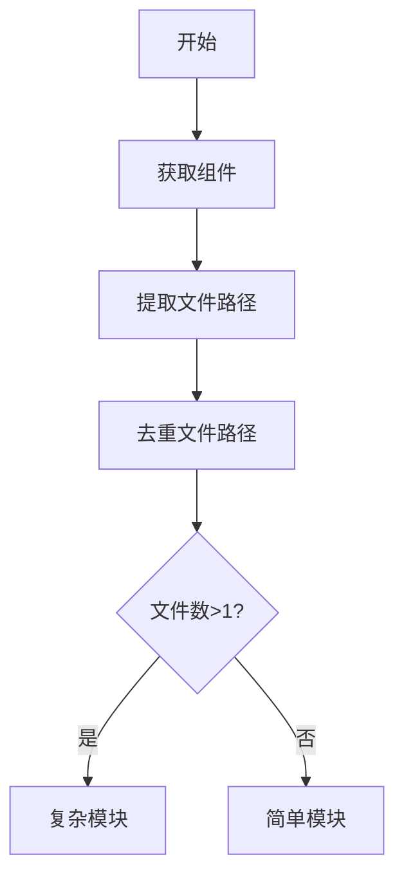
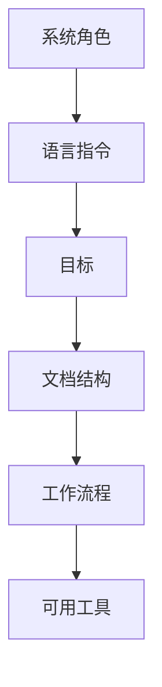
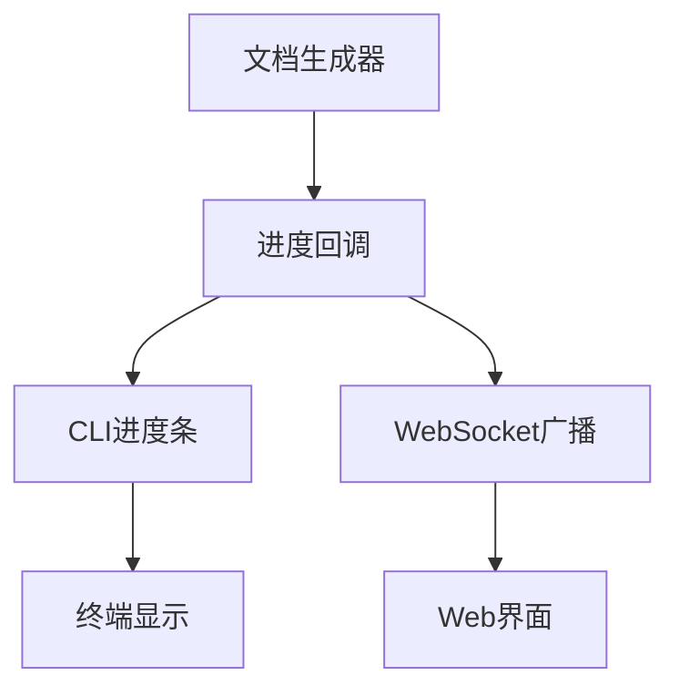
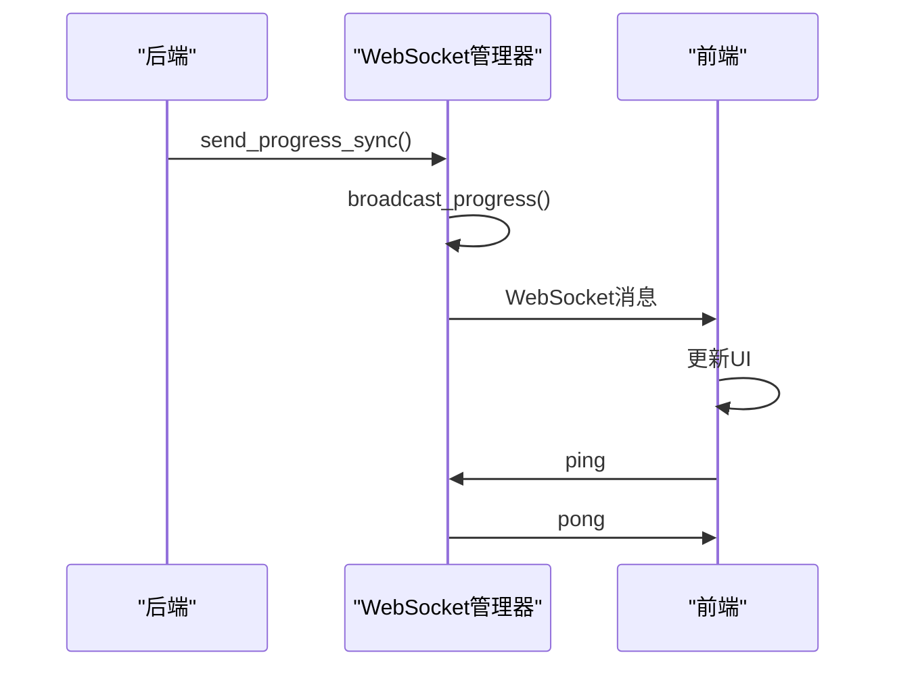

# AI文档生成器

<cite>
**本文档引用的文件**   
- [documentation_generator.py](file://codewiki/src/be/documentation_generator.py)
- [agent_orchestrator.py](file://codewiki/src/be/agent_orchestrator.py)
- [prompt_template.py](file://codewiki/src/be/prompt_template.py)
- [read_code_components.py](file://codewiki/src/be/agent_tools/read_code_components.py)
- [str_replace_editor.py](file://codewiki/src/be/agent_tools/str_replace_editor.py)
- [generate_sub_module_documentations.py](file://codewiki/src/be/agent_tools/generate_sub_module_documentations.py)
- [cluster_modules.py](file://codewiki/src/be/cluster_modules.py)
- [config.py](file://codewiki/src/config.py)
- [utils.py](file://codewiki/src/be/utils.py)
- [progress.py](file://codewiki/cli/utils/progress.py)
- [websocket_manager.py](file://codewiki/src/fe/websocket_manager.py)
</cite>

## 目录
1. [引言](#引言)
2. [四阶段工作流](#四阶段工作流)
3. [多代理系统架构](#多代理系统架构)
4. [递归文档生成策略](#递归文档生成策略)
5. [系统提示词设计](#系统提示词设计)
6. [进度回调机制](#进度回调机制)

## 引言
CodeWiki AI文档生成器是一个先进的系统，旨在通过人工智能技术自动化生成高质量的代码文档。该系统采用多代理架构，通过四个阶段的工作流来分析代码库并生成全面的文档。核心组件`DocumentationGenerator.run()`方法协调整个生成过程，从依赖分析到元数据创建。系统利用`AgentOrchestrator`根据模块复杂度动态创建不同能力的AI代理，并通过`read_code_components_tool`、`str_replace_editor_tool`和`generate_sub_module_documentation_tool`等工具实现协同工作。此外，系统还实现了递归文档生成策略，允许复杂模块动态委派子代理处理，并通过进度回调机制为CLI和Web界面提供实时状态更新。

## 四阶段工作流
`DocumentationGenerator.run()`方法实现了四阶段工作流，这是AI文档生成器的核心处理流程。该工作流采用动态编程方法，确保文档生成的高效性和准确性。

**Diagram sources**
- [documentation_generator.py](file://codewiki/src/be/documentation_generator.py#L320-L382)

### 依赖分析
工作流的第一阶段是依赖分析，通过`DependencyGraphBuilder`构建代码库的依赖图。此阶段分析代码组件之间的关系，识别出叶节点（leaf nodes），为后续的模块聚类提供基础数据。`build_dependency_graph()`方法返回所有组件和叶节点的集合，这些信息是整个文档生成过程的基础。

**Section sources**
- [documentation_generator.py](file://codewiki/src/be/documentation_generator.py#L328-L331)

### 模块聚类
第二阶段是模块聚类，通过`cluster_modules`函数将代码组件分组为逻辑模块。该过程使用LLM（大语言模型）来智能地将相关组件聚类，形成模块树结构。如果模块树已存在，则直接加载；否则，创建新的模块树并保存。聚类过程考虑了组件之间的紧密关系，确保每个模块包含功能相关的代码组件。

**Section sources**
- [documentation_generator.py](file://codewiki/src/be/documentation_generator.py#L335-L361)
- [cluster_modules.py](file://codewiki/src/be/cluster_modules.py#L44-L125)

### 文档生成
第三阶段是文档生成，这是工作流中最复杂的部分。系统采用自底向上的方法，首先处理叶模块，然后处理父模块，最后生成仓库概述。`generate_module_documentation()`方法使用`AgentOrchestrator`为每个模块创建和运行AI代理，生成详细的文档。处理顺序通过拓扑排序确定，确保依赖关系得到正确处理。

**Section sources**
- [documentation_generator.py](file://codewiki/src/be/documentation_generator.py#L137-L251)

### 元数据创建
第四阶段是元数据创建，通过`create_documentation_metadata()`方法生成包含文档生成信息的元数据文件。元数据包括生成时间戳、使用的模型版本、仓库路径、提交ID以及统计信息如总组件数、叶节点数和令牌使用情况。此阶段为生成的文档提供了完整的上下文和审计信息。

**Section sources**
- [documentation_generator.py](file://codewiki/src/be/documentation_generator.py#L50-L84)

## 多代理系统架构
CodeWiki AI文档生成器采用多代理系统架构，其中`AgentOrchestrator`根据模块复杂度动态创建不同能力的AI代理。这种架构允许系统灵活地处理不同复杂度的代码模块。

**Diagram sources**
- [agent_orchestrator.py](file://codewiki/src/be/agent_orchestrator.py#L59-L198)
- [agent_tools/deps.py](file://codewiki/src/be/agent_tools/deps.py#L5-L28)

### 代理创建逻辑
`AgentOrchestrator.create_agent()`方法根据模块复杂度决定创建何种类型的代理。复杂度判断基于`is_complex_module()`函数，该函数检查模块是否包含多个文件。如果模块复杂，则创建具有完整工具集的代理；否则，创建仅具有基本工具的代理。

**Diagram sources**
- [agent_orchestrator.py](file://codewiki/src/be/agent_orchestrator.py#L71-L93)

### 协同工作机制
多代理系统通过三个核心工具实现协同工作：`read_code_components_tool`、`str_replace_editor_tool`和`generate_sub_module_documentation_tool`。这些工具在代理执行过程中协同工作，完成文档生成任务。

**Diagram sources**
- [agent_tools/read_code_components.py](file://codewiki/src/be/agent_tools/read_code_components.py#L5-L22)
- [agent_tools/str_replace_editor.py](file://codewiki/src/be/agent_tools/str_replace_editor.py#L709-L791)
- [agent_tools/generate_sub_module_documentations.py](file://codewiki/src/be/agent_tools/generate_sub_module_documentations.py#L18-L113)

## 递归文档生成策略
CodeWiki AI文档生成器采用递归文档生成策略，允许复杂模块动态委派子代理处理。这种策略确保了大型复杂模块能够被有效分解和处理。

**Diagram sources**
- [agent_tools/generate_sub_module_documentations.py](file://codewiki/src/be/agent_tools/generate_sub_module_documentations.py#L18-L113)

### 复杂度判断
系统的复杂度判断机制基于`is_complex_module()`函数，该函数通过检查模块是否包含多个文件来确定其复杂度。如果一个模块包含来自多个文件的组件，则被视为复杂模块，需要更高级的处理能力。

**Diagram sources**
- [utils.py](file://codewiki/src/be/utils.py#L15-L23)

### 动态委派
当处理复杂模块时，系统会动态委派子代理来处理子模块。`generate_sub_module_documentation_tool`工具负责创建子代理并递归处理子模块。每个子代理都有自己的上下文和深度限制，确保递归不会无限进行。

**Section sources**
- [agent_tools/generate_sub_module_documentations.py](file://codewiki/src/be/agent_tools/generate_sub_module_documentations.py#L18-L113)

## 系统提示词设计
系统提示词（SYSTEM_PROMPT）的设计是AI文档生成器成功的关键。提示词通过`prompt_template.py`文件定义，指导AI代理如何生成高质量的文档。

**Diagram sources**
- [prompt_template.py](file://codewiki/src/be/prompt_template.py#L1-L54)

### 设计原则
系统提示词的设计遵循以下原则：
1. **明确角色定义**：清晰定义AI代理作为文档助手的角色
2. **语言指令**：强制要求所有输出使用指定语言
3. **目标导向**：明确文档生成的目标和目的
4. **结构化输出**：规定文档的结构和格式
5. **工作流程**：定义代理应遵循的工作流程
6. **工具可用性**：列出代理可以使用的工具

**Section sources**
- [prompt_template.py](file://codewiki/src/be/prompt_template.py#L1-L54)

### 叶模块提示词
对于简单模块，系统使用`LEAF_SYSTEM_PROMPT`，这是一个简化版本的提示词，专注于基本的文档生成任务，不包含子模块生成的复杂工作流程。

**Section sources**
- [prompt_template.py](file://codewiki/src/be/prompt_template.py#L56-L94)

## 进度回调机制
进度回调机制实现了CLI和Web界面的实时状态更新，为用户提供生成过程的可视化反馈。

**Diagram sources**
- [websocket_manager.py](file://codewiki/src/fe/websocket_manager.py#L18-L100)
- [progress.py](file://codewiki/cli/utils/progress.py#L11-L223)

### CLI进度显示
对于命令行界面，系统使用`ProgressTracker`和`ModuleProgressBar`类提供详细的进度信息。这些类实现了阶段权重、ETA估算和详细的进度更新，使用户能够了解生成过程的进展。

**Section sources**
- [progress.py](file://codewiki/cli/utils/progress.py#L11-L223)

### Web界面实时更新
对于Web界面，系统使用WebSocket实现实时进度更新。`WebSocketManager`负责管理WebSocket连接，并通过`broadcast_progress()`方法将进度消息广播给所有连接的客户端。前端JavaScript代码监听这些消息并实时更新UI。

**Diagram sources**
- [websocket_manager.py](file://codewiki/src/fe/websocket_manager.py#L18-L100)
- [templates.py](file://codewiki/src/fe/templates.py#L305-L450)