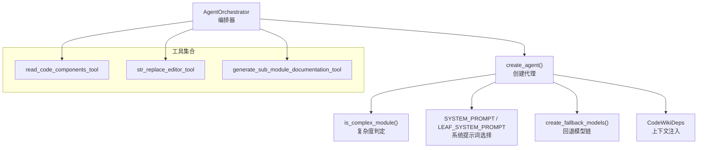
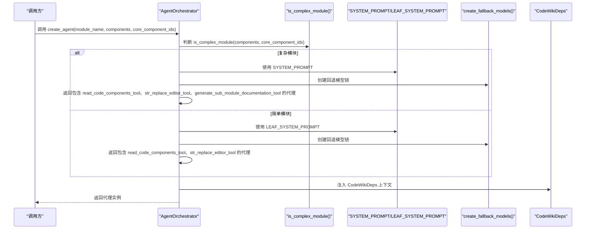
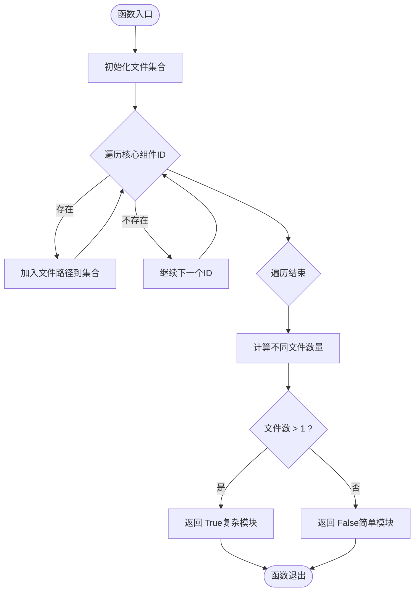
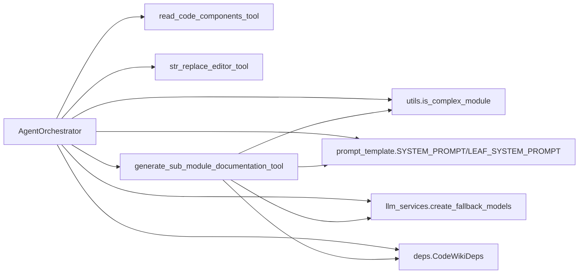

# 代理创建逻辑

<cite>
**本文引用的文件列表**
- [agent_orchestrator.py](file://codewiki/src/be/agent_orchestrator.py)
- [generate_sub_module_documentations.py](file://codewiki/src/be/agent_tools/generate_sub_module_documentations.py)
- [read_code_components.py](file://codewiki/src/be/agent_tools/read_code_components.py)
- [str_replace_editor.py](file://codewiki/src/be/agent_tools/str_replace_editor.py)
- [deps.py](file://codewiki/src/be/agent_tools/deps.py)
- [utils.py](file://codewiki/src/be/utils.py)
- [prompt_template.py](file://codewiki/src/be/prompt_template.py)
- [llm_services.py](file://codewiki/src/be/llm_services.py)
- [config.py](file://codewiki/src/config.py)
</cite>

## 目录
1. [引言](#引言)
2. [项目结构](#项目结构)
3. [核心组件](#核心组件)
4. [架构总览](#架构总览)
5. [详细组件分析](#详细组件分析)
6. [依赖关系分析](#依赖关系分析)
7. [性能考量](#性能考量)
8. [故障排查指南](#故障排查指南)
9. [结论](#结论)
10. [附录](#附录)

## 引言
本文件聚焦于 `AgentOrchestrator.create_agent` 方法的实现机制，系统性解析其如何依据模块复杂度动态创建不同能力的 AI 代理：当模块被判定为“复杂”时，构建具备递归子模块文档生成功能的全功能代理；当模块为“简单”时，则创建仅具备代码读取与文本编辑能力的基础代理。文档还将解释系统提示词（SYSTEM_PROMPT vs LEAF_SYSTEM_PROMPT）的选择策略、fallback 模型链的作用、以及 CodeWikiDeps 依赖注入类型如何为代理提供上下文环境。最后给出工具集差异对比表与自定义工具扩展建议。

## 项目结构
围绕代理创建与运行的关键文件组织如下：
- 后端编排器：负责根据模块复杂度创建代理并驱动执行
- 工具集合：提供代码读取、文本编辑、子模块文档生成等能力
- 上下文注入：通过 CodeWikiDeps 提供工作路径、组件映射、模块树、深度控制与令牌用量统计
- 提示词模板：区分复杂模块与简单模块的系统提示词
- LLM 服务：统一创建主模型与回退模型链
- 配置与常量：包括最大深度、令牌限制等

图表来源
- [agent_orchestrator.py](file://codewiki/src/be/agent_orchestrator.py#L71-L93)
- [utils.py](file://codewiki/src/be/utils.py#L15-L23)
- [prompt_template.py](file://codewiki/src/be/prompt_template.py#L1-L94)
- [llm_services.py](file://codewiki/src/be/llm_services.py#L43-L47)
- [deps.py](file://codewiki/src/be/agent_tools/deps.py#L5-L28)

章节来源
- [agent_orchestrator.py](file://codewiki/src/be/agent_orchestrator.py#L71-L93)
- [utils.py](file://codewiki/src/be/utils.py#L15-L23)
- [prompt_template.py](file://codewiki/src/be/prompt_template.py#L1-L94)
- [llm_services.py](file://codewiki/src/be/llm_services.py#L43-L47)
- [deps.py](file://codewiki/src/be/agent_tools/deps.py#L5-L28)

## 核心组件
- AgentOrchestrator：负责创建代理、驱动运行、进度回调与结果保存
- 复杂度判定函数：基于核心组件所属文件数量判断是否为复杂模块
- 系统提示词：针对复杂模块与简单模块分别提供不同的行为约束与工作流
- 回退模型链：由主模型与回退模型组成，提升稳定性
- CodeWikiDeps：承载工作目录、组件映射、模块树、当前模块路径、深度与令牌用量统计

章节来源
- [agent_orchestrator.py](file://codewiki/src/be/agent_orchestrator.py#L59-L93)
- [utils.py](file://codewiki/src/be/utils.py#L15-L23)
- [prompt_template.py](file://codewiki/src/be/prompt_template.py#L1-L94)
- [llm_services.py](file://codewiki/src/be/llm_services.py#L43-L47)
- [deps.py](file://codewiki/src/be/agent_tools/deps.py#L5-L28)

## 架构总览
下面以序列图展示 create_agent 的调用流程与关键决策点。

图表来源
- [agent_orchestrator.py](file://codewiki/src/be/agent_orchestrator.py#L71-L93)
- [utils.py](file://codewiki/src/be/utils.py#L15-L23)
- [prompt_template.py](file://codewiki/src/be/prompt_template.py#L1-L94)
- [llm_services.py](file://codewiki/src/be/llm_services.py#L43-L47)
- [deps.py](file://codewiki/src/be/agent_tools/deps.py#L5-L28)

## 详细组件分析

### AgentOrchestrator.create_agent 实现机制
- 输入参数：模块名、组件字典、核心组件 ID 列表
- 复杂度判定：使用 is_complex_module 判断核心组件是否跨越多个文件
- 工具集差异：
  - 复杂模块：包含 read_code_components_tool、str_replace_editor_tool、generate_sub_module_documentation_tool
  - 简单模块：仅包含 read_code_components_tool、str_replace_editor_tool
- 系统提示词选择：
  - 复杂模块：SYSTEM_PROMPT，强调模块拆分、子模块递归生成与跨文件架构
  - 简单模块：LEAF_SYSTEM_PROMPT，强调单一模块内完整文档生成
- 回退模型链：通过 create_fallback_models(config) 统一创建主模型与回退模型组合
- 上下文注入：使用 CodeWikiDeps 提供绝对文档路径、仓库路径、组件映射、模块树、当前模块路径、最大深度、当前深度与令牌用量统计

章节来源
- [agent_orchestrator.py](file://codewiki/src/be/agent_orchestrator.py#L71-L93)
- [utils.py](file://codewiki/src/be/utils.py#L15-L23)
- [prompt_template.py](file://codewiki/src/be/prompt_template.py#L1-L94)
- [llm_services.py](file://codewiki/src/be/llm_services.py#L43-L47)
- [deps.py](file://codewiki/src/be/agent_tools/deps.py#L5-L28)

### 复杂度判定算法
- 原理：遍历核心组件 ID，收集其文件路径，若去重后文件数大于 1，则判定为复杂模块
- 时间复杂度：O(n)，n 为核心组件数量
- 空间复杂度：O(k)，k 为不同文件数量

图表来源
- [utils.py](file://codewiki/src/be/utils.py#L15-L23)

章节来源
- [utils.py](file://codewiki/src/be/utils.py#L15-L23)

### 系统提示词选择策略
- 复杂模块（SYSTEM_PROMPT）：
  - 目标：生成主文档与子模块文档，支持递归拆分
  - 工作流：先生成主模块文档，再调用 generate_sub_module_documentation 生成子模块文档
  - 可用工具：read_code_components、str_replace_editor、generate_sub_module_documentation
- 简单模块（LEAF_SYSTEM_PROMPT）：
  - 目标：在单一模块内完成完整文档生成
  - 工具限制：不包含 generate_sub_module_documentation，避免不必要的递归
  - 可用工具：read_code_components、str_replace_editor

章节来源
- [prompt_template.py](file://codewiki/src/be/prompt_template.py#L1-L94)

### 回退模型链（fallback_models）的作用
- 统一创建：通过 create_fallback_models(config) 将主模型与回退模型组合为 FallbackModel
- 稳定性保障：当主模型不可用或受限时，自动切换至回退模型
- 代理注入：Agent 构造时传入 fallback_models，确保运行期具备容错能力

章节来源
- [llm_services.py](file://codewiki/src/be/llm_services.py#L43-L47)
- [agent_orchestrator.py](file://codewiki/src/be/agent_orchestrator.py#L64-L64)

### CodeWikiDeps 依赖注入类型
- 字段职责：
  - 绝对文档路径与仓库路径：限定工具操作范围
  - 组件映射：提供组件源码读取能力
  - 模块树与当前模块路径：支撑递归生成与跨模块引用
  - 最大深度与当前深度：防止无限递归
  - 令牌用量统计：聚合 LLM 调用开销
- 在 create_agent 中作为 deps_type 注入，使工具可访问上下文

章节来源
- [deps.py](file://codewiki/src/be/agent_tools/deps.py#L5-L28)
- [agent_orchestrator.py](file://codewiki/src/be/agent_orchestrator.py#L78-L91)

### 工具集差异对比表
- 复杂模块代理工具集
  - read_code_components_tool：按组件 ID 读取源码
  - str_replace_editor_tool：查看/创建/编辑/插入/撤销编辑文档文件
  - generate_sub_module_documentation_tool：递归生成子模块文档
- 简单模块代理工具集
  - read_code_components_tool：按组件 ID 读取源码
  - str_replace_editor_tool：查看/创建/编辑/插入/撤销编辑文档文件
- 选择依据：模块是否跨越多文件（复杂模块启用递归）

章节来源
- [agent_orchestrator.py](file://codewiki/src/be/agent_orchestrator.py#L79-L92)
- [read_code_components.py](file://codewiki/src/be/agent_tools/read_code_components.py#L22-L22)
- [str_replace_editor.py](file://codewiki/src/be/agent_tools/str_replace_editor.py#L776-L790)
- [generate_sub_module_documentations.py](file://codewiki/src/be/agent_tools/generate_sub_module_documentations.py#L113-L113)

### 子模块递归生成与复杂度阈值
- 子模块生成逻辑中再次应用 is_complex_module 判断与深度限制，结合 MAX_TOKEN_PER_LEAF_MODULE 进行令牌阈值控制
- 当满足复杂度且未达最大深度且令牌数达到阈值时，创建具备递归能力的子代理；否则创建基础代理

章节来源
- [generate_sub_module_documentations.py](file://codewiki/src/be/agent_tools/generate_sub_module_documentations.py#L52-L69)
- [config.py](file://codewiki/src/config.py#L16-L17)

## 依赖关系分析
- AgentOrchestrator 依赖：
  - is_complex_module：决定工具集与提示词
  - create_fallback_models：提供回退模型链
  - CodeWikiDeps：提供上下文
  - SYSTEM_PROMPT/LEAF_SYSTEM_PROMPT：决定行为约束
- 工具依赖：
  - read_code_components_tool：依赖 CodeWikiDeps 访问组件映射
  - str_replace_editor_tool：依赖 CodeWikiDeps 访问工作路径与注册表
  - generate_sub_module_documentation_tool：递归创建子代理并复用上述依赖

图表来源
- [agent_orchestrator.py](file://codewiki/src/be/agent_orchestrator.py#L71-L93)
- [utils.py](file://codewiki/src/be/utils.py#L15-L23)
- [prompt_template.py](file://codewiki/src/be/prompt_template.py#L1-L94)
- [llm_services.py](file://codewiki/src/be/llm_services.py#L43-L47)
- [deps.py](file://codewiki/src/be/agent_tools/deps.py#L5-L28)
- [generate_sub_module_documentations.py](file://codewiki/src/be/agent_tools/generate_sub_module_documentations.py#L18-L113)

章节来源
- [agent_orchestrator.py](file://codewiki/src/be/agent_orchestrator.py#L71-L93)
- [utils.py](file://codewiki/src/be/utils.py#L15-L23)
- [prompt_template.py](file://codewiki/src/be/prompt_template.py#L1-L94)
- [llm_services.py](file://codewiki/src/be/llm_services.py#L43-L47)
- [deps.py](file://codewiki/src/be/agent_tools/deps.py#L5-L28)
- [generate_sub_module_documentations.py](file://codewiki/src/be/agent_tools/generate_sub_module_documentations.py#L18-L113)

## 性能考量
- 复杂度判定：O(n) 时间与 O(k) 空间，n 为核心组件数，k 为不同文件数
- 令牌阈值：MAX_TOKEN_PER_LEAF_MODULE 控制简单模块的输入规模，避免超限
- 回退模型链：在主模型受限时自动切换，减少失败重试成本
- 代理运行：通过 CodeWikiDeps 聚合令牌用量，便于整体成本监控

章节来源
- [utils.py](file://codewiki/src/be/utils.py#L15-L23)
- [config.py](file://codewiki/src/config.py#L16-L17)
- [llm_services.py](file://codewiki/src/be/llm_services.py#L43-L47)
- [deps.py](file://codewiki/src/be/agent_tools/deps.py#L24-L28)

## 故障排查指南
- 代理无法创建：
  - 检查 is_complex_module 的输入是否正确（components 与 core_component_ids）
  - 确认 SYSTEM_PROMPT/LEAF_SYSTEM_PROMPT 是否正确格式化
- 工具执行异常：
  - read_code_components：确认组件 ID 存在于 components 映射中
  - str_replace_editor：检查路径合法性、工作目录权限与文件编码
- 递归生成失败：
  - 检查模块树更新逻辑与当前深度限制
  - 关注令牌用量统计是否异常增长

章节来源
- [agent_orchestrator.py](file://codewiki/src/be/agent_orchestrator.py#L149-L198)
- [read_code_components.py](file://codewiki/src/be/agent_tools/read_code_components.py#L5-L20)
- [str_replace_editor.py](file://codewiki/src/be/agent_tools/str_replace_editor.py#L425-L448)
- [generate_sub_module_documentations.py](file://codewiki/src/be/agent_tools/generate_sub_module_documentations.py#L75-L102)

## 结论
AgentOrchestrator.create_agent 通过 is_complex_module 动态选择工具集与系统提示词，结合回退模型链与 CodeWikiDeps 上下文，实现了从简单到复杂的渐进式代理能力。复杂模块启用 generate_sub_module_documentation_tool 支持递归拆分，简单模块则专注于单一模块内的完整文档生成。该设计在保证稳定性的同时，兼顾了灵活性与可扩展性。

## 附录

### 自定义工具扩展指导建议
- 工具接口规范
  - 使用 Tool(function=your_async_func, name=..., description=..., takes_ctx=True) 包装异步函数
  - 函数签名应接受 ctx: RunContext[CodeWikiDeps]，以便访问 deps 与 registry
- 上下文访问
  - 通过 ctx.deps 访问 CodeWikiDeps 字段（如 absolute_docs_path、absolute_repo_path、components、module_tree、current_depth、max_depth、token_usage）
- 示例步骤
  - 定义异步函数，处理输入参数与上下文
  - 返回字符串结果或错误信息
  - 注册为 Tool 并在 create_agent 的工具列表中添加
- 注意事项
  - 严格遵守 takes_ctx=True，确保工具可访问上下文
  - 对路径与文件进行合法性校验，避免越权访问
  - 对长输出进行截断或分页，避免超出令牌限制

章节来源
- [str_replace_editor.py](file://codewiki/src/be/agent_tools/str_replace_editor.py#L776-L790)
- [deps.py](file://codewiki/src/be/agent_tools/deps.py#L5-L28)
- [agent_orchestrator.py](file://codewiki/src/be/agent_orchestrator.py#L79-L92)