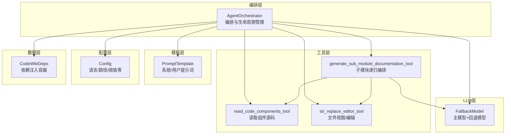
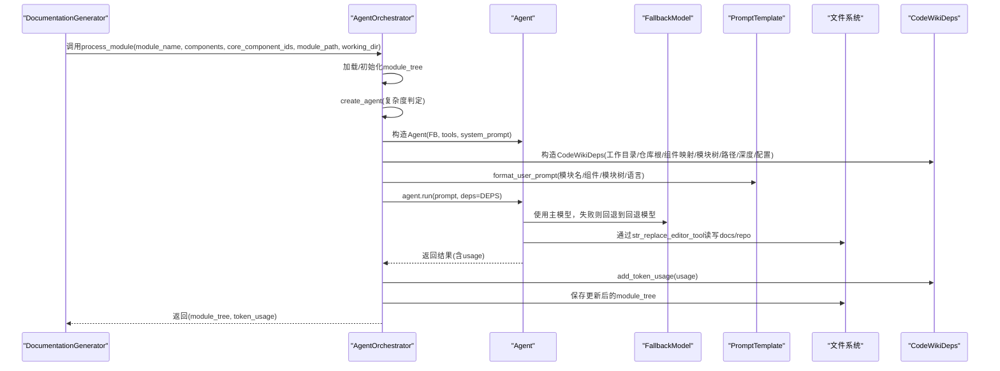
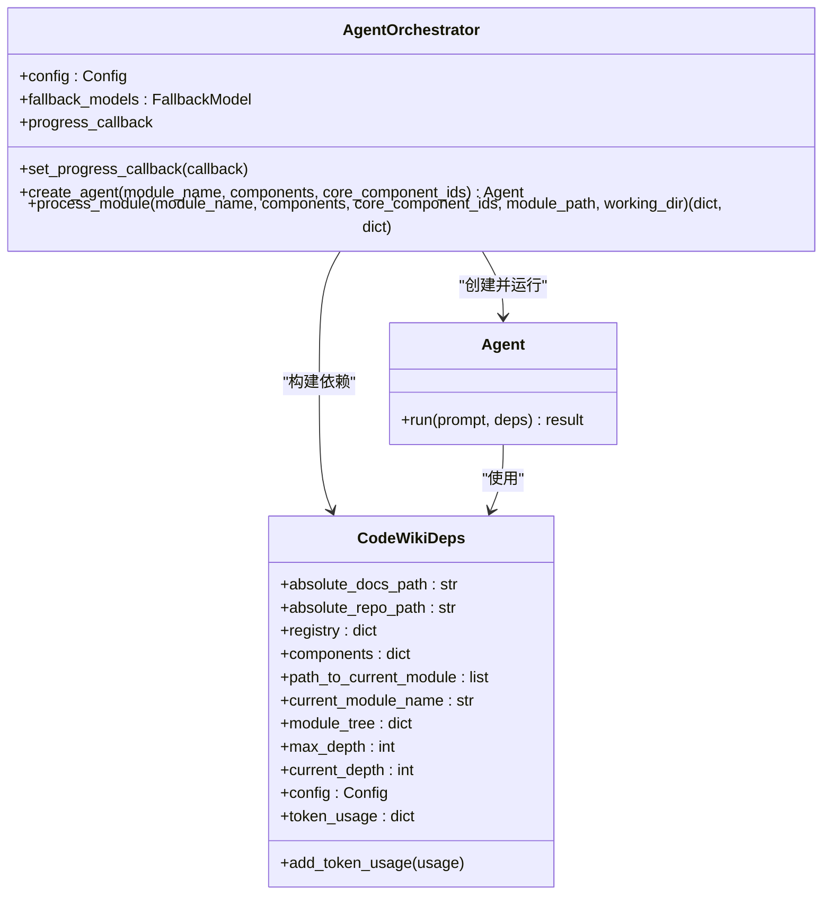
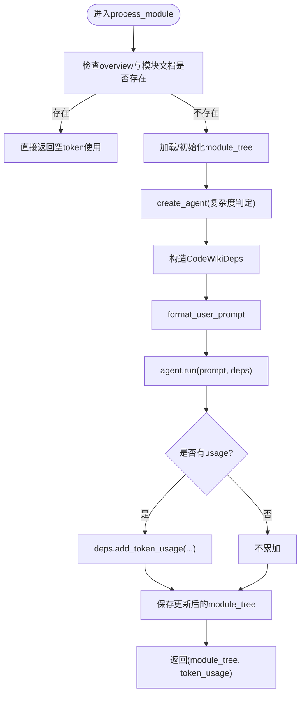
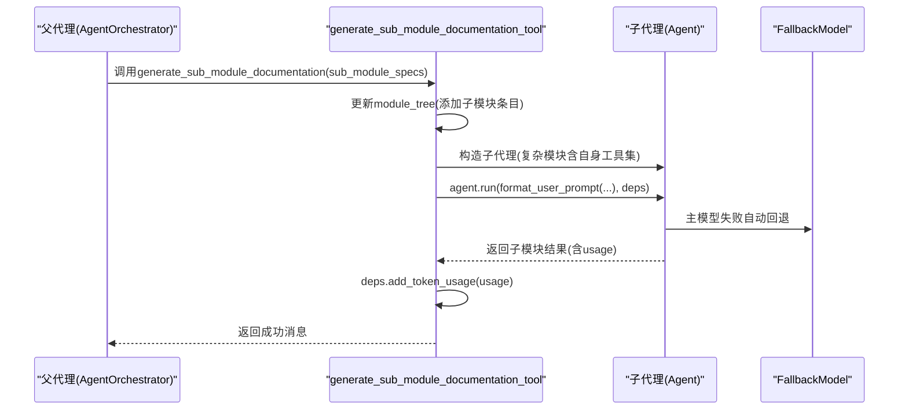
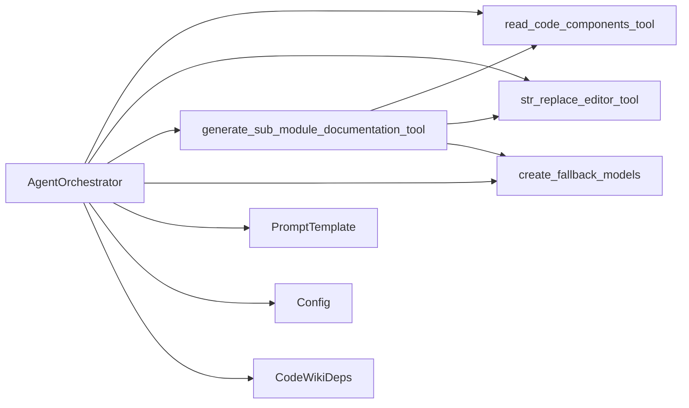

# 代理编排

<cite>
**本文引用的文件列表**
- [agent_orchestrator.py](file://codewiki/src/be/agent_orchestrator.py)
- [deps.py](file://codewiki/src/be/agent_tools/deps.py)
- [generate_sub_module_documentations.py](file://codewiki/src/be/agent_tools/generate_sub_module_documentations.py)
- [read_code_components.py](file://codewiki/src/be/agent_tools/read_code_components.py)
- [str_replace_editor.py](file://codewiki/src/be/agent_tools/str_replace_editor.py)
- [utils.py](file://codewiki/src/be/utils.py)
- [llm_services.py](file://codewiki/src/be/llm_services.py)
- [prompt_template.py](file://codewiki/src/be/prompt_template.py)
- [documentation_generator.py](file://codewiki/src/be/documentation_generator.py)
- [config.py](file://codewiki/src/config.py)
</cite>

## 目录
1. [简介](#简介)
2. [项目结构](#项目结构)
3. [核心组件](#核心组件)
4. [架构总览](#架构总览)
5. [组件详解](#组件详解)
6. [依赖关系分析](#依赖关系分析)
7. [性能考量](#性能考量)
8. [故障排查指南](#故障排查指南)
9. [结论](#结论)

## 简介
本文件面向CodeWiki后端“代理编排”子系统，聚焦于AgentOrchestrator类的设计与实现，系统性阐述其如何依据模块复杂度动态选择工具集（基础代理 vs 复杂模块代理），以及如何通过CodeWikiDeps依赖注入模式为代理提供文件系统、组件注册表与模块树等能力；同时解析process_module方法的完整生命周期，说明代理如何借助fallback_models机制实现LLM故障转移，确保文档生成的可靠性。

## 项目结构
后端以“编排器 + 工具集 + LLM服务 + 提示词模板 + 配置”为核心，形成清晰分层：
- 编排层：AgentOrchestrator负责创建代理、构建依赖、驱动代理运行、汇总统计
- 工具层：read_code_components、str_replace_editor、generate_sub_module_documentation三类工具
- LLM层：基于pydantic-ai的OpenAI模型与回退链
- 模板层：系统提示词与用户提示词格式化
- 配置层：统一配置与常量定义

图表来源
- [agent_orchestrator.py](file://codewiki/src/be/agent_orchestrator.py#L59-L198)
- [generate_sub_module_documentations.py](file://codewiki/src/be/agent_tools/generate_sub_module_documentations.py#L18-L113)
- [read_code_components.py](file://codewiki/src/be/agent_tools/read_code_components.py#L5-L22)
- [str_replace_editor.py](file://codewiki/src/be/agent_tools/str_replace_editor.py#L709-L791)
- [llm_services.py](file://codewiki/src/be/llm_services.py#L43-L47)
- [prompt_template.py](file://codewiki/src/be/prompt_template.py#L1-L368)
- [config.py](file://codewiki/src/config.py#L44-L123)
- [deps.py](file://codewiki/src/be/agent_tools/deps.py#L5-L28)

章节来源
- [agent_orchestrator.py](file://codewiki/src/be/agent_orchestrator.py#L59-L198)
- [config.py](file://codewiki/src/config.py#L1-L123)

## 核心组件
- AgentOrchestrator：编排器，负责创建代理、构建依赖、运行代理、统计token用量、进度回调
- CodeWikiDeps：依赖注入容器，封装工作目录、仓库根、组件映射、模块树、当前模块路径、深度限制、配置、token统计等
- 工具集：
  - read_code_components_tool：按组件ID读取源码片段
  - str_replace_editor_tool：在docs/repo目录下进行文件视图/创建/替换/插入/撤销
  - generate_sub_module_documentation_tool：为复杂模块递归创建子代理，生成子模块文档
- LLM服务：create_fallback_models返回FallbackModel，实现主模型失败时自动切换回退模型
- 提示词模板：SYSTEM_PROMPT/LEAF_SYSTEM_PROMPT与format_user_prompt

章节来源
- [agent_orchestrator.py](file://codewiki/src/be/agent_orchestrator.py#L59-L198)
- [deps.py](file://codewiki/src/be/agent_tools/deps.py#L5-L28)
- [read_code_components.py](file://codewiki/src/be/agent_tools/read_code_components.py#L5-L22)
- [str_replace_editor.py](file://codewiki/src/be/agent_tools/str_replace_editor.py#L709-L791)
- [generate_sub_module_documentations.py](file://codewiki/src/be/agent_tools/generate_sub_module_documentations.py#L18-L113)
- [llm_services.py](file://codewiki/src/be/llm_services.py#L43-L47)
- [prompt_template.py](file://codewiki/src/be/prompt_template.py#L1-L368)

## 架构总览
AgentOrchestrator在每个模块上执行如下生命周期：
- 判断是否已存在overview或该模块文档，若存在则跳过
- 加载/初始化模块树
- 基于复杂度创建代理（复杂模块含子模块编排工具）
- 构建CodeWikiDeps依赖对象（包含工作目录、仓库根、组件映射、模块树、路径、深度、配置、token统计）
- 调用agent.run，传入格式化的用户提示词与deps
- 解析结果中的usage，累加到deps.token_usage
- 保存更新后的模块树，返回模块树与token使用统计

图表来源
- [documentation_generator.py](file://codewiki/src/be/documentation_generator.py#L137-L200)
- [agent_orchestrator.py](file://codewiki/src/be/agent_orchestrator.py#L95-L198)
- [prompt_template.py](file://codewiki/src/be/prompt_template.py#L272-L335)
- [llm_services.py](file://codewiki/src/be/llm_services.py#L43-L47)
- [str_replace_editor.py](file://codewiki/src/be/agent_tools/str_replace_editor.py#L709-L791)

章节来源
- [documentation_generator.py](file://codewiki/src/be/documentation_generator.py#L137-L200)
- [agent_orchestrator.py](file://codewiki/src/be/agent_orchestrator.py#L95-L198)

## 组件详解

### AgentOrchestrator 类设计与实现
- 职责
  - 创建代理：根据模块复杂度选择工具集
  - 生命周期管理：加载模块树、构建deps、运行代理、统计token、保存模块树
  - 进度回调：向外部报告处理阶段与token使用情况
- 关键方法
  - create_agent：复杂模块包含generate_sub_module_documentation_tool，否则仅包含read_code_components_tool与str_replace_editor_tool
  - process_module：完整生命周期的编排入口
- 复杂度判定
  - is_complex_module：统计核心组件涉及的不同文件数，超过1个即视为复杂模块

图表来源
- [agent_orchestrator.py](file://codewiki/src/be/agent_orchestrator.py#L59-L198)
- [deps.py](file://codewiki/src/be/agent_tools/deps.py#L5-L28)

章节来源
- [agent_orchestrator.py](file://codewiki/src/be/agent_orchestrator.py#L59-L198)
- [utils.py](file://codewiki/src/be/utils.py#L15-L24)

#### create_agent 方法：复杂度驱动的工具装配
- 复杂模块（is_complex_module为真）：工具集包含 read_code_components_tool、str_replace_editor_tool、generate_sub_module_documentation_tool
- 简单模块：工具集仅包含 read_code_components_tool、str_replace_editor_tool
- 系统提示词：复杂模块使用SYSTEM_PROMPT，简单模块使用LEAF_SYSTEM_PROMPT，均注入语言参数

章节来源
- [agent_orchestrator.py](file://codewiki/src/be/agent_orchestrator.py#L71-L93)
- [prompt_template.py](file://codewiki/src/be/prompt_template.py#L1-L94)
- [utils.py](file://codewiki/src/be/utils.py#L15-L24)

#### process_module 方法：模块级生命周期
- 输入：模块名、组件字典、核心组件ID列表、模块路径、工作目录
- 流程要点
  - 跳过已存在的overview与模块文档
  - 加载/初始化module_tree
  - create_agent
  - 构造CodeWikiDeps（包含工作目录、仓库根、组件映射、模块树、路径、深度、配置）
  - format_user_prompt并调用agent.run
  - 解析result.usage并累加到deps.token_usage
  - 保存更新后的module_tree
  - 返回(module_tree, token_usage)

图表来源
- [agent_orchestrator.py](file://codewiki/src/be/agent_orchestrator.py#L95-L198)
- [prompt_template.py](file://codewiki/src/be/prompt_template.py#L272-L335)

章节来源
- [agent_orchestrator.py](file://codewiki/src/be/agent_orchestrator.py#L95-L198)

### CodeWikiDeps 依赖注入模式
- 角色：作为pydantic-ai的deps_type，承载代理运行所需的上下文信息
- 字段职责
  - 文件系统路径：absolute_docs_path、absolute_repo_path
  - 组件与注册表：components、registry
  - 模块树与路径：module_tree、path_to_current_module、current_module_name
  - 深度控制：max_depth、current_depth
  - 配置与统计：config、token_usage
- 能力
  - add_token_usage：聚合LLM调用产生的prompt_tokens/completion_tokens/total_tokens

章节来源
- [deps.py](file://codewiki/src/be/agent_tools/deps.py#L5-L28)

### 工具集与子模块编排
- read_code_components_tool
  - 功能：按组件ID读取源码片段，支持缺失组件的占位输出
  - 用途：探索未在初始组件中出现的相关代码
- str_replace_editor_tool
  - 功能：在docs或repo目录下进行文件视图、创建、字符串替换、插入、撤销编辑
  - 安全与校验：路径合法性、命令合法性、范围校验、编码容错、可选linter集成
  - 输出：日志记录编辑结果与潜在lint警告
- generate_sub_module_documentation_tool
  - 功能：为给定子模块规范生成详细描述，内部递归创建子代理
  - 递归条件：当前深度小于max_depth且token计数达到阈值时，复杂模块继续拆分子模块
  - 子代理工具集：与父代理一致（复杂模块含自身工具集）

图表来源
- [generate_sub_module_documentations.py](file://codewiki/src/be/agent_tools/generate_sub_module_documentations.py#L18-L113)
- [llm_services.py](file://codewiki/src/be/llm_services.py#L43-L47)

章节来源
- [read_code_components.py](file://codewiki/src/be/agent_tools/read_code_components.py#L5-L22)
- [str_replace_editor.py](file://codewiki/src/be/agent_tools/str_replace_editor.py#L709-L791)
- [generate_sub_module_documentations.py](file://codewiki/src/be/agent_tools/generate_sub_module_documentations.py#L18-L113)

### LLM 故障转移机制（fallback_models）
- 实现方式：create_fallback_models(config)返回FallbackModel(main, fallback)
- 行为特征：当主模型调用失败时，自动切换到回退模型，提升稳定性
- 在编排器与子代理中均复用同一回退链，保证一致性

章节来源
- [llm_services.py](file://codewiki/src/be/llm_services.py#L43-L47)
- [agent_orchestrator.py](file://codewiki/src/be/agent_orchestrator.py#L64-L64)
- [generate_sub_module_documentations.py](file://codewiki/src/be/agent_tools/generate_sub_module_documentations.py#L32-L32)

### 提示词模板与多语言支持
- SYSTEM_PROMPT：复杂模块的总体目标、结构、工作流与可用工具
- LEAF_SYSTEM_PROMPT：简单模块的目标、要求与工作流
- format_user_prompt：将模块树与核心组件按文件分组、拼接文件内容，注入语言参数
- 语言：由Config.language决定，贯穿系统提示词与用户提示词

章节来源
- [prompt_template.py](file://codewiki/src/be/prompt_template.py#L1-L368)
- [config.py](file://codewiki/src/config.py#L44-L123)

## 依赖关系分析
- AgentOrchestrator依赖
  - 工具：read_code_components_tool、str_replace_editor_tool、generate_sub_module_documentation_tool
  - LLM：create_fallback_models
  - 模板：SYSTEM_PROMPT/LEAF_SYSTEM_PROMPT、format_user_prompt
  - 配置：Config（语言、路径、阈值）
  - 数据：CodeWikiDeps（模块树、组件映射、路径、深度、统计）
- 代理与工具的关系
  - 复杂模块代理：包含generate_sub_module_documentation_tool，具备递归子模块编排能力
  - 简单模块代理：仅包含read_code_components_tool与str_replace_editor_tool
- 子模块编排
  - generate_sub_module_documentation_tool内部再次创建Agent，遵循相同复杂度判定逻辑

图表来源
- [agent_orchestrator.py](file://codewiki/src/be/agent_orchestrator.py#L39-L49)
- [generate_sub_module_documentations.py](file://codewiki/src/be/agent_tools/generate_sub_module_documentations.py#L1-L14)

章节来源
- [agent_orchestrator.py](file://codewiki/src/be/agent_orchestrator.py#L39-L49)
- [generate_sub_module_documentations.py](file://codewiki/src/be/agent_tools/generate_sub_module_documentations.py#L1-L14)

## 性能考量
- 复杂度判定与早停
  - is_complex_module通过统计不同文件数量快速区分复杂模块，避免不必要的子模块拆分
- token计数与阈值
  - generate_sub_module_documentation在子模块层面也进行token计数与阈值比较，防止单次LLM输入过大
- 回退链减少失败重试成本
  - FallbackModel在主模型失败时自动切换，降低整体失败率与重试开销
- 文件系统操作优化
  - str_replace_editor对大文件采用截断与窗口扩展策略，兼顾可观测性与性能

章节来源
- [utils.py](file://codewiki/src/be/utils.py#L15-L38)
- [generate_sub_module_documentations.py](file://codewiki/src/be/agent_tools/generate_sub_module_documentations.py#L49-L50)
- [str_replace_editor.py](file://codewiki/src/be/agent_tools/str_replace_editor.py#L63-L69)

## 故障排查指南
- 常见问题定位
  - LLM调用失败：检查LLM配置（base_url、api_key、模型名）、网络连通性；确认fallback_models是否正确创建
  - 文件路径错误：str_replace_editor会输出路径合法性与命令合法性提示；确认working_dir与绝对路径
  - token用量异常：检查result.usage字段提取逻辑，确保deps.add_token_usage被调用
  - 子模块编排失败：查看generate_sub_module_documentation的异常日志，确认子代理创建与run调用
- 日志与回调
  - AgentOrchestrator与generate_sub_module_documentations均输出详细日志，便于定位问题
  - 支持progress_callback，便于UI或CLI展示实时状态

章节来源
- [agent_orchestrator.py](file://codewiki/src/be/agent_orchestrator.py#L149-L198)
- [generate_sub_module_documentations.py](file://codewiki/src/be/agent_tools/generate_sub_module_documentations.py#L99-L102)
- [str_replace_editor.py](file://codewiki/src/be/agent_tools/str_replace_editor.py#L425-L448)

## 结论
AgentOrchestrator通过“复杂度驱动的工具装配 + 依赖注入 + LLM回退链”的组合，实现了高可靠、可扩展的模块化文档生成编排。CodeWikiDeps将文件系统、组件映射、模块树与统计信息集中管理，使代理能够在多层级模块间稳定运行。generate_sub_module_documentation_tool进一步将复杂模块拆分为更小的子模块，配合回退链与token阈值控制，确保大规模项目的文档生成质量与性能。