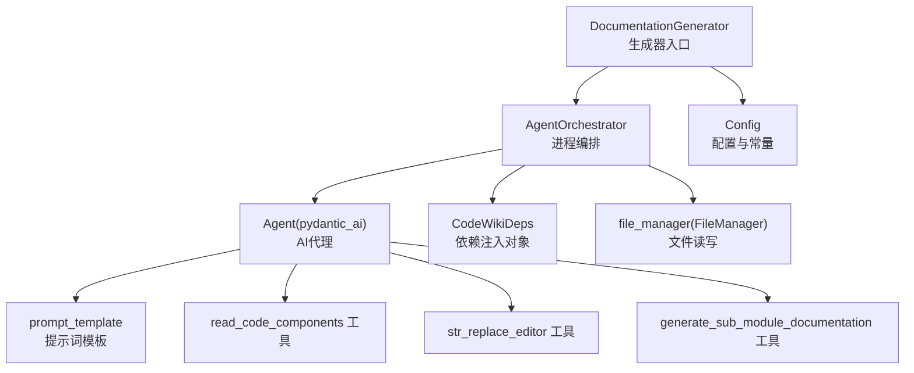
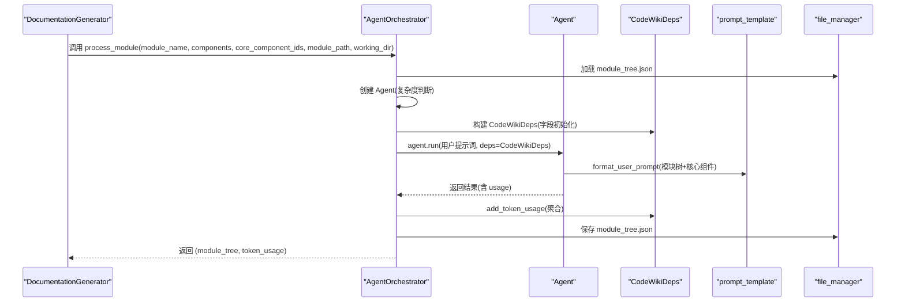
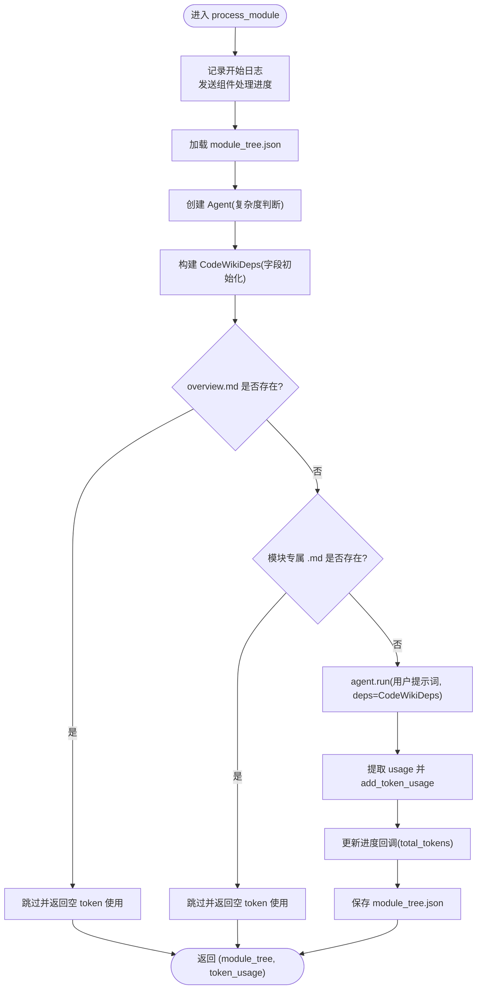
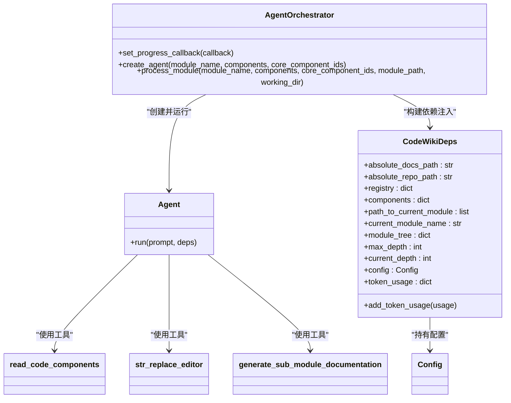
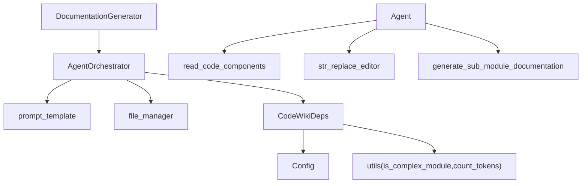

# 模块处理流程

<cite>
**本文引用的文件列表**
- [agent_orchestrator.py](file://codewiki/src/be/agent_orchestrator.py)
- [deps.py](file://codewiki/src/be/agent_tools/deps.py)
- [documentation_generator.py](file://codewiki/src/be/documentation_generator.py)
- [prompt_template.py](file://codewiki/src/be/prompt_template.py)
- [config.py](file://codewiki/src/config.py)
- [utils.py](file://codewiki/src/utils.py)
- [read_code_components.py](file://codewiki/src/be/agent_tools/read_code_components.py)
- [str_replace_editor.py](file://codewiki/src/be/agent_tools/str_replace_editor.py)
- [generate_sub_module_documentations.py](file://codewiki/src/be/agent_tools/generate_sub_module_documentations.py)
- [main.py](file://codewiki/src/be/main.py)
</cite>

## 目录
1. [简介](#简介)
2. [项目结构](#项目结构)
3. [核心组件](#核心组件)
4. [架构总览](#架构总览)
5. [详细组件分析](#详细组件分析)
6. [依赖关系分析](#依赖关系分析)
7. [性能考量](#性能考量)
8. [故障排查指南](#故障排查指南)
9. [结论](#结论)

## 简介
本文件围绕 `AgentOrchestrator.process_module` 异步方法的完整执行流程进行系统性解析，覆盖日志记录、进度回调通知、模块树加载、代理实例化、依赖注入对象（CodeWikiDeps）构建、跳过机制（overview.md 或模块专属 .md 已存在时提前返回）、用户提示词构造与依赖注入、结果处理阶段的 token 用量统计与模块树持久化保存，以及异常处理与日志记录规范。目标是帮助开发者全面理解该方法的可靠性设计与运行机理。

## 项目结构
- 后端主流程由 DocumentationGenerator 驱动，按拓扑顺序（叶子模块优先）调用 AgentOrchestrator.process_module 处理每个模块。
- AgentOrchestrator 负责创建 Agent、构建 CodeWikiDeps 依赖注入对象，并执行 agent.run。
- prompt_template 提供系统提示词与用户提示词格式化逻辑；config 定义常量与配置项；utils 提供复杂度判断、token 计数与 Mermaid 校验等工具。

图表来源
- [documentation_generator.py](file://codewiki/src/be/documentation_generator.py#L137-L251)
- [agent_orchestrator.py](file://codewiki/src/be/agent_orchestrator.py#L95-L198)
- [prompt_template.py](file://codewiki/src/be/prompt_template.py#L272-L335)
- [config.py](file://codewiki/src/config.py#L1-L123)
- [utils.py](file://codewiki/src/utils.py#L1-L46)

章节来源
- [documentation_generator.py](file://codewiki/src/be/documentation_generator.py#L137-L251)
- [agent_orchestrator.py](file://codewiki/src/be/agent_orchestrator.py#L95-L198)
- [config.py](file://codewiki/src/config.py#L1-L123)

## 核心组件
- AgentOrchestrator.process_module：异步处理单个模块，负责日志、进度回调、模块树加载、代理创建与运行、token 统计与模块树保存。
- CodeWikiDeps：依赖注入容器，承载绝对路径、模块树、当前模块信息、配置、token 统计等。
- prompt_template.format_user_prompt：根据模块树与核心组件生成用户提示词。
- file_manager：统一的文件读写接口，支持 JSON/文本读取与保存。
- DocumentationGenerator：驱动整体流程，按拓扑顺序调度模块处理与概览生成。

章节来源
- [agent_orchestrator.py](file://codewiki/src/be/agent_orchestrator.py#L95-L198)
- [deps.py](file://codewiki/src/be/agent_tools/deps.py#L5-L28)
- [prompt_template.py](file://codewiki/src/be/prompt_template.py#L272-L335)
- [utils.py](file://codewiki/src/utils.py#L10-L46)
- [documentation_generator.py](file://codewiki/src/be/documentation_generator.py#L137-L251)

## 架构总览
下图展示从 DocumentationGenerator 到 AgentOrchestrator 的调用链路，以及 Agent 运行时的依赖注入与工具交互。

图表来源
- [documentation_generator.py](file://codewiki/src/be/documentation_generator.py#L189-L191)
- [agent_orchestrator.py](file://codewiki/src/be/agent_orchestrator.py#L114-L193)
- [prompt_template.py](file://codewiki/src/be/prompt_template.py#L272-L335)
- [deps.py](file://codewiki/src/be/agent_tools/deps.py#L24-L28)
- [utils.py](file://codewiki/src/utils.py#L18-L31)

## 详细组件分析

### AgentOrchestrator.process_module 执行流程
- 日志与进度回调
  - 开始处理模块时记录模块名与核心组件数量。
  - 在组件处理阶段与生成文档阶段分别发送进度更新，包含当前模块、总数、token 累计等。
- 模块树加载
  - 从工作目录加载 module_tree.json，作为后续模块文档生成与概览构建的基础。
- 代理创建
  - 基于 is_complex_module 判断是否为复杂模块，选择不同系统提示词与工具集。
- 依赖注入对象 CodeWikiDeps 初始化
  - 字段含义与作用：
    - absolute_docs_path：文档输出目录绝对路径，用于 str_replace_editor 在 docs 目录下的文件操作。
    - absolute_repo_path：仓库根绝对路径，用于在 repo 目录下只允许 view 命令。
    - registry：工具状态持久化字典，用于记录文件历史等。
    - components：核心组件映射，供 read_code_components 工具读取源码。
    - path_to_current_module：当前模块路径栈，配合子模块递归使用。
    - current_module_name：当前模块名，便于子模块 Agent 使用。
    - module_tree：模块树数据，贯穿整个生成过程。
    - max_depth/current_depth：深度控制，限制子模块递归层级。
    - config：LLM 配置，提供模型、语言等参数。
    - token_usage：token 统计，默认值包含 prompt_tokens/completion_tokens/total_tokens。
- 跳过机制
  - 若 overview.md 存在则直接返回空 token 使用并结束。
  - 若当前模块专属 .md 文件存在也直接返回空 token 使用并结束。
- 用户提示词构造与依赖注入
  - 使用 format_user_prompt 将模块树与核心组件格式化为用户提示词。
  - 将 CodeWikiDeps 注入到 agent.run 的 deps 参数中，使工具可访问上述字段。
- 结果处理与持久化
  - 从 agent.run 结果提取 usage 并累加到 CodeWikiDeps.token_usage。
  - 更新进度回调中的 total_tokens。
  - 将更新后的 module_tree 写回 module_tree.json。
- 异常处理与日志记录
  - 捕获异常并记录错误与堆栈，随后重新抛出以保证上层可观测性。

图表来源
- [agent_orchestrator.py](file://codewiki/src/be/agent_orchestrator.py#L95-L198)
- [prompt_template.py](file://codewiki/src/be/prompt_template.py#L272-L335)
- [deps.py](file://codewiki/src/be/agent_tools/deps.py#L5-L28)
- [utils.py](file://codewiki/src/utils.py#L18-L31)

章节来源
- [agent_orchestrator.py](file://codewiki/src/be/agent_orchestrator.py#L95-L198)
- [prompt_template.py](file://codewiki/src/be/prompt_template.py#L272-L335)
- [deps.py](file://codewiki/src/be/agent_tools/deps.py#L5-L28)
- [utils.py](file://codewiki/src/utils.py#L18-L31)

### CodeWikiDeps 字段初始化与作用
- 字段清单与用途
  - absolute_docs_path：文档输出目录绝对路径，str_replace_editor 在 docs 目录下进行文件操作。
  - absolute_repo_path：仓库根绝对路径，限制在 repo 目录下仅允许 view 命令。
  - registry：工具状态持久化字典，记录文件历史等。
  - components：核心组件映射，read_code_components 工具通过 ID 读取源码。
  - path_to_current_module/current_module_name：模块路径栈与当前模块名，支撑子模块递归。
  - module_tree：模块树数据，贯穿生成与概览构建。
  - max_depth/current_depth：深度控制，防止无限递归。
  - config：LLM 配置，提供语言、模型等。
  - token_usage：token 统计，add_token_usage 聚合使用量。
- 初始化位置
  - 在 AgentOrchestrator.create_agent 之后，process_module 中构建 CodeWikiDeps 实例时完成字段赋值。

章节来源
- [agent_orchestrator.py](file://codewiki/src/be/agent_orchestrator.py#L118-L134)
- [deps.py](file://codewiki/src/be/agent_tools/deps.py#L5-L28)

### 跳过机制与优化策略
- 跳过条件
  - overview.md 存在：直接返回，避免重复生成仓库级概览。
  - 当前模块专属 .md 存在：直接返回，避免重复生成模块级文档。
- 优化效果
  - 减少不必要的 LLM 调用与 IO 操作，提升整体吞吐。
  - 保持幂等性：多次运行同一工作区不会重复生成已存在的文档。

章节来源
- [agent_orchestrator.py](file://codewiki/src/be/agent_orchestrator.py#L136-L146)

### 用户提示词构造与依赖注入
- 提示词构造
  - format_user_prompt 将 module_tree 与核心组件按文件分组格式化为用户提示词，确保上下文清晰且可复用。
- 依赖注入
  - agent.run 的 deps 参数传入 CodeWikiDeps，工具（read_code_components、str_replace_editor、generate_sub_module_documentation）通过 ctx.deps 访问所需资源。

章节来源
- [prompt_template.py](file://codewiki/src/be/prompt_template.py#L272-L335)
- [agent_orchestrator.py](file://codewiki/src/be/agent_orchestrator.py#L160-L169)

### 结果处理与模块树持久化
- token 用量统计
  - 从 agent.run 结果中提取 usage，add_token_usage 聚合到 CodeWikiDeps.token_usage。
- 进度回调更新
  - 在提取 usage 后更新 total_tokens，向 UI 层反馈实时统计。
- 模块树持久化
  - 保存更新后的 module_tree.json，确保后续步骤（如概览生成）可读取最新结构。

章节来源
- [agent_orchestrator.py](file://codewiki/src/be/agent_orchestrator.py#L171-L190)
- [deps.py](file://codewiki/src/be/agent_tools/deps.py#L24-L28)

### 工具与代理交互（代码级关系）

图表来源
- [agent_orchestrator.py](file://codewiki/src/be/agent_orchestrator.py#L71-L93)
- [deps.py](file://codewiki/src/be/agent_tools/deps.py#L5-L28)
- [read_code_components.py](file://codewiki/src/be/agent_tools/read_code_components.py#L5-L22)
- [str_replace_editor.py](file://codewiki/src/be/agent_tools/str_replace_editor.py#L709-L790)
- [generate_sub_module_documentations.py](file://codewiki/src/be/agent_tools/generate_sub_module_documentations.py#L18-L113)

## 依赖关系分析
- DocumentationGenerator 依赖 AgentOrchestrator 进行模块级文档生成；同时负责全局进度回调设置与 token 统计聚合。
- AgentOrchestrator 依赖 prompt_template.format_user_prompt 生成用户提示词；依赖 file_manager 进行模块树的读取与保存；依赖 CodeWikiDeps 作为依赖注入载体。
- CodeWikiDeps 依赖 Config 提供 LLM 配置；依赖 utils 的 is_complex_module 与 count_tokens 辅助复杂度判断与 token 计数。
- 工具层（read_code_components、str_replace_editor、generate_sub_module_documentation）通过 ctx.deps 访问 CodeWikiDeps，实现对文件系统与子模块的管理。

图表来源
- [documentation_generator.py](file://codewiki/src/be/documentation_generator.py#L32-L48)
- [agent_orchestrator.py](file://codewiki/src/be/agent_orchestrator.py#L118-L134)
- [prompt_template.py](file://codewiki/src/be/prompt_template.py#L272-L335)
- [utils.py](file://codewiki/src/utils.py#L15-L38)
- [deps.py](file://codewiki/src/be/agent_tools/deps.py#L5-L28)

章节来源
- [documentation_generator.py](file://codewiki/src/be/documentation_generator.py#L32-L48)
- [agent_orchestrator.py](file://codewiki/src/be/agent_orchestrator.py#L118-L134)
- [utils.py](file://codewiki/src/utils.py#L15-L38)

## 性能考量
- 跳过机制显著减少重复计算与 IO，建议在大规模仓库中充分利用。
- 复杂模块与叶子模块采用不同系统提示词与工具集，避免不必要的工具调用。
- token 统计与进度回调有助于监控与限流，建议在生产环境中结合配置项进行节流与重试策略。

## 故障排查指南
- 常见问题
  - 模块树缺失：确认 module_tree.json 是否存在；若不存在，需先执行聚类与模块树生成。
  - 权限不足：str_replace_editor 在 docs/repo 目录下的文件操作需具备相应权限。
  - Mermaid 校验失败：生成的文档中 Mermaid 图可能语法错误，检查报错行号并修正。
- 日志与异常
  - process_module 对异常进行捕获并记录详细堆栈，随后重新抛出，便于上层处理。
  - 建议在 CI/CD 中关注日志级别与异常传播，确保失败可追踪。

章节来源
- [agent_orchestrator.py](file://codewiki/src/be/agent_orchestrator.py#L195-L198)
- [utils.py](file://codewiki/src/be/utils.py#L45-L89)

## 结论
AgentOrchestrator.process_module 通过严谨的日志与进度回调、完善的依赖注入、智能的跳过机制与结果处理，实现了高可靠性的模块文档生成。其与 DocumentationGenerator、prompt_template、file_manager、工具集之间的协作，构成了可扩展、可观测、可维护的文档生成流水线。开发者在扩展功能或定位问题时，应重点关注 CodeWikiDeps 的字段职责、跳过条件的边界与异常传播策略。