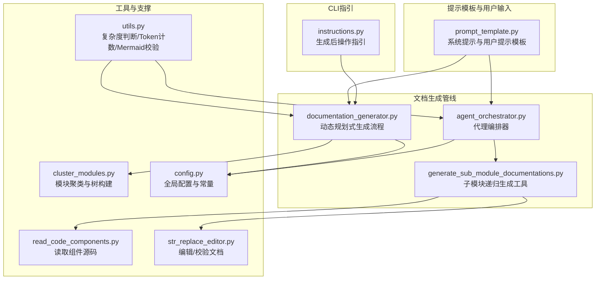
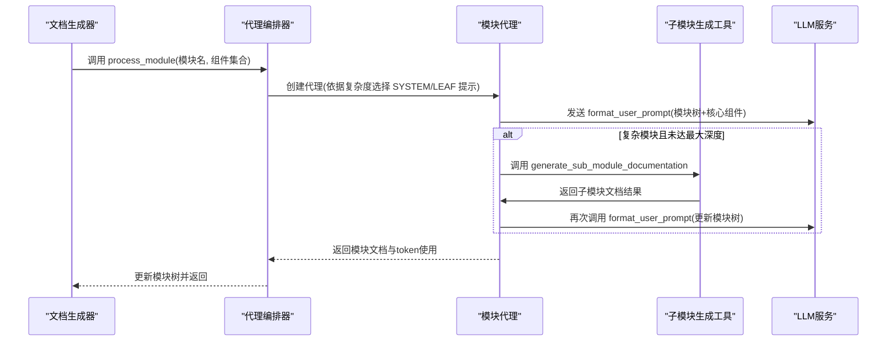
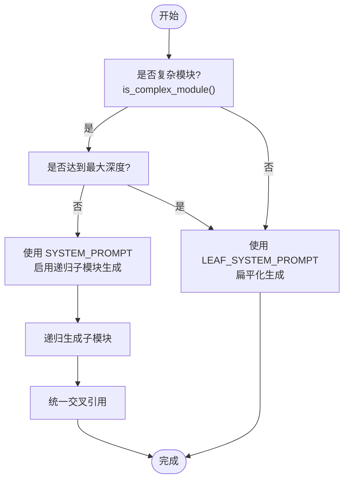
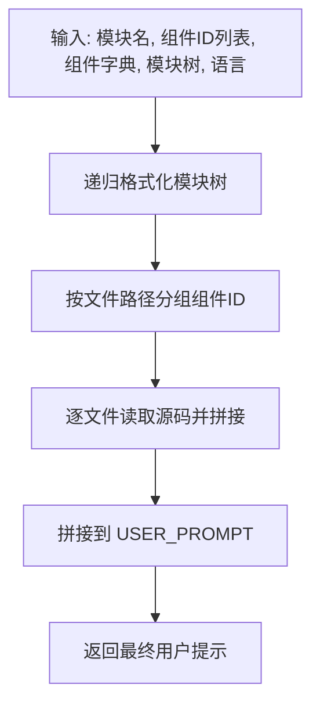
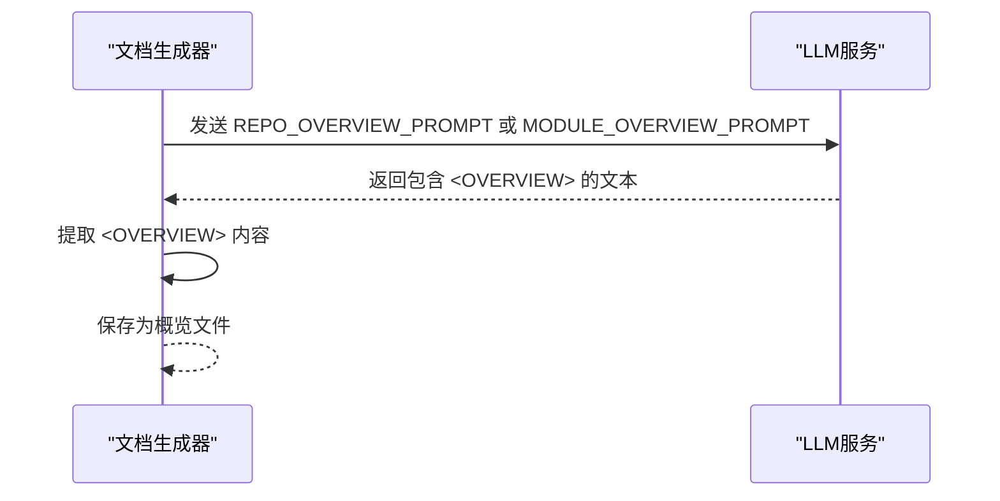
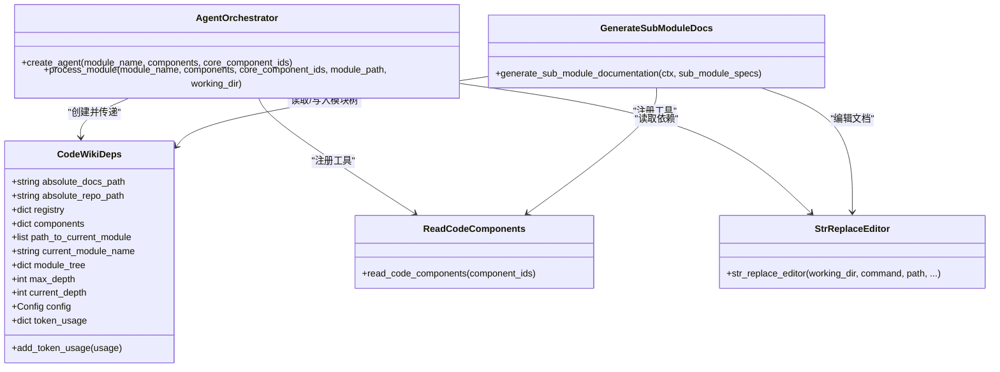
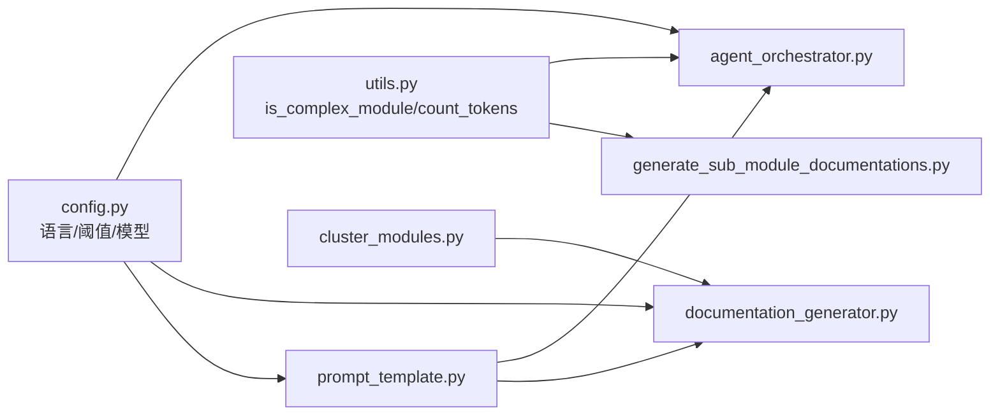

# 提示工程

<cite>
**本文引用的文件列表**
- [prompt_template.py](file://codewiki/src/be/prompt_template.py)
- [documentation_generator.py](file://codewiki/src/be/documentation_generator.py)
- [agent_orchestrator.py](file://codewiki/src/be/agent_orchestrator.py)
- [generate_sub_module_documentations.py](file://codewiki/src/be/agent_tools/generate_sub_module_documentations.py)
- [utils.py](file://codewiki/src/be/utils.py)
- [cluster_modules.py](file://codewiki/src/be/cluster_modules.py)
- [config.py](file://codewiki/src/config.py)
- [read_code_components.py](file://codewiki/src/be/agent_tools/read_code_components.py)
- [str_replace_editor.py](file://codewiki/src/be/agent_tools/str_replace_editor.py)
- [deps.py](file://codewiki/src/be/agent_tools/deps.py)
- [instructions.py](file://codewiki/cli/utils/instructions.py)
</cite>

## 目录
1. [简介](#简介)
2. [项目结构](#项目结构)
3. [核心组件](#核心组件)
4. [架构总览](#架构总览)
5. [详细组件分析](#详细组件分析)
6. [依赖关系分析](#依赖关系分析)
7. [性能考量](#性能考量)
8. [故障排查指南](#故障排查指南)
9. [结论](#结论)

## 简介
本文件聚焦于CodeWiki提示工程系统，围绕以下目标展开：
- 深入对比与解释 SYSTEM_PROMPT 与 LEAF_SYSTEM_PROMPT 的设计差异：前者启用递归子模块文档生成工具以支持复杂模块的层级化文档，后者专注于扁平化文档生成。
- 解释 format_user_prompt 如何将模块树结构与核心组件代码格式化为LLM可理解的输入，包括模块树的递归格式化与按文件路径分组的代码组织。
- 阐述 LANGUAGE_INSTRUCTION 指令如何确保所有生成内容（含图表标签）均使用配置语言输出。
- 说明 REPO_OVERVIEW_PROMPT 与 MODULE_OVERVIEW_PROMPT 如何通过 <OVERVIEW> 标签封装生成内容，便于系统解析与提取。

## 项目结构
提示工程相关的核心代码集中在后端业务层（codewiki/src/be），主要由提示模板、文档生成器、代理编排器、工具集与配置构成；CLI侧提供生成后的操作指引。

图示来源
- [prompt_template.py](file://codewiki/src/be/prompt_template.py#L1-L368)
- [documentation_generator.py](file://codewiki/src/be/documentation_generator.py#L1-L382)
- [agent_orchestrator.py](file://codewiki/src/be/agent_orchestrator.py#L1-L198)
- [generate_sub_module_documentations.py](file://codewiki/src/be/agent_tools/generate_sub_module_documentations.py#L1-L113)
- [read_code_components.py](file://codewiki/src/be/agent_tools/read_code_components.py#L1-L22)
- [str_replace_editor.py](file://codewiki/src/be/agent_tools/str_replace_editor.py#L1-L791)
- [utils.py](file://codewiki/src/be/utils.py#L1-L207)
- [cluster_modules.py](file://codewiki/src/be/cluster_modules.py#L1-L125)
- [config.py](file://codewiki/src/config.py#L1-L123)
- [instructions.py](file://codewiki/cli/utils/instructions.py#L1-L180)

章节来源
- [prompt_template.py](file://codewiki/src/be/prompt_template.py#L1-L368)
- [documentation_generator.py](file://codewiki/src/be/documentation_generator.py#L1-L382)
- [agent_orchestrator.py](file://codewiki/src/be/agent_orchestrator.py#L1-L198)
- [generate_sub_module_documentations.py](file://codewiki/src/be/agent_tools/generate_sub_module_documentations.py#L1-L113)
- [utils.py](file://codewiki/src/be/utils.py#L1-L207)
- [cluster_modules.py](file://codewiki/src/be/cluster_modules.py#L1-L125)
- [config.py](file://codewiki/src/config.py#L1-L123)
- [instructions.py](file://codewiki/cli/utils/instructions.py#L1-L180)

## 核心组件
- 系统提示模板
  - SYSTEM_PROMPT：面向复杂模块，启用 generate_sub_module_documentation 工具，支持递归生成子模块文档，并在完成后统一交叉引用。
  - LEAF_SYSTEM_PROMPT：面向简单模块，不启用递归工具，直接生成完整文档。
  - USER_PROMPT：承载模块树与核心组件代码的用户侧提示，供LLM理解上下文。
  - REPO_OVERVIEW_PROMPT / MODULE_OVERVIEW_PROMPT：生成仓库/模块概览，使用 <OVERVIEW> 包裹内容以便解析。
- 用户提示格式化
  - format_user_prompt：将模块树递归格式化为层级文本，同时按文件路径对核心组件进行分组，读取对应文件内容并拼接为LLM输入。
- 语言指令
  - <LANGUAGE_INSTRUCTION>：强制LLM在指定语言下生成所有内容，包括标题、图表标签与注释。
- 概览生成与解析
  - generate_parent_module_docs：根据子模块文档构建“概览结构”，调用REPO_OVERVIEW_PROMPT或MODULE_OVERVIEW_PROMPT生成概览，并从<OVERVIEW>中提取内容保存。

章节来源
- [prompt_template.py](file://codewiki/src/be/prompt_template.py#L1-L158)
- [documentation_generator.py](file://codewiki/src/be/documentation_generator.py#L253-L319)

## 架构总览
提示工程贯穿“提示模板 → 代理编排 → 工具执行 → 文档生成”的闭环，其中：
- 代理编排器根据模块复杂度选择不同系统提示（复杂模块走递归，简单模块走扁平化）。
- 子模块递归生成工具在深度未达上限且满足复杂度阈值时，创建复杂代理并再次调用 format_user_prompt。
- 语言指令确保输出一致性；概览生成通过标签封装实现结构化提取。

图示来源
- [agent_orchestrator.py](file://codewiki/src/be/agent_orchestrator.py#L71-L93)
- [generate_sub_module_documentations.py](file://codewiki/src/be/agent_tools/generate_sub_module_documentations.py#L18-L113)
- [prompt_template.py](file://codewiki/src/be/prompt_template.py#L272-L335)

## 详细组件分析

### 系统提示模板：SYSTEM_PROMPT vs LEAF_SYSTEM_PROMPT
- 设计差异
  - SYSTEM_PROMPT：明确包含 generate_sub_module_documentation 工具，工作流允许先生成主模块文档，再递归生成子模块，最后统一调整交叉引用。
  - LEAF_SYSTEM_PROMPT：不包含递归工具，工作流仅生成单一模块的完整文档。
- 适用场景
  - 复杂模块：当 is_complex_module 判断为真（多文件）且当前深度未达上限，采用 SYSTEM_PROMPT 启动递归。
  - 简单模块：采用 LEAF_SYSTEM_PROMPT，避免不必要的递归开销。

图示来源
- [generate_sub_module_documentations.py](file://codewiki/src/be/agent_tools/generate_sub_module_documentations.py#L52-L69)
- [agent_orchestrator.py](file://codewiki/src/be/agent_orchestrator.py#L74-L93)
- [utils.py](file://codewiki/src/be/utils.py#L15-L24)

章节来源
- [prompt_template.py](file://codewiki/src/be/prompt_template.py#L1-L94)
- [generate_sub_module_documentations.py](file://codewiki/src/be/agent_tools/generate_sub_module_documentations.py#L18-L113)
- [agent_orchestrator.py](file://codewiki/src/be/agent_orchestrator.py#L71-L93)
- [utils.py](file://codewiki/src/be/utils.py#L15-L24)

### format_user_prompt：模块树与核心组件的格式化
- 模块树递归格式化
  - 使用内部递归函数遍历模块树，打印当前模块、其核心组件列表以及子模块层级，形成清晰的层级文本。
- 核心组件按文件路径分组
  - 将组件ID按相对路径分组，每个文件块包含：
    - 文件标题与该文件中的核心组件清单
    - 文件内容（按扩展名映射到语言标识）
  - 通过文件管理器读取真实文件内容，若读取失败则记录错误信息。
- 输出组织
  - 最终将格式化的模块树与按文件组织的代码内容拼接到 USER_PROMPT 中，形成完整的用户提示。

图示来源
- [prompt_template.py](file://codewiki/src/be/prompt_template.py#L272-L335)

章节来源
- [prompt_template.py](file://codewiki/src/be/prompt_template.py#L272-L335)

### 语言指令：<LANGUAGE_INSTRUCTION> 的作用
- 语言约束
  - 在 SYSTEM_PROMPT、LEAF_SYSTEM_PROMPT、USER_PROMPT、REPO_OVERVIEW_PROMPT、MODULE_OVERVIEW_PROMPT 中均包含 <LANGUAGE_INSTRUCTION>，要求LLM在指定语言下生成全部内容，包括图表标签与注释。
- 配置来源
  - 语言配置来自全局配置对象，代理编排器与文档生成器在构造提示时注入 language 参数。
- 影响范围
  - 所有提示模板与概览生成均受此指令约束，保证输出语言一致。

章节来源
- [prompt_template.py](file://codewiki/src/be/prompt_template.py#L6-L13)
- [prompt_template.py](file://codewiki/src/be/prompt_template.py#L61-L68)
- [prompt_template.py](file://codewiki/src/be/prompt_template.py#L99-L101)
- [prompt_template.py](file://codewiki/src/be/prompt_template.py#L116-L118)
- [prompt_template.py](file://codewiki/src/be/prompt_template.py#L139-L141)
- [agent_orchestrator.py](file://codewiki/src/be/agent_orchestrator.py#L84-L92)
- [documentation_generator.py](file://codewiki/src/be/documentation_generator.py#L280-L288)

### 概览生成与解析：<OVERVIEW> 标签
- 结构化输出
  - REPO_OVERVIEW_PROMPT 与 MODULE_OVERVIEW_PROMPT 均要求输出 <OVERVIEW>...</OVERVIEW> 包裹的内容。
- 解析与保存
  - generate_parent_module_docs 在调用LLM后，从返回文本中提取 <OVERVIEW> 标签内的内容，并保存为 overview.md 或模块名.md。
- 用途
  - 便于后续系统解析与提取概览内容，避免混杂其他非概览信息。

图示来源
- [documentation_generator.py](file://codewiki/src/be/documentation_generator.py#L280-L310)
- [prompt_template.py](file://codewiki/src/be/prompt_template.py#L113-L134)
- [prompt_template.py](file://codewiki/src/be/prompt_template.py#L136-L157)

章节来源
- [documentation_generator.py](file://codewiki/src/be/documentation_generator.py#L253-L319)
- [prompt_template.py](file://codewiki/src/be/prompt_template.py#L113-L157)

### 代理编排与工具链
- 代理创建
  - 根据 is_complex_module 判断选择 SYSTEM_PROMPT 或 LEAF_SYSTEM_PROMPT，并注册相应工具。
- 工具能力
  - read_code_components：按组件ID读取源码片段。
  - str_replace_editor：在docs目录内查看/创建/替换/插入/撤销编辑文档，支持Mermaid校验。
  - generate_sub_module_documentation：递归生成子模块文档（仅复杂模块）。
- 依赖上下文
  - CodeWikiDeps 持有模块树、当前路径、组件集合、语言配置与token使用统计，贯穿整个流程。

图示来源
- [agent_orchestrator.py](file://codewiki/src/be/agent_orchestrator.py#L59-L93)
- [generate_sub_module_documentations.py](file://codewiki/src/be/agent_tools/generate_sub_module_documentations.py#L1-L113)
- [read_code_components.py](file://codewiki/src/be/agent_tools/read_code_components.py#L1-L22)
- [str_replace_editor.py](file://codewiki/src/be/agent_tools/str_replace_editor.py#L1-L791)
- [deps.py](file://codewiki/src/be/agent_tools/deps.py#L1-L28)

章节来源
- [agent_orchestrator.py](file://codewiki/src/be/agent_orchestrator.py#L59-L198)
- [generate_sub_module_documentations.py](file://codewiki/src/be/agent_tools/generate_sub_module_documentations.py#L1-L113)
- [read_code_components.py](file://codewiki/src/be/agent_tools/read_code_components.py#L1-L22)
- [str_replace_editor.py](file://codewiki/src/be/agent_tools/str_replace_editor.py#L1-L791)
- [deps.py](file://codewiki/src/be/agent_tools/deps.py#L1-L28)

## 依赖关系分析
- 模块复杂度与Token阈值
  - is_complex_module 依据组件所在文件数量判断复杂度。
  - count_tokens 用于估算潜在子模块的Token用量，结合 MAX_TOKEN_PER_LEAF_MODULE 与 MAX_TOKEN_PER_MODULE 控制递归深度与上下文窗口。
- 配置与常量
  - config.py 定义语言、最大深度、Token阈值、模型名称等，贯穿提示模板与工具链。
- 模块聚类
  - cluster_modules 将大量组件按LLM聚类结果构建模块树，作为后续递归的基础。

图示来源
- [config.py](file://codewiki/src/config.py#L1-L123)
- [utils.py](file://codewiki/src/be/utils.py#L15-L38)
- [cluster_modules.py](file://codewiki/src/be/cluster_modules.py#L1-L125)
- [agent_orchestrator.py](file://codewiki/src/be/agent_orchestrator.py#L1-L198)
- [documentation_generator.py](file://codewiki/src/be/documentation_generator.py#L1-L382)
- [prompt_template.py](file://codewiki/src/be/prompt_template.py#L1-L368)

章节来源
- [config.py](file://codewiki/src/config.py#L1-L123)
- [utils.py](file://codewiki/src/be/utils.py#L15-L38)
- [cluster_modules.py](file://codewiki/src/be/cluster_modules.py#L1-L125)
- [agent_orchestrator.py](file://codewiki/src/be/agent_orchestrator.py#L1-L198)
- [documentation_generator.py](file://codewiki/src/be/documentation_generator.py#L1-L382)
- [prompt_template.py](file://codewiki/src/be/prompt_template.py#L1-L368)

## 性能考量
- Token控制
  - 通过 count_tokens 与 MAX_TOKEN_PER_LEAF_MODULE、MAX_TOKEN_PER_MODULE 控制上下文大小，避免超出模型限制。
- 递归深度
  - max_depth 限制递归层级，防止过深导致上下文爆炸。
- 工具调用成本
  - 代理运行与工具调用均会统计token使用，便于成本控制与优化。

章节来源
- [utils.py](file://codewiki/src/be/utils.py#L30-L38)
- [config.py](file://codewiki/src/config.py#L15-L17)
- [agent_orchestrator.py](file://codewiki/src/be/agent_orchestrator.py#L171-L178)
- [generate_sub_module_documentations.py](file://codewiki/src/be/agent_tools/generate_sub_module_documentations.py#L88-L96)

## 故障排查指南
- 语言不一致
  - 若发现输出包含非目标语言内容，检查 LANGUAGE_INSTRUCTION 是否正确注入 language 参数。
- 模块树缺失或不完整
  - 确认 cluster_modules 是否成功解析 LLM 聚类响应，以及 module_tree.json 是否存在。
- 递归未触发
  - 检查 is_complex_module 判定逻辑与当前深度是否达到 max_depth。
- 文档编辑失败
  - str_replace_editor 对非法路径/命令会给出明确日志，检查工作目录与命令参数。
- 概览解析失败
  - 确保 REPO_OVERVIEW_PROMPT/MODULE_OVERVIEW_PROMPT 的输出包含 <OVERVIEW> 标签，否则无法提取。

章节来源
- [prompt_template.py](file://codewiki/src/be/prompt_template.py#L6-L13)
- [prompt_template.py](file://codewiki/src/be/prompt_template.py#L116-L118)
- [cluster_modules.py](file://codewiki/src/be/cluster_modules.py#L72-L87)
- [agent_orchestrator.py](file://codewiki/src/be/agent_orchestrator.py#L148-L198)
- [str_replace_editor.py](file://codewiki/src/be/agent_tools/str_replace_editor.py#L425-L448)
- [documentation_generator.py](file://codewiki/src/be/documentation_generator.py#L308-L310)

## 结论
- SYSTEM_PROMPT 与 LEAF_SYSTEM_PROMPT 的差异化设计，使系统能够针对复杂模块采用递归策略，提升文档结构化与可维护性；对简单模块则保持扁平化，降低开销。
- format_user_prompt 将模块树与核心组件代码以统一格式组织，既满足LLM理解，又便于后续工具链处理。
- <LANGUAGE_INSTRUCTION> 与 <OVERVIEW> 标签共同保障了输出语言一致性与结构化解析，是系统可解析性的关键。
- 通过配置与工具链的协同，提示工程系统实现了从模块聚类到文档生成、从语言约束到结构化输出的完整闭环。