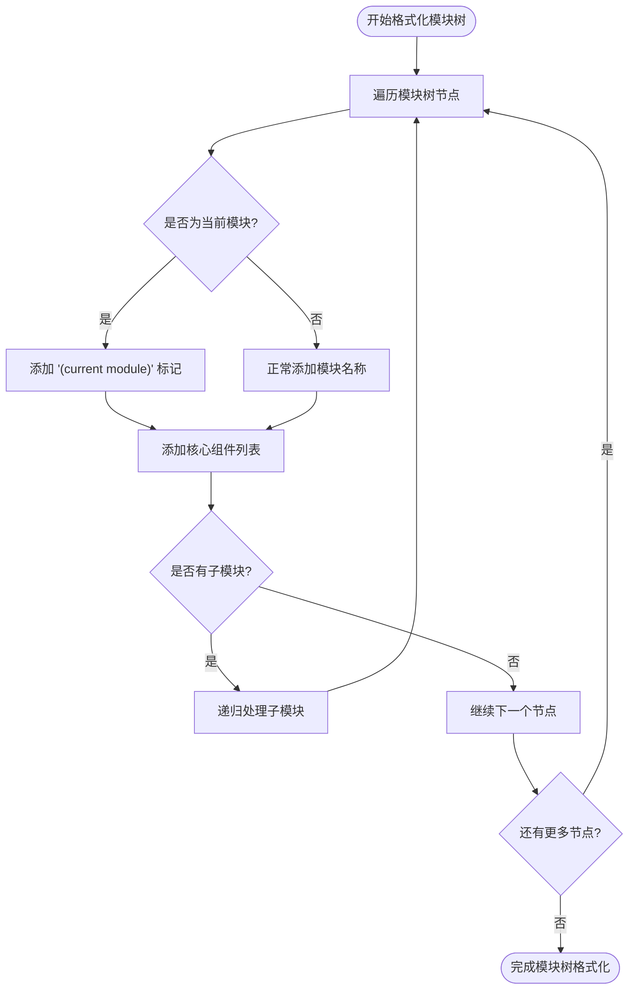
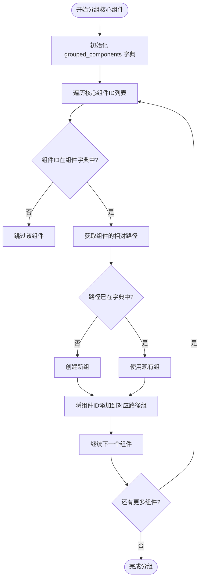
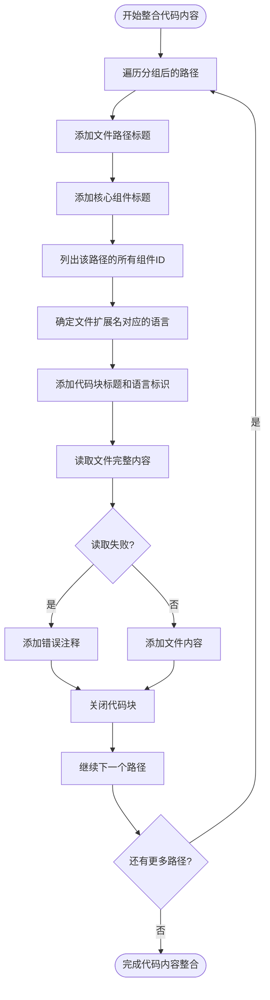
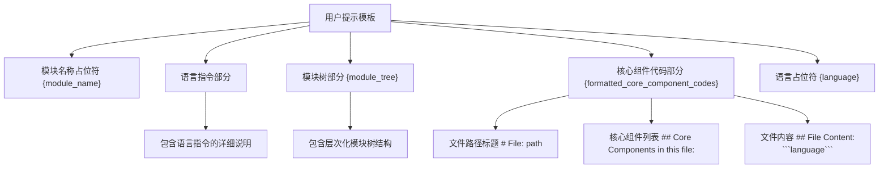

# 用户提示构建

<cite>
**本文档中引用的文件**  
- [prompt_template.py](file://codewiki/src/be/prompt_template.py#L272-L335)
- [agent_orchestrator.py](file://codewiki/src/be/agent_orchestrator.py#L160-L167)
- [generate_sub_module_documentations.py](file://codewiki/src/be/agent_tools/generate_sub_module_documentations.py#L78-L83)
- [core.py](file://codewiki/src/be/dependency_analyzer/models/core.py#L7-L44)
- [file_manager.py](file://codewiki/src/utils.py#L40-L43)
</cite>

## 目录
1. [简介](#简介)
2. [核心组件](#核心组件)
3. [模块树结构处理](#模块树结构处理)
4. [核心组件分组机制](#核心组件分组机制)
5. [代码内容整合与语言识别](#代码内容整合与语言识别)
6. [提示模板结构](#提示模板结构)
7. [调用示例与生成样本](#调用示例与生成样本)

## 简介
`format_user_prompt`函数是CodeWiki系统中用于构建LLM可解析输入的核心机制。该函数接收模块名称、核心组件ID列表、组件字典和模块树结构等参数，将其格式化为结构化的用户提示。此提示包含模块的层次化树状表示、核心组件的分组信息以及完整的文件内容，支持多语言输出，为AI代理生成高质量文档提供必要的上下文信息。

## 核心组件
`format_user_prompt`函数是用户提示构建的核心，它接收多个关键参数并生成结构化的LLM输入。该函数通过递归遍历模块树生成层次化表示，并在当前模块处标注"(current module)"。函数还负责将核心组件按文件路径分组，并使用EXTENSION_TO_LANGUAGE映射确定代码块的语言标识。

**本节来源**
- [prompt_template.py](file://codewiki/src/be/prompt_template.py#L272-L335)

## 模块树结构处理
`format_user_prompt`函数通过递归方式处理模块树结构，生成层次化的树状表示。函数内部定义了`_format_module_tree`辅助函数，该函数遍历模块树的每个节点，根据缩进级别构建层次结构。当遇到当前模块时，会在模块名称后添加"(current module)"标记，以突出显示当前处理的模块。

**图表来源**
- [prompt_template.py](file://codewiki/src/be/prompt_template.py#L289-L299)

**本节来源**
- [prompt_template.py](file://codewiki/src/be/prompt_template.py#L286-L302)

## 核心组件分组机制
函数通过`grouped_components`字典将核心组件按文件路径进行分组。该机制遍历核心组件ID列表，从组件字典中获取每个组件的相对路径，并将相同路径的组件ID归入同一组。这种分组方式确保了来自同一文件的组件被集中处理，便于后续的代码内容整合。

**图表来源**
- [prompt_template.py](file://codewiki/src/be/prompt_template.py#L307-L315)

**本节来源**
- [prompt_template.py](file://codewiki/src/be/prompt_template.py#L306-L316)

## 代码内容整合与语言识别
在分组完成后，函数构建包含文件路径、核心组件列表和完整文件内容的结构化输入。对于每个文件路径，函数使用EXTENSION_TO_LANGUAGE映射来确定代码块的语言标识。该映射支持多种编程语言，包括Python、JavaScript、TypeScript、Java、C++、C#和PHP等。函数通过文件扩展名查找对应的语言标识，并将其用于代码块的语法高亮。

**图表来源**
- [prompt_template.py](file://codewiki/src/be/prompt_template.py#L318-L333)

**本节来源**
- [prompt_template.py](file://codewiki/src/be/prompt_template.py#L317-L334)
- [prompt_template.py](file://codewiki/src/be/prompt_template.py#L244-L268)

## 提示模板结构
`format_user_prompt`函数最终使用USER_PROMPT模板构建完整的用户提示。该模板包含模块名称、格式化的模块树和核心组件代码三个主要部分。所有内容都通过`{language}`占位符支持多语言输出，确保生成的文档符合指定的语言要求。

**图表来源**
- [prompt_template.py](file://codewiki/src/be/prompt_template.py#L96-L111)

**本节来源**
- [prompt_template.py](file://codewiki/src/be/prompt_template.py#L335)

## 调用示例与生成样本
`format_user_prompt`函数在系统中被多个组件调用，包括`agent_orchestrator.py`和`generate_sub_module_documentations.py`。这些调用通常发生在AI代理运行之前，为代理提供必要的上下文信息。生成的提示样本包含完整的模块树结构、核心组件分组和文件内容，为LLM提供了丰富的上下文，使其能够生成准确的文档。

**本节来源**
- [agent_orchestrator.py](file://codewiki/src/be/agent_orchestrator.py#L160-L167)
- [generate_sub_module_documentations.py](file://codewiki/src/be/agent_tools/generate_sub_module_documentations.py#L78-L83)