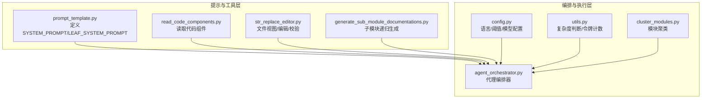
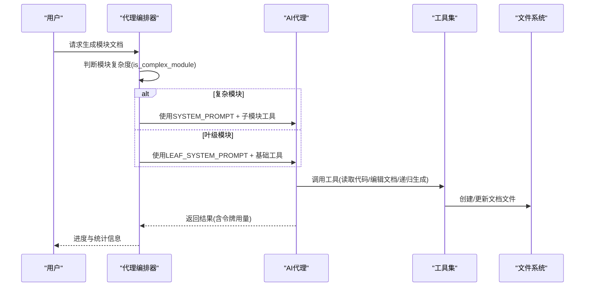
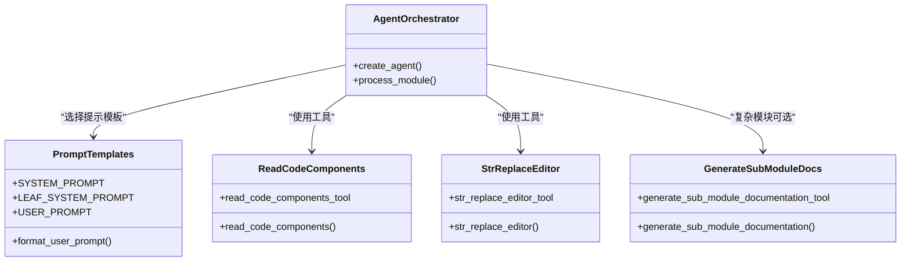
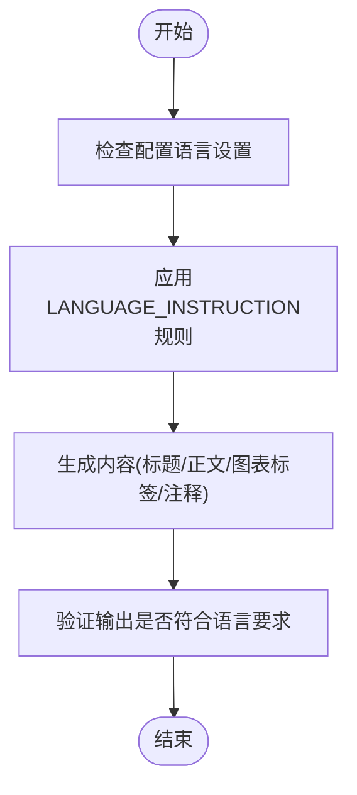
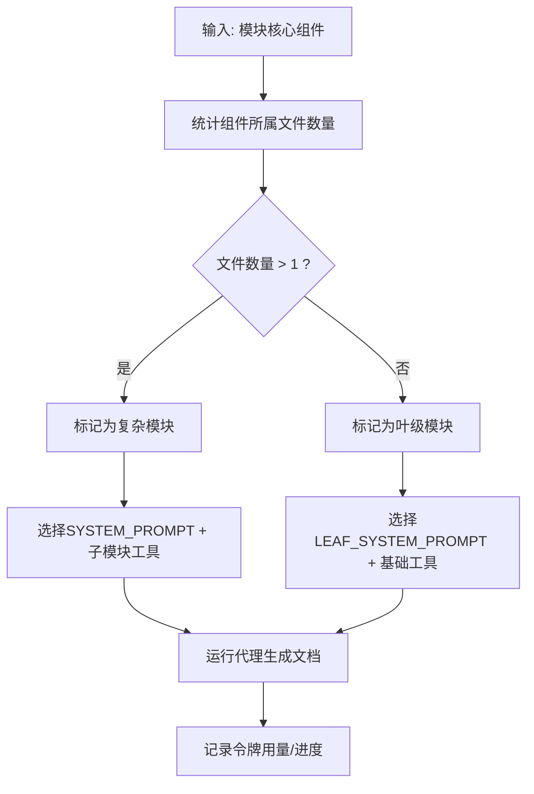
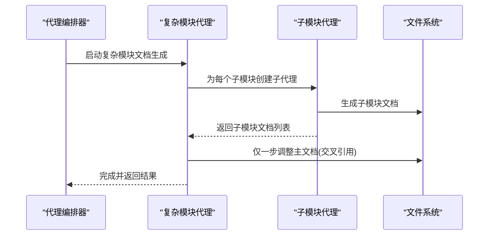
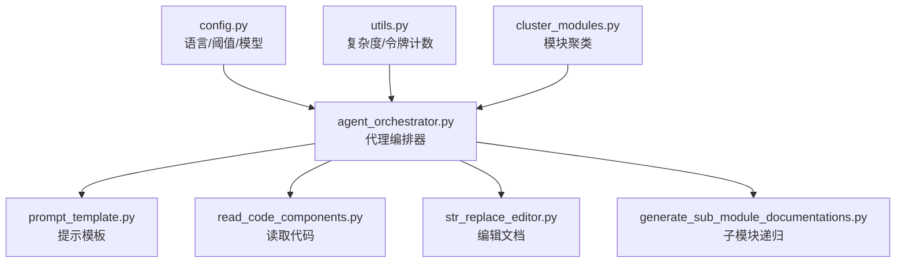

# 系统提示设计

<cite>
**本文档引用的文件**
- [prompt_template.py](file://codewiki/src/be/prompt_template.py)
- [generate_sub_module_documentations.py](file://codewiki/src/be/agent_tools/generate_sub_module_documentations.py)
- [agent_orchestrator.py](file://codewiki/src/be/agent_orchestrator.py)
- [utils.py](file://codewiki/src/be/utils.py)
- [cluster_modules.py](file://codewiki/src/be/cluster_modules.py)
- [config.py](file://codewiki/src/config.py)
- [read_code_components.py](file://codewiki/src/be/agent_tools/read_code_components.py)
- [str_replace_editor.py](file://codewiki/src/be/agent_tools/str_replace_editor.py)
- [main.py](file://codewiki/src/be/main.py)
</cite>

## 目录
1. [简介](#简介)
2. [项目结构](#项目结构)
3. [核心组件](#核心组件)
4. [架构总览](#架构总览)
5. [详细组件分析](#详细组件分析)
6. [依赖关系分析](#依赖关系分析)
7. [性能考量](#性能考量)
8. [故障排查指南](#故障排查指南)
9. [结论](#结论)

## 简介
本文件聚焦于CodeWiki系统提示设计，深入解析两种提示模板：SYSTEM_PROMPT与LEAF_SYSTEM_PROMPT的架构差异与适用场景。重点阐述以下方面：
- SYSTEM_PROMPT如何通过启用“生成子模块文档”工具，支持复杂模块的递归文档生成，适用于具有多个子模块的高层级模块；
- LEAF_SYSTEM_PROMPT针对叶级模块（单文件或简单模块）进行优化，采用扁平化工作流；
- 两者的&lt;LANGUAGE_INSTRUCTION&gt;标签如何强制所有输出（包括图表标签与注释）使用配置语言；
- &lt;AVAILABLE_TOOLS&gt;部分如何依据模块复杂度动态暴露工具集；
- &lt;WORKFLOW&gt;步骤中的“仅一步”原则如何确保文档一致性；
- 实际使用场景示例与系统如何根据模块类型自动选择合适提示模板。

## 项目结构
围绕系统提示设计的关键文件与职责如下：
- 提示模板定义：负责定义SYSTEM_PROMPT、LEAF_SYSTEM_PROMPT及用户提示格式化逻辑
- 代理工具：提供代码读取、文档编辑、子模块递归生成等工具
- 代理编排器：根据模块复杂度选择合适的提示模板与工具集
- 工具与配置：复杂度判断、令牌计数、阈值控制、语言配置等

**图表来源**
- [prompt_template.py](file://codewiki/src/be/prompt_template.py#L1-L134)
- [agent_orchestrator.py](file://codewiki/src/be/agent_orchestrator.py#L44-L93)
- [generate_sub_module_documentations.py](file://codewiki/src/be/agent_tools/generate_sub_module_documentations.py#L18-L113)
- [utils.py](file://codewiki/src/be/utils.py#L15-L38)
- [cluster_modules.py](file://codewiki/src/be/cluster_modules.py#L44-L125)
- [config.py](file://codewiki/src/config.py#L40-L78)

**章节来源**
- [prompt_template.py](file://codewiki/src/be/prompt_template.py#L1-L134)
- [agent_orchestrator.py](file://codewiki/src/be/agent_orchestrator.py#L44-L93)
- [generate_sub_module_documentations.py](file://codewiki/src/be/agent_tools/generate_sub_module_documentations.py#L18-L113)
- [utils.py](file://codewiki/src/be/utils.py#L15-L38)
- [cluster_modules.py](file://codewiki/src/be/cluster_modules.py#L44-L125)
- [config.py](file://codewiki/src/config.py#L40-L78)

## 核心组件
- SYSTEM_PROMPT：面向复杂模块的递归提示模板，包含生成主文档、子模块文档、可视化图表与跨引用调整的完整流程。
- LEAF_SYSTEM_PROMPT：面向叶级模块的简化提示模板，强调一次性生成完整文档，不涉及子模块递归。
- 语言指令：&lt;LANGUAGE_INSTRUCTION&gt;确保所有输出内容（标题、正文、图表标签、注释）统一为配置语言。
- 工具集：根据模块复杂度动态暴露工具，复杂模块可调用子模块递归生成工具，叶级模块仅使用基础工具。
- 工作流约束：复杂模块在完成子模块文档后，通过“仅一步”调整主文档以确保交叉引用一致。

**章节来源**
- [prompt_template.py](file://codewiki/src/be/prompt_template.py#L1-L134)
- [agent_orchestrator.py](file://codewiki/src/be/agent_orchestrator.py#L71-L93)
- [generate_sub_module_documentations.py](file://codewiki/src/be/agent_tools/generate_sub_module_documentations.py#L52-L69)

## 架构总览
系统提示设计贯穿“提示模板→代理编排→工具执行→文档生成”的闭环，关键交互如下：

**图表来源**
- [agent_orchestrator.py](file://codewiki/src/be/agent_orchestrator.py#L71-L93)
- [generate_sub_module_documentations.py](file://codewiki/src/be/agent_tools/generate_sub_module_documentations.py#L52-L69)
- [read_code_components.py](file://codewiki/src/be/agent_tools/read_code_components.py#L5-L21)
- [str_replace_editor.py](file://codewiki/src/be/agent_tools/str_replace_editor.py#L709-L790)

## 详细组件分析

### SYSTEM_PROMPT与LEAF_SYSTEM_PROMPT的架构差异
- 适用范围
  - SYSTEM_PROMPT：用于高层级模块，具备多文件、可拆分子模块的复杂性，支持递归生成子模块文档。
  - LEAF_SYSTEM_PROMPT：用于叶级模块，通常为单文件或简单模块，一次性生成完整文档。
- 工作流差异
  - SYSTEM_PROMPT：包含“生成子模块文档”的步骤，完成后通过“仅一步”调整主文档以确保交叉引用一致。
  - LEAF_SYSTEM_PROMPT：直接生成完整文档，无需子模块递归。
- 工具集差异
  - SYSTEM_PROMPT：动态暴露“生成子模块文档”工具，允许子代理进一步细分。
  - LEAF_SYSTEM_PROMPT：仅暴露基础工具，避免过度复杂化。
- 语言一致性
  - 两者均通过&lt;LANGUAGE_INSTRUCTION&gt;强制输出语言，确保标题、正文、图表标签与注释统一为配置语言。

**图表来源**
- [prompt_template.py](file://codewiki/src/be/prompt_template.py#L1-L134)
- [agent_orchestrator.py](file://codewiki/src/be/agent_orchestrator.py#L71-L93)
- [generate_sub_module_documentations.py](file://codewiki/src/be/agent_tools/generate_sub_module_documentations.py#L18-L113)
- [read_code_components.py](file://codewiki/src/be/agent_tools/read_code_components.py#L5-L21)
- [str_replace_editor.py](file://codewiki/src/be/agent_tools/str_replace_editor.py#L709-L790)

**章节来源**
- [prompt_template.py](file://codewiki/src/be/prompt_template.py#L1-L134)
- [agent_orchestrator.py](file://codewiki/src/be/agent_orchestrator.py#L71-L93)

### 语言指令与输出一致性
- &lt;LANGUAGE_INSTRUCTION&gt;覆盖范围
  - 标题与章节标题
  - 描述性文本与解释
  - 图表标签与注释
  - 注释与笔记
- 配置来源
  - 文档语言由配置项决定，默认从环境变量加载，支持英文与中文。
- 实施方式
  - 提示模板中显式声明语言要求，代理在生成过程中严格遵循该语言规范。

**图表来源**
- [prompt_template.py](file://codewiki/src/be/prompt_template.py#L6-L13)
- [config.py](file://codewiki/src/config.py#L40-L78)

**章节来源**
- [prompt_template.py](file://codewiki/src/be/prompt_template.py#L6-L13)
- [config.py](file://codewiki/src/config.py#L40-L78)

### 动态工具集与模块复杂度判定
- 复杂度判定
  - 依据核心组件所属文件数量判断：若超过一个文件，则视为复杂模块。
- 工具集暴露
  - 复杂模块：启用“生成子模块文档”工具，允许子代理进一步细分。
  - 叶级模块：仅启用基础工具（读取代码、编辑文档），避免过度复杂化。
- 令牌与深度控制
  - 结合令牌计数与最大递归深度，防止过深递归导致上下文溢出。

**图表来源**
- [utils.py](file://codewiki/src/be/utils.py#L15-L23)
- [agent_orchestrator.py](file://codewiki/src/be/agent_orchestrator.py#L71-L93)
- [generate_sub_module_documentations.py](file://codewiki/src/be/agent_tools/generate_sub_module_documentations.py#L52-L69)

**章节来源**
- [utils.py](file://codewiki/src/be/utils.py#L15-L23)
- [agent_orchestrator.py](file://codewiki/src/be/agent_orchestrator.py#L71-L93)
- [generate_sub_module_documentations.py](file://codewiki/src/be/agent_tools/generate_sub_module_documentations.py#L52-L69)

### “仅一步”原则与文档一致性
- 复杂模块的“仅一步”
  - 在完成所有子模块文档生成后，仅执行一次主文档的调整步骤，确保所有生成文件（包括子模块文档）正确交叉引用。
- 叶级模块
  - 一次性生成完整文档，无需额外的交叉引用调整步骤。

**图表来源**
- [prompt_template.py](file://codewiki/src/be/prompt_template.py#L41-L47)
- [generate_sub_module_documentations.py](file://codewiki/src/be/agent_tools/generate_sub_module_documentations.py#L75-L110)

**章节来源**
- [prompt_template.py](file://codewiki/src/be/prompt_template.py#L41-L47)
- [generate_sub_module_documentations.py](file://codewiki/src/be/agent_tools/generate_sub_module_documentations.py#L75-L110)

### 实际使用场景示例
- 场景一：高层级模块（如“依赖分析器”）
  - 模块包含多个子模块（如C/C++、Java、Python等语言分析器），文件数量较多，属于复杂模块。
  - 系统自动选择SYSTEM_PROMPT，启用“生成子模块文档”工具，递归生成各语言分析器的详细文档，并在完成后仅一步调整主文档的交叉引用。
- 场景二：叶级模块（如“配置管理”）
  - 模块仅包含少量文件或单个文件，功能相对简单，属于叶级模块。
  - 系统自动选择LEAF_SYSTEM_PROMPT，一次性生成完整文档，不涉及子模块递归。

**章节来源**
- [agent_orchestrator.py](file://codewiki/src/be/agent_orchestrator.py#L71-L93)
- [generate_sub_module_documentations.py](file://codewiki/src/be/agent_tools/generate_sub_module_documentations.py#L52-L69)

## 依赖关系分析
- 提示模板与代理编排器
  - 代理编排器根据模块复杂度选择SYSTEM_PROMPT或LEAF_SYSTEM_PROMPT，并注入语言参数。
- 工具依赖
  - 复杂模块代理依赖“生成子模块文档”工具以实现递归；叶级模块代理仅依赖基础工具。
- 配置与阈值
  - 语言、最大递归深度、令牌阈值等配置影响代理选择与工具暴露。

**图表来源**
- [config.py](file://codewiki/src/config.py#L40-L78)
- [agent_orchestrator.py](file://codewiki/src/be/agent_orchestrator.py#L71-L93)
- [prompt_template.py](file://codewiki/src/be/prompt_template.py#L1-L134)
- [generate_sub_module_documentations.py](file://codewiki/src/be/agent_tools/generate_sub_module_documentations.py#L18-L113)
- [utils.py](file://codewiki/src/be/utils.py#L15-L38)
- [cluster_modules.py](file://codewiki/src/be/cluster_modules.py#L44-L125)

**章节来源**
- [config.py](file://codewiki/src/config.py#L40-L78)
- [agent_orchestrator.py](file://codewiki/src/be/agent_orchestrator.py#L71-L93)
- [prompt_template.py](file://codewiki/src/be/prompt_template.py#L1-L134)
- [generate_sub_module_documentations.py](file://codewiki/src/be/agent_tools/generate_sub_module_documentations.py#L18-L113)
- [utils.py](file://codewiki/src/be/utils.py#L15-L38)
- [cluster_modules.py](file://codewiki/src/be/cluster_modules.py#L44-L125)

## 性能考量
- 令牌计数与阈值控制
  - 通过令牌计数限制单次处理规模，避免超出模型上下文长度；复杂模块结合最大递归深度共同控制资源消耗。
- 工具调用开销
  - 文件读取与文档编辑操作可能产生额外开销，建议在生成前进行必要的预过滤与分组。
- 并发与稳定性
  - 子模块递归生成时应避免过度并发，确保每个子模块任务的稳定完成与错误恢复。

[本节为通用指导，不直接分析具体文件]

## 故障排查指南
- 语言输出异常
  - 检查配置中的语言设置是否正确；确认提示模板中的&lt;LANGUAGE_INSTRUCTION&gt;未被修改。
- 工具不可用或报错
  - 复杂模块需确认“生成子模块文档”工具已启用；叶级模块仅使用基础工具。
- 递归深度或令牌超限
  - 调整最大递归深度与令牌阈值；必要时对模块进行二次聚类或拆分。
- 文档交叉引用不一致
  - 确保复杂模块在生成子模块后执行“仅一步”调整步骤。

**章节来源**
- [prompt_template.py](file://codewiki/src/be/prompt_template.py#L6-L13)
- [agent_orchestrator.py](file://codewiki/src/be/agent_orchestrator.py#L71-L93)
- [generate_sub_module_documentations.py](file://codewiki/src/be/agent_tools/generate_sub_module_documentations.py#L52-L69)
- [config.py](file://codewiki/src/config.py#L15-L17)

## 结论
CodeWiki的系统提示设计通过两种模板与动态工具集实现了对不同复杂度模块的适配：
- SYSTEM_PROMPT适用于复杂模块，支持递归生成子模块文档并通过“仅一步”确保交叉引用一致；
- LEAF_SYSTEM_PROMPT适用于叶级模块，采用扁平化工作流，提升效率；
- &lt;LANGUAGE_INSTRUCTION&gt;确保输出语言一致性；
- 工具集按需暴露，结合令牌计数与深度控制，保障系统稳定性与性能。