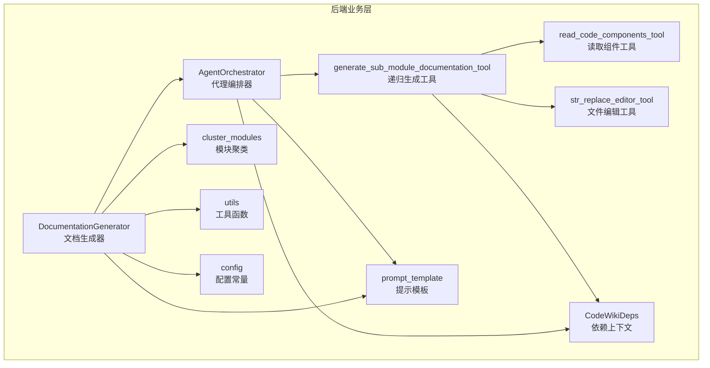
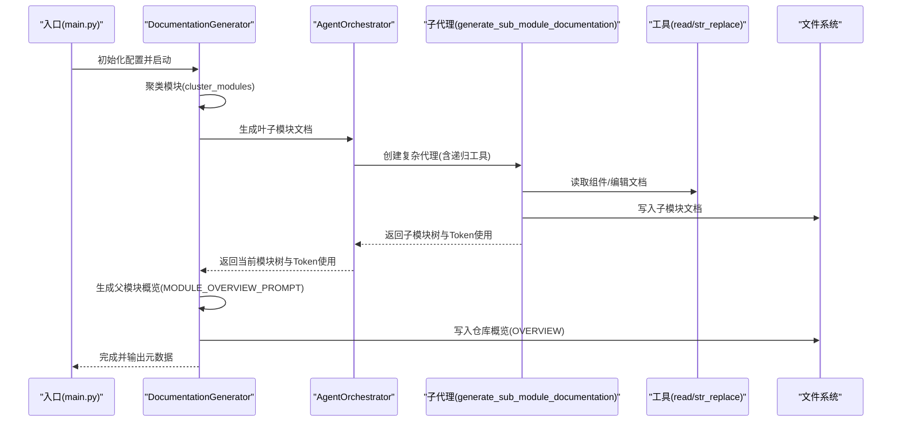
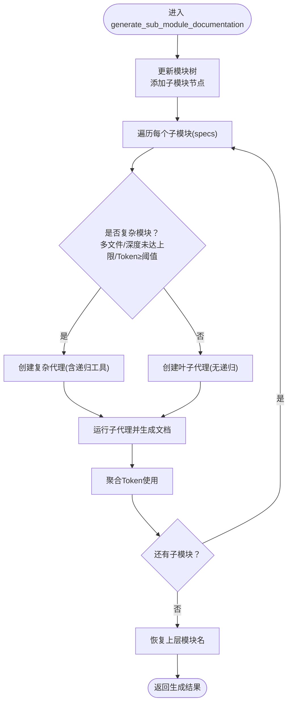
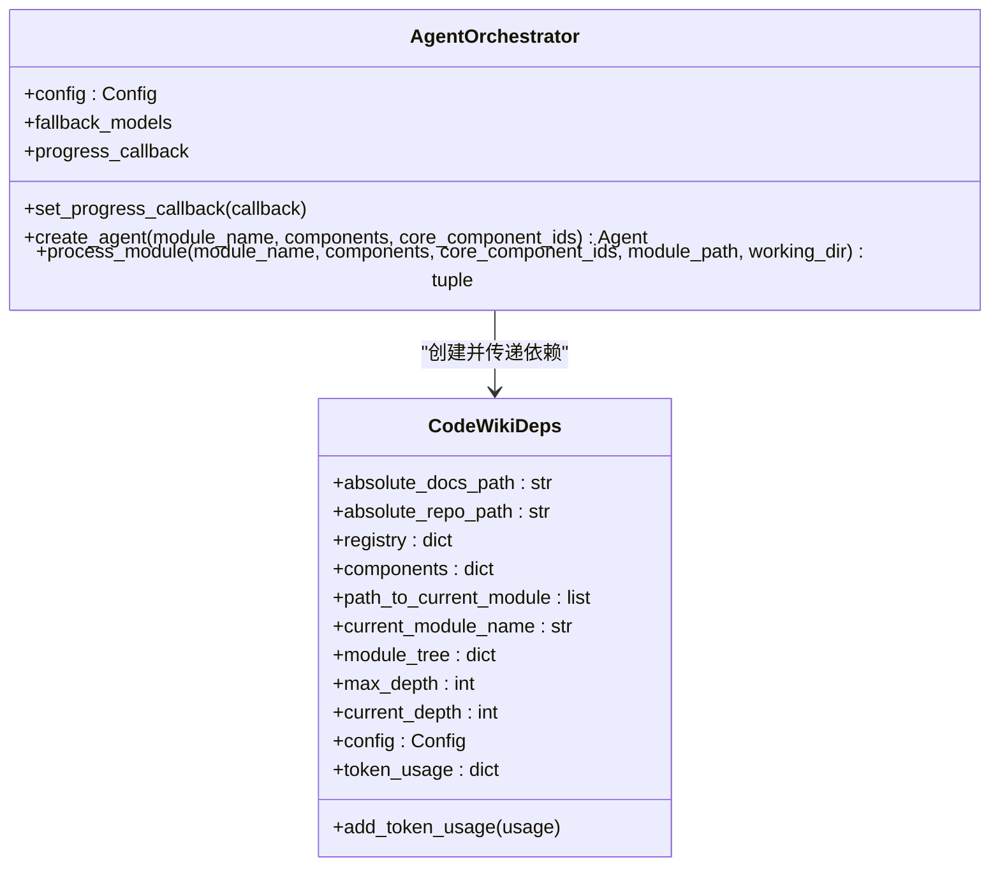
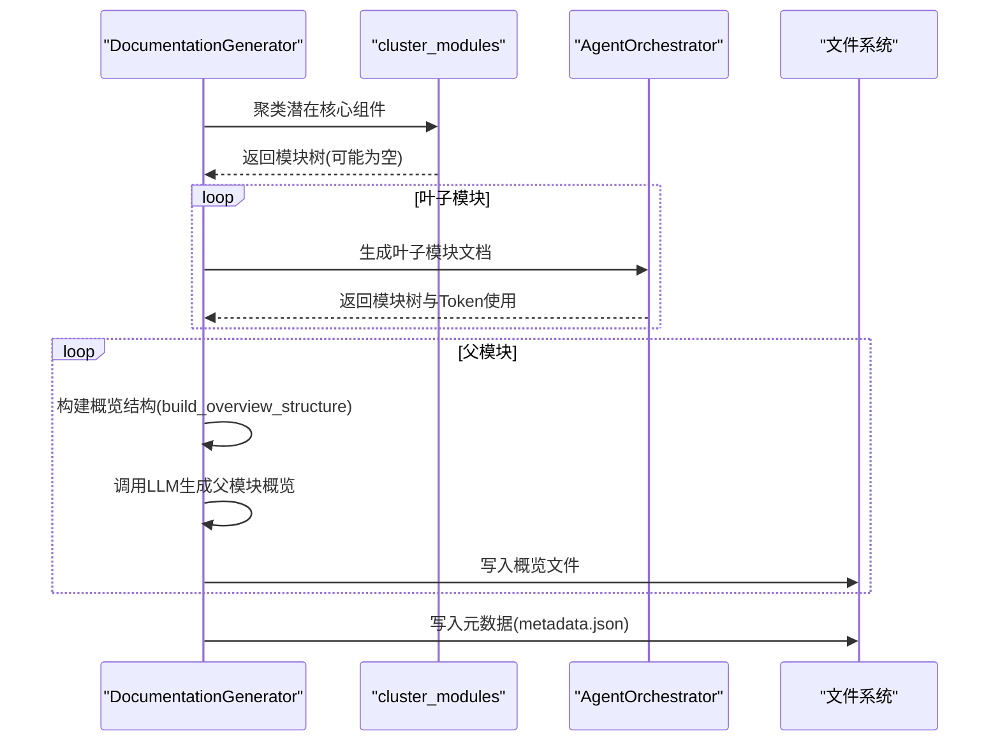
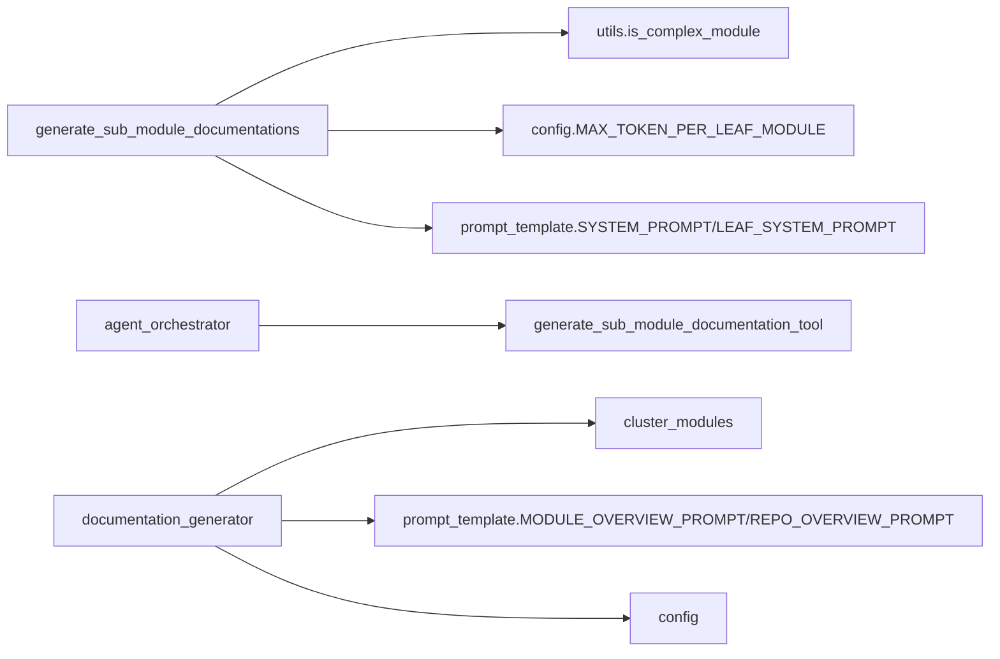

# 递归生成

<cite>
**本文档引用的文件**
- [generate_sub_module_documentations.py](file://codewiki/src/be/agent_tools/generate_sub_module_documentations.py)
- [agent_orchestrator.py](file://codewiki/src/be/agent_orchestrator.py)
- [documentation_generator.py](file://codewiki/src/be/documentation_generator.py)
- [prompt_template.py](file://codewiki/src/be/prompt_template.py)
- [utils.py](file://codewiki/src/be/utils.py)
- [cluster_modules.py](file://codewiki/src/be/cluster_modules.py)
- [deps.py](file://codewiki/src/be/agent_tools/deps.py)
- [config.py](file://codewiki/src/config.py)
- [read_code_components.py](file://codewiki/src/be/agent_tools/read_code_components.py)
- [str_replace_editor.py](file://codewiki/src/be/agent_tools/str_replace_editor.py)
- [main.py](file://codewiki/src/be/main.py)
</cite>

## 目录
1. [引言](#引言)
2. [项目结构](#项目结构)
3. [核心组件](#核心组件)
4. [架构总览](#架构总览)
5. [详细组件分析](#详细组件分析)
6. [依赖关系分析](#依赖关系分析)
7. [性能考量](#性能考量)
8. [故障排查指南](#故障排查指南)
9. [结论](#结论)

## 引言
本专项文档聚焦于CodeWiki中“递归文档生成”机制，系统阐释`generate_sub_module_documentation_tool`工具如何作为AI代理的扩展能力，使主代理在面对复杂模块时能够动态委派子代理生成子模块的详细文档。该机制通过分治法（Divide and Conquer）将大型模块的文档生成任务拆解为更小、更易管理的子任务，从而有效规避单次LLM上下文窗口限制，确保大规模代码库的可扩展文档生成。结合`SYSTEM_PROMPT`中的`<WORKFLOW>`指令，主代理在生成所有子模块文档后，会进行最终的交叉引用整合，形成完整的模块与仓库级文档体系。

## 项目结构
围绕递归生成的核心代码主要位于后端业务层（`codewiki/src/be/`），包括：
- 代理工具：`generate_sub_module_documentations.py`、`read_code_components.py`、`str_replace_editor.py`
- 代理编排器：`agent_orchestrator.py`
- 文档生成器：`documentation_generator.py`
- 提示模板与工作流：`prompt_template.py`
- 工具函数与配置：`utils.py`、`cluster_modules.py`、`deps.py`、`config.py`
- 入口脚本：`main.py`

图表来源
- [documentation_generator.py](file://codewiki/src/be/documentation_generator.py#L137-L251)
- [agent_orchestrator.py](file://codewiki/src/be/agent_orchestrator.py#L59-L198)
- [generate_sub_module_documentations.py](file://codewiki/src/be/agent_tools/generate_sub_module_documentations.py#L18-L113)
- [prompt_template.py](file://codewiki/src/be/prompt_template.py#L1-L368)
- [config.py](file://codewiki/src/config.py#L1-L123)

章节来源
- [main.py](file://codewiki/src/be/main.py#L49-L69)
- [config.py](file://codewiki/src/config.py#L1-L123)

## 核心组件
- 递归生成工具（`generate_sub_module_documentation_tool`）：负责接收子模块规格，创建子代理，委派子任务，并在完成后进行结果聚合与日志记录。
- 代理编排器（`AgentOrchestrator`）：根据模块复杂度动态选择“复杂代理”（具备递归能力）或“叶子代理”，并执行模块文档生成。
- 文档生成器（`DocumentationGenerator`）：协调模块聚类、按拓扑顺序生成叶子模块与父模块文档，并在最后生成仓库级概览。
- 提示模板（`prompt_template`）：定义主代理与子代理的工作流，明确“先生成子模块，再进行交叉引用整合”的步骤。
- 工具函数与配置：提供复杂度判断、Token计数、模块聚类等支撑能力。

章节来源
- [generate_sub_module_documentations.py](file://codewiki/src/be/agent_tools/generate_sub_module_documentations.py#L18-L113)
- [agent_orchestrator.py](file://codewiki/src/be/agent_orchestrator.py#L59-L198)
- [documentation_generator.py](file://codewiki/src/be/documentation_generator.py#L137-L251)
- [prompt_template.py](file://codewiki/src/be/prompt_template.py#L1-L368)
- [utils.py](file://codewiki/src/be/utils.py#L15-L38)
- [cluster_modules.py](file://codewiki/src/be/cluster_modules.py#L44-L125)
- [deps.py](file://codewiki/src/be/agent_tools/deps.py#L5-L28)

## 架构总览
下图展示了从入口到递归生成再到最终整合的完整流程：

图表来源
- [main.py](file://codewiki/src/be/main.py#L49-L69)
- [documentation_generator.py](file://codewiki/src/be/documentation_generator.py#L320-L382)
- [agent_orchestrator.py](file://codewiki/src/be/agent_orchestrator.py#L95-L198)
- [generate_sub_module_documentations.py](file://codewiki/src/be/agent_tools/generate_sub_module_documentations.py#L18-L113)
- [prompt_template.py](file://codewiki/src/be/prompt_template.py#L136-L157)

## 详细组件分析

### 递归生成工具：generate_sub_module_documentation_tool
- 接收参数：子模块规格字典（键为子模块名，值为该子模块的核心组件ID列表）
- 动态代理创建：
  - 复杂模块：当组件来自多个文件且深度未达上限、Token数达到阈值时，创建具备递归能力的复杂代理（包含`generate_sub_module_documentation_tool`）
  - 叶子模块：否则创建简单代理（仅包含基础工具）
- 模块树更新：将子模块加入当前模块树，维护路径与深度
- 子任务执行：逐个子模块运行代理，记录Token使用并处理异常
- 结果返回：汇总已生成文档文件名

图表来源
- [generate_sub_module_documentations.py](file://codewiki/src/be/agent_tools/generate_sub_module_documentations.py#L18-L113)
- [utils.py](file://codewiki/src/be/utils.py#L15-L23)
- [config.py](file://codewiki/src/config.py#L15-L17)

章节来源
- [generate_sub_module_documentations.py](file://codewiki/src/be/agent_tools/generate_sub_module_documentations.py#L18-L113)
- [utils.py](file://codewiki/src/be/utils.py#L15-L23)
- [config.py](file://codewiki/src/config.py#L15-L17)

### 代理编排器：AgentOrchestrator
- 代理创建策略：
  - 复杂模块：启用递归工具，适合进一步细分
  - 简单模块：仅启用基础工具，直接生成文档
- 模块处理流程：
  - 加载/创建模块树
  - 创建代理与依赖上下文（包含路径、深度、最大深度、组件集合等）
  - 执行代理并保存模块树
  - 记录Token使用并回调进度

图表来源
- [agent_orchestrator.py](file://codewiki/src/be/agent_orchestrator.py#L59-L198)
- [deps.py](file://codewiki/src/be/agent_tools/deps.py#L5-L28)

章节来源
- [agent_orchestrator.py](file://codewiki/src/be/agent_orchestrator.py#L59-L198)
- [deps.py](file://codewiki/src/be/agent_tools/deps.py#L5-L28)

### 文档生成器：DocumentationGenerator
- 模块聚类：基于潜在核心组件与模块树，使用LLM进行模块分组与递归聚类
- 处理顺序：叶子模块优先，随后父模块，最后仓库级概览
- 父模块概览：基于子模块文档构建结构化概览，使用`MODULE_OVERVIEW_PROMPT`或`REPO_OVERVIEW_PROMPT`
- 元数据生成：统计组件数量、叶子节点、最大深度与Token使用情况

图表来源
- [documentation_generator.py](file://codewiki/src/be/documentation_generator.py#L137-L382)
- [cluster_modules.py](file://codewiki/src/be/cluster_modules.py#L44-L125)
- [prompt_template.py](file://codewiki/src/be/prompt_template.py#L113-L157)

章节来源
- [documentation_generator.py](file://codewiki/src/be/documentation_generator.py#L137-L382)
- [cluster_modules.py](file://codewiki/src/be/cluster_modules.py#L44-L125)

### 提示模板与工作流：SYSTEM_PROMPT
- 主代理工作流明确指出：
  - 先生成主模块文档
  - 对复杂模块使用`generate_sub_module_documentation`生成子模块文档
  - 最后进行交叉引用整合（仅一步调整，确保所有生成文件正确引用）
- 叶子代理工作流则专注于一次性完成模块文档生成。

章节来源
- [prompt_template.py](file://codewiki/src/be/prompt_template.py#L41-L47)
- [prompt_template.py](file://codewiki/src/be/prompt_template.py#L84-L88)

### 工具与配置支撑
- 复杂度判断：依据核心组件来自不同文件的数量判定
- Token计数：用于控制上下文大小，避免超过模型窗口
- 配置常量：最大深度、每模块/叶子模块最大Token数等

章节来源
- [utils.py](file://codewiki/src/be/utils.py#L15-L38)
- [config.py](file://codewiki/src/config.py#L15-L17)

## 依赖关系分析
- 组件耦合：
  - `generate_sub_module_documentations`依赖`utils.is_complex_module`、`config.MAX_TOKEN_PER_LEAF_MODULE`、`prompt_template.SYSTEM_PROMPT/LEAF_SYSTEM_PROMPT`
  - `agent_orchestrator`依赖`generate_sub_module_documentation_tool`以支持递归
  - `documentation_generator`依赖`cluster_modules`与`prompt_template`的概览提示
- 外部依赖：
  - LLM服务（主模型、回退模型、聚类模型）
  - 文件系统与JSON/文本读写

图表来源
- [generate_sub_module_documentations.py](file://codewiki/src/be/agent_tools/generate_sub_module_documentations.py#L1-L14)
- [agent_orchestrator.py](file://codewiki/src/be/agent_orchestrator.py#L39-L56)
- [documentation_generator.py](file://codewiki/src/be/documentation_generator.py#L14-L26)

章节来源
- [generate_sub_module_documentations.py](file://codewiki/src/be/agent_tools/generate_sub_module_documentations.py#L1-L14)
- [agent_orchestrator.py](file://codewiki/src/be/agent_orchestrator.py#L39-L56)
- [documentation_generator.py](file://codewiki/src/be/documentation_generator.py#L14-L26)

## 性能考量
- 分治策略降低单次上下文压力：通过将大模块拆分为子模块，避免一次性处理过多组件导致Token超限
- Token使用追踪：在每个代理调用后聚合统计，便于成本控制与优化
- 深度与阈值控制：`max_depth`与`MAX_TOKEN_PER_LEAF_MODULE`共同约束递归深度与上下文规模
- 并发与顺序：叶子模块优先生成，减少父模块等待时间；父模块概览统一生成，避免重复计算

## 故障排查指南
- 子模块生成失败：
  - 检查子模块是否仍存在组件缺失或路径错误
  - 查看Token使用与上下文长度是否超过模型限制
  - 确认代理工具链（读取组件/编辑文档）是否正常
- 模块树不一致：
  - 确保每次生成后模块树被正确保存与加载
  - 检查路径与深度字段是否在递归过程中被正确维护
- 概览生成异常：
  - 确认子模块文档已生成并可被读取
  - 检查`build_overview_structure`是否正确注入目标模块标记

章节来源
- [generate_sub_module_documentations.py](file://codewiki/src/be/agent_tools/generate_sub_module_documentations.py#L75-L105)
- [agent_orchestrator.py](file://codewiki/src/be/agent_orchestrator.py#L149-L198)
- [documentation_generator.py](file://codewiki/src/be/documentation_generator.py#L253-L318)

## 结论
CodeWiki的递归文档生成机制通过“复杂模块→子模块→叶子模块”的分治策略，结合代理工具链与提示模板工作流，实现了对大型代码库的高效、可扩展文档生成。`generate_sub_module_documentation_tool`作为关键扩展能力，使主代理能够在必要时委派子代理，完成更细粒度的任务划分；最终由主代理在所有子模块文档生成后进行交叉引用整合，确保文档体系的一致性与完整性。配合模块聚类、Token计数与深度控制，该机制有效规避了LLM上下文窗口限制，提升了整体生成效率与质量。