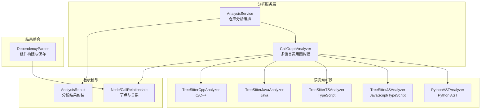
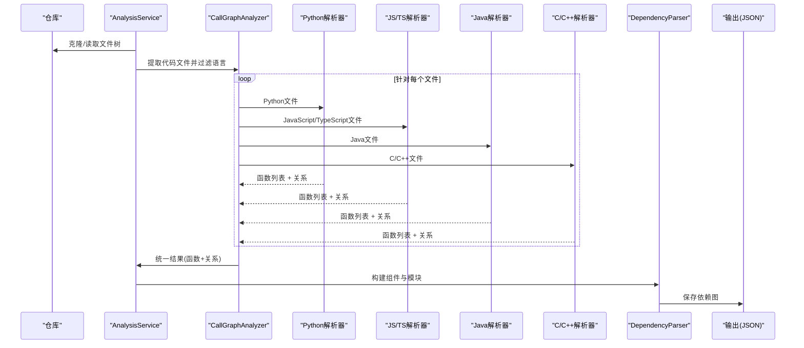
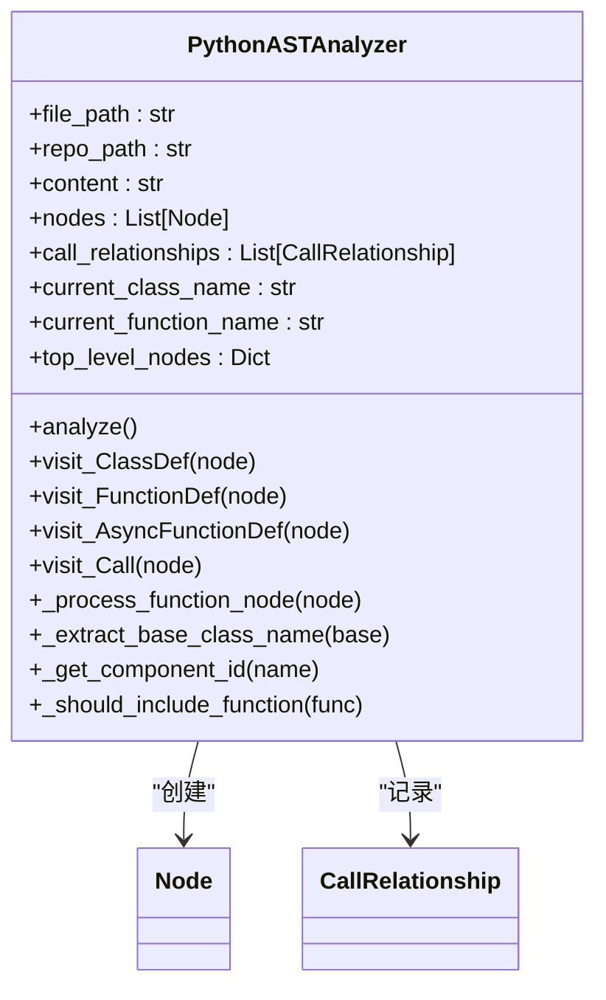
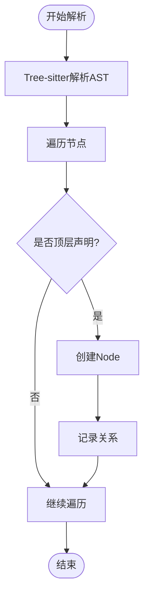
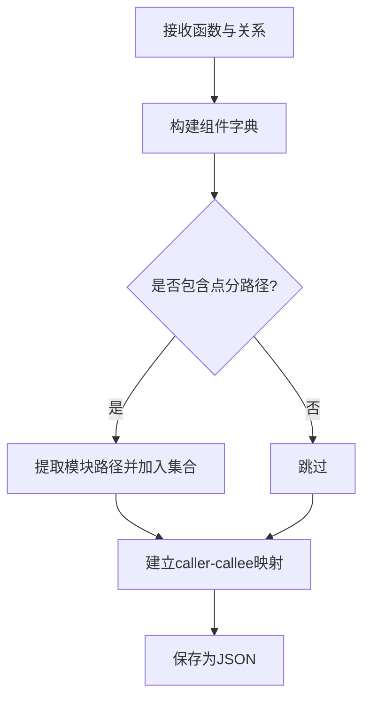
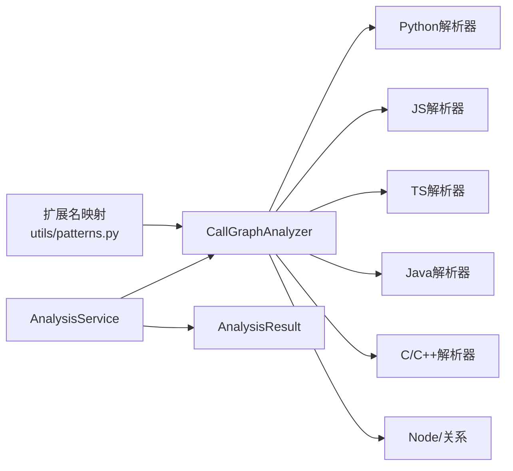

# AST解析器

<cite>
**本文引用的文件**
- [ast_parser.py](file://codewiki/src/be/dependency_analyzer/ast_parser.py)
- [python.py](file://codewiki/src/be/dependency_analyzer/analyzers/python.py)
- [javascript.py](file://codewiki/src/be/dependency_analyzer/analyzers/javascript.py)
- [typescript.py](file://codewiki/src/be/dependency_analyzer/analyzers/typescript.py)
- [java.py](file://codewiki/src/be/dependency_analyzer/analyzers/java.py)
- [cpp.py](file://codewiki/src/be/dependency_analyzer/analyzers/cpp.py)
- [core.py](file://codewiki/src/be/dependency_analyzer/models/core.py)
- [analysis.py](file://codewiki/src/be/dependency_analyzer/models/analysis.py)
- [analysis_service.py](file://codewiki/src/be/dependency_analyzer/analysis/analysis_service.py)
- [call_graph_analyzer.py](file://codewiki/src/be/dependency_analyzer/analysis/call_graph_analyzer.py)
- [patterns.py](file://codewiki/src/be/dependency_analyzer/utils/patterns.py)
- [prompt_template.py](file://codewiki/cli/utils/prompt_template.py)
</cite>

## 目录
1. [简介](#简介)
2. [项目结构](#项目结构)
3. [核心组件](#核心组件)
4. [架构总览](#架构总览)
5. [详细组件分析](#详细组件分析)
6. [依赖关系分析](#依赖关系分析)
7. [性能考量](#性能考量)
8. [故障排查指南](#故障排查指南)
9. [结论](#结论)
10. [附录](#附录)

## 简介
本文件面向CodeWiki的AST解析器子系统，系统性阐述其基于Tree-sitter与Python内置AST的多语言抽象语法树解析机制。重点说明：
- ast_parser.py如何协调多语言分析器（python.py、javascript.py、typescript.py、java.py、cpp.py）对不同编程语言的代码文件进行语法分析；
- AST遍历过程中如何提取类、函数、方法、接口等代码组件及其元数据（位置、类型、依赖关系）；
- 对比Python与JavaScript/TypeScript在AST结构上的差异及解析策略的不同处理方式；
- 实际代码示例展示AST节点提取过程，并说明解析结果如何作为后续依赖分析的基础输入；
- 错误处理机制与性能优化策略，包括大文件处理与缓存机制。

## 项目结构
围绕AST解析的核心模块组织如下：
- 解析入口与协调：analysis_service.py、call_graph_analyzer.py
- AST解析器实现：python.py（Python）、javascript.py（JavaScript/TypeScript）、typescript.py（TypeScript）、java.py（Java）、cpp.py（C/C++）
- 数据模型：models/core.py、models/analysis.py
- 结果整合与输出：ast_parser.py
- 语言映射与扩展：utils/patterns.py、cli/utils/prompt_template.py

图表来源
- [analysis_service.py](file://codewiki/src/be/dependency_analyzer/analysis/analysis_service.py#L24-L370)
- [call_graph_analyzer.py](file://codewiki/src/be/dependency_analyzer/analysis/call_graph_analyzer.py#L20-L536)
- [python.py](file://codewiki/src/be/dependency_analyzer/analyzers/python.py#L15-L267)
- [javascript.py](file://codewiki/src/be/dependency_analyzer/analyzers/javascript.py#L18-L706)
- [typescript.py](file://codewiki/src/be/dependency_analyzer/analyzers/typescript.py#L17-L982)
- [java.py](file://codewiki/src/be/dependency_analyzer/analyzers/java.py#L13-L356)
- [cpp.py](file://codewiki/src/be/dependency_analyzer/analyzers/cpp.py#L13-L369)
- [core.py](file://codewiki/src/be/dependency_analyzer/models/core.py#L7-L64)
- [analysis.py](file://codewiki/src/be/dependency_analyzer/models/analysis.py#L6-L24)
- [ast_parser.py](file://codewiki/src/be/dependency_analyzer/ast_parser.py#L17-L145)

章节来源
- [analysis_service.py](file://codewiki/src/be/dependency_analyzer/analysis/analysis_service.py#L24-L370)
- [call_graph_analyzer.py](file://codewiki/src/be/dependency_analyzer/analysis/call_graph_analyzer.py#L20-L536)

## 核心组件
- AnalysisService：负责仓库克隆、结构分析、多语言AST解析与调用图生成的编排中心。
- CallGraphAnalyzer：按文件维度调度各语言分析器，收集所有函数与关系，去重与可视化。
- 各语言分析器：基于Python AST或Tree-sitter语法树抽取节点与关系。
- Node/CallRelationship：统一的数据模型，用于描述组件与调用关系。
- DependencyParser：从分析结果中构建组件字典、模块集合与依赖关系映射，并可持久化为JSON。

章节来源
- [analysis_service.py](file://codewiki/src/be/dependency_analyzer/analysis/analysis_service.py#L24-L370)
- [call_graph_analyzer.py](file://codewiki/src/be/dependency_analyzer/analysis/call_graph_analyzer.py#L20-L536)
- [core.py](file://codewiki/src/be/dependency_analyzer/models/core.py#L7-L64)
- [ast_parser.py](file://codewiki/src/be/dependency_analyzer/ast_parser.py#L17-L145)

## 架构总览
下图展示了从仓库到最终依赖图的关键流程：结构分析 → 多语言AST解析 → 节点与关系聚合 → 可视化与持久化。

图表来源
- [analysis_service.py](file://codewiki/src/be/dependency_analyzer/analysis/analysis_service.py#L273-L294)
- [call_graph_analyzer.py](file://codewiki/src/be/dependency_analyzer/analysis/call_graph_analyzer.py#L27-L67)
- [python.py](file://codewiki/src/be/dependency_analyzer/analyzers/python.py#L248-L266)
- [javascript.py](file://codewiki/src/be/dependency_analyzer/analyzers/javascript.py#L687-L701)
- [typescript.py](file://codewiki/src/be/dependency_analyzer/analyzers/typescript.py#L982-L982)
- [java.py](file://codewiki/src/be/dependency_analyzer/analyzers/java.py#L354-L356)
- [cpp.py](file://codewiki/src/be/dependency_analyzer/analyzers/cpp.py#L366-L369)
- [ast_parser.py](file://codewiki/src/be/dependency_analyzer/ast_parser.py#L27-L44)

## 详细组件分析

### Python AST解析器（PythonASTAnalyzer）
- 基于Python内置ast库，使用NodeVisitor遍历AST。
- 提取顶层类与函数，记录源码片段、起止行号、参数、docstring等元数据。
- 记录类继承关系（基类名映射到同模块内的类）与函数调用关系（仅记录对顶级符号的调用）。
- 过滤测试命名模式，避免将测试函数纳入分析。

图表来源
- [python.py](file://codewiki/src/be/dependency_analyzer/analyzers/python.py#L15-L267)
- [core.py](file://codewiki/src/be/dependency_analyzer/models/core.py#L7-L64)

章节来源
- [python.py](file://codewiki/src/be/dependency_analyzer/analyzers/python.py#L15-L267)

### JavaScript/TypeScript解析器（TreeSitterJSAnalyzer/TreeSitterTSAnalyzer）
- 使用Tree-sitter解析JavaScript/TypeScript，支持类、接口、函数、方法、箭头函数、导出声明等多种节点类型。
- 通过递归遍历AST节点，提取顶层声明与方法定义，生成Node对象。
- 记录调用关系：call_expression/new_expression/member/subscript/type_annotation/type_arguments等节点触发关系抽取。
- 支持JSDoc类型依赖解析（@param/@returns/@type/@typedef/@interface等），并过滤内置类型。

图表来源
- [javascript.py](file://codewiki/src/be/dependency_analyzer/analyzers/javascript.py#L51-L71)
- [typescript.py](file://codewiki/src/be/dependency_analyzer/analyzers/typescript.py#L39-L59)

章节来源
- [javascript.py](file://codewiki/src/be/dependency_analyzer/analyzers/javascript.py#L18-L706)
- [typescript.py](file://codewiki/src/be/dependency_analyzer/analyzers/typescript.py#L17-L982)

### Java解析器（TreeSitterJavaAnalyzer）
- 使用Tree-sitter解析Java，识别class/interface/enum/record/annotation等类型。
- 提取方法调用、继承、接口实现、字段类型使用、对象创建等关系。
- 过滤Java原生与常用容器类型，避免噪声。

章节来源
- [java.py](file://codewiki/src/be/dependency_analyzer/analyzers/java.py#L13-L356)

### C/C++解析器（TreeSitterCppAnalyzer）
- 使用Tree-sitter解析C/C++，识别class/struct/function/namespace/全局变量等。
- 提取方法调用、继承、new表达式、变量使用等关系。
- 过滤系统函数与常见标准库函数。

章节来源
- [cpp.py](file://codewiki/src/be/dependency_analyzer/analyzers/cpp.py#L13-L369)

### 依赖图构建与保存（DependencyParser）
- 从AnalysisService返回的函数与关系列表构建组件字典与模块集合。
- 将关系映射到已存在的组件ID，支持“模块.类.方法”与“模块.函数”的命名空间。
- 保存为JSON，包含每个组件的依赖集合。

图表来源
- [ast_parser.py](file://codewiki/src/be/dependency_analyzer/ast_parser.py#L46-L145)

章节来源
- [ast_parser.py](file://codewiki/src/be/dependency_analyzer/ast_parser.py#L17-L145)

## 依赖关系分析
- CallGraphAnalyzer负责：
  - 从文件树中提取代码文件并按扩展名映射语言；
  - 路由到对应语言分析器；
  - 汇总所有函数与关系；
  - 去重与可视化数据生成。
- 分析服务层：
  - 支持本地仓库与GitHub仓库分析；
  - 结构分析与调用图分析两阶段；
  - 清理临时目录与异常处理。

图表来源
- [patterns.py](file://codewiki/src/be/dependency_analyzer/utils/patterns.py#L178-L202)
- [call_graph_analyzer.py](file://codewiki/src/be/dependency_analyzer/analysis/call_graph_analyzer.py#L69-L141)
- [analysis_service.py](file://codewiki/src/be/dependency_analyzer/analysis/analysis_service.py#L273-L294)
- [analysis.py](file://codewiki/src/be/dependency_analyzer/models/analysis.py#L6-L24)

章节来源
- [call_graph_analyzer.py](file://codewiki/src/be/dependency_analyzer/analysis/call_graph_analyzer.py#L20-L536)
- [analysis_service.py](file://codewiki/src/be/dependency_analyzer/analysis/analysis_service.py#L24-L370)
- [patterns.py](file://codewiki/src/be/dependency_analyzer/utils/patterns.py#L178-L202)

## 性能考量
- 文件数量限制：AnalysisService支持max_files参数限制分析规模。
- 语言过滤：CallGraphAnalyzer先按扩展名过滤，减少不必要解析。
- 去重与简化：CallGraphAnalyzer对重复关系进行去重，降低后续处理成本。
- 大文件处理：
  - 通过限制文件数与语言范围控制内存占用；
  - Tree-sitter解析器按字节流解析，避免一次性加载超大文件。
- 缓存机制：当前未发现显式的AST缓存实现；可在未来引入基于文件内容哈希的缓存以提升重复分析速度。

章节来源
- [analysis_service.py](file://codewiki/src/be/dependency_analyzer/analysis/analysis_service.py#L41-L95)
- [call_graph_analyzer.py](file://codewiki/src/be/dependency_analyzer/analysis/call_graph_analyzer.py#L327-L381)

## 故障排查指南
- 语法错误与警告：
  - Python解析器捕获SyntaxError与通用异常，记录警告信息但不中断流程。
  - JavaScript/TypeScript解析器捕获初始化失败与分析异常，记录堆栈便于定位。
- 安全与路径：
  - AnalysisService在读取README时使用安全路径检查与编码处理。
- 日志策略：
  - 各分析器均使用结构化日志记录解析状态与错误，便于问题追踪。

章节来源
- [python.py](file://codewiki/src/be/dependency_analyzer/analyzers/python.py#L242-L246)
- [javascript.py](file://codewiki/src/be/dependency_analyzer/analyzers/javascript.py#L35-L40)
- [analysis_service.py](file://codewiki/src/be/dependency_analyzer/analysis/analysis_service.py#L244-L271)

## 结论
CodeWiki的AST解析器通过AnalysisService与CallGraphAnalyzer实现多语言统一入口，结合Python AST与Tree-sitter语法树，高效提取各类组件与调用关系。DependencyParser进一步将结果规范化为组件字典与依赖图，为后续文档生成与可视化提供基础。未来可在语言映射、缓存与增量解析方面持续优化，以支撑更大规模仓库的快速分析。

## 附录
- 语言映射与扩展：扩展新的语言需在扩展名映射表中添加映射，并在CallGraphAnalyzer中增加对应分析器路由。
- 输出格式：依赖图以JSON形式保存，包含每个组件的依赖集合，便于下游工具消费。

章节来源
- [patterns.py](file://codewiki/src/be/dependency_analyzer/utils/patterns.py#L178-L202)
- [prompt_template.py](file://codewiki/cli/utils/prompt_template.py#L244-L269)
- [ast_parser.py](file://codewiki/src/be/dependency_analyzer/ast_parser.py#L128-L145)