# 依赖分析器

<cite>
**本文档引用的文件**   
- [dependency_graphs_builder.py](file://codewiki/src/be/dependency_analyzer/dependency_graphs_builder.py)
- [topo_sort.py](file://codewiki/src/be/dependency_analyzer/topo_sort.py)
- [ast_parser.py](file://codewiki/src/be/dependency_analyzer/ast_parser.py)
- [python.py](file://codewiki/src/be/dependency_analyzer/analyzers/python.py)
- [javascript.py](file://codewiki/src/be/dependency_analyzer/analyzers/javascript.py)
- [cpp.py](file://codewiki/src/be/dependency_analyzer/analyzers/cpp.py)
- [java.py](file://codewiki/src/be/dependency_analyzer/analyzers/java.py)
- [typescript.py](file://codewiki/src/be/dependency_analyzer/analyzers/typescript.py)
- [core.py](file://codewiki/src/be/dependency_analyzer/models/core.py)
- [analysis_service.py](file://codewiki/src/be/dependency_analyzer/analysis/analysis_service.py)
- [call_graph_analyzer.py](file://codewiki/src/be/dependency_analyzer/analysis/call_graph_analyzer.py)
- [repo_analyzer.py](file://codewiki/src/be/dependency_analyzer/analysis/repo_analyzer.py)
- [patterns.py](file://codewiki/src/be/dependency_analyzer/utils/patterns.py)
- [config.py](file://codewiki/src/config.py)
</cite>

## 目录
1. [简介](#简介)
2. [架构概述](#架构概述)
3. [基于Tree-sitter的AST解析原理](#基于tree-sitter的ast解析原理)
4. [DependencyGraphBuilder组件依赖关系图构建](#dependencygraphbuilder组件依赖关系图构建)
5. [build_dependency_graph方法执行流程](#build_dependency_graph方法执行流程)
6. [拓扑排序算法](#拓扑排序算法)
7. [多语言分析器支持](#多语言分析器支持)
8. [代码示例：Python与JavaScript解析差异](#代码示例python与javascript解析差异)
9. [依赖图在后续模块中的作用](#依赖图在后续模块中的作用)
10. [结论](#结论)

## 简介
CodeWiki依赖分析器是一个基于Tree-sitter抽象语法树（AST）解析技术的代码分析系统，旨在构建跨语言的代码组件依赖关系图。该系统通过解析多种编程语言的源代码，提取函数、类、接口等代码组件，并分析它们之间的调用、继承和使用关系，最终构建出完整的依赖关系图。这个依赖图在后续的模块聚类和文档生成中起着关键作用，为代码理解、重构和文档化提供了坚实的基础。

## 架构概述
CodeWiki依赖分析器采用分层架构设计，主要由以下几个核心组件构成：

1. **分析服务层**（AnalysisService）：作为系统的入口点，负责协调整个分析流程，包括仓库结构分析和调用图分析。
2. **AST解析层**（AST Parser）：负责解析代码库，提取代码组件和关系。
3. **依赖图构建层**（DependencyGraphBuilder）：基于解析结果构建依赖关系图。
4. **多语言分析器**（Language Analyzers）：针对不同编程语言的专用解析器。
5. **拓扑排序模块**（Topo Sort）：处理依赖图的排序和循环检测。

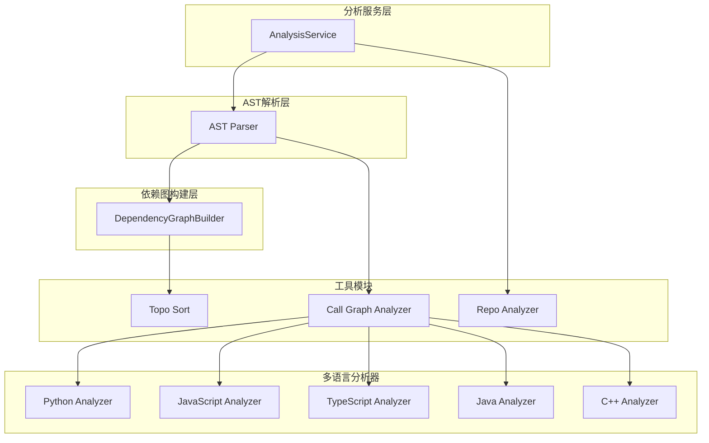

**图源**
- [analysis_service.py](file://codewiki/src/be/dependency_analyzer/analysis/analysis_service.py)
- [ast_parser.py](file://codewiki/src/be/dependency_analyzer/ast_parser.py)
- [dependency_graphs_builder.py](file://codewiki/src/be/dependency_analyzer/dependency_graphs_builder.py)
- [call_graph_analyzer.py](file://codewiki/src/be/dependency_analyzer/analysis/call_graph_analyzer.py)
- [topo_sort.py](file://codewiki/src/be/dependency_analyzer/topo_sort.py)
- [repo_analyzer.py](file://codewiki/src/be/dependency_analyzer/analysis/repo_analyzer.py)

## 基于Tree-sitter的AST解析原理
CodeWiki依赖分析器的核心是基于Tree-sitter的抽象语法树（AST）解析技术。Tree-sitter是一个语法解析系统，能够为多种编程语言生成精确的语法树，这对于代码分析至关重要。

### AST解析流程
系统通过以下步骤进行AST解析：

1. **文件结构分析**：首先使用`RepoAnalyzer`分析仓库的文件结构，识别出所有需要分析的代码文件。
2. **语言识别**：根据文件扩展名识别文件的编程语言。
3. **AST生成**：使用Tree-sitter为每种语言生成抽象语法树。
4. **节点提取**：遍历AST，提取函数、类、接口等代码组件。
5. **关系分析**：分析组件之间的调用、继承和使用关系。

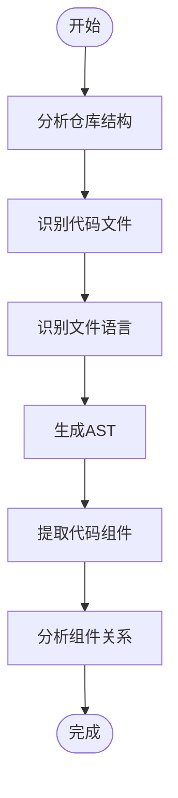

**图源**
- [repo_analyzer.py](file://codewiki/src/be/dependency_analyzer/analysis/repo_analyzer.py)
- [call_graph_analyzer.py](file://codewiki/src/be/dependency_analyzer/analysis/call_graph_analyzer.py)

### 核心数据结构
系统使用`Node`和`CallRelationship`两个核心数据结构来表示代码组件和它们之间的关系：

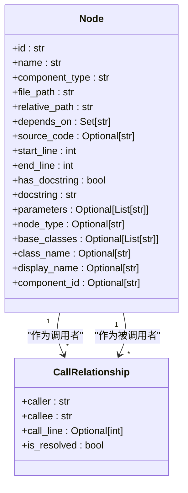

**图源**
- [core.py](file://codewiki/src/be/dependency_analyzer/models/core.py)

## DependencyGraphBuilder组件依赖关系图构建
`DependencyGraphBuilder`是依赖分析器的核心组件，负责构建代码组件间的依赖关系图。它通过协调AST解析器和拓扑排序模块，将代码库中的组件关系转化为可处理的依赖图。

### 类结构
`DependencyGraphBuilder`类的主要结构如下：

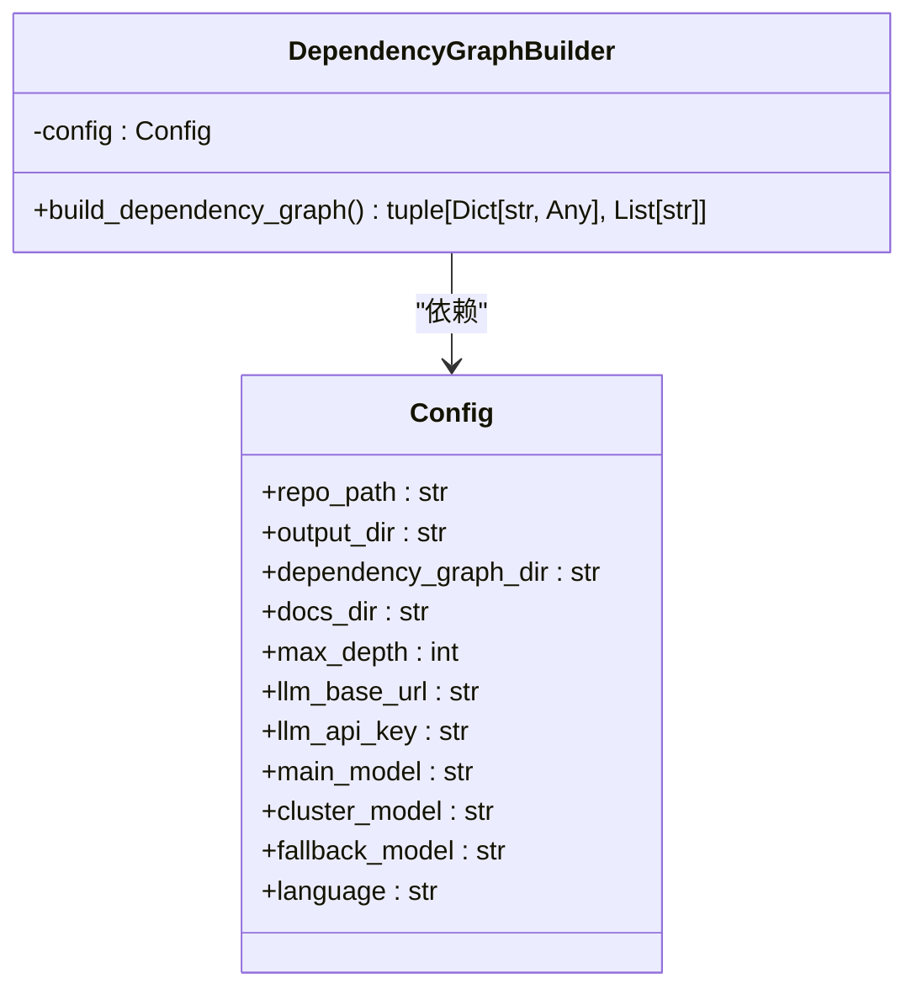

**图源**
- [dependency_graphs_builder.py](file://codewiki/src/be/dependency_analyzer/dependency_graphs_builder.py)
- [config.py](file://codewiki/src/config.py)

### 构建流程
`DependencyGraphBuilder`的构建流程如下：

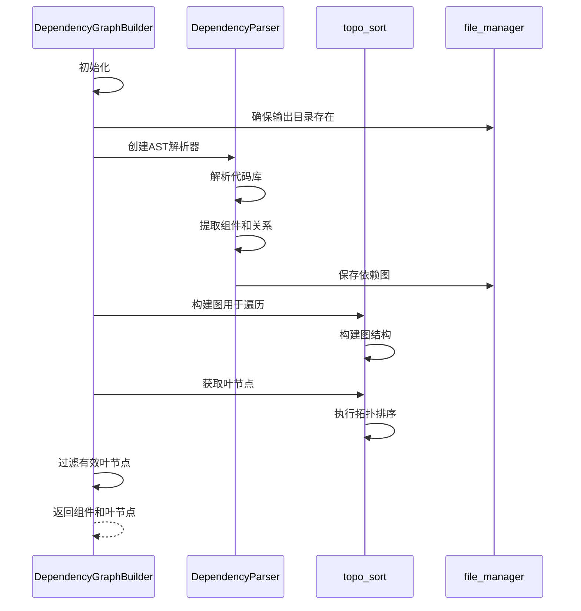

**图源**
- [dependency_graphs_builder.py](file://codewiki/src/be/dependency_analyzer/dependency_graphs_builder.py)
- [ast_parser.py](file://codewiki/src/be/dependency_analyzer/ast_parser.py)
- [topo_sort.py](file://codewiki/src/be/dependency_analyzer/topo_sort.py)

## build_dependency_graph方法执行流程
`build_dependency_graph`方法是`DependencyGraphBuilder`的核心方法，负责从解析代码库到过滤有效叶节点的完整过程。该方法的执行流程如下：

### 执行流程详解
1. **初始化和目录准备**：确保输出目录存在，并准备依赖图的路径。
2. **创建解析器**：创建`DependencyParser`实例来解析代码库。
3. **解析代码库**：调用解析器的`parse_repository`方法解析代码库。
4. **保存依赖图**：将解析结果保存为JSON文件。
5. **构建图结构**：使用`topo_sort`模块构建图结构用于遍历。
6. **获取叶节点**：获取图中的叶节点。
7. **过滤有效叶节点**：根据组件类型过滤出有效的叶节点。

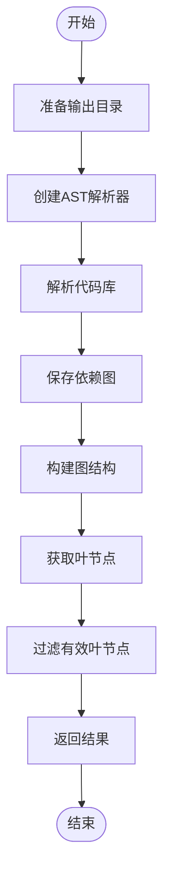

**图源**
- [dependency_graphs_builder.py](file://codewiki/src/be/dependency_analyzer/dependency_graphs_builder.py)

### 代码路径
- [dependency_graphs_builder.py#L18-L94](file://codewiki/src/be/dependency_analyzer/dependency_graphs_builder.py#L18-L94)

## 拓扑排序算法
`topo_sort.py`模块实现了拓扑排序算法，用于确定模块处理顺序。该算法能够处理依赖图中的循环，并确保模块按照正确的顺序处理。

### 算法原理
拓扑排序算法基于Tarjan算法实现，主要步骤如下：

1. **循环检测**：使用Tarjan算法检测依赖图中的循环。
2. **循环解决**：通过移除循环中的边来解决循环问题。
3. **拓扑排序**：对无环图进行拓扑排序，确保依赖项在被依赖项之前处理。

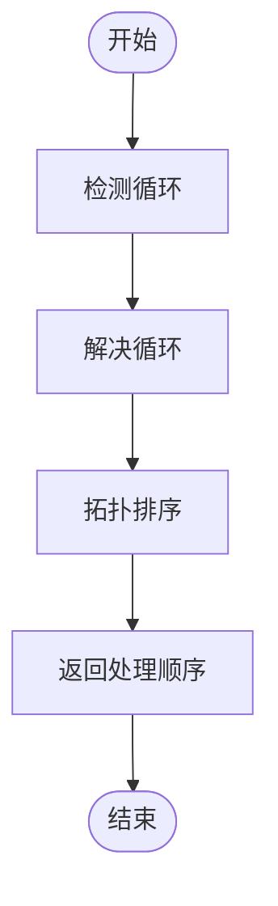

**图源**
- [topo_sort.py](file://codewiki/src/be/dependency_analyzer/topo_sort.py)

### 核心函数
`topo_sort.py`模块包含以下核心函数：

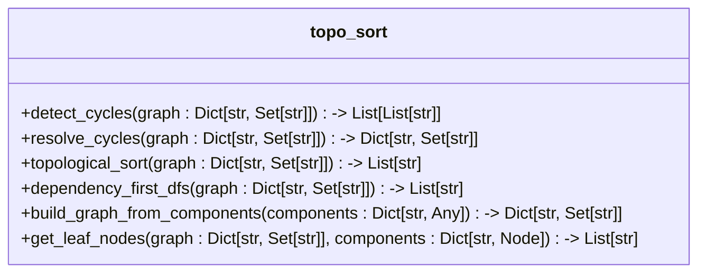

**图源**
- [topo_sort.py](file://codewiki/src/be/dependency_analyzer/topo_sort.py)

## 多语言分析器支持
CodeWiki依赖分析器通过一组多语言分析器支持跨语言依赖分析。每个分析器针对特定编程语言，使用Tree-sitter生成AST并提取代码组件和关系。

### 支持的语言
系统支持以下编程语言：

- Python
- JavaScript
- TypeScript
- Java
- C#
- C
- C++
- PHP

### 分析器架构
多语言分析器采用统一的架构设计，每个分析器都遵循相同的接口和流程：

```mermaid
classDiagram
class LanguageAnalyzer {
+analyze(file_path : str, content : str, repo_path : str) -> Tuple[List[Node], List[CallRelationship]]
}
class PythonAnalyzer {
+analyze_python_file(file_path : str, content : str, repo_path : str) -> Tuple[List[Node], List[CallRelationship]]
}
class JavaScriptAnalyzer {
+analyze_javascript_file_treesitter(file_path : str, content : str, repo_path : str) -> Tuple[List[Node], List[CallRelationship]]
}
class TypeScriptAnalyzer {
+analyze_typescript_file_treesitter(file_path : str, content : str, repo_path : str) -> Tuple[List[Node], List[CallRelationship]]
}
class JavaAnalyzer {
+analyze_java_file(file_path : str, content : str, repo_path : str) -> Tuple[List[Node], List[CallRelationship]]
}
class CppAnalyzer {
+analyze_cpp_file(file_path : str, content : str, repo_path : str) -> Tuple[List[Node], List[CallRelationship]]
}
LanguageAnalyzer <|-- PythonAnalyzer
LanguageAnalyzer <|-- JavaScriptAnalyzer
LanguageAnalyzer <|-- TypeScriptAnalyzer
LanguageAnalyzer <|-- JavaAnalyzer
LanguageAnalyzer <|-- CppAnalyzer
```

**图源**
- [python.py](file://codewiki/src/be/dependency_analyzer/analyzers/python.py)
- [javascript.py](file://codewiki/src/be/dependency_analyzer/analyzers/javascript.py)
- [typescript.py](file://codewiki/src/be/dependency_analyzer/analyzers/typescript.py)
- [java.py](file://codewiki/src/be/dependency_analyzer/analyzers/java.py)
- [cpp.py](file://codewiki/src/be/dependency_analyzer/analyzers/cpp.py)

### 跨语言分析
系统通过统一的接口和数据结构支持跨语言分析。当分析多语言代码库时，`CallGraphAnalyzer`会根据文件扩展名选择相应的分析器，并将所有语言的分析结果合并到一个统一的依赖图中。

```mermaid
sequenceDiagram
participant CallGraphAnalyzer
participant PythonAnalyzer
participant JavaScriptAnalyzer
participant TypeScriptAnalyzer
participant JavaAnalyzer
participant CppAnalyzer
CallGraphAnalyzer->>CallGraphAnalyzer : 分析代码文件
loop 每个代码文件
CallGraphAnalyzer->>CallGraphAnalyzer : 识别文件语言
alt Python文件
CallGraphAnalyzer->>PythonAnalyzer : 调用Python分析器
PythonAnalyzer-->>CallGraphAnalyzer : 返回分析结果
elif JavaScript文件
CallGraphAnalyzer->>JavaScriptAnalyzer : 调用JavaScript分析器
JavaScriptAnalyzer-->>CallGraphAnalyzer : 返回分析结果
elif TypeScript文件
CallGraphAnalyzer->>TypeScriptAnalyzer : 调用TypeScript分析器
TypeScriptAnalyzer-->>CallGraphAnalyzer : 返回分析结果
elif Java文件
CallGraphAnalyzer->>JavaAnalyzer : 调用Java分析器
JavaAnalyzer-->>CallGraphAnalyzer : 返回分析结果
elif C++文件
CallGraphAnalyzer->>CppAnalyzer : 调用C++分析器
CppAnalyzer-->>CallGraphAnalyzer : 返回分析结果
end
CallGraphAnalyzer->>CallGraphAnalyzer : 合并分析结果
end
CallGraphAnalyzer-->>CallGraphAnalyzer : 返回完整分析结果
```

**图源**
- [call_graph_analyzer.py](file://codewiki/src/be/dependency_analyzer/analysis/call_graph_analyzer.py)

## 代码示例：Python与JavaScript解析差异
为了更好地理解CodeWiki依赖分析器的工作原理，我们来看一下Python和JavaScript文件的解析差异。

### Python解析示例
Python分析器使用Python内置的`ast`模块来解析代码。以下是Python分析器的主要特点：

```mermaid
sequenceDiagram
participant PythonAnalyzer
participant AST
participant Node
participant Relationship
PythonAnalyzer->>PythonAnalyzer : 初始化
PythonAnalyzer->>AST : 解析Python代码
AST-->>PythonAnalyzer : 返回AST
PythonAnalyzer->>PythonAnalyzer : 遍历AST
loop 遍历AST节点
alt 类定义
PythonAnalyzer->>Node : 创建类节点
Node-->>PythonAnalyzer : 返回节点
elif 函数定义
PythonAnalyzer->>Node : 创建函数节点
Node-->>PythonAnalyzer : 返回节点
elif 函数调用
PythonAnalyzer->>Relationship : 创建调用关系
Relationship-->>PythonAnalyzer : 返回关系
end
end
PythonAnalyzer-->>PythonAnalyzer : 返回所有节点和关系
```

**图源**
- [python.py](file://codewiki/src/be/dependency_analyzer/analyzers/python.py)

### JavaScript解析示例
JavaScript分析器使用Tree-sitter来解析代码。以下是JavaScript分析器的主要特点：

```mermaid
sequenceDiagram
participant JSAnalyzer
participant TreeSitter
participant Node
participant Relationship
JSAnalyzer->>JSAnalyzer : 初始化
JSAnalyzer->>TreeSitter : 解析JavaScript代码
TreeSitter-->>JSAnalyzer : 返回AST
JSAnalyzer->>JSAnalyzer : 遍历AST
loop 遍历AST节点
alt 类定义
JSAnalyzer->>Node : 创建类节点
Node-->>JSAnalyzer : 返回节点
elif 函数定义
JSAnalyzer->>Node : 创建函数节点
Node-->>JSAnalyzer : 返回节点
elif 函数调用
JSAnalyzer->>Relationship : 创建调用关系
Relationship-->>JSAnalyzer : 返回关系
elif JSDoc注释
JSAnalyzer->>Relationship : 创建类型依赖关系
Relationship-->>JSAnalyzer : 返回关系
end
end
JSAnalyzer-->>JSAnalyzer : 返回所有节点和关系
```

**图源**
- [javascript.py](file://codewiki/src/be/dependency_analyzer/analyzers/javascript.py)

### 主要差异
Python和JavaScript解析器的主要差异体现在以下几个方面：

| 特性 | Python解析器 | JavaScript解析器 |
| --- | --- | --- |
| 解析技术 | Python内置ast模块 | Tree-sitter |
| 类型推断 | 基于AST结构 | 基于AST结构和JSDoc注释 |
| 函数调用分析 | 基于AST中的Call节点 | 基于AST中的call_expression节点 |
| 关系类型 | 调用关系 | 调用关系、类型依赖关系 |
| 特殊处理 | 内置函数过滤 | 内置函数和JSDoc类型过滤 |

**表源**
- [python.py](file://codewiki/src/be/dependency_analyzer/analyzers/python.py)
- [javascript.py](file://codewiki/src/be/dependency_analyzer/analyzers/javascript.py)

## 依赖图在后续模块中的作用
依赖图在CodeWiki系统的后续模块中起着至关重要的作用，特别是在模块聚类和文档生成方面。

### 模块聚类
依赖图为模块聚类提供了基础数据。通过分析组件之间的依赖关系，系统可以将高度相关的组件聚类到同一个模块中。

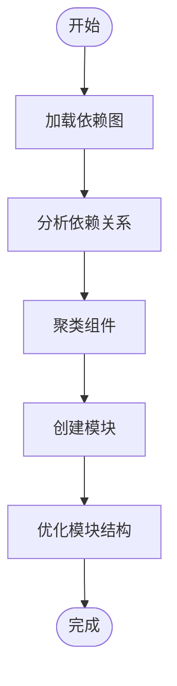

**图源**
- [dependency_graphs_builder.py](file://codewiki/src/be/dependency_analyzer/dependency_graphs_builder.py)

### 文档生成
依赖图为文档生成提供了结构化的数据。系统可以根据依赖图生成层次化的文档，从顶层模块到具体的代码组件。

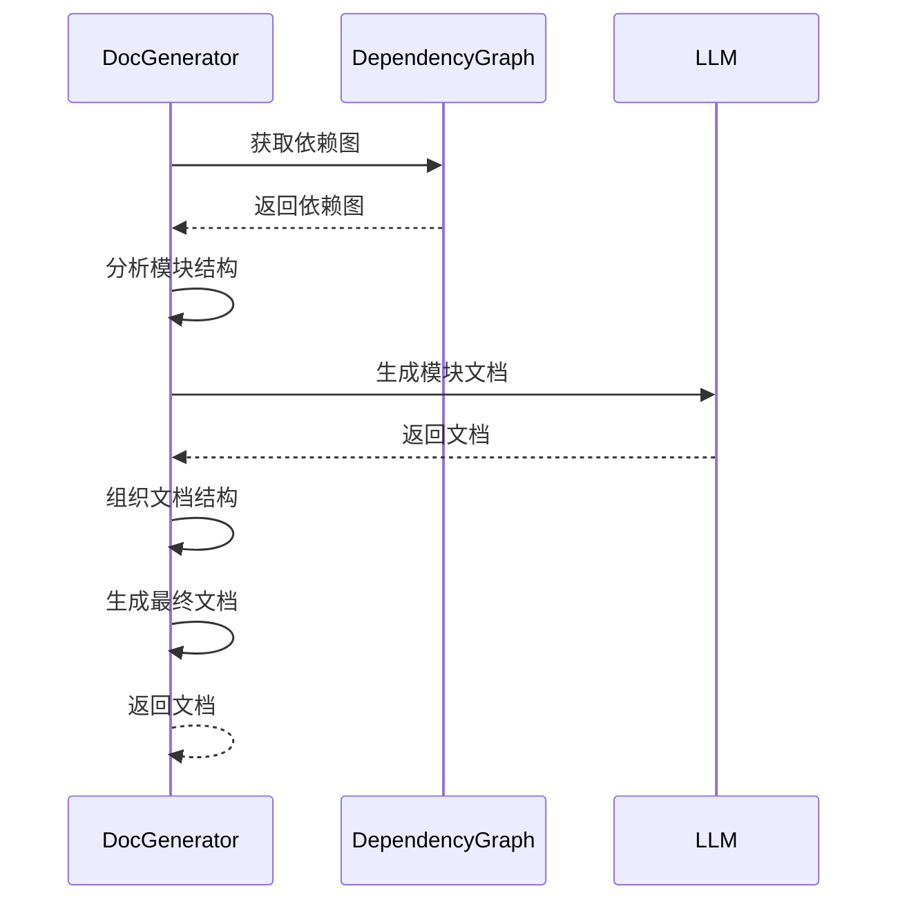

**图源**
- [dependency_graphs_builder.py](file://codewiki/src/be/dependency_analyzer/dependency_graphs_builder.py)

### 依赖图的关键作用
1. **提供结构信息**：依赖图提供了代码库的结构信息，帮助系统理解代码的组织方式。
2. **指导聚类算法**：依赖关系是聚类算法的重要输入，决定了哪些组件应该被聚类在一起。
3. **优化文档生成**：依赖图可以帮助系统确定文档的生成顺序，确保依赖项在被依赖项之前生成。
4. **支持代码导航**：依赖图为代码导航提供了基础，用户可以通过依赖关系在代码库中导航。

## 结论
CodeWiki依赖分析器是一个功能强大的代码分析系统，基于Tree-sitter的AST解析技术，能够构建跨语言的代码组件依赖关系图。通过`DependencyGraphBuilder`组件，系统能够从解析代码库到过滤有效叶节点的完整过程，构建出精确的依赖关系图。`topo_sort.py`中的拓扑排序算法确保了模块处理顺序的正确性。多语言分析器支持使得系统能够处理多种编程语言的代码库。依赖图在后续的模块聚类和文档生成中起着关键作用，为代码理解、重构和文档化提供了坚实的基础。该系统的设计体现了模块化、可扩展和高性能的特点，为代码分析领域提供了一个优秀的解决方案。