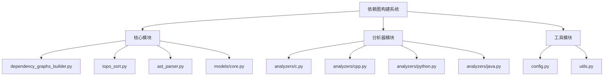
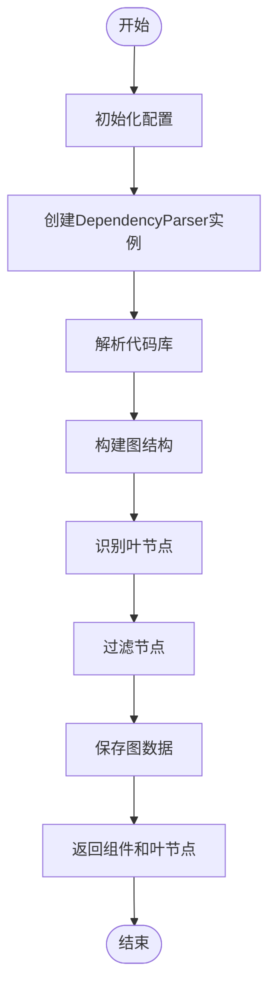
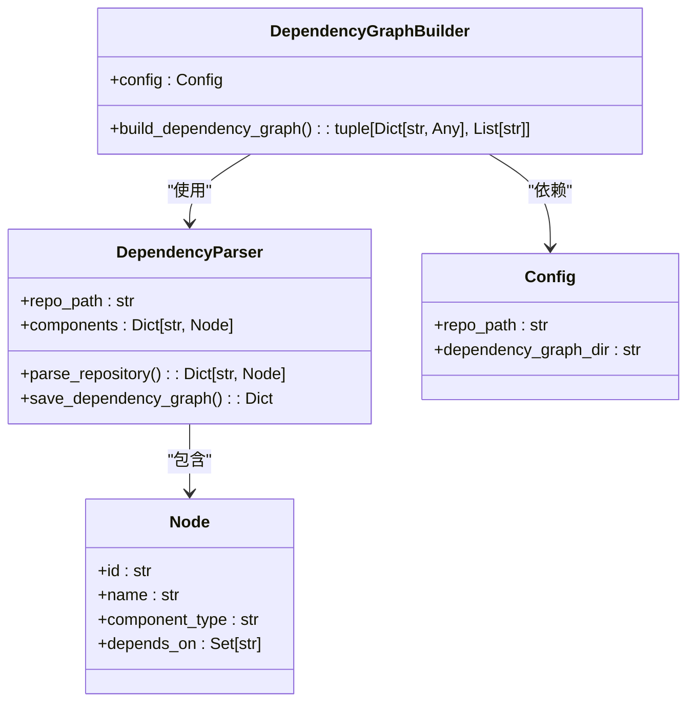
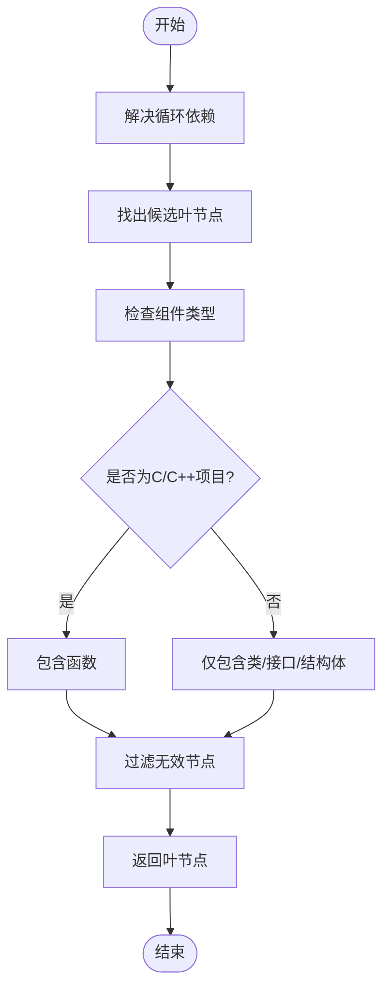
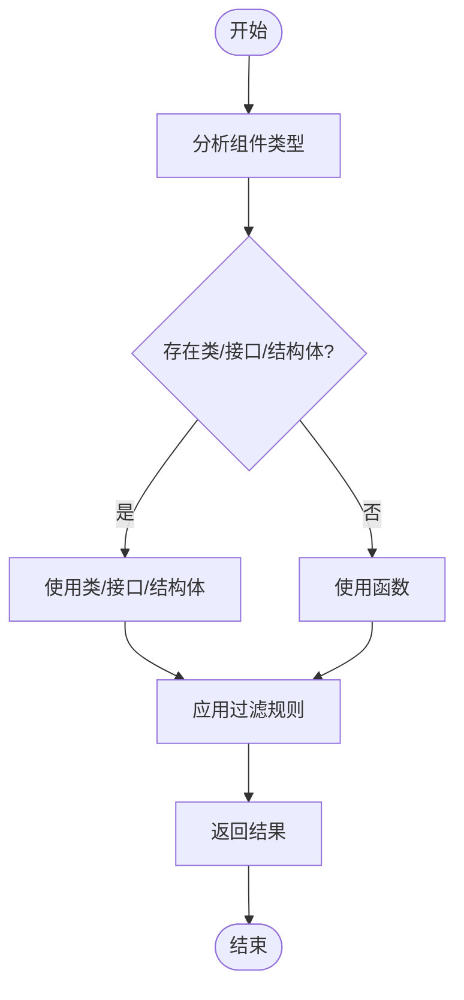

# 依赖图构建器

<cite>
**本文档引用的文件**  
- [dependency_graphs_builder.py](file://codewiki/src/be/dependency_analyzer/dependency_graphs_builder.py)
- [topo_sort.py](file://codewiki/src/be/dependency_analyzer/topo_sort.py)
- [ast_parser.py](file://codewiki/src/be/dependency_analyzer/ast_parser.py)
- [core.py](file://codewiki/src/be/dependency_analyzer/models/core.py)
- [c.py](file://codewiki/src/be/dependency_analyzer/analyzers/c.py)
- [cpp.py](file://codewiki/src/be/dependency_analyzer/analyzers/cpp.py)
- [config.py](file://codewiki/src/config.py)
- [utils.py](file://codewiki/src/utils.py)
</cite>

## 目录
1. [项目结构](#项目结构)
2. [核心组件](#核心组件)
3. [依赖图构建流程](#依赖图构建流程)
4. [图结构转换机制](#图结构转换机制)
5. [叶节点识别算法](#叶节点识别算法)
6. [持久化存储与过滤策略](#持久化存储与过滤策略)
7. [语言自适应机制](#语言自适应机制)

## 项目结构

**图来源**  
- [dependency_graphs_builder.py](file://codewiki/src/be/dependency_analyzer/dependency_graphs_builder.py)
- [topo_sort.py](file://codewiki/src/be/dependency_analyzer/topo_sort.py)
- [ast_parser.py](file://codewiki/src/be/dependency_analyzer/ast_parser.py)

**本节来源**  
- [dependency_graphs_builder.py](file://codewiki/src/be/dependency_analyzer/dependency_graphs_builder.py)
- [topo_sort.py](file://codewiki/src/be/dependency_analyzer/topo_sort.py)

## 核心组件

`DependencyGraphBuilder`类是依赖图构建系统的核心组件，负责协调整个依赖分析和图构建过程。该类通过配置对象初始化，封装了从代码库解析到图结构生成的完整工作流。`build_dependency_graph`方法作为主要入口点，返回组件字典和叶节点列表，为后续的文档生成提供基础数据。

**本节来源**  
- [dependency_graphs_builder.py](file://codewiki/src/be/dependency_analyzer/dependency_graphs_builder.py#L12-L94)

## 依赖图构建流程

`build_dependency_graph`方法执行以下关键步骤：首先，根据配置确保输出目录存在；然后，创建`DependencyParser`实例并解析整个代码库，获取所有代码组件；接着，将组件依赖关系转换为图结构；最后，识别并返回叶节点。该方法还负责将依赖图以JSON格式持久化存储，便于后续分析和调试。

**图来源**  
- [dependency_graphs_builder.py](file://codewiki/src/be/dependency_analyzer/dependency_graphs_builder.py#L18-L94)

**本节来源**  
- [dependency_graphs_builder.py](file://codewiki/src/be/dependency_analyzer/dependency_graphs_builder.py#L18-L94)

## 图结构转换机制

`build_graph_from_components`函数负责将组件字典转换为图结构。该函数遍历所有组件，为每个组件创建邻接表，记录其依赖的其他组件。图的方向遵循自然依赖关系：如果组件A依赖于组件B，则存在边A→B。这种表示方法确保了图的语义清晰性，便于后续的拓扑排序和依赖分析。

**图来源**  
- [topo_sort.py](file://codewiki/src/be/dependency_analyzer/topo_sort.py#L239-L268)
- [ast_parser.py](file://codewiki/src/be/dependency_analyzer/ast_parser.py#L22-L24)

**本节来源**  
- [topo_sort.py](file://codewiki/src/be/dependency_analyzer/topo_sort.py#L239-L268)

## 叶节点识别算法

`get_leaf_nodes`算法识别无依赖引用的终端节点。该算法首先解决图中的循环依赖，然后找出所有不被其他节点依赖的节点。为了适应不同编程语言的特点，算法实现了自适应过滤机制：对于面向对象语言，优先选择类、接口和结构体作为叶节点；对于C/C++等过程式语言，则包含函数作为叶节点。这种机制确保了在不同代码库中都能找到有意义的分析起点。

**图来源**  
- [topo_sort.py](file://codewiki/src/be/dependency_analyzer/topo_sort.py#L271-L350)
- [dependency_graphs_builder.py](file://codewiki/src/be/dependency_analyzer/dependency_graphs_builder.py#L61-L93)

**本节来源**  
- [topo_sort.py](file://codewiki/src/be/dependency_analyzer/topo_sort.py#L271-L350)

## 持久化存储与过滤策略

依赖图数据以JSON格式持久化存储，文件名基于仓库名称生成，确保唯一性。存储路径由配置对象中的`dependency_graph_dir`指定。过滤策略基于组件类型实现，通过分析代码库中存在的组件类型动态调整叶节点的选择标准。对于大型项目，系统还会移除作为其他节点依赖的节点，以减少叶节点数量，提高后续处理效率。

**本节来源**  
- [dependency_graphs_builder.py](file://codewiki/src/be/dependency_analyzer/dependency_graphs_builder.py#L25-L38)
- [ast_parser.py](file://codewiki/src/be/dependency_analyzer/ast_parser.py#L128-L144)

## 语言自适应机制

系统通过分析代码库中存在的组件类型来实现语言自适应。在`build_dependency_graph`方法中，算法首先统计所有组件的类型，然后根据是否存在类、接口或结构体来决定是否包含函数作为叶节点。对于C/C++项目，由于可能缺乏面向对象的结构，系统会自动将函数纳入叶节点候选范围。这种机制确保了在不同编程范式下都能生成有意义的依赖分析结果。

**图来源**  
- [dependency_graphs_builder.py](file://codewiki/src/be/dependency_analyzer/dependency_graphs_builder.py#L67-L77)
- [c.py](file://codewiki/src/be/dependency_analyzer/analyzers/c.py#L69-L74)
- [cpp.py](file://codewiki/src/be/dependency_analyzer/analyzers/cpp.py#L73-L80)

**本节来源**  
- [dependency_graphs_builder.py](file://codewiki/src/be/dependency_analyzer/dependency_graphs_builder.py#L67-L77)