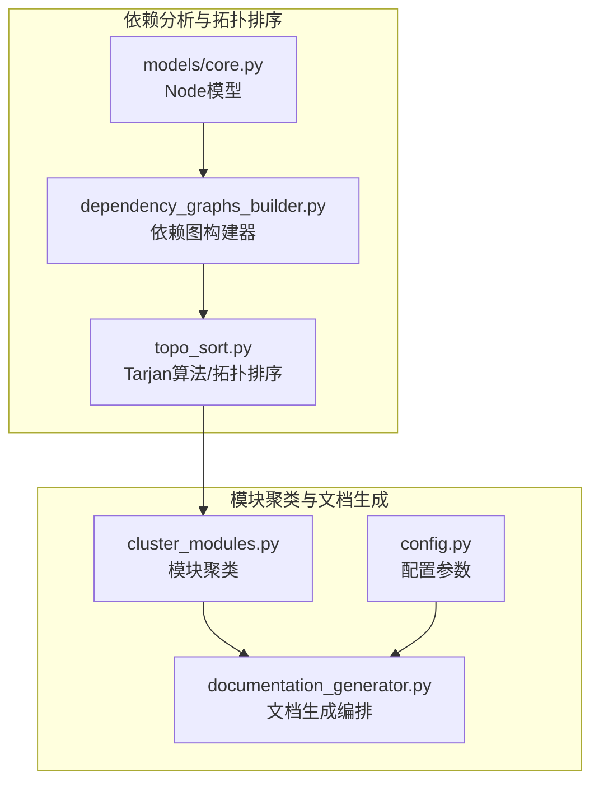
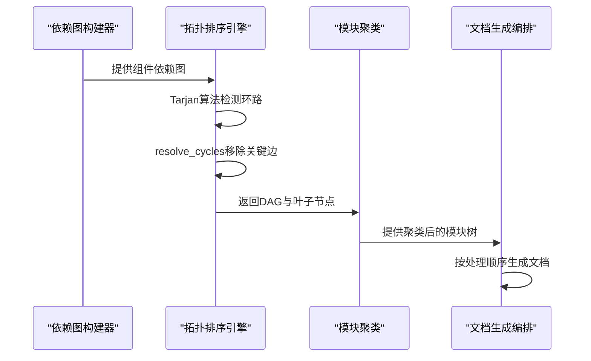
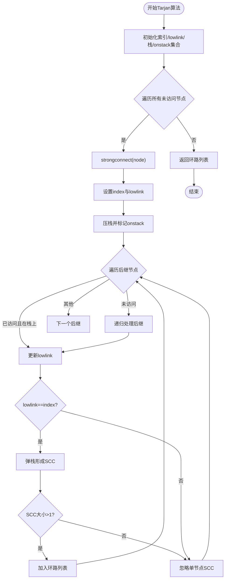
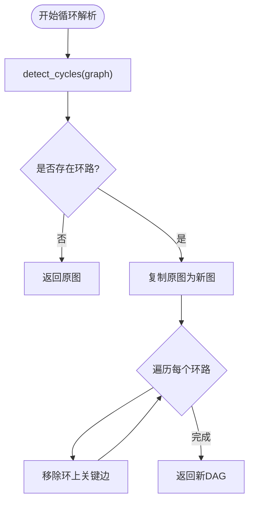
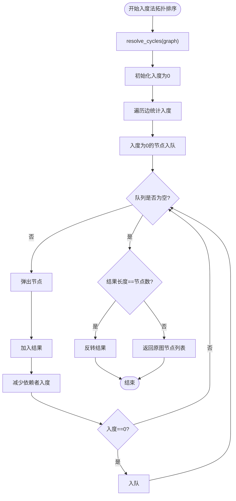
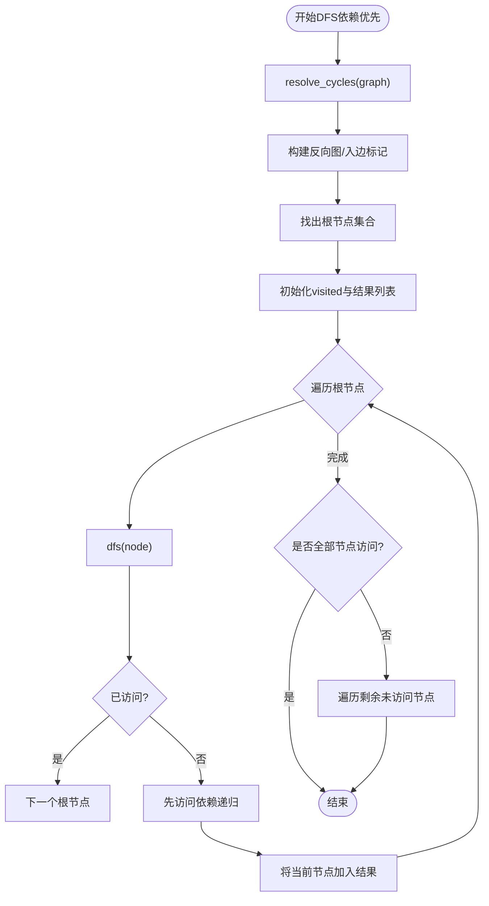
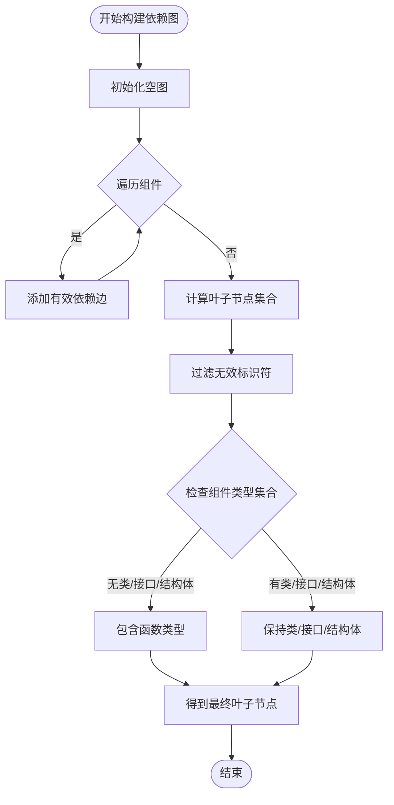
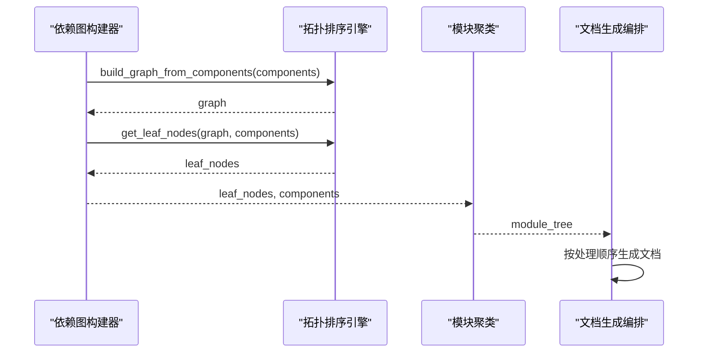
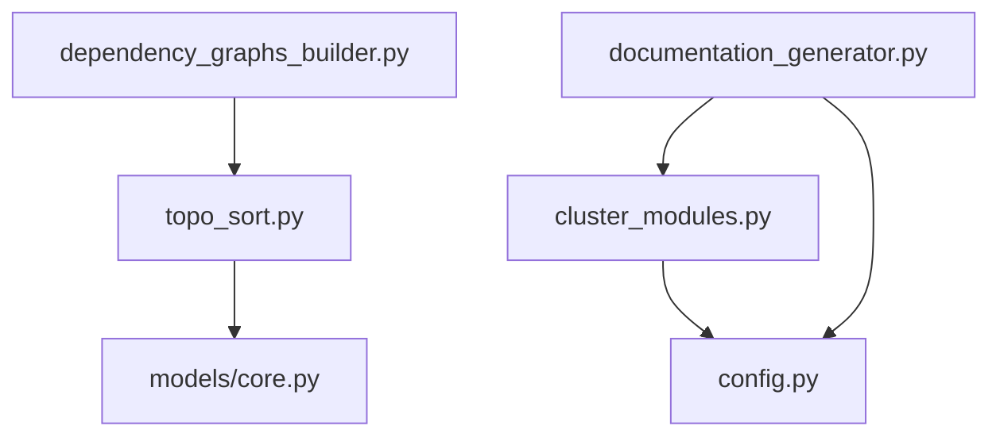

# 拓扑排序引擎

<cite>
**本文档引用的文件**
- [topo_sort.py](file://codewiki/src/be/dependency_analyzer/topo_sort.py)
- [dependency_graphs_builder.py](file://codewiki/src/be/dependency_analyzer/dependency_graphs_builder.py)
- [cluster_modules.py](file://codewiki/src/be/cluster_modules.py)
- [documentation_generator.py](file://codewiki/src/be/documentation_generator.py)
- [core.py](file://codewiki/src/be/dependency_analyzer/models/core.py)
- [config.py](file://codewiki/src/config.py)
</cite>

## 目录
1. [简介](#简介)
2. [项目结构](#项目结构)
3. [核心组件](#核心组件)
4. [架构总览](#架构总览)
5. [详细组件分析](#详细组件分析)
6. [依赖关系分析](#依赖关系分析)
7. [性能考虑](#性能考虑)
8. [故障排除指南](#故障排除指南)
9. [结论](#结论)
10. [附录](#附录)

## 简介
本文件系统性阐述拓扑排序引擎在代码知识库项目中的设计与实现，重点覆盖以下方面：
- 基于Tarjan算法的强连通分量检测，用于识别依赖图中的循环依赖
- `resolve_cycles`函数如何通过移除关键边来打破环路，确保生成有向无环图（DAG）
- `topological_sort`与`dependency_first_dfs`两种排序策略的差异、适用场景与性能特征
- 实际案例展示循环依赖的检测与修复过程
- 排序结果如何指导后续模块聚类与AI文档生成的处理顺序

## 项目结构
拓扑排序引擎位于后端依赖分析子系统中，与模块聚类、文档生成等流程紧密协作。核心文件组织如下：
- 依赖分析与拓扑排序：`codewiki/src/be/dependency_analyzer/topo_sort.py`
- 依赖图构建器：`codewiki/src/be/dependency_analyzer/dependency_graphs_builder.py`
- 模块聚类：`codewiki/src/be/cluster_modules.py`
- 文档生成编排：`codewiki/src/be/documentation_generator.py`
- 数据模型：`codewiki/src/be/dependency_analyzer/models/core.py`
- 配置参数：`codewiki/src/config.py`

图表来源
- [topo_sort.py](file://codewiki/src/be/dependency_analyzer/topo_sort.py#L1-L350)
- [dependency_graphs_builder.py](file://codewiki/src/be/dependency_analyzer/dependency_graphs_builder.py#L1-L94)
- [cluster_modules.py](file://codewiki/src/be/cluster_modules.py#L1-L125)
- [documentation_generator.py](file://codewiki/src/be/documentation_generator.py#L1-L382)
- [core.py](file://codewiki/src/be/dependency_analyzer/models/core.py#L1-L64)
- [config.py](file://codewiki/src/config.py#L1-L123)

章节来源
- [topo_sort.py](file://codewiki/src/be/dependency_analyzer/topo_sort.py#L1-L350)
- [dependency_graphs_builder.py](file://codewiki/src/be/dependency_analyzer/dependency_graphs_builder.py#L1-L94)
- [cluster_modules.py](file://codewiki/src/be/cluster_modules.py#L1-L125)
- [documentation_generator.py](file://codewiki/src/be/documentation_generator.py#L1-L382)
- [core.py](file://codewiki/src/be/dependency_analyzer/models/core.py#L1-L64)
- [config.py](file://codewiki/src/config.py#L1-L123)

## 核心组件
- Tarjan强连通分量检测：用于发现依赖图中的循环依赖，返回每个环路的节点序列
- 循环解析：对检测到的环路进行破坏，移除关键边以形成DAG
- 拓扑排序（入度法）：基于入度计数的广度优先策略，适合大规模依赖图
- 深度优先遍历（依赖优先）：从根节点出发，优先处理依赖项，适合强调依赖顺序的场景
- 图构建与叶子节点提取：将代码组件转换为依赖图，并筛选合适的叶子节点用于聚类

章节来源
- [topo_sort.py](file://codewiki/src/be/dependency_analyzer/topo_sort.py#L18-L350)
- [dependency_graphs_builder.py](file://codewiki/src/be/dependency_analyzer/dependency_graphs_builder.py#L18-L94)

## 架构总览
拓扑排序引擎在整个文档生成流水线中承担“依赖关系清理与排序”的关键角色，其工作流如下：
- 依赖图构建：从AST解析结果构建组件依赖图
- 循环检测与修复：使用Tarjan算法识别环路并移除关键边
- 排序策略选择：根据场景选择入度法或DFS策略
- 叶子节点筛选：提取合适的叶子节点用于模块聚类
- 聚类与文档生成：按排序结果驱动模块聚类与文档生成的处理顺序

图表来源
- [dependency_graphs_builder.py](file://codewiki/src/be/dependency_analyzer/dependency_graphs_builder.py#L18-L94)
- [topo_sort.py](file://codewiki/src/be/dependency_analyzer/topo_sort.py#L78-L350)
- [cluster_modules.py](file://codewiki/src/be/cluster_modules.py#L44-L125)
- [documentation_generator.py](file://codewiki/src/be/documentation_generator.py#L320-L382)

## 详细组件分析

### Tarjan算法与强连通分量检测
- 算法原理：通过深度优先搜索维护索引与lowlink值，当lowlink等于index时弹栈形成强连通分量
- 输入输出：输入为邻接表表示的依赖图；输出为包含多个环路的列表，每个环路为节点序列
- 关键点：
  - 使用栈记录当前路径，onstack集合判断节点是否在当前路径上
  - 仅保留包含多于一个节点的SCC作为环路
  - 时间复杂度O(V+E)，空间复杂度O(V+E)

图表来源
- [topo_sort.py](file://codewiki/src/be/dependency_analyzer/topo_sort.py#L18-L76)

章节来源
- [topo_sort.py](file://codewiki/src/be/dependency_analyzer/topo_sort.py#L18-L76)

### 循环解析与DAG构建
- 策略：对每个检测到的环路，按顺序尝试移除一条关键边，使环路断裂
- 关键边选择：当前实现采用“移除环上最后一条边”的启发式策略；可扩展为更复杂的权重策略（如跨模块边优先）
- 输出：返回与原图同节点集但无环的新图（DAG）

图表来源
- [topo_sort.py](file://codewiki/src/be/dependency_analyzer/topo_sort.py#L78-L119)

章节来源
- [topo_sort.py](file://codewiki/src/be/dependency_analyzer/topo_sort.py#L78-L119)

### 入度法拓扑排序（topological_sort）
- 策略：基于入度计数的广度优先方法
- 步骤：
  1) 使用resolve_cycles确保图为DAG
  2) 初始化所有节点入度为0
  3) 遍历边统计入度
  4) 将入度为0的节点入队
  5) 弹出节点并减少其依赖者的入度，入度为0则入队
  6) 若最终结果长度小于节点总数，说明存在未解决的环路，返回原图节点列表
  7) 将结果反转得到“依赖优先”的顺序

图表来源
- [topo_sort.py](file://codewiki/src/be/dependency_analyzer/topo_sort.py#L121-L169)

章节来源
- [topo_sort.py](file://codewiki/src/be/dependency_analyzer/topo_sort.py#L121-L169)

### 深度优先遍历（dependency_first_dfs）
- 策略：从根节点（无入边）出发，优先深度遍历依赖项，再将当前节点加入结果
- 特点：
  - 明确区分“依赖优先”的处理顺序
  - 通过反向图辅助快速识别根节点
  - 对非连通图会进行多次起始遍历以覆盖所有节点

图表来源
- [topo_sort.py](file://codewiki/src/be/dependency_analyzer/topo_sort.py#L171-L237)

章节来源
- [topo_sort.py](file://codewiki/src/be/dependency_analyzer/topo_sort.py#L171-L237)

### 图构建与叶子节点提取
- 组件到图的映射：将组件的`depends_on`集合转换为邻接表，仅保留仓库内存在的依赖
- 叶子节点定义：在DAG中，不被任何其他节点依赖的节点称为叶子节点
- 过滤与优化：
  - 去除无效标识符与错误字符串
  - 针对C语言项目自动包含函数类型的叶子节点
  - 当叶子节点过多时，移除其他节点的依赖以减少规模

图表来源
- [topo_sort.py](file://codewiki/src/be/dependency_analyzer/topo_sort.py#L239-L350)

章节来源
- [topo_sort.py](file://codewiki/src/be/dependency_analyzer/topo_sort.py#L239-L350)

### 与模块聚类和文档生成的集成
- 依赖图构建器负责调用图构建与叶子节点提取函数，产出组件字典与叶子节点列表
- 模块聚类在满足Token阈值时触发，使用叶子节点进行模块划分
- 文档生成编排器按模块树的处理顺序（叶子模块优先）驱动AI文档生成

图表来源
- [dependency_graphs_builder.py](file://codewiki/src/be/dependency_analyzer/dependency_graphs_builder.py#L18-L94)
- [cluster_modules.py](file://codewiki/src/be/cluster_modules.py#L44-L125)
- [documentation_generator.py](file://codewiki/src/be/documentation_generator.py#L320-L382)

章节来源
- [dependency_graphs_builder.py](file://codewiki/src/be/dependency_analyzer/dependency_graphs_builder.py#L18-L94)
- [cluster_modules.py](file://codewiki/src/be/cluster_modules.py#L44-L125)
- [documentation_generator.py](file://codewiki/src/be/documentation_generator.py#L320-L382)

## 依赖关系分析
- 模块耦合：
  - `topo_sort.py`依赖`models/core.py`中的Node模型
  - `dependency_graphs_builder.py`依赖`topo_sort.py`的图构建与叶子节点提取函数
  - `documentation_generator.py`依赖`cluster_modules.py`与`config.py`
- 外部依赖：日志记录、类型提示、collections.deque
- 潜在风险：
  - 循环解析策略简单，可能影响模块间的语义完整性
  - DFS策略在大规模图上可能受递归深度限制

图表来源
- [topo_sort.py](file://codewiki/src/be/dependency_analyzer/topo_sort.py#L1-L15)
- [dependency_graphs_builder.py](file://codewiki/src/be/dependency_analyzer/dependency_graphs_builder.py#L1-L9)
- [cluster_modules.py](file://codewiki/src/be/cluster_modules.py#L1-L12)
- [documentation_generator.py](file://codewiki/src/be/documentation_generator.py#L1-L27)
- [core.py](file://codewiki/src/be/dependency_analyzer/models/core.py#L1-L64)
- [config.py](file://codewiki/src/config.py#L1-L123)

章节来源
- [topo_sort.py](file://codewiki/src/be/dependency_analyzer/topo_sort.py#L1-L15)
- [dependency_graphs_builder.py](file://codewiki/src/be/dependency_analyzer/dependency_graphs_builder.py#L1-L9)
- [cluster_modules.py](file://codewiki/src/be/cluster_modules.py#L1-L12)
- [documentation_generator.py](file://codewiki/src/be/documentation_generator.py#L1-L27)
- [core.py](file://codewiki/src/be/dependency_analyzer/models/core.py#L1-L64)
- [config.py](file://codewiki/src/config.py#L1-L123)

## 性能考虑
- Tarjan算法：时间复杂度O(V+E)，适合大规模依赖图；栈与集合操作开销较小
- 入度法拓扑排序：时间复杂度O(V+E)，适合需要稳定、可预测处理顺序的场景
- DFS策略：时间复杂度O(V+E)，在依赖链较长时可能产生较深递归
- 内存占用：主要由栈、集合与结果列表构成，建议在超大规模图上考虑分批处理
- 日志与调试：在检测到环路或排序失败时输出警告，便于定位问题

## 故障排除指南
- 排序失败：
  - 现象：拓扑排序返回原图节点列表而非完整序列
  - 原因：存在未被resolve_cycles完全消除的环路或图结构异常
  - 处理：检查resolve_cycles策略，必要时增强关键边选择逻辑
- 无叶子节点：
  - 现象：get_leaf_nodes返回空列表
  - 原因：图中所有节点都有入边，或组件过滤导致叶子节点被剔除
  - 处理：检查组件类型过滤条件与依赖关系
- DFS无法覆盖所有节点：
  - 现象：部分节点未被访问
  - 原因：非连通图或根节点识别错误
  - 处理：在遍历完成后对剩余节点进行补充遍历

章节来源
- [topo_sort.py](file://codewiki/src/be/dependency_analyzer/topo_sort.py#L162-L169)
- [topo_sort.py](file://codewiki/src/be/dependency_analyzer/topo_sort.py#L231-L237)

## 结论
拓扑排序引擎通过Tarjan算法精确识别循环依赖，并以resolve_cycles策略将有向图转换为DAG，为后续模块聚类与文档生成提供了可靠的处理顺序基础。入度法与DFS两种策略各有优势：前者适合大规模、稳定的处理顺序需求；后者强调依赖优先的直观顺序。结合图构建与叶子节点提取，引擎能够有效支撑从依赖分析到文档生成的完整流水线。

## 附录

### 实际案例：循环依赖检测与修复
- 场景描述：组件A依赖B，B依赖C，C又依赖A，形成环路
- 检测步骤：
  1) 使用Tarjan算法找到强连通分量{A,B,C}
  2) resolve_cycles移除关键边（例如A→B），打破环路
- 排序结果：
  - 入度法：得到序列[A,B,C]（依赖优先）
  - DFS：同样得到序列[A,B,C]（依赖优先）
- 后续处理：叶子节点提取与模块聚类按此顺序进行，确保文档生成的正确依赖顺序

章节来源
- [topo_sort.py](file://codewiki/src/be/dependency_analyzer/topo_sort.py#L18-L119)
- [topo_sort.py](file://codewiki/src/be/dependency_analyzer/topo_sort.py#L121-L237)