# 核心技术架构

<cite>
**本文档引用的文件**
- [README.md](file://README.md)
- [codewiki/src/be/main.py](file://codewiki/src/be/main.py)
- [codewiki/cli/main.py](file://codewiki/cli/main.py)
- [codewiki/src/be/documentation_generator.py](file://codewiki/src/be/documentation_generator.py)
- [codewiki/run_web_app.py](file://codewiki/run_web_app.py)
- [codewiki/src/fe/web_app.py](file://codewiki/src/fe/web_app.py)
- [codewiki/cli/commands/generate.py](file://codewiki/cli/commands/generate.py)
- [codewiki/src/be/agent_orchestrator.py](file://codewiki/src/be/agent_orchestrator.py)
- [codewiki/src/be/cluster_modules.py](file://codewiki/src/be/cluster_modules.py)
- [codewiki/src/be/dependency_analyzer/dependency_graphs_builder.py](file://codewiki/src/be/dependency_analyzer/dependency_graphs_builder.py)
- [codewiki/src/config.py](file://codewiki/src/config.py)
- [codewiki/cli/adapters/doc_generator.py](file://codewiki/cli/adapters/doc_generator.py)
- [codewiki/src/be/llm_services.py](file://codewiki/src/be/llm_services.py)
- [codewiki/src/fe/routes.py](file://codewiki/src/fe/routes.py)
</cite>

## 目录
1. [引言](#引言)
2. [项目结构](#项目结构)
3. [核心组件](#核心组件)
4. [架构总览](#架构总览)
5. [详细组件分析](#详细组件分析)
6. [依赖关系分析](#依赖关系分析)
7. [性能考虑](#性能考虑)
8. [故障排除指南](#故障排除指南)
9. [结论](#结论)

## 引言

CodeWiki是一个基于人工智能的代码库文档自动生成框架，支持七种编程语言，能够生成全面的、多层次的文档内容。该系统采用分层架构设计，通过CLI、Web前端和后端分析引擎三个层次协同工作，实现对大型代码库的自动化文档生成。

## 项目结构

CodeWiki采用清晰的分层架构组织，主要分为三层：

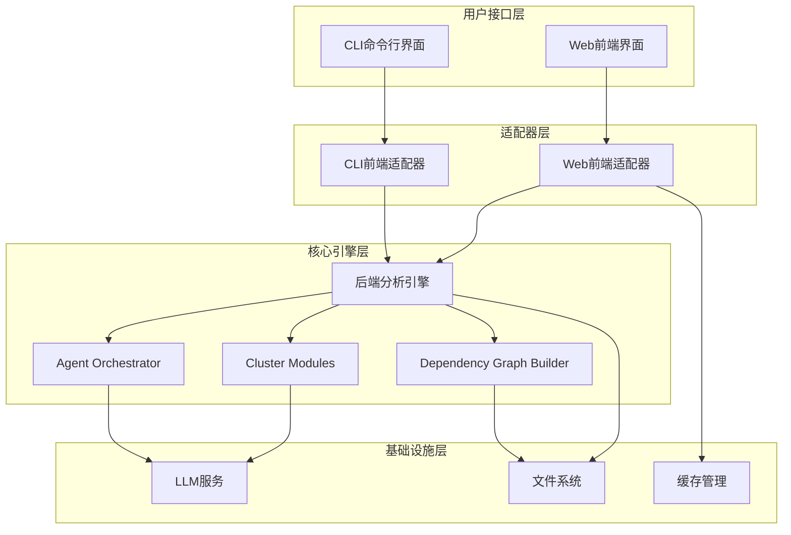

**图表来源**
- [codewiki/cli/main.py](file://codewiki/cli/main.py#L1-L57)
- [codewiki/run_web_app.py](file://codewiki/run_web_app.py#L1-L16)
- [codewiki/src/be/main.py](file://codewiki/src/be/main.py#L1-L69)

**章节来源**
- [README.md](file://README.md#L202-L227)
- [codewiki/src/config.py](file://codewiki/src/config.py#L1-L123)

## 核心组件

### 后端主程序执行流程

后端主程序通过`codewiki/src/be/main.py`实现完整的文档生成流程：

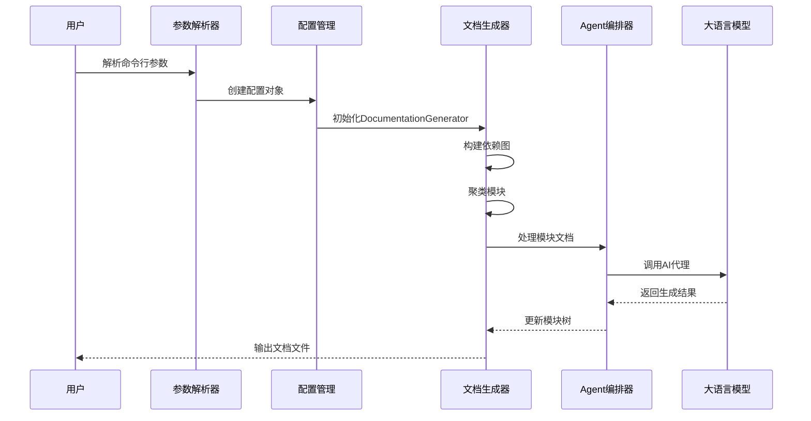

**图表来源**
- [codewiki/src/be/main.py](file://codewiki/src/be/main.py#L34-L69)
- [codewiki/src/be/documentation_generator.py](file://codewiki/src/be/documentation_generator.py#L320-L382)

### CLI和Web服务适配器模式

CLI和Web服务都通过适配器模式调用同一个后端核心，实现了统一的业务逻辑：

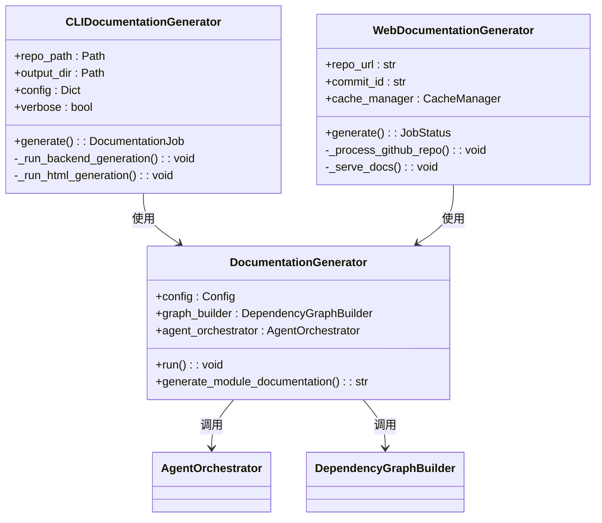

**图表来源**
- [codewiki/cli/adapters/doc_generator.py](file://codewiki/cli/adapters/doc_generator.py#L26-L298)
- [codewiki/src/be/documentation_generator.py](file://codewiki/src/be/documentation_generator.py#L29-L44)

**章节来源**
- [codewiki/cli/adapters/doc_generator.py](file://codewiki/cli/adapters/doc_generator.py#L114-L165)
- [codewiki/src/be/documentation_generator.py](file://codewiki/src/be/documentation_generator.py#L320-L382)

## 架构总览

CodeWiki采用三层架构设计，每层都有明确的职责分工：

### 分层架构设计

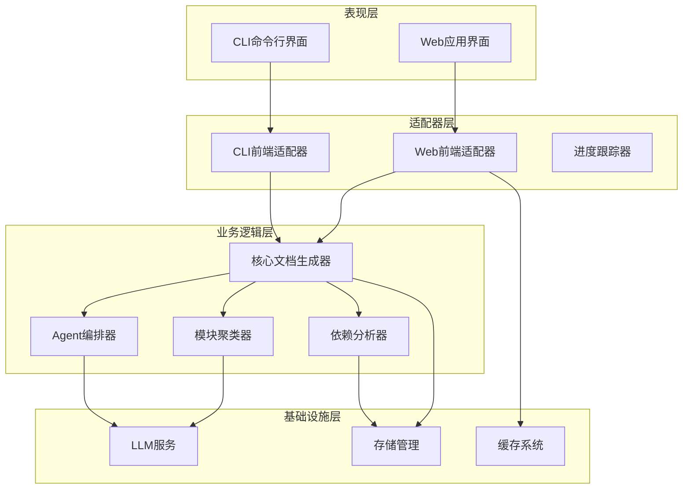

**图表来源**
- [codewiki/src/be/documentation_generator.py](file://codewiki/src/be/documentation_generator.py#L29-L44)
- [codewiki/src/be/agent_orchestrator.py](file://codewiki/src/be/agent_orchestrator.py#L59-L70)

### 数据流架构

系统的数据流从用户输入到最终文档输出的完整过程：

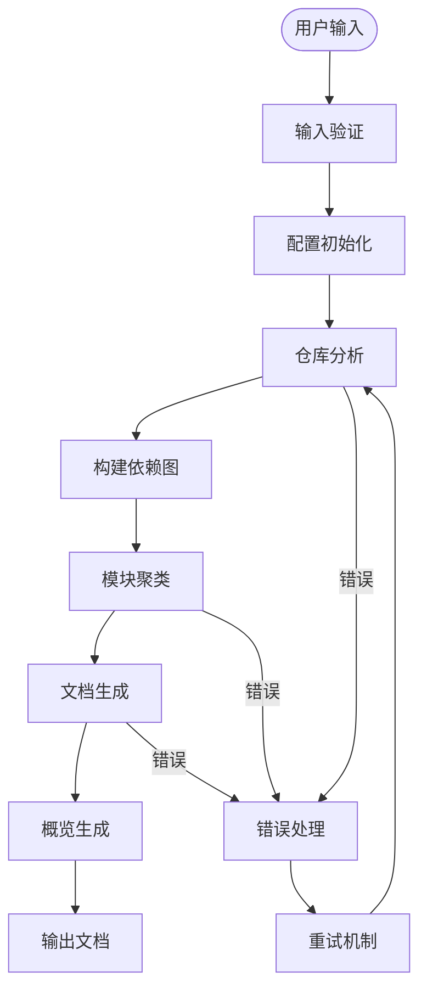

**图表来源**
- [codewiki/src/be/documentation_generator.py](file://codewiki/src/be/documentation_generator.py#L320-L382)
- [codewiki/src/be/dependency_analyzer/dependency_graphs_builder.py](file://codewiki/src/be/dependency_analyzer/dependency_graphs_builder.py#L18-L94)

## 详细组件分析

### 后端分析引擎

后端分析引擎是整个系统的核心，负责协调各个子系统的协作：

#### DocumentationGenerator核心功能

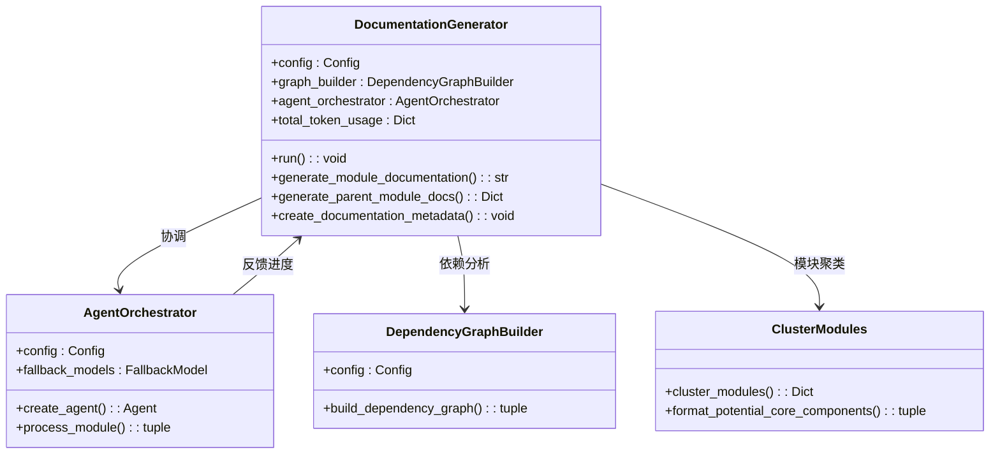

**图表来源**
- [codewiki/src/be/documentation_generator.py](file://codewiki/src/be/documentation_generator.py#L29-L44)
- [codewiki/src/be/agent_orchestrator.py](file://codewiki/src/be/agent_orchestrator.py#L59-L70)

#### 多代理系统架构

系统采用递归的多代理处理模式，能够动态适应不同复杂度的模块：

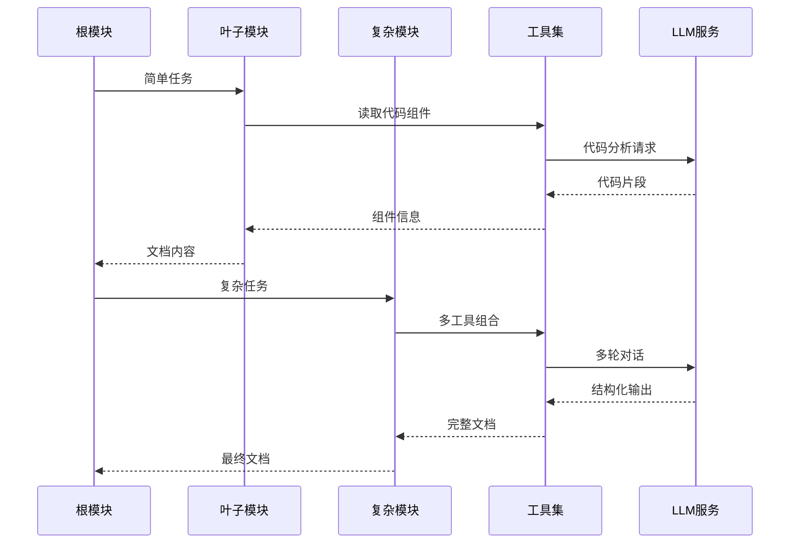

**图表来源**
- [codewiki/src/be/agent_orchestrator.py](file://codewiki/src/be/agent_orchestrator.py#L71-L93)
- [codewiki/src/be/agent_orchestrator.py](file://codewiki/src/be/agent_orchestrator.py#L95-L198)

**章节来源**
- [codewiki/src/be/documentation_generator.py](file://codewiki/src/be/documentation_generator.py#L137-L251)
- [codewiki/src/be/agent_orchestrator.py](file://codewiki/src/be/agent_orchestrator.py#L59-L198)

### CLI适配器

CLI适配器提供了命令行界面，通过`codewiki/cli/commands/generate.py`实现完整的文档生成功能：

#### CLI命令处理流程

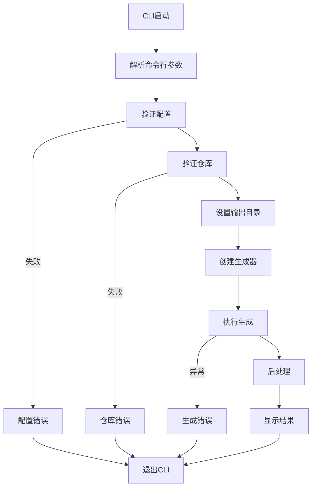

**图表来源**
- [codewiki/cli/commands/generate.py](file://codewiki/cli/commands/generate.py#L104-L275)

#### 进度跟踪机制

CLI适配器实现了详细的进度跟踪，确保用户了解生成过程：

**章节来源**
- [codewiki/cli/commands/generate.py](file://codewiki/cli/commands/generate.py#L194-L256)
- [codewiki/cli/adapters/doc_generator.py](file://codewiki/cli/adapters/doc_generator.py#L114-L165)

### Web前端适配器

Web前端通过FastAPI提供RESTful API和实时交互功能：

#### Web应用架构

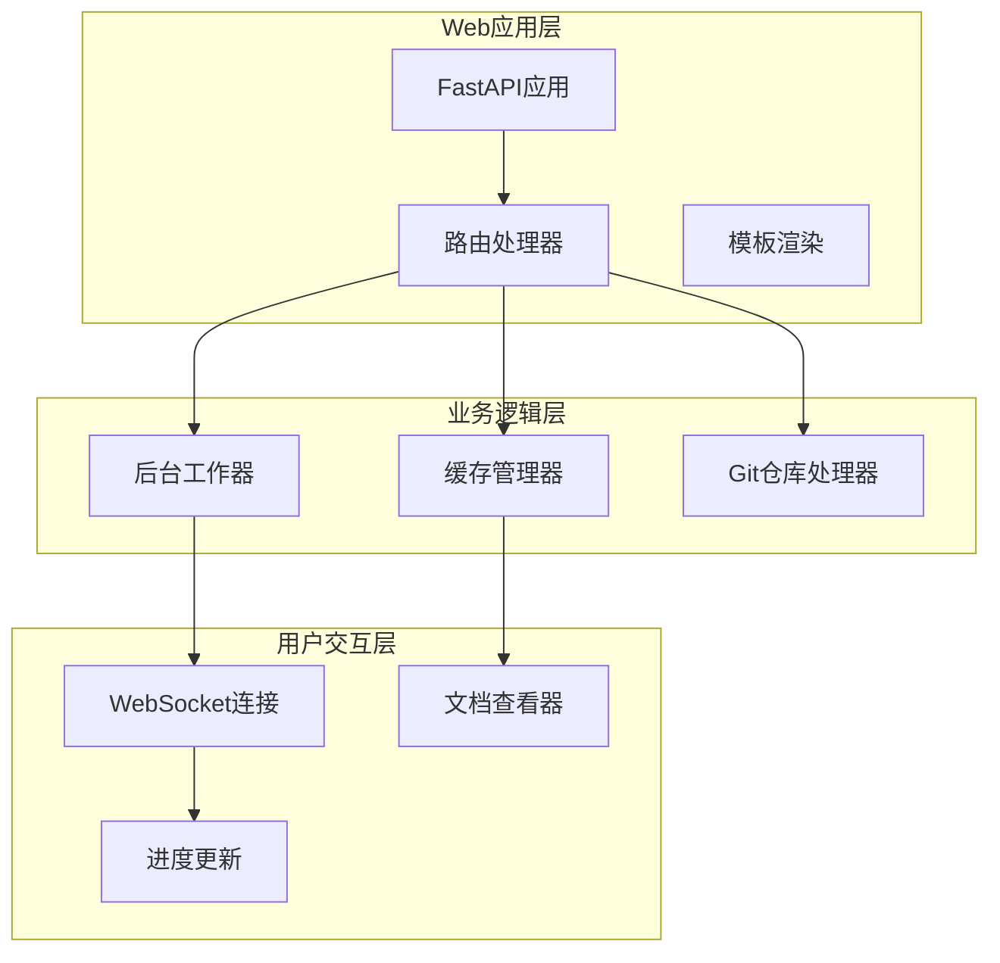

**图表来源**
- [codewiki/src/fe/web_app.py](file://codewiki/src/fe/web_app.py#L24-L42)
- [codewiki/src/fe/routes.py](file://codewiki/src/fe/routes.py#L25-L31)

**章节来源**
- [codewiki/src/fe/web_app.py](file://codewiki/src/fe/web_app.py#L94-L165)
- [codewiki/src/fe/routes.py](file://codewiki/src/fe/routes.py#L155-L269)

### 关键架构模式

#### 分层分解模式

系统采用动态规划启发式的分层分解策略，能够处理任意规模的代码库：

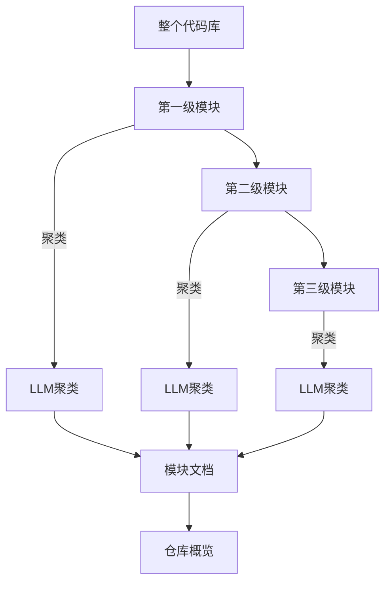

**图表来源**
- [codewiki/src/be/cluster_modules.py](file://codewiki/src/be/cluster_modules.py#L44-L125)
- [codewiki/src/be/documentation_generator.py](file://codewiki/src/be/documentation_generator.py#L362-L366)

#### 递归多代理系统

系统实现了自适应的多代理处理机制，根据模块复杂度动态选择代理能力：

**章节来源**
- [codewiki/src/be/agent_orchestrator.py](file://codewiki/src/be/agent_orchestrator.py#L71-L93)
- [codewiki/src/be/cluster_modules.py](file://codewiki/src/be/cluster_modules.py#L58-L60)

## 依赖关系分析

系统各组件之间的依赖关系体现了清晰的分层架构：

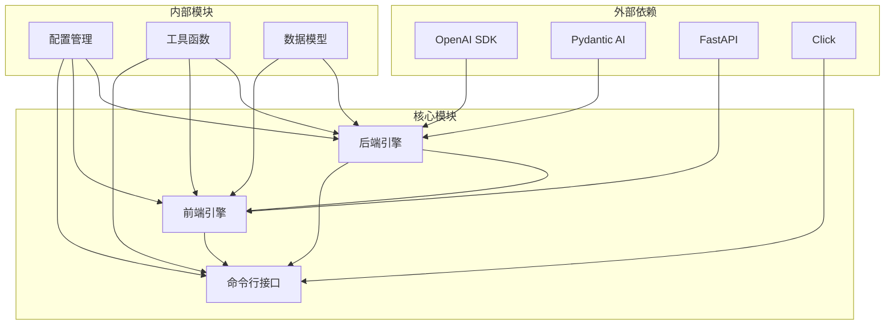

**图表来源**
- [codewiki/src/be/llm_services.py](file://codewiki/src/be/llm_services.py#L4-L10)
- [codewiki/src/config.py](file://codewiki/src/config.py#L44-L79)

**章节来源**
- [codewiki/src/config.py](file://codewiki/src/config.py#L1-L123)
- [codewiki/src/be/llm_services.py](file://codewiki/src/be/llm_services.py#L13-L47)

## 性能考虑

### Token使用优化

系统实现了精细的Token使用追踪和优化机制：

- **分阶段Token统计**：依赖分析、模块聚类、文档生成各阶段独立统计
- **回退模型机制**：主模型失败时自动切换到备用模型
- **缓存策略**：重复处理相同仓库时利用缓存减少Token消耗

### 并发处理

- **异步处理**：后端使用asyncio实现非阻塞操作
- **队列管理**：Web应用使用后台工作器处理并发请求
- **进度反馈**：实时WebSocket连接提供进度更新

## 故障排除指南

### 常见问题诊断

#### LLM API配置问题

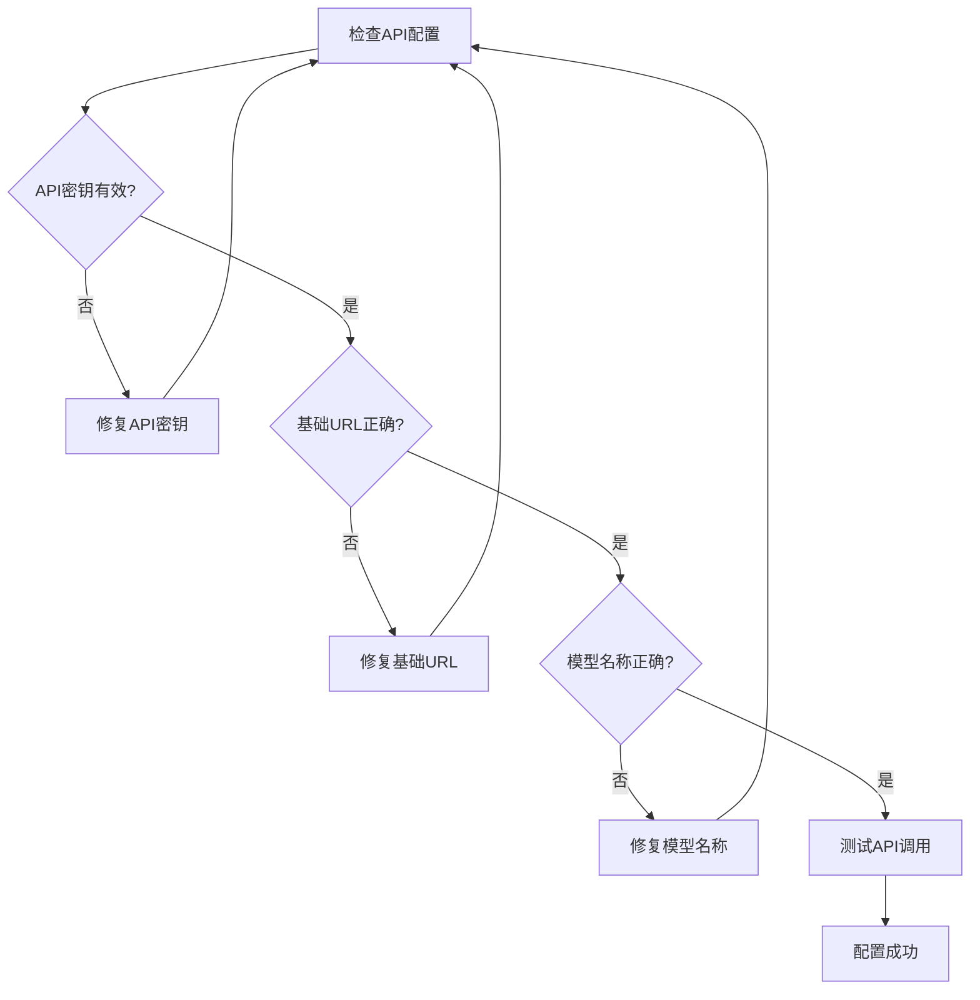

#### 仓库分析失败

常见原因及解决方案：
- **权限不足**：检查仓库访问权限
- **网络问题**：验证网络连接和代理设置
- **文件损坏**：清理缓存重新尝试

**章节来源**
- [codewiki/cli/commands/generate.py](file://codewiki/cli/commands/generate.py#L104-L123)
- [codewiki/src/be/documentation_generator.py](file://codewiki/src/be/documentation_generator.py#L377-L381)

## 结论

CodeWiki通过其精心设计的分层架构，成功实现了从CLI到Web的统一文档生成体验。系统的核心优势体现在：

1. **统一后端核心**：CLI和Web前端共享同一套后端逻辑，确保一致的处理流程
2. **可扩展的多代理系统**：能够根据模块复杂度动态调整处理策略
3. **分层分解算法**：有效处理大规模代码库，保持高质量输出
4. **完善的错误处理**：提供详细的错误诊断和恢复机制

这种架构设计使得CodeWiki能够在保持高扩展性的同时，为用户提供一致且可靠的文档生成体验。