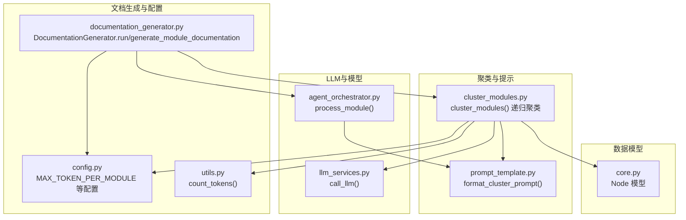
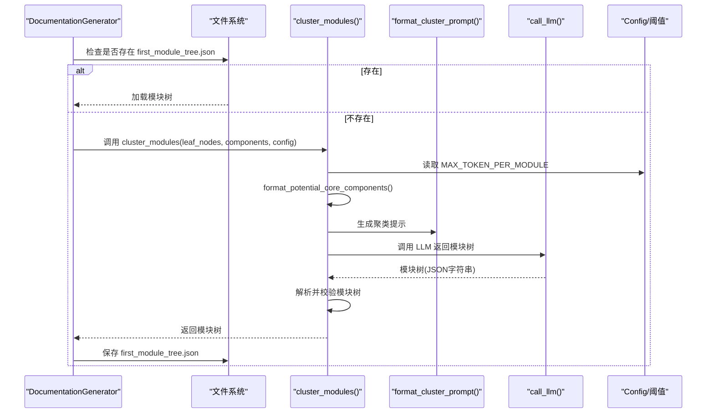
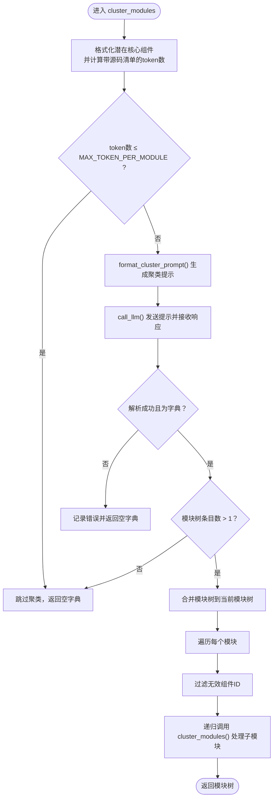
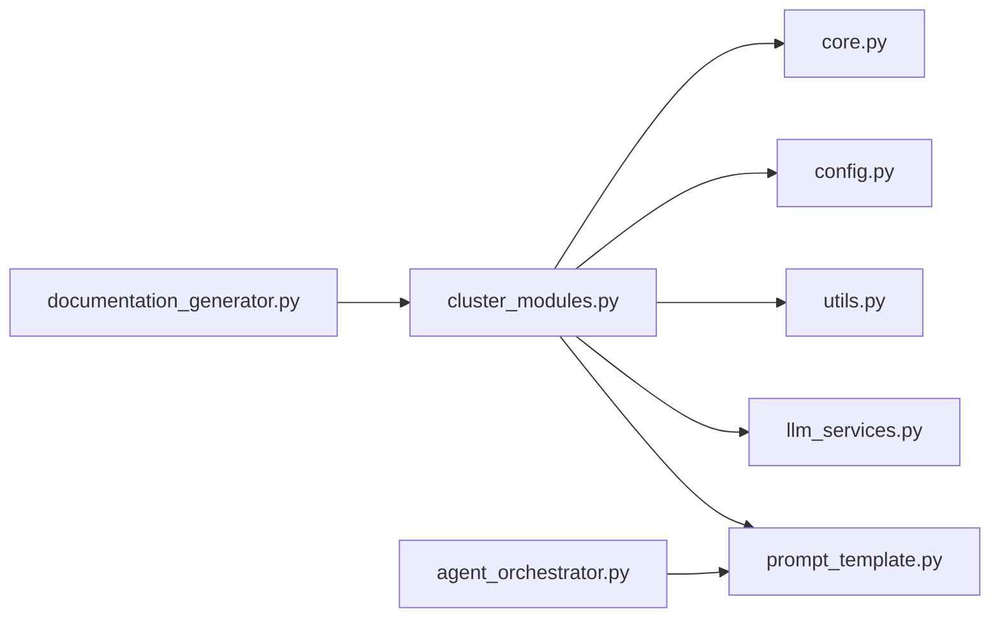

# 模块聚类器

<cite>
**本文引用的文件**
- [cluster_modules.py](file://codewiki/src/be/cluster_modules.py)
- [prompt_template.py](file://codewiki/src/be/prompt_template.py)
- [documentation_generator.py](file://codewiki/src/be/documentation_generator.py)
- [config.py](file://codewiki/src/config.py)
- [utils.py](file://codewiki/src/be/utils.py)
- [core.py](file://codewiki/src/be/dependency_analyzer/models/core.py)
- [llm_services.py](file://codewiki/src/be/llm_services.py)
- [agent_orchestrator.py](file://codewiki/src/be/agent_orchestrator.py)
</cite>

## 目录
1. [简介](#简介)
2. [项目结构](#项目结构)
3. [核心组件](#核心组件)
4. [架构总览](#架构总览)
5. [详细组件分析](#详细组件分析)
6. [依赖关系分析](#依赖关系分析)
7. [性能考量](#性能考量)
8. [故障排查指南](#故障排查指南)
9. [结论](#结论)

## 简介
本技术文档聚焦于CodeWiki的模块聚类器，深入解析`cluster_modules`递归函数的实现机制与动态层次分解算法，说明其如何基于LLM提示工程（`format_cluster_prompt`）将叶节点分组为逻辑模块；阐述模块树（module_tree）的数据结构设计及其在文档生成流程中的作用；结合`config.py`中的配置参数说明聚类行为的可定制性，并提供调试建议，特别是如何处理LLM返回无效JSON格式的异常情况。

## 项目结构
模块聚类器位于后端业务层，与提示模板、LLM服务、配置管理、依赖分析模型等模块协同工作：
- 聚类入口与递归实现：`codewiki/src/be/cluster_modules.py`
- 提示模板与聚类提示格式化：`codewiki/src/be/prompt_template.py`
- 文档生成主流程与模块树加载/保存：`codewiki/src/be/documentation_generator.py`
- 配置与阈值常量：`codewiki/src/config.py`
- 工具函数（token计数、复杂度判断等）：`codewiki/src/be/utils.py`
- 依赖分析模型（Node）：`codewiki/src/be/dependency_analyzer/models/core.py`
- LLM服务封装：`codewiki/src/be/llm_services.py`
- 叶模块文档生成编排：`codewiki/src/be/agent_orchestrator.py`

图表来源
- [cluster_modules.py](file://codewiki/src/be/cluster_modules.py#L44-L125)
- [prompt_template.py](file://codewiki/src/be/prompt_template.py#L339-L368)
- [documentation_generator.py](file://codewiki/src/be/documentation_generator.py#L320-L382)
- [config.py](file://codewiki/src/config.py#L16-L17)
- [utils.py](file://codewiki/src/be/utils.py#L30-L38)
- [core.py](file://codewiki/src/be/dependency_analyzer/models/core.py#L7-L44)
- [llm_services.py](file://codewiki/src/be/llm_services.py#L58-L100)
- [agent_orchestrator.py](file://codewiki/src/be/agent_orchestrator.py#L95-L198)

章节来源
- [cluster_modules.py](file://codewiki/src/be/cluster_modules.py#L1-L125)
- [prompt_template.py](file://codewiki/src/be/prompt_template.py#L1-L368)
- [documentation_generator.py](file://codewiki/src/be/documentation_generator.py#L1-L382)
- [config.py](file://codewiki/src/config.py#L1-L123)
- [utils.py](file://codewiki/src/be/utils.py#L1-L207)
- [core.py](file://codewiki/src/be/dependency_analyzer/models/core.py#L1-L64)
- [llm_services.py](file://codewiki/src/be/llm_services.py#L1-L100)
- [agent_orchestrator.py](file://codewiki/src/be/agent_orchestrator.py#L1-L198)

## 核心组件
- 聚类函数：`cluster_modules()`，递归地将叶节点按模块树进行分组，使用LLM进行模块划分，并将结果合并到当前模块树中。
- 提示格式化：`format_cluster_prompt()`，根据当前模块树与待聚类组件生成聚类提示，支持仓库级与模块级两种模式。
- 阈值控制：通过`MAX_TOKEN_PER_MODULE`限制单次聚类输入的token数量，避免超出上下文窗口。
- 模块树结构：字典树形结构，包含模块名、路径、组件列表与子模块树，用于后续文档生成的层次化处理。
- LLM调用：`call_llm()`，封装OpenAI兼容接口，支持返回token用量统计。
- 工具函数：`count_tokens()`，基于tiktoken计算文本token数，用于阈值判断。

章节来源
- [cluster_modules.py](file://codewiki/src/be/cluster_modules.py#L44-L125)
- [prompt_template.py](file://codewiki/src/be/prompt_template.py#L339-L368)
- [config.py](file://codewiki/src/config.py#L16-L17)
- [utils.py](file://codewiki/src/be/utils.py#L30-L38)
- [llm_services.py](file://codewiki/src/be/llm_services.py#L58-L100)

## 架构总览
模块聚类器在文档生成流程中的位置如下：
- 文档生成器在第二步执行模块聚类，若存在已保存的“首次模块树”，则直接加载；否则调用`cluster_modules()`生成模块树并持久化。
- 聚类完成后，文档生成器按拓扑顺序（叶子模块优先）生成文档，并在需要时生成父模块概览。

图表来源
- [documentation_generator.py](file://codewiki/src/be/documentation_generator.py#L335-L359)
- [cluster_modules.py](file://codewiki/src/be/cluster_modules.py#L44-L125)
- [prompt_template.py](file://codewiki/src/be/prompt_template.py#L339-L368)
- [config.py](file://codewiki/src/config.py#L16-L17)
- [llm_services.py](file://codewiki/src/be/llm_services.py#L58-L100)

## 详细组件分析

### 动态层次分解算法与`cluster_modules`递归函数
- 输入与预处理
  - 将叶节点按文件分组，生成“潜在核心组件清单”和“带源码的清单”，后者用于token计数。
  - 使用`count_tokens()`计算带源码清单的token数，若小于等于阈值`MAX_TOKEN_PER_MODULE`，则跳过该层级的聚类，直接返回空字典。
- 提示构造与LLM调用
  - 通过`format_cluster_prompt()`生成聚类提示，支持仓库级或模块级两种模式（依据传入的模块树是否为空）。
  - 调用`call_llm()`发送提示，返回模块树字符串并统计token用量。
- 结果解析与校验
  - 期望响应包含特定标签包裹的JSON结构，解析失败或类型不符时记录错误并返回空字典。
  - 若模块树条目数量小于等于1，视为无效，跳过该层级聚类。
- 模块树合并与递归
  - 若当前模块树为空，则初始化为LLM返回的模块树；否则根据当前路径定位插入点，合并模块信息（移除路径字段）。
  - 对每个模块的组件列表进行有效性过滤，确保仅保留存在于组件字典中的ID。
  - 递归调用自身，对每个子模块继续聚类，构建完整的模块树。

图表来源
- [cluster_modules.py](file://codewiki/src/be/cluster_modules.py#L44-L125)
- [prompt_template.py](file://codewiki/src/be/prompt_template.py#L339-L368)
- [utils.py](file://codewiki/src/be/utils.py#L30-L38)
- [config.py](file://codewiki/src/config.py#L16-L17)
- [llm_services.py](file://codewiki/src/be/llm_services.py#L58-L100)

章节来源
- [cluster_modules.py](file://codewiki/src/be/cluster_modules.py#L44-L125)

### 模块树（module_tree）数据结构设计
- 结构定义
  - 字典形式的树形结构，键为模块名，值包含：
    - `path`：模块路径（文件或目录）
    - `components`：该模块包含的组件ID列表
    - `children`：子模块树（递归结构）
- 设计目的
  - 支持动态层次分解后的模块化文档生成，便于后续按拓扑顺序（叶子模块优先）生成文档。
  - 在聚类阶段移除路径字段以避免重复冗余，最终写回文件系统时由上层流程统一维护。
- 与文档生成的关系
  - 文档生成器在运行时加载模块树，按拓扑顺序处理模块；父模块概览生成时会读取子模块文档内容，形成整体概览。

章节来源
- [cluster_modules.py](file://codewiki/src/be/cluster_modules.py#L94-L102)
- [documentation_generator.py](file://codewiki/src/be/documentation_generator.py#L87-L105)

### 基于LLM提示工程的聚类策略
- 提示模板选择
  - 仓库级聚类：当模块树为空时，使用仓库级聚类提示，目标是将所有潜在核心组件分组成若干模块。
  - 模块级聚类：当模块树非空时，使用模块级聚类提示，目标是在当前模块内部进一步细分。
- 提示内容组织
  - 将模块树结构与组件清单格式化为可读文本，帮助LLM理解上下文并进行合理的模块划分。
- 输出格式约束
  - LLM必须返回被特定标签包裹的JSON结构，包含模块名、路径与组件列表，以便程序安全解析。

章节来源
- [prompt_template.py](file://codewiki/src/be/prompt_template.py#L159-L226)
- [prompt_template.py](file://codewiki/src/be/prompt_template.py#L339-L368)

### 配置参数与可定制性
- 关键阈值
  - `MAX_TOKEN_PER_MODULE`：控制单次聚类的最大token数，超过阈值才触发聚类，避免LLM上下文溢出。
  - `MAX_TOKEN_PER_LEAF_MODULE`：用于叶模块的token阈值（在其他流程中使用），与聚类阈值共同决定模块复杂度。
- LLM模型与语言
  - `cluster_model`：用于模块聚类的LLM模型名称，默认与主模型一致。
  - `language`：文档生成语言（如英语、中文），影响提示与输出语言。
- 输出路径
  - `docs_dir`：文档输出目录；聚类结果保存在该目录下的模块树文件中。

章节来源
- [config.py](file://codewiki/src/config.py#L16-L17)
- [config.py](file://codewiki/src/config.py#L56-L79)
- [config.py](file://codewiki/src/config.py#L108-L123)

### 与文档生成流程的集成
- 聚类阶段
  - 文档生成器在第二步检查是否存在“首次模块树”，若不存在则调用`cluster_modules()`生成并保存。
- 文档生成阶段
  - 采用拓扑排序（叶子模块优先）生成文档；父模块概览在需要时生成，整合子模块文档。
- Token用量统计
  - 聚类阶段与文档生成阶段均通过LLM服务返回的usage统计token消耗，便于监控与成本控制。

章节来源
- [documentation_generator.py](file://codewiki/src/be/documentation_generator.py#L335-L359)
- [documentation_generator.py](file://codewiki/src/be/documentation_generator.py#L137-L251)
- [llm_services.py](file://codewiki/src/be/llm_services.py#L92-L98)

## 依赖关系分析
- 组件耦合
  - `cluster_modules()`依赖`format_cluster_prompt()`、`call_llm()`、`count_tokens()`与配置常量。
  - 与`Node`模型交互，确保组件ID的有效性与源码可用性。
- 外部依赖
  - LLM服务封装了OpenAI兼容客户端，支持回退模型链路。
  - tiktoken用于token计数，保证阈值判断的准确性。

图表来源
- [cluster_modules.py](file://codewiki/src/be/cluster_modules.py#L1-L12)
- [prompt_template.py](file://codewiki/src/be/prompt_template.py#L1-L20)
- [documentation_generator.py](file://codewiki/src/be/documentation_generator.py#L14-L26)
- [agent_orchestrator.py](file://codewiki/src/be/agent_orchestrator.py#L44-L48)

章节来源
- [cluster_modules.py](file://codewiki/src/be/cluster_modules.py#L1-L12)
- [documentation_generator.py](file://codewiki/src/be/documentation_generator.py#L14-L26)
- [agent_orchestrator.py](file://codewiki/src/be/agent_orchestrator.py#L44-L48)

## 性能考量
- token阈值控制
  - 合理设置`MAX_TOKEN_PER_MODULE`，避免频繁触发聚类导致LLM调用过多；同时确保足够的上下文以提升聚类质量。
- 递归深度与分支因子
  - 模块树的分支因子越大，递归层数越深，需关注LLM调用次数与token用量增长。
- 源码拼接与计数
  - 带源码的清单用于准确计数，但会显著增加token数；建议在必要时仅使用组件ID清单进行初步判断。
- 回退模型与稳定性
  - 使用回退模型链路提升稳定性，减少因LLM服务波动导致的失败重试成本。

## 故障排查指南
- LLM返回无效JSON格式
  - 现象：响应缺失标签或解析失败。
  - 排查要点：
    - 确认提示模板中要求的标签包裹格式是否正确。
    - 检查LLM模型是否支持返回结构化JSON，必要时调整温度或提示词。
    - 记录原始响应前缀以便人工核对格式问题。
- 组件ID缺失或不匹配
  - 现象：子模块组件列表中出现不在组件字典中的ID。
  - 排查要点：
    - 检查依赖分析阶段是否遗漏某些组件。
    - 确认组件ID命名一致性，避免大小写或路径差异导致的不匹配。
- 模块树为空或条目过少
  - 现象：模块树条目数小于等于1，聚类被跳过。
  - 排查要点：
    - 检查阈值设置是否过高，导致未触发聚类。
    - 确认叶节点数量与分布，避免极端稀疏导致无法有效聚类。
- token用量异常
  - 现象：token用量远超预期。
  - 排查要点：
    - 检查是否启用了带源码的清单计数。
    - 审视模块树的递归深度与分支因子，适当降低阈值或拆分任务。

章节来源
- [cluster_modules.py](file://codewiki/src/be/cluster_modules.py#L72-L87)
- [cluster_modules.py](file://codewiki/src/be/cluster_modules.py#L107-L118)
- [llm_services.py](file://codewiki/src/be/llm_services.py#L92-L98)

## 结论
模块聚类器通过动态层次分解与LLM提示工程，实现了对大规模代码库的自动模块化与层次化文档生成。其核心在于：
- 基于阈值的触发机制，确保在合理上下文中进行聚类；
- 通过模块树结构承载层次信息，支撑后续拓扑化的文档生成；
- 严格的提示格式与解析校验，保障聚类结果的稳定性与可复用性。

通过合理配置阈值与模型参数，并结合完善的日志与token用量统计，可在不同规模与复杂度的项目中获得稳定、高质量的模块化文档输出。