# HTML查看器

<cite>
**本文档引用的文件**
- [html_generator.py](file://codewiki/cli/html_generator.py)
- [viewer_template.html](file://codewiki/templates/github_pages/viewer_template.html)
- [generate.py](file://codewiki/cli/commands/generate.py)
- [documentation_generator.py](file://codewiki/src/be/documentation_generator.py)
- [config.py](file://codewiki/src/config.py)
- [module_tree.json](file://output/docs/FSoft-AI4Code--CodeWiki-docs/module_tree.json)
- [metadata.json](file://output/docs/FSoft-AI4Code--CodeWiki-docs/metadata.json)
- [overview.md](file://output/docs/FSoft-AI4Code--CodeWiki-docs/overview.md)
</cite>

## 目录
1. [简介](#简介)
2. [项目结构](#项目结构)
3. [核心组件](#核心组件)
4. [架构概览](#架构概览)
5. [详细组件分析](#详细组件分析)
6. [依赖关系分析](#依赖关系分析)
7. [性能考虑](#性能考虑)
8. [故障排除指南](#故障排除指南)
9. [结论](#结论)

## 简介

CodeWiki的HTML查看器是一个基于静态HTML的文档浏览系统，专门用于GitHub Pages部署。它提供了一个现代化的用户界面，支持Markdown文档渲染、Mermaid图表可视化、响应式设计和交互式导航。该查看器通过`HTMLGenerator`类将生成的Markdown文档转换为可直接部署的静态HTML页面。

## 项目结构

CodeWiki的HTML查看器功能主要分布在以下目录和文件中：

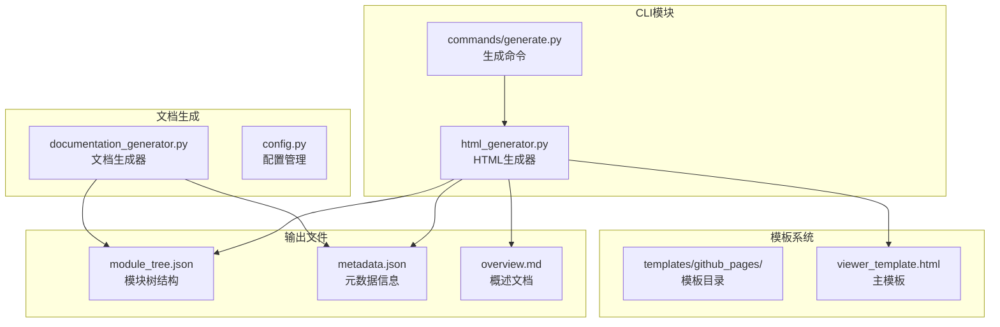

**图表来源**
- [html_generator.py](file://codewiki/cli/html_generator.py#L13-L285)
- [viewer_template.html](file://codewiki/templates/github_pages/viewer_template.html#L1-L644)
- [generate.py](file://codewiki/cli/commands/generate.py#L1-L276)

**章节来源**
- [html_generator.py](file://codewiki/cli/html_generator.py#L1-L285)
- [viewer_template.html](file://codewiki/templates/github_pages/viewer_template.html#L1-L644)

## 核心组件

### HTMLGenerator类

`HTMLGenerator`是HTML查看器的核心组件，负责将文档内容转换为静态HTML页面。该类提供了完整的生命周期管理，从模板加载到最终输出生成。

#### 主要职责
- 模板目录管理：自动定位和加载模板文件
- 数据加载：从文档目录读取模块树和元数据
- 内容替换：将占位符替换为实际数据
- 输出生成：创建最终的index.html文件

#### 关键方法
- `__init__()`: 初始化模板目录
- `load_module_tree()`: 加载模块树结构
- `load_metadata()`: 加载元数据信息
- `generate()`: 主要生成方法
- `_build_info_content()`: 构建信息面板内容

**章节来源**
- [html_generator.py](file://codewiki/cli/html_generator.py#L13-L285)

## 架构概览

HTML查看器采用分层架构设计，确保了清晰的关注点分离和良好的可维护性：

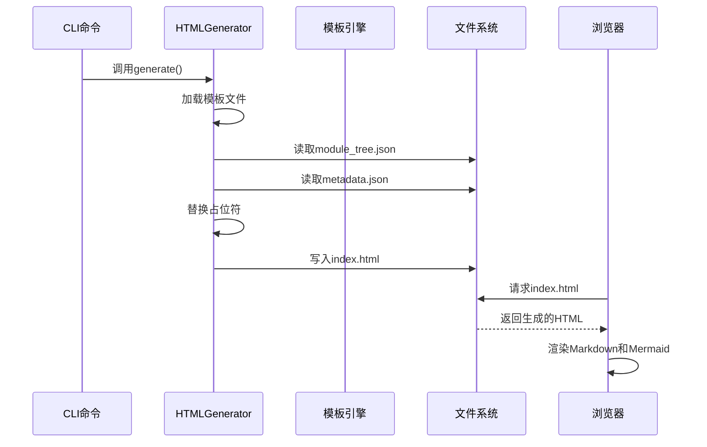

**图表来源**
- [html_generator.py](file://codewiki/cli/html_generator.py#L83-L171)
- [generate.py](file://codewiki/cli/commands/generate.py#L206-L223)

## 详细组件分析

### HTMLGenerator类详细分析

#### 初始化过程
`HTMLGenerator`类在初始化时会确定模板目录的位置。如果未指定自定义模板目录，它会自动使用包内的默认模板路径。

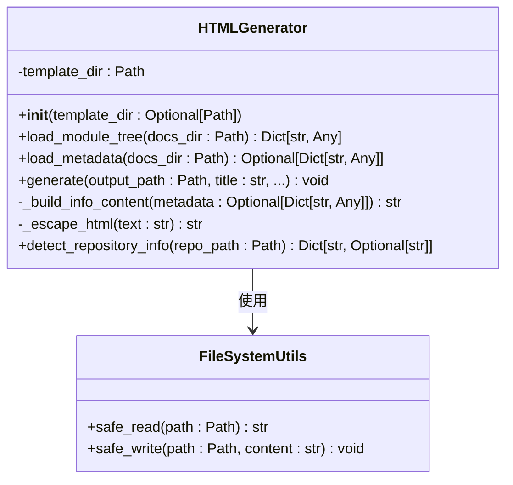

**图表来源**
- [html_generator.py](file://codewiki/cli/html_generator.py#L13-L285)

#### 模块树加载机制
模块树文件`module_tree.json`包含了文档的层次结构信息。如果文件不存在，系统会回退到一个简单的默认结构。

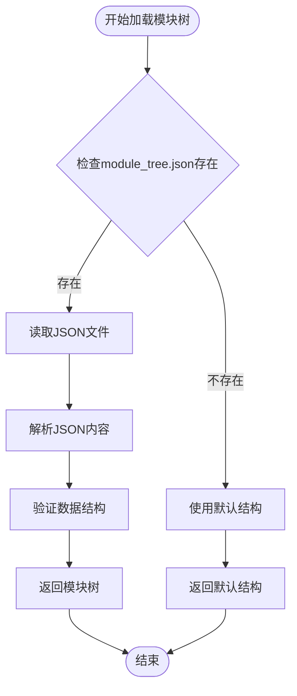

**图表来源**
- [html_generator.py](file://codewiki/cli/html_generator.py#L35-L61)
- [module_tree.json](file://output/docs/FSoft-AI4Code--CodeWiki-docs/module_tree.json#L1-L83)

#### 元数据处理
元数据文件包含文档生成的相关信息，如生成时间、使用的模型、统计信息等。这些信息会被显示在页面的仓库信息面板中。

**章节来源**
- [html_generator.py](file://codewiki/cli/html_generator.py#L62-L81)
- [metadata.json](file://output/docs/FSoft-AI4Code--CodeWiki-docs/metadata.json#L1-L24)

### viewer_template.html模板分析

#### 结构组织
模板文件采用了语义化的HTML5结构，包含完整的头部、侧边栏导航和主要内容区域。

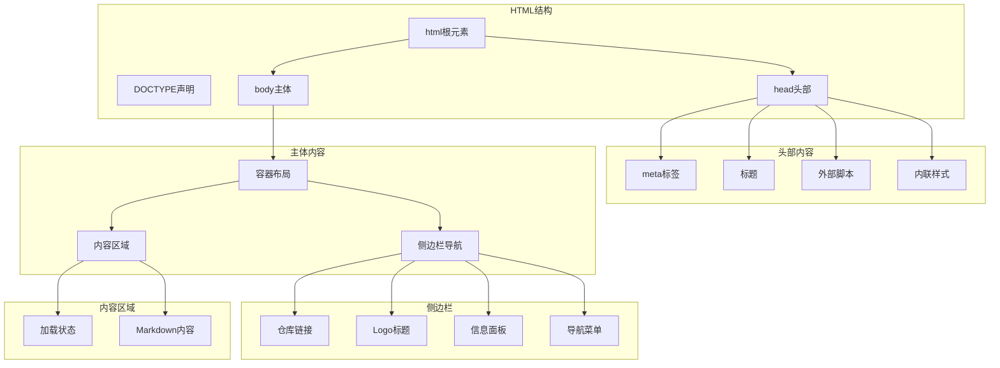

**图表来源**
- [viewer_template.html](file://codewiki/templates/github_pages/viewer_template.html#L1-L644)

#### CSS样式系统

模板使用了现代的CSS变量系统来实现主题定制：

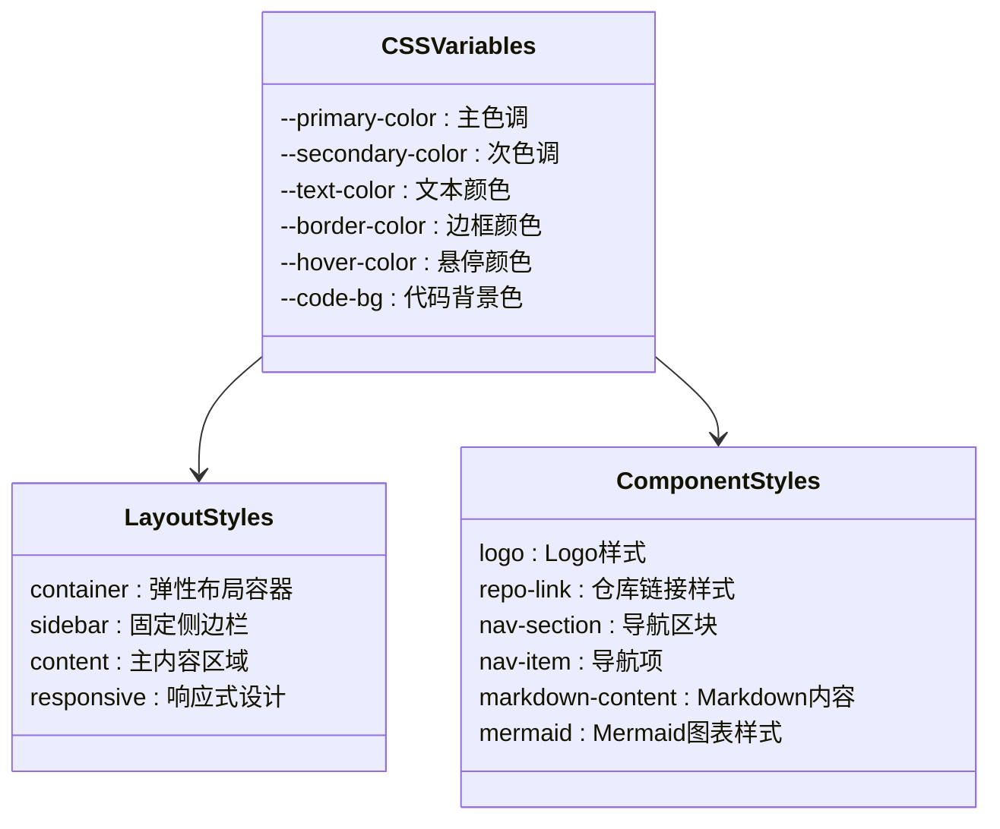

**图表来源**
- [viewer_template.html](file://codewiki/templates/github_pages/viewer_template.html#L9-L367)

#### JavaScript逻辑架构

模板包含三个主要的JavaScript模块：

1. **配置和初始化模块**
2. **导航构建模块**
3. **文档加载和渲染模块**

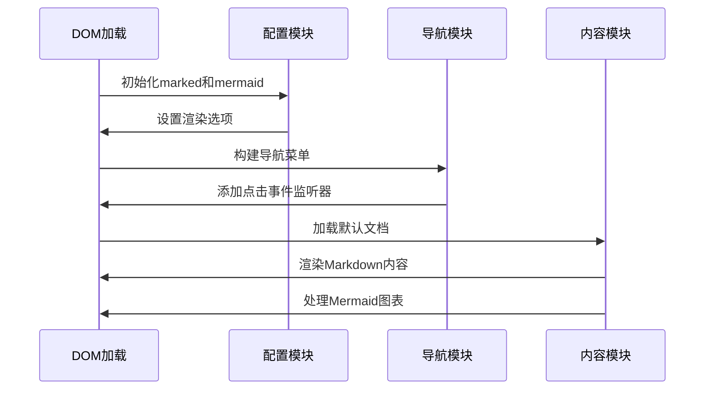

**图表来源**
- [viewer_template.html](file://codewiki/templates/github_pages/viewer_template.html#L399-L640)

#### 占位符系统

模板使用占位符机制来嵌入动态数据：

| 占位符 | 描述 | 示例值 |
|--------|------|--------|
| `{{TITLE}}` | 页面标题 | "CodeWiki项目文档" |
| `{{REPO_LINK}}` | 仓库链接HTML | `<a href="...">View Repository</a>` |
| `{{SHOW_INFO}}` | 信息面板显示控制 | `"block"` 或 `"none"` |
| `{{INFO_CONTENT}}` | 信息面板内容HTML | `
...
` |
| `{{CONFIG_JSON}}` | 配置JSON数据 | `{...}` |
| `{{MODULE_TREE_JSON}}` | 模块树JSON数据 | `{...}` |
| `{{METADATA_JSON}}` | 元数据JSON数据 | `{...}` |
| `{{DOCS_BASE_PATH}}` | 文档基础路径 | `"docs"` |

**章节来源**
- [viewer_template.html](file://codewiki/templates/github_pages/viewer_template.html#L6-L404)

### 用户界面设计

#### 侧边栏导航系统

侧边栏采用固定定位设计，提供完整的导航功能：

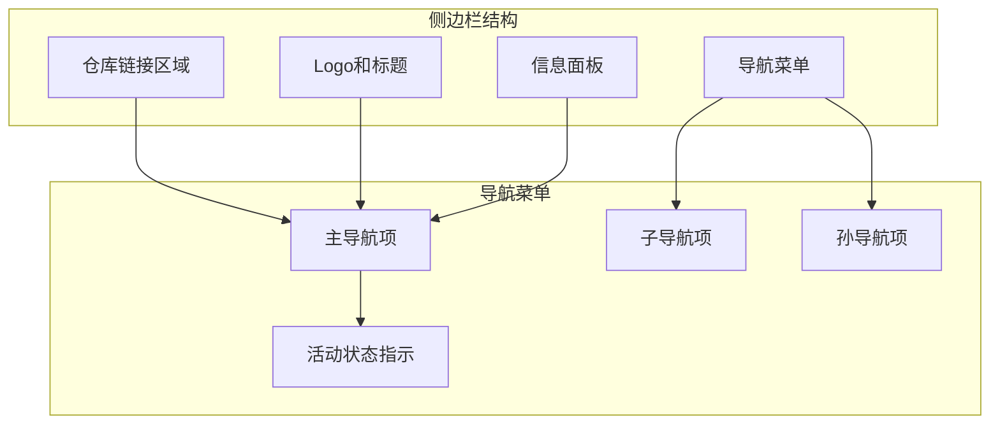

**图表来源**
- [viewer_template.html](file://codewiki/templates/github_pages/viewer_template.html#L371-L386)

#### 内容区域设计

内容区域采用流式布局，支持响应式设计：

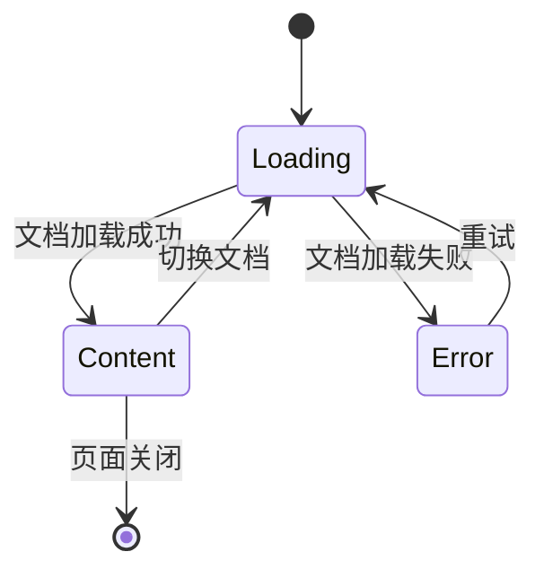

**图表来源**
- [viewer_template.html](file://codewiki/templates/github_pages/viewer_template.html#L389-L396)

#### 加载状态和错误处理

系统实现了完整的加载状态管理和错误处理机制：

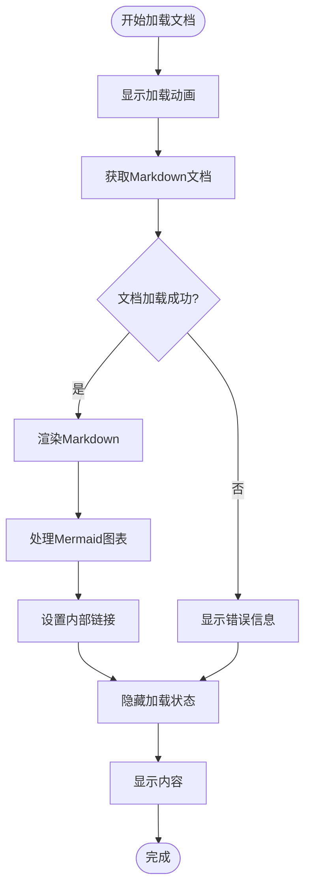

**图表来源**
- [viewer_template.html](file://codewiki/templates/github_pages/viewer_template.html#L502-L536)

**章节来源**
- [viewer_template.html](file://codewiki/templates/github_pages/viewer_template.html#L316-L351)
- [viewer_template.html](file://codewiki/templates/github_pages/viewer_template.html#L627-L639)

## 依赖关系分析

HTML查看器的依赖关系相对简单，主要依赖于外部库和本地模板：

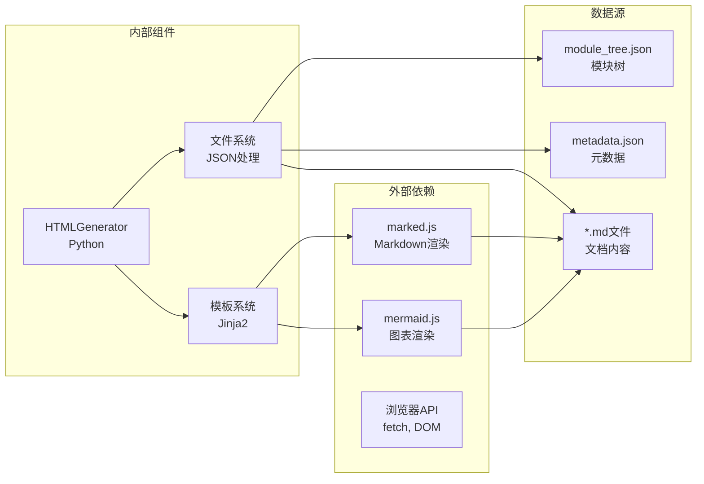

**图表来源**
- [html_generator.py](file://codewiki/cli/html_generator.py#L1-L11)
- [viewer_template.html](file://codewiki/templates/github_pages/viewer_template.html#L7-L8)

**章节来源**
- [html_generator.py](file://codewiki/cli/html_generator.py#L1-L11)
- [generate.py](file://codewiki/cli/commands/generate.py#L206-L223)

## 性能考虑

### 静态资源优化
- 使用CDN加载外部库，减少本地带宽占用
- 内联关键CSS，避免额外的HTTP请求
- 图片和代码块采用懒加载策略

### 内存管理
- 使用事件委托减少内存占用
- 及时清理DOM事件监听器
- 合理的垃圾回收策略

### 缓存策略
- 利用浏览器缓存机制
- 实现增量更新策略
- 支持离线文档访问

## 故障排除指南

### 常见问题及解决方案

#### 模板文件缺失
**问题**: `Template not found: viewer_template.html`
**原因**: 自定义模板目录不存在或文件名不正确
**解决**: 确保模板文件位于正确的路径下

#### 文档加载失败
**问题**: 页面显示"Failed to load document"
**原因**: Markdown文件路径不正确或文件不存在
**解决**: 检查`DOCS_BASE_PATH`配置和文件路径

#### Mermaid图表渲染错误
**问题**: Mermaid图表显示"Error rendering diagram"
**原因**: Mermaid语法错误或版本兼容性问题
**解决**: 检查Mermaid代码语法和版本匹配

#### 响应式布局问题
**问题**: 移动端显示异常
**原因**: CSS媒体查询配置不当
**解决**: 检查断点设置和媒体查询规则

**章节来源**
- [html_generator.py](file://codewiki/cli/html_generator.py#L122-L123)
- [viewer_template.html](file://codewiki/templates/github_pages/viewer_template.html#L510-L514)
- [viewer_template.html](file://codewiki/templates/github_pages/viewer_template.html#L618-L624)

## 结论

CodeWiki的HTML查看器是一个设计精良的静态文档浏览系统，具有以下特点：

### 技术优势
- **模块化设计**: 清晰的职责分离和良好的可维护性
- **响应式布局**: 适配各种设备和屏幕尺寸
- **性能优化**: 静态生成和CDN加速
- **扩展性强**: 易于定制和主题化

### 功能特性
- **Markdown渲染**: 完整的Markdown语法支持
- **图表可视化**: Mermaid图表的无缝集成
- **导航系统**: 层次化的文档导航
- **错误处理**: 完善的错误提示和恢复机制

### 应用场景
该查看器特别适合：
- GitHub Pages项目文档展示
- 开源项目的在线文档
- 技术博客和知识库
- 内部文档管理系统

通过合理的模板定制和配置调整，可以轻松适应不同的主题需求和功能扩展要求。