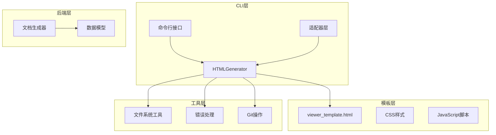
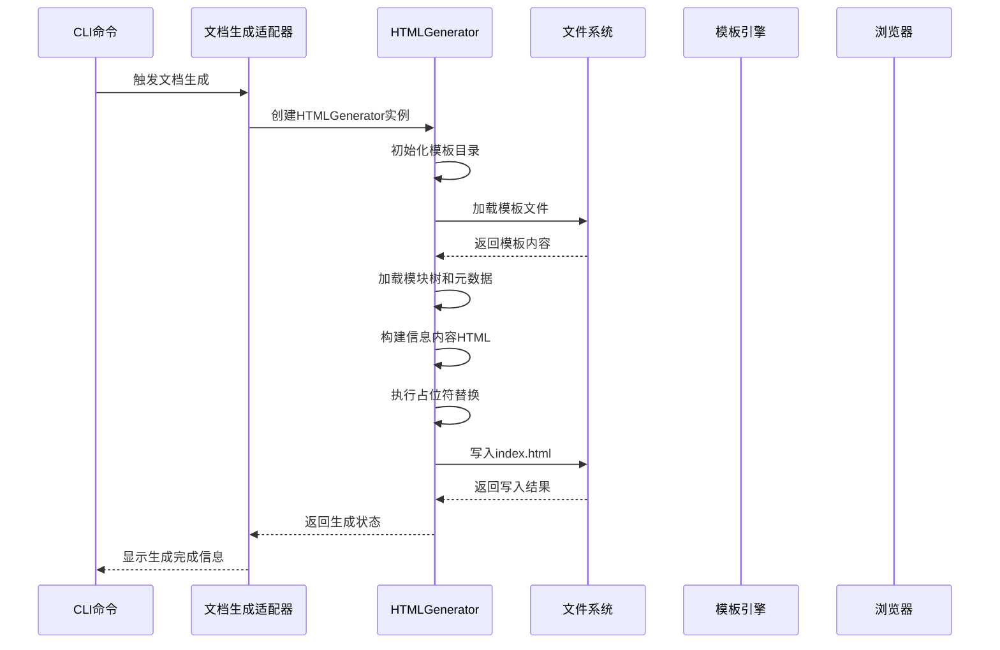
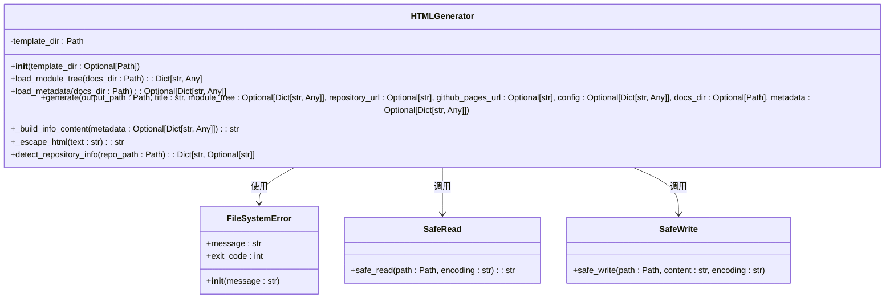
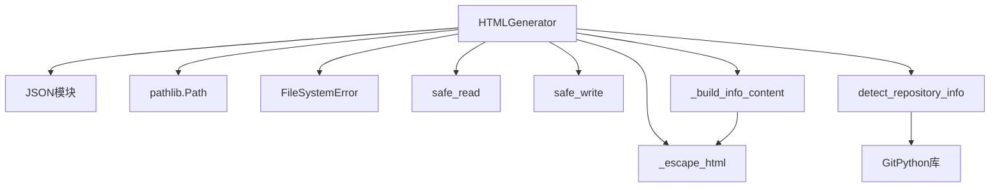

# HTML生成器类

<cite>
**本文档引用的文件**
- [html_generator.py](file://codewiki/cli/html_generator.py)
- [errors.py](file://codewiki/cli/utils/errors.py)
- [fs.py](file://codewiki/cli/utils/fs.py)
- [viewer_template.html](file://codewiki/templates/github_pages/viewer_template.html)
- [doc_generator.py](file://codewiki/cli/adapters/doc_generator.py)
- [generate.py](file://codewiki/cli/commands/generate.py)
- [git_manager.py](file://codewiki/cli/git_manager.py)
</cite>

## 目录
1. [简介](#简介)
2. [项目结构](#项目结构)
3. [核心组件](#核心组件)
4. [架构概览](#架构概览)
5. [详细组件分析](#详细组件分析)
6. [依赖关系分析](#依赖关系分析)
7. [性能考虑](#性能考虑)
8. [故障排除指南](#故障排除指南)
9. [结论](#结论)

## 简介
HTMLGenerator类是CodeWiki项目中负责生成GitHub Pages静态文档查看器的核心组件。该类实现了完整的HTML模板渲染流程，包括模板加载、占位符替换、文件写入等关键功能，为用户提供了美观且功能丰富的文档浏览体验。

## 项目结构
CodeWiki项目采用分层架构设计，HTMLGenerator位于CLI层，负责将后端生成的文档数据转换为可直接部署到GitHub Pages的静态HTML页面。



**图表来源**
- [html_generator.py](file://codewiki/cli/html_generator.py#L13-L285)
- [doc_generator.py](file://codewiki/cli/adapters/doc_generator.py#L257-L286)

**章节来源**
- [html_generator.py](file://codewiki/cli/html_generator.py#L1-L33)
- [doc_generator.py](file://codewiki/cli/adapters/doc_generator.py#L25-L71)

## 核心组件
HTMLGenerator类包含以下核心方法和职责：

### 主要职责
- **模板管理**: 负责模板目录的初始化和模板文件的加载
- **数据处理**: 加载模块树和元数据，进行数据验证和降级处理
- **HTML生成**: 协调模板渲染、占位符替换和文件输出
- **安全处理**: 实施HTML转义机制防止XSS攻击
- **Git集成**: 检测仓库信息，生成GitHub Pages链接

### 关键特性
- 支持自动模板目录检测
- 提供降级机制处理缺失文件
- 实现安全的HTML内容构建
- 集成Git仓库信息检测
- 原子性文件写入操作

**章节来源**
- [html_generator.py](file://codewiki/cli/html_generator.py#L13-L33)
- [html_generator.py](file://codewiki/cli/html_generator.py#L83-L172)

## 架构概览
HTMLGenerator在整个CodeWiki生态系统中扮演着文档输出的关键角色，与多个组件协同工作以提供完整的文档生成解决方案。



**图表来源**
- [doc_generator.py](file://codewiki/cli/adapters/doc_generator.py#L257-L286)
- [html_generator.py](file://codewiki/cli/html_generator.py#L83-L172)

## 详细组件分析

### HTMLGenerator类结构



**图表来源**
- [html_generator.py](file://codewiki/cli/html_generator.py#L13-L285)
- [errors.py](file://codewiki/cli/utils/errors.py#L57-L62)
- [fs.py](file://codewiki/cli/utils/fs.py#L89-L114)

#### 初始化方法 (__init__)
HTMLGenerator的构造函数负责设置模板目录路径，提供灵活的配置选项：

**初始化流程**：
1. 接收可选的模板目录参数
2. 如果未指定，自动定位到包内模板目录
3. 将路径标准化为绝对路径
4. 存储到实例变量中供后续使用

**默认模板路径解析**：
- 使用当前文件所在位置的相对路径
- 定位到 `templates/github_pages/` 目录
- 确保模板文件的可用性

**章节来源**
- [html_generator.py](file://codewiki/cli/html_generator.py#L21-L33)

#### 模块树加载 (load_module_tree)
该方法负责从文档目录加载模块树数据，实现智能的降级处理：

**加载流程**：
1. 查找 `module_tree.json` 文件
2. 如果文件不存在，返回预定义的基础结构
3. 如果文件存在，读取并解析JSON内容
4. 异常时抛出文件系统错误

**降级机制**：
- 缺失文件时返回包含 "Overview" 根节点的基础结构
- 确保即使没有模块树也能正常生成HTML
- 保持向后兼容性

**章节来源**
- [html_generator.py](file://codewiki/cli/html_generator.py#L35-L61)

#### 元数据加载 (load_metadata)
元数据加载方法提供非关键性的信息支持：

**加载策略**：
1. 查找 `metadata.json` 文件
2. 文件不存在时返回None（不抛出异常）
3. 文件存在时解析JSON内容
4. 解析失败时返回None（静默降级）

**设计考量**：
- 元数据不是必需的，不影响主要功能
- 采用非致命错误处理，提升用户体验
- 保持系统的健壮性

**章节来源**
- [html_generator.py](file://codewiki/cli/html_generator.py#L62-L82)

#### 主生成方法 (generate)
generate方法是HTMLGenerator的核心，协调整个HTML生成流程：

**参数体系**：
- `output_path`: 输出文件路径（通常为index.html）
- `title`: 文档标题
- `module_tree`: 模块树结构（可选，自动加载）
- `repository_url`: 仓库URL（用于显示链接）
- `github_pages_url`: GitHub Pages URL
- `config`: 配置参数
- `docs_dir`: 文档目录（触发自动加载）
- `metadata`: 元数据（可选，自动加载）

**生成流程**：
1. **自动加载检查**: 当提供docs_dir时，自动加载模块树和元数据
2. **默认值设置**: 为空的module_tree和config提供默认值
3. **模板加载**: 验证并读取模板文件
4. **信息内容构建**: 基于元数据生成HTML内容
5. **仓库链接生成**: 根据repository_url创建链接
6. **文档基础路径计算**: 处理GitHub Pages相对路径
7. **JSON数据准备**: 序列化配置、模块树和元数据
8. **占位符替换**: 执行所有模板占位符的替换
9. **文件写入**: 安全地写入最终的HTML文件

**章节来源**
- [html_generator.py](file://codewiki/cli/html_generator.py#L83-L172)

#### 信息内容构建 (_build_info_content)
该方法将元数据转换为HTML格式的信息面板：

**构建逻辑**：
1. 检查元数据是否存在generation_info字段
2. 提取generation_info和statistics信息
3. 条件性添加各种信息行：
   - 主模型名称
   - 生成时间戳（格式化为日期）
   - 提交哈希（截断为前8位）
   - 组件总数（带千位分隔符）
   - 最大深度

**安全处理**：
- 对所有文本内容执行HTML转义
- 防止XSS攻击和模板注入
- 确保显示内容的安全性

**章节来源**
- [html_generator.py](file://codewiki/cli/html_generator.py#L173-L218)

#### HTML转义机制 (_escape_html)
实现全面的HTML特殊字符转义，防止安全漏洞：

**转义规则**：
- `&` → `&amp;`
- `<` → `&lt;`
- `>` → `&gt;`
- `"` → `&quot;`
- `'` → `&#39;`

**应用场景**：
- 标题内容转义
- 仓库信息转义
- 用户输入内容处理
- 动态生成的HTML属性值

**章节来源**
- [html_generator.py](file://codewiki/cli/html_generator.py#L219-L235)

#### 仓库信息检测 (detect_repository_info)
通过GitPython检测仓库信息，为用户提供便捷的链接功能：

**检测流程**：
1. **基础信息**: 设置默认的仓库名称
2. **远程URL获取**: 从Git仓库获取远程URL
3. **URL清理**: 处理SSH和HTTPS格式差异
4. **GitHub Pages推导**: 从仓库URL推导GitHub Pages地址

**URL处理逻辑**：
- 支持SSH格式 (`git@github.com:owner/repo.git`)
- 支持HTTPS格式 (`https://github.com/owner/repo.git`)
- 移除.git后缀和尾部斜杠
- 标准化为HTTPS格式

**GitHub Pages URL生成**：
- 基于 `https://{owner}.github.io/{repo}/` 模式
- 自动从URL中提取所有者和仓库名
- 提供完整的Pages地址

**章节来源**
- [html_generator.py](file://codewiki/cli/html_generator.py#L238-L284)

### 模板系统集成
HTMLGenerator与viewer_template.html模板紧密集成，实现了完整的客户端渲染架构：

```mermaid
flowchart TD
Template[viewer_template.html] --> Placeholders[占位符定义]
Placeholders --> Title[{{TITLE}}]
Placeholders --> RepoLink[{{REPO_LINK}}]
Placeholders --> ShowInfo[{{SHOW_INFO}}]
Placeholders --> InfoContent[{{INFO_CONTENT}}]
Placeholders --> ConfigJSON[{{CONFIG_JSON}}]
Placeholders --> ModuleTreeJSON[{{MODULE_TREE_JSON}}]
Placeholders --> MetadataJSON[{{METADATA_JSON}}]
Placeholders --> DocsBasePath[{{DOCS_BASE_PATH}}]
HTMLGen[HTMLGenerator] --> Replacements[占位符替换]
Replacements --> Title
Replacements --> RepoLink
Replacements --> ShowInfo
Replacements --> InfoContent
Replacements --> ConfigJSON
Replacements --> ModuleTreeJSON
Replacements --> MetadataJSON
Replacements --> DocsBasePath
Replacements --> Output[index.html]
```

**图表来源**
- [viewer_template.html](file://codewiki/templates/github_pages/viewer_template.html#L6-L404)
- [html_generator.py](file://codewiki/cli/html_generator.py#L153-L167)

**章节来源**
- [viewer_template.html](file://codewiki/templates/github_pages/viewer_template.html#L1-L644)

## 依赖关系分析

### 内部依赖关系
HTMLGenerator类具有清晰的内部依赖层次：



**图表来源**
- [html_generator.py](file://codewiki/cli/html_generator.py#L5-L10)
- [html_generator.py](file://codewiki/cli/html_generator.py#L173-L284)

### 外部依赖集成
HTMLGenerator与CodeWiki其他组件的集成关系：

**与适配器层的集成**：
- 由CLIDocumentationGenerator调用
- 接收来自后端的数据
- 处理生成的文档文件

**与命令行接口的交互**：
- 通过generate命令触发
- 支持GitHub Pages标志
- 集成进度跟踪

**与Git系统的协作**：
- 检测仓库信息
- 获取远程URL
- 推导Pages地址

**章节来源**
- [doc_generator.py](file://codewiki/cli/adapters/doc_generator.py#L257-L286)
- [generate.py](file://codewiki/cli/commands/generate.py#L34-L97)

## 性能考虑
HTMLGenerator在设计时充分考虑了性能和资源使用效率：

### 文件I/O优化
- **原子写入**: 使用临时文件+重命名的方式避免部分写入
- **缓存策略**: 模板文件只读取一次并重复使用
- **路径解析**: 预先解析和标准化所有路径

### 内存使用控制
- **流式处理**: 模板内容一次性读取，避免多次I/O
- **增量构建**: 信息内容按需构建，避免不必要的计算
- **字符串操作**: 使用高效的字符串替换而非正则表达式

### 错误处理优化
- **早失败**: 在模板不存在时立即抛出错误
- **降级处理**: 缺失文件时提供合理的默认行为
- **异常隔离**: 不同类型的错误使用不同的处理策略

## 故障排除指南

### 常见问题及解决方案

**模板文件缺失**
- **症状**: 抛出文件系统错误，提示模板未找到
- **原因**: 模板目录或文件被意外删除
- **解决**: 确保 `templates/github_pages/viewer_template.html` 存在

**JSON文件解析错误**
- **症状**: 加载模块树或元数据时抛出文件系统错误
- **原因**: JSON格式不正确或文件损坏
- **解决**: 检查JSON文件格式，确保语法正确

**权限问题**
- **症状**: 写入index.html时抛出权限错误
- **原因**: 输出目录权限不足
- **解决**: 检查目录写权限，必要时使用sudo

**Git操作失败**
- **症状**: 仓库信息检测失败
- **原因**: 不是Git仓库或Git命令不可用
- **解决**: 确保在Git仓库中运行，安装GitPython

### 日志记录最佳实践

**错误分类处理**：
- **文件系统错误**: 使用FileSystemError类，提供详细的错误信息
- **配置错误**: 使用ConfigurationError类，指导用户修正配置
- **仓库错误**: 使用RepositoryError类，提供Git相关的问题解决方案

**错误信息格式化**：
- 包含具体的错误详情
- 提供可能的解决方案
- 包含建议的操作步骤

**章节来源**
- [errors.py](file://codewiki/cli/utils/errors.py#L57-L83)
- [fs.py](file://codewiki/cli/utils/fs.py#L31-L37)

## 结论
HTMLGenerator类是CodeWiki项目中实现GitHub Pages文档生成的核心组件，展现了优秀的软件工程实践：

### 设计优势
- **模块化设计**: 清晰的方法分离和职责划分
- **健壮性**: 完善的错误处理和降级机制
- **安全性**: 全面的HTML转义和输入验证
- **可扩展性**: 灵活的模板系统和配置选项

### 技术亮点
- **原子性文件操作**: 确保文件完整性
- **智能降级**: 提升用户体验的容错能力
- **Git集成**: 无缝连接版本控制系统
- **安全防护**: 防范常见的Web安全威胁

### 应用价值
HTMLGenerator不仅实现了基本的HTML生成功能，更重要的是为CodeWiki用户提供了：
- 美观的文档浏览界面
- 便捷的仓库链接功能  
- 可直接部署的静态站点
- 完整的文档导航系统

该组件的设计体现了现代软件开发的最佳实践，为CodeWiki项目的整体功能提供了坚实的技术基础。