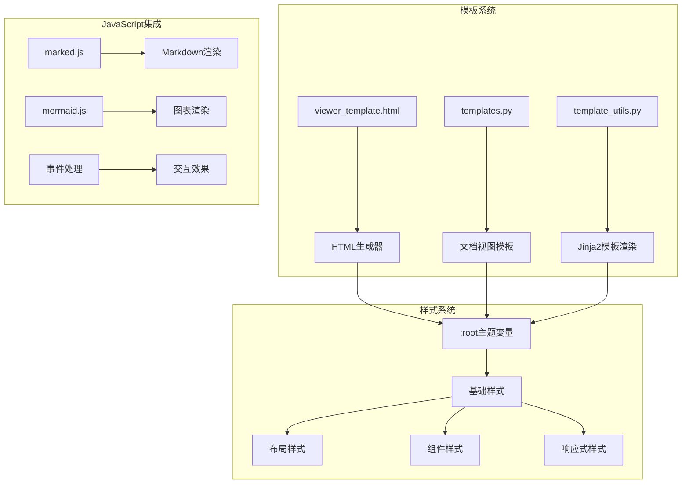

# CSS样式与布局设计

<cite>
**本文档引用的文件**
- [viewer_template.html](file://codewiki/templates/github_pages/viewer_template.html)
- [html_generator.py](file://codewiki/cli/html_generator.py)
- [template_utils.py](file://codewiki/src/fe/template_utils.py)
- [templates.py](file://codewiki/src/fe/templates.py)
- [visualise_docs.py](file://codewiki/src/fe/visualise_docs.py)
</cite>

## 目录
1. [简介](#简介)
2. [项目结构概览](#项目结构概览)
3. [核心CSS架构分析](#核心css架构分析)
4. [主题变量系统](#主题变量系统)
5. [双栏布局设计](#双栏布局设计)
6. [响应式设计实现](#响应式设计实现)
7. [Markdown内容样式规范](#markdown内容样式规范)
8. [动画与交互效果](#动画与交互效果)
9. [样式优先级与嵌套规则](#样式优先级与嵌套规则)
10. [自定义修改指南](#自定义修改指南)
11. [故障排除指南](#故障排除指南)
12. [结论](#结论)

## 简介

本文档深入分析了CodeWiki项目中`viewer_template.html`的CSS样式设计与响应式布局实现。该模板为GitHub Pages文档查看器提供了完整的前端样式解决方案，包括主题定制化、双栏布局、响应式适配、Markdown内容渲染样式以及交互效果等核心功能。

## 项目结构概览

CodeWiki采用模块化的前端架构，主要组件包括：



**图表来源**
- [viewer_template.html](file://codewiki/templates/github_pages/viewer_template.html#L9-L367)
- [templates.py](file://codewiki/src/fe/templates.py#L504-L800)

**章节来源**
- [viewer_template.html](file://codewiki/templates/github_pages/viewer_template.html#L1-L644)
- [html_generator.py](file://codewiki/cli/html_generator.py#L13-L172)

## 核心CSS架构分析

### 全局样式重置

模板采用了标准化的CSS重置策略，确保跨浏览器的一致性：

```css
* {
    margin: 0;
    padding: 0;
    box-sizing: border-box;
}
```

这种全局重置为后续的样式继承奠定了基础，避免了不同浏览器默认样式的差异。

### 基础字体与排版

```css
body {
    font-family: -apple-system, BlinkMacSystemFont, 'Segoe UI', Roboto, sans-serif;
    line-height: 1.6;
    color: var(--text-color);
    background-color: #ffffff;
}
```

采用系统字体栈，确保在不同操作系统上的最佳显示效果。

**章节来源**
- [viewer_template.html](file://codewiki/templates/github_pages/viewer_template.html#L19-L30)

## 主题变量系统

### :root变量定义

主题系统通过CSS自定义属性实现了高度可定制的设计语言：

```css
:root {
    --primary-color: #2563eb;
    --secondary-color: #f1f5f9;
    --text-color: #334155;
    --border-color: #e2e8f0;
    --hover-color: #f8fafc;
    --code-bg: #f8fafc;
}
```

### 变量使用模式

这些变量在整个样式表中被广泛使用，实现了主题的统一管理：

- **主色调**: `var(--primary-color)` - 用于链接、按钮、激活状态等关键元素
- **辅助色**: `var(--secondary-color)` - 用于背景色和次要元素
- **文本色**: `var(--text-color)` - 用于正文和标题的主要文本
- **边框色**: `var(--border-color)` - 用于分隔线和边框
- **悬停色**: `var(--hover-color)` - 用于悬停效果的背景色
- **代码背景**: `var(--code-bg)` - 用于代码块的背景色

### 主题定制化实现

开发者可以通过修改`:root`中的变量值来实现完全的主题定制：

```css
/* 示例：深色主题变体 */
:root.dark-theme {
    --primary-color: #60a5fa;
    --secondary-color: #1e293b;
    --text-color: #f8fafc;
    --border-color: #334155;
    --hover-color: #334155;
    --code-bg: #1e293b;
}
```

**章节来源**
- [viewer_template.html](file://codewiki/templates/github_pages/viewer_template.html#L10-L17)

## 双栏布局设计

### 布局容器结构

```css
.container {
    display: flex;
    min-height: 100vh;
}
```

采用Flexbox布局，确保内容区域能够填充整个视口高度。

### 固定侧边栏实现

```css
.sidebar {
    width: 320px;
    background-color: var(--secondary-color);
    border-right: 1px solid var(--border-color);
    padding: 20px;
    overflow-y: auto;
    position: fixed;
    height: 100vh;
}
```

固定定位确保侧边栏在页面滚动时保持可见，同时通过`height: 100vh`实现全屏高度覆盖。

### 主内容区域

```css
.content {
    flex: 1;
    margin-left: 320px;
    padding: 40px 60px;
    max-width: calc(100% - 320px);
}
```

通过`margin-left: 320px`为侧边栏留出空间，`flex: 1`确保内容区域自动扩展填充剩余空间。

### 导航系统

```css
.nav-section {
    margin-bottom: 20px;
}

.nav-item {
    display: block;
    padding: 10px 12px;
    color: var(--text-color);
    text-decoration: none;
    border-radius: 6px;
    font-size: 14px;
    transition: all 0.2s ease;
    margin-bottom: 2px;
    cursor: pointer;
}

.nav-item:hover {
    background-color: white;
    color: var(--primary-color);
}

.nav-item.active {
    background-color: var(--primary-color);
    color: white;
}
```

导航项支持多级嵌套，通过CSS选择器实现深度递归的样式继承。

**章节来源**
- [viewer_template.html](file://codewiki/templates/github_pages/viewer_template.html#L32-L167)

## 响应式设计实现

### 移动端适配断点

```css
@media (max-width: 1024px) {
    .sidebar {
        width: 100%;
        position: relative;
        height: auto;
        border-right: none;
        border-bottom: 1px solid var(--border-color);
    }
    
    .content {
        margin-left: 0;
        padding: 20px;
        max-width: 100%;
    }
}
```

当屏幕宽度小于1024px时，侧边栏从固定布局切换为相对布局，实现移动端友好的单栏显示。

### 响应式字体系统

```css
.markdown-content h1 {
    font-size: 2.5rem;
    font-weight: 700;
    color: #1e293b;
    margin-bottom: 1rem;
    border-bottom: 2px solid var(--border-color);
    padding-bottom: 0.5rem;
}

.markdown-content h2 {
    font-size: 2rem;
    font-weight: 600;
    color: #334155;
    margin-top: 2.5rem;
    margin-bottom: 1rem;
    padding-top: 1rem;
    border-top: 1px solid var(--border-color);
}
```

标题层级采用相对单位（rem），确保在不同设备上保持合适的视觉层次。

**章节来源**
- [viewer_template.html](file://codewiki/templates/github_pages/viewer_template.html#L352-L366)

## Markdown内容样式规范

### 标题系统

```css
.markdown-content h1 {
    font-size: 2.5rem;
    font-weight: 700;
    color: #1e293b;
    margin-bottom: 1rem;
    border-bottom: 2px solid var(--border-color);
    padding-bottom: 0.5rem;
}

.markdown-content h2 {
    font-size: 2rem;
    font-weight: 600;
    color: #334155;
    margin-top: 2.5rem;
    margin-bottom: 1rem;
    padding-top: 1rem;
    border-top: 1px solid var(--border-color);
}
```

标题系统遵循渐进式层次结构，每个层级都有明确的间距和视觉权重。

### 列表样式

```css
.markdown-content ul, .markdown-content ol {
    margin-bottom: 1rem;
    padding-left: 2rem;
}

.markdown-content li {
    margin-bottom: 0.5rem;
    color: #475569;
}
```

列表采用缩进和间距控制，确保在不同长度的列表项中保持良好的可读性。

### 代码块样式

```css
.markdown-content code {
    background-color: var(--code-bg);
    padding: 0.2em 0.4em;
    border-radius: 0.25rem;
    font-family: 'Fira Code', 'Consolas', 'Monaco', monospace;
    font-size: 0.9em;
    color: #e11d48;
}

.markdown-content pre {
    background-color: var(--code-bg);
    border: 1px solid var(--border-color);
    border-radius: 0.5rem;
    padding: 1.25rem;
    overflow-x: auto;
    margin-bottom: 1.5rem;
    line-height: 1.5;
}

.markdown-content pre code {
    background-color: transparent;
    padding: 0;
    color: var(--text-color);
    font-size: 0.875rem;
}
```

代码样式采用圆角设计和适当的内边距，确保代码块的可读性和美观性。

### 表格样式

```css
.markdown-content table {
    width: 100%;
    border-collapse: collapse;
    margin-bottom: 1.5rem;
    font-size: 0.9rem;
}

.markdown-content th, .markdown-content td {
    border: 1px solid var(--border-color);
    padding: 0.75rem;
    text-align: left;
}

.markdown-content th {
    background-color: var(--secondary-color);
    font-weight: 600;
    color: var(--text-color);
}

.markdown-content tr:hover {
    background-color: var(--hover-color);
}
```

表格采用紧凑设计，悬停效果提供更好的交互体验。

### 引用样式

```css
.markdown-content blockquote {
    border-left: 4px solid var(--primary-color);
    padding-left: 1rem;
    margin: 1.5rem 0;
    font-style: italic;
    color: #64748b;
    background: var(--hover-color);
    padding: 1rem 1rem 1rem 1.5rem;
    border-radius: 0 0.5rem 0.5rem 0;
}
```

引用块通过左侧强调色条和圆角设计，清晰地区分引用内容。

**章节来源**
- [viewer_template.html](file://codewiki/templates/github_pages/viewer_template.html#L169-L305)

## 动画与交互效果

### 加载动画

```css
.loading-spinner {
    width: 50px;
    height: 50px;
    border: 4px solid var(--secondary-color);
    border-top-color: var(--primary-color);
    border-radius: 50%;
    animation: spin 1s linear infinite;
    margin-bottom: 1rem;
}

@keyframes spin {
    to { transform: rotate(360deg); }
}
```

加载动画使用CSS动画实现，提供流畅的用户体验。

### 内容淡入效果

```css
.markdown-content {
    animation: fadeIn 0.3s ease-in;
}

@keyframes fadeIn {
    from { opacity: 0; transform: translateY(10px); }
    to { opacity: 1; transform: translateY(0); }
}
```

内容加载时的淡入效果通过transform和opacity的组合实现平滑过渡。

### 悬停交互

```css
.nav-item:hover {
    background-color: white;
    color: var(--primary-color);
}

.markdown-content a:hover {
    border-bottom-color: var(--primary-color);
}
```

悬停效果采用颜色变化和边框增强，提供清晰的交互反馈。

**章节来源**
- [viewer_template.html](file://codewiki/templates/github_pages/viewer_template.html#L169-L337)

## 样式优先级与嵌套规则

### CSS优先级计算

根据CSS规范，样式优先级从高到低排列：

1. **内联样式** (`!important`) - 权重最高
2. **ID选择器** - 每个ID增加1000
3. **类选择器、属性选择器、伪类** - 每个类增加10
4. **元素选择器、伪元素** - 每个元素增加1

### 嵌套规则分析

```css
/* 基础导航样式 */
.nav-item {
    color: var(--text-color);
    transition: all 0.2s ease;
}

/* 子元素继承 */
.nav-subsection .nav-item {
    font-size: 13px;
    padding: 8px 12px;
}

/* 深度嵌套 */
.nav-subsection .nav-subsection .nav-item {
    font-size: 12px;
    padding: 6px 10px;
}
```

通过后代选择器实现深度嵌套的样式继承，支持任意层级的导航结构。

### 特异性权重

- `.nav-item` - 特异性: 0,0,1,0
- `.nav-item:hover` - 特异性: 0,0,1,1  
- `.nav-item.active` - 特异性: 0,0,1,1
- `.nav-subsection .nav-item` - 特异性: 0,0,2,0

**章节来源**
- [viewer_template.html](file://codewiki/templates/github_pages/viewer_template.html#L128-L167)

## 自定义修改指南

### 安全修改原则

1. **保持变量一致性**: 所有颜色和尺寸都应通过`:root`变量管理
2. **遵循响应式断点**: 修改样式时考虑移动端适配
3. **维护语义化结构**: 保持HTML结构的语义完整性

### 推荐的修改方式

#### 主题定制步骤

1. **定义新的CSS变量**：
```css
:root.custom-theme {
    --primary-color: #your-primary-color;
    --text-color: #your-text-color;
}
```

2. **应用主题类**：
```html
<body class="custom-theme">
```

#### 响应式调整

```css
@media (max-width: 768px) {
    .sidebar {
        width: 100%;
        padding: 15px;
    }
    
    .content {
        padding: 15px;
    }
}
```

#### 新增组件样式

```css
.custom-component {
    background-color: var(--secondary-color);
    border: 1px solid var(--border-color);
    border-radius: 8px;
    padding: 20px;
}
```

### 最佳实践建议

1. **渐进式增强**: 从基础样式开始，逐步添加复杂效果
2. **性能优化**: 避免过度使用复杂的CSS选择器
3. **可维护性**: 使用语义化的类名和注释
4. **兼容性**: 考虑不同浏览器的支持情况

**章节来源**
- [viewer_template.html](file://codewiki/templates/github_pages/viewer_template.html#L10-L367)

## 故障排除指南

### 常见问题及解决方案

#### 样式不生效

**问题**: 自定义样式未按预期显示
**原因**: CSS优先级冲突或选择器特异性不足
**解决**: 提高选择器特异性或使用`!important`（谨慎使用）

#### 响应式问题

**问题**: 移动端显示异常
**原因**: 断点设置不当或媒体查询语法错误
**解决**: 检查`@media`查询条件和断点值

#### 动画性能问题

**问题**: 页面滚动时动画卡顿
**原因**: 复杂的transform或大量DOM操作
**解决**: 使用`will-change`属性或简化动画效果

### 调试技巧

1. **浏览器开发者工具**: 使用Elements面板检查最终样式
2. **CSS Grid/Flexbox调试**: 利用开发者工具的布局网格功能
3. **性能分析**: 使用Performance面板监控动画帧率

**章节来源**
- [viewer_template.html](file://codewiki/templates/github_pages/viewer_template.html#L352-L366)

## 结论

CodeWiki的CSS样式系统展现了现代Web开发的最佳实践，通过以下关键特性实现了高质量的用户体验：

1. **主题系统**: 基于CSS自定义属性的主题变量系统，支持完全的定制化
2. **响应式设计**: 灵活的断点策略，确保在各种设备上的良好表现
3. **语义化结构**: 清晰的HTML结构配合CSS样式，提升可访问性
4. **性能优化**: 合理的动画和过渡效果，平衡视觉效果与性能
5. **可维护性**: 模块化的样式组织，便于长期维护和扩展

这套样式系统不仅满足了当前的功能需求，还为未来的功能扩展和主题定制提供了坚实的基础。通过遵循本文档的指导原则，开发者可以安全地进行样式定制，同时保持系统的稳定性和一致性。